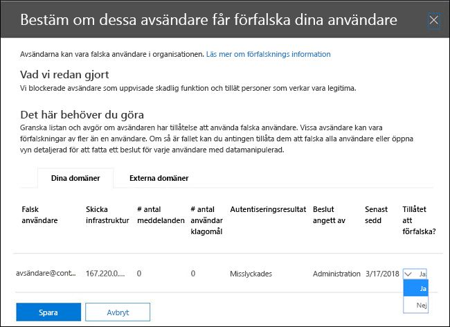

# Läs mer om falska underrättelser

Använd falska underrättelser i &amp; Security Compliance Center på **sidan Inställningar** för skräppost för att granska alla avsändare som förfalskar antingen domäner som ingår i din organisation eller förfalskar externa domäner. Falska underrättelser finns tillgängliga som en del av Office 365 Enterprise E5 eller separat som en del av Advanced Threat Protection (ATP) och från och med oktober 2018 Exchange Online Protection (EOP).

## Vilka typer av e-post förfalskning kan jag granska och som ska jag skydda mot med falska intelligens?

För domäner som du äger kan du granska avsändare som förfalskar din domän och sedan välja att låta avsändaren fortsätta eller blockera avsändaren. För externa domäner kan du tillåta avsändardomänen i kombination med den sändande infrastrukturen, men inte en person som skickar e-postadress.

När en avsändare förfalskar en e-postadress verkar de skicka e-post för ett eller flera användarkonton inom en av organisationens domäner eller en extern domän som skickar till din organisation. Överraskande nog finns det några legitima affärsmässiga skäl för förfalskning. I dessa fall skulle du till exempel inte blockera avsändaren från att förfalska domänen:

- Du har avsändare från tredje part som använder domänen för att skicka massutskick till dina egna anställda för företagsavundersökningar.

- Du har anlitat ett externt företag för att generera och skicka ut reklam- eller produktuppdateringar för din räkning.

- En assistent som regelbundet behöver skicka e-post till en annan person inom organisationen.

- Ett program som är konfigurerat för att förfalska sin egen organisation för att skicka interna meddelanden via e-post.

Externa domäner skickar ofta förfalskad e-post, och många av dessa skäl är legitima. Här är till exempel några legitima fall när externa avsändare skickar förfalskad e-post:

- Avsändaren finns med i en diskussionssändlista och e-postlistan vidarebefordrar e-postmeddelandet från den ursprungliga avsändaren till alla deltagare i e-postlistan.

- Ett externt företag skickar e-post på uppdrag av ett annat företag (till exempel en automatisk rapport eller ett program-som-en-tjänst-företag).

Du behöver ett sätt att se till att e-postmeddelandet som skickas av legitima förfalskare inte fastnar i skräppostfilter i Office 365 eller externa e-postsystem. Normalt behandlar Office 365 dessa e-postmeddelanden som skräppost. Som Office 365-administratör kan du förhindra detta genom att konfigurera falska &amp; filter i Säkerhetsefterlevnadscenter. Om du äger domänen kan du konfigurera SPF, DKIM och DMARC så att dessa avsändare tillåts.

Å andra sidan måste illvilliga spoofers, de avsändare som förfalskar din domän, eller externa domäner, för att skicka skräppost eller nätfiske e-post, blockeras. Spoofing är också ett vanligt sätt för phishers att få användaruppgifter. Office 365 har inbyggt förfalskningsskydd för att skydda din organisation från avsändare av dessa skadliga e-postmeddelanden. Förfalskningsskydd för organisationens domäner är alltid aktiverat för alla Office 365-kunder, och det externa domänskyddet gäller som standard för avancerade hotskyddskunder och från och med oktober 2018 eop-kunder. För att ytterligare stärka detta skydd, tala om för oss vilka avsändare som har behörighet att förfalska din organisations domäner och skicka e-post för din räkning, och om några externa domäner tillåts förfalska. Alla e-postmeddelanden som skickas från en avsändare som du inte godkänner behandlas som skräppost eller förfalskning av Office 365. Håll ett öga på avsändarna som förfalskar din domän och hjälp &amp; oss att förbättra falska underrättelser med hjälp av Security Compliance Center.

## Hantera falska underrättelser i &amp; Security Compliance Center

Den falska underrättelseprincip som du har konfigurerat tillämpas alltid av Office 365. Du kan inte inaktivera den, men du kan välja hur mycket du vill aktivt hantera den.

Du kan granska avsändare som förfalskar din domän eller externa domäner och sedan bestämma om varje avsändare &amp; ska tillåtas göra det med hjälp av Säkerhetsefterlevnadscenter. För varje förfalskat användarkonto som en avsändare förfalskar från din domän eller en extern domän kan du visa informationen i följande tabell.

|**Parametern**|**Beskrivning**|
|:-----|:-----|
|Avsändare    |Kallas även den sanna avsändaren. Detta är vanligtvis den domän från vilken falska e-post kommer. Office 365 bestämmer domänen för pekaren (PTR) DNS-posten för den sändande IP-adressen som förfalskar din organisation. Om ingen domän hittas visas avsändarens IP-adress i stället i rapporten.    |
|Förfalskad användare    |Användarkontot som förfalskas av avsändaren.    **Endast** internfliken. Det här fältet innehåller en enda e-postadress, eller om avsändaren förfalskar flera användarkonton innehåller det **mer än en**.    **Endast extern** flik. Externa domäner innehåller bara en sändande domän och innehåller ingen fullständig e-postadress.    **Tips! För avancerade administratörer.** Den förfalskade användaren är från-adressen (5322.From) som också är den adress som visas som Från-adressen av e-postklienten. Detta kallas ibland adressen header.from. Adressens giltighet kontrolleras inte av SPF.           |
|Antal meddelanden    |Antalet e-postmeddelanden som avsändaren har skickat till din organisation för den identifierade förfalskade avsändarens eller avsändares räkning inom de senaste 30 dagarna.    |
|Antal klagomål från användare    |Klagomål som lämnats in av användare mot denna avsändare av dina användare inom de senaste 30 dagarna. Klagomål är vanligtvis i form av skräp inlagor till Microsoft.    |
|Autentiseringsresultat    |Det här värdet **skickas** om avsändaren har skickat autentiseringskontroller för Exchange Online Protection (EOP), till exempel SPF eller DKIM, **Misslyckades** om avsändaren misslyckades med EOP-avsändarens autentiseringskontroller eller **Okänd** om resultatet av dessa kontroller inte är känt.    |
|Beslut som fastställts av    |Visar om Office 365-administratören eller den falska underrättelseprincipen avgör om avsändaren tillåts förfalska användaren eller inte.    |
|Senast sedd    |Det sista datum då ett meddelande togs emot av den här avsändaren för den här förfalskade användarens räkning.    |
|Får du förfalska?    | Visar om den här avsändaren tillåts skicka e-post för den falska användarens räkning. Möjliga värden inkluderar:    **Ja, det är det** Alla falska adresser från den här förfalskaren kommer att tillåtas att förfalska din organisation.    **Nej, det finns ingen** Falska adresser från den här förfalskande avsändaren kommer inte att tillåtas att förfalska din organisation. I stället markeras meddelanden från den här avsändaren som skräppost av Office 365.    **Vissa användare** Om en avsändare förfalskar flera användare tillåts vissa falska adresser från den här avsändaren att förfalska din organisation, resten markeras som skräppost. Använd fliken **Detaljerad** om du vill visa de specifika adresserna.    |
|Spoof Typ    |Det här värdet är **Internt** om domänen är en av organisationens etablerade domäner, annars är värdet **externt**.    |

 **Så här hanterar du avsändare som förfalskar &amp; din domän med hjälp av Security Compliance Center**

1. Gå till [ &amp; Security Compliance Center](https://protection.office.com).

2. Logga in på Office 365 med ditt arbets- eller skolkonto. Ditt konto måste ha administratörsuppgifter i office 365-organisationen.

3. Expandera **anti-skräppost** **för hothanteringspolicy** \> **Policy** \> i Security &amp; Compliance Center .

    

4. På sidan **Inställningar för skräppostskydd** i den högra rutan bläddrar du nedåt och expanderar **Spoof intelligence policy**.

    

5. Om du vill visa listan över avsändare som förfalskar domänen väljer du **Granska nya avsändare** och väljer fliken **Dina domäner.**

    Om du redan har granskat avsändare och vill ändra några av dina tidigare val kan du välja **Visa avsändare som jag redan har granskat** i stället. I båda fallen visas följande panel.

    

    Varje förfalskad användare visas på en separat rad så att du kan välja om du vill tillåta eller blockera avsändaren från att förfalska varje användare individuellt.

    Om du vill lägga till en avsändare i listan tillåt för en användare väljer du **Ja** i kolumnen **Tillåten att förfalska.** Om du vill lägga till en avsändare i blockeringslistan för en användare väljer du **Nej**.

    Om du vill ange principen för domäner som du inte äger väljer **Yes** du **Allowed to Spoof** fliken **Externa domäner.** Alternativt, om du tror att Office 365 har gjort ett misstag genom att tillåta avsändaren att skicka falska e-postmeddelanden, ändra **kolumnen Tillåtet att förfalska** till **Nej**.

    

6. Välj **Spara** för att spara eventuella ändringar.

Om du har en Office 365 Enterprise E5-prenumeration eller separat har köpt Avancerat skydd mot hot som tillägg kan du även hantera avsändare som förfalskar din domän via [Spoof Intelligence-insikten](walkthrough-spoof-intelligence-insight.md).

## Konfigurera anti-spoofing-policyn

Förutom att tillåta eller blockera en viss avsändare från att skicka förfalskad e-post till din organisation kan du också konfigurera hur strikt du vill att filtret ska vara och åtgärden ska vidtas när ett förfalskningsmeddelande hittas.

Skydd mot förfalskning tillämpas på e-post från avsändare från domäner som är externa till din Office 365-organisation. Du kan tillämpa principen på mottagare vars postlådor är licensierade för Office 365 Enterprise E5, Avancerat skydd mot hot och från och med oktober 2018 eop-kunder. Du hanterar anti-spoofing-principen tillsammans med de andra anti-phishing-inställningarna. Mer information om inställningar mot nätfiske finns i [Konfigurera Office 365 ATP:s principer för phishing och anti-nätfiske](set-up-anti-phishing-policies.md).

Office 365 innehåller standardskydd mot förfalskning som alltid körs. Det här standardskyddet visas &amp; inte i Säkerhetsefterlevnadscenter eller kan hämtas via Windows PowerShell-cmdletar. Du kan inte ändra standardskyddet mot förfalskning. I stället kan du konfigurera hur strikt Office 365 tillämpar skyddet mot förfalskning i varje antivirusprincip som du skapar.

Även om principen mot förfalskning visas under anti-phishing-principen &amp; i Security Compliance Center, ärver den inte standardbeteendet från den befintliga nätfiskeinställningen under konfigurationen mot skräppost. Om du har inställningar under **Anti-spam** \> **Phishing** som du vill replikera för anti-spoofing, måste du skapa en anti-phishing-policy och sedan redigera parodidelen av anti-phishing-principen för att återspegla dina falska inställningar som beskrivs i följande avsnitt, i stället för att acceptera standardinställningarna som körs i bakgrunden.

 **Så här konfigurerar du skydd mot förfalskning inom en anti-phishing-princip med hjälp av Security &amp; Compliance Center**

1. Gå till [ &amp; Security Compliance Center](https://protection.office.com).

2. Logga in på Office 365 med ditt arbets- eller skolkonto. Ditt konto måste ha administratörsuppgifter i office 365-organisationen.

3. &amp; Expandera **Policy** \> **anti-nätfiske** **Threat Management** \> i Säkerhetsefterlevnadscenter .

4. På sidan **Nätfiskeskydd** i den högra rutan väljer du den anti-phishing-princip som du vill konfigurera.

5. På sidan som visas i raden **Spoof** väljer du **Redigera**.

6. Konfigurera sedan åtgärderna så att de ska vidtas när ett meddelande identifieras som en förfalskning mellan domäner. Standardbeteendet är att flytta meddelandet till mottagarens skräppostmapp. Det andra alternativet är att skicka meddelandet till karantänen. Mer information om hur du hanterar meddelanden som skickas till karantän finns [i e-postmeddelanden i karantän i Office 365](quarantine-email-messages.md).

    

7. Gör ditt val och välj sedan **Spara**.

## Andra sätt att hantera förfalskning och nätfiske med Office 365

Var flitig om förfalskning och nätfiske skydd. Här är relaterade sätt att kontrollera avsändare som förfalskar din domän och hjälper till att förhindra att de skadar din organisation:

- Kontrollera rapporten För förfalskning av e-post för Exchange Online som en del av din rutin. Du kan ofta använda den här rapporten för att visa och hantera förfalskade avsändare. Information finns i **Spoof-e-postrapport** i [Använd e-postskyddsrapporter i Office 365 för att visa data om skadlig kod, skräppost och regelidentifieringar](https://docs.microsoft.com/exchange/monitoring/use-mail-protection-reports).

För mer avancerade Office 365-administratörer kan du även utföra följande kontroller:

- Granska konfigurationen av avsändbara principramar (SPF). En introduktion till SPF finns i [Konfigurera SPF i Office 365 för att förhindra förfalskning](set-up-spf-in-office-365-to-help-prevent-spoofing.md), där du även kan konfigurera det snabbt. För att få en djupare förståelse av hur Office 365 använder SPF, eller om du vill veta hur du felsöker eller göra icke-standarddistributioner (t.ex. hybriddistributioner), kan du börja med att läsa [How Office 365 uses Sender Policy Framework (SPF) to prevent spoofing (Så här använder Office 365 SPF för att förhindra förfalskning)](how-office-365-uses-spf-to-prevent-spoofing.md).

- Granska konfigurationen av identifierade e-postmeddelanden (DomainKeys Identified Mail). Du bör använda DKIM tillsammans med SPF och DMARC för att förhindra att förfalskare skickar meddelanden som ser ut som att de kommer från din domän. Med DKIM kan du lägga till en digital signatur i e-postmeddelanden i meddelandehuvudet. Information finns i [Använda DKIM för att validera utgående e-post som skickas från din anpassade domän i Office 365](use-dkim-to-validate-outbound-email.md).

- Granska konfigurationen för domänbaserad meddelandeautentisering, rapportering och överensstämmelse (DMARC). Implementering av DMARC med SPF och DKIM ger ytterligare skydd mot förfalsknings- och nätfiske-e-post. DMARC gör så att mottagande e-postsystem kan bestämma vad som ska göras med meddelanden som skickats från din domän som misslyckas i SPF- eller DKIM-kontroller. Information finns i [Använda DMARC för att validera e-post i Office 365](use-dmarc-to-validate-email.md).

- Använd cmdleten [Get-PhishFilterPolicy](https://docs.microsoft.com/powershell/module/exchange/advanced-threat-protection/get-phishfilterpolicy) i Exchange Online PowerShell eller Exchange Online Protection PowerShell för att samla in detaljerade data om förfalskade avsändare, generera tillåta- och blockeringslistor och hjälpa dig att avgöra hur du skapar mer omfattande SPF-, DKIM- och DMARC DNS-poster utan att din legitima e-post fastnar i externa skräppostfilter. Mer information finns i Så här [fungerar skydd mot förfalskning i Office 365](https://blogs.msdn.microsoft.com/tzink/2016/02/23/how-antispoofing-protection-works-in-office-365/).
