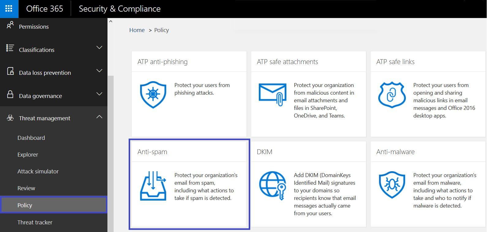

# Läs mer om falska underrättelserLearn more about spoof intelligence

Använd falska uppgifter i &amp; Security Compliance Center på **sidan Inställningar för skräppost** för att granska alla avsändare som förfalskar antingen domäner som ingår i organisationen eller förfalskaexterna externa domäner.Use spoof intelligence in the Security &amp; Compliance Center on the **Anti-spam settings page** to review all senders who are spoofing either domains that are part of your organization, or spoofing external domains. Falska underrättelser finns som en del av Office 365 Enterprise E5 eller separat som en del av Advanced Threat Protection (ATP) och från och med oktober 2018 Exchange Online Protection (EOP).Spoof intelligence is available as part of Office 365 Enterprise E5 or separately as part of Advanced Threat Protection (ATP) and as of October, 2018 Exchange Online Protection (EOP).

## Vilka typer av e-postförfalskning kan jag granska och som ska jag skydda mot med falska intelligens?What types of email spoofing can I review and which should I protect against with spoof intelligence?

För domäner som du äger kan du granska avsändare som förfalskar domänen och sedan väljer att tillåta avsändaren att fortsätta eller blockera avsändaren.For domains you own, you can review senders who are spoofing your domain and then choose to allow the sender to continue or block the sender. För externa domäner kan du tillåta avsändardomänen i kombination med den sändande infrastrukturen, men inte en enskild skickae-postadress.For external domains, you can allow the sender domain combined with the sending infrastructure, although not an individual sending email address.

När en avsändare förfalskar en e-postadress verkar de skicka e-post för ett eller flera användarkonton inom någon av organisationens domäner eller en extern domän som skickas till din organisation.When a sender spoofs an email address, they appear to be sending mail on behalf of one or more user accounts within one of your organization's domains, or an external domain sending to your organization. Överraskande nog finns det några legitima affärsskäl för förfalskning.Surprisingly, there are some legitimate business reasons for spoofing. I dessa fall blockerar du till exempel inte avsändaren från att förfalska domänen:For example, in these cases, you wouldn't block the sender from spoofing your domain:

- Du har avsändare från tredje part som använder domänen för att skicka massutskick till dina egna anställda för företagsomröstningar.You have third-party senders who use your domain to send bulk mail to your own employees for company polls.

- Du har anlitat ett externt företag för att generera och skicka ut reklam eller produktuppdateringar för din räkning.You have hired an external company to generate and send out advertising or product updates on your behalf.

- En assistent som regelbundet behöver skicka e-post till en annan person inom organisationen.An assistant who regularly needs to send email for another person within your organization.

- Ett program som är konfigurerat för att förfalska sin egen organisation för att skicka interna meddelanden via e-post.An application that is configured to spoof its own organization in order to send internal notifications by email.

Externa domäner skickar ofta falska e-postmeddelanden, och många av dessa skäl är legitima.External domains frequently send spoofed email, and many of these reasons are legitimate. Här är till exempel några legitima fall när externa avsändare skickar förfalskad e-post:For example, here are some legitimate cases when external senders send spoofed email:

- Avsändaren finns med i en diskussionssändlista och e-postlistan vidarebefordrar e-postmeddelandet från den ursprungliga avsändaren till alla deltagare i e-postlistan.The sender is on a discussion mailing list, and the mailing list is relaying the email from the original sender to all the participants on the mailing list.

- Ett externt företag skickar e-post för ett annat företags räkning (till exempel en automatiserad rapport eller ett program-som-ett-tjänst-företag).An external company is sending email on behalf of another company (for example, an automated report, or a software-as-a-service company).

Du behöver ett sätt att se till att den post som skickas av legitima förfalskningar inte fastnar i skräppostfilter i Office 365 eller externa e-postsystem.You need a way to ensure that the mail sent by legitimate spoofers doesn't get caught up in spam filters in Office 365 or external email systems. Normalt behandlar Office 365 dessa e-postmeddelanden som skräppost.Normally, Office 365 treats these email messages as spam. Som Office 365-administratör kan du förhindra detta genom att konfigurera förfalskningsfilter i Säkerhetsefterlevnadscenter. &amp;As an Office 365 admin, you have the ability to prevent this by setting up spoof filters in the Security &amp; Compliance Center. Om du äger domänen kan du konfigurera SPF, DKIM och DMARC så att dessa avsändare tillåts.If you own the domain, you can configure SPF, DKIM, and DMARC to allow for these senders.

Å andra sidan måste skadliga förfalskningar, de avsändare som förfalskar din domän eller externa domäner, för att skicka skräppost eller nätfiskee, blockeras.On the other hand, malicious spoofers, those senders that are spoofing your domain, or external domains, to send spam or phishing email, need to be blocked. Förfalskning är också ett vanligt sätt för phishers att få användarreferenser.Spoofing is also a common way for phishers to get user credentials. Office 365 har inbyggt förfalskningsskydd för att skydda din organisation från avsändare av dessa skadliga e-postmeddelanden.Office 365 has built-in spoof protection to help shield your organization from senders of these malicious emails. Spoof skydd för din organisations domäner är alltid på för alla Office 365-kunder, och externa domän förfalskning skydd är på som standard för Advanced Threat Protection kunder och från och med oktober, 2018 EOP kunder också.Spoof protection for your organization's domains is always on for all Office 365 customers, and external domain spoof protection is on by default for Advanced Threat Protection customers and as of October, 2018 EOP customers as well. För att ytterligare stärka detta skydd, berätta vilka avsändare som är auktoriserade att förfalska din organisations domäner och skicka e-post för din räkning, och om några externa domäner är tillåtna att förfalska.To further strengthen this protection, tell us which senders are authorized to spoof your organization's domains and send email on your behalf, and if any external domains are permitted to spoof. Alla e-postmeddelanden som skickas från en avsändare som du inte har behörighet kommer att behandlas som skräppost eller förfalskning av Office 365.Any email sent from a sender that you don't authorize will be treated as spam or spoofing by Office 365. Håll ett öga på avsändarna som förfalskar din domän och hjälper &amp; oss att förbättra falska underrättelser med hjälp av Security Compliance Center.Keep an eye on the senders spoofing your domain and help us improve spoof intelligence by using the Security &amp; Compliance Center.

## Hantera falska underrättelser i &amp; Security Compliance CenterManaging spoof intelligence in the Security &amp; Compliance Center

Den falska underrättelsepolicy som du har konfigurerat tillämpas alltid av Office 365.The spoof intelligence policy you set up is always enforced by Office 365. Du kan inte inaktivera den, men du kan välja hur mycket du vill hantera den aktivt.You cannot disable it, but you can choose how much you want to actively manage it.

Du kan granska avsändare som förfalskar domänen eller externa domäner och sedan bestämma om varje avsändare &amp; ska tillåtas att göra det med hjälp av Security Compliance Center.You can review the senders who are spoofing your domain, or external domains, and then decide whether each sender should be allowed to do so by using the Security &amp; Compliance Center. För varje förfalskat användarkonto som en avsändare förfalskar från domänen eller en extern domän kan du visa informationen i följande tabell.For each spoofed user account that a sender spoofs from your domain or an external domain, you can view the information in the following table.

|**Parametern****Parameter**|**Beskrivning****Description**|
|:-----|:-----|
|AvsändarenSender    |Även kallad den sanna avsändaren.Also called the true sender. Detta är vanligtvis den domän från vilken falska e-post kommer.This is usually the domain from which the spoof email originates. Office 365 bestämmer domänen för pekaren (PTR) DNS-posten för den sändande IP-adressen som förfalskar din organisation.Office 365 determines the domain of the pointer (PTR) DNS record of the sending IP address that is spoofing your organization. Om ingen domän hittas visas avsändarens IP-adress i stället.If no domain is found, the report displays the sender's IP address instead.    |
|Förfalskad användareSpoofed user    |Användarkontot som förfalskas av avsändaren.The user account that is being spoofed by the sender.    **Endast intern** flik.**Internal** tab only. Det här fältet innehåller en enda e-postadress, eller om avsändaren förfalskar flera användarkonton innehåller det **mer än en**.This field contains a single email address, or if the sender is spoofing multiple user accounts, it contains **More than one**.    **Endast extern** flik.**External** tab only. Externa domäner innehåller bara en skickande domän och innehåller inte en fullständig e-postadress.External domains only contain a sending domain, and do not contain a full email address.    **Tips! För avancerade administratörer.****Tip! For advanced admins.** Den förfalskade användaren är adressen Från (5322.From) som också är den adress som visas som från-adressen av e-postklienten.The spoofed user is the From (5322.From) address which is also the address displayed as the From address by the mail client. Detta kallas ibland header.from-adressen.This is sometimes called the header.from address. Giltigheten av denna adress kontrolleras inte av SPF.The validity of this address is not checked by SPF.           |
|Antal meddelandenNumber of messages    |Antalet e-postmeddelanden som avsändaren skickar till din organisation för den identifierade avsändareeller avsändare under de senaste 30 dagarna.The number of mail messages sent by the sender to your organization on behalf of the identified spoofed sender or senders within the last 30 days.    |
|Antal klagomål från användareNumber of user complaints    |Klagomål som lämnats in av användare mot denna avsändare av dina användare inom de senaste 30 dagarna.Complaints filed by users against this sender by your users within the last 30 days. Klagomål är vanligtvis i form av skräp inlagor till Microsoft.Complaints are usually in the form of junk submissions to Microsoft.    |
|AutentiseringsresultatAuthentication result    |Det här värdet **skickas** om avsändaren skickade EOP-verifieringskontroller (Exchange Online Protection), till exempel SPF eller DKIM, **Misslyckades** om avsändaren misslyckades med EOP-autentiseringskontroller eller **okänd** om resultatet av dessa kontroller inte är känt.This value is **Passed** if the sender passed Exchange Online Protection (EOP) sender authentication checks, such as SPF or DKIM, **Failed** if the sender failed EOP sender authentication checks, or **Unknown** if the result of these checks isn't known.    |
|Beslut som fastställts avDecision set by    |Visar om Office 365-administratören eller policyn för falska underrättelseprinciper avgjorde om avsändaren får förfalska användaren eller inte.Shows whether the Office 365 administrator or the spoof intelligence policy determined whether or not the sender is allowed to spoof the user.    |
|Senast seddLast seen    |Det sista datum då ett meddelande togs emot av avsändaren för den här förfalskade användarens räkning.The last date on which a message was received by this sender on behalf of this spoofed user.    |
|Får du förfalska?Allowed to spoof?    | Visar om den här avsändaren får skicka e-post för den förfalskade användarens räkning.Displays whether or not this sender is allowed to send email on behalf of the spoofed user. Möjliga värden är:Possible values include:    **Ja, det är jag** Alla falska adresser från denna falska avsändare kommer att tillåtas att förfalska din organisation.**Yes** All spoofed addresses from this spoofing sender will be allowed to spoof your organization.    **Nej, det är inte** Falska adresser från den här förfalskningsavsändaren får inte förfalska din organisation.**No** Spoofed addresses from this spoofing sender won't be allowed to spoof your organization. I stället markeras meddelanden från den här avsändaren som skräppost av Office 365.Instead, messages from this sender will be marked as spam by Office 365.    **Vissa användare** Om en avsändare förfalskar flera användare, kommer vissa falska adresser från den här avsändaren att tillåtas att förfalska din organisation, resten kommer att markeras som skräppost.**Some users** If a sender is spoofing multiple users, some spoofed addresses from this sender will be allowed to spoof your organization, the rest will be marked as spam. Använd fliken **Detaljerad** för att se de specifika adresserna.Use the **Detailed** tab to see the specific addresses.    |
|Parodi typSpoof Type    |Det här värdet är **internt** om domänen är en av organisationens etablerade domäner, annars är värdet **externt**.This value is **Internal** if the domain is one of your organization's provisioned domains, otherwise the value is **External**.    |

 **Så här hanterar du avsändare som förfalskar &amp; din domän med hjälp av Security Compliance Center****To manage senders who are spoofing your domain by using the Security &amp; Compliance Center**

1. Gå till [ &amp; Security Compliance Center](https://protection.office.com).Go to the [Security &amp; Compliance Center](https://protection.office.com).

2. Logga in på Office 365 med ditt arbets- eller skolkonto.Sign in to Office 365 with your work or school account. Ditt konto måste ha administratörsuppgifter i din Office 365-organisation.Your account must have administrator credentials in your Office 365 organization.

3. Expandera **policy** \> **mot** \> **skräppost**i Security &amp; Compliance Center .In the Security &amp; Compliance Center, expand **Threat Management** \> **Policy** \> **Anti-spam**.

    

4. På sidan **Inställningar för skräppost** i den högra rutan bläddrar du nedåt och expanderar Policy för **spoof-intelligens**.On the **Anti-spam settings** page in the right pane, scroll down and expand **Spoof intelligence policy**.

    

5. Om du vill visa listan över avsändare som avfalskar domänen väljer du **Granska nya avsändare** och väljer fliken **Dina domäner.**To view the list of senders spoofing your domain, choose **Review new senders** and select the **Your Domains** tab.

    Om du redan har granskat avsändare och vill ändra några av dina tidigare val kan du välja **Visa mig avsändare som jag redan har granskat** i stället.If you've already reviewed senders, and want to change some of your previous choices, you can choose **Show me senders I already reviewed** instead. I båda fallen visas följande panel.In either case, the following panel appears.

    

    Varje förfalskad användare visas i en separat rad så att du kan välja om du vill tillåta eller blockera avsändaren från förfalskning av varje användare individuellt.Each spoofed user is displayed in a separate row so that you can choose whether to allow or block the sender from spoofing each user individually.

    Om du vill lägga till en avsändare i listan tillåt för en användare väljer du **Ja** i kolumnen **Tillåten förfalskning.**To add a sender to the allow list for a user, select **Yes** from the **Allowed to spoof** column. Om du vill lägga till en avsändare i blockeringslistan för en användare väljer du **Nej**.To add a sender to the block list for a user, choose **No**.

    Om du vill ange principen för domäner som du inte äger väljer **Yes** du fliken **Allowed to Spoof** **Externa domäner.**To set the policy for domains you do not own, select the **External Domains** tab. Change any sender to **Yes** in the **Allowed to Spoof** column to permit that sender to send unauthenticated email into your organization. Om du tror att Office 365 har gjort ett misstag när du tillåter avsändaren att skicka skicka förfalskad e-post ändrar du kolumnen **Tillåten förfalskning till** **Nej**.Alternatively, if you think Office 365 has made a mistake in permitting the sender to send spoofed email, change the **Allowed to spoof** column to **No**.

    

6. Välj **Spara** om du vill spara ändringarna.Choose **Save** to save any changes.

Om du har en Office 365 Enterprise E5-prenumeration eller har köpt Avancerat hotskydd separat som tillägg kan du också hantera avsändare som förfalskar domänen via [Spoof Intelligence Insight](https://docs.microsoft.com/office365/securitycompliance/walkthrough-spoof-intelligence-insight).If you have an Office 365 Enterprise E5 subscription or have separately purchased Advanced Threat Protection as an add-on, you can also manage senders who are spoofing your domain through the [Spoof Intelligence Insight](https://docs.microsoft.com/office365/securitycompliance/walkthrough-spoof-intelligence-insight).

## Konfigurera anti-spoofing-policynConfiguring the anti-spoofing policy

Förutom att tillåta eller blockera en viss avsändare från att skicka falska e-postmeddelanden till din organisation kan du också konfigurera hur strikt du vill att filtret ska vara och åtgärden ska vidtas när ett förfalskningsmeddelande hittas.In addition to allowing or blocking a particular sender from sending spoofed email into your organization, you can also configure how strict you want the filter to be, and the action to take when a spoofing message is found.

Anti-förfalskningsskydd tillämpas på e-post från avsändare från domäner som är externa till din Office 365-organisation.Anti-spoofing protection is applied to email from senders from domains that are external to your Office 365 organization. Du kan tillämpa principen på mottagare vars postlådor är licensierade för Office 365 Enterprise E5, Avancerat hotskydd och från och med oktober 2018, EOP-kunder också.You can apply the policy to recipients whose mailboxes are licensed for Office 365 Enterprise E5, Advanced Threat Protection and as of October, 2018 EOP customers as well. Du hanterar anti-förfalskningsprincipen tillsammans med andra inställningar mot nätfiske.You manage the anti-spoofing policy along with the other anti-phishing settings. Mer information om inställningar för nätfiske i Motfiske finns i [Konfigurera Office 365 ATP-policyer mot nätfiske och nätfiske](set-up-anti-phishing-policies.md).For more information about anti-phishing settings, see [Set up Office 365 ATP anti-phishing and anti-phishing policies](set-up-anti-phishing-policies.md).

Office 365 innehåller standardskydd mot förfalskning som alltid körs.Office 365 includes default anti-spoofing protection that's always running. Det här standardskyddet visas &amp; inte i Security Compliance Center eller kan hämtas via Windows PowerShell-cmdlets.This default protection is not visible in the Security &amp; Compliance Center or retrievable through Windows PowerShell cmdlets. Du kan inte ändra standardskyddet för antiförfalskning.You can't modify the default anti-spoofing protection. I stället kan du konfigurera hur strikt Office 365 tillämpar anti-förfalskningsskyddet i varje anti-phishing-princip som du skapar.Instead, you can configure how strictly Office 365 enforces the anti-spoofing protection in each anti-phishing policy that you create.

Även om anti-förfalskningsprincipen visas under anti-phishing-principen &amp; i Security Compliance Center ärver den inte sitt standardbeteende från den befintliga nätfiskeinställningen under anti-spam-konfigurationen.Even though the anti-spoofing policy appears under the anti-phishing policy in the Security &amp; Compliance Center, it does not inherit its default behavior from the existing phishing setting under the Anti-spam configuration. Om du har inställningar under **Nätfiske mot** **skräppost** \> som du vill replikera för anti-förfalskning måste du skapa en anti-phishing-policy och sedan redigera parodidelen av anti-phishing-principen för att återspegla dina falska inställningar enligt beskrivningen i följande avsnitt, i stället för att acceptera standardinställningarna som körs i bakgrunden.If you have settings under **Anti-spam** \> **Phishing** that you want to replicate for anti-spoofing, you will need to create an anti-phishing policy, then edit the spoof portion of the anti-phishing policy to reflect your spoof settings as described in the following section, rather than accepting the default settings that run in the background.

 **Så här konfigurerar du anti-förfalskningsskydd i en &amp; anti-phishing-princip med hjälp av Security Compliance Center****To configure anti-spoofing protection within an anti-phishing policy by using the Security &amp; Compliance Center**

1. Gå till [ &amp; Security Compliance Center](https://protection.office.com).Go to the [Security &amp; Compliance Center](https://protection.office.com).

2. Logga in på Office 365 med ditt arbets- eller skolkonto.Sign in to Office 365 with your work or school account. Ditt konto måste ha administratörsuppgifter i din Office 365-organisation.Your account must have administrator credentials in your Office 365 organization.

3. Expandera **policy** \> **mot** \> **nätfiske**i Säkerhetsefterlevnadscenter &amp; .In the Security &amp; Compliance Center, expand **Threat Management** \> **Policy** \> **Anti-phishing**.

4. På sidan **Anti-phishing** i den högra rutan väljer du den anti-phishing-princip som du vill konfigurera.On the **Anti-phishing** page in the right pane, select the anti-phishing policy you want to configure.

5. Välj **Redigera**på sidan som visas på raden **Spoof.**On the page that appears, in the **Spoof** row, choose **Edit**.

6. Konfigurera sedan de åtgärder som ska vidtas när ett meddelande identifieras som en korsdomänsparodi.Next, configure the actions to take when a message is detected as a cross-domain spoof. Standardbeteendet är att flytta meddelandet till mottagarens skräppostmapp.The default behavior is to move the message to the recipient's junk email folder. Det andra alternativet är att skicka meddelandet till karantänen.The other option is to send the message to the quarantine. Mer information om hur du hanterar meddelanden som skickas till karantän finns [i Karantänmeddelanden i Office 365](quarantine-email-messages.md).For more information about managing messages sent to quarantine, see [Quarantine email messages in Office 365](quarantine-email-messages.md).

    

7. Gör ditt val och välj sedan **Spara**.Make your choice and then choose **Save**.

## Andra sätt att hantera förfalskning och nätfiske med Office 365Other ways to manage spoofing and phishing with Office 365

Var flitig om förfalskning och phishing-skydd.Be diligent about spoofing and phishing protection. Här är relaterade sätt att kontrollera avsändare som förfalskar din domän och hjälper till att förhindra att de skadar din organisation:Here are related ways to check on senders spoofing your domain and help prevent them from damaging your organization:

- Kontrollera exchange onlineskyddsrapporten som en del av din rutin.Check the Exchange Online Protection spoof mail report as part of your routine. Du kan använda den här rapporten ofta för att visa och hjälpa till att hantera förfalskade avsändare.You can use this report often to view and help manage spoofed senders. Information finns i **Spoof-e-postrapport** i [Använd e-postskyddsrapporter i Office 365 för att visa data om skadlig programvara, skräppost och regelidentifieringar](https://docs.microsoft.com/exchange/monitoring/use-mail-protection-reports).For information, see **Spoof mail report** in [Use mail protection reports in Office 365 to view data about malware, spam, and rule detections](https://docs.microsoft.com/exchange/monitoring/use-mail-protection-reports).

För mer avancerade Office 365-administratörer kan du också slutföra dessa kontroller:For more advanced Office 365 admins, you can also complete these checks:

- Granska spf-konfigurationen (Sender Policy Framework).Review your Sender Policy Framework (SPF) configuration. En snabb introduktion till SPF och konfigurerad snabbt finns [i Konfigurera SPF i Office 365 för att förhindra förfalskning](set-up-spf-in-office-365-to-help-prevent-spoofing.md).For a quick introduction to SPF and to get it configured quickly, see [Set up SPF in Office 365 to help prevent spoofing](set-up-spf-in-office-365-to-help-prevent-spoofing.md). En mer djupgående förståelse för hur Office 365 använder SPF eller för felsökning eller icke-standardiserade distributioner, till exempel hybriddistributioner, börjar med [Hur Office 365 använder SPF (Sender Policy Framework) för att förhindra förfalskning](how-office-365-uses-spf-to-prevent-spoofing.md).For a more in-depth understanding of how Office 365 uses SPF, or for troubleshooting or non-standard deployments such as hybrid deployments, start with [How Office 365 uses Sender Policy Framework (SPF) to prevent spoofing](how-office-365-uses-spf-to-prevent-spoofing.md).

- Granska din Konfiguration av Domännycklar identifierade e-post (DKIM).Review your DomainKeys Identified Mail (DKIM) configuration. Du bör använda DKIM utöver SPF och DMARC för att förhindra spoofers från att skicka meddelanden som ser ut som de kommer från din domän.You should use DKIM in addition to SPF and DMARC to help prevent spoofers from sending messages that look like they are coming from your domain. Med DKIM kan du lägga till en digital signatur i e-postmeddelanden i meddelandehuvudet.DKIM lets you add a digital signature to email messages in the message header. Information finns i [Använda DKIM för att validera utgående e-post som skickas från din anpassade domän i Office 365](use-dkim-to-validate-outbound-email.md).For information, see [Use DKIM to validate outbound email sent from your custom domain in Office 365](use-dkim-to-validate-outbound-email.md).

- Granska din domänbaserade dmarc-konfiguration (Message Authentication, Reporting och Conformance).Review your Domain-based Message Authentication, Reporting, and Conformance (DMARC) configuration. Implementering av DMARC med SPF och DKIM ger ytterligare skydd mot förfalskning och phishing-e-post.Implementing DMARC with SPF and DKIM provides additional protection against spoofing and phishing email. DMARC hjälper till att ta emot e-postsystem avgöra vad du ska göra med meddelanden som skickas från din domän som misslyckas SPF eller DKIM kontroller.DMARC helps receiving mail systems determine what to do with messages sent from your domain that fail SPF or DKIM checks. Information finns i [Använda DMARC för att validera e-post i Office 365](use-dmarc-to-validate-email.md).For information, see [Use DMARC to validate email in Office 365](use-dmarc-to-validate-email.md).

- Använd [Cmdlet Get-PhishFilterPolicy](https://docs.microsoft.com/powershell/module/exchange/advanced-threat-protection/get-phishfilterpolicy) i Exchange Online PowerShell eller Exchange Online Protection PowerShell för att samla in detaljerade data om falska avsändare, generera tillåt- och blockeringslistor och hjälpa dig att avgöra hur du skapar mer omfattande SPF-, DKIM- och DMARC DNS-poster utan att din legitima e-post fastnar i externa skräppostfilter.Use the [Get-PhishFilterPolicy](https://docs.microsoft.com/powershell/module/exchange/advanced-threat-protection/get-phishfilterpolicy) cmdlet in Exchange Online PowerShell or Exchange Online Protection PowerShell to gather detailed data on spoofed senders, generate allow and block lists, and help you determine how to generate more comprehensive SPF, DKIM, and DMARC DNS records without having your legitimate email get caught in external spam filters. Mer information finns i [Så här fungerar skyddet för antispoofing i Office 365](https://blogs.msdn.microsoft.com/tzink/2016/02/23/how-antispoofing-protection-works-in-office-365/).For more information, see [How antispoofing protection works in Office 365](https://blogs.msdn.microsoft.com/tzink/2016/02/23/how-antispoofing-protection-works-in-office-365/).
