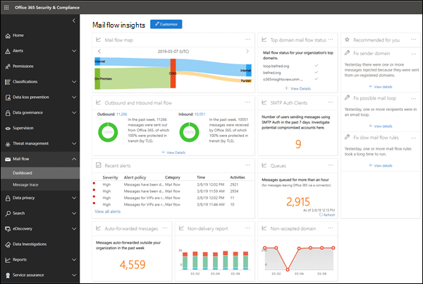

# E-postflödesinsikter i Säkerhets- och efterlevnadscenter

[!INCLUDE [Microsoft 365 Defender rebranding](../includes/microsoft-defender-for-office.md)]

**Gäller för**
- [Exchange Online Protection](exchange-online-protection-overview.md)
- [Microsoft Defender för Office 365 Abonnemang 1 och Abonnemang 2](office-365-atp.md)
- [Microsoft 365 Defender](../mtp/microsoft-threat-protection.md)

Administratörer kan använda instrumentpanelen för e-postflöde i säkerhets- och efterlevnadscentret för & för att upptäcka trender, insikter och vidta åtgärder för att åtgärda problem som rör e-postflödet i organisationen.

De tillgängliga insikterna är:

- [Auto-vidarebefordrade meddelanden insikt](mfi-auto-forwarded-messages-report.md)

- [Åtgärda möjliga insikter om e-postslingan](mfi-mail-loop-insight.md)1

- [Åtgärda insikter för långsamt e-postflödesregler](mfi-slow-mail-flow-rules-insight.md)1

- [E-postflödeskarta](mfi-mail-flow-map-report.md)

- [Nya domäner som vidarebefordras e-postinsikt](mfi-new-domains-being-forwarded-email.md)2

- [Nya användare som vidarebefordrar e-postinsikt](mfi-new-users-forwarding-email.md)2

- [Rapport om icke godkänd domän](mfi-non-accepted-domain-report.md)

- [Rapport om misslyckad leverans](mfi-non-delivery-report.md)

- [Insikt om utgående och inkommande e-postflöden](mfi-outbound-and-inbound-mail-flow.md)

- [Köer insikt](mfi-queue-alerts-and-queues.md)

- [SMTP Auth-klienter insikt och rapport](mfi-smtp-auth-clients-report.md)

- [Insikten E-postflödesstatus för översta domäner](mfi-domain-mail-flow-status-insight.md)

1 Den här insikten visas i **området Rekommenderas för** dig på instrumentpanelen för e-postflöde först när problemet har upptäckts. Annars visas det inte.

2 Den här insikten visas inte på instrumentpanelen  för e-postflöde, men visas på sidan för vidarebefordransrapport när problemet har upptäckts. Annars visas det inte.

## Behörigheter som krävs för att visa instrumentpanelen för e-postflöde

Instrumentpanelen för e-postflöde är tillgänglig för medlemmar i följande rollgrupper:

- **Organisationshantering** i Säkerhets- & Efterlevnadscenter (globala administratörer).

- **[Exchange-administratör](/azure/active-directory/users-groups-roles/directory-assign-admin-roles#exchange-administrator)** i Azure Active Directory.

- **MailFlow-administratör** i Säkerhets- & Säkerhets- och efterlevnadscenter. Om kontot inte också är medlem i rollgrupperna Organisationshantering eller Exchange-administratör bör du tänka på följande:
  - Användaren måste logga in på säkerhets- & säkerhets- och efterlevnadscentret direkt på <https://protection.office.com> .
  - Användaren har bara skrivskyddsbehörighet till instrumentpanelen för e-postflöde.
  - Användaren har inte åtkomst till administrationscentret för Microsoft 365.

Mer information om behörigheter finns i Behörigheter i Säkerhets- och [& säkerhets- och](permissions-in-the-security-and-compliance-center.md) efterlevnadscenter och Ge användare åtkomst till Säkerhets- [& efterlevnadscenter.](grant-access-to-the-security-and-compliance-center.md)

## Här hittar du instrumentpanelen för e-postflöde

Öppna Säkerhets- & efterlevnadscenter på <https://protection.office.com> , expandera **E-postflöde** och välj sedan **Instrumentpanel**.

Gå direkt till instrumentpanelen för e-postflöde genom att öppna <https://protection.office.com/mailflow/dashboard> .