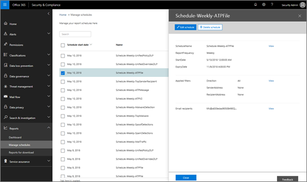

# Hantera scheman för flera &amp; rapporter i Security Compliance Center

I Security &amp; Compliance Center finns flera [rapporter och insikter](reports-and-insights-in-security-and-compliance.md) tillgängliga för att hjälpa organisationens säkerhetsteam att minska och hantera hot mot din organisation. Om du är medlem i organisationens säkerhetsteam kan du hantera scheman för en eller flera rapporter. 
  
## Hantera scheman för rapporter

> [!IMPORTANT]
> Kontrollera att du har de behörigheter som krävs [tilldelade i &amp; Säkerhetsefterlevnadscenter](permissions-in-the-security-and-compliance-center.md). I allmänhet kan globala administratörer, säkerhetsadministratörer och säkerhetsläsare komma åt rapporter i Security &amp; Compliance Center. 
  

1. Gå [https://protection.office.com](https://protection.office.com) till och logga in. Detta tar dig till Security & Compliance Center.

2. Gå till &amp; **Rapporter** \> hantera scheman i Säkerhetsefterlevnadscenter. **Manage schedules**
    
3. Markera ett objekt i listan.
    
4. Granska informationen för rapportens schema.
    
5. Redigera eller ta bort schemat när det är lämpligt och klicka sedan på **Stäng**.
    
## Relaterade ämnen

[Rapporter och insikter i &amp; Security Compliance Center](reports-and-insights-in-security-and-compliance.md)
  
[Skapa ett schema för en &amp; rapport i Säkerhetsefterlevnadscenter](create-a-schedule-for-a-report.md)
  
[Ladda ned en anpassad &amp; rapport i Security Compliance Center](set-up-and-download-a-custom-report.md)
  
[Hämta befintliga rapporter &amp; i Security Compliance Center](download-existing-reports.md)
  

