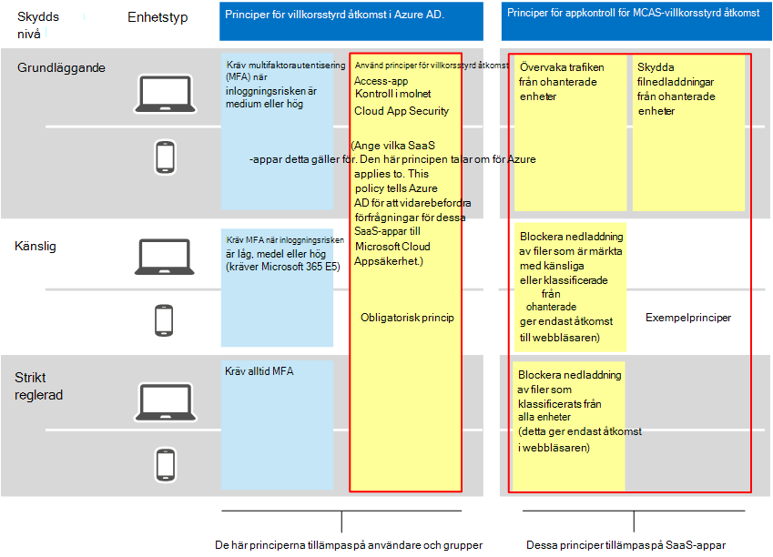
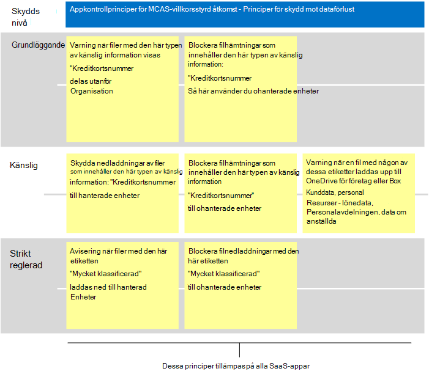

# Rekommenderade Microsoft Cloud App Security principer för SaaS-appar
Microsoft Cloud App Security bygger på villkorliga åtkomstprinciper i Azure AD för att aktivera övervakning i realtid och kontroll av detaljerade åtgärder med SaaS-appar, till exempel blockera nedladdningar, uppladdningar, kopiera och klistra in och skriva ut. Den här funktionen ger säkerhet till sessioner som medför risker, till exempel när företagsresurser används från ohanterade enheter eller av gästanvändare.

Microsoft Cloud App Security kan också integreras inbyggt med Microsoft Information Protection, som tillhandahåller kontroll av innehåll i realtid för att hitta känsliga data baserat på typer av känslig information och känslighetsetiketter och för att vidta lämpliga åtgärder.

Den här vägledningen innehåller rekommendationer för följande scenarier:

- Lägga till SaaS-appar i IT-hantering
- Justera skyddet för specifika SaaS-appar
- Konfigurera skydd mot dataförlust (DLP) för att följa dataskyddsförordningen

## Lägga till SaaS-appar i IT-hantering

Det första steget i att Microsoft Cloud App Security och hantera SaaS-appar är att upptäcka dem och sedan lägga till dem i Azure AD-klientorganisationen. Om du behöver hjälp med identifiering kan du [gå till Upptäck och hantera SaaS-appar i ditt nätverk.](/cloud-app-security/tutorial-shadow-it) När du har hittat appar kan du lägga [till dem i Azure AD-klientorganisationen.](/azure/active-directory/manage-apps/add-application-portal)

Du kan börja hantera dessa genom att göra följande:

1. I Azure AD skapar du först en ny princip för villkorsstyrd åtkomst och konfigurerar den till "Använd villkorsstyrd åtkomstappkontroll". Då omdirigeras begäran till Cloud App Security. Du kan skapa en princip och lägga till alla SaaS-appar till den här principen.
1. I nästa steg Cloud App Security du sessionsprinciper. Skapa en princip för varje kontroll som du vill använda.

Behörigheter till SaaS-appar baseras vanligtvis på affärs behov för åtkomst till appen. De här behörigheterna kan vara mycket dynamiska. Genom att Cloud App Security principer skyddas programdata, oavsett om användare tilldelas till en Azure AD-grupp som är associerad med originalplan, känslig eller starkt reglerad skydd.

För att skydda data i din samling av SaaS-appar visar följande diagram den villkorsstyrda åtkomstprincipen i Azure AD samt föreslagna principer som du kan skapa i Cloud App Security. I det här exemplet gäller de principer som skapats Cloud App Security alla SaaS-appar som du hanterar. De är utformade för att tillämpa lämpliga kontroller baserat på huruvida enheter hanteras samt känslighetsetiketter som redan används i filer.

I följande tabell visas den nya villkorsstyrda åtkomstprincipen som du måste skapa i Azure AD.

|Skyddsnivå|Princip|Mer information|
|---|---|---|
|Alla skyddsnivåer|[Använda programkontroll för villkorsstyrd åtkomst i Cloud App Security](/cloud-app-security/proxy-deployment-aad#configure-integration-with-azure-ad)|Detta konfigurerar din IdP (Azure AD) att fungera med Cloud App Security.|
||||

I nästa tabell visas exempelprinciperna som visas ovan som du kan skapa för att skydda alla SaaS-appar. Se till att utvärdera dina egna mål för företag, säkerhet och efterlevnad och sedan skapa principer som ger det mest lämpliga skyddet för din miljö.

|Skyddsnivå|Princip|
|---|---|
|Grundläggande|Övervaka trafiken från ohanterade enheter 
 Skydda filnedladdningar från ohanterade enheter|
|Känslig|Blockera nedladdning av filer som är märkta med känsliga eller klassificerade från ohanterade enheter (detta ger endast åtkomst till webbläsaren)|
|Strikt reglerad|Blockera nedladdning av filer som klassificerats från alla enheter (detta ger endast åtkomst i webbläsaren)|
|||

Det finns en fullständig instruktioner för hur du inställningar för villkorsstyrd åtkomstappkontroll finns i Distribuera [villkorsstyrd åtkomstappkontroll för aktuella program.](/cloud-app-security/proxy-deployment-aad) I den här artikeln får du hjälp med att skapa den villkorsstyrda åtkomstprincipen i Azure AD och testa SaaS-appar.

Mer information finns i Skydda [appar med hjälp Microsoft Cloud App Security villkorsstyrd åtkomstappkontroll](/cloud-app-security/proxy-intro-aad).

## Justera skyddet för specifika SaaS-appar

Du kanske vill tillämpa ytterligare övervakning och kontroller på specifika SaaS-appar i din miljö. Cloud App Security dig att göra detta. Om till exempel en app som Box används hårt i din miljö är det bra att tillämpa ytterligare kontroller. Om din juridiska eller finansiella avdelning använder en särskild SaaS-app för känsliga affärsdata kan du rikta ett extra skydd till dessa appar.

Du kan till exempel skydda Box-miljön med dessa inbyggda mallar för avvikande identifieringsprincip:

- Aktivitet från anonyma IP-adresser
- Aktivitet från det land du sällan använder
- Aktivitet från misstänkta IP-adresser
- Omöjligt att resa
- Aktivitet som utförs av en användare som säger upp användaren (kräver AAD som IdP)
- Identifiering av skadlig programvara
- Flera misslyckade inloggningsförsök
- Utpressningstrojaner
- Riskabel Oauth-app
- Ovanlig fildelningsaktivitet

Det här är exempel. Ytterligare principmallar läggs till regelbundet. Exempel på hur du kan tillämpa ytterligare skydd på specifika appar finns i [Skydda anslutna appar](/cloud-app-security/protect-connected-apps).

[Hur Cloud App Security hjälper till](/cloud-app-security/protect-box) att skydda Box-miljön visar vilka typer av kontroller som kan hjälpa dig att skydda affärsdata i Box och andra appar med känsliga data.

## Konfigurera skydd mot dataförlust (DLP) för att följa dataskyddsförordningen

Cloud App Security kan vara ett värdefullt verktyg för att konfigurera skydd för efterlevnadsföreskrifter. I det här fallet kan du skapa specifika principer för att söka efter specifika data som en regel gäller för och konfigurera varje princip för att vidta lämpliga åtgärder.

Följande bild och tabell innehåller flera exempel på principer som kan konfigureras för att hjälpa till att uppfylla dataskyddsförordningen (GDPR). I de här exemplen söker principer efter specifika data. Utifrån datakänsligheten är varje princip konfigurerad för att vidta lämpliga åtgärder.

|Skyddsnivå|Exempelprinciper|
|---|---|
|Grundläggande|Varning när filer som innehåller den här typen av känslig information ("kreditkortsnummer") delas utanför organisationen 
 >Blockera hämtning av filer som innehåller den här typen av känslig information ("Kreditkortsnummer") till ohanterade enheter|
|Känslig|Skydda nedladdningar av filer som innehåller den här typen av känslig information ("kreditkortsnummer") till hanterade enheter 
 Blockera filhämtningar som innehåller den här typen av känslig information ("Kreditkortsnummer") till ohanterade enheter 
 Varning när en fil med på de här etiketterna laddas upp till OneDrive för företag eller Box (Kunddata, Personalavdelningen: Lönedata, Personalavdelningen, Personalinformation, Personalinformation)|
|Strikt reglerad|Varning när filer med den här etiketten ("Mycket klassificerad") laddas ned till hanterade enheter 
 Blockera filnedladdningar med den här etiketten ("Mycket klassificerad") till ohanterade enheter|
|||

## Nästa steg

Mer information om hur du använder Cloud App Security finns i [Microsoft Cloud App Security dokumentation](//cloud-app-security/).
