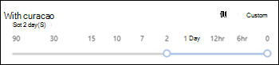

# Meddelandespårning i Säkerhets- och efterlevnadscenterMessage trace in the Security & Compliance Center

[!INCLUDE [Microsoft 365 Defender rebranding](../includes/microsoft-defender-for-office.md)]

**Gäller för****Applies to**
- [Exchange Online ProtectionExchange Online Protection](exchange-online-protection-overview.md)
- [Microsoft Defender för Office 365 Abonnemang 1 och Abonnemang 2Microsoft Defender for Office 365 plan 1 and plan 2](office-365-atp.md)
- [Microsoft 365 DefenderMicrosoft 365 Defender](../mtp/microsoft-threat-protection.md)

## Funktioner för meddelandespårningMessage trace features

Meddelandespårning i Säkerhets- & efterlevnadscenter följer e-postmeddelanden när de färdas genom din Exchange Online-organisation.Message trace in the Security & Compliance Center follows email messages as they travel through your Exchange Online organization. Du kan avgöra om ett meddelande har tagits emot, avvisats, skjutits upp eller levererats av tjänsten.You can determine if a message was received, rejected, deferred, or delivered by the service. Det visar också vilka åtgärder som har vidtagits för meddelandet innan det nått sin slutgiltiga status.It also shows what actions were taken on the message before it reached its final status.

Meddelandespårning i Säkerhets- & Kompatibilitetscenter förbättrar den ursprungliga meddelandespårningen som var tillgänglig i administrationscentret för Exchange (EAC).Message trace in the Security & Compliance Center improves upon the original message trace that was available in the Exchange admin center (EAC). Du kan använda informationen från meddelandespårning för att effektivt besvara användarfrågor om vad som har hänt med meddelanden, felsöka problem med e-postflödet och verifiera principändringar.You can use the information from message trace to efficiently answer user questions about what happened to messages, troubleshoot mail flow issues, and validate policy changes.

> [!NOTE]
>
> - Om du vill göra en meddelandespårning måste du vara medlem i rollgrupperna Organisationshantering, Efterlevnadshantering eller Support.To do a message trace, you need to be a member of the Organization Management, Compliance Management or Help Desk role groups. Mer information finns i [Behörigheter i Säkerhets- och efterlevnadscentret](permissions-in-the-security-and-compliance-center.md).For more information, see [Permissions in the Security & Compliance Center](permissions-in-the-security-and-compliance-center.md).
>
> - Det maximala antalet meddelanden som visas i resultatet beror på vilken  rapporttyp du har valt (mer information finns i avsnittet Välj rapporttyp).The maximum number of messages that are displayed in the results depends on the report type you selected (see the [Choose report type](#choose-report-type) section for details). Cmdleten [Get-HistoricalSearch](https://docs.microsoft.com/powershell/module/exchange/get-historicalsearch) i Exchange Online PowerShell eller fristående EOP PowerShell returnerar alla meddelanden i resultatet.The [Get-HistoricalSearch](https://docs.microsoft.com/powershell/module/exchange/get-historicalsearch) cmdlet in Exchange Online PowerShell or standalone EOP PowerShell returns all messages in the results.

## Öppna meddelandespårningOpen message trace

1. Öppna Säkerhets- & Efterlevnadscenter <https://protection.office.com> på.Open the Security & Compliance Center at <https://protection.office.com>.

2. Expandera **e-postflödet** och välj sedan **Meddelandespårning.**Expand **Mail flow**, and then select **Message trace**.

## MeddelandespårningssidaMessage trace page

Härifrån kan du starta en ny standardspårning genom att klicka på **knappen Starta en** spårning.From here you can start a new default trace by clicking on the **Start a trace** button. Då söker du efter alla meddelanden för alla avsändare och mottagare under de senaste två dagarna.This will search for all messages for all senders and recipients for the last two days. Du kan också använda en av de lagrade frågorna från tillgängliga frågekategorier och antingen köra dem som de är eller använda dem som utgångspunkt för dina egna frågor:Or you can use one of the stored queries from the available query categories and either run them as-is or use them as starting points for your own queries:

- **Standardfrågor:** Inbyggda frågor från Microsoft 365.**Default queries**: Built-in queries provided by Microsoft 365.

- **Anpassade frågor:** Frågor sparas av administratörer i organisationen för framtida bruk.**Custom queries**: Queries saved by admins in your organization for future use.

- **Automatisktavsparade frågor:** De senaste tio senaste körningsfrågorna.**Autosaved queries**: The last ten most recently run queries. Den här listan gör det enkelt att fortsätta där du slutade.This list makes it simple to pick up where you left off.

På den här sidan finns **också ett avsnitt** för nedladdningsbara rapporter för begäranden du har skickat in, samt själva rapporterna när det finns tillgängliga för nedladdning.Also on this page is a **Downloadable reports** section for the requests you've submitted, as well as the reports themselves when they're are available for download.

## Alternativ för en ny meddelandespårningOptions for a new message trace

### Filtrera efter avsändare och mottagareFilter by senders and recipients

Standardvärdena är **Alla avsändare** och **Alla** mottagare, men du kan använda följande fält för att filtrera resultatet:The default values are **All senders** and **All recipients**, but you can use the following fields to filter the results:

- **Av dessa personer:** Klicka i det här fältet om du vill välja en eller flera avsändare från organisationen.**By these people**: Click in this field to select one or more senders from your organization. Du kan också börja skriva ett namn så filtreras objekten i listan efter vad du har skrivit, ungefär som en söksida fungerar.You can also start to type a name and the items in the list will be filtered by what you've typed, much like how a search page behaves.

- **För de här personerna:** Klicka i det här fältet för att välja en eller flera mottagare i organisationen.**To these people**: Click in this field to select one or more recipients in your organization.

> [!NOTE]
>
> - Du kan också skriva e-postadresserna till externa avsändare och mottagare.You can also type the email addresses of external senders and recipients. Jokertecken stöds (till exempel), men du kan inte använda flera jokerteckenposter i `*@contoso.com` samma fält samtidigt.Wildcards are supported (for example, `*@contoso.com`), but you can't use multiple wildcard entries in the same field at the same time.
>
> - Du kan klistra in flera avsändare eller mottagare, avgränsade med semikolon ( `;` ).You can paste multiple senders or recipients lists separated by semicolons (`;`). blanksteg ( `\s` ), vagnreturer ( `\r` ) eller nästa rad ( `\n` ).spaces (`\s`), carriage returns (`\r`), or next lines (`\n`).

### TidsperiodTime range

Standardvärdet är **2 dagar,** men du kan ange datum-/tidsintervall på upp till 90 dagar.The default value is **2 days**, but you can specify date/time ranges of up to 90 days. När du använder datum-/tidsintervall bör du tänka på följande:When you use date/time ranges, consider these issues:

- Som standard väljer du tidintervallet i **skjutreglagevyn** med en tidsrad.By default, you select the time range in **Slider** view using a time line. Du kan bara välja vilka dag- och tidsinställningar som visas.You can only select the day or time settings that are displayed. Om du försöker välja ett värde mellan fästs start-/slutbubblan på den närmaste inställningen som visas.Trying to select an in-between value will snap the start/end bubble to the nearest displayed setting.

  

  Men du kan också  växla till vyn Anpassad där  du kan ange värden för **Startdatum**  och Slutdatum (inklusive tider), och du kan också välja tidszon för datum/tidsintervall.But, you can also switch to **Custom** view where you can specify the **Start date** and **End date** values (including times), and you can also select the **Time zone** for the date/time range. Observera att **tidszonsinställningen** gäller för både frågeindata och frågeresultat.Note that the **Time zone** setting applies to both your query inputs and your query results.

  

  I 10 dagar eller mindre visas resultaten  direkt som en sammanfattningsrapport.For 10 days or less, the results are available instantly as a **Summary** report. Om du anger ett tidsperiod som är något längre än 10 dagar försenas **resultatet** eftersom de bara är tillgängliga som en nedladdningsbar CSV-fil **(utökade** sammanfattnings- eller utökade rapporter).If you specify a time range that's even slightly greater than 10 days, the results will be delayed as they are only available as a downloadable CSV file ( **Enhanced summary** or **Extended** reports).

  Mer information om de olika rapporttyperna finns i avsnittet [Välj rapporttyp](#choose-report-type) i den här artikeln.For more information about the different report types, see the [Choose report type](#choose-report-type) section in this article.

  > [!NOTE]
  > Förbättrade sammanfattnings- och utökade rapporter förbereds med arkiverade meddelandespårningsdata och det kan ta upp till flera timmar innan rapporten är tillgänglig för nedladdning.Enhanced summary and Extended reports are prepared using archived message trace data, and it can take up to several hours before your report is available for download. Beroende på hur många andra administratörer som också har skickat rapportförfrågningar samtidigt kan du också märka en fördröjning innan bearbetningen startar för din i köade begäran.Depending on how many other admins have also submitted report requests around the same time, you might also notice a delay before processing starts for your queued request.

- När du sparar en **fråga i** skjutreglagevyn sparas det relativa tidsperioden (till exempel tre dagar från i dag).Saving a query in **Slider** view saves the relative time range (for example, 3 days from today). När du  sparar en fråga i vyn Anpassad sparas det absoluta datum-/tidsintervallet (till exempel 2018-05-06 13:00 till 2018-05-08 18:00).Saving a query in **Custom** view saves the absolute date/time range (for example, 2018-05-06 13:00 to 2018-05-08 18:00).

### Fler sökalternativMore search options

#### LeveransstatusDelivery status

Du kan låta standardvärdet **Alla vara** markerat eller så kan du välja något av följande värden för att filtrera resultatet:You can leave the default value **All** selected, or you can select one of the following values to filter the results:

- **Levererad:** Meddelandet levererades till målet.**Delivered**: The message was successfully delivered to the intended destination.

- **Väntande:** Leverans av meddelandet försöker eller försöker på nytt.**Pending**: Delivery of the message is being attempted or re-attempted.

- **Expanderat:** En mottagare i distributionsgruppen expanderades innan den levereras till de enskilda medlemmarna i gruppen.**Expanded**: A distribution group recipient was expanded before delivery to the individual members of the group.

- **Misslyckades:** Meddelandet levererades inte.**Failed**: The message was not delivered.

- **I karantän:** Meddelandet har satts i karantän (som skräppost, massutskick eller nätfiske).**Quarantined**: The message was quarantined (as spam, bulk mail, or phishing). Mer information finns i [e-postmeddelanden i karantän i EOP.](quarantine-email-messages.md)For more information, see [Quarantined email messages in EOP](quarantine-email-messages.md).

- **Filtrerad som skräppost:** Meddelandet identifierades som skräppost och avvisades eller blockerades (inte i karantän).**Filtered as spam**: The message was identified spam, and was rejected or blocked (not quarantined).

- **Hämtar status:** Meddelandet togs nyligen emot av Microsoft 365, men inga andra statusdata är tillgängliga ännu.**Getting status:** The message was recently received by Microsoft 365, but no other status data is yet available. Kom tillbaka om några minuter.Check back in a few minutes.

> [!NOTE]
> Värdena **Väntande, i** **karantän och** Filter som **skräppost** är bara tillgängliga för sökningar under 10 dagar.The values **Pending,** **Quarantined**, and **Filter as spam** are only available for searches less than 10 days. Det kan också finnas en fördröjning på 5 till 10 minuter mellan den faktiska och rapporterade leveransstatusen.Also, there might be a 5 to 10 minute delay between the actual and reported delivery status.

#### Meddelande-IDMessage ID

Det här är det Internetmeddelande-ID (kallas även klient-ID) som finns i **meddelande-ID:** huvudfältet i meddelandehuvudet.This is the internet message ID (also known as the Client ID) that's found in the **Message-ID:** header field in the message header. Användarna kan ge dig det här värdet om de vill undersöka specifika meddelanden.Users can give you this value to investigate specific messages.

Det här värdet är konstant under meddelandets livslängd.This value is constant for the lifetime of the message. För meddelanden som skapas i Microsoft 365 eller Exchange är värdet i formatet, inklusive `<GUID@ServerFQDN>` vinkelparenteser ( \< \> ).For messages created in Microsoft 365 or Exchange, the value is in the format `<GUID@ServerFQDN>`, including the angle brackets (\< \>). Till exempel `<d9683b4c-127b-413a-ae2e-fa7dfb32c69d@DM3NAM06BG401.Eop-nam06.prod.protection.outlook.com>`.For example, `<d9683b4c-127b-413a-ae2e-fa7dfb32c69d@DM3NAM06BG401.Eop-nam06.prod.protection.outlook.com>`. Andra meddelandesystem kan använda andra syntax eller värden.Other messaging systems might use different syntax or values. Det här värdet ska vara unikt, men inte alla e-postsystem som följer det här kravet.This value is supposed to be unique, but not all email systems strictly follow this requirement. Om **meddelande-ID: rubrikfältet** inte finns eller är tomt för inkommande meddelanden från externa källor tilldelas ett godtyckligt värde.If the **Message-ID:** header field doesn't exist or is blank for incoming messages from external sources, an arbitrary value is assigned.

När du **filtrerar resultatet med meddelande-ID** måste du inkludera hela strängen, inklusive vinkelparenteser.When you use **Message ID** to filter the results, be sure to include the full string, including any angle brackets.

#### RiktningDirection

Du kan låta  standardvärdet Alla vara markerat eller välja **Inkommande** (meddelanden som skickas till mottagare i organisationen) eller Utgående **(meddelanden** som skickas från användare i organisationen) för att filtrera resultaten.You can leave the default value **All** selected, or you can select **Inbound** (messages sent to recipients in your organization) or **Outbound** (messages sent from users in your organization) to filter the results.

#### Ursprunglig klient-IP-adressOriginal client IP address

Du kan filer resultaten efter klientens IP-adress och undersöka hackade datorer som skickar stora mängder skräppost eller skadlig programvara.You can filer the results by client IP address to investigate hacked computers that are sending large amounts of spam or malware. Även om meddelandena verkar komma från flera avsändare är det troligt att samma dator genererar alla meddelanden.Although the messages might appear to come from multiple senders, it's likely that the same computer is generating all of the messages.

> [!NOTE]
> Informationen om klient-IP-adressen är endast tillgänglig i 10 dagar  och finns bara tillgänglig i den utökade sammanfattningen eller utökade rapporter (nedladdningsbara CSV-filer). The client IP address information is only available for 10 days, and is only available in the **Enhanced summary** or **Extended** reports (downloadable CSV files).

### Välj rapporttypChoose report type

De tillgängliga rapporttyperna är:The available report types are:

- **Sammanfattning:** Tillgängligt om tidsperioden är mindre än 10 dagar och inte kräver ytterligare filtreringsalternativ.**Summary**: Available if the time range is less than 10 days, and requires no additional filtering options. Resultatet blir nästan direkt tillgängligt när du klickar på **Sök.**The results are available almost immediately after you click **Search**. Rapporten returnerar upp till 20 000 resultat.The report returns up to 20000 results.

- **Förbättrad sammanfattning** eller **utökad:** De här rapporterna är endast tillgängliga som nedladdningsbara CSV-filer och kräver ett eller flera av följande filtreringsalternativ oavsett **tidsperiod:** Av dessa **personer,** Till dessa personer eller **Meddelande-ID.****Enhanced summary** or **Extended**: These reports are only available as downloadable CSV files, and require one or more of the following filtering options regardless of the time range: **By these people**, **To these people**, or **Message ID**. Du kan använda jokertecken för avsändare eller mottagare (till exempel \* @contoso.com).You can use wildcards for the senders or the recipients (for example, \*@contoso.com). Den utökade sammanfattningsrapporten returnerar upp till 5 000 resultat.The Enhanced summary report returns up to 50000 results. Den utökade rapporten returnerar upp till 1 000 resultat.The Extended report returns up to 1000 results.

> [!NOTE]
> 
> - Förbättrade sammanfattnings- och utökade rapporter förbereds med arkiverade meddelandespårningsdata och det kan ta flera timmar innan rapporten kan laddas ned.Enhanced summary and Extended reports are prepared using archived message trace data, and it can take up to several hours before your report is available to download. Beroende på hur många andra administratörer som också har skickat rapportförfrågningar samtidigt kan du också märka en fördröjning innan din i köade begäran börjar bearbetas.Depending on how many other admins have also submitted report requests around the same time, you might also notice a delay before your queued request starts to be processed.
> 
> - Du kan välja en utökad sammanfattning eller utökad rapport för ett datum-/tidsintervall, men vanligtvis är de sista fyra timmarna med arkiverade data ännu inte tillgängliga för dessa två typer av rapporter.While you can select an Enhanced summary or Extended report for any date/time range, commonly the last four hours of archived data will not yet be available for these two types of reports.

När du klickar på Nästa visas en sammanfattningssida med de filtreringsalternativ som du har valt, en unik (redigerbar) rubrik för rapporten och den e-postadress som får meddelandet när meddelandespårningen har slutförts (också redigerbar och måste finnas i någon av organisationens godkända domäner).When you click **Next**, you're presented with a summary page that lists the filtering options that you selected, a unique (editable) title for the report, and the email address that receives the notification when the message trace completes (also editable, and must be in one of your organization's accepted domains). Klicka **på Förbered rapport** för att skicka meddelandespårningen.Click **Prepare report** to submit the message trace. På **huvudsidan för meddelandespårning** kan du se status för rapporten i avsnittet **nedladdningsbara** rapporter.On the main **Message trace** page, you can see the status of the report in the **Downloadable reports** section.

Mer information om den information som returneras i de olika rapporttyperna finns i nästa avsnitt.For more information about the information that's returned in the different report types, see the next section.

## MeddelandespårningsresultatMessage trace results

De olika rapporttyperna returnerar olika informationsnivåer.The different report types return different levels of information. Den information som är tillgänglig i de olika rapporterna beskrivs i följande avsnitt.The information that's available in the different reports is described in the following sections.

### SammanfattningsrapportresultatSummary report output

När meddelandespårningen har körts visas resultatet, sorterat efter fallande datum/tid (senaste först).After running the message trace, the results will be listed, sorted by descending date/time (most recent first).

Sammanfattningsrapporten innehåller följande information:The summary report contains the following information:

- **Datum:** Datum och tid då meddelandet togs emot av tjänsten med hjälp av den konfigurerade UTC-tidszonen.**Date**: The date and time at which the message was received by the service, using the configured UTC time zone.

- **Avsändare:** E-postadressen för avsändaren @ *(aliasdomänen).***Sender**: The email address of the sender (*alias*@*domain*).

- **Mottagare:** Mottagarens eller mottagarnas e-postadress.**Recipient**: The email address of the recipient or recipients. För meddelanden som skickas till flera mottagare finns det en rad per mottagare.For a message sent to multiple recipients, there's one line per recipient. Om mottagaren är en distributionsgrupp, dynamisk distributionsgrupp eller e-postaktiverad säkerhetsgrupp blir gruppen den första mottagaren och därefter finns varje medlem i gruppen på en separat rad.If the recipient is a distribution group, dynamic distribution group, or mail-enabled security group, the group will be the first recipient, and then each member of the group is on a separate line.

- **Ämne:** De första 256 tecknen i meddelandets **ämnesfält.****Subject**: The first 256 characters of the message's **Subject:** field.

- **Status:** Dessa värden beskrivs i [avsnittet Leveransstatus.](#delivery-status)**Status**: These values are described in the [Delivery status](#delivery-status) section.

Som standard läses de första 250 resultaten in och är lättillgängliga.By default, the first 250 results are loaded and readily available. När du rullar nedåt finns det en liten paus när nästa uppsättning resultat läses in.When you scroll down, there's a slight pause as the next batch of results are loaded. I stället för att  rulla kan du klicka på Läs in alla för att läsa in alla resultat upp till maximalt 10 000.Instead of scrolling, you can click **Load all** to load all of the results up to a maximum of 10,000.

Du kan klicka på kolumnrubrikerna för att sortera resultatet efter värdena i kolumnen i stigande eller fallande ordning.You can click on the column headers to sort the results by the values in that column in ascending or descending order.

Du kan klicka **på Filtrera** resultat om du vill filtrera resultatet efter en eller flera kolumner.You can click **Filter results** to filter the results by one or more columns.

Du kan exportera resultatet när du har markerat en eller flera rader genom att klicka på **Exportera** resultat och sedan välja Exportera alla **resultat,** Exportera inlästa **resultat** eller Exportera **markerat.**You can export the results after you've selected one or more rows by clicking **Export results** and then selecting **Export all results**, **Export loaded results**, or **Export selected**.

#### Hitta relaterade poster för det här meddelandetFind related records for this message

Relaterade meddelandeposter är poster som delade samma meddelande-ID.Related message records are records that shared the same Message ID. Kom ihåg att även ett enskilt meddelande som skickas mellan två personer kan generera flera poster.Remember, even a single message sent between two people can generate multiple records. Antalet poster ökar när meddelandet påverkas av distributionsgruppsexpansion, vidarebefordran, e-postflödesregler (kallas även transportregler) osv.The number of records increases when the message is affected by distribution group expansion, forwarding, mail flow rules (also known as transport rules), etc.

När du har markera kryssrutan för en rad kan du hitta  relaterade poster för meddelandet  genom att klicka på knappen Sök relaterat som visas eller genom att välja Fler alternativ För att hitta relaterade poster för  \> meddelandet).After you select a row's check box, you can find related records for the message by clicking the **Find related** button that appears, or by selecting **More options**  \> **Find related records for this message**).

Mer information om meddelande-ID finns i avsnittet Meddelande-ID tidigare i den här artikeln.For more information about the Message ID, see the Message ID section earlier in this article.

#### Information om meddelandespårningMessage trace details

I sammanfattningsrapportens utdata kan du visa information om ett meddelande med någon av följande metoder:In the summary report output, you can view details about a message by using either of the following methods:

- Markera raden (klicka någonstans på raden utom kryssrutan).Select the row (click anywhere in the row except the check box).

- Markera radens kryssruta och klicka **på Fler alternativ** Visa  \> **meddelandeinformation.**Select the row's check box and click **More options**  \> **View message details**.

   

Informationen i meddelandespårningen innehåller följande ytterligare information som inte finns i sammanfattningsrapporten:The message trace details contain the following additional information that's not present in the summary report:

- **Meddelandehändelser:** Det här avsnittet innehåller klassificeringar som hjälper till att kategorisera åtgärder som tjänsten vidtar för meddelanden.**Message events**: This section contains classifications that help categorize the actions that the service takes on messages. **Några av de mest intressanta händelser som** du kan stöta på är:**Some of the more interesting events** that you might encounter are:

  - **Ta** emot: Meddelandet togs emot av tjänsten.**Receive**: The message was received by the service.

  - **Skicka:** Meddelandet skickades av tjänsten.**Send**: The message was sent by the service.

  - **Fel:** Meddelandet kunde inte levereras.**Fail**: The message failed to be delivered.

  - **Leverera:** Meddelandet levererades till en postlåda.**Deliver**: The message was delivered to a mailbox.

  - **Expandera:** Meddelandet skickades till en distributionsgrupp som expanderats.**Expand**: The message was sent to a distribution group that was expanded.

  - **Överföring:** Mottagare har flyttats till ett nytt meddelande på grund av innehållskonvertering, begränsningar för mottagare eller agenter.**Transfer**: Recipients were moved to a bifurcated message because of content conversion, message recipient limits, or agents.

  - **Skjut upp:** Meddelandets leverans har skjutits upp och kan försökas igen senare.**Defer**: The message delivery was postponed and might be re-attempted later.

  - **Löst:** Meddelandet omdirigerades till en ny mottagaradress baserat på ett active Directory-upp tittande.**Resolved**: The message was redirected to a new recipient address based on an Active Directory look up. När detta händer visas den ursprungliga mottagaradressen på en separat rad i meddelandespårningen tillsammans med meddelandets slutgiltiga leveransstatus.When this happens, the original recipient address is listed in a separate row in the message trace along with the final delivery status for the message.

  > [!NOTE]
  > 
  > - Ett ojämnt meddelande som levereras genererar flera **händelseposter** i meddelandespårningen.An uneventful message that's successfully delivered will generate multiple **Event** entries in the message trace.
  > 
  > - Listan är inte uttömmande.This list is not meant to be exhaustive. Beskrivningar av fler händelser finns i Händelsetyper [i meddelandespårningsloggen.](https://docs.microsoft.com/Exchange/mail-flow/transport-logs/message-tracking#event-types-in-the-message-tracking-log)For descriptions of more events, see [Event types in the message tracking log](https://docs.microsoft.com/Exchange/mail-flow/transport-logs/message-tracking#event-types-in-the-message-tracking-log). Observera att den här länken Exchange Server ämne (lokal Exchange).Note that this link is an Exchange Server (on-premises Exchange) topic.

- **Mer information:** Det här avsnittet innehåller följande information:**More information**: This section contains the following details:

  - **Meddelande-ID:** Det här värdet beskrivs i [avsnittet Meddelande-ID](#message-id) tidigare i den här artikeln.**Message ID**: This value is described in the [Message ID](#message-id) section earlier in this article. Till exempel `<d9683b4c-127b-413a-ae2e-fa7dfb32c69d@DM3NAM06BG401.Eop-nam06.prod.protection.outlook.com>`.For example, `<d9683b4c-127b-413a-ae2e-fa7dfb32c69d@DM3NAM06BG401.Eop-nam06.prod.protection.outlook.com>`.

  - **Meddelandestorlek****Message size**

  - **Från IP:** IP-adressen för datorn som skickade meddelandet.**From IP**: The IP address of the computer that sent the message. För utgående meddelanden som skickas från Exchange Online är det här värdet tomt.For outbound messages sent from Exchange Online, this value is blank.

  - **Till IP:** IP-adressen eller adresserna där tjänsten försökte leverera meddelandet.**To IP**: The IP address or addresses where the service attempted to deliver the message. Om meddelandet har flera mottagare visas de.If the message has multiple recipients, these are displayed. Det här värdet är tomt för inkommande meddelanden som skickas till Exchange Online.For inbound messages sent to Exchange Online, this value is blank.

### Förbättrade sammanfattningsrapporterEnhanced summary reports

Tillgängliga (slutförda) förbättrade sammanfattningsrapporter finns tillgängliga **i avsnittet hämtningsbara rapporter** i meddelandespårningen i början.Available (completed) Enhanced summary reports are available in the **Downloadable reports** section at the beginning message trace. Följande information finns i rapporten:The following information is available in the report:

- **origin_timestamp:** Datum och tid då meddelandet ursprungligen togs emot av tjänsten med hjälp av den \* konfigurerade UTC-tidszonen.**origin_timestamp**\*: The date and time when the message was initially received by the service, using the configured UTC time zone.

- **sender_address:** Avsändarens e-postadress @ *(aliasdomän).***sender_address**: The sender's email address (*alias*@*domain*).

- **Recipient_status:** Status för leverans av meddelandet till mottagaren.**Recipient_status**: The status of the delivery of the message to the recipient. Om meddelandet skickades till flera mottagare visas alla mottagare och motsvarande status för dem, i \<*email address*\> formatet: ## \<*status*\>If the message was sent to multiple recipients, it will show all the recipients and the corresponding status for each, in the format: \<*email address*\>##\<*status*\>. Till exempel:For example:

  - **##Receive, Send** means the message was received by the service and was sent to the intended destination.**##Receive, Send** means the message was received by the service and was sent to the intended destination.

  - **##Receive, fail** means the message was received by the service but delivery to the intended destination failed.**##Receive, Fail** means the message was received by the service but delivery to the intended destination failed.

  - **##Receive, Deliver** means the message was received by the service and was delivered to the recipient's mailbox.**##Receive, Deliver** means the message was received by the service and was delivered to the recipient's mailbox.

- **message_subject:** De första 256 tecknen i meddelandets **ämnesfält.****message_subject**: The first 256 characters of the message's **Subject** field.

- **total_bytes:** Storleken på meddelandet i byte, inklusive bifogade filer.**total_bytes**: The size of the message in bytes, including attachments.

- **message_id:** Det här värdet beskrivs i avsnittet [Meddelande-ID](#message-id) tidigare i den här artikeln.**message_id**: This value is described in the [Message ID](#message-id) section earlier in this article. Till exempel `<d9683b4c-127b-413a-ae2e-fa7dfb32c69d@DM3NAM06BG401.Eop-nam06.prod.protection.outlook.com>`.For example, `<d9683b4c-127b-413a-ae2e-fa7dfb32c69d@DM3NAM06BG401.Eop-nam06.prod.protection.outlook.com>`.

- **network_message_id:** Ett unikt meddelande-ID-värde som finns kvar i alla kopior av meddelandet som kan skapas på grund av expandering eller distributionsgruppsexpansion.**network_message_id**: A unique message ID value that persists across all copies of the message that might be created due to bifurcation or distribution group expansion. Ett exempelvärde är `1341ac7b13fb42ab4d4408cf7f55890f` .An example value is `1341ac7b13fb42ab4d4408cf7f55890f`.

- **original_client_ip:** IP-adressen för avsändarens klient.**original_client_ip**: The IP address of the sender's client.

- **riktning:** Anger om meddelandet skickades inkommande (1) till din organisation eller om det skickades utgående (2) från din organisation.**directionality**: Indicates whether the message was sent inbound (1) to your organization, or whether it was sent outbound (2) from your organization.

- **connector_id:** Namnet på käll- eller målkopplingen.**connector_id**: The name of the source or destination connector. Mer information om kopplingar i Exchange Online finns i Konfigurera [e-postflöde med kopplingar i Office 365.](https://docs.microsoft.com/Exchange/mail-flow-best-practices/use-connectors-to-configure-mail-flow/use-connectors-to-configure-mail-flow)For more information about connectors in Exchange Online, see [Configure mail flow using connectors in Office 365](https://docs.microsoft.com/Exchange/mail-flow-best-practices/use-connectors-to-configure-mail-flow/use-connectors-to-configure-mail-flow).

- **delivery_priority:** \* Om meddelandet skickades med **hög,** **låg** eller **normal** prioritet.**delivery_priority**\*: Whether the message was sent with **High**, **Low**, or **Normal** priority.

\* De här egenskaperna är bara tillgängliga i utökade sammanfattningsrapporter.\* These properties are only available in Enhanced summary reports.

### Utökade rapporterExtended reports

Tillgängliga (slutförda) utökade rapporter är tillgängliga **i avsnittet nedladdningsbara** rapporter i början av meddelandespårning.Available (completed) Extended reports are available in the **Downloadable reports** section at the beginning of message trace. Praktiskt taget all information från en utökad sammanfattningsrapport finns tillgänglig i en utökad rapport (med undantag för **origin_timestamp** och **delivery_priority).**Virtually all of the information from an Enhanced summary report is available in an Extended report (with the exception of **origin_timestamp** and **delivery_priority**). Följande ytterligare information är endast tillgänglig i en utökad rapport:The following additional information is only available in an Extended report:

- **client_ip:** IP-adressen för den e-postserver eller meddelandeklient som skickade meddelandet.**client_ip**: The IP address of the email server or messaging client that submitted the message.

- **client_hostname:** Värdnamnet eller FQDN för e-postservern eller meddelandeklienten som skickade meddelandet.**client_hostname**: The host name or FQDN of the email server or messaging client that submitted the message.

- **server_ip:** IP-adressen för källan eller målservern.**server_ip**: The IP address of the source or destination server.

- **server_hostname:** Målserverns värdnamn eller FQDN.**server_hostname**: The host name or FQDN of the destination server.

- **source_context:** Extra information kopplad till **källfältet.****source_context**: Extra information associated with the **source** field. Till exempel:For example:

  - `Protocol Filter Agent`

  - `3489061114359050000`

- **källa:** Exchange Online-komponenten som ansvarar för händelsen.**source**: The Exchange Online component that's responsible for the event. Till exempel:For example:

  - `AGENT`

  - `MAILBOXRULE`

  - `SMTP`

- **event_id:** De motsvarar värdena för **meddelandehändelsen** som förklaras i Avsnittet [Hitta relaterade poster för det här](#find-related-records-for-this-message) meddelandet.**event_id**: These correspond to the **Message event** values that are explained in the [Find related records for this message](#find-related-records-for-this-message) section.

- **internal_message_id:** En meddelandeidentifierare som har tilldelats av Exchange Online-servern som för närvarande bearbetar meddelandet.**internal_message_id**: A message identifier that's assigned by the Exchange Online server that's currently processing the message.

- **recipient_address:** E-postadresserna till meddelandets mottagare.**recipient_address**: The email addresses of the message's recipients. Flera e-postadresser avgränsas med semikolontecken (;).Multiple email addresses are separated by the semicolon character (;).

- **recipient_count:** Det totala antalet mottagare i meddelandet.**recipient_count**: The total number of recipients in the message.

- **related_recipient_address:** Används med `EXPAND` `REDIRECT` och `RESOLVE` händelser för att visa andra mottagares e-postadresser som är kopplade till meddelandet.**related_recipient_address**: Used with `EXPAND`, `REDIRECT`, and `RESOLVE` events to display other recipient email addresses that are associated with the message.

- **referens:** Det här fältet innehåller ytterligare information för specifika typer av händelser.**reference**: This field contains additional information for specific types of events. Till exempel:For example:

  - **DSN:** Innehåller rapportlänken, som är **message_id-värdet** för det associerade leveransstatusmeddelandet (kallas även DSN, rapport om utebliven leverans, NDR eller icke-leveranskavisering) om ett DSN genereras senare till den här händelsen.**DSN**: Contains the report link, which is the **message_id** value of the associated delivery status notification (also known as a DSN, non-delivery report, NDR, or bounce message) if a DSN is generated subsequent to this event. Om det här är ett DSN-meddelande innehåller det **message_id** det ursprungliga meddelandet som DSN skapades för.If this is a DSN message, this field contains the **message_id** value of the original message that the DSN was generated for.

  - **EXPANDERA:** Innehåller **related_recipient_address** värdet för relaterade meddelanden.**EXPAND**: Contains the **related_recipient_address** value of the related messages.

  - **RECEIVE**: Kan innehålla **det message_id** relaterade meddelandet om meddelandet har skapats av andra processer (till exempel inkorgsregler).**RECEIVE**: Might contain the **message_id** value of the related message if the message was generated by other processes (for example, Inbox rules).

  - **SEND**: Contains the **internal_message_id** value of any DSN messages.**SEND**: Contains the **internal_message_id** value of any DSN messages.

  - **ÖVERFÖRING:** Innehåller **internal_message_id** värdet för det meddelande som ska delas upp (t.ex. efter innehållskonvertering, begränsningar för mottagare eller representanter för meddelanden).**TRANSFER**: Contains the **internal_message_id** value of the message that's being forked (for example, by content conversion, message recipient limits, or agents).

  - **MAILBOXRULE:** Innehåller **det internal_message_id** för det inkommande meddelandet som orsakade att inkorgsregeln genererade det utgående meddelandet.**MAILBOXRULE**: Contains the **internal_message_id** value of the inbound message that caused the Inbox rule to generate the outbound message.

    För andra typer av händelser är det här fältet vanligtvis tomt.For other types of events, this field is usually blank.

- **return_path:** Den avsändar-e-postadress som anges av kommandot **E-POST** FRÅN som skickade meddelandet.**return_path**: The return email address specified by the **MAIL FROM** command that sent the message. Även om fältet aldrig är tomt kan värdet för null-avsändaradressen representeras `<>` som.Although this field is never empty, it can have the null sender address value represented as `<>`.

- **message_info:** Ytterligare information om meddelandet.**message_info**: Additional information about the message. Till exempel:For example:

  - Datum-tid för meddelandets ursprung i UTC för `DELIVER` och `SEND` händelser.The message origination date-time in UTC for `DELIVER` and `SEND` events. Datum-tid för ursprung är tiden då meddelandet först angav Exchange Online-organisationen.The origination date-time is the time when the message first entered the Exchange Online organization. UTC-datumtiden representeras i ISO 8601-datum/tid-format: , där = år, = månad, = dag, anger början av `yyyy-mm-ddThh:mm:ss.fffZ` `yyyy` `mm` `dd` `T` `hh` tidskomponenten, = timme, `mm` = minut, = sekund, `ss` `fff` = `Z` `Zulu` bråktal i en sekund och betecknar, vilket är ett annat sätt att betecknar UTC.The UTC date-time is represented in the ISO 8601 date-time format: `yyyy-mm-ddThh:mm:ss.fffZ`, where `yyyy` = year, `mm` = month, `dd` = day, `T` indicates the beginning of the time component, `hh` = hour, `mm` = minute, `ss` = second, `fff` = fractions of a second, and `Z` signifies `Zulu`, which is another way to denote UTC.

  - Autentiseringsfel.Authentication errors. Du kan till exempel se värdet och typen av autentisering `11a` som användes när autentiseringsfelet inträffade.For example, you might see the value `11a` and the type of authentication that was used when the authentication error occurred.

- **tenant_id:** Ett GUID-värde som representerar Exchange Online-organisationen (till exempel `39238e87-b5ab-4ef6-a559-af54c6b07b42` ).**tenant_id**: A GUID value that represents the Exchange Online organization (for example, `39238e87-b5ab-4ef6-a559-af54c6b07b42`).

- **original_server_ip:** IP-adressen till den ursprungliga servern.**original_server_ip**: The IP address of the original server.

- **custom_data:** Innehåller data som är relaterade till specifika händelsetyper.**custom_data**: Contains data related to specific event types. Mer information finns i följande avsnitt.For more information, see the following sections.

#### custom_data värdencustom_data values

Fältet **custom_data** för en `AGENTINFO` händelse används av olika Exchange Online-agenter för att logga information om bearbetningen av meddelanden.The **custom_data** field for an `AGENTINFO` event is used by a variety of Exchange Online agents to log message processing details. Några av de mer intressanta representanterna beskrivs i följande avsnitt.Some of the more interesting agents are described in the following sections.

#### Agent för skräppostfilterSpam filter agent

Ett **custom_data** som börjar med `S:SFA` är från skräppostfilteragenten.A **custom_data** value that starts with `S:SFA` is from the spam filter agent. Huvuduppgifterna beskrivs i följande tabell:The key details are described in the following table:

****

|ValueValue|BeskrivningDescription|
|---|---|
|`SFV=NSPM`|Meddelandet har markerats som icke skräppost och skickats till avsedda mottagare.The message was marked as non-spam and was sent to the intended recipients.|
|`SFV=SPM`|Meddelandet markerades som skräppost genom skräppostfiltrering (kallas även innehållsfiltrering).The message was marked as spam by anti-spam filtering (also known as content filtering).|
|`SFV=BLK`|Filtreringen hoppades över och meddelandet blockerades eftersom det kommer från en blockerad avsändare.Filtering was skipped and the message was blocked because it originated from a blocked sender.|
|`SFV=SKS`|Meddelandet markerades som skräppost innan det bearbetas av skräppostfiltrering.The message was marked as spam prior to being processed by anti-spam filtering. Detta inkluderar meddelanden där meddelandet har matchat en e-postflödesregel (även känt som transportregel) som automatiskt markerat det som skräppost och förbigått all ytterligare filtrering.This includes messages where the message matched a mail flow rule (also known as a transport rule) to automatically mark it as spam and bypass all additional filtering.|
|`SCL=<number>`|Mer information om de olika SCL-värdena och vad de betyder finns i [Konfidensnivåer för skräppost.](spam-confidence-levels.md)For more information about the different SCL values and what they mean, see [Spam confidence levels](spam-confidence-levels.md).|
|`PCL=<number>`|PCL-värdet (Phishing Confidence Level) för meddelandet.The Phishing Confidence Level (PCL) value of the message. De kan tolkas på samma sätt som SCL-värdena har dokumenterats i [konfidensnivåer för skräppost.](spam-confidence-levels.md)These can be interpreted the same way as the SCL values documented in [Spam confidence levels](spam-confidence-levels.md).|
|`DI=SB`|Meddelandets avsändare blockerades.The sender of the message was blocked.|
|`DI=SQ`|Meddelandet har satts i karantän.The message was quarantined.|
|`DI=SD`|Meddelandet togs bort.The message was deleted.|
|`DI=SJ`|Meddelandet skickades till mottagarens skräppostmapp.The message was sent to the recipient's Junk Email folder.|
|`DI=SN`|Meddelandet skickades via den vanliga utgående leveranspoolen.The message was routed through the normal outbound delivery pool.|
|`DI=SO`|Meddelandet skickades via leveranspoolen med högre risk.The message was routed through the higher risk delivery pool. Mer information finns i [högriskleveranspool för utgående meddelanden.](high-risk-delivery-pool-for-outbound-messages.md)For more information, see [High-risk delivery pool for outbound messages](high-risk-delivery-pool-for-outbound-messages.md).|
|`SFS=[a]|SFS=[b]`|Detta betyder att reglerna för skräppost har matchats.This denotes that spam rules were matched.|
|`IPV=CAL`|Meddelandet släpptes igenom skräppostfiltret då IP-adressen specificerades i en lista över tillåtna IP-adresser i anslutningsfiltret.The message was allowed through the spam filters because the IP address was specified in an IP Allow list in the connection filter.|
|`H=<EHLOstring>`|En anslutande e-mailservers HELO- eller OEHLO-sträng.The HELO or EHLO string of the connecting email server.|
|`PTR=<ReverseDNS>`|PTR-posten för den avsändande IP-adressen, som även kallas den omvända DNS-adressen.The PTR record of the sending IP address, also known as the reverse DNS address.|
|

Ett **exempel custom_data** värde för ett meddelande som filtreras efter skräppost så här:An example **custom_data** value for a message that's filtered for spam like this:

`S:SFA=SUM|SFV=SPM|IPV=CAL|SRV=BULK|SFS=470454002|SFS=349001|SCL=9|SCORE=-1|LIST=0|DI=SN|RD=ftmail.inc.com|H=ftmail.inc.com|CIP=98.129.140.74|SFP=1501|ASF=1|CTRY=US|CLTCTRY=|LANG=en|LAT=287|LAT=260|LAT=18;`

#### Filteragent för skadlig programvaraMalware filter agent

Ett **custom_data** som börjar med kommer `S:AMA` från filteragenten för skadlig programvara.A **custom_data** value that starts with `S:AMA` is from the malware filter agent. Huvuduppgifterna beskrivs i följande tabell:The key details are described in the following table:

****

|ValueValue|BeskrivningDescription|
|---|---|
|`AMA=SUM|v=1|` eller `AMA=EV|v=1``AMA=SUM|v=1|` or `AMA=EV|v=1`|Meddelandet har fastställt att det innehåller skadlig programvara.The message was determined to contain malware. `SUM` anger att skadlig programvara kan ha upptäckts av ett antal motorer.`SUM` indicates the malware could've been detected by any number of engines. `EV` anger att skadlig programvara har upptäckts av en specifik motor.`EV` indicates the malware was detected by a specific engine. När skadlig programvara identifieras av en motor utlöser detta de efterföljande åtgärderna.When malware is detected by an engine this triggers the subsequent actions.|
|`Action=r`|Meddelandet har ersatts.The message was replaced.|
|`Action=p`|Meddelandet har kringgåts.The message was bypassed.|
|`Action=d`|Meddelandet har skjutits upp.The message was deferred.|
|`Action=s`|Meddelandet togs bort.The message was deleted.|
|`Action=st`|Meddelandet har kringgåts.The message was bypassed.|
|`Action=sy`|Meddelandet har kringgåts.The message was bypassed.|
|`Action=ni`|Meddelandet avvisades.The message was rejected.|
|`Action=ne`|Meddelandet avvisades.The message was rejected.|
|`Action=b`|Meddelandet blockerades.The message was blocked.|
|`Name=<malware>`|Namnet på den skadlig programvara som identifierades.The name of the malware that was detected.|
|`File=<filename>`|Namnet på filen som innehöll den skadliga programvaran.The name of the file that contained the malware.|
|

Ett exempel **custom_data** ett meddelande som innehåller skadlig programvara ser ut så här:An example **custom_data** value for a message that contains malware looks like this:

`S:AMA=SUM|v=1|action=b|error=|atch=1;S:AMA=EV|engine=M|v=1|sig=1.155.974.0|name=DOS/Test_File|file=filename;S:AMA=EV|engine=A|v=1|sig=201707282038|name=Test_File|file=filename`

#### TransportregelagentTransport Rule agent

Ett **custom_data** som börjar med `S:TRA` kommer från transportregelagenten för e-postflödesregler (kallas även transportregler).A **custom_data** value that starts with`S:TRA` is from the Transport Rule agent for mail flow rules (also known as transport rules). Huvuduppgifterna beskrivs i följande tabell:The key details are described in the following table:

****

|ValueValue|BeskrivningDescription|
|---|---|
|`ETR|ruleId=<guid>`|Det regel-ID som matchades.The rule ID that was matched.|
|`St=<datetime>`|Datum och tid i UTC när regelmatchning inträffade.The date and time in UTC when the rule match occurred.|
|`Action=<ActionDefinition>`|Åtgärden som tillämpats.The action that was applied. En lista över tillgängliga åtgärder finns i [E-postflödesregelåtgärder i Exchange Online.](https://docs.microsoft.com/exchange/security-and-compliance/mail-flow-rules/mail-flow-rule-actions)For a list of available actions, see [Mail flow rule actions in Exchange Online](https://docs.microsoft.com/exchange/security-and-compliance/mail-flow-rules/mail-flow-rule-actions).|
|`Mode=<Mode>`|Läget för regeln.The mode of the rule. Giltiga värden är:Valid values are:<ul><li>Framtvinga: Alla åtgärder för regeln tillämpas.**Enforce**: All actions on the rule will be enforced.</li><li>**Test med principtips:** Alla policytipsåtgärder skickas, men andra åtgärder vid tvingande åtgärder kommer inte att vidtas.**Test with Policy Tips:**: Any Policy Tip actions will be sent, but other enforcement actions will not be acted on.</li><li>**Testa utan principtips:** Åtgärder visas i en loggfil, men avsändarna meddelas inte på något sätt och åtgärder vid tillämpning kommer inte att vidtas.**Test without Policy Tips**: Actions will be listed in a log file, but senders will not be notified in any way, and enforcement actions will not be acted on.</li></ul>|
|

Ett exempel **custom_data** värde för ett meddelande som matchar villkoren i en e-postflödesregel ser ut så här:An example **custom_data** value for a messages that matches the conditions of a mail flow rule looks like this:

`S:TRA=ETR|ruleId=19a25eb2-3e43-4896-ad9e-47b6c359779d|st=7/17/2017 12:31:25 AM|action=ApplyHtmlDisclaimer|sev=1|mode=Enforce`
