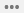

# Meddelandespårning i Säkerhets- och efterlevnadscenterMessage trace in the Security & Compliance Center

## ÖversiktOverview

Meddelandespårning i Security & Compliance Center följer e-postmeddelanden när de färdas genom din Exchange Online-organisation.Message trace in the Security & Compliance Center follows email messages as they travel through your Exchange Online organization. Du kan avgöra om ett meddelande togs emot, avvisades, sköts upp eller levererades av tjänsten.You can determine if a message was received, rejected, deferred, or delivered by the service. Den visar också vilka åtgärder som vidtogs på meddelandet innan det nådde sin slutliga status.It also shows what actions were taken on the message before it reached its final status.

Meddelandespårning i Security & Compliance Center förbättrar den ursprungliga meddelandespårningen som var tillgänglig i Administrationscentret för Exchange (EAC).Message trace in the Security & Compliance Center improves upon the original message trace that was available in the Exchange admin center (EAC). Du kan använda informationen från meddelandespårning för att effektivt svara på användarfrågor om vad som hände med meddelanden, felsöka problem med e-postflödet och validera principändringar.You can use the information from message trace to efficiently answer user questions about what happened to messages, troubleshoot mail flow issues, and validate policy changes.

> [!NOTE]
> • För att göra en meddelandespårning måste du vara medlem i rollgrupperna Organisationshantering, Efterlevnadshantering eller Help Desk.• To do a message trace, you need to be a member of the Organization Management, Compliance Management or Help Desk role groups. Mer information finns i [Behörigheter i Säkerhets- och efterlevnadscentret](permissions-in-the-security-and-compliance-center.md).For more information, see [Permissions in the Security & Compliance Center](permissions-in-the-security-and-compliance-center.md).   • Det maximala antalet meddelanden som visas i resultatet beror på vilken rapporttyp du har valt (mer information finns i avsnittet [Välj rapporttyp).](#choose-report-type)• The maximum number of messages that are displayed in the results depends on the report type you selected (see the [Choose report type](#choose-report-type) section for details). [Cmdlet Get-HistoricalSearch](https://docs.microsoft.com/powershell/module/exchange/get-historicalsearch) i Exchange Online PowerShell eller fristående EOP PowerShell returnerar alla meddelanden i resultatet.The [Get-HistoricalSearch](https://docs.microsoft.com/powershell/module/exchange/get-historicalsearch) cmdlet in Exchange Online PowerShell or standalone EOP PowerShell returns all messages in the results.

## Öppna meddelandespårningOpen message trace

1. Öppna Säkerhets- & Compliance Center på <https://protection.office.com> .Open the Security & Compliance Center at <https://protection.office.com>.

2. Expandera **e-postflöde**och välj sedan **Meddelandespårning**.Expand **Mail flow**, and then select **Message trace**.

## Sidan Spåra meddelandenMessage trace page

Härifrån kan du starta en ny standardspårning genom att klicka på knappen **Starta en spårning.**From here you can start a new default trace by clicking on the **Start a trace** button. Detta söker efter alla meddelanden för alla avsändare och mottagare under de senaste två dagarna.This will search for all messages for all senders and recipients for the last two days. Du kan också använda en av de lagrade frågorna från de tillgängliga frågekategorierna och antingen köra dem som de är eller använda dem som utgångspunkter för dina egna frågor:Or you can use one of the stored queries from the available query categories and either run them as-is or use them as starting points for your own queries:

- **Standardfrågor**: Inbyggda frågor från Microsoft 365.**Default queries**: Built-in queries provided by Microsoft 365.

- **Anpassade frågor**: Frågor som sparats av administratörer i organisationen för framtida användning.**Custom queries**: Queries saved by admins in your organization for future use.

- **Autosparade frågor**: De senaste tio senaste körningsfrågorna.**Autosaved queries**: The last ten most recently run queries. Denna lista gör det enkelt att fortsätta där du slutade.This list makes it simple to pick up where you left off.

På den här sidan finns också ett **avsnitt med nedladdningsbara rapporter** för de förfrågningar du har skickat in, samt själva rapporterna när det finns tillgängliga för nedladdning.Also on this page is a **Downloadable reports** section for the requests you've submitted, as well as the reports themselves when they're are available for download.

## Alternativ för en ny meddelandespårningOptions for a new message trace

### Filtrera efter avsändare och mottagareFilter by senders and recipients

Standardvärdena är **Alla avsändare** och **Alla mottagare**, men du kan använda följande fält för att filtrera resultaten:The default values are **All senders** and **All recipients**, but you can use the following fields to filter the results:

- **Av dessa personer**: Klicka i det här fältet för att välja en eller flera avsändare från din organisation.**By these people**: Click in this field to select one or more senders from your organization. Du kan också börja skriva ett namn och objekten i listan filtreras efter det du har skrivit, ungefär som hur en söksida fungerar.You can also start to type a name and the items in the list will be filtered by what you've typed, much like how a search page behaves.

- **Till dessa personer**: Klicka i det här fältet för att välja en eller flera mottagare i organisationen.**To these people**: Click in this field to select one or more recipients in your organization.

> [!NOTE]
> Du kan också skriva e-postadresser till externa avsändare och mottagare.You can also type the email addresses of external senders and recipients. Jokertecken stöds (till exempel `*@contoso.com` ), men du kan inte använda flera jokerteckenposter i samma fält samtidigt.Wildcards are supported (for example, `*@contoso.com`), but you can't use multiple wildcard entries in the same field at the same time.    Du kan klistra in flera avsändare eller mottagarlistor avgränsade med semikolon ( `;` ).You can paste multiple senders or recipients lists separated by semicolons (`;`). utrymmen ( `\s` ), vagnreturer ( `\r` ) eller nästa rader ( `\n` ).spaces (`\s`), carriage returns (`\r`), or next lines (`\n`).

### TidsintervallTime range

Standardvärdet är **2 dagar,** men du kan ange datum-/tidsintervall på upp till 90 dagar.The default value is **2 days**, but you can specify date/time ranges of up to 90 days. När du använder datum-/tidsintervall bör du tänka på följande:When you use date/time ranges, consider these issues:

- Som standard väljer du tidsintervallet i **skjutreglagevyn** med hjälp av en tidsrad.By default, you select the time range in **Slider** view using a time line. Du kan bara välja vilka dag- eller tidsinställningar som ska visas.You can only select the day or time settings that are displayed. Om du försöker välja ett mellanvärde fästs start-/slutbubblan mot närmaste visade inställning.Trying to select an in-between value will snap the start/end bubble to the nearest displayed setting.

  

  Men du kan också växla till **anpassad** vy där du kan ange **värdena startdatum** och **slutdatum** (inklusive tider) och du kan också välja **tidszonen** för datum-/tidsintervallet.But, you can also switch to **Custom** view where you can specify the **Start date** and **End date** values (including times), and you can also select the **Time zone** for the date/time range. Observera att **Time zone** tidszonsinställningen gäller både frågeindata och frågeresultat.Note that the **Time zone** setting applies to both your query inputs and your query results.

  

  I 10 dagar eller mindre är resultaten tillgängliga direkt som en **sammanfattande** rapport.For 10 days or less, the results are available instantly as a **Summary** report. Om du anger ett tidsintervall som är ännu något större än 10 dagar, kommer resultaten att fördröjas eftersom de bara är tillgängliga som en nedladdningsbar CSV-fil **(Förbättrad sammanfattning** eller **Utökade** rapporter).If you specify a time range that's even slightly greater than 10 days, the results will be delayed as they are only available as a downloadable CSV file ( **Enhanced summary** or **Extended** reports).

  Mer information om de olika rapporttyperna finns i avsnittet [Välj rapporttyp](#choose-report-type) i det här avsnittet.For more information about the different report types, see the [Choose report type](#choose-report-type) section in this topic.

  **Förbättrade**sammanfattnings- och utökade rapporter förbereds med hjälp av arkiverade meddelandespårningsdata, och det kan ta upp till flera timmar innan rapporten är tillgänglig för hämtning.**Note**: Enhanced summary and Extended reports are prepared using archived message trace data, and it can take up to several hours before your report is available for download. Beroende på hur många andra administratörer som också har skickat rapportbegäranden ungefär samtidigt kan du också märka en fördröjning innan bearbetningen startar för din köbegäran.Depending on how many other admins have also submitted report requests around the same time, you might also notice a delay before processing starts for your queued request.

- Om du sparar en fråga i **skjutreglagevyn** sparar du det relativa tidsintervallet (till exempel 3 dagar från och med idag).Saving a query in **Slider** view saves the relative time range (for example, 3 days from today). Om du sparar en fråga i **anpassad** vy sparas det absoluta datum-/tidsintervallet (till exempel 2018-05-06 13:00 till 2018-05-08 18:00).Saving a query in **Custom** view saves the absolute date/time range (for example, 2018-05-06 13:00 to 2018-05-08 18:00).

### Fler sökalternativMore search options

#### LeveransstatusDelivery status

Du kan lämna standardvärdet **Alla** markerade, eller så kan du välja ett av följande värden för att filtrera resultaten:You can leave the default value **All** selected, or you can select one of the following values to filter the results:

- **Levererad**: Meddelandet har levererats till den avsedda destinationen.**Delivered**: The message was successfully delivered to the intended destination.

- **Väntar :** Leverans av meddelandet görs eller försökers på nytt.**Pending**: Delivery of the message is being attempted or re-attempted.

- **Expanderad**: En mottagare av distributionsgrupper expanderades före leverans till de enskilda medlemmarna i gruppen.**Expanded**: A distribution group recipient was expanded before delivery to the individual members of the group.

- **Misslyckades**: Meddelandet levererades inte.**Failed**: The message was not delivered.

- **I karantän**: Meddelandet sattes i karantän (som skräppost, massutskick eller nätfiske).**Quarantined**: The message was quarantined (as spam, bulk mail, or phishing). Mer information finns i [EOP i karantän](quarantine-email-messages.md).For more information, see [Quarantined email messages in EOP](quarantine-email-messages.md).

- **Filtreras som skräppost**: Meddelandet identifierades spam, och avvisades eller blockerades (inte karantän).**Filtered as spam**: The message was identified spam, and was rejected or blocked (not quarantined).

- **Hämta status:** Meddelandet togs nyligen emot av Microsoft 365, men inga andra statusdata är ännu tillgängliga.**Getting status:** The message was recently received by Microsoft 365, but no other status data is yet available. Kom tillbaka om några minuter.Check back in a few minutes.

**De**värden som **väntar,** **sätts i karantän**och Filtrera som **skräppost** är endast tillgängliga för sökningar mindre än 10 dagar.**Note**: The values **Pending,** **Quarantined**, and **Filter as spam** are only available for searches less than 10 days. Det kan också finnas en fördröjning på 5 till 10 minuter mellan den faktiska och rapporterade leveransstatusen.Also, there might be a 5 to 10 minute delay between the actual and reported delivery status.

#### Meddelande-IDMessage ID

Det här är internetmeddelande-ID (kallas även klient-ID) som finns i **fältet Meddelande-ID:** sidhuvud i meddelandehuvudet.This is the internet message ID (also known as the Client ID) that's found in the **Message-ID:** header field in the message header. Användare kan ge dig det här värdet för att undersöka specifika meddelanden.Users can give you this value to investigate specific messages.

Det här värdet är konstant under meddelandets livstid.This value is constant for the lifetime of the message. För meddelanden som skapats i Microsoft 365 eller Exchange är värdet i formatet `<GUID@ServerFQDN>` , inklusive vinkelparenteserna ( \< \> ).For messages created in Microsoft 365 or Exchange, the value is in the format `<GUID@ServerFQDN>`, including the angle brackets (\< \>). Till exempel `<d9683b4c-127b-413a-ae2e-fa7dfb32c69d@DM3NAM06BG401.Eop-nam06.prod.protection.outlook.com>`.For example, `<d9683b4c-127b-413a-ae2e-fa7dfb32c69d@DM3NAM06BG401.Eop-nam06.prod.protection.outlook.com>`. Andra meddelandesystem kan använda olika syntax eller värden.Other messaging systems might use different syntax or values. Detta värde är tänkt att vara unik, men inte alla e-postsystem strikt följa detta krav.This value is supposed to be unique, but not all email systems strictly follow this requirement. Om **fältet Meddelande-ID:** huvud inte finns eller är tomt för inkommande meddelanden från externa källor tilldelas ett godtyckligt värde.If the **Message-ID:** header field doesn't exist or is blank for incoming messages from external sources, an arbitrary value is assigned.

När du använder **Meddelande-ID** för att filtrera resultaten måste du inkludera hela strängen, inklusive eventuella vinkelparenteser.When you use **Message ID** to filter the results, be sure to include the full string, including any angle brackets.

#### RiktningDirection

Du kan lämna standardvärdet **Alla** markerade eller välja **Inkommande** (meddelanden som skickas till mottagare i organisationen) eller **Utgående** (meddelanden som skickas från användare i organisationen) för att filtrera resultaten.You can leave the default value **All** selected, or you can select **Inbound** (messages sent to recipients in your organization) or **Outbound** (messages sent from users in your organization) to filter the results.

#### Ursprunglig klient-IP-adressOriginal client IP address

Du kan filer resultaten efter klient IP-adress för att undersöka hackade datorer som skickar stora mängder skräppost eller skadlig kod.You can filer the results by client IP address to investigate hacked computers that are sending large amounts of spam or malware. Även om meddelandena kan verka komma från flera avsändare är det troligt att samma dator genererar alla meddelanden.Although the messages might appear to come from multiple senders, it's likely that the same computer is generating all of the messages.

**Klientens**IP-adressinformation är endast tillgänglig i 10 dagar och är endast tillgänglig i **rapporterna Utökad sammanfattning** eller **Utökad (nedladdningsbara** CSV-filer).**Note**: The client IP address information is only available for 10 days, and is only available in the **Enhanced summary** or **Extended** reports (downloadable CSV files).

### Välj rapporttypChoose report type

De tillgängliga rapporttyperna är:The available report types are:

- **Sammanfattning**: Tillgänglig om tidsintervallet är mindre än 10 dagar och kräver inga ytterligare filtreringsalternativ.**Summary**: Available if the time range is less than 10 days, and requires no additional filtering options. Resultaten är tillgängliga nästan omedelbart efter att du klickar på **Sök**.The results are available almost immediately after you click **Search**. Rapporten ger tillbaka upp till 20000 års resultat.The report returns up to 20000 results.

- **Förbättrad sammanfattning** eller **Utökad:** Dessa rapporter är endast tillgängliga som nedladdningsbara CSV-filer och kräver ett eller flera av följande filtreringsalternativ oavsett tidsintervall: **Av dessa personer**, Till dessa **personer**eller **Meddelande-ID**.**Enhanced summary** or **Extended**: These reports are only available as downloadable CSV files, and require one or more of the following filtering options regardless of the time range: **By these people**, **To these people**, or **Message ID**. Du kan använda jokertecken för avsändare eller mottagare (till exempel \* @contoso.com).You can use wildcards for the senders or the recipients (for example, \*@contoso.com). Den förbättrade sammanfattningsrapporten returnerar upp till 50000 resultat.The Enhanced summary report returns up to 50000 results. Den utökade rapporten ger upp till 1 000 resultat.The Extended report returns up to 1000 results.

**Anmärkningar**:**Notes**:

- Förbättrade sammanfattningsrapporter och utökade rapporter förbereds med hjälp av arkiverade meddelandespårningsdata, och det kan ta upp till flera timmar innan rapporten är tillgänglig för nedladdning.Enhanced summary and Extended reports are prepared using archived message trace data, and it can take up to several hours before your report is available to download. Beroende på hur många andra administratörer som också har skickat rapportbegäranden ungefär samtidigt kan du också märka en fördröjning innan din köbegäran börjar bearbetas.Depending on how many other admins have also submitted report requests around the same time, you might also notice a delay before your queued request starts to be processed.

- Du kan välja en utökad sammanfattning eller utökad rapport för valfritt datum-/tidsintervall, men vanligtvis är de senaste fyra timmarna arkiverade data ännu inte tillgängliga för dessa två typer av rapporter.While you can select an Enhanced summary or Extended report for any date/time range, commonly the last four hours of archived data will not yet be available for these two types of reports.

När du klickar på **Nästa**visas en sammanfattningssida med en lista över de filtreringsalternativ som du har valt, en unik (redigerbar) rubrik för rapporten och den e-postadress som tar emot meddelandet när meddelandespårningen är klar (även redigerbar och måste finnas i en av organisationens accepterade domäner).When you click **Next**, you're presented with a summary page that lists the filtering options that you selected, a unique (editable) title for the report, and the email address that receives the notification when the message trace completes (also editable, and must be in one of your organization's accepted domains). Klicka på **Förbered rapport** om du vill skicka meddelandespårningen.Click **Prepare report** to submit the message trace. På huvudsidan **för meddelandespårning** kan du se rapportens status i avsnittet **Nedladdningsbara rapporter.**On the main **Message trace** page, you can see the status of the report in the **Downloadable reports** section.

Mer information om informationen som returneras i de olika rapporttyperna finns i nästa avsnitt.For more information about the information that's returned in the different report types, see the next section.

## Resultat för meddelandespårningMessage trace results

De olika rapporttyperna returnerar olika informationsnivåer.The different report types return different levels of information. Informationen som är tillgänglig i de olika rapporterna beskrivs i följande avsnitt.The information that's available in the different reports is described in the following sections.

### Utdata för sammanfattande rapportSummary report output

När du har kört meddelandespårningen visas resultaten, sorterade efter fallande datum/tid (senaste först).After running the message trace, the results will be listed, sorted by descending date/time (most recent first).

Sammanfattningsrapporten innehåller följande information:The summary report contains the following information:

- **Datum**: Datum och tid då meddelandet togs emot av tjänsten med hjälp av den konfigurerade UTC-tidszonen.**Date**: The date and time at which the message was received by the service, using the configured UTC time zone.

- **Avsändare**: Avsändarens e-postadress*alias*( @ *aliasdomän*).**Sender**: The email address of the sender (*alias*@*domain*).

- **Mottagare**: Mottagarens eller mottagarnas e-postadress.**Recipient**: The email address of the recipient or recipients. För ett meddelande som skickas till flera mottagare finns det en rad per mottagare.For a message sent to multiple recipients, there's one line per recipient. Om mottagaren är en distributionsgrupp, en dynamisk distributionsgrupp eller en e-postaktiverad säkerhetsgrupp blir gruppen den första mottagaren och sedan är varje medlem i gruppen på en separat rad.If the recipient is a distribution group, dynamic distribution group, or mail-enabled security group, the group will be the first recipient, and then each member of the group is on a separate line.

- **Ämne**: De första 256 tecknen i meddelandets **ämne:** fält.**Subject**: The first 256 characters of the message's **Subject:** field.

- **Status**: Dessa värden beskrivs i avsnittet [Leveransstatus.](#delivery-status)**Status**: These values are described in the [Delivery status](#delivery-status) section.

Som standard läses de första 250 resultaten in och är lättillgängliga.By default, the first 250 results are loaded and readily available. När du rullar nedåt finns det en liten paus när nästa omgång resultat läses in.When you scroll down, there's a slight pause as the next batch of results are loaded. I stället för att rulla kan du klicka på **Ladda alla** för att läsa in alla resultat upp till maximalt 10 000.Instead of scrolling, you can click **Load all** to load all of the results up to a maximum of 10,000.

Du kan klicka på kolumnrubrikerna för att sortera resultaten efter värdena i den kolumnen i stigande eller fallande ordning.You can click on the column headers to sort the results by the values in that column in ascending or descending order.

Du kan klicka på **Filtrera resultat** om du vill filtrera resultaten efter en eller flera kolumner.You can click **Filter results** to filter the results by one or more columns.

Du kan exportera resultaten när du har markerat en eller flera rader genom att klicka på **Exportera resultat** och sedan välja Exportera **alla resultat,** **Exportera inlästa resultat**eller Exportera **markerade**.You can export the results after you've selected one or more rows by clicking **Export results** and then selecting **Export all results**, **Export loaded results**, or **Export selected**.

#### Hitta relaterade poster för det här meddelandetFind related records for this message

Relaterade meddelandeposter är poster som delade samma meddelande-ID.Related message records are records that shared the same Message ID. Kom ihåg att även ett enda meddelande som skickas mellan två personer kan generera flera poster.Remember, even a single message sent between two people can generate multiple records. Antalet poster ökar när meddelandet påverkas av distributionsgruppsexpansion, vidarebefordran, regler för e-postflöde (kallas även transportregler) etc.The number of records increases when the message is affected by distribution group expansion, forwarding, mail flow rules (also known as transport rules), etc.

När du har markerat en rads kryssruta kan du hitta relaterade poster för meddelandet genom att klicka på knappen **Sök relaterad** som visas eller genom att välja **Fler alternativ**  \> **sökrelaterade poster för det här meddelandet**).After you select a row's check box, you can find related records for the message by clicking the **Find related** button that appears, or by selecting **More options**  \> **Find related records for this message**).

Mer information om meddelande-ID finns i avsnittet Meddelande-ID tidigare i det här avsnittet.For more information about the Message ID, see the Message ID section earlier in this topic.

#### Information om meddelandespårningMessage trace details

I utdata för sammanfattningsrapporten kan du visa information om ett meddelande med någon av följande metoder:In the summary report output, you can view details about a message by using either of the following methods:

- Markera raden (klicka var som helst på raden utom kryssrutan).Select the row (click anywhere in the row except the check box).

- Markera radens kryssruta och klicka på **Fler alternativ** Mer  \> **meddelandeinformation**.Select the row's check box and click **More options**  \> **View message details**.

   

Meddelandespårningsinformationen innehåller följande ytterligare information som inte finns i sammanfattningsrapporten:The message trace details contain the following additional information that's not present in the summary report:

- **Meddelandehändelser**: Det här avsnittet innehåller klassificeringar som hjälper till att kategorisera de åtgärder som tjänsten vidtar för meddelanden.**Message events**: This section contains classifications that help categorize the actions that the service takes on messages. **Några av de mer intressanta händelser** som du kan stöta på är:**Some of the more interesting events** that you might encounter are:

  - **Ta emot**: Meddelandet togs emot av tjänsten.**Receive**: The message was received by the service.

  - **Skicka**: Meddelandet skickades av tjänsten.**Send**: The message was sent by the service.

  - **Misslyckas**: Det gick inte att leverera meddelandet.**Fail**: The message failed to be delivered.

  - **Leverans**: Meddelandet levererades till en postlåda.**Deliver**: The message was delivered to a mailbox.

  - **Expandera**: Meddelandet skickades till en distributionsgrupp som har expanderats.**Expand**: The message was sent to a distribution group that was expanded.

  - **Överföring**: Mottagarna har flyttats till ett bifurcated meddelande på grund av innehållskonvertering, meddelandemottagare gränser eller agenter.**Transfer**: Recipients were moved to a bifurcated message because of content conversion, message recipient limits, or agents.

  - **Skjut upp**: Meddelandets leverans sköts upp och kan göras om senare.**Defer**: The message delivery was postponed and might be re-attempted later.

  - **Löst**: Meddelandet omdirigerades till en ny mottagaradress baserat på en Active Directory-uppslag.**Resolved**: The message was redirected to a new recipient address based on an Active Directory look up. När detta inträffar visas den ursprungliga mottagaradressen på en separat rad i meddelandespårningen tillsammans med meddelandets slutliga leveransstatus.When this happens, the original recipient address is listed in a separate row in the message trace along with the final delivery status for the message.

  Kommentarer:Notes:

  - Ett händelselöst meddelande som har levererats genererar flera **händelseposter** i meddelandespårningen.An uneventful message that's successfully delivered will generate multiple **Event** entries in the message trace.

  - Denna förteckning är inte avsedd att vara uttömmande.This list is not meant to be exhaustive. Beskrivningar av fler händelser finns [i Händelsetyper i meddelandespårningsloggen](https://docs.microsoft.com/Exchange/mail-flow/transport-logs/message-tracking#event-types-in-the-message-tracking-log).For descriptions of more events, see [Event types in the message tracking log](https://docs.microsoft.com/Exchange/mail-flow/transport-logs/message-tracking#event-types-in-the-message-tracking-log). Observera att den här länken är ett Exchange Server-ämne (lokalt Exchange).Note that this link is an Exchange Server (on-premises Exchange) topic.

- **Mer information**: Det här avsnittet innehåller följande information:**More information**: This section contains the following details:

  - **Meddelande-ID:** Det här värdet beskrivs i avsnittet [Meddelande-ID](#message-id) tidigare i det här avsnittet.**Message ID**: This value is described in the [Message ID](#message-id) section earlier in this topic. Till exempel `<d9683b4c-127b-413a-ae2e-fa7dfb32c69d@DM3NAM06BG401.Eop-nam06.prod.protection.outlook.com>`.For example, `<d9683b4c-127b-413a-ae2e-fa7dfb32c69d@DM3NAM06BG401.Eop-nam06.prod.protection.outlook.com>`.

  - **Meddelandestorlek****Message size**

  - **Från IP:** IP-adressen för den dator som skickade meddelandet.**From IP**: The IP address of the computer that sent the message. För utgående meddelanden som skickas från Exchange Online är det här värdet tomt.For outbound messages sent from Exchange Online, this value is blank.

  - **Till IP:** IP-adressen eller adresserna där tjänsten försökte leverera meddelandet.**To IP**: The IP address or addresses where the service attempted to deliver the message. Om meddelandet har flera mottagare visas dessa.If the message has multiple recipients, these are displayed. För inkommande meddelanden som skickas till Exchange Online är det här värdet tomt.For inbound messages sent to Exchange Online, this value is blank.

### Förbättrade sammanfattningsrapporterEnhanced summary reports

Tillgängliga (slutförda) Förbättrade sammanfattningsrapporter finns i avsnittet **Nedladdningsbara rapporter** i början av meddelandespårningen.Available (completed) Enhanced summary reports are available in the **Downloadable reports** section at the beginning message trace. Följande information finns i rapporten:The following information is available in the report:

- **origin_timestamp** \* : Datum och tid då meddelandet ursprungligen togs emot av tjänsten med hjälp av den konfigurerade UTC-tidszonen.**origin_timestamp**\*: The date and time when the message was initially received by the service, using the configured UTC time zone.

- **sender_address**: Avsändarens e-postadress (*alias* @ *aliasdomän*).**sender_address**: The sender's email address (*alias*@*domain*).

- **Recipient_status**: Status för leveransen av meddelandet till mottagaren.**Recipient_status**: The status of the delivery of the message to the recipient. Om meddelandet skickades till flera mottagare visas alla mottagare och motsvarande status för varje, i formatet: \< *e-postadressstatus* \> ## \< *status* \> .If the message was sent to multiple recipients, it will show all the recipients and the corresponding status for each, in the format: \<*email address*\>##\<*status*\>. Ett exempel:For example:

  - **##Receive betyder Send** att meddelandet togs emot av tjänsten och skickades till det avsedda målet.**##Receive, Send** means the message was received by the service and was sent to the intended destination.

  - **##Receive betyder det inte** att meddelandet togs emot av tjänsten men leveransen till det avsedda målet misslyckades.**##Receive, Fail** means the message was received by the service but delivery to the intended destination failed.

  - **##Receive betyder att** meddelandet togs emot av tjänsten och levererades till mottagarens postlåda.**##Receive, Deliver** means the message was received by the service and was delivered to the recipient's mailbox.

- **message_subject**: De första 256 tecknen i meddelandets **ämnesfält.****message_subject**: The first 256 characters of the message's **Subject** field.

- **total_bytes**: Meddelandets storlek i byte, inklusive bilagor.**total_bytes**: The size of the message in bytes, including attachments.

- **message_id**: Det här värdet beskrivs i avsnittet [Meddelande-ID](#message-id) tidigare i det här avsnittet.**message_id**: This value is described in the [Message ID](#message-id) section earlier in this topic. Till exempel `<d9683b4c-127b-413a-ae2e-fa7dfb32c69d@DM3NAM06BG401.Eop-nam06.prod.protection.outlook.com>`.For example, `<d9683b4c-127b-413a-ae2e-fa7dfb32c69d@DM3NAM06BG401.Eop-nam06.prod.protection.outlook.com>`.

- **network_message_id**: Ett unikt meddelande-ID-värde som finns kvar i alla kopior av meddelandet som kan skapas på grund av bifurkation eller distributionsgruppsexpansion.**network_message_id**: A unique message ID value that persists across all copies of the message that might be created due to bifurcation or distribution group expansion. Ett exempelvärde är `1341ac7b13fb42ab4d4408cf7f55890f` .An example value is `1341ac7b13fb42ab4d4408cf7f55890f`.

- **original_client_ip**: IP-adressen för avsändarens klient.**original_client_ip**: The IP address of the sender's client.

- **riktning**: Anger om meddelandet skickades inkommande (1) till din organisation eller om det skickades utgående (2) från din organisation.**directionality**: Indicates whether the message was sent inbound (1) to your organization, or whether it was sent outbound (2) from your organization.

- **connector_id**: Namnet på käll- eller målkopplingen.**connector_id**: The name of the source or destination connector. Mer information om anslutningsappar i Exchange Online finns i [Konfigurera e-postflöde med kopplingar i Office 365](https://docs.microsoft.com/Exchange/mail-flow-best-practices/use-connectors-to-configure-mail-flow/use-connectors-to-configure-mail-flow).For more information about connectors in Exchange Online, see [Configure mail flow using connectors in Office 365](https://docs.microsoft.com/Exchange/mail-flow-best-practices/use-connectors-to-configure-mail-flow/use-connectors-to-configure-mail-flow).

- **delivery_priority** \* : Om meddelandet har skickats med **hög,** **låg**eller **normal** prioritet.**delivery_priority**\*: Whether the message was sent with **High**, **Low**, or **Normal** priority.

\*Dessa egenskaper är endast tillgängliga i förbättrade sammanfattningsrapporter.\*These properties are only available in Enhanced summary reports.

### Utökade rapporterExtended reports

Tillgängliga (slutförda) Utökade rapporter finns i avsnittet **Nedladdningsbara rapporter** i början av meddelandespårningen.Available (completed) Extended reports are available in the **Downloadable reports** section at the beginning of message trace. Praktiskt taget all information från en förbättrad sammanfattande rapport finns i en utökad rapport (med undantag **för origin_timestamp** och **delivery_priority).**Virtually all of the information from an Enhanced summary report is available in an Extended report (with the exception of **origin_timestamp** and **delivery_priority**). Följande ytterligare information är endast tillgänglig i en utökad rapport:The following additional information is only available in an Extended report:

- **client_ip**: IP-adressen för e-postservern eller meddelandeklienten som skickade meddelandet.**client_ip**: The IP address of the email server or messaging client that submitted the message.

- **client_hostname**: Värdnamnet eller FQDN för e-postservern eller meddelandeklienten som skickade meddelandet.**client_hostname**: The host name or FQDN of the email server or messaging client that submitted the message.

- **server_ip**: Käll- eller målserverns IP-adress.**server_ip**: The IP address of the source or destination server.

- **server_hostname**: Målserverns värdnamn eller FQDN.**server_hostname**: The host name or FQDN of the destination server.

- **source_context**: Extra information som är associerad med **källfältet.****source_context**: Extra information associated with the **source** field. Ett exempel:For example:

  - `Protocol Filter Agent`

  - `3489061114359050000`

- **källa**: Exchange Online-komponenten som är ansvarig för händelsen.**source**: The Exchange Online component that's responsible for the event. Ett exempel:For example:

  - `AGENT`

  - `MAILBOXRULE`

  - `SMTP`

- **event_id**: Dessa motsvarar de **meddelandehändelsevärden** som förklaras i avsnittet [Sök relaterade poster för det här meddelandet.](#find-related-records-for-this-message)**event_id**: These correspond to the **Message event** values that are explained in the [Find related records for this message](#find-related-records-for-this-message) section.

- **internal_message_id:** En meddelandeidentifierare som tilldelas av Exchange Online-servern som för närvarande bearbetar meddelandet.**internal_message_id**: A message identifier that's assigned by the Exchange Online server that's currently processing the message.

- **recipient_address**: E-postadresserna till meddelandets mottagare.**recipient_address**: The email addresses of the message's recipients. Flera e-postadresser avgränsas med semikolontecknet (;).Multiple email addresses are separated by the semicolon character (;).

- **recipient_count**: Det totala antalet mottagare i meddelandet.**recipient_count**: The total number of recipients in the message.

- **related_recipient_address**: Används med `EXPAND` , och händelser för att visa andra mottagare `REDIRECT` `RESOLVE` e-postadresser som är associerade med meddelandet.**related_recipient_address**: Used with `EXPAND`, `REDIRECT`, and `RESOLVE` events to display other recipient email addresses that are associated with the message.

- **referens**: Det här fältet innehåller ytterligare information för specifika typer av händelser.**reference**: This field contains additional information for specific types of events. Ett exempel:For example:

  - **DSN**: Innehåller rapportlänken, som är **det message_id** värdet för meddelandet om associerad leveransstatus (kallas även DSN, icke-leveransrapport, NDR eller avvisningsmeddelande) om ett DSN genereras efter den här händelsen.**DSN**: Contains the report link, which is the **message_id** value of the associated delivery status notification (also known as a DSN, non-delivery report, NDR, or bounce message) if a DSN is generated subsequent to this event. Om detta är ett DSN-meddelande innehåller det här fältet **värdet message_id** för det ursprungliga meddelandet som DSN skapades för.If this is a DSN message, this field contains the **message_id** value of the original message that the DSN was generated for.

  - **EXPANDERA**: Innehåller **värdet related_recipient_address** för relaterade meddelanden.**EXPAND**: Contains the **related_recipient_address** value of the related messages.

  - **MOTTAGNING:** Kan innehålla **värdet message_id** för det relaterade meddelandet om meddelandet genererades av andra processer (till exempel inkorgsregler).**RECEIVE**: Might contain the **message_id** value of the related message if the message was generated by other processes (for example, Inbox rules).

  - **SKICKA**: Innehåller **värdet internal_message_id** för alla DSN-meddelanden.**SEND**: Contains the **internal_message_id** value of any DSN messages.

  - **ÖVERFÖRING**: Innehåller **värdet internal_message_id** för meddelandet som kluvnas (till exempel genom innehållskonvertering, meddelandemottagares gränser eller agenter).**TRANSFER**: Contains the **internal_message_id** value of the message that's being forked (for example, by content conversion, message recipient limits, or agents).

  - **MAILBOXRULE**: Innehåller **värdet internal_message_id** för det inkommande meddelandet som orsakade inkorgsregeln för att generera det utgående meddelandet.**MAILBOXRULE**: Contains the **internal_message_id** value of the inbound message that caused the Inbox rule to generate the outbound message.

    För andra typer av händelser är det här fältet vanligtvis tomt.For other types of events, this field is usually blank.

- **return_path**: Den returadress som anges av kommandot **MAIL FROM** som skickade meddelandet.**return_path**: The return email address specified by the **MAIL FROM** command that sent the message. Även om det här fältet aldrig är tomt kan null-adressvärdet representeras som `<>` .Although this field is never empty, it can have the null sender address value represented as `<>`.

- **message_info**: Ytterligare information om meddelandet.**message_info**: Additional information about the message. Ett exempel:For example:

  - Datumtid för meddelandeoriginering i UTC för `DELIVER` och `SEND` händelser.The message origination date-time in UTC for `DELIVER` and `SEND` events. Datumtiden för originering är den tidpunkt då meddelandet först kom in i Exchange Online-organisationen.The origination date-time is the time when the message first entered the Exchange Online organization. UTC-datumtiden representeras i datum-tidsformatet ISO 8601: `yyyy-mm-ddThh:mm:ss.fffZ` , där `yyyy` = år, = `mm` `dd` månad, = dag, `T` anger början på tidskomponenten, `hh` = timme, = `mm` minut, = `ss` sekund, = `fff` bråkdelar av en sekund och betyder `Z` , vilket är ett annat sätt att beteckna `Zulu` UTC.The UTC date-time is represented in the ISO 8601 date-time format: `yyyy-mm-ddThh:mm:ss.fffZ`, where `yyyy` = year, `mm` = month, `dd` = day, `T` indicates the beginning of the time component, `hh` = hour, `mm` = minute, `ss` = second, `fff` = fractions of a second, and `Z` signifies `Zulu`, which is another way to denote UTC.

  - Autentiseringsfel.Authentication errors. Du kan till exempel se värdet `11a` och typen av autentisering som användes när autentiseringsfelet inträffade.For example, you might see the value `11a` and the type of authentication that was used when the authentication error occurred.

- **tenant_id**: Ett GUID-värde som representerar Exchange Online-organisationen (till exempel `39238e87-b5ab-4ef6-a559-af54c6b07b42` ).**tenant_id**: A GUID value that represents the Exchange Online organization (for example, `39238e87-b5ab-4ef6-a559-af54c6b07b42`).

- **original_server_ip**: IP-adressen för den ursprungliga servern.**original_server_ip**: The IP address of the original server.

- **custom_data**: Innehåller data som är relaterade till specifika händelsetyper.**custom_data**: Contains data related to specific event types. Mer information finns i följande avsnitt.For more information, see the following sections.

#### custom_data värdencustom_data values

Fältet **custom_data** för en `AGENTINFO` händelse används av en mängd olika Exchange Online-agenter för att logga information om meddelandebearbetning.The **custom_data** field for an `AGENTINFO` event is used by a variety of Exchange Online agents to log message processing details. Några av de mer intressanta agenter beskrivs i följande avsnitt.Some of the more interesting agents are described in the following sections.

#### Agent för skräppostfilterSpam filter agent

Ett **custom_data** värde som börjar med `S:SFA` kommer från spamfilteragenten.A **custom_data** value that starts with `S:SFA` is from the spam filter agent. De viktigaste detaljerna beskrivs i följande tabell:The key details are described in the following table:

|**Värde****Value**|**Beskrivning****Description**|
|:-----|:-----|
|`SFV=NSPM`|Meddelandet har markerats som icke skräppost och skickats till avsedda mottagare.The message was marked as non-spam and was sent to the intended recipients.|
|`SFV=SPM`|Meddelandet markerades som skräppost genom skräppostfiltrering (kallas även innehållsfiltrering).The message was marked as spam by anti-spam filtering (also known as content filtering).|
|`SFV=BLK`|Filtrering hoppades över och meddelandet blockerades eftersom det kom från en blockerad avsändare.Filtering was skipped and the message was blocked because it originated from a blocked sender.|
|`SFV=SKS`|Meddelandet markerades som skräppost innan det bearbetades av skräppostfiltrering.The message was marked as spam prior to being processed by anti-spam filtering. Detta inkluderar meddelanden där meddelandet har matchat en e-postflödesregel (även känt som transportregel) som automatiskt markerat det som skräppost och förbigått all ytterligare filtrering.This includes messages where the message matched a mail flow rule (also known as a transport rule) to automatically mark it as spam and bypass all additional filtering.|
|`SCL=<number>`|Mer information om de olika SCL-värdena och vad de betyder finns i [Säkerhetsnivåer för skräppost](spam-confidence-levels.md).For more information about the different SCL values and what they mean, see [Spam confidence levels](spam-confidence-levels.md).|
|`PCL=<number>`|Pcl-värdet (Phishing Confidence Level) för meddelandet.The Phishing Confidence Level (PCL) value of the message. Dessa kan tolkas på samma sätt som SCL värden dokumenteras i [Spam förtroende nivåer](spam-confidence-levels.md).These can be interpreted the same way as the SCL values documented in [Spam confidence levels](spam-confidence-levels.md).|
|`DI=SB`|Meddelandets avsändare blockerades.The sender of the message was blocked.|
|`DI=SQ`|Meddelandet sattes i karantän.The message was quarantined.|
|`DI=SD`|Meddelandet har tagits bort.The message was deleted.|
|`DI=SJ`|Meddelandet skickades till mottagarens skräppostmapp.The message was sent to the recipient's Junk Email folder.|
|`DI=SN`|Meddelandet dirigerades genom den normala utgående leveranspoolen.The message was routed through the normal outbound delivery pool.|
|`DI=SO`|Meddelandet dirigerades genom leveranspoolen för högre risk.The message was routed through the higher risk delivery pool. Mer information finns i [Högriskleveranspool för utgående meddelanden](high-risk-delivery-pool-for-outbound-messages.md).For more information, see [High-risk delivery pool for outbound messages](high-risk-delivery-pool-for-outbound-messages.md).|
|`SFS=[a]|SFS=[b]`|Detta anger att spam regler matchades.This denotes that spam rules were matched.|
|`IPV=CAL`|Meddelandet släpptes igenom skräppostfiltret då IP-adressen specificerades i en lista över tillåtna IP-adresser i anslutningsfiltret.The message was allowed through the spam filters because the IP address was specified in an IP Allow list in the connection filter.|
|`H=<EHLOstring>`|En anslutande e-mailservers HELO- eller OEHLO-sträng.The HELO or EHLO string of the connecting email server.|
|`PTR=<ReverseDNS>`|PTR-posten för den sändande IP-adressen, även känd som den omvända DNS-adressen.The PTR record of the sending IP address, also known as the reverse DNS address.|

Ett exempel **custom_data** värde för ett meddelande som filtreras för skräppost så här:An example **custom_data** value for a message that's filtered for spam like this:

`S:SFA=SUM|SFV=SPM|IPV=CAL|SRV=BULK|SFS=470454002|SFS=349001|SCL=9|SCORE=-1|LIST=0|DI=SN|RD=ftmail.inc.com|H=ftmail.inc.com|CIP=98.129.140.74|SFP=1501|ASF=1|CTRY=US|CLTCTRY=|LANG=en|LAT=287|LAT=260|LAT=18;`

#### Filteragent för skadlig kodMalware filter agent

Ett **custom_data** värde som börjar med `S:AMA` kommer från filteragenten för skadlig kod.A **custom_data** value that starts with `S:AMA` is from the malware filter agent. De viktigaste detaljerna beskrivs i följande tabell:The key details are described in the following table:

|**Värde****Value**|**Beskrivning****Description**|
|:-----|:-----|
|`AMA=SUM|v=1|`Eller`AMA=EV|v=1``AMA=SUM|v=1|` or `AMA=EV|v=1`|Meddelandet var fast beslutet att innehålla skadlig kod.The message was determined to contain malware. `SUM`visar att skadlig kod kan ha upptäckts av valfritt antal motorer.`SUM` indicates the malware could've been detected by any number of engines. `EV`visar att skadlig kod upptäcktes av en viss motor.`EV` indicates the malware was detected by a specific engine. När skadlig kod upptäcks av en motor utlöser detta efterföljande åtgärder.When malware is detected by an engine this triggers the subsequent actions.|
|`Action=r`|Meddelandet har ersatts.The message was replaced.|
|`Action=p`|Meddelandet kringgicks.The message was bypassed.|
|`Action=d`|Meddelandet sköts upp.The message was deferred.|
|`Action=s`|Meddelandet har tagits bort.The message was deleted.|
|`Action=st`|Meddelandet kringgicks.The message was bypassed.|
|`Action=sy`|Meddelandet kringgicks.The message was bypassed.|
|`Action=ni`|Meddelandet avvisades.The message was rejected.|
|`Action=ne`|Meddelandet avvisades.The message was rejected.|
|`Action=b`|Meddelandet blockerades.The message was blocked.|
|`Name=<malware>`|Namnet på den skadliga kod som upptäcktes.The name of the malware that was detected.|
|`File=<filename>`|Namnet på filen som innehöll skadlig kod.The name of the file that contained the malware.|

Ett exempel **custom_data** värde för ett meddelande som innehåller skadlig kod ser ut så här:An example **custom_data** value for a message that contains malware looks like this:

`S:AMA=SUM|v=1|action=b|error=|atch=1;S:AMA=EV|engine=M|v=1|sig=1.155.974.0|name=DOS/Test_File|file=filename;S:AMA=EV|engine=A|v=1|sig=201707282038|name=Test_File|file=filename`

#### Agent för transportregelTransport Rule agent

Ett **custom_data** värde som börjar med `S:TRA` kommer från transportregelagenten för regler för e-postflöde (kallas även transportregler).A **custom_data** value that starts with`S:TRA` is from the Transport Rule agent for mail flow rules (also known as transport rules). De viktigaste detaljerna beskrivs i följande tabell:The key details are described in the following table:

|**Värde****Value**|**Beskrivning****Description**|
|:-----|:-----|
|`ETR|ruleId=<guid>`|Regel-ID:t som matchades.The rule ID that was matched.|
|`St=<datetime>`|Datum och tid i UTC när regelmatchningen inträffade.The date and time in UTC when the rule match occurred.|
|`Action=<ActionDefinition>`|Åtgärden som tillämpades.The action that was applied. En lista över tillgängliga åtgärder finns [i Regelåtgärder för e-postflöde i Exchange Online](https://docs.microsoft.com/exchange/security-and-compliance/mail-flow-rules/mail-flow-rule-actions).For a list of available actions, see [Mail flow rule actions in Exchange Online](https://docs.microsoft.com/exchange/security-and-compliance/mail-flow-rules/mail-flow-rule-actions).|
|`Mode=<Mode>`|Regelns läge.The mode of the rule. Giltiga värden är:Valid values are:  \* **Verkställ:** Alla åtgärder för regeln kommer att verkställas.\* **Enforce**: All actions on the rule will be enforced.  \* **Testa med policytips:**: Alla policytipsåtgärder skickas, men andra verkställighetsåtgärder kommer inte att vidtas.\* **Test with Policy Tips:**: Any Policy Tip actions will be sent, but other enforcement actions will not be acted on.  \* **Testa utan principtips**: Åtgärder visas i en loggfil, men avsändare kommer inte att meddelas på något sätt och verkställighetsåtgärder kommer inte att vidtas.\* **Test without Policy Tips**: Actions will be listed in a log file, but senders will not be notified in any way, and enforcement actions will not be acted on.|

Ett exempel **custom_data** värde för meddelanden som matchar villkoren för en regel för e-postflöde ser ut så här:An example **custom_data** value for a messages that matches the conditions of a mail flow rule looks like this:

`S:TRA=ETR|ruleId=19a25eb2-3e43-4896-ad9e-47b6c359779d|st=7/17/2017 12:31:25 AM|action=ApplyHtmlDisclaimer|sev=1|mode=Enforce`
