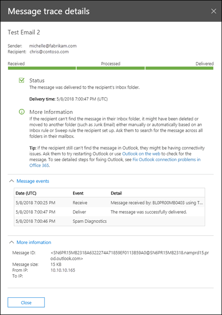

# Meddelandespårning i Säkerhets- och efterlevnadscenter

## Översikt

Meddelandespårning i Security & Compliance Center följer e-postmeddelanden när de färdas genom din Exchange Online-organisation. Du kan avgöra om ett meddelande togs emot, avvisades, sköts upp eller levererades av tjänsten. Den visar också vilka åtgärder som vidtogs på meddelandet innan det nådde sin slutliga status.

Meddelandespårning i Security & Compliance Center förbättrar den ursprungliga meddelandespårningen som var tillgänglig i Administrationscentret för Exchange (EAC). Du kan använda informationen från meddelandespårning för att effektivt svara på användarfrågor om vad som hände med meddelanden, felsöka problem med e-postflödet och validera principändringar.

> [!NOTE]
> * Om du vill utföra en meddelandespårning måste du vara medlem i rollgrupperna Organisationshantering, Efterlevnadshantering eller Help Desk. Mer information finns i [Behörigheter i Säkerhets- och efterlevnadscentret](permissions-in-the-security-and-compliance-center.md).   * Det maximala antalet meddelanden som visas i resultatet beror på vilken rapporttyp du har valt (mer information finns i avsnittet [Välj rapporttyp).](#choose-report-type) [Cmdlet get-historicalsearch](https://docs.microsoft.com/powershell/module/exchange/reporting/get-historicalsearch) i Exchange Online PowerShell eller Exchange Online Protection PowerShell returnerar alla meddelanden i resultatet.

## Öppna meddelandespårning

1. Öppna Säkerhets- & Compliance Center <https://protection.office.com>på .

2. Expandera **e-postflöde**och välj sedan **Meddelandespårning**.

## Sidan Spåra meddelanden

Härifrån kan du starta en ny standardspårning genom att klicka på knappen **Starta en spårning.** Detta söker efter alla meddelanden för alla avsändare och mottagare under de senaste två dagarna. Du kan också använda en av de lagrade frågorna från de tillgängliga frågekategorierna och antingen köra dem som de är eller använda dem som utgångspunkter för dina egna frågor:

- **Standardfrågor**: Inbyggda frågor som tillhandahålls av Office 365.

- **Anpassade frågor**: Frågor som sparats av administratörer i organisationen för framtida användning.

- **Autosparade frågor**: De senaste tio senaste körningsfrågorna. Denna lista gör det enkelt att fortsätta där du slutade.

På den här sidan finns också ett **avsnitt med nedladdningsbara rapporter** för de förfrågningar du har skickat in, samt själva rapporterna när det finns tillgängliga för nedladdning.

## Alternativ för en ny meddelandespårning

### Filtrera efter avsändare och mottagare

Standardvärdena är **Alla avsändare** och **Alla mottagare**, men du kan använda följande fält för att filtrera resultaten:

- **Av dessa personer**: Klicka i det här fältet för att välja en eller flera avsändare från din organisation. Du kan också börja skriva ett namn och objekten i listan filtreras efter det du har skrivit, ungefär som hur en söksida fungerar.

- **Till dessa personer**: Klicka i det här fältet för att välja en eller flera mottagare i organisationen.

> [!NOTE]
> Du kan också skriva e-postadresser till externa avsändare och mottagare. Jokertecken stöds (till exempel `*@contoso.com`), men du kan inte använda flera jokerteckenposter i samma fält samtidigt.    Du kan klistra in flera avsändare eller mottagarlistor avgränsade med semikolon (`;`). utrymmen`\s`( ),`\r`vagnreturer (`\n`) eller nästa rader ( ).

### Tidsintervall

Standardvärdet är **2 dagar,** men du kan ange datum-/tidsintervall på upp till 90 dagar. När du använder datum-/tidsintervall bör du tänka på följande:

- Som standard väljer du tidsintervallet i **skjutreglagevyn** med hjälp av en tidsrad. Du kan bara välja vilka dag- eller tidsinställningar som ska visas. Om du försöker välja ett mellanvärde fästs start-/slutbubblan mot närmaste visade inställning.

  

  Men du kan också växla till **anpassad** vy där du kan ange **värdena startdatum** och **slutdatum** (inklusive tider) och du kan också välja **tidszonen** för datum-/tidsintervallet. Observera att **Time zone** tidszonsinställningen gäller både frågeindata och frågeresultat.

  

  I 10 dagar eller mindre är resultaten tillgängliga direkt som en **sammanfattande** rapport. Om du anger ett tidsintervall som är ännu något större än 10 dagar, kommer resultaten att fördröjas eftersom de bara är tillgängliga som en nedladdningsbar CSV-fil **(Förbättrad sammanfattning** eller **Utökade** rapporter).

  Mer information om de olika rapporttyperna finns i avsnittet [Välj rapporttyp](#choose-report-type) i det här avsnittet.

  **Förbättrade**sammanfattnings- och utökade rapporter förbereds med hjälp av arkiverade meddelandespårningsdata, och det kan ta upp till flera timmar innan rapporten är tillgänglig för hämtning. Beroende på hur många andra administratörer som också har skickat rapportbegäranden ungefär samtidigt kan du också märka en fördröjning innan bearbetningen startar för din köbegäran.

- Om du sparar en fråga i **skjutreglagevyn** sparar du det relativa tidsintervallet (till exempel 3 dagar från och med idag). Om du sparar en fråga i **anpassad** vy sparas det absoluta datum-/tidsintervallet (till exempel 2018-05-06 13:00 till 2018-05-08 18:00).

### Fler sökalternativ

#### Leveransstatus

Du kan lämna standardvärdet **Alla** markerade, eller så kan du välja ett av följande värden för att filtrera resultaten:

- **Levererad**: Meddelandet har levererats till den avsedda destinationen.

- **Väntar :** Leverans av meddelandet görs eller försökers på nytt.

- **Expanderad**: En mottagare av distributionsgrupper expanderades före leverans till de enskilda medlemmarna i gruppen.

- **Misslyckades**: Meddelandet levererades inte.

- **I karantän**: Meddelandet sattes i karantän (som skräppost, massutskick eller nätfiske). Mer information finns [i Karantänmeddelanden i Office 365](quarantine-email-messages.md).

- **Filtreras som skräppost**: Meddelandet identifierades spam, och avvisades eller blockerades (inte karantän).

- **Hämta status:** Meddelandet togs nyligen emot av Office 365, men inga andra statusdata är ännu tillgängliga. Kom tillbaka om några minuter.

**De**värden som **väntar,** **sätts i karantän**och Filtrera som **skräppost** är endast tillgängliga för sökningar mindre än 10 dagar. Det kan också finnas en fördröjning på 5 till 10 minuter mellan den faktiska och rapporterade leveransstatusen.

#### Meddelande-ID

Det här är internetmeddelande-ID (kallas även klient-ID) som finns i **fältet Meddelande-ID:** sidhuvud i meddelandehuvudet. Användare kan ge dig det här värdet för att undersöka specifika meddelanden.

Det här värdet är konstant under meddelandets livstid. För meddelanden som skapats i Microsoft 365 eller `<GUID@ServerFQDN>`Exchange är värdet\< \>i formatet , inklusive vinkelparenteserna ( ). Till exempel `<d9683b4c-127b-413a-ae2e-fa7dfb32c69d@DM3NAM06BG401.Eop-nam06.prod.protection.outlook.com>`. Andra meddelandesystem kan använda olika syntax eller värden. Detta värde är tänkt att vara unik, men inte alla e-postsystem strikt följa detta krav. Om **fältet Meddelande-ID:** huvud inte finns eller är tomt för inkommande meddelanden från externa källor tilldelas ett godtyckligt värde.

När du använder **Meddelande-ID** för att filtrera resultaten måste du inkludera hela strängen, inklusive eventuella vinkelparenteser.

#### Riktning

Du kan lämna standardvärdet **Alla** markerade eller välja **Inkommande** (meddelanden som skickas till mottagare i organisationen) eller **Utgående** (meddelanden som skickas från användare i organisationen) för att filtrera resultaten.

#### Ursprunglig klient-IP-adress

Du kan filer resultaten efter klient IP-adress för att undersöka hackade datorer som skickar stora mängder skräppost eller skadlig kod. Även om meddelandena kan verka komma från flera avsändare är det troligt att samma dator genererar alla meddelanden.

**Klientens**IP-adressinformation är endast tillgänglig i 10 dagar och är endast tillgänglig i **rapporterna Utökad sammanfattning** eller **Utökad (nedladdningsbara** CSV-filer).

### Välj rapporttyp

De tillgängliga rapporttyperna är:

- **Sammanfattning**: Tillgänglig om tidsintervallet är mindre än 10 dagar och kräver inga ytterligare filtreringsalternativ. Resultaten är tillgängliga nästan omedelbart efter att du klickar på **Sök**. Rapporten ger tillbaka upp till 20000 års resultat.

- **Förbättrad sammanfattning** eller **Utökad:** Dessa rapporter är endast tillgängliga som nedladdningsbara CSV-filer och kräver ett eller flera av följande filtreringsalternativ oavsett tidsintervall: **Av dessa personer**, Till dessa **personer**eller **Meddelande-ID**. Du kan använda jokertecken för avsändare eller mottagare \*(till exempel @contoso.com). Den förbättrade sammanfattningsrapporten returnerar upp till 50000 resultat. Den utökade rapporten ger upp till 1 000 resultat.

**Anmärkningar**:

- Förbättrade sammanfattningsrapporter och utökade rapporter förbereds med hjälp av arkiverade meddelandespårningsdata, och det kan ta upp till flera timmar innan rapporten är tillgänglig för nedladdning. Beroende på hur många andra administratörer som också har skickat rapportbegäranden ungefär samtidigt kan du också märka en fördröjning innan din köbegäran börjar bearbetas.

- Du kan välja en utökad sammanfattning eller utökad rapport för valfritt datum-/tidsintervall, men vanligtvis är de senaste fyra timmarna arkiverade data ännu inte tillgängliga för dessa två typer av rapporter.

När du klickar på **Nästa**visas en sammanfattningssida med en lista över de filtreringsalternativ som du har valt, en unik (redigerbar) rubrik för rapporten och den e-postadress som tar emot meddelandet när meddelandespårningen är klar (även redigerbar och måste finnas i en av organisationens accepterade domäner). Klicka på **Förbered rapport** om du vill skicka meddelandespårningen. På huvudsidan **för meddelandespårning** kan du se rapportens status i avsnittet **Nedladdningsbara rapporter.**

Mer information om informationen som returneras i de olika rapporttyperna finns i nästa avsnitt.

## Resultat för meddelandespårning

De olika rapporttyperna returnerar olika informationsnivåer. Informationen som är tillgänglig i de olika rapporterna beskrivs i följande avsnitt.

### Utdata för sammanfattande rapport

När du har kört meddelandespårningen visas resultaten, sorterade efter fallande datum/tid (senaste först).

Sammanfattningsrapporten innehåller följande information:

- **Datum**: Datum och tid då meddelandet togs emot av tjänsten med hjälp av den konfigurerade UTC-tidszonen.

- **Avsändare**: Avsändarens e-postadress (@*aliasdomän*).*alias*

- **Mottagare**: Mottagarens eller mottagarnas e-postadress. För ett meddelande som skickas till flera mottagare finns det en rad per mottagare. Om mottagaren är en distributionsgrupp, en dynamisk distributionsgrupp eller en e-postaktiverad säkerhetsgrupp blir gruppen den första mottagaren och sedan är varje medlem i gruppen på en separat rad.

- **Ämne**: De första 256 tecknen i meddelandets **ämne:** fält.

- **Status**: Dessa värden beskrivs i avsnittet [Leveransstatus.](#delivery-status)

Som standard läses de första 250 resultaten in och är lättillgängliga. När du rullar nedåt finns det en liten paus när nästa omgång resultat läses in. I stället för att rulla kan du klicka på **Ladda alla** för att läsa in alla resultat upp till maximalt 10 000.

Du kan klicka på kolumnrubrikerna för att sortera resultaten efter värdena i den kolumnen i stigande eller fallande ordning.

Du kan klicka på **Filtrera resultat** om du vill filtrera resultaten efter en eller flera kolumner.

Du kan exportera resultaten när du har markerat en eller flera rader genom att klicka på **Exportera resultat** och sedan välja Exportera **alla resultat,** **Exportera inlästa resultat**eller Exportera **markerade**.

#### Hitta relaterade poster för det här meddelandet

Relaterade meddelandeposter är poster som delade samma meddelande-ID. Kom ihåg att även ett enda meddelande som skickas mellan två personer kan generera flera poster. Antalet poster ökar när meddelandet påverkas av distributionsgruppsexpansion, vidarebefordran, regler för e-postflöde (kallas även transportregler) etc.

När du har markerat en rads kryssruta kan du hitta relaterade poster för meddelandet genom](../../media/1ea52bbf-9d00-48ce-9362-307f7f6fb7fe.png) \> att klicka på knappen **Sök relaterad** som visas eller genom att välja **Fler alternativ**  \> klicka på **Fler alternativ** ![Mer **Visa meddelandeinformation**.

   

Meddelandespårningsinformationen innehåller följande ytterligare information som inte finns i sammanfattningsrapporten:

- **Meddelandehändelser**: Det här avsnittet innehåller klassificeringar som hjälper till att kategorisera de åtgärder som tjänsten vidtar för meddelanden. **Några av de mer intressanta händelser** som du kan stöta på är:

  - **Ta emot**: Meddelandet togs emot av tjänsten.

  - **Skicka**: Meddelandet skickades av tjänsten.

  - **Misslyckas**: Det gick inte att leverera meddelandet.

  - **Leverans**: Meddelandet levererades till en postlåda.

  - **Expandera**: Meddelandet skickades till en distributionsgrupp som har expanderats.

  - **Överföring**: Mottagarna har flyttats till ett bifurcated meddelande på grund av innehållskonvertering, meddelandemottagare gränser eller agenter.

  - **Skjut upp**: Meddelandets leverans sköts upp och kan göras om senare.

  - **Löst**: Meddelandet omdirigerades till en ny mottagaradress baserat på en Active Directory-uppslag. När detta inträffar visas den ursprungliga mottagaradressen på en separat rad i meddelandespårningen tillsammans med meddelandets slutliga leveransstatus.

  Kommentarer:

  - Ett händelselöst meddelande som har levererats genererar flera **händelseposter** i meddelandespårningen.

  - Denna förteckning är inte avsedd att vara uttömmande. Beskrivningar av fler händelser finns [i Händelsetyper i meddelandespårningsloggen](https://docs.microsoft.com/Exchange/mail-flow/transport-logs/message-tracking#event-types-in-the-message-tracking-log). Observera att den här länken är ett Exchange Server-ämne (lokalt Exchange).

- **Mer information**: Det här avsnittet innehåller följande information:

  - **Meddelande-ID:** Det här värdet beskrivs i avsnittet [Meddelande-ID](#message-id) tidigare i det här avsnittet. Till exempel `<d9683b4c-127b-413a-ae2e-fa7dfb32c69d@DM3NAM06BG401.Eop-nam06.prod.protection.outlook.com>`.

  - **Meddelandestorlek**

  - **Från IP:** IP-adressen för den dator som skickade meddelandet. För utgående meddelanden som skickas från Exchange Online är det här värdet tomt.

  - **Till IP:** IP-adressen eller adresserna där tjänsten försökte leverera meddelandet. Om meddelandet har flera mottagare visas dessa. För inkommande meddelanden som skickas till Exchange Online är det här värdet tomt.

### Förbättrade sammanfattningsrapporter

Tillgängliga (slutförda) Förbättrade sammanfattningsrapporter finns i avsnittet **Nedladdningsbara rapporter** i början av meddelandespårningen. Följande information finns i rapporten:

- **origin_timestamp***: Datum och tid då meddelandet ursprungligen togs emot av tjänsten med hjälp av den konfigurerade UTC-tidszonen.

- **sender_address**: Avsändarens e-postadress (@*aliasdomän*).*alias*

- **Recipient_status**: Status för leveransen av meddelandet till mottagaren. Om meddelandet skickades till flera mottagare visas alla mottagare och motsvarande status för varje, i \<formatet: *e-postadressstatus*\>##\<*status*\>. Till exempel:

  - **##Receive betyder Send** att meddelandet togs emot av tjänsten och skickades till det avsedda målet.

  - **##Receive betyder det inte** att meddelandet togs emot av tjänsten men leveransen till det avsedda målet misslyckades.

  - **##Receive betyder att** meddelandet togs emot av tjänsten och levererades till mottagarens postlåda.

- **message_subject**: De första 256 tecknen i meddelandets **ämnesfält.**

- **total_bytes**: Meddelandets storlek i byte, inklusive bilagor.

- **message_id**: Det här värdet beskrivs i avsnittet [Meddelande-ID](#message-id) tidigare i det här avsnittet. Till exempel `<d9683b4c-127b-413a-ae2e-fa7dfb32c69d@DM3NAM06BG401.Eop-nam06.prod.protection.outlook.com>`.

- **network_message_id**: Ett unikt meddelande-ID-värde som finns kvar i alla kopior av meddelandet som kan skapas på grund av bifurkation eller distributionsgruppsexpansion. Ett exempelvärde `1341ac7b13fb42ab4d4408cf7f55890f`är .

- **original_client_ip**: IP-adressen för avsändarens klient.

- **riktning**: Anger om meddelandet skickades inkommande (1) till din organisation eller om det skickades utgående (2) från din organisation.

- **connector_id**: Namnet på käll- eller målkopplingen. Mer information om anslutningsappar i Exchange Online finns i [Konfigurera e-postflöde med kopplingar i Office 365](https://docs.microsoft.com/Exchange/mail-flow-best-practices/use-connectors-to-configure-mail-flow/use-connectors-to-configure-mail-flow).

- **delivery_priority***: Om meddelandet har skickats med **hög,** **låg**eller **normal** prioritet.

*Dessa egenskaper är endast tillgängliga i förbättrade sammanfattningsrapporter.

### Utökade rapporter

Tillgängliga (slutförda) Utökade rapporter finns i avsnittet **Nedladdningsbara rapporter** i början av meddelandespårningen. Praktiskt taget all information från en förbättrad sammanfattande rapport finns i en utökad rapport (med undantag **för origin_timestamp** och **delivery_priority).** Följande ytterligare information är endast tillgänglig i en utökad rapport:

- **client_ip**: IP-adressen för e-postservern eller meddelandeklienten som skickade meddelandet.

- **client_hostname**: Värdnamnet eller FQDN för e-postservern eller meddelandeklienten som skickade meddelandet.

- **server_ip**: Käll- eller målserverns IP-adress.

- **server_hostname**: Målserverns värdnamn eller FQDN.

- **source_context**: Extra information som är associerad med **källfältet.** Till exempel:

  - `Protocol Filter Agent`

  - `3489061114359050000`

- **källa**: Exchange Online-komponenten som är ansvarig för händelsen. Till exempel:

  - `AGENT`

  - `MAILBOXRULE`

  - `SMTP`

- **event_id**: Dessa motsvarar de **meddelandehändelsevärden** som förklaras i avsnittet [Sök relaterade poster för det här meddelandet.](#find-related-records-for-this-message)

- **internal_message_id:** En meddelandeidentifierare som tilldelas av Exchange Online-servern som för närvarande bearbetar meddelandet.

- **recipient_address**: E-postadresserna till meddelandets mottagare. Flera e-postadresser avgränsas med semikolontecknet (;).

- **recipient_count**: Det totala antalet mottagare i meddelandet.

- **related_recipient_address**: Används `EXPAND`med `REDIRECT`, `RESOLVE` och händelser för att visa andra mottagare e-postadresser som är associerade med meddelandet.

- **referens**: Det här fältet innehåller ytterligare information för specifika typer av händelser. Till exempel:

  - **DSN**: Innehåller rapportlänken, som är **det message_id** värdet för meddelandet om associerad leveransstatus (kallas även DSN, icke-leveransrapport, NDR eller avvisningsmeddelande) om ett DSN genereras efter den här händelsen. Om detta är ett DSN-meddelande innehåller det här fältet **värdet message_id** för det ursprungliga meddelandet som DSN skapades för.

  - **EXPANDERA**: Innehåller **värdet related_recipient_address** för relaterade meddelanden.

  - **MOTTAGNING:** Kan innehålla **värdet message_id** för det relaterade meddelandet om meddelandet genererades av andra processer (till exempel inkorgsregler).

  - **SKICKA**: Innehåller **värdet internal_message_id** för alla DSN-meddelanden.

  - **ÖVERFÖRING**: Innehåller **värdet internal_message_id** för meddelandet som kluvnas (till exempel genom innehållskonvertering, meddelandemottagares gränser eller agenter).

  - **MAILBOXRULE**: Innehåller **värdet internal_message_id** för det inkommande meddelandet som orsakade inkorgsregeln för att generera det utgående meddelandet.

    För andra typer av händelser är det här fältet vanligtvis tomt.

- **return_path**: Den returadress som anges av kommandot **MAIL FROM** som skickade meddelandet. Även om det här fältet aldrig är tomt kan null-adressvärdet representeras som `<>`.

- **message_info**: Ytterligare information om meddelandet. Till exempel:

  - Datumtid för meddelandeoriginering `DELIVER` i `SEND` UTC för och händelser. Datumtiden för originering är den tidpunkt då meddelandet först kom in i Exchange Online-organisationen. UTC-datumtiden representeras i datum-tidsformatet ISO 8601: `yyyy-mm-ddThh:mm:ss.fffZ`, där `dd` `T` `hh` `mm` `ss` `fff` `Z` `Zulu` `yyyy` = år, `mm` = månad, = dag, anger början på tidskomponenten, = timme, = minut, = sekund, = bråkdelar av en sekund och betyder , vilket är ett annat sätt att beteckna UTC.

  - Autentiseringsfel. Du kan till exempel `11a` se värdet och typen av autentisering som användes när autentiseringsfelet inträffade.

- **tenant_id**: Ett GUID-värde som representerar Exchange Online-organisationen (till exempel `39238e87-b5ab-4ef6-a559-af54c6b07b42`).

- **original_server_ip**: IP-adressen för den ursprungliga servern.

- **custom_data**: Innehåller data som är relaterade till specifika händelsetyper. Mer information finns i följande avsnitt.

#### custom_data värden

Fältet **custom_data** för en `AGENTINFO` händelse används av en mängd olika Exchange Online-agenter för att logga information om meddelandebearbetning. Några av de mer intressanta agenter beskrivs i följande avsnitt.

#### Agent för skräppostfilter

Ett **custom_data** värde som börjar `S:SFA` med kommer från spamfilteragenten. De viktigaste detaljerna beskrivs i följande tabell:

|**Värde**|**Beskrivning**|
|:-----|:-----|
|`SFV=NSPM`|Meddelandet har markerats som icke skräppost och skickats till avsedda mottagare.|
|`SFV=SPM`|Meddelandet markerades som skräppost av innehållsfiltret.|
|`SFV=BLK`|Filtrering hoppades över och meddelandet blockerades eftersom det kom från en blockerad avsändare.|
|`SFV=SKS`|Meddelandet markerades som skräppost innan det bearbetades av innehållsfiltret. Detta inkluderar meddelanden där meddelandet matchade en transportregel för att automatiskt markera det som skräppost och kringgå all ytterligare filtrering.|
|`SCL=<number>`|Mer information om de olika SCL-värdena och vad de betyder finns i [Säkerhetsnivåer för skräppost](spam-confidence-levels.md).|
|`PCL=<number>`|Pcl-värdet (Phishing Confidence Level) för meddelandet. Dessa kan tolkas på samma sätt som SCL värden dokumenteras i [Spam förtroende nivåer](spam-confidence-levels.md).|
|`DI=SB`|Meddelandets avsändare blockerades.|
|`DI=SQ`|Meddelandet sattes i karantän.|
|`DI=SD`|Meddelandet har tagits bort.|
|`DI=SJ`|Meddelandet skickades till mottagarens skräppostmapp.|
|`DI=SN`|Meddelandet dirigerades genom den normala utgående leveranspoolen.|
|`DI=SO`|Meddelandet dirigerades genom leveranspoolen för högre risk. Mer information finns i [Högriskleveranspool för utgående meddelanden](high-risk-delivery-pool-for-outbound-messages.md).|
|`SFS=[a]|SFS=[b]`|Detta anger att spam regler matchades.|
|`IPV=CAL`|Meddelandet släpptes igenom skräppostfiltret då IP-adressen specificerades i en lista över tillåtna IP-adresser i anslutningsfiltret.|
|`H=<EHLOstring>`|En anslutande e-mailservers HELO- eller OEHLO-sträng.|
|`PTR=<ReverseDNS>`|PTR-posten för den sändande IP-adressen, även känd som den omvända DNS-adressen.|

Ett exempel **custom_data** värde för ett meddelande som filtreras för skräppost så här:

`S:SFA=SUM|SFV=SPM|IPV=CAL|SRV=BULK|SFS=470454002|SFS=349001|SCL=9|SCORE=-1|LIST=0|DI=SN|RD=ftmail.inc.com|H=ftmail.inc.com|CIP=98.129.140.74|SFP=1501|ASF=1|CTRY=US|CLTCTRY=|LANG=en|LAT=287|LAT=260|LAT=18;`

#### Filteragent för skadlig kod

Ett **custom_data** värde som börjar `S:AMA` med kommer från filteragenten för skadlig kod. De viktigaste detaljerna beskrivs i följande tabell:

|**Värde**|**Beskrivning**|
|:-----|:-----|
|`AMA=SUM|v=1|`Eller`AMA=EV|v=1`|Meddelandet var fast beslutet att innehålla skadlig kod. `SUM`visar att skadlig kod kan ha upptäckts av valfritt antal motorer. `EV`visar att skadlig kod upptäcktes av en viss motor. När skadlig kod upptäcks av en motor utlöser detta efterföljande åtgärder.|
|`Action=r`|Meddelandet har ersatts.|
|`Action=p`|Meddelandet kringgicks.|
|`Action=d`|Meddelandet sköts upp.|
|`Action=s`|Meddelandet har tagits bort.|
|`Action=st`|Meddelandet kringgicks.|
|`Action=sy`|Meddelandet kringgicks.|
|`Action=ni`|Meddelandet avvisades.|
|`Action=ne`|Meddelandet avvisades.|
|`Action=b`|Meddelandet blockerades.|
|`Name=<malware>`|Namnet på den skadliga kod som upptäcktes.|
|`File=<filename>`|Namnet på filen som innehöll skadlig kod.|

Ett exempel **custom_data** värde för ett meddelande som innehåller skadlig kod ser ut så här:

`S:AMA=SUM|v=1|action=b|error=|atch=1;S:AMA=EV|engine=M|v=1|sig=1.155.974.0|name=DOS/Test_File|file=filename;S:AMA=EV|engine=A|v=1|sig=201707282038|name=Test_File|file=filename`

#### Agent för transportregel

Ett **custom_data** värde som börjar`S:TRA` med kommer från transportregelagenten för regler för e-postflöde (kallas även transportregler). De viktigaste detaljerna beskrivs i följande tabell:

|**Värde**|**Beskrivning**|
|:-----|:-----|
|`ETR|ruleId=<guid>`|Regel-ID:t som matchades.|
|`St=<datetime>`|Datum och tid i UTC när regelmatchningen inträffade.|
|`Action=<ActionDefinition>`|Åtgärden som tillämpades. En lista över tillgängliga åtgärder finns [i Regelåtgärder för e-postflöde i Exchange Online](https://docs.microsoft.com/exchange/security-and-compliance/mail-flow-rules/mail-flow-rule-actions).|
|`Mode=<Mode>`|Regelns läge. Giltiga värden är:  * **Verkställ:** Alla åtgärder för regeln kommer att verkställas.  * **Testa med policytips:**: Alla policytipsåtgärder skickas, men andra verkställighetsåtgärder kommer inte att vidtas.  * **Testa utan principtips**: Åtgärder visas i en loggfil, men avsändare kommer inte att meddelas på något sätt och verkställighetsåtgärder kommer inte att vidtas.|

Ett exempel **custom_data** värde för meddelanden som matchar villkoren för en regel för e-postflöde ser ut så här:

`S:TRA=ETR|ruleId=19a25eb2-3e43-4896-ad9e-47b6c359779d|st=7/17/2017 12:31:25 AM|action=ApplyHtmlDisclaimer|sev=1|mode=Enforce`
