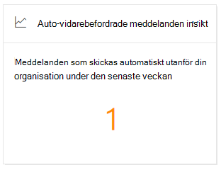
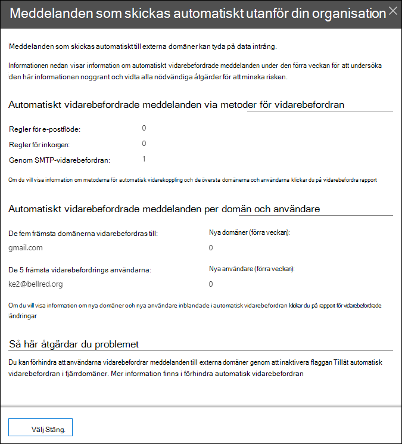

# Automatiskt vidarebefordrade meddelanden är inblick i säkerhets & Compliance Center

De **automatiskt avvidarekopplade meddelandena** är inblick i [instrument panelen för e-postflöden](mail-flow-insights-v2.md) i säkerhets & Compliance Center visar information om meddelanden som automatiskt vidarebefordras från din organisation till mottagare i externa domäner.

## Information om automatiskt vidarebefordrade meddelanden

När du klickar på antalet meddelanden i widgeten visas en utfällbar ruta som visar mer information om de automatiskt vidarebefordrade meddelandena:

- **Automatiskt vidarebefordrade meddelanden genom metoder för vidarebefordran**:

  - **Regler för e-postflöde**
  - **Regler för Inkorgen**
  - **Via SMTP-vidarekoppling**
  - En länk till [vidarekoppling](view-mail-flow-reports.md#forwarding-report) för mer information.

- **Automatiskt vidarebefordrade meddelanden per domän och användare**:

  - **De fem främsta domänerna vidarekopplas till**
  - **Nya domäner (förra veckan)**
  - **De 5 vanligaste användarna**
  - **Nya användare (förra veckan)**
  - En länk till [rapporten för ändring av ändringar](mfi-new-users-forwarding-email.md#forwarding-modifications-report) för att få mer information.

## Insikter

Två insikter genereras utifrån rapportens data:

- [Nya e-postmeddelanden](mfi-new-users-forwarding-email.md)
- [Nya domäner vidarebefordras via e-post](mfi-new-domains-being-forwarded-email.md)

## Se även

Information om andra insikter i instrument panelen för e-postflöden finns i avsnittet om [hur du använder e-postflöde i säkerhets & Compliance Center](mail-flow-insights-v2.md).
