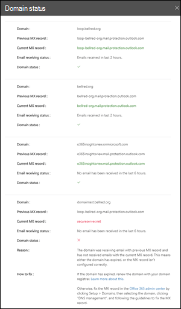

# Insikten E-postflödesstatus för översta domäner

Statusinsikten **för toppdomänens e-postflöde** ger dig aktuell status för organisationens domäner när det gäller e-postflöde. Den här insikten hjälper dig att identifiera och felsöka domäner som upplever problem med ***e-postflödet*** (t.ex. inte kan ta emot extern e-post), särskilt domänförfall eller domäner med felaktiga MX-poster.

När du klickar på **Visa information** i insikten visas ett utfällbart utfällbart meddelande som visar mer information om status för varje domän.

En grön bock för en domän anger att den aktuella MX-posten (när du bläddrade till instrumentpanelen för e-postflödesinsikter) matchar det värde vi har på skiva och att domänen har fått e-post under de senaste två timmarna.

Ett rött x för en domän anger att MX-posten har ändrats och att domänen inte har fått något e-postmeddelande under de senaste 6 timmarna. Detta indikerar troligen att domänen har upphört att gälla eller att MX-posten har uppdaterats felaktigt. Kontrollera med domänregistraren eller DNS-värdtjänsten om domänen har upphört att gälla eller om domänens MX-post är felaktig.

## Relaterade ämnen

Mer information om andra insikter om e-postflöde i instrumentpanelen för e-postflödet finns [i Insikterna för e-postflöde i Security & Compliance Center](mail-flow-insights-v2.md).
