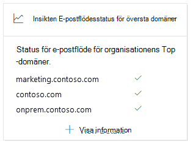
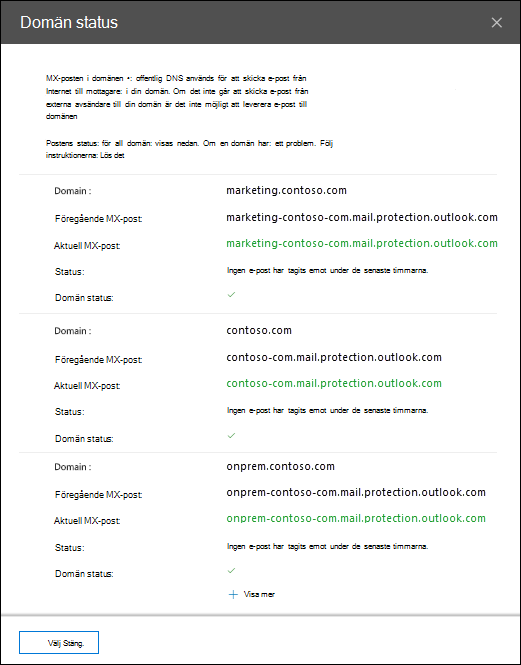

# Statusinsikter för e-postflöde i toppdomänen i & Säkerhets- och efterlevnadscenterTop domain mail flow status insight in the Security & Compliance Center

[!INCLUDE [Microsoft 365 Defender rebranding](../includes/microsoft-defender-for-office.md)]

**Gäller för****Applies to**
- [Exchange Online ProtectionExchange Online Protection](exchange-online-protection-overview.md)
- [Microsoft Defender för Office 365 Abonnemang 1 och Abonnemang 2Microsoft Defender for Office 365 plan 1 and plan 2](defender-for-office-365.md)
- [Microsoft 365 DefenderMicrosoft 365 Defender](../defender/microsoft-365-defender.md)

**Statusinsikten för** e-postflödet för toppdomänen i instrumentpanelen för e-postflöde i säkerhets- & [efterlevnadscenter](https://protection.office.com) ger dig den aktuella statusen för e-postflödet för din organisation. The **Top domain mail flow status** insight in the [Mail flow dashboard](mail-flow-insights-v2.md) in the [Security & Compliance Center](https://protection.office.com) gives you the current mail flow status for your organization.

Med den här insikten kan du identifiera och felsöka domäner som har problem ***med e-postflödet.***This insight helps you identify and troubleshoot domains that are experiencing ***mail flow*** issues. Domänen kan till exempel inte ta emot extern e-post eftersom domänen har upphört att gälla eller domänen har en felaktig MX-post.For example, the domain is unable to receive external email because the domain has expired or the domain has an incorrect MX record.

När du klickar **på Visa** information i widgeten visas den utfällsymbolen Domänstatus med mer information om varje domäns status: When you click **View details** in the widget, a **Domain status** flyout appears that shows you more details for the status of each domain:

- **Domän****Domain**
- **Föregående MX-post****Previous MX record**
- **Aktuell MX-post****Current MX record**
- **Status för e-post som tas emot****Email receiving status**
- **Domänstatus:** En grön bockmarkering anger den aktuella MX-posten (vid den tidpunkt då du klickade på widgeten) matchar värdet vi har på posten och domänen har fått e-post under de senaste två timmarna.**Domain status**: A green check mark indicates the current MX record (at the time you clicked on the widget) matches the value we have on record, and the domain has received email during the past two hours.

  Ett rött X indikerar att MX-posten har ändrats och att domänen inte har fått något e-postmeddelande under de senaste 6 timmarna.A red X indicates the MX record has been changed, and the domain has received no email during the past 6 hours. Det här indikerar förmodligen att din domän har upphört att gälla eller att MX-posten har uppdaterats felaktigt.This likely indicates that your domain has expired, or that the MX record has been incorrectly updated. Kontrollera med din domänregistrator eller DNS-värd om domänen har upphört att gälla eller om domänens MX-post är felaktig.Check with your domain registrar or DNS hosting service to see if the domain has expired, or if the domain's MX record is incorrect.

Du kan klicka **på Visa fler** om du vill se samma information för fler domäner.You can click **View more** to see the same information for more domains.

## Se ävenSee also

Mer information om andra insikter i instrumentpanelen för e-postflöde finns i [E-postflödesinformation i Säkerhets- & efterlevnadscenter.](mail-flow-insights-v2.md)For information about other insights in the Mail flow dashboard, see [Mail flow insights in the Security & Compliance Center](mail-flow-insights-v2.md).
