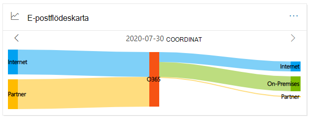
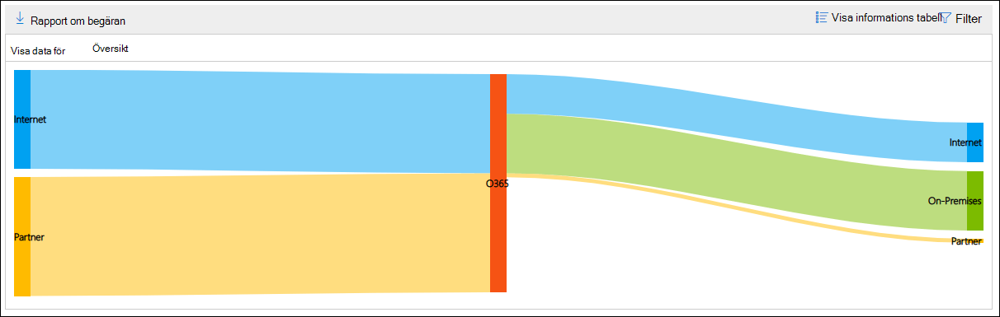
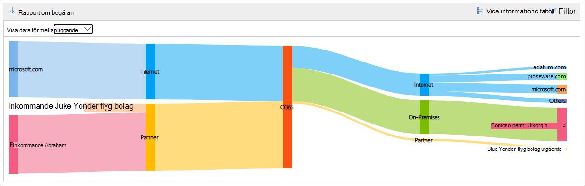
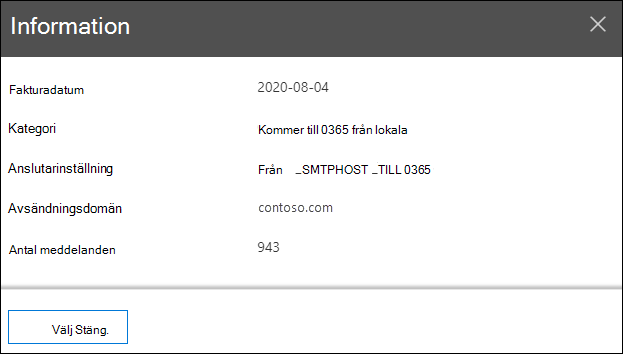

# E-postflödeskarta i Säkerhets- & Efterlevnadscenter

[!INCLUDE [Microsoft 365 Defender rebranding](../includes/microsoft-defender-for-office.md)]

**Gäller för**
- [Exchange Online Protection](exchange-online-protection-overview.md)
- [Microsoft Defender för Office 365 Abonnemang 1 och Abonnemang 2](office-365-atp.md)
- [Microsoft 365 Defender](../mtp/microsoft-threat-protection.md)

**E-postflödeskartan** [i](mail-flow-insights-v2.md) instrumentpanelen för e-postflöde i Säkerhets- & [efterlevnadscenter](https://protection.office.com) ger insyn i hur e-post flödar genom organisationen. Du kan använda den här informationen för att lära dig mönster, identifiera problem och åtgärda problem när de uppstår.

Som standard visar widgeten e-postflödesmönstret från föregående dag i ett diagram som kallas *Sankey-diagram.* Du kan använda vänsterpilen  högerpilen till höger om  dagar. Varje färg representerar e-postflöde över en annan inkommande eller utgående koppling (eller utan att använda kopplingar). Om du hovrar över en viss färg visas antalet meddelanden för den typen av koppling.

## Rapportvy för e-postflödeskartan

Om du klickar på **widgeten för e-postflödeskartan** kommer du till rapporten **E-postflödeskarta.**

Följande diagram är tillgängliga i rapportvyn:

- **Visa data för: Översikt:** Det här är i stort sett en större vy av widgeten. Om du hovrar över en viss färg visas antalet meddelanden för den typen av koppling.

  

- **Visa data för: Information:** I den här vyn visas information om kopplingar och måldomäner. De översta domänerna för avsändare och mottagare visas och resten läggs i **Andra.** Om du hovrar över en viss färg och ett visst avsnitt visas antalet meddelanden.

  

Om du klickar **på** Filter i en rapportvy kan du ange ett datumintervall **med startdatum** **och slutdatum.**

Om du vill skicka rapporten för ett visst datumintervall till en eller flera mottagare via e-post klickar du **på Begär nedladdning.**

Relaterade insikter visas under e-postflödeskartan om de är tillgängliga (till exempel information om att åtgärda [möjlig e-postslinga).](mfi-mail-loop-insight.md)

## Detaljtabellvy för e-postflödeskartan

Om du **klickar på Tabellen Visa** information i en rapportvy visas följande information:

- **Datum**
- **Kategori**
- **Anslutare/tjänstprovider**
- **Domän för avsändare/mottagare**
- **Antal meddelanden**

Om du klickar **på** Filter i en detaljtabellvy kan du ange ett datumintervall **med Startdatum** **och Slutdatum.**

Om du markerar en rad visas liknande information i en utfällig plats:

Om du vill skicka rapporten för ett visst datumintervall till en eller flera mottagare via e-post klickar du **på Begär nedladdning.**

Om du vill gå tillbaka till rapportvyn klickar du **på Visa rapport.**

## Se även

Mer information om andra insikter i instrumentpanelen för e-postflöde finns i [E-postflödesinsikter i Säkerhets- & Efterlevnadscenter.](mail-flow-insights-v2.md)
