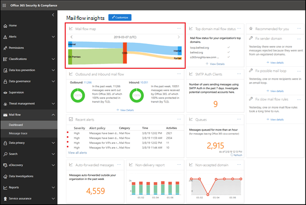
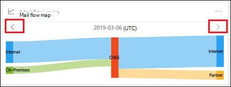
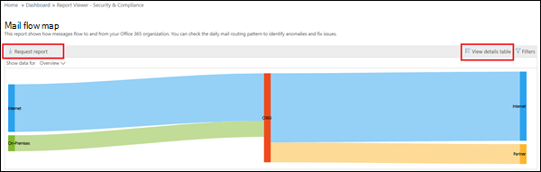
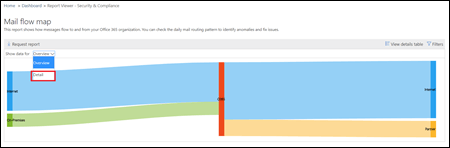

# Rapport om e-postflödeskarta

Den här rapporten ger insikter om hur e-post flödar genom din organisation. Du kan använda den här informationen för att lära dig mönster, identifiera avvikelser och åtgärda problem när de uppstår.

## Widgeten Mappning av e-postflöde

Som standard visar e-postflödeskartan det högnivåmönster för e-postflöde från föregående dag. Du kan använda vänster- och högerpilarna för olika dagar. Om du hovrar muspekaren över varje område i rapporten visas mängden e-post till och från organisationen enligt följande diagram:

## Översikt

Om du klickar på widgeten **Skicka flödeskarta** tar du dig till rapporten **Mappa e-postflöde.** Här kan du se mer detaljerad nivå av rapporten, kan du klicka på Visa informationstabell för att se detaljerade data. Du kan också hämta den detaljerade rapporten genom att klicka på Begär rapport.

## Information

Som standard är **Visa data för** inställd på värdet **Översikt**. När du klickar på listrutan och väljer **Detalj**växlar vyn till domännivådetaljerna.

De översta avsändarna och mottagardomänerna visas och resten placeras i **Andra** enligt följande diagram:

## Relaterade insikter

Relaterade insikter visas under datamappningen för e-postflöde om de är tillgängliga (till exempel domäninsikten av avsändare eller insikten om e-postloopen).

## Snabbreferens

Mer information om andra insikter om e-postflöde i instrumentpanelen för e-postflödet finns [i Insikterna för e-postflöde i Security & Compliance Center](mail-flow-insights-v2.md).
