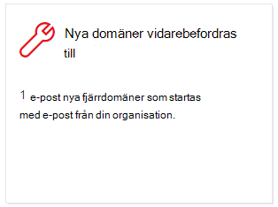
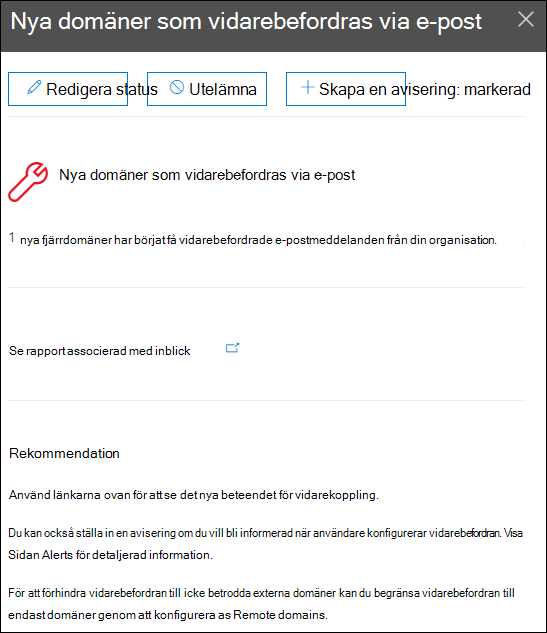

# Nya domäner som vidarebefordras e-postinsikter i Säkerhets- & Efterlevnadscenter

[!INCLUDE [Microsoft 365 Defender rebranding](../includes/microsoft-defender-for-office.md)]

**Gäller för**
- [Exchange Online Protection](exchange-online-protection-overview.md)
- [Microsoft Defender för Office 365 Abonnemang 1 och Abonnemang 2](office-365-atp.md)
- [Microsoft 365 Defender](../mtp/microsoft-threat-protection.md)

Det finns giltiga affärsorsaker till att vidarebefordra e-postmeddelanden till externa mottagare i specifika domäner. Det är dock misstänkt när användare i organisationen plötsligt börjar vidarebefordra meddelanden till en domän där ingen i organisationen har vidarebefordrat meddelanden till (en ny domän).

Det här villkoret kan ange att användarkontona har komprometterats. Om du misstänker att kontona har komprometterats kan du gå till [Svara på ett komprometterat e-postkonto.](responding-to-a-compromised-email-account.md)

De **nya domäner som vidarebefordras i** Säkerhets- & [och](https://protection.office.com) efterlevnadscenter meddelar dig när användare i organisationen vidarebefordrar meddelanden till nya domäner.

Den här insikten visas bara när problemet identifieras och visas på [sidan Med vidarebefordransrapport.](view-mail-flow-reports.md#forwarding-report)

När du klickar på widgeten visas en utfällig meny där du kan hitta mer information om vidarebefordrade meddelanden, inklusive en länk tillbaka till [vidarebefordransrapporten.](view-mail-flow-reports.md#forwarding-report)

Du kan också gå till den här informationssidan  när du väljer insikten när du har klickat på Visa allt i området **& rekommendationer** **på** (Instrumentpanelen rapporter \>  <https://protection.office.com/insightdashboard> eller).

Om du vill förhindra automatisk vidarebefordran av meddelanden till externa domäner konfigurerar du en fjärrdomän för vissa eller alla externa domäner. Mer information finns i Hantera [fjärrdomäner i Exchange Online.](https://docs.microsoft.com/Exchange/mail-flow-best-practices/remote-domains/manage-remote-domains)

## Relaterade ämnen

Mer information om andra insikter i instrumentpanelen för e-postflöde finns i [E-postflödesinsikter i Säkerhets- & Efterlevnadscenter.](mail-flow-insights-v2.md)
