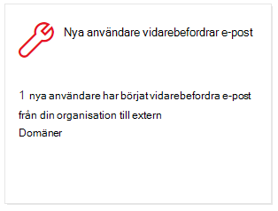
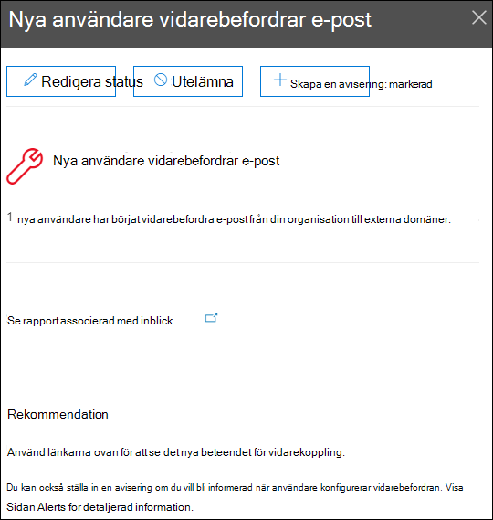
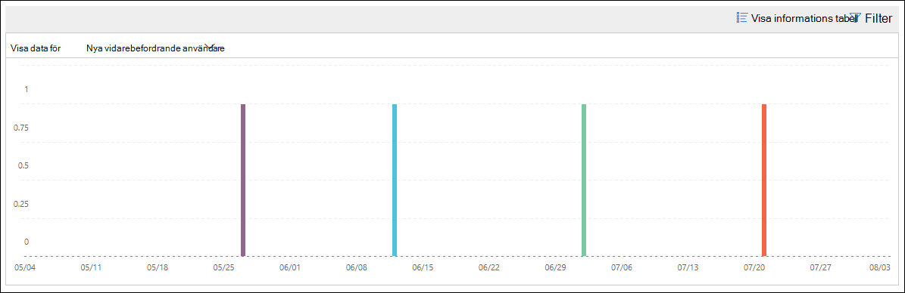
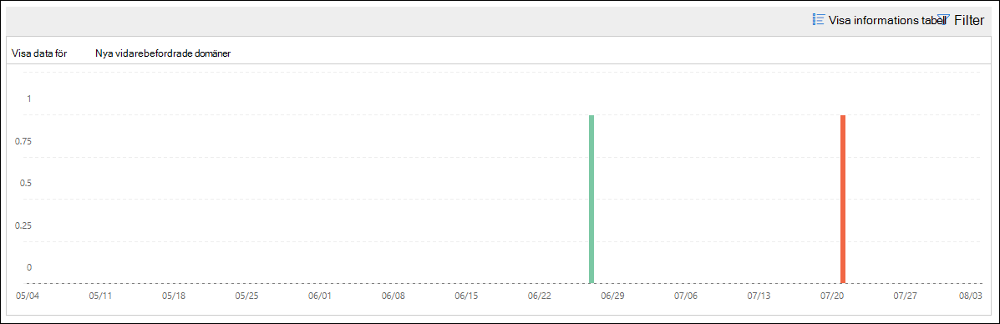

# Nya användare som vidarebefordrar e-postmeddelande för säkerhets &

[!INCLUDE [Microsoft 365 Defender rebranding](../includes/microsoft-defender-for-office.md)]

Det är misstänkt när nya användar konton i din organisation plötsligt startar vidarebefordran av e-postmeddelanden till externa domäner.

De **nya domänerna som vidarebefordras via e-post** i [säkerhets & uppfyller](https://protection.office.com) dig när nyskapade användare i organisationen vidarebefordrar meddelanden till externa domäner. Det här villkoret kan tyda på att administratören använde för att skapa nya användare. Om du misstänker att kontona är inaktiverade kan du läsa mer i [svara på ett komprometterat e-postkonto](responding-to-a-compromised-email-account.md).

Denna inblick visas bara när problemet identifieras och visas på sidan för [vidarebefordran av rapporter](view-mail-flow-reports.md#forwarding-report) .

När du klickar på widgeten visas en utfällbar plats där du kan hitta mer information om de vidarebefordrade meddelandena, inklusive en länk till [rapporten ändringar i vidarebefordring](#forwarding-modifications-report) enligt beskrivningen i det här avsnittet.

Du kan också komma åt den här informations sidan när du väljer inblicken när du klickar på **Visa alla** i området **Top Insights & rekommendationer** på (**rapport** \> **instrument panel** eller <https://protection.office.com/insightdashboard> ).

Du kan klicka på länken **Se rapporten som är kopplad** till en Insight-länk för att gå till **rapporten ändringar i vidarebefordring** enligt beskrivningen i nästa avsnitt.

## Rapport över ändringar i vidarebefordran

**Rapporten för ändringar av vidarekoppling** visar information om meddelanden som automatiskt vidarebefordras från avsändare i din organisation:

- Nyskapade konton som vidarebefordrar meddelanden till externa domäner.
- Konton som vidarebefordrar meddelanden till externa domäner som aldrig har vidarebefordrats till av andra avsändare i din organisation.

Dessa typer av vidarebefordrade meddelanden kan utgöra en säkerhets-eller kompatibilitets risk och kan tyda på konton.

Rapporten innehåller data för upp till 90 dagar. Som standard visar rapporten data för de senaste sju dagarna.

Den här rapporten är inte direkt tillgänglig i [instrument panelen för e-postflöde](mail-flow-insights-v2.md) eller rapport [instrument panelen](view-mail-flow-reports.md). Förutom att klicka på länken **se en rapport som är associerad med en inblick** i den **nya användaren som vidarebefordrar e-post** , kommer du till rapporten genom att:

- Klicka på länken **vidarebefordra aviseringar** i information om de [nya domänerna som vidarebefordrar e-postinsikt](mfi-new-domains-being-forwarded-email.md).
- Öppnar <https://protection.office.com/reportv2?id=MailFlowNewForwarding> .

### Rapportvy för rapporten ändringar i vidarebefordran

Följande diagram är tillgängliga i rapportvyn:

- **Visa data för: nya vidarebefordrande användare**:

  

- **Visa data för: nya vidarebefordrande domäner**:

  

Om du klickar på **filter** i en rapportvy kan du ange ett datum intervall med **start datum** och **slutdatum**.

### Vyn detaljerad tabell för rapporten ändringar i vidarebefordran

Om du klickar på **Visa informations tabell** beror informationen som visas på diagrammet du tittade på:

- **Visa data för: nya vidarebefordrande användare**:

  - **Namn**: avsändarens e-postadress.
  - **Typ av vidarebefordran**
  - **Mottagarens adress**
  - **Information**
  - **Öka**
  - **Första framåtriktade datum**

- **Visa data för: nya vidarebefordrande domäner**:

  - **Namn**: avsändarens e-postdomän.
  - **Typ av vidarebefordran**
  - **Mottagarens adress**
  - **Information**
  - **Öka**
  - **Första framåtriktade datum**

Om du klickar på **filter** i en detaljerad tabellvy kan du ange ett datum intervall med **start datum** och **slutdatum**.

Om du väljer en rad från tabellen visas en utfällbar **lista** med följande information:

- **Namn**: det här är antingen avsändarens e-postadress (från **Visa data för vy med nya vidarebefordrade användare** ) eller avsändarens e-postdomän (från **Visa data för ny vy med vidarebefordrings domäner** ).
- **Typ av vidarebefordran**
- **Mottagare**
- **Information**
- **Öka**
- **Start datum**
- **Rekommendation**: härifrån kan du klicka på länken för att hantera användaren i administrations centret för Microsoft 365.

Om du vill gå tillbaka till rapportvyn klickar du på **Visa rapport**.

## Relaterade ämnen

Information om andra insikter i instrument panelen för e-postflöden finns i avsnittet om [hur du använder e-postflöde i säkerhets & Compliance Center](mail-flow-insights-v2.md).
