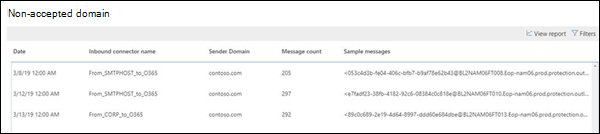

# Rapport om icke godkänd domänNon-accepted domain report

I likhet med domäninsikten **av avsändare** identifierar den **icke-accepterade** domäninsikten meddelanden från din lokala e-postorganisation, men avsändarens domän är inte konfigurerad som en accepterad domän i organisationen.Similar to the **Sender domain** insight, the **Non-accepted domain** insight identifies messages from your on-premises email organization, but the sender's domain isn't configured as an accepted domain in your organization.

Microsoft 365 kan begränsa dessa meddelanden om vi har data som bevisar att avsikten med dessa meddelanden är skadlig.Microsoft 365 might throttle these messages if we have data to prove that the intent of these messages is malicious. Därför är det viktigt för dig att förstå vad som händer och åtgärda problemet.Therefore, it's important for you to understand what's happening and to fix the issue.

När du klickar på widgeten tas du till hela rapporten.When you click on the widget, you're taken to the full report. I den fullständiga rapporten, där du kan klicka på **Visa information** om du vill visa informationen i en tabell som visas i följande diagram:In the full report, where you can click **View details** to view the information in a table as shown in the following diagram:

När du väljer en rad i tabellen visar ett utfällbart utfällbart ut mer information.When you select a row in the table, a flyout will show you more details. Du kan klicka på **Visa exempelmeddelanden** för att se några av de identifierade meddelandena.You can click **view sample messages** to see some of the identified messages.

## Relaterade ämnenRelated topics

Mer information om andra insikter om e-postflöde i instrumentpanelen för e-postflödet finns [i Insikterna för e-postflöde i Security & Compliance Center](mail-flow-insights-v2.md).For more information about other mail flow insights in the mail flow dashboard, see [Mail flow insights in the Security & Compliance Center](mail-flow-insights-v2.md).
