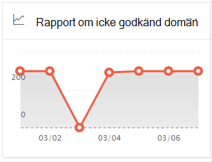
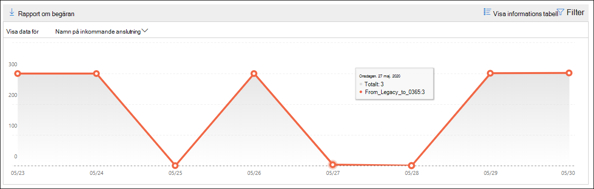
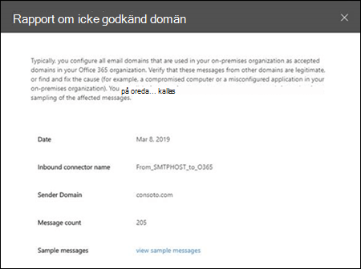

# Rapport om ej godkänd domän i Säkerhets- & Säkerhets- och efterlevnadscenter

[!INCLUDE [Microsoft 365 Defender rebranding](../includes/microsoft-defender-for-office.md)]

**Gäller för**
- [Exchange Online Protection](exchange-online-protection-overview.md)
- [Microsoft Defender för Office 365 Abonnemang 1 och Abonnemang 2](defender-for-office-365.md)
- [Microsoft 365 Defender](../defender/microsoft-365-defender.md)

I rapporten Ej godkänd  domän i instrumentpanelen för e-postflöde i Säkerhets- och efterlevnadscenter för [&](https://protection.office.com) visas information om meddelanden från din lokala e-postorganisation där avsändarens domän inte är konfigurerad som en godkänd domän i din Microsoft 365-organisation. 

Microsoft 365 kan begränsa dessa meddelanden om vi har data som bevisar att avsikten med dessa meddelanden är skadliga. Därför är det viktigt att du förstår vad som händer och kan åtgärda problemet.

## Rapportvy för rapporten Ej godkänd domän

Om du klickar på diagrammet **på widgeten Godkänd** inte domän kommer du till **rapporten Ej godkänd** domän.

Som standard visas aktiviteten för alla berörda kopplingar. Om du klickar **på Visa data för** kan du välja en specifik koppling i listrutan.

Om du hovrar över en datapunkt (dag) i diagrammet visas det totala antalet meddelanden för kopplingen.

## Tabellvyn Detaljerad information för rapporten Om godkänd domän

Om du **klickar på Visa informationstabell** i en rapportvy visas följande information:

- **Datum**
- **Namn på inkommande koppling**
- **Avsändningsdomän**
- **Antal meddelanden**
- **Exempelmeddelanden:** Meddelande-ID:na för ett exempel på påverkade meddelanden.

Om du klickar **på** Filter i en detaljtabellvy kan du ange ett datumintervall **med Startdatum** **och Slutdatum.**

Om du vill skicka rapporten med ett visst datumintervall till en eller flera mottagare klickar du på **Begär nedladdning.**

När du markerar en rad i tabellen visas en utfälltabell med följande information:

- **Datum**
- **Namn på inkommande koppling**
- **Avsändningsdomän**
- **Antal meddelanden**
- **Exempelmeddelanden:** Du kan klicka på **Visa exempelmeddelanden** om du vill se [resultatet av meddelandespårningen](message-trace-scc.md) för ett exempel på de berörda meddelandena.

Om du vill gå tillbaka till rapportvyn klickar du **på Visa rapport**.

## Relaterade ämnen

Mer information om andra insikter i instrumentpanelen för e-postflöde finns i [E-postflödesinformation i Säkerhets- & efterlevnadscenter.](mail-flow-insights-v2.md)
