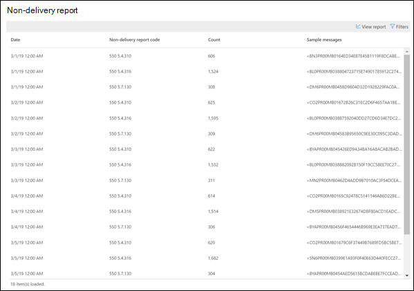

# Rapport om misslyckad leveransNon-delivery report

**Rapporten Icke-leverans** visar de felkoder som påträffats mest i rapporter som inte har levererats (kallas även NDR-meddelanden eller avvisningsmeddelanden) för användare i organisationen.The **Non-delivery report** shows the most-encountered error codes in non-delivery reports (also known as NDRs or bounce messages) for users in your organization. Den här rapporten är avsedd att visa information om NDRs, så att du kan felsöka problem.This report is intended to show the details of NDRs, so you can troubleshoot problems.

Du kan visa information för alla NDR-koder eller en viss kod genom att klicka på **Visa data för**.You can show information for all NDR codes or a specific code by clicking **Show data for**. Du kan också klicka på **Visa informationstabell** om du vill se en mer detaljerad vy som visas i följande diagram:You can also click **View details table** to see a more detailed view as shown in the following diagram:

När du väljer en rad i tabellen för att visa information om den specifika NDR kan du använda den detaljerade informationen för att felsöka och vidta nödvändiga åtgärder.When you select a row in the table to view the details of the specific NDR, you can use the detailed information to troubleshoot and take the necessary actions.

## Relaterade ämnenRelated topics

Mer information om andra insikter om e-postflöde i instrumentpanelen för e-postflödet finns [i Insikterna för e-postflöde i Security & Compliance Center](mail-flow-insights-v2.md).For more information about other mail flow insights in the mail flow dashboard, see [Mail flow insights in the Security & Compliance Center](mail-flow-insights-v2.md).
