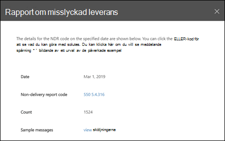

# Rapport om utebliven leverans i säkerhets & efterlevnadNon-delivery report in the Security & Compliance Center

I **rapporten om utebliven leverans** i [instrument panelen för e-postflöden](mail-flow-insights-v2.md) i säkerhets & Compliance Center visas de mest upptäckta fel koderna i rapporter för inte leverans (kallas även för NDR eller studs meddelanden) för användare i organisationen.The **Non-delivery report** in the [Mail flow dashboard](mail-flow-insights-v2.md) in the Security & Compliance Center shows the most-encountered error codes in non-delivery reports (also known as NDRs or bounce messages) for users in your organization. Den här rapporten visar information om NDR så att du kan felsöka problem med e-postleverans.This report shows the details of NDRs so you can troubleshoot email delivery problems.

## Rapportvy för rapport om utebliven leveransReport view for the Non-delivery report

Om du klickar på widgeten för **ej leverans rapporter** tas du till **rapporten för ej leverans**.Clicking on the **Non-delivery report** widget will take you to the **Non-delivery report**.

Aktiviteten för alla felkoder visas som standard.By default, the activity for all error codes is shown. Om du klickar på **Visa data för**kan du välja en specifik felkod i list rutan.If you click **Show data for**, you can select a specific error code from the dropdown.

Om du hovrar över en viss färg (felkod) på en viss dag i diagrammet visas det totala antalet meddelanden för felet.If you hover over a specific color (error code) on a specific day in the chart, you'll see the total number of messages for the error.

## Vyn detaljerad lista för rapport om utebliven leveransDetails table view for the Non-delivery report

Om du klickar på **Visa informations tabell** i en rapportvy visas följande information:If you click **View details table** in a report view, the following information is shown:

- **Datum****Date**
- **Rapport kod för ej leverans****Non-delivery report code**
- **Öka****Count**
- **Exempel meddelanden**: meddelande-ID för ett urval av påverkade meddelanden.**Sample messages**: The message IDs of a sample of affected messages.

Om du klickar på **filter** i en detaljerad tabellvy kan du ange ett datum intervall med **start datum** och **slutdatum**.If you click **Filters** in a details table view, you can specify a date range with **Start date** and **End date**.

Om du vill skicka rapporten för ett visst datum intervall till en eller flera mottagare klickar du på **Hämta**.To email the report for a specific date range to one or more recipients, click **Request download**.

När du markerar en rad i tabellen visas en utfällbar tabell med följande information:When you select a row in the table, a flyout appears with the following information:

- **Datum****Date**
- **Rapport kod för ej leverans**: du kan klicka på länken för att hitta mer information om orsakerna och lösningarna för den specifika felkoden.**Non-delivery report code**: You can click on the link to find for more information about the causes and solutions for the specific error code.
- **Öka****Count**
- **Exempel meddelanden**: du kan klicka på **Visa exempel meddelanden** om du vill visa [meddelande spårnings](message-trace-scc.md) resultaten för ett prov av de påverkade meddelandena.**Sample messages**: You can click **View sample messages** to see the [message trace](message-trace-scc.md) results for a sample of the affected messages.

## Relaterade ämnenRelated topics

Information om andra insikter i instrument panelen för e-postflöden finns i avsnittet om [hur du använder e-postflöde i säkerhets & Compliance Center](mail-flow-insights-v2.md).For information about other insights in the Mail flow dashboard, see [Mail flow insights in the Security & Compliance Center](mail-flow-insights-v2.md).
