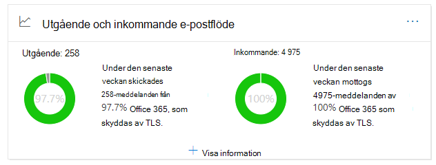
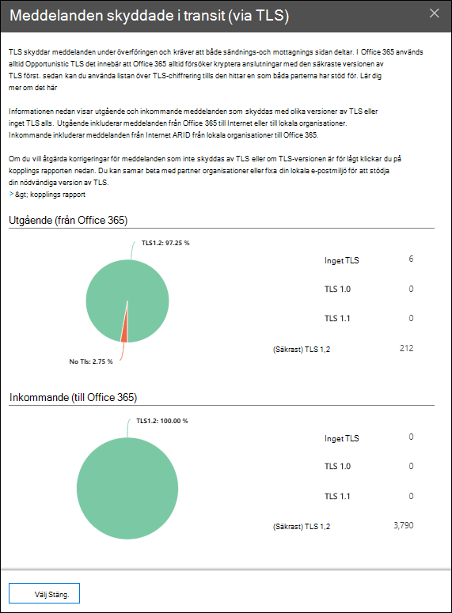

# Information om utgående och inkommande e-postflöde i & Säkerhets- och efterlevnadscenter

[!INCLUDE [Microsoft 365 Defender rebranding](../includes/microsoft-defender-for-office.md)]

**Gäller för**
- [Exchange Online Protection](exchange-online-protection-overview.md)
- [Microsoft Defender för Office 365 Abonnemang 1 och Abonnemang 2](office-365-atp.md)
- [Microsoft 365 Defender](../mtp/microsoft-threat-protection.md)

Den utgående och **inkommande** e-postflödets insikt i instrumentpanelen för e-postflöde i säkerhets- och efterlevnadscentret för [&](https://protection.office.com) kombinerar informationen från kopplingsrapporten och den tidigare  **TLS-översiktsrapporten** på ett och samma ställe. 

Widgeten visar den TLS-kryptering som används för anslutningen när meddelanden levereras till och från din organisation. Anslutningarna som upprättas med andra e-posttjänster krypteras med TLS när TLS erbjuds av båda sidor. Widgeten ger en ögonblicksbild av den senaste veckans e-postflöde.

Informationen i widgeten är relaterad till kopplingar och TLS-meddelandeskydd i Microsoft 365. Mer information finns i följande avsnitt:

- [Konfigurera e-postflöde med kopplingar](/exchange/mail-flow-best-practices/use-connectors-to-configure-mail-flow/use-connectors-to-configure-mail-flow)
- [Så här använder Exchange Online TLS för att skydda e-postanslutningar](../../compliance/exchange-online-uses-tls-to-secure-email-connections.md)
- [Teknisk referensinformation om kryptering i Microsoft 365](../../compliance/technical-reference-details-about-encryption.md)

## Meddelande som skyddas under överföring (av TLS)

När du klickar **på Visa** information på widgeten visas TLS-skyddet för meddelanden som skickas **(via TLS)** i den utfällade meddelandeskyddsvyn för meddelanden som skickas och lämnar organisationen.

För närvarande är TLS 1.2 den säkraste versionen av TLS som erbjuds av Microsoft 365. Ofta måste du känna till den TLS-kryptering som används för granskningar av efterlevnad. Du har förmodligen inte en direkt relation till de flesta käll- och mål-e-postservrarna (du äger dem inte och inte Microsoft), så du har inte många alternativ för att förbättra TLS-krypteringen som används av de servrarna.

Men du kan använda kopplingar [för](/exchange/mail-flow-best-practices/use-connectors-to-configure-mail-flow/use-connectors-to-configure-mail-flow) att få bästa tillgängliga TLS-skydd för meddelanden som skickas mellan dina e-postservrar och Microsoft 365. E-postflödet mellan Microsoft 365 och dina egna e-postservrar eller servrar som tillhör dina partners är ofta viktigare och känsligare än vanliga meddelanden, så du bör tillämpa extra säkerhet och uppmärksamhet på dessa meddelanden.

Du kan uppgradera eller åtgärda dina egna e-postservrar för att förbättra den TLS-kryptering som används, eller kontakta dina partners för att göra samma sak. I **kopplingsrapporten visas** både volymen för e-postflödet och TLS-krypteringen för meddelanden som använder dina Microsoft 365-kopplingar.

Du kan klicka på **kopplingsrapportlänken** om du vill gå till [kopplingsrapporten.](view-mail-flow-reports.md#connector-report) Följande information kan vara tillgänglig på sidan **för kopplingsrapport** om det associerade villkoret har upptäckts:

- **Inkommande partneranslutning ser betydande TLS1.0-e-postflöde**
- **Inkommande onpremises-anslutning ser betydande TLS1.0-e-postflöde**

För TLS 1.0-anslutningar måste du få din e-postserver eller din partners server uppgraderad eller åtgärdad för att undvika problem när TLS 1.0-supporten förr eller senare kommer att vara inaktuell i Microsoft 365.

## Se även

Mer information om andra insikter i instrumentpanelen för e-postflöde finns i [E-postflödesinformation i Säkerhets- & efterlevnadscenter.](mail-flow-insights-v2.md)