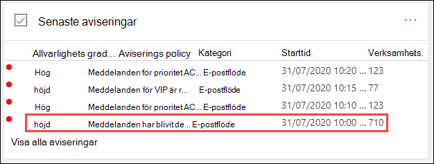
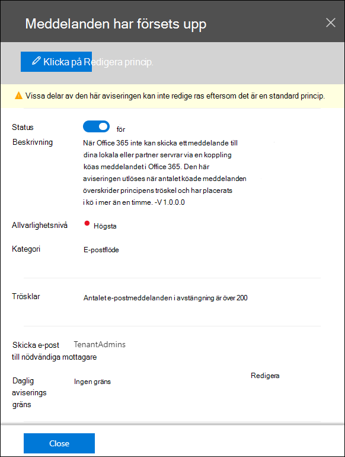
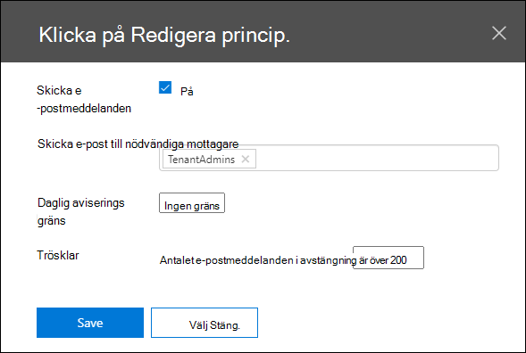
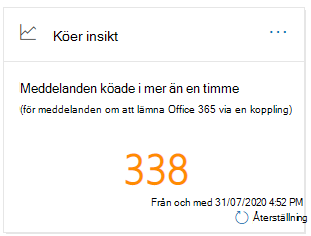
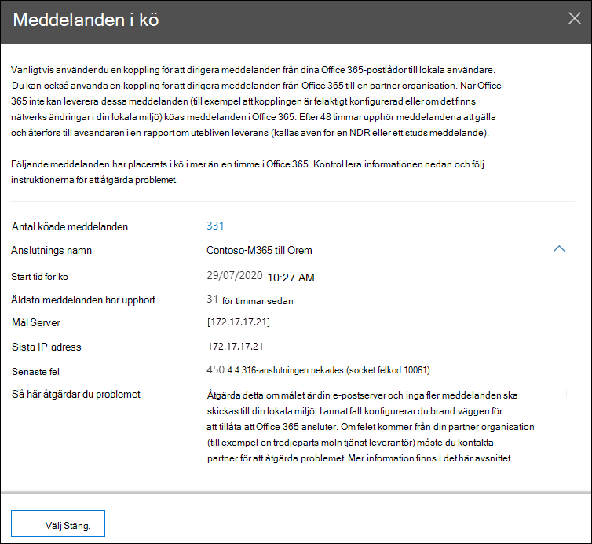
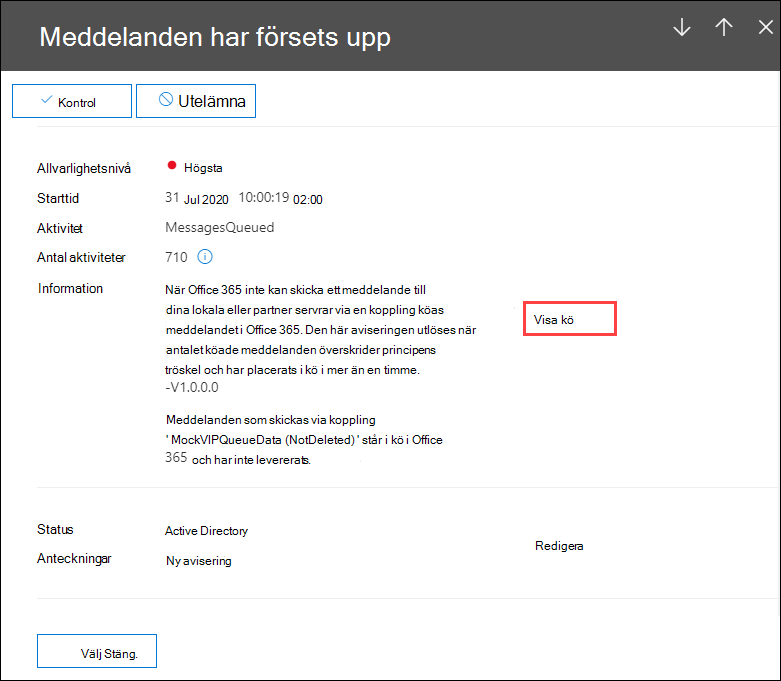

# Köinsikter i säkerhets- & säkerhets- och efterlevnadscentret

[!INCLUDE [Microsoft 365 Defender rebranding](../includes/microsoft-defender-for-office.md)]

**Gäller för**
- [Exchange Online Protection](exchange-online-protection-overview.md)
- [Microsoft Defender för Office 365 Abonnemang 1 och Abonnemang 2](defender-for-office-365.md)
- [Microsoft 365 Defender](../defender/microsoft-365-defender.md)

När meddelanden inte kan skickas från organisationen till dina lokala eller partner-e-postservrar med kopplingar, är meddelandena i kö i Microsoft 365. Vanliga exempel som kan orsaka detta villkor är:

- Kopplingen är felaktigt konfigurerad.
- Det har skett nätverks- eller brandväggsändringar i din lokala miljö.

Microsoft 365 fortsätter att försöka leverera i 24 timmar. Efter 24 timmar förfaller meddelandena och returneras till avsändarna i rapporter om utebliven leverans (kallas även NDR-rapporter eller icke-leveranskavsändare).

Om den fördefinierade e-postvolymen överskrider det fördefinierade tröskelvärdet (standardvärdet är 200 meddelanden) finns informationen tillgänglig på följande platser:

- Köinsikter i [instrumentpanelen för e-postflöde](mail-flow-insights-v2.md) [i Säkerhets- & Efterlevnadscenter.](https://protection.office.com)  Mer information finns i [köinsikter i instrumentpanelen för e-postflöde](#queues-insight-in-the-mail-flow-dashboard) i den här artikeln.

- En avisering visas i **Senaste aviseringar i** instrumentpanelen Aviseringar i [säkerhets- & Efterlevnadscenter](https://protection.office.com) **(Instrumentpanelen** \> **aviseringar** eller <https://protection.office.com/alertsdashboard> ).

  

- Administratörer får ett e-postmeddelande baserat på konfigurationen av standardaviseringsprincipen Med namnet **Meddelanden har fördröjts.** Information om hur du konfigurerar meddelandeinställningarna för den här aviseringen finns i nästa avsnitt.

  Mer information om aviseringsprinciper finns i [Aviseringsprinciper i Säkerhets- & Efterlevnadscenter.](../../compliance/alert-policies.md)

## Anpassa köaviseringar

1. I [säkerhets- & säkerhets- och efterlevnadscenter](https://protection.office.com)går du **till** \> **Aviseringsprinciper för aviseringar** eller öppnar <https://protection.office.com/alertpolicies> .

2. På sidan **Aviseringsprinciper** hittar och väljer du principen **Meddelanden har fördröjts**.

3. I meddelandet **har fördröjts** och öppnats kan du aktivera eller inaktivera aviseringen och konfigurera meddelandeinställningarna.

   

   - **Status:** Du kan aktivera eller inaktivera varningen.

   - **Begränsning för** **e-postmottagare och daglig** avisering: **Klicka på** Redigera för att konfigurera följande inställningar:

4. Om du vill konfigurera meddelandeinställningarna klickar du på **Redigera**. I den **utfällna** menyn Redigera princip som visas konfigurerar du följande inställningar:

   - **Skicka e-postaviseringar:** Standardvärdet är på.
   - **E-postmottagare:** Standardvärdet är **TenantAdmins.**
   - **Daglig meddelandegräns:** Standardvärdet är **Ingen begränsning.**
   - **Tröskelvärde:** Standardvärdet är 200.

   

5. När du är klar klickar du på **Spara** och **stäng**.

## Köinsikter på instrumentpanelen för e-postflöde

Även om volymen för det köade meddelandet inte har överskridit tröskelvärdet  och genererat  en avisering kan du fortfarande använda köinsikterna i instrumentpanelen för e-postflöde för att se meddelanden som har köats i mer än en timme och vidta åtgärder innan antalet i köade meddelanden blir för stort.

Om du klickar på antalet meddelanden på widgeten visas en **utfällbara** meny för Meddelanden i kö med följande information:

- **Antal meddelanden i kö**
- **Kopplingsnamn**: Klicka på kopplingsnamnet för att hantera kopplingen Exchange administrationscentret (EAC).
- **Startad kötid**
- **Äldsta meddelandena har förfallit**
- **Målserver**
- **Senaste IP-adress**
- **Senaste felet**
- **Så här åtgärdar** du problemet: Vanliga problem och lösningar finns tillgängliga. Om länken **Åtgärda det nu** är tillgänglig, klickar du på den för att åtgärda problemet. Annars klickar du på någon av de tillgängliga länkarna för mer information om felet och möjliga lösningar.

Samma utfällbara objekt visas när du **klickar på Visa kö** i information om ett meddelanden har **fördröjts avisering.**

## Se även

Mer information om andra insikter i instrumentpanelen för e-postflöde finns i [E-postflödesinformation i Säkerhets- & efterlevnadscenter.](mail-flow-insights-v2.md)
