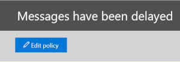

# Köaviseringar och köerQueue alerts and Queues

## KöaviseringarQueue alerts

När meddelanden inte kan skickas från din organisation till dina lokala eller partner-e-postservrar med hjälp av anslutningsappar, står meddelandena i kö i Office 365.When messages can't be sent from your organization to your on-premises or partner email servers using connectors, the messages are queued in Office 365. Vanliga exempel som orsakar detta tillstånd är:Common examples that cause this condition are:

- Anslutningen är felaktigt konfigurerad.The connector is incorrectly configured.

- Det har skett nätverks- eller brandväggsändringar i din lokala miljö.There have been networking or firewall changes in your on-premises environment.

Microsoft 365 fortsätter att försöka levereras igen i 24 timmar.Microsoft 365 will continue to retry to delivery for 24 hours. Efter 24 timmar upphör meddelandena att gälla och returneras till avsändarna i rapporter som inte levereras (kallas även ndr-meddelanden eller avstudsar).After 24 hours, the messages will expire and will be returned to the senders in non-delivery reports (also known as a NDRs or bounce messages).

Om den köade e-postvolymen överskrider det fördefinierade tröskelvärdet (standardvärdet är 2000-meddelanden) är aviseringarna tillgängliga i instrumentpanelen för e-postflödet vid **de senaste aviseringarna**och administratörer får ett e-postmeddelande (till deras alternativa e-postadress).If the queued email volume exceeds the pre-defined threshold (the default value is 2000 messages), the alerts will be available in the mail flow dashboard at **Recent alerts**, and admins will receive an email notification (to their alternative email address). Information om hur du konfigurerar varningströskeln, den dagliga meddelandegränsen och/eller mottagarna av aviseringen finns i avsnittet **Anpassa köaviseringar** nedan.To configure the alert threshold, daily notification limit, and/or recipients of the alert, see the **Customize queue alerts** section below.

## Anpassa köaviseringarCustomize queue alerts

Statistik för e-postflöde skapar en aviseringsprincip med namnet **Meddelanden har försenats** (kryssrutan **Skicka e-postmeddelanden** i exempelskärmen nedan) som finns i **varningsprinciper** \> **Alert Policies**för aviseringar .Mail flow insights create an alert policy named **Messages have been delayed** (the **Send email notifications** check box in the example screen shot below) found in **Alerts** \> **Alert Policies**. Du kan ändra tröskelvärdet och varna mottagarna genom att klicka på principen.You can modify the threshold and alert recipients by clicking on the policy.

Du ser ett nytt policyinformationsblad, du kan nu klicka på **Redigera princip**.You'll see a new policy information blade, you can now click **Edit Policy**.

Informationsbladet ändras till **redigeringsprincipen**.The information blade will change to the **Edit Policy**. Du kan nu ändra mottagarna för aviseringsmeddelandet, gränsen för antalet meddelanden som skickas per dag och minimitröskeln för att utlösa aviseringen (200 eller fler).You can now change the recipients for the alert email, the limit on the number of notifications sent per day, and the minimum threshold to trigger the alert (200 or more).

## Information om köaviseringQueue alert details

När du klickar på aviseringen visas varningsinformationen i ett utfällbart fönster.When you click the alert, the alert details appear in a flyout pane.

Du kan klicka på **Visa kö** i aviseringsinformationen om du vill se köinformation, problem och länkar till tillgängliga korrigeringar i ett nytt utfällbart fönster.You can click **View queue** in the alert details to see the queue details, problems, and links to the available fixes in a new flyout pane.

## KöerQueues

Även om den köade meddelandevolymen inte har överskridit tröskelvärdet kan du fortfarande använda området **Köer** på instrumentpanelen för e-postflödet för att se meddelanden som har köats i mer än en timme.Even if the queued message volume hasn't exceeded the threshold, you can still use the **Queues** area of the mail flow dashboard to see messages that have been queued for more than one hour. Du kan använda **området Köer** för att övervaka antalet meddelanden i kö (värdet 0 anger att e-postflödet är OK) och vidta åtgärder innan antalet köade meddelanden blir för stort.You can use the **Queues** area to monitor the number of queued messages (the value 0 indicates mail flow is OK) and take action before the number of queued messages becomes too large.

När du klickar på antalet meddelanden i kö **i Köer**visas köinformation och vägledning för hur du åtgärdar problemet i ett utfällbart fönster (samma utfällbara objekt som visas när du klickar på **Visa kö** i information om en köavisering).When you click the number of queued messages in **Queues**, the queue details and guidance for how to fix the issue will appear in a flyout pane (the same flyout that appears after you click **View queue** in the details of a queue alert).

## SnabbreferensSee also

Mer information om andra insikter om e-postflöde i instrumentpanelen för e-postflödet finns [i Insikterna för e-postflöde i Security & Compliance Center](mail-flow-insights-v2.md).For more information about other mail flow insights in the mail flow dashboard, see [Mail flow insights in the Security & Compliance Center](mail-flow-insights-v2.md).
