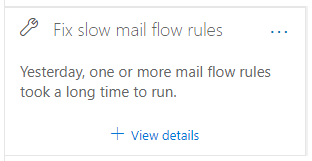
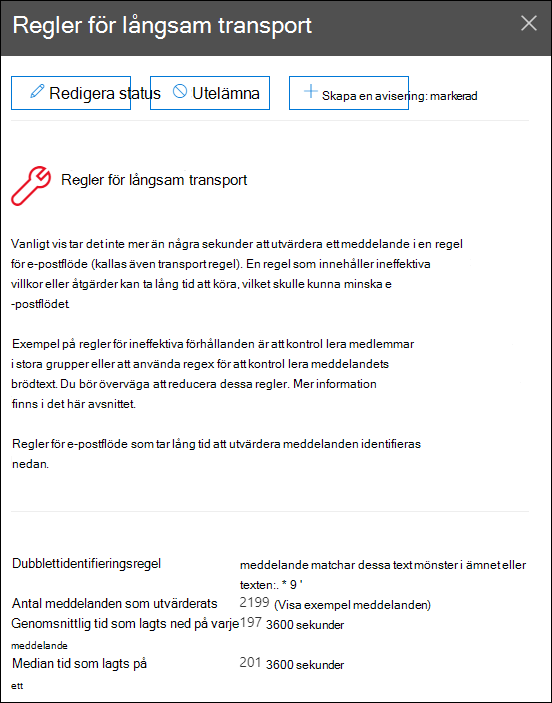

# Åtgärda insikter om långsamt e-postflödesregler i & Säkerhets- och efterlevnadscenter

[!INCLUDE [Microsoft 365 Defender rebranding](../includes/microsoft-defender-for-office.md)]

**Gäller för**
- [Exchange Online Protection](exchange-online-protection-overview.md)
- [Microsoft Defender för Office 365 Abonnemang 1 och Abonnemang 2](defender-for-office-365.md)
- [Microsoft 365 Defender](../defender/microsoft-365-defender.md)

Ineffektiva e-postflödesregler (kallas även transportregler) kan leda till fördröjningar i e-postflödet för din organisation. Den här insikten rapporterar e-postflödesregler som påverkar organisationens e-postflöde. Exempel på sådana typer av regler är:

- Villkor som används **Är medlem i** stora grupper.
- Villkor som använder komplexa reguljära uttryck (regex) mönstermatchning.
- Villkor som använder innehållskontrollen i bifogade filer.

Insikten **åtgärda problem med**  långsamma e-postflödesregler i området Rekommenderas för dig på instrumentpanelen för e-postflöde i säkerhets- och efterlevnadscentret för [&](https://protection.office.com) meddelar dig när en e-postflödesregel tar för lång tid att slutföra. 

Den här insikten visas bara när villkoret har upptäckts (om du inte har några e-postslingor kan du inte se insikten).

Du kan använda det här meddelandet för att identifiera och finjustera e-postflödesregler för att minska e-postflödesfördröjningar.

När du klickar **på Visa information** om widgeten visas en utfäll tillgänglig meny med mer information:

- **Regel:** Du kan hovra över sammanfattningen för att se alla villkor, undantag och åtgärder för regeln. Du kan klicka på sammanfattningen för att redigera regeln i Exchange (EAC).
- **Antal meddelanden som utvärderats**  : Du kan  klicka på Visa exempelmeddelanden för att visa meddelandespårningsresultaten för ett exempel på meddelanden som påverkades av regeln.
- **Genomsnittlig tid för varje meddelande**
- **Mediantid i ett meddelande**: Det mittersta värdet som separerar den övre halvan från den nedre halvan av tidsdata.

Mer information om villkor och undantag i e-postflödesregler finns i Villkor för e-postflödesregel och undantag [(predikat) i Exchange Online.](/Exchange/security-and-compliance/mail-flow-rules/conditions-and-exceptions)

## Se även

Mer information om andra insikter i instrumentpanelen för e-postflöde finns i [E-postflödesinformation i Säkerhets- & efterlevnadscenter.](mail-flow-insights-v2.md)