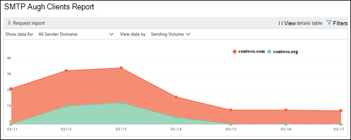
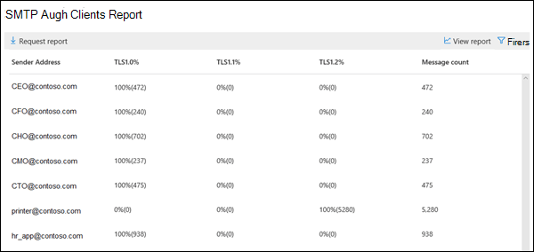

# Rapporten SMTP Auth-klienterSMTP Auth clients report

I rapporten **SMTP Auth-klienter** belysers användningen av SMTP Auth-klientöverföringsprotokollet av användare eller systemkonton i organisationen.The **SMTP Auth clients** report highlights the use of the SMTP Auth client submission protocol by users or system accounts in your organization. Det här äldre protokollet (som använder slutpunkten smtp.office365.com) erbjuder endast grundläggande autentisering och kan användas av komprometterade konton för att skicka e-post.This legacy protocol (which uses the endpoint smtp.office365.com) only offers Basic authentication, and is susceptible to being used by compromised accounts to send email.  Med den här rapporten kan du söka efter ovanlig aktivitet.This report allows you to check for unusual activity. Den visar också TLS-användningsdata för klienter eller enheter som använder SMTP Auth.It also shows the TLS usage data for clients or devices using SMTP Auth.

Widgeten som visas på instrumentpanelen e-postflöde anger antalet användare eller tjänstkonton som har använt SMTP Auth-protokollet under de senaste 7 dagarna.The widget that's shown in the Mail Flow dashboard indicates the number of users or service accounts that have used the SMTP Auth protocol in the last 7 days.

Om du klickar på widgeten öppnas ett utfällbart utfällbart alternativ som ger en aggregerad vy över TLS-användningen och volymerna för den senaste veckan.Clicking on the widget opens a flyout that provides an aggregated view of the TLS usage and volumes for the last week.

När du klickar på länken **SMTP Auth Clients Report** visas två huvuddata pivoter och två datavyer.When you click on the **SMTP Auth Clients Report** link, you'll see two main data pivots and two data views. Data pivoter är **skicka volym** och **TLS användning**.The data pivots are the **Sending Volume** and **TLS Usage**. Datavyerna är diagrammet och detaljtabellen.The data views are the chart and the details table.

Vyn **Skicka volym** visar antalet meddelanden som skickades med SMTP-autentisering för det angivna tidsintervallet.The **Sending Volume** view shows the number of messages that were sent using SMTP Auth for the specified time range. Du kan justera intervallet genom att klicka på **Filter**.You can adjust the range by clicking **Filters**. Diagrammet ordnas efter avsändatordomän.The chart is organized by sender domain. Du kan se separata data för varje domän genom att välja domänen i **listrutan Visa data.**You can see separate data for each domain by selecting the domain in the **Show data for** drop down.

Du kan visa detaljerad information om avsändarna och deras meddelandeantal genom att klicka på **Visa informationstabell**.You can view detailed information about the senders and their message counts by clicking **View details table**. Om du vill återgå till diagrammet klickar du på **Visa rapport**.To return to the chart, click **View report**.

**TLS-användnings** pivot är viktigt på grund av den kommande utfasningen av TLS1.0 och TLS1.1 i Office 365.The **TLS Usage** pivot is important due to the upcoming deprecation of TLS1.0 and TLS1.1 in Office 365. Många äldre enheter och program kan inte skicka e-post om de bara kan använda TLS1.0 med SMTP Auth. Med den här pivoten kan du identifiera och vidta åtgärder för användare och systemkonton som fortfarande använder äldre versioner av TLS.Many legacy devices and applications will be unable to send email if they are only capable of using TLS1.0 with SMTP Auth. This pivot allows you to identify and take action on users and system accounts that are still using older versions of TLS.

Du kan visa detaljerad information om avsändare, versioner av TLS som de använder med SMTP Auth och deras meddelande räknas genom att klicka på **Visa informationstabell**.You can view detailed information about the senders, the versions of TLS they are using with SMTP Auth, and their message counts by clicking **View details table**. Om du vill återgå till diagrammet klickar du på **Visa rapport**.To return to the chart, click **View report**.

Du kan också hämta en mer detaljerad version av rapporten genom att klicka på Begär rapport.You can also download a more detailed version of the report by clicking Request report.

## Relaterade ämnenRelated topics

Mer information om andra insikter om e-postflöde i instrumentpanelen för e-postflödet finns [i Insikterna för e-postflöde i Security & Compliance Center](mail-flow-insights-v2.md).For more information about other mail flow insights in the mail flow dashboard, see [Mail flow insights in the Security & Compliance Center](mail-flow-insights-v2.md).
