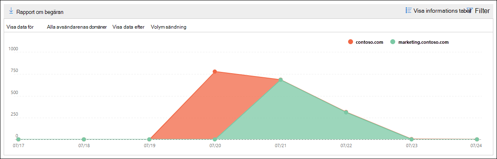

# Insikt och rapport för SMTP-autentiseringsklienter i Säkerhets- & efterlevnadscenterSMTP Auth clients insight and report in the Security & Compliance Center

[!INCLUDE [Microsoft 365 Defender rebranding](../includes/microsoft-defender-for-office.md)]

**Gäller för****Applies to**
- [Exchange Online ProtectionExchange Online Protection](exchange-online-protection-overview.md)
- [Microsoft Defender för Office 365 Abonnemang 1 och Abonnemang 2Microsoft Defender for Office 365 plan 1 and plan 2](defender-for-office-365.md)
- [Microsoft 365 DefenderMicrosoft 365 Defender](../defender/microsoft-365-defender.md)

Insikten **för SMTP-autentiseringsklienter** i instrumentpanelen för e-postflöde och rapporten tillhörande [SMTP-autentiseringsklienter](#smtp-auth-clients-report) i kompatibilitetscentret för [säkerhet i &](https://protection.office.com) markerar användningen av sändningsprotokoll för SMTP-AUTH-klienten för användare eller systemkonton i organisationen. The **SMTP Auth clients** insight in the [Mail flow dashboard](mail-flow-insights-v2.md) and the associated [SMTP Auth clients report](#smtp-auth-clients-report) in the [Security & Compliance Center](https://protection.office.com) highlight the use of the SMTP AUTH client submission protocol by users or system accounts in your organization. Det här äldre protokollet (som använder slutpunkts-smtp.office365.com) erbjuder endast grundläggande autentisering och är känslig för användning av komprometterade konton för att skicka e-post.This legacy protocol (which uses the endpoint smtp.office365.com) only offers Basic authentication, and is susceptible to being used by compromised accounts to send email. Med insikten och rapporten kan du kontrollera ovanlig aktivitet för sändning via SMTP AUTH-e-post.The insight and report allow you to check for unusual activity for SMTP AUTH email submissions. Den visar även TLS-användningsdata för klienter eller enheter som använder SMTP AUTH.It also shows the TLS usage data for clients or devices using SMTP AUTH.

Widgeten anger antalet användare eller tjänstkonton som har använt SMTP-autentiseringsprotokoll under de senaste 7 dagarna.The widget indicates the number of users or service accounts that have used the SMTP Auth protocol in the last 7 days.

Om du klickar på antalet meddelanden på widgeten visas den utfällade **menyn SMTP Auth-klienter.**If you click the number of messages on the widget, an **SMTP Auth clients** flyout appears. Den utfällda utfällningen ger en aggregerad vy över TLS-användning och -volymer för den senaste veckan.The flyout provides an aggregated view of the TLS usage and volumes for the last week.

Du kan klicka på **rapportlänken SMTP Auth-klienter** för att gå till rapporten SMTP Auth-klienter enligt beskrivningen i nästa avsnitt.You can click the **SMTP Auth clients report** link to go to the SMTP Auth clients report as described in the next section.

## Rapporten SMTP Auth-klienterSMTP Auth clients report

### Rapportvyn för rapporten SMTP Auth-klienterReport view for the SMTP Auth clients report

Som standard visar rapporten data för de senaste 7 dagarna, men data är tillgängliga för de senaste 90 dagarna.By default, the report shows data for the last 7 days, but data is available for the last 90 days.

Översiktsavsnittet innehåller följande diagram:The overview section contains the following charts:

- **Visa data efter: Skicka** volym: Som standard visar diagrammet antalet SMTP-klientmeddelanden som skickades från alla domäner **(Visa data för:** Alla avsändardomäner är markerat som standard).**View data by: Sending volume**: By default, the chart shows the number of SMTP Auth client messages that were sent from all domains (**Show data for: All sender domains** is selected by default). Du kan filtrera resultatet till en viss avsändardomän genom att klicka på Visa **data** för och välja avsändardomänen i listrutan.You can filter the results to a specific sender domain by clicking **Show data for** and selecting the sender domain from the dropdown list. Om du hovrar över en specifik datapunkt (dag) visas antalet meddelanden.If you hover a specific data point (day), the number of messages is shown.

  

- **Visa data efter: TLS-användning:** I diagrammet visas procentandelen TLS-användning för alla meddelanden från SMTP-autentiseringsklienten under den valda tidsperioden.**View data by: TLS Usage**: The chart shows the percentage of TLS usage for all SMTP Auth client messages during the selected time period. Med det här diagrammet kan du identifiera och vidta åtgärder på användare och systemkonton som fortfarande använder äldre versioner av TLS.This chart allows you to identify and take action on users and system accounts that are still using older versions of TLS.

  

Om du klickar **på** Filter i en rapportvy kan du ange ett datumintervall **med Startdatum** **och Slutdatum.**If you click **Filters** in a report view, you can specify a date range with **Start date** and **End date**.

Klicka **på Begär rapport** om du vill få en mer detaljerad version av rapporten i ett e-postmeddelande.Click **Request report** to receive a more detailed version of the report in an email message. Du kan ange datumintervallet och mottagarna för att ta emot rapporten.You can specify the date range and the recipients to receive the report.

### Tabellvyn Information för rapporten SMTP Auth-klienterDetails table view for the SMTP Auth clients report

Om du **klickar på Visa** informationstabell beror den information som visas på det diagram som du tittar på:If you click **View details table**, the information that's shown depends on the chart you were looking at:

- **Visa data genom: Skicka volym:** Följande information visas i en tabell:**View data by: Sending volume**: The following information is shown in a table:

  - **Avsändarens adress****Sender address**
  - **Antal meddelanden****Message count**

  Om du markerar en rad visas samma information i en utfällbladstext.If you select a row, the same details are shown in a flyout.

- **Visa data efter: TLS-användning:** Följande information visas i en tabell:**View data by: TLS Usage**: The following information is shown in a table:

  - **Avsändarens adress****Sender address**
  - **TLS1,0 %**\***TLS1.0%**\*
  - **TLS1,1 %**\***TLS1.1%**\*
  - **TLS1,2 %**\***TLS1.2%**\*
  - **Antal meddelanden****Message count**

  \* I den här kolumnen visas både procentandelen och antalet meddelanden från avsändaren.\* This column shows both the percentage and number of messages from the sender.

Om du klickar **på** Filter i en detaljtabellvy kan du ange ett datumintervall **med Startdatum** **och Slutdatum.**If you click **Filters** in a details table view, you can specify a date range with **Start date** and **End date**.

Om du markerar en rad visas liknande information i en utfällbladstext:If you select a row, similar details are shown in a flyout:

Klicka **på Begär rapport** om du vill få en mer detaljerad version av rapporten i ett e-postmeddelande.Click **Request report** to receive a more detailed version of the report in an email message. Du kan ange datumintervallet och mottagarna för att ta emot rapporten.You can specify the date range and the recipients to receive the report.

Om du vill gå tillbaka till rapportvyn klickar du **på Visa rapport**.To go back to the reports view, click **View report**.

## Relaterade ämnenRelated topics

Mer information om andra insikter i instrumentpanelen för e-postflöde finns i [E-postflödesinformation i Säkerhets- & efterlevnadscenter.](mail-flow-insights-v2.md)For information about other insights in the Mail flow dashboard, see [Mail flow insights in the Security & Compliance Center](mail-flow-insights-v2.md).
