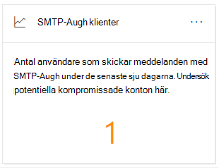
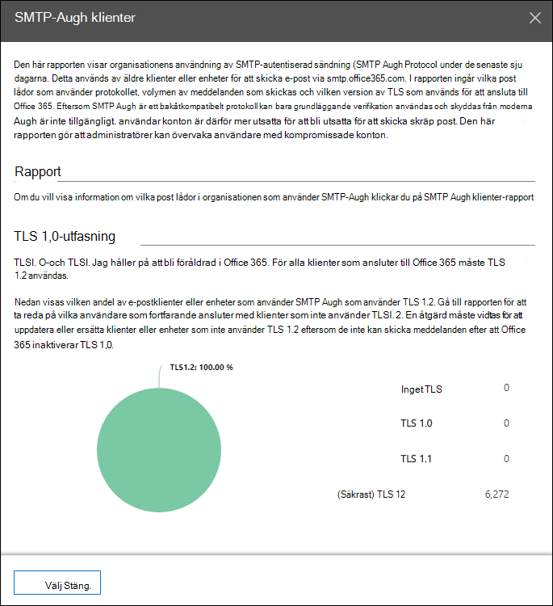
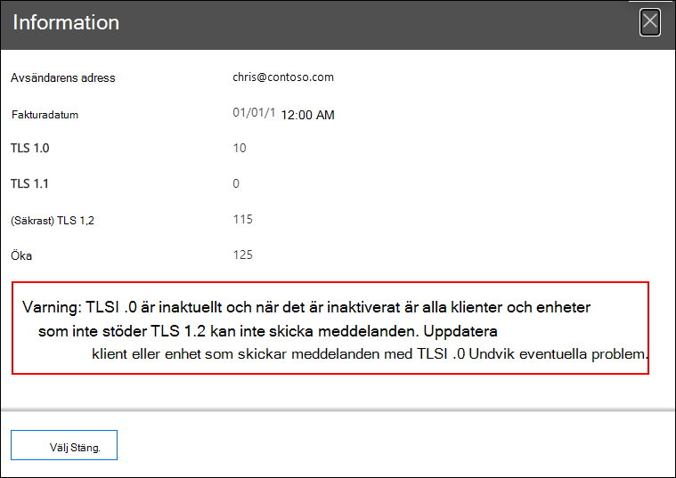

# Insikt och rapport om SMTP-autentiseringsklienter i & Säkerhets- och efterlevnadscenter

[!INCLUDE [Microsoft 365 Defender rebranding](../includes/microsoft-defender-for-office.md)]

**Gäller för**
- [Exchange Online Protection](https://go.microsoft.com/fwlink/?linkid=2148611)
- [Microsoft Defender för Office 365 abonnemang 1 och abonnemang 2](https://go.microsoft.com/fwlink/?linkid=2148715)
- [Microsoft 365 Defender](https://go.microsoft.com/fwlink/?linkid=2118804)

Insikter **för SMTP-autentiseringsklienter** i instrumentpanelen för e-postflöde och rapporten om associerade [SMTP-autentiseringsklienter](#smtp-auth-clients-report) i säkerhets- [& och](https://protection.office.com) efterlevnadscentret visar hur användare eller systemkonton i organisationen använder sändningsprotokoll för SMTP-AUTENTISERING-klienten.  Det här äldre protokollet (som använder slutpunkts-smtp.office365.com) erbjuder endast grundläggande autentisering och är känslig för användning av komprometterade konton för att skicka e-post. Med insikten och rapporten kan du kontrollera ovanlig aktivitet för sändning via SMTP-AUTH-e-post. Den visar även TLS-användningsdata för klienter eller enheter som använder SMTP AUTH.

Widgeten anger antalet användare eller tjänstkonton som har använt SMTP-autentiseringsprotokoll under de senaste 7 dagarna.

Om du klickar på antalet meddelanden på widgeten visas en **utfällningsklient för SMTP-autentisering.** Den utfällda utfällningen visar en aggregerad vy över TLS-användningen och volymerna för den senaste veckan.

Du kan klicka på **rapportlänken för** SMTP-autentiseringsklienter för att gå till rapporten om SMTP-autentiseringsklienter enligt beskrivningen i nästa avsnitt.

## Rapporten SMTP Auth-klienter

### Rapportvy för rapporten SMTP-autentiseringsklienter

Som standard visar rapporten data för de senaste 7 dagarna, men data är tillgängliga för de senaste 90 dagarna.

Översiktsavsnittet innehåller följande diagram:

- **Visa data efter:** Skicka volym: Som standard visar diagrammet antalet SMTP-klientmeddelanden som skickades från alla domäner (visa **data för:** Alla avsändardomäner är markerade som standard). Du kan filtrera resultaten till en viss avsändardomän genom att klicka på Visa **data** för och välja avsändardomänen i listrutan. Om du hovrar över en viss datapunkt (dag) visas antalet meddelanden.

  

- **Visa data efter: TLS-användning:** Diagrammet visar procentandelen TLS-användning för alla meddelanden från SMTP-klienten under den valda tidsperioden. Med det här diagrammet kan du identifiera och vidta åtgärder på användare och systemkonton som fortfarande använder äldre versioner av TLS.

  

Om du klickar **på** Filter i en rapportvy kan du ange ett datumintervall **med startdatum** **och slutdatum.**

Klicka **på Begär rapport** om du vill få en mer detaljerad version av rapporten i ett e-postmeddelande. Du kan ange datumintervallet och mottagarna för att ta emot rapporten.

### Tabellvyn Information för rapporten SMTP-autentiseringsklienter

Om du **klickar på Tabellen** Visa information beror den information som visas på det diagram som du visade:

- **Visa data genom att: Skicka volym:** Följande information visas i en tabell:

  - **Avsändarens adress**
  - **Antal meddelanden**

  Om du markerar en rad visas samma information i en utfällig plats.

- **Visa data efter: TLS-användning:** Följande information visas i en tabell:

  - **Avsändarens adress**
  - **TLS1,0 %**\*
  - **TLS1,1 %**\*
  - **TLS1,2 %**\*
  - **Antal meddelanden**

  \* I den här kolumnen visas både procent och antal meddelanden från avsändaren.

Om du klickar **på** Filter i en detaljtabellvy kan du ange ett datumintervall **med Startdatum** **och Slutdatum.**

Om du markerar en rad visas liknande information i en utfällig plats:

Klicka **på Begär rapport** om du vill få en mer detaljerad version av rapporten i ett e-postmeddelande. Du kan ange datumintervallet och mottagarna för att ta emot rapporten.

Om du vill gå tillbaka till rapportvyn klickar du **på Visa rapport.**

## Relaterade ämnen

Mer information om andra insikter i instrumentpanelen för e-postflöde finns i [E-postflödesinsikter i Säkerhets- & Efterlevnadscenter.](mail-flow-insights-v2.md)
