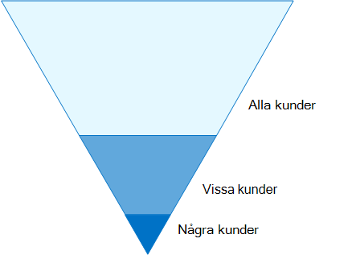
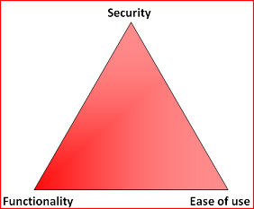

# Konfigurationer av identiteter och enhetsåtkomstIdentity and device access configurations

Den moderna säkerhets omkretsen i din organisation utökas nu bortom ditt nätverk för att omfatta användare som har åtkomst till molnbaserade program från valfri plats med olika enheter.The modern security perimeter of your organization now extends beyond your network to include users accessing cloud-based apps from any location with a variety of devices. Din säkerhets infrastruktur måste avgöra om en viss åtkomstbegäran ska beviljas och under vilka omständigheter.Your security infrastructure needs to determine whether a given access request should be granted and under what conditions. 

Denna bestämning bör baseras på användar kontot för inloggningen, den enhet som används, programmet som användaren använder för åtkomst, den plats där åtkomstbegäran görs och en bedömning av risken för begäran.This determination should be based on the user account of the sign-in, the device being used, the app the user is using for access, the location from which the access request is made, and an assessment of the risk of the request. Denna funktion hjälper till att säkerställa att endast godkända användare och enheter kan komma åt dina kritiska resurser.This capability helps ensure that only approved users and devices can access your critical resources.

I den här artikeln beskrivs en uppsättning nödvändiga konfigurationer för identitets-och enhets åtkomst och en uppsättning villkorliga åtkomst tjänster för Azure Active Directory (Azure AD), Microsoft Intune och andra principer för att skydda åtkomst till Microsoft 365 för företags moln program och tjänster, andra SaaS-tjänster och lokala program som publicerats med Azure AD Application Proxy.This series of articles describes a set of identity and device access prerequisite configurations and a set of Azure Active Directory (Azure AD) Conditional Access, Microsoft Intune, and other policies to secure access to Microsoft 365 for enterprise cloud apps and services, other SaaS services, and on-premises applications published with Azure AD Application Proxy.

Inställningar och principer för åtkomst till identiteter och enheter rekommenderas i tre nivåer: baseline-skydd, känsligt skydd och skydd för miljöer med mycket reglerade eller sekretessbelagda data.Identity and device access settings and policies are recommended in three tiers: baseline protection, sensitive protection, and protection for environments with highly regulated or classified data. Dessa nivåer och deras motsvarande konfigurationer ger konsekventa skyddsnivåer för dina data, identiteter och enheter.These tiers and their corresponding configurations provide consistent levels of protection across your data, identities, and devices.

Dessa möjligheter och deras rekommendationer:These capabilities and their recommendations:

- Stöds i Microsoft 365 E3 och Microsoft 365 E5.Are supported in Microsoft 365 E3 and Microsoft 365 E5.
- Är justerade med [Microsofts säkra Poäng](https://docs.microsoft.com/microsoft-365/security/mtp/microsoft-secure-score) och [identitets poängen i Azure AD](https://docs.microsoft.com/azure/active-directory/fundamentals/identity-secure-score)och ökar poängen för din organisation.Are aligned with [Microsoft Secure Score](https://docs.microsoft.com/microsoft-365/security/mtp/microsoft-secure-score) as well as [identity score in Azure AD](https://docs.microsoft.com/azure/active-directory/fundamentals/identity-secure-score), and will increase these scores for your organization.
- Hjälper dig att implementera dessa [fem steg för att skydda din identitets infrastruktur](https://docs.microsoft.com/azure/security/azure-ad-secure-steps).Will help you implement these [five steps to securing your identity infrastructure](https://docs.microsoft.com/azure/security/azure-ad-secure-steps).

Om din organisation har unika miljö krav eller komplexa, Använd dessa rekommendationer som utgångs punkt.If your organization has unique environment requirements or complexities, use these recommendations as a starting point. De flesta organisationer kan använda dessa rekommendationer enligt anvisningarna.However, most organizations can implement these recommendations as prescribed.

>[!Note]
>Microsoft säljer också Enterprise Mobility + Security (EMS) för Office 365-prenumerationer.Microsoft also sells Enterprise Mobility + Security (EMS) licenses for Office 365 subscriptions. EMS-och EMS-funktioner är likvärdiga med Microsoft 365 E3 och Microsoft 365 E5.EMS E3 and EMS E5 capabilities are equivalent to those in Microsoft 365 E3 and Microsoft 365 E5. Se [EMS-abonnemang](https://www.microsoft.com/en-us/microsoft-365/enterprise-mobility-security/compare-plans-and-pricing) för mer information.See [EMS plans](https://www.microsoft.com/en-us/microsoft-365/enterprise-mobility-security/compare-plans-and-pricing) for the details.
>

## Avsedd mål gruppIntended audience

Dessa rekommendationer är avsedda för företags arkitekter och IT-proffs som är bekanta med Microsoft 365 Cloud Productivity och säkerhets tjänster, vilka inkluderar Azure AD (identitet), Microsoft Intune (enhets hantering) och Azure information Protection (data skydd).These recommendations are intended for enterprise architects and IT professionals who are familiar with Microsoft 365 cloud productivity and security services, which includes Azure AD (identity), Microsoft Intune (device management), and Azure Information Protection (data protection).

### Kund miljöCustomer environment

Rekommenderade principer är tillämpliga för företags organisationer som både fungerar i Microsofts moln och för kunder med hybrid identitets infrastruktur, som är en lokal Active Directory Domain Services-skog som synkroniseras med en Azure AD-klient.The recommended policies are applicable to enterprise organizations operating both entirely within the Microsoft cloud and for customers with hybrid identity infrastructure, which is an on-premises Active Directory Domain Services (AD DS) forest that is synchronized with an Azure AD tenant.

Många av de medföljande rekommendationerna är bara tillgängliga med Microsoft 365 E5, Microsoft 365 E3 med identitets & hot Protection-tillägg, EMS-och Azure Premium P2-licenser.Many of the provided recommendations rely on services available only with Microsoft 365 E5, Microsoft 365 E3 with the Identity & Threat Protection add-on, EMS E5, or Azure Premium P2 licenses.

För de organisationer som inte har dessa licenser rekommenderar Microsoft att du minst implementerar [säkerhets standarder](https://docs.microsoft.com/azure/active-directory/fundamentals/concept-fundamentals-security-defaults), som ingår i alla Microsoft 365-abonnemang.For those organizations who do not have these licenses, Microsoft recommends you at least implement [security defaults](https://docs.microsoft.com/azure/active-directory/fundamentals/concept-fundamentals-security-defaults), which is included with all Microsoft 365 plans. 

### VillkorCaveats

Din organisation kan vara föremål för regler eller andra krav på efterlevnad, inklusive specifika rekommendationer som kan kräva att du tillämpar principer som går vidare från dessa rekommenderade konfigurationer.Your organization may be subject to regulatory or other compliance requirements, including specific recommendations that may require you to apply policies that diverge from these recommended configurations. Dessa konfigurationer rekommenderar användnings kontroller som inte tidigare varit tillgängliga.These configurations recommend usage controls that have not historically been available. Vi rekommenderar de här kontrollerna eftersom vi tror att de representerar en avvägning mellan säkerhet och produktivitet.We recommend these controls because we believe they represent a balance between security and productivity.  

Vi har gjort vårt bästa för att få ett stort utbud av organisationens skydds krav, men vi kan inte uppfylla alla möjliga krav eller för alla unika aspekter av organisationen.We've done our best to account for a wide variety of organizational protection requirements, but we're not able to account for all possible requirements or for all the unique aspects of your organization.

## Tre skydds nivåerThree tiers of protection

De flesta organisationer har särskilda krav på säkerhet och data skydd.Most organizations have specific requirements regarding security and data protection. De här kraven varierar beroende på bransch och efter jobb funktioner inom organisationer.These requirements vary by industry segment and by job functions within organizations. Din juridiska avdelning och administratörer kan till exempel behöva ytterligare säkerhets-och informations skydds kontroller kring deras e-postkorrespondens som inte behövs för andra affär senheter.For example, your legal department and administrators might require additional security and information protection controls around their email correspondence that are not required for other business units. 

Varje bransch har också sin egen uppsättning specialiserade regler.Each industry also has their own set of specialized regulations. I stället för att visa en lista över alla möjliga säkerhets alternativ eller en rekommendation per bransch eller arbets gångs funktion har rekommendationer gjorts för tre olika typer av säkerhet och skydd som kan användas baserat på hur detaljerad dina behov är.Rather than providing a list of all possible security options or a recommendation per industry segment or job function, recommendations have been provided for three different tiers of security and protection that can be applied based on the granularity of your needs.

- **Grundläggande skydd** : Vi rekommenderar att du fastställer en minsta standard för att skydda data samt identiteter och enheter som har åtkomst till dina data.**Baseline protection** : We recommend you establish a minimum standard for protecting data, as well as the identities and devices that access your data. Du kan följa dessa rikt linjer för att tillhandahålla starkt standard skydd som uppfyller behoven hos många organisationer.You can follow these baseline recommendations to provide strong default protection that meets the needs of many organizations.
- **Känsligt skydd** : vissa kunder har en delmängd data som måste skyddas på högre nivåer, eller så kan de kräva att alla data skyddas på en högre nivå.**Sensitive protection** : Some customers have a subset of data that must be protected at higher levels, or they may require all data to be protected at a higher level. Du kan använda ökat skydd för alla eller specifika data uppsättningar i din Microsoft 365-miljö.You can apply increased protection to all or specific data sets in your Microsoft 365 environment. Vi rekommenderar att du skyddar identiteter och enheter som använder känsliga data med jämförbara säkerhets nivåer.We recommend protecting identities and devices that access sensitive data with comparable levels of security.  
- **Mycket reglerad** : vissa organisationer kan ha en mindre mängd data som är starkt klassificerade, utgör bransch hemligheter eller är reglerade data.**Highly regulated** : Some organizations may have a small amount of data that is highly classified, constitutes trade secrets, or is regulated data. Microsoft tillhandahåller funktioner för att hjälpa organisationer att möta dessa krav, inklusive ökat skydd för identiteter och enheter.Microsoft provides capabilities to help organizations meet these requirements, including added protection for identities and devices.

Den här vägledningen visar hur du implementerar skydd för identiteter och enheter för var och en av de här skydds nivåerna.This guidance shows you how to implement protection for identities and devices for each of these tiers of protection. Använd den här vägledningen som utgångs punkt för organisationen och justera principerna för att uppfylla organisationens specifika krav.Use this guidance as a starting point for your organization and adjust the policies to meet your organization's specific requirements.

Det är viktigt att använda konsekventa skyddsnivåer för dina data, identiteter och enheter.It's important to use consistent levels of protection across your data, identities, and devices. Om du till exempel implementerar den här vägledningen bör du se till att skydda dina data på jämförbara nivåer.For example, if you implement this guidance, be sure to protect your data at comparable levels. 

Arkitekturen **för identiteter och enheter för Microsoft 365** -arkitekturer visar vilka funktioner som är jämförbara.The **Identity and device protection for Microsoft 365** architecture model shows you which capabilities are comparable.

    [Visa som en PDF-fil](../../downloads/MSFT_cloud_architecture_identity&device_protection.pdf) \| [Ladda ned som PDF](https://github.com/MicrosoftDocs/microsoft-365-docs/raw/public/microsoft-365/downloads/MSFT_cloud_architecture_identity&device_protection.pdf) \| [Ladda ned som Visio](https://github.com/MicrosoftDocs/microsoft-365-docs/raw/public/microsoft-365/downloads/MSFT_cloud_architecture_identity&device_protection.vsdx)  [View as a PDF](../../downloads/MSFT_cloud_architecture_identity&device_protection.pdf) \| [Download as a PDF](https://github.com/MicrosoftDocs/microsoft-365-docs/raw/public/microsoft-365/downloads/MSFT_cloud_architecture_identity&device_protection.pdf)  \| [Download as a Visio](https://github.com/MicrosoftDocs/microsoft-365-docs/raw/public/microsoft-365/downloads/MSFT_cloud_architecture_identity&device_protection.vsdx)

Se dessutom artikeln [distribuera informations skydd för data integritets regler](../../solutions/information-protection-deploy.md) för att skydda information som lagras i Microsoft 365.Additionally, see the [Deploy information protection for data privacy regulations](../../solutions/information-protection-deploy.md) solution to protect information stored in Microsoft 365.

## Handel med säkerhet och produktivitetSecurity and productivity trade-offs

Införandet av säkerhets strategin kräver handel mellan säkerhet och produktivitet.Implementing any security strategy requires trade-offs between security and productivity. Det är bra att utvärdera hur ett beslut påverkar säkerheten, funktionerna och användar vänligheten.It's helpful to evaluate how each decision affects the balance of security, functionality, and ease of use.

Rekommendationerna bygger på följande principer:The recommendations provided are based on the following principles:

- Bekanta dig med användarna och vara flexibla till deras säkerhets-och funktions krav.Know your users and be flexible to their security and functional requirements.
- Tillämpa en säkerhets princip när som helst och se till att den är meningsfull.Apply a security policy just in time and ensure it is meaningful.

## Tjänster och koncept för åtkomst skydd för identiteter och enheterServices and concepts for identity and device access protection

Microsoft 365 för företag är utformat för stora organisationer för att ge alla möjlighet att vara kreativa och samar beta på ett säkert sätt.Microsoft 365 for enterprise is designed for large organizations to empower everyone to be creative and work together securely.

Det här avsnittet innehåller en översikt över de Microsoft 365-tjänster och-funktioner som är viktiga för åtkomst till identiteter och enheter.This section provides an overview of the Microsoft 365 services and capabilities that are important for identity and device access.

### Azure ADAzure AD

Azure AD tillhandahåller en full uppsättning funktioner för identitets hantering.Azure AD provides a full suite of identity management capabilities. Vi rekommenderar att du använder de här funktionerna för att skydda åtkomst.We recommend using these capabilities to secure access.

| Resurs eller funktionCapability or feature | BeskrivningDescription | LicensieringLicensing |
|:-------|:-----|:-------|
| [Multifaktorautentisering (MFA)Multi-factor authentication (MFA)](/azure/active-directory/authentication/concept-mfa-howitworks) | MFA kräver att användare tillhandahåller två former av verifiering, till exempel ett användar lösen ord samt ett meddelande från programmet Microsoft Authenticator eller ett telefonsamtal.MFA requires users to provide two forms of verification, such as a user password plus a notification from the Microsoft Authenticator app or a phone call. MFA minskar risken att stulna uppgifter kan användas för att komma åt din miljö.MFA greatly reduces the risk that stolen credentials can be used to access your environment. Microsoft 365 använder Azure Multi-Factor autentiseringstjänst-tjänsten för MFA-baserade inloggnings program.Microsoft 365 uses the Azure Multi-Factor Authentication service for MFA-based sign-ins. | Microsoft 365 E3 eller E5Microsoft 365 E3 or E5 |
| [Med villkorsstyrd åtkomstConditional Access](/azure/active-directory/conditional-access/overview) | Azure AD utvärderar villkoren för användarens inloggning och använder principer för villkorsstyrd åtkomst för att fastställa tillåten åtkomst.Azure AD evaluates the conditions of the user sign-in and uses Conditional Access policies to determine the allowed access. I den här vägledningen visar vi dig hur du skapar en princip för villkorsstyrd åtkomst så att du måste ha nödvändig åtkomst till känslig information.For example, in this guidance we show you how to create a Conditional Access policy to require device compliance for access to sensitive data. Detta minskar risken för att en hackare med sin egen enhet och stulna autentiseringsuppgifter kan komma åt dina känsliga data.This greatly reduces the risk that a hacker with their own device and stolen credentials can access your sensitive data. Det skyddar också känslig information på enheterna, eftersom enheterna måste uppfylla specifika krav på hälsa och säkerhet.It also protects sensitive data on the devices, because the devices must meet specific requirements for health and security. | Microsoft 365 E3 eller E5Microsoft 365 E3 or E5 |
| [Azure AD-grupperAzure AD groups](/azure/active-directory/fundamentals/active-directory-manage-groups) | Principer för villkorsstyrd åtkomst, enhets hantering med Intune och till och med behörigheter till filer och webbplatser i din organisation är beroende av tilldelningen till användar konton eller Azure AD-grupper.Conditional Access policies, device management with Intune, and even permissions to files and sites in your organization rely on the assignment to user accounts or Azure AD groups. Vi rekommenderar att du skapar Azure AD-grupper som motsvarar den skydds nivå du implementerar.We recommend you create Azure AD groups that correspond to the levels of protection you are implementing. Din exekutiva personal är till exempel troligen högre värde mål för hackare.For example, your executive staff are likely higher value targets for hackers. Därför är det bra att lägga till användar konton för dessa anställda i en Azure AD-grupp och tilldela den här gruppen till principer för villkorlig åtkomst och andra principer som tvingar fram en högre skydds nivå för Access.Therefore, it makes sense to add the user accounts of these employees to an Azure AD group and assign this group to Conditional Access policies and other policies that enforce a higher level of protection for access. | Microsoft 365 E3 eller E5Microsoft 365 E3 or E5 |
| [Enhets registreringDevice enrollment](/azure/active-directory/devices/overview) | Du registrerar en enhet i Azure AD för att skapa en identitet för enheten.You enroll a device into Azure AD to create an identity for the device. Denna identitet används för att autentisera enheten när en användare loggar in och för att tillämpa villkorsstyrda åtkomst principer som kräver domänanslutna eller kompatibla datorer.This identity is used to authenticate the device when a user signs in and to apply Conditional Access policies that require domain-joined or compliant PCs. För den här vägledningen använder vi enhets registrering för att automatiskt registrera domänanslutna Windows-datorer.For this guidance, we use device enrollment to automatically enroll domain-joined Windows computers. Enhets registrering är en förutsättning för att hantera enheter med Intune.Device enrollment is a prerequisite for managing devices with Intune. | Microsoft 365 E3 eller E5Microsoft 365 E3 or E5 |
| [Azure AD Identity ProtectionAzure AD Identity Protection](/azure/active-directory/identity-protection/overview) | Gör det möjligt att upptäcka potentiella säkerhets problem som påverkar organisationens identitet och konfigurera automatisk reparations princip för att Visa riskerna med låg, medelhög och stor inloggning och användare.Enables you to detect potential vulnerabilities affecting your organization's identities and configure automated remediation policy to low, medium, and high sign-in risk and user risk. Den här vägledningen är beroende av denna riskbedömning för att tillämpa principer för villkorsstyrd åtkomst för multifaktorautentisering.This guidance relies on this risk evaluation to apply Conditional Access policies for multi-factor authentication. Den här vägledningen innehåller även en policy för villkorsstyrd åtkomst som kräver att användare ändrar sitt lösen ord om en aktivitet med hög risk identifieras för deras konto.This guidance also includes a Conditional Access policy that requires users to change their password if high-risk activity is detected for their account. | Microsoft 365 E5, Microsoft 365 E3 med tillägget identitets & hot Protection, EMS E5 eller Azure Premium P2-licenserMicrosoft 365 E5, Microsoft 365 E3 with the Identity & Threat Protection add-on, EMS E5, or Azure Premium P2 licenses |
| [Självbetjäning för återställning av lösen ord (SSPR)Self-service password reset (SSPR)](/azure/active-directory/authentication/concept-sspr-howitworks) | Tillåt att dina användare återställer sina lösen ord på ett säkert sätt och utan hjälp genom att kontrol lera flera autentiseringsmetoder som administratören kan kontrol lera.Allow your users to reset their passwords securely and without help-desk intervention, by providing verification of multiple authentication methods that the administrator can control. | Microsoft 365 E3 eller E5Microsoft 365 E3 or E5 |
| [Lösen ords skydd i Azure ADAzure AD password protection](https://docs.microsoft.com/azure/active-directory/authentication/concept-password-ban-bad) | Identifiera och blockera kända svaga lösen ord och deras varianter och ytterligare svaga termer som är specifika för din organisation.Detect and block known weak passwords and their variants and additional weak terms that are specific to your organization. Standard globala förbjudna lösenordslistor tillämpas automatiskt på alla användare i en Azure AD-klient.Default global banned password lists are automatically applied to all users in an Azure AD tenant. Du kan definiera ytterligare poster i en anpassad förbjuden lösenordslista.You can define additional entries in a custom banned password list. När användare ändrar eller återställer sina lösenord kontrolleras dessa förbjudna lösenordslistor för att använda starka lösenord.When users change or reset their passwords, these banned password lists are checked to enforce the use of strong passwords. |  Microsoft 365 E3 eller E5Microsoft 365 E3 or E5 |
||||

Här är komponenterna i identitets-och enhets åtkomst, inklusive Intune och Azure AD-objekt, inställningar och under tjänster.Here are the components of identity and device access, including Intune and Azure AD objects, settings, and subservices.

### Microsoft IntuneMicrosoft Intune

[Intune](https://docs.microsoft.com/intune/introduction-intune) är Microsofts molnbaserade tjänst för mobila enheter.[Intune](https://docs.microsoft.com/intune/introduction-intune) is Microsoft's cloud-based mobile device management service. De här anvisningarna rekommenderar att du hanterar Windows-datorer med Intune och rekommenderar konfigurering av principer för efterlevnadsprinciper.This guidance recommends device management of Windows PCs with Intune and recommends device compliance policy configurations. Intune avgör om enheter är kompatibla och skickar dessa data till Azure AD för användning när principer för villkorsstyrd åtkomst tillämpas.Intune determines whether devices are compliant and sends this data to Azure AD to use when applying Conditional Access policies.

#### Program skydd i IntuneIntune app protection

[Intune](https://docs.microsoft.com/intune/app-protection-policy) -principer för appar kan användas för att skydda organisationens data i mobilappar, med eller utan att registrera enheter i hanteringen.[Intune app protection](https://docs.microsoft.com/intune/app-protection-policy) policies can be used to protect your organization's data in mobile apps, with or without enrolling devices into management. Intune skyddar informationen och säkerställer att dina anställda kan arbeta produktivt och förhindra data förlust.Intune helps protect information, making sure your employees can still be productive, and preventing data loss. Genom att implementera principer för program nivå kan du begränsa åtkomsten till företags resurserna och hålla informationen i kontrollen över din IT-avdelning.By implementing app-level policies, you can restrict access to company resources and keep data within the control of your IT department.

Den här vägledningen visar hur du skapar rekommenderade principer för att använda godkända appar och för att bestämma hur dessa appar ska kunna användas med dina affärs data.This guidance shows you how to create recommended policies to enforce the use of approved apps and to determine how these apps can be used with your business data.

### Microsoft 365Microsoft 365

Den här vägledningen visar hur du implementerar en uppsättning principer för att skydda åtkomst till Microsoft 365-moln tjänster, inklusive Microsoft Teams, Exchange Online, SharePoint Online och OneDrive för företag.This guidance shows you how to implement a set of policies to protect access to Microsoft 365 cloud services, including Microsoft Teams, Exchange Online, SharePoint Online, and OneDrive for Business. Förutom att implementera dessa principer rekommenderar vi att du också höjer skydds nivån för klient organisationen med följande resurser:In addition to implementing these policies, we recommend you also raise the level of protection for your tenant using these resources:

- [Konfigurera din klientorganisationen för bättre säkerhetConfigure your tenant for increased security](tenant-wide-setup-for-increased-security.md)

  Rekommendationer som gäller för din klient organisations säkerhet.Recommendations that apply to baseline security for your tenant.

- [Säkerhets översikt: Top prioriteringar för de första 30 dagarna, 90 dagar och senareSecurity roadmap: Top priorities for the first 30 days, 90 days, and beyond](security-roadmap.md)

  Rekommendationer som inkluderar loggning, data styrning, administratörs åtkomst och skydd mot hot.Recommendations that include logging, data governance, admin access, and threat protection.

### Windows 10 och  Microsoft 365-appar för företagWindows 10 and Microsoft 365 Apps for enterprise

Windows 10 med Microsoft 365-appar för företag är den rekommenderade klient miljön för datorer.Windows 10 with Microsoft 365 Apps for enterprise is the recommended client environment for PCs. Vi rekommenderar Windows 10 eftersom Azure är utformat för att erbjuda den bästa möjliga upplevelsen för både lokala och Azure-annonser.We recommend Windows 10 because Azure is designed to provide the smoothest experience possible for both on-premises and Azure AD. Windows 10 inkluderar också avancerade säkerhetsfunktioner som kan hanteras via Intune.Windows 10 also includes advanced security capabilities that can be managed through Intune. Microsoft 365-appar för företag innehåller de senaste versionerna av Office-programmen.Microsoft 365 Apps for enterprise includes the latest versions of Office applications. Dessa används för modern lösenordsautentisering, som är säkrare och ett krav för villkorlig åtkomst.These use modern authentication, which is more secure and a requirement for Conditional Access. Dessa program inkluderar också förbättrade säkerhets-och efterföljandekrav.These apps also include enhanced security and compliance tools.

## Hur de här funktionerna tillämpas på de tre skydds nivåernaApplying these capabilities across the three tiers of protection

I följande tabell sammanfattas våra rekommendationer för att använda de här funktionerna på de tre skydds nivåerna.The following table summarizes our recommendations for using these capabilities across the three tiers of protection.

|Skydds funktionProtection mechanism|GrundläggandeBaseline|KänsligSensitive|Strikt regleradHighly regulated|
|:-------------------|:-------|:--------|:---------------|
|**Påtvinga MFA****Enforce MFA**|På medium eller över inloggnings riskerOn medium or above sign-in risk|På låg eller över inloggnings riskerOn low or above sign-in risk|För alla nya sessionerOn all new sessions|
|**Tvinga lösen ords ändring****Enforce password change**|För användare med hög riskFor high-risk users|För användare med hög riskFor high-risk users|För användare med hög riskFor high-risk users|
|**Genomdriva Intune-programskydd****Enforce Intune application protection**|JaYes|JaYes|JaYes|
|**Tvinga Intune-registrering för företagsägda enheter****Enforce Intune enrollment for organization-owned device**|Kräv en kompatibel eller domänansluten dator, men tillåt fasta enheter (BYOD) telefoner och surfplattorRequire a compliant or domain-joined PC, but allow bring-your-own devices (BYOD) phones and tablets|Kräv en kompatibel eller domänansluten enhetRequire a compliant or domain-joined device|Kräv en kompatibel eller domänansluten enhetRequire a compliant or domain-joined device|

## Enhetens ägarskapDevice ownership

Tabellen ovan visar trenden för många organisationer för att stödja en blandning av organisations ägda enheter, samt personligt och BYODs, för att möjliggöra mobil produktivitet.The above table reflects the trend for many organizations to support a mix of organization-owned devices, as well as personal or BYODs to enable mobile productivity across the workforce. Intune-principer för appar säkerställer att e-post skyddas från exfiltrating av Outlook-mobilappen och andra Office-mobilappar, på både företagsägda enheter och BYODs.Intune app protection policies ensure that email is protected from exfiltrating out of the Outlook mobile app and other Office mobile apps, on both organization-owned devices and BYODs.  

Vi rekommenderar att organisations enheter hanteras av Intune eller domänbaserad domän för att tillämpa ytterligare skydd och kontroll.We recommend organization-owned devices be managed by Intune or domain-joined to apply additional protections and control. Beroende på data känslighet kan din organisation välja att inte tillåta BYODs för specifika användar populationer eller särskilda appar.Depending on data sensitivity, your organization may choose to not allow BYODs for specific user populations or specific apps.

## Distribution och dina apparDeployment and your apps

Innan du konfigurerar och har konfigurerat identitets-och enhets åtkomst för Azure AD-integrerade appar måste du:Prior to configuring and rolling out identity and device access configuration for your Azure AD-integrated apps, you must: 

- Bestäm vilka program som ska användas i organisationen som du vill skydda.Decide which apps used in your organization you want to protect. 
- Analysera den här listan med program för att fastställa uppsättningar med principer som ger lämpliga skydds nivåer.Analyze this list of apps to determine the sets of policies that provide appropriate levels of protection. 

  Du bör inte skapa separata uppsättningar principer för program, eftersom hanteringen av dem kan bli besvärlig.You should not create separate sets of policies each for app because management of them can become cumbersome. Microsoft rekommenderar att du grupperar dina appar som har samma skydds krav för samma användare.Microsoft recommends that you group your apps that have the same protection requirements for the same users. 

  Du kan till exempel ha en uppsättning principer som inkluderar alla Microsoft 365-appar för alla dina användare om original planens skydd och en andra uppsättning principer för alla känsliga appar, till exempel de som används av Human Resources eller ekonomi avdelningar, och tillämpa dem på dessa grupper.For example, you could have one set of policies that include all Microsoft 365 apps for all of your users for baseline protection and a second set of policies for all sensitive apps, such as those used by human resources or finance departments, and apply them to those groups. 

När du har fastställt en uppsättning principer för de program som du vill säkra kan du lyfta bort principerna till användarna stegvist, adresserings problem på vägen.Once you have determined the set of policies for the apps you want to secure, roll the policies out to your users incrementally, addressing issues along the way.  

Konfigurera till exempel de principer som ska användas för alla Microsoft 365-appar för bara Exchange Online med de ytterligare ändringarna för Exchange.For example, configure the policies that will be used for all your Microsoft 365 apps for just Exchange Online with the additional changes for Exchange. Slå på dessa principer till användarna och arbeta igenom eventuella problem.Roll these policies out to your users and work through any issues. Sedan lägger du till Teams och ändrar dem till dina användare.Then, add Teams with its additional changes and roll this out to your users. Lägg sedan till SharePoint med de ytterligare ändringarna.Then, add SharePoint with its additional changes. Fortsätt lägga till resten av dina program tills du säkert kan konfigurera dessa rikt linjer för alla Microsoft 365-appar.Continue adding the rest of your apps until you can confidently configure these baseline policies to include all Microsoft 365 apps. 

För dina känsliga appar kan du till och med skapa en uppsättning principer och lägga till en app i taget och arbeta igenom eventuella problem tills de tas med i den känsliga program princip uppsättningen.Similarly, for your sensitive apps, create the set of policies and add one app at a time and work through any issues until they are all included in the sensitive app policy set. 

Microsoft rekommenderar att du inte skapar princip uppsättningar som gäller för alla program, eftersom det kan leda till vissa oavsiktliga konfigurationer.Microsoft recommends that you do not create policy sets that apply to all apps because it can result in some unintended configurations. Principer som blockerar alla appar kan till exempel låsa dina administratörer från Azure-portalen och undantagen kan inte konfigureras för viktiga slut punkter som Microsoft Graph.For example, policies that block all apps could lock your admins out of the Azure portal and exclusions cannot be configured for important endpoints such as Microsoft Graph. 

## Steg i processen med att konfigurera åtkomst för identitet och enhetSteps in the process of configuring identity and device access

1. Konfigurera nödvändiga identitets funktioner och deras inställningar.Configure prerequisite identity features and their settings.
2. Konfigurera principer för villkorsstyrd åtkomst för den gemensamma identiteten och åtkomsten.Configure the common identity and access Conditional Access policies.
3. Konfigurera villkorsstyrda åtkomst principer för gäster och externa användare.Configure Conditional Access policies for guest and external users.
4. Konfigurera villkorsstyrd åtkomst policy för Microsoft 365-molnappar som Microsoft Teams, Exchange Online och SharePoint.Configure Conditional Access policies for Microsoft 365 cloud apps such as Microsoft Teams, Exchange Online, and SharePoint.

Efter att du har konfigurerat identitets-och enhets åtkomst kan du läsa mer i [Azure AD Feature Deployment Guide](https://docs.microsoft.com/azure/active-directory/fundamentals/active-directory-deployment-checklist-p2) för en stegvis check lista över ytterligare funktioner för att överväga och konfigurera [Azure AD Identity](https://docs.microsoft.com/azure/active-directory/governance/) för att skydda, övervaka och granska åtkomst.After you have configured identity and device access, see the [Azure AD feature deployment guide](https://docs.microsoft.com/azure/active-directory/fundamentals/active-directory-deployment-checklist-p2) for a phased checklist of additional features to consider and [Azure AD Identity Governance](https://docs.microsoft.com/azure/active-directory/governance/) to protect, monitor, and audit access.  

## Nästa stegNext step

[Nödvändigt arbete för implementering av identitets-och enhets åtkomst principerPrerequisite work for implementing identity and device access policies](identity-access-prerequisites.md)
