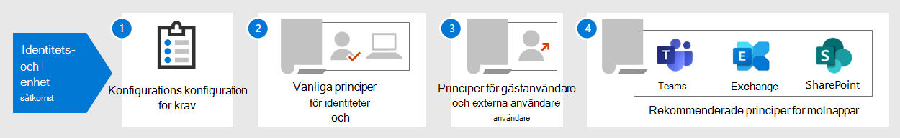

# Konfigurationer av identiteter och enhetsåtkomstIdentity and device access configurations

**Gäller för****Applies to**
- [Exchange Online ProtectionExchange Online Protection](exchange-online-protection-overview.md)
- [Microsoft Defender för Office 365 Abonnemang 1 och Abonnemang 2Microsoft Defender for Office 365 plan 1 and plan 2](defender-for-office-365.md)

Organisationens moderna säkerhets perimeter omfattar nu mer än nätverket så att användare kan komma åt molnbaserade appar från valfri plats med en mängd olika enheter.The modern security perimeter of your organization now extends beyond your network to include users accessing cloud-based apps from any location with a variety of devices. Säkerhetsinfrastrukturen måste avgöra om en viss åtkomstbegäran ska beviljas och under vilka förhållanden.Your security infrastructure needs to determine whether a given access request should be granted and under what conditions.

Det här avgörandet bör baseras på användarkontot för inloggningen, enheten som används, den app användaren använder för åtkomst, den plats som åtkomstbegäran görs från och en bedömning av risken med begäran.This determination should be based on the user account of the sign-in, the device being used, the app the user is using for access, the location from which the access request is made, and an assessment of the risk of the request. Denna funktion hjälper till att säkerställa att endast godkända användare och enheter kan komma åt dina kritiska resurser.This capability helps ensure that only approved users and devices can access your critical resources.

Den här serien med artiklar beskriver en uppsättning konfigurationer av krav på identitet och enhetsåtkomst och en uppsättning villkorsstyrda åtkomstsystem i Azure Active Directory (Azure AD), Microsoft Intune och andra principer för att skydda åtkomst till Microsoft 365 för företagsmolnappar och -tjänster, andra SaaS-tjänster och lokala program som publiceras med Azure AD-programproxy.This series of articles describes a set of identity and device access prerequisite configurations and a set of Azure Active Directory (Azure AD) Conditional Access, Microsoft Intune, and other policies to secure access to Microsoft 365 for enterprise cloud apps and services, other SaaS services, and on-premises applications published with Azure AD Application Proxy.

Inställningar och principer för identitet och enhetsåtkomst rekommenderas på tre nivåer: baslinjeskydd, känsligt skydd och skydd för miljöer med mycket reglerade eller klassificerade data.Identity and device access settings and policies are recommended in three tiers: baseline protection, sensitive protection, and protection for environments with highly regulated or classified data. Dessa nivåer och deras motsvarande konfigurationer ger konsekventa skyddsnivåer för dina data, identiteter och enheter.These tiers and their corresponding configurations provide consistent levels of protection across your data, identities, and devices.

De här funktionerna och deras rekommendationer:These capabilities and their recommendations:

- Stöds i Microsoft 365 E3 och Microsoft 365 E5.Are supported in Microsoft 365 E3 and Microsoft 365 E5.
- Är i linje med [Microsoft Secure Score](../defender/microsoft-secure-score.md) samt [identitetspoäng i Azure AD](/azure/active-directory/fundamentals/identity-secure-score), och kommer att öka dessa resultat för din organisation.Are aligned with [Microsoft Secure Score](../defender/microsoft-secure-score.md) as well as [identity score in Azure AD](/azure/active-directory/fundamentals/identity-secure-score), and will increase these scores for your organization.
- Kommer att hjälpa dig att implementera [de här fem stegen för att skydda din identitetsinfrastruktur.](/azure/security/azure-ad-secure-steps)Will help you implement these [five steps to securing your identity infrastructure](/azure/security/azure-ad-secure-steps).

Om organisationen har unika miljökrav eller komplexitet kan du använda de här rekommendationerna som utgångspunkt.If your organization has unique environment requirements or complexities, use these recommendations as a starting point. Men de flesta organisationer kan implementera de här rekommendationerna som bestämts.However, most organizations can implement these recommendations as prescribed.

Titta på den här videon för en snabb överblick över identitets- och enhetsåtkomstkonfigurationer för Microsoft 365 för företag.Watch this video for a quick overview of identity and device access configurations for Microsoft 365 for enterprise.

> [!VIDEO https://www.microsoft.com/videoplayer/embed/RWxEDQ]

> [!NOTE]
> Microsoft säljer även Enterprise Mobility + Security-licenser (EMS) för Office 365-abonnemang.Microsoft also sells Enterprise Mobility + Security (EMS) licenses for Office 365 subscriptions. EMS E3- och EMS E5-funktionerna motsvarar funktionerna i Microsoft 365 E3 och Microsoft 365 E5.EMS E3 and EMS E5 capabilities are equivalent to those in Microsoft 365 E3 and Microsoft 365 E5. Mer [information finns i EMS-abonnemang.](https://www.microsoft.com/microsoft-365/enterprise-mobility-security/compare-plans-and-pricing)See [EMS plans](https://www.microsoft.com/microsoft-365/enterprise-mobility-security/compare-plans-and-pricing) for the details.

## Avsedd målgruppIntended audience

De här rekommendationerna är avsedda för företagsarkitekter och IT-personal som känner till Microsoft 365-molnproduktivitets- och säkerhetstjänsterna, som omfattar Azure AD (identitet), Microsoft Intune (enhetshantering) och Azure Information Protection (dataskydd).These recommendations are intended for enterprise architects and IT professionals who are familiar with Microsoft 365 cloud productivity and security services, which includes Azure AD (identity), Microsoft Intune (device management), and Azure Information Protection (data protection).

### KundmiljöCustomer environment

De rekommenderade principerna gäller för företagsorganisationer som arbetar både helt i Microsoft-molnet och för kunder med hybrididentitetsinfrastruktur, som är en lokal AD DS-skog (Active Directory Domain Services) som synkroniseras med en Azure AD-klientorganisation.The recommended policies are applicable to enterprise organizations operating both entirely within the Microsoft cloud and for customers with hybrid identity infrastructure, which is an on-premises Active Directory Domain Services (AD DS) forest that is synchronized with an Azure AD tenant.

Många av de medföljande rekommendationerna förlitar sig på tjänster som endast är tillgängliga med Microsoft 365 E5, Microsoft 365 E3 med licenserna Identity & Threat Protection, EMS E5 och Azure Premium P2.Many of the provided recommendations rely on services available only with Microsoft 365 E5, Microsoft 365 E3 with the Identity & Threat Protection add-on, EMS E5, or Azure Premium P2 licenses.

För de organisationer som inte har dessa licenser rekommenderar Microsoft dig att åtminstone implementera säkerhetsstandarder , som ingår i alla Microsoft 365-abonnemang.For those organizations who do not have these licenses, Microsoft recommends you at least implement [security defaults](/azure/active-directory/fundamentals/concept-fundamentals-security-defaults), which is included with all Microsoft 365 plans.

### VarningarCaveats

Din organisation kan omfattas av regelkrav eller andra efterlevnadskrav, bland annat specifika rekommendationer som kan innebära att du måste använda principer som skiljer sig från dessa rekommenderade konfigurationer.Your organization may be subject to regulatory or other compliance requirements, including specific recommendations that may require you to apply policies that diverge from these recommended configurations. Dessa konfigurationer rekommenderar användningskontroller som inte har varit tillgängliga under en längre tid.These configurations recommend usage controls that have not historically been available. Vi rekommenderar dessa kontroller eftersom vi tror att de står för en balans mellan säkerhet och produktivitet.We recommend these controls because we believe they represent a balance between security and productivity.

Vi har gjort vårt bästa för att ta hänsyn till en mängd olika krav på organisationsskydd, men vi kan inte ta med alla möjliga krav eller för alla unika aspekter av din organisation.We've done our best to account for a wide variety of organizational protection requirements, but we're not able to account for all possible requirements or for all the unique aspects of your organization.

## Tre nivåer av skyddThree tiers of protection

De flesta organisationer har särskilda krav gällande säkerhet och dataskydd.Most organizations have specific requirements regarding security and data protection. Kraven varierar efter branschsegment och efter jobbfunktioner inom organisationer.These requirements vary by industry segment and by job functions within organizations. Din juridiska avdelning och administratörer kan till exempel kräva ytterligare säkerhets- och informationsskyddskontroller kring sin e-postkorrespondens som inte krävs för andra affärsenheter.For example, your legal department and administrators might require additional security and information protection controls around their email correspondence that are not required for other business units.

Varje bransch har också en egen uppsättning särskilda bestämmelser.Each industry also has their own set of specialized regulations. I stället för att ge en lista över alla möjliga säkerhetsalternativ eller en rekommendation per branschsegment eller jobbfunktion har rekommendationer lagts till för tre olika nivåer av säkerhet och skydd som kan tillämpas utifrån hur detaljerade dina behov är.Rather than providing a list of all possible security options or a recommendation per industry segment or job function, recommendations have been provided for three different tiers of security and protection that can be applied based on the granularity of your needs.

- **Baslinjeskydd:** Vi rekommenderar att du skapar en lägsta standard för att skydda data samt de identiteter och enheter som får åtkomst till dina data.**Baseline protection**: We recommend you establish a minimum standard for protecting data, as well as the identities and devices that access your data. Du kan följa de här baslinjerekommendationerna för att få ett starkt standardskydd som uppfyller många organisationers behov.You can follow these baseline recommendations to provide strong default protection that meets the needs of many organizations.
- **Känsligt** skydd: Vissa kunder har en delmängd av data som måste skyddas på högre nivåer, eller så kan alla data behöva skyddas på en högre nivå.**Sensitive protection**: Some customers have a subset of data that must be protected at higher levels, or they may require all data to be protected at a higher level. Du kan tillämpa utökat skydd på alla eller vissa datauppsättningar i din Microsoft 365-miljö.You can apply increased protection to all or specific data sets in your Microsoft 365 environment. Vi rekommenderar att du skyddar identiteter och enheter som använder känslig information med liknande säkerhetsnivåer.We recommend protecting identities and devices that access sensitive data with comparable levels of security.
- **Mycket reglerad:** Vissa organisationer kan ha en liten mängd data som klassificeras i hög grad, utgör affärshemligheter eller är reglerade data.**Highly regulated**: Some organizations may have a small amount of data that is highly classified, constitutes trade secrets, or is regulated data. Microsoft tillhandahåller funktioner som hjälper organisationer att uppfylla dessa krav, inklusive ytterligare skydd för identiteter och enheter.Microsoft provides capabilities to help organizations meet these requirements, including added protection for identities and devices.

Den här vägledningen visar hur du implementerar skydd för identiteter och enheter för var och en av dessa nivåer av skydd.This guidance shows you how to implement protection for identities and devices for each of these tiers of protection. Använd den här vägledningen som utgångspunkt för din organisation och justera principerna så att de uppfyller organisationens specifika krav.Use this guidance as a starting point for your organization and adjust the policies to meet your organization's specific requirements.

Det är viktigt att använda konsekventa skyddsnivåer för dina data, identiteter och enheter.It's important to use consistent levels of protection across your data, identities, and devices. Om du till exempel implementerar den här vägledningen ska du se till att skydda dina data på ungefär samma nivåer.For example, if you implement this guidance, be sure to protect your data at comparable levels.

**Identitets- och enhetsskyddet för Microsoft 365-arkitekturmodellen** visar vilka funktioner som kan jämföras.The **Identity and device protection for Microsoft 365** architecture model shows you which capabilities are comparable.

   [Visa som PDF](../../downloads/MSFT_cloud_architecture_identity&device_protection.pdf) \| [Ladda ned som PDF](https://github.com/MicrosoftDocs/microsoft-365-docs/raw/public/microsoft-365/downloads/MSFT_cloud_architecture_identity&device_protection.pdf) \| [Ladda ned som Visio](https://github.com/MicrosoftDocs/microsoft-365-docs/raw/public/microsoft-365/downloads/MSFT_cloud_architecture_identity&device_protection.vsdx)  [View as a PDF](../../downloads/MSFT_cloud_architecture_identity&device_protection.pdf) \| [Download as a PDF](https://github.com/MicrosoftDocs/microsoft-365-docs/raw/public/microsoft-365/downloads/MSFT_cloud_architecture_identity&device_protection.pdf)  \| [Download as a Visio](https://github.com/MicrosoftDocs/microsoft-365-docs/raw/public/microsoft-365/downloads/MSFT_cloud_architecture_identity&device_protection.vsdx)

Mer information finns i artikeln om [att distribuera informationsskydd för lösningen för datasekretessföreskrifter](../../solutions/information-protection-deploy.md) för att skydda information som lagras i Microsoft 365.Additionally, see the [Deploy information protection for data privacy regulations](../../solutions/information-protection-deploy.md) solution to protect information stored in Microsoft 365.

## Byte av säkerhet och produktivitetSecurity and productivity trade-offs

För att implementera en säkerhetsstrategi måste du byta mellan säkerhet och produktivitet.Implementing any security strategy requires trade-offs between security and productivity. Det är bra att utvärdera hur varje beslut påverkar balans av säkerhet, funktion och enkelhet.It's helpful to evaluate how each decision affects the balance of security, functionality, and ease of use.

Rekommendationerna som ges baseras på följande principer:The recommendations provided are based on the following principles:

- Känna till användarna och var flexibel när det gäller säkerhet och funktion.Know your users and be flexible to their security and functional requirements.
- Tillämpa en säkerhetspolicy i tid och se till att den är relevant.Apply a security policy just in time and ensure it is meaningful.

## Tjänster och begrepp för identitets- och enhetsåtkomstskyddServices and concepts for identity and device access protection

Microsoft 365 för företag har utformats för stora organisationer för att alla ska kunna vara kreativa och arbeta tillsammans på ett säkert sätt.Microsoft 365 for enterprise is designed for large organizations to empower everyone to be creative and work together securely.

Det här avsnittet innehåller en översikt över de Microsoft 365-tjänster och funktioner som är viktiga för identiteter och enhetsåtkomst.This section provides an overview of the Microsoft 365 services and capabilities that are important for identity and device access.

### Azure ADAzure AD

Azure AD innehåller en komplett uppsättning identitetshanteringsfunktioner.Azure AD provides a full suite of identity management capabilities. Vi rekommenderar att du använder de här funktionerna för att skydda åtkomsten.We recommend using these capabilities to secure access.

|Resurs eller funktionCapability or feature|BeskrivningDescription|LicensieringLicensing|
|---|---|---|
|[Multifaktorautentisering (MFA)Multi-factor authentication (MFA)](/azure/active-directory/authentication/concept-mfa-howitworks)|MFA kräver att användarna anger två typer av verifiering, till exempel ett användarlösenord plus en avisering från Microsoft Authenticator-appen eller ett telefonsamtal.MFA requires users to provide two forms of verification, such as a user password plus a notification from the Microsoft Authenticator app or a phone call. MFA minskar kraftigt risken för att stulna autentiseringsuppgifter kan användas för att komma åt din miljö.MFA greatly reduces the risk that stolen credentials can be used to access your environment. Microsoft 365 använder Azure AD Multi-Factor Authentication-tjänsten för MFA-baserade inloggningar.Microsoft 365 uses the Azure AD Multi-Factor Authentication service for MFA-based sign-ins.|Microsoft 365 E3 eller E5Microsoft 365 E3 or E5|
|[Villkorsstyrd åtkomstConditional Access](/azure/active-directory/conditional-access/overview)|Azure AD utvärderar villkoren för användarens inloggning och använder villkorsstyrda åtkomstprinciper för att fastställa tillåten åtkomst.Azure AD evaluates the conditions of the user sign-in and uses Conditional Access policies to determine the allowed access. I den här vägledningen visar vi till exempel hur du skapar en princip för villkorsstyrd åtkomst för att kräva enhetsefterlevnad för åtkomst till känsliga data.For example, in this guidance we show you how to create a Conditional Access policy to require device compliance for access to sensitive data. Det här minskar kraftigt risken att en hackare med sin egen enhet och stulna autentiseringsuppgifter kan komma åt känsliga data.This greatly reduces the risk that a hacker with their own device and stolen credentials can access your sensitive data. Den skyddar även känsliga data på enheterna, eftersom enheterna måste uppfylla särskilda hälso- och säkerhetskrav.It also protects sensitive data on the devices, because the devices must meet specific requirements for health and security.|Microsoft 365 E3 eller E5Microsoft 365 E3 or E5|
|[Azure AD-grupperAzure AD groups](/azure/active-directory/fundamentals/active-directory-manage-groups)|Villkorsstyrda åtkomstprinciper, enhetshantering med Intune och även behörigheter till filer och webbplatser i organisationen förlitar sig på tilldelning till användarkonton eller Azure AD-grupper.Conditional Access policies, device management with Intune, and even permissions to files and sites in your organization rely on the assignment to user accounts or Azure AD groups. Vi rekommenderar att du skapar Azure AD-grupper som motsvarar de skyddsnivåer som du implementerar.We recommend you create Azure AD groups that correspond to the levels of protection you are implementing. Din chef kan exempelvis få högre värdemål för hackare.For example, your executive staff are likely higher value targets for hackers. Därför är det vettigt att lägga till användarkonton för dessa anställda i en Azure AD-grupp och tilldela gruppen villkorsstyrda åtkomstprinciper och andra principer som upprätthåller en högre skyddsnivå för åtkomst.Therefore, it makes sense to add the user accounts of these employees to an Azure AD group and assign this group to Conditional Access policies and other policies that enforce a higher level of protection for access.|Microsoft 365 E3 eller E5Microsoft 365 E3 or E5|
|[EnhetsregistreringDevice enrollment](/azure/active-directory/devices/overview)|Du registrerar en enhet i Azure AD för att skapa en identitet för enheten.You enroll a device into Azure AD to create an identity for the device. Den här identiteten används för att autentisera enheten när en användare loggar in och för att använda villkorsstyrda åtkomstprinciper som kräver domän- eller kompatibla datorer.This identity is used to authenticate the device when a user signs in and to apply Conditional Access policies that require domain-joined or compliant PCs. För den här vägledningen använder vi enhetsregistrering för att automatiskt registrera domän sammanskrivna Windows-datorer.For this guidance, we use device enrollment to automatically enroll domain-joined Windows computers. Enhetsregistrering krävs för att hantera enheter med Intune.Device enrollment is a prerequisite for managing devices with Intune.|Microsoft 365 E3 eller E5Microsoft 365 E3 or E5|
|[Azure AD Identity ProtectionAzure AD Identity Protection](/azure/active-directory/identity-protection/overview)|Gör att du kan upptäcka potentiella säkerhetsproblem som påverkar organisationens identiteter och konfigurera en automatiserad åtgärdsprincip på låg, medium och hög inloggningsrisk och användarrisk.Enables you to detect potential vulnerabilities affecting your organization's identities and configure automated remediation policy to low, medium, and high sign-in risk and user risk. Den här vägledningen förlitar sig på den här riskutvärderingen för att tillämpa villkorsstyrda åtkomstprinciper för multifaktorautentisering.This guidance relies on this risk evaluation to apply Conditional Access policies for multi-factor authentication. Den här vägledningen innehåller även en princip för villkorsstyrd åtkomst som kräver att användarna ändrar sitt lösenord om högriskaktivitet identifieras för kontot.This guidance also includes a Conditional Access policy that requires users to change their password if high-risk activity is detected for their account.|Microsoft 365 E5, Microsoft 365 E3 med licenserna Identity & Threat Protection, EMS E5 eller Azure Premium P2Microsoft 365 E5, Microsoft 365 E3 with the Identity & Threat Protection add-on, EMS E5, or Azure Premium P2 licenses|
|[Självbetjäning för återställning av lösenord (SSPR)Self-service password reset (SSPR)](/azure/active-directory/authentication/concept-sspr-howitworks)|Låt användarna återställa sina lösenord på ett säkert sätt och utan åtgärder från supportavdelningen genom att tillhandahålla verifiering av flera autentiseringsmetoder som administratören kan kontrollera.Allow your users to reset their passwords securely and without help-desk intervention, by providing verification of multiple authentication methods that the administrator can control.|Microsoft 365 E3 eller E5Microsoft 365 E3 or E5|
|[Lösenordsskydd i Azure ADAzure AD password protection](/azure/active-directory/authentication/concept-password-ban-bad)|Identifiera och blockera kända svaga lösenord och deras varianter och ytterligare svaga termer som är specifika för din organisation.Detect and block known weak passwords and their variants and additional weak terms that are specific to your organization. Standard globala förbjudna lösenordslistor tillämpas automatiskt på alla användare i en Azure AD-klient.Default global banned password lists are automatically applied to all users in an Azure AD tenant. Du kan definiera ytterligare poster i en anpassad förbjuden lösenordslista.You can define additional entries in a custom banned password list. När användare ändrar eller återställer sina lösenord kontrolleras dessa förbjudna lösenordslistor för att använda starka lösenord.When users change or reset their passwords, these banned password lists are checked to enforce the use of strong passwords.|Microsoft 365 E3 eller E5Microsoft 365 E3 or E5|
|

Här är komponenterna för identitets- och enhetsåtkomst, inklusive Intune- och Azure AD-objekt, inställningar och undertjänster.Here are the components of identity and device access, including Intune and Azure AD objects, settings, and subservices.

### Microsoft IntuneMicrosoft Intune

[Intune](/intune/introduction-intune) är Microsofts molnbaserade tjänst för hantering av mobila enheter.[Intune](/intune/introduction-intune) is Microsoft's cloud-based mobile device management service. Den här vägledningen rekommenderar enhetshantering av Windows-datorer med Intune och rekommenderar konfigurationer av policyer för enhetsefterlevnad.This guidance recommends device management of Windows PCs with Intune and recommends device compliance policy configurations. Intune avgör om enheterna är kompatibla och skickar dessa data till Azure AD för användning när villkorsstyrd åtkomstprincip används.Intune determines whether devices are compliant and sends this data to Azure AD to use when applying Conditional Access policies.

#### Intune-appskyddIntune app protection

[Appskyddsprinciperna för Intune](/intune/app-protection-policy) kan användas för att skydda organisationens data i mobilappar, med eller utan att registrera enheter i hantering.[Intune app protection](/intune/app-protection-policy) policies can be used to protect your organization's data in mobile apps, with or without enrolling devices into management. Intune hjälper till att skydda information, se till att dina anställda fortfarande är produktiva och förhindrar dataförlust.Intune helps protect information, making sure your employees can still be productive, and preventing data loss. Genom att implementera principer på programnivå kan du begränsa åtkomsten till företagets resurser och hålla data inom it-avdelningens kontroll.By implementing app-level policies, you can restrict access to company resources and keep data within the control of your IT department.

Den här vägledningen visar hur du skapar rekommenderade principer för att tillämpa användningen av godkända appar och för att avgöra hur apparna kan användas med dina affärsdata.This guidance shows you how to create recommended policies to enforce the use of approved apps and to determine how these apps can be used with your business data.

### Microsoft 365Microsoft 365

I den här vägledningen visas hur du implementerar en uppsättning principer för att skydda åtkomsten till Microsoft 365-molntjänster, inklusive Microsoft Teams, Exchange Online, SharePoint Online och OneDrive för företag.This guidance shows you how to implement a set of policies to protect access to Microsoft 365 cloud services, including Microsoft Teams, Exchange Online, SharePoint Online, and OneDrive for Business. Förutom att implementera dessa principer rekommenderar vi att du även höjer skyddsnivån för din klientorganisation med hjälp av följande resurser:In addition to implementing these policies, we recommend you also raise the level of protection for your tenant using these resources:

- [Konfigurera din klientorganisationen för bättre säkerhetConfigure your tenant for increased security](tenant-wide-setup-for-increased-security.md)

  Rekommendationer som gäller för baslinjesäkerhet för din klientorganisation.Recommendations that apply to baseline security for your tenant.

- [Säkerhetsöversikt: Högsta prioritet för de första 30 dagarna, 90 dagarna och därefterSecurity roadmap: Top priorities for the first 30 days, 90 days, and beyond](security-roadmap.md)

  Rekommendationer som omfattar loggning, datastyrning, administratörsåtkomst och skydd mot hot.Recommendations that include logging, data governance, admin access, and threat protection.

### Windows 10 och  Microsoft 365-appar för företagWindows 10 and Microsoft 365 Apps for enterprise

Windows 10 med Microsoft 365-appar för företag är den rekommenderade klientmiljön för PC-datorer.Windows 10 with Microsoft 365 Apps for enterprise is the recommended client environment for PCs. Vi rekommenderar Windows 10 eftersom Azure är utformat för att tillhandahålla så smidig upplevelse som möjligt för både lokal och Azure AD.We recommend Windows 10 because Azure is designed to provide the smoothest experience possible for both on-premises and Azure AD. Windows 10 innehåller även avancerade säkerhetsfunktioner som kan hanteras via Intune.Windows 10 also includes advanced security capabilities that can be managed through Intune. Microsoft 365-appar för företag innehåller de senaste versionerna av Office-program.Microsoft 365 Apps for enterprise includes the latest versions of Office applications. Dessa använder modern autentisering, som är säkrare och ett krav för villkorsstyrd åtkomst.These use modern authentication, which is more secure and a requirement for Conditional Access. De här apparna innehåller även förbättrade säkerhets- och efterlevnadsverktyg.These apps also include enhanced security and compliance tools.

## Tillämpa dessa funktioner på de tre skyddsnivåernaApplying these capabilities across the three tiers of protection

I följande tabell sammanfattas våra rekommendationer för att använda dessa funktioner över de tre skyddsnivåerna.The following table summarizes our recommendations for using these capabilities across the three tiers of protection.

|SkyddmekanismProtection mechanism|GrundläggandeBaseline|KänsligSensitive|Strikt regleradHighly regulated|
|---|---|---|---|
|**Framtvinga MFA****Enforce MFA**|På medelhög eller över inloggningsriskOn medium or above sign-in risk|Vid låg eller över inloggningsriskOn low or above sign-in risk|I alla nya sessionerOn all new sessions|
|**Framtvinga lösenordsändring****Enforce password change**|För högriskanvändareFor high-risk users|För högriskanvändareFor high-risk users|För högriskanvändareFor high-risk users|
|**Tillämpa Intune-programskydd****Enforce Intune application protection**|JaYes|JaYes|JaYes|
|**Framtvinga Intune-registrering för en organisationsägd enhet****Enforce Intune enrollment for organization-owned device**|Kräv en kompatibel eller domän ansluten dator, men tillåt att du tar med egna enheter (BYOD) telefoner och surfplattorRequire a compliant or domain-joined PC, but allow bring-your-own devices (BYOD) phones and tablets|Kräv en kompatibel eller domän ansluten enhetRequire a compliant or domain-joined device|Kräv en kompatibel eller domän ansluten enhetRequire a compliant or domain-joined device|
|

## EnhetsägarskapDevice ownership

Tabellen ovan återspeglar trenden för många organisationer att stödja en blandning av organisationer ägda enheter, samt personliga enheter eller BYOD för att möjliggöra mobil produktivitet för hela arbetsstyrkan.The above table reflects the trend for many organizations to support a mix of organization-owned devices, as well as personal or BYODs to enable mobile productivity across the workforce. Appskyddsprinciperna för Intune säkerställer att e-post skyddas från att föra ut Outlook-mobilappen och andra Office-mobilappar, på både organisationsägda enheter och BYODs.Intune app protection policies ensure that email is protected from exfiltrating out of the Outlook mobile app and other Office mobile apps, on both organization-owned devices and BYODs.

Vi rekommenderar att enheter som ägs av organisationen hanteras av Intune eller domän-ansluten för att tillämpa ytterligare skydd och kontroll.We recommend organization-owned devices be managed by Intune or domain-joined to apply additional protections and control. Beroende på datakänslighet kan organisationen välja att inte tillåta BYODs för specifika användargrupper eller specifika appar.Depending on data sensitivity, your organization may choose to not allow BYODs for specific user populations or specific apps.

## Distribution och dina programDeployment and your apps

Innan du konfigurerar och distribuerar identitets- och enhetsåtkomstkonfiguration för Azure AD-integrerade appar måste du:Prior to configuring and rolling out identity and device access configuration for your Azure AD-integrated apps, you must:

- Bestäm vilka appar som ska användas i din organisation.Decide which apps used in your organization you want to protect.
- Analysera den här listan med appar för att fastställa vilka principer som ger tillräcklig skyddsnivå.Analyze this list of apps to determine the sets of policies that provide appropriate levels of protection.

  Du bör inte skapa separata uppsättningar av principer för varje program eftersom det kan bli krångligt att hantera dem.You should not create separate sets of policies each for app because management of them can become cumbersome. Microsoft rekommenderar att du grupperar appar som har samma skyddskrav för samma användare.Microsoft recommends that you group your apps that have the same protection requirements for the same users.

  Du kan till exempel ha en uppsättning principer som innehåller alla Microsoft 365-program för alla dina användare för baslinjeskydd och en andra uppsättning principer för alla känsliga program, till exempel de som används av personal- eller ekonomiavdelningar, och tillämpa dem på dessa grupper.For example, you could have one set of policies that include all Microsoft 365 apps for all of your users for baseline protection and a second set of policies for all sensitive apps, such as those used by human resources or finance departments, and apply them to those groups.

När du har fastställt uppsättningen principer för de appar som du vill skydda distribuerar du principerna till användarna stegvis och tar itu med problem på vägen.Once you have determined the set of policies for the apps you want to secure, roll the policies out to your users incrementally, addressing issues along the way.

Konfigurera till exempel principerna som ska användas för alla Microsoft 365-appar för bara Exchange Online med de ytterligare ändringarna för Exchange.For example, configure the policies that will be used for all your Microsoft 365 apps for just Exchange Online with the additional changes for Exchange. Distribuera de här principerna till användarna och gå igenom eventuella problem.Roll these policies out to your users and work through any issues. Lägg sedan till Teams med de ytterligare ändringarna och distribuera det till dina användare.Then, add Teams with its additional changes and roll this out to your users. Lägg sedan till SharePoint med dess ytterligare ändringar.Then, add SharePoint with its additional changes. Fortsätt att lägga till resten av dina appar tills du kan tryggt konfigurera baslinjeprinciperna så att de omfattar alla Microsoft 365-appar.Continue adding the rest of your apps until you can confidently configure these baseline policies to include all Microsoft 365 apps.

På samma sätt kan du för känsliga appar skapa en uppsättning principer och lägga till en app i taget och gå igenom eventuella problem tills de alla har inkluderats i den känsliga programprincipuppsättningen.Similarly, for your sensitive apps, create the set of policies and add one app at a time and work through any issues until they are all included in the sensitive app policy set.

Microsoft rekommenderar att du inte skapar principuppsättningar som gäller för alla appar eftersom det kan resultera i oavsiktliga konfigurationer.Microsoft recommends that you do not create policy sets that apply to all apps because it can result in some unintended configurations. Principer som blockerar alla appar kan till exempel låsa administratörerna från Azure-portalen och undantag kan inte konfigureras för viktiga slutpunkter som Microsoft Graph.For example, policies that block all apps could lock your admins out of the Azure portal and exclusions cannot be configured for important endpoints such as Microsoft Graph.

## Steg i processen med att konfigurera identitet och enhetsåtkomstSteps in the process of configuring identity and device access

1. Konfigurera nödvändiga identitetsfunktioner och deras inställningar.Configure prerequisite identity features and their settings.
2. Konfigurera principer för villkorsstyrd åtkomst och identitet.Configure the common identity and access Conditional Access policies.
3. Konfigurera villkorsstyrda åtkomstprinciper för gästanvändare och externa användare.Configure Conditional Access policies for guest and external users.
4. Konfigurera villkorsstyrda åtkomstprinciper för Microsoft 365-molnappar, till exempel Microsoft Teams, Exchange Online och SharePoint- och Säkerhetsprinciper för Microsoft Cloud-appar.Configure Conditional Access policies for Microsoft 365 cloud apps─such as Microsoft Teams, Exchange Online, and SharePoint─and Microsoft Cloud App Security policies.

När du har konfigurerat identitets- och enhetsåtkomst kan du gå till distributionsguiden för [Azure AD-funktioner](/azure/active-directory/fundamentals/active-directory-deployment-checklist-p2) för en fasad checklista med ytterligare funktioner att överväga och Azure AD-identitetsstyrning för att skydda, övervaka och granska åtkomst. After you have configured identity and device access, see the [Azure AD feature deployment guide](/azure/active-directory/fundamentals/active-directory-deployment-checklist-p2) for a phased checklist of additional features to consider and [Azure AD Identity Governance](/azure/active-directory/governance/) to protect, monitor, and audit access.

## Nästa stegNext step

[Nödvändiga åtgärder för att implementera principer för identitets- och enhetsåtkomstPrerequisite work for implementing identity and device access policies](identity-access-prerequisites.md)