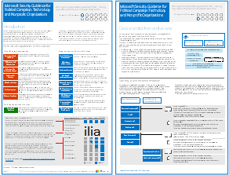
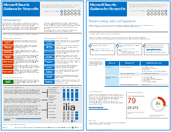

# Microsofts säkerhetsvägledning för politiska kampanjer, ideella föreningar och andra snabbrörliga organisationerMicrosoft Security Guidance for Political Campaigns, Nonprofits, and Other Agile Organizations

[!INCLUDE [Microsoft 365 Defender rebranding](../includes/microsoft-defender-for-office.md)]

**Gäller för****Applies to**
- [Exchange Online ProtectionExchange Online Protection](exchange-online-protection-overview.md)
- [Microsoft Defender för Office 365 Abonnemang 1 och Abonnemang 2Microsoft Defender for Office 365 plan 1 and plan 2](defender-for-office-365.md)

 **Sammanfattning:** Vägledning för planering och implementering för snabbrörliga organisationer som har en ökad hotprofil.**Summary:** Planning and implementation guidance for fast-moving organizations that have an increased threat profile.

Om din organisation är snabbrörlig, har en liten IT-grupp och din hotprofil är större än genomsnittet är den här vägledningen utformad för dig.If your organization is agile, you have a small IT team, and your threat profile is higher than average, this guidance is designed for you. I den här lösningen finns information om hur du snabbt skapar en miljö med viktiga molntjänster som innehåller säkra kontroller direkt från början.This solution demonstrates how to quickly build an environment with essential cloud services that include secure controls from the start. I den här vägledningen ingår säkerhetsrekommendationer för att skydda data, identiteter, e-post och åtkomst från mobila enheter.This guidance includes prescriptive security recommendations for protecting data, identities, email, and access from mobile devices.

## Vägledning för säkerhetslösningSecurity solution guidance

I den här vägledningen beskrivs hur du implementerar en säker molnmiljö.This guidance describes how to implement a secure cloud environment. Vägledningen för lösningen kan användas av alla organisationer.The solution guidance can be used by any organization. Den innehåller extra hjälp för snabbrörliga organisationer med BYOD-åtkomst och gästkonton.It includes extra help for agile organizations with BYOD access and guest accounts. Du kan använda den här vägledningen som en utgångspunkt för att utforma din egen miljö.You can use this guidance as a starting-point for designing your own environment. Ge oss gärna feedback på [CloudAdopt@microsoft.com](mailto:CloudAdopt@microsoft.com).We welcome your feedback at [CloudAdopt@microsoft.com](mailto:CloudAdopt@microsoft.com).

****

|ObjektItem|BeskrivningDescription|
|---|---|
|**Microsofts säkerhetsvägledning för politiska kampanjer****Microsoft Security Guidance for Political Campaigns**      [PDF](https://download.microsoft.com/download/B/4/D/B4D520C3-4D0C-4B4D-BFB9-09F0651C2775/MSFT_Cloud_architecture_security%20for%20political%20campaigns.pdf) \| [Visio](https://download.microsoft.com/download/B/4/D/B4D520C3-4D0C-4B4D-BFB9-09F0651C2775/MSFT_Cloud_architecture_security%20for%20political%20campaigns.vsdx)[PDF](https://download.microsoft.com/download/B/4/D/B4D520C3-4D0C-4B4D-BFB9-09F0651C2775/MSFT_Cloud_architecture_security%20for%20political%20campaigns.pdf) \| [Visio](https://download.microsoft.com/download/B/4/D/B4D520C3-4D0C-4B4D-BFB9-09F0651C2775/MSFT_Cloud_architecture_security%20for%20political%20campaigns.vsdx)|I den här vägledningen används en organisation med en politisk kampanj som exempel.This guidance uses a political campaign organization as an example. Använd den här vägledningen som en utgångspunkt för valfri miljö.Use this guidance as a starting point for any environment.|
|**Microsofts säkerhetsvägledning för ideella föreningar****Microsoft Security Guidance for Nonprofits**      [PDF](https://download.microsoft.com/download/9/4/3/94389612-C679-4061-8DF2-D9A15D72B65F/Microsoft_Cloud%20Architecture_Security%20for%20Nonprofits.pdf) \| [Visio](https://download.microsoft.com/download/9/4/3/94389612-C679-4061-8DF2-D9A15D72B65F/Microsoft_Cloud%20Architecture_Security%20for%20Nonprofits.vsdx)[PDF](https://download.microsoft.com/download/9/4/3/94389612-C679-4061-8DF2-D9A15D72B65F/Microsoft_Cloud%20Architecture_Security%20for%20Nonprofits.pdf) \| [Visio](https://download.microsoft.com/download/9/4/3/94389612-C679-4061-8DF2-D9A15D72B65F/Microsoft_Cloud%20Architecture_Security%20for%20Nonprofits.vsdx)|Den här guiden är något ändrad för ideella föreningar.This guide is slightly revised for nonprofit organizations. Till exempel hänvisas till Office 365-abonnemang för ideella föreningar.For example, it references Office 365 Nonprofit plans. Den tekniska vägledningen är densamma som lösningsguiden för en politisk kampanj.The technical guidance is the same as the political campaign solution guide.|
|

## TestlabbguiderTest Lab Guides

Använd följande testlabbguider för att skapa en utvecklings-/testmiljö för den här lösningen:To create a dev/test environment for this solution, use the following test lab guides:

- [Konfigurera grupper och användare i en utvecklings-/testmiljö för en politisk kampanjConfigure groups and users for a political campaign dev/test environment](configure-groups-and-users-for-a-political-campaign-dev-test-environment.md)

  Skapa utvärderingsprenumerationer för Office 365 och EMS och skapa sedan grupper och användare för en representativ politisk kampanj.Create trial subscriptions for Office 365 and EMS and then create groups and users for a representative political campaign.

- [Skapa gruppwebbplatser i en utvecklings-/testmiljö för en politisk kampanjCreate team sites in a political campaign dev/test environment](create-team-sites-in-a-political-campaign-dev-test-environment.md)

  Skapa fyra teamwebbplatser för SharePoint Online med säkerhetsnivåerna Intern, Privat, Känslig och Strikt konfidentiell.Create four SharePoint Online team sites with Internal, Private, Sensitive, and Highly Confidential levels of security.

Fler säkerhetsfunktioner för demonstration eller koncepttest finns i [Testlabbguider för Office 365](../../enterprise/cloud-adoption-test-lab-guides-tlgs.md).For additional security features for demonstration or proof of concept, see [Office 365 Test Lab Guides](../../enterprise/cloud-adoption-test-lab-guides-tlgs.md).

## Se ävenSee Also

[IT-arkitekturresurser för Microsoft CloudMicrosoft Cloud IT architecture resources](../../solutions/cloud-architecture-models.md)
