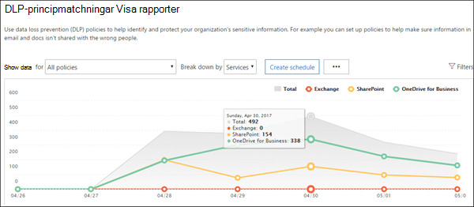

# Övervaka läckage av personliga dataMonitor for leaks of personal data

[!INCLUDE [Microsoft 365 Defender rebranding](../includes/microsoft-defender-for-office.md)]

Det finns många verktyg som kan användas för att övervaka användning och transport av personliga data.There are many tools that can be used to monitor the use and transport of personal data. I det här avsnittet beskrivs tre verktyg som fungerar bra.This topic describes three tools that work well.

På bilden:In the illustration:

- Börja med Microsoft 365-rapporter för dataförlustskydd för att övervaka personliga data i SharePoint Online, OneDrive för företag och e-post under överföring.Start with Microsoft 365 data loss prevention reports for monitoring personal data in SharePoint Online, OneDrive for Business, and email in transit. De ger den högsta detaljnivån för övervakning av personliga data.These provide the greatest level of detail for monitoring personal data. Rapporterna innefattar dock inte alla tjänster i Office 365.However, these reports don't include all services in Office 365.

- Använd sedan aviseringsprinciper och granskningsloggen för att övervaka aktiviteten i flera tjänster.Next, use alert policies and the audit log to monitor activity across services. Konfigurera löpande övervakning eller sök efter en händelse i granskningsloggen.Setup ongoing monitoring or search the audit log to investigate an incident. Granskningsloggen fungerar för alla tjänster – Sway, PowerBI, eDiscovery, Dynamics 365, Microsoft Flow, Microsoft Teams, administratörsaktivitet, OneDrive för företag, SharePoint Online, e-post under överföring och vilande inkorgar.The audit log works across services — Sway, PowerBI, eDiscovery, Dynamics 365, Microsoft Flow, Microsoft Teams, Admin activity, OneDrive for Business, SharePoint Online, mail in transit, and mailboxes at rest. Skype-konversationer ingår i vilande inkorgar.Skype conversations are included in mailboxes at rest.

- Till sist ska du använda Microsoft Cloud App Security för att övervaka filer med känsliga data hos andra SaaS-leverantörer.Finally, Use Microsoft Cloud App Security to monitor files with sensitive data in other SaaS providers. Inom kort blir det möjligt att använda känsliga informationstyper och enhetliga etiketter för Azure Information Protection och Office med Cloud App Security.Coming soon is the ability to use sensitive information types and unified labels across Azure Information Protection and Office with Cloud App Security. Du kan konfigurera principer som gäller för alla dina SaaS-appar eller vissa appar (som Box).You can setup policies that apply to all of your SaaS apps or specific apps (like Box). Cloud App Security identifierar inte filer i Exchange Online, till exempel bifogade filer i e-post.Cloud App Security doesn't discover files in Exchange Online, including files attached to email.

## Rapporter för dataförlustskyddData loss prevention reports

När du har skapat dina principer för dataförlustskydd (DLP) ska du kontrollera att de fungerar som de ska och hjälper dig att hålla dig uppdaterad.After you create your data loss prevention (DLP) policies, you'll want to verify that they're working as you intended and helping you to stay compliant. Med DLP-rapporterna i Office 365 kan du snabbt visa antalet DLP-principmatchningar, åsidosättningar eller falska positiva identifieringar, kontrollera om de ökar eller minskar med tiden, filtrera rapporten på olika sätt och visa ytterligare information genom att markera en punkt på en linje i diagrammet.With the DLP reports in Office 365, you can quickly view the number of DLP policy matches, overrides, or false positives; see whether they're trending up or down over time; filter the report in different ways; and view additional details by selecting a point on a line on the graph.

Du kan använda DLP-rapporterna för att:You can use the DLP reports to:

- Fokusera på vissa tidsperioder och förstå orsakerna till toppar och trender.Focus on specific time periods and understand the reasons for spikes and trends.

- Upptäck affärsprocesser som strider mot organisationens DLP-principer.Discover business processes that violate your organization's DLP policies.

- Förstå alla affärseffekter i DLP-principerna.Understand any business impact of the DLP policies.

- Visa de resultat som skickats av användare när de löser ett principtips genom att åsidosätta principen eller rapportera en falsk positiv identifiering.View the justifications submitted by users when they resolve a policy tip by overriding the policy or reporting a false positive.

- Kontrollera efterlevnaden med en särskild DLP-princip genom att visa de olika matchningarna för den principen.Verify compliance with a specific DLP policy by showing any matches for that policy.

- Visa en lista med filer med känsliga data som överensstämmer med dina DLP-principer i informationsfönstret.View a list of files with sensitive data that matches your DLP policies in the details pane.

Du kan också använda DLP-rapporterna för att finjustera dina DLP-principer när du kör dem i testläge.In addition, you can use the DLP reports to fine tune your DLP policies as you run them in test mode.

DLP-rapporter finns i säkerhetscenter och efterlevnadscenter.DLP reports are in the security center and the compliance center. Gå till Rapporter \> Visa rapporter.Navigate to Reports \> View reports. Under Dataförlustskydd (DLP) går du till antingen Matchning mot DLP-principer och regler eller Falskt positiva identifieringar och åsidosättningar för DLP.Under Data loss prevention (DLP), go to either DLP policy and rule matches or DLP false positives and overrides.

Mer information finns i [Visa rapporterna för dataförlustskydd](https://docs.microsoft.com/microsoft-365/compliance/view-the-dlp-reports).For more information, see [View the reports for data loss prevention](https://docs.microsoft.com/microsoft-365/compliance/view-the-dlp-reports).

## Principer för granskningslogg och aviseringaraudit log and alert policies

I granskningsloggen finns händelser från Exchange Online, SharePoint Online, OneDrive för företag, Azure Active Directory, Microsoft Teams, Power BI, Sway och andra tjänster.The audit log contains events from Exchange Online, SharePoint Online, OneDrive for Business, Azure Active Directory, Microsoft Teams, Power BI, Sway, and other services.

Säkerhetscenter och efterlevnadscenter tillhandahåller två olika sätt att övervaka och rapportera mot granskningsloggen:The security center and compliance center provide two ways to monitor and report against the audit log:

- Konfigurera aviseringsprinciper, visa aviseringar och följa trender – använd verktygen för aviseringsprinciper och avisering på instrumentpanelen i säkerhetscenter eller efterlevnadscenter.Setup alert policies, view alerts, and monitor trends — Use the alert policy and alert dashboard tools in either the security center or compliance center.

- Sök direkt i granskningsloggen – sök efter alla händelser i ett specifikt datumintervall.Search the audit log directly — Search for all events in a specified date rage. Du kan också filtrera resultatet utifrån vissa villkor, t. ex. användaren som utförde åtgärden, åtgärden eller målobjektet.Or you can filter the results based on specific criteria, such as the user who performed the action, the action, or the target object.

Informationssäkerhets- och regelefterlevnadsteam kan använda de här verktygen för att proaktivt granska aktiviteter som utförs av både slutanvändare och administratörer i olika tjänster.Information security and compliance teams can use these tools to proactively review activities performed by both end users and administrators across services. Automatiska aviseringar kan konfigureras för att skicka e-postmeddelanden när vissa aktiviteter förekommer på särskilda webbplatssamlingar, till exempel när innehåll delas från webbplatser som är kända för att innehålla GDPR-relaterad information.Automatic alerts can be configured to send email notifications when certain activities occur on specific site collections - for example when content is shared from sites known to contain GDPR related information. På så sätt kan teamen följa upp användare för att säkerställa att företagets säkerhetsprinciper följs eller för att erbjuda ytterligare utbildning.This allows those teams to follow up with users to ensure that corporate security policies are followed, or to provide additional training.

Team med ansvar för informationssäkerhet kan även söka i granskningsloggen för att undersöka misstänkta dataöverträdelser och fastställa både överträdelsens grundorsak och omfattning.Information security teams can also search the audit log to investigate suspected data breaches and determine both root cause and the extent of the breach. Denna inbyggda funktion underlättar efterlevnaden av artikel 33 och 34 i GDPR, som kräver att anmälningar lämnas in till GDPR-tillsynsmyndigheterna och till de registrerade själva vid en dataöverträdelse under en viss tidsperiod.This built in capability facilitates compliance with article 33 and 34 of the GDPR, which require notifications be provided to the GDPR supervisory authority and to the data subjects themselves of a data breach within a specific time period. Poster i granskningsloggen sparas bara i 90 dagar i tjänsten, men det rekommenderas ofta (och många organisationer har krävt) att loggarna sparas under längre tidsperioder.Audit log entries are only retained for 90 days within the service - it is often recommended and many organizations required that these logs be retained for longer periods of time.

Det finns lösningar som du kan använda för att prenumerera på enhetliga granskningsloggar via API för Microsoft Management Activity och som kan lagra loggposter efter behov och tillhandahålla avancerade instrumentpaneler och aviseringar.Solutions are available which subscribe to the Unified Audit Logs through the Microsoft Management Activity API and can both store log entries as needed, and provide advanced dashboards and alerts. Ett exempel är [Microsoft Operations Management Suite (OMS)](https://docs.microsoft.com/azure/operations-management-suite/oms-solution-office-365).One example is [Microsoft Operations Management Suite (OMS)](https://docs.microsoft.com/azure/operations-management-suite/oms-solution-office-365).

Mer information om aviseringsprinciper och sökning i granskningsloggen:More information about alert policies and searching the audit log:

- [Aviseringsprinciper i säkerhets- och efterlevnadscenter för Microsoft 365Alert policies in the Microsoft 365 security and compliance centers](https://docs.microsoft.com/microsoft-365/compliance/alert-policies)

- [Söka i granskningsloggen efter användar- och administratörsaktivitet i Office 365](https://docs.microsoft.com/microsoft-365/compliance/search-the-audit-log) (introduktion)[Search the audit log for user and admin activity in Office 365](https://docs.microsoft.com/microsoft-365/compliance/search-the-audit-log) (introduction)

- [Aktivera och inaktivera granskningsloggsökningTurn audit log search on or off](https://docs.microsoft.com/microsoft-365/compliance/turn-audit-log-search-on-or-off)

- [Söka i granskningsloggenSearch the audit log](https://docs.microsoft.com/microsoft-365/compliance/search-the-audit-log-in-security-and-compliance)

- [Search-UnifiedAuditLog](https://docs.microsoft.com/powershell/module/exchange/search-unifiedauditlog) (cmdlet)[Search-UnifiedAuditLog](https://docs.microsoft.com/powershell/module/exchange/search-unifiedauditlog) (cmdlet)

- [Detaljerade egenskaper i granskningsloggenDetailed properties in the audit log](https://docs.microsoft.com/microsoft-365/compliance/detailed-properties-in-the-office-365-audit-log)

## Microsoft Cloud App SecurityMicrosoft Cloud App Security

Med Microsoft Cloud App Security får du hjälp att upptäcka andra SaaS-appar som används i dina nätverk och känsliga data som skickas till och från dessa appar.Microsoft Cloud App Security helps you discover other SaaS apps in use across your networks and sensitive data that is sent to and from these apps.

Microsoft Cloud App Security är en omfattande tjänst som ger dig djup insyn, detaljerad kontroll och förbättrat skydd mot hot för dina molnbaserade appar.Microsoft Cloud App Security is a comprehensive service providing deep visibility, granular controls and enhanced threat protection for your cloud apps. Den identifierar fler än 15 000 molnprogram i nätverket – från alla enheter – och presenterar riskpoäng samt fortlöpande riskbedömning och -analys.It identifies more than 15,000 cloud applications in your network-from all devices-and provides risk scoring and ongoing risk assessment and analytics. Inga agenter krävs: informationen samlas in från dina brandväggar och proxyservrar för att ge dig fullständig insyn och sammanhang för molnanvändning och skugg-IT.No agents required: information is collected from your firewalls and proxies to give you complete visibility and context for cloud usage and shadow IT.

För att få en bättre förståelse för molnmiljön ger undersökningsfunktionen i Cloud App Security djup insyn i alla aktiviteter, filer och konton för sanktionerade och hanterade appar.To better understand your cloud environment, Cloud App Security investigate feature provides deep visibility into all activities, files and accounts for sanctioned and managed apps. Du kan få detaljerad information om en filnivå och identifiera varifrån data överförs i molnprogrammen.You can gain detailed information on a file level and discover where data travels in the cloud apps.

Som exempel visar följande bild två Cloud App Security-principer som kan hjälpa dig med GDPR.For examples, the following illustration demonstrates two Cloud App Security policies that can help with GDPR.

Den första principen varnar när filer med ett fördefinierat PII-attribut eller ett anpassat uttryck som du väljer delas utanför organisationen från de SaaS-appar som du väljer.The first policy alerts when files with a predefined PII attribute or custom expression that you choose is shared outside the organization from the SaaS apps that you choose.

Den andra principen blockerar nedladdning av filer till en ohanterad enhet.The second policy blocks downloads of files to any unmanaged device. Du väljer vilka attribut i filerna du vill söka efter och vilka SaaS-appar du vill att principen ska gälla för.You choose the attributes within the files to look for and the SaaS apps you want the policy to apply to.

Dessa attributtyper kommer snart att ingå i Cloud App Security:These attribute types are coming soon to Cloud App Security:

- Typer av känslig informationSensitive information types

- Enhetliga etiketter i Microsoft 365 och Azure Information ProtectionUnified labels across Microsoft 365 and Azure Information Protection

### Instrumentpanelen i Cloud App SecurityCloud App Security dashboard

Börja med att starta Cloud App Security om du inte redan har börjat använda det.If you haven't yet started to use Cloud App Security, begin by starting it up. Så här får du tillgång till Cloud App Security: <https://portal.cloudappsecurity.com>.To access Cloud App Security: <https://portal.cloudappsecurity.com>.

OBS! Kom ihåg att aktivera automatiskt genomsökning av filnamn för Azure Information Protection-klassificeringsetiketter (i Allmänna inställningar) när du ska komma igång med Cloud App Security eller innan du tilldelar etiketter.Note: Be sure to enable 'Automatically scan files for Azure Information Protection classification labels' (in General settings) when getting started with Cloud App Security or before you assign labels. När du har gjort det genomsöker inte Cloud App Security befintliga filer igen förrän de ändras.After setup, Cloud App Security does not scan existing files again until they are modified.

Mer information:More information:

- [Distribuera Cloud App SecurityDeploy Cloud App Security](https://docs.microsoft.com/cloud-app-security/getting-started-with-cloud-app-security)

- [Mer information om Microsoft Cloud App SecurityMore information about Microsoft Cloud App Security](https://www.microsoft.com/cloud-platform/cloud-app-security)

- [Blockera nedladdning av känslig information med Microsoft Cloud App Security-proxynBlock downloads of sensitive information using the Microsoft Cloud App Security proxy](https://docs.microsoft.com/cloud-app-security/use-case-proxy-block-session-aad)

## Exempel på fil- och aktivitetsprinciper som identifierar delning av personliga dataExample file and activity policies to detect sharing of personal data

### Identifiera delning av filer som innehåller PII – kreditkortsnummerDetect sharing of files containing PII — Credit card number

Avisera när en fil som innehåller ett kreditkortsnummer delas från en godkänd molnapp.Alert when a file containing a credit card number is shared from an approved cloud app.

<table>
<thead>
<tr class="header">
<th align="left"><strong>Kontroll</strong><strong>Control</strong></th>
<th align="left"><strong>Inställningar</strong><strong>Settings</strong></th>
</tr>
</thead>
<tbody>
<tr class="odd">
<td align="left">Typ av principPolicy type</td>
<td align="left">FilprincipFile policy</td>
</tr>
<tr class="even">
<td align="left">PrincipmallPolicy template</td>
<td align="left">Ingen mallNo template</td>
</tr>
<tr class="odd">
<td align="left">Allvarlighetsgrad för principPolicy severity</td>
<td align="left">HögstaHigh</td>
</tr>
<tr class="even">
<td align="left">KategoriCategory</td>
<td align="left">DLPDLP</td>
</tr>
<tr class="odd">
<td align="left">FilterinställningarFilter settings</td>
<td align="left">
Åtkomstnivå = offentlig (Internet), offentlig, externAccess level = Public (Internet), Public, External

App = &lt;välj appar&gt; (använd den här inställningen om du vill begränsa övervakning till vissa SaaS-appar)App = &lt;select apps&gt; (use this setting if you want to limit monitoring to specific SaaS apps)
</td>
</tr>
<tr class="even">
<td align="left">Använd förApply to</td>
<td align="left">Alla filer, alla ägareAll files, all owners</td>
</tr>
<tr class="odd">
<td align="left">InnehållsgranskningContent inspection</td>
<td align="left">
Innefattar filer som matchar ett befintligt uttryck: Alla länder: Ekonomi: KreditkortsnummerIncludes files that match a present expression: All countries: Finance: Credit card number

Kräv inte relevant kontext: avmarkerat (matchar nyckelord och regex)Don't require relevant context: unchecked (this will match keywords as well as regex)

Innefattar filer med minst 1 matchningIncludes files with at least 1 match

Ta bort mask för de fyra sista tecknen i överträdelsen: markeratUnmask the last 4 characters of the violation: checked
</td>
</tr>
<tr class="even">
<td align="left">VarningarAlerts</td>
<td align="left">
Skapa en avisering för varje matchande fil: markeratCreate an alert for each matching file: checked

Daglig aviseringsgräns: 1 000Daily alert limit: 1000

Välj en avisering som e-post: markeratSelect an alert as email: checked

Till: infosec@contoso.comTo: infosec@contoso.com
</td>
</tr>
<tr class="odd">
<td align="left">StyrningGovernance</td>
<td align="left">
Microsoft OneDrive för företagMicrosoft OneDrive for Business

Gör privat: markera Ta bort externa användareMake private: check Remove External Users

Alla andra inställningar: avmarkeradeAll other settings: unchecked

Microsoft SharePoint OnlineMicrosoft SharePoint Online

Gör privat: markera Ta bort externa användareMake private: check Remove External Users

Alla andra inställningar: avmarkeradeAll other settings: unchecked
</td>
</tr>
</tbody>
</table>

Liknande principer:Similar policies:

- Identifiera delning av filer som innehåller PII – e-postadressDetect sharing of Files containing PII - Email Address

- Identifiera delning av filer som innehåller PII – passnummerDetect sharing of Files containing PII - Passport Number

### Identifiera kund- eller HR-data i Box eller OneDrive för företagDetect Customer or HR Data in Box or OneDrive for Business

Avisera när en fil som är markerad som kunddata eller HR-information överförs till OneDrive för företag eller Box.Alert when a file labeled as Customer Data or HR Data is uploaded to OneDrive for Business or Box.

Kommentarer:Notes:

- Box-övervakning kräver att en anslutning konfigureras med hjälp av API-anslutaren SDK.Box monitoring requires a connector be configured using the API Connector SDK.

- Principen kräver funktioner som för närvarande är i privat förhandsversion.This policy requires capabilities that are currently in private preview.

<table>
<thead>
<tr class="header">
<th align="left"><strong>Kontroll</strong><strong>Control</strong></th>
<th align="left"><strong>Inställningar</strong><strong>Settings</strong></th>
</tr>
</thead>
<tbody>
<tr class="odd">
<td align="left">Typ av principPolicy type</td>
<td align="left">AktivitetspolicyActivity policy</td>
</tr>
<tr class="even">
<td align="left">PrincipmallPolicy template</td>
<td align="left">Ingen mallNo template</td>
</tr>
<tr class="odd">
<td align="left">Allvarlighetsgrad för principPolicy severity</td>
<td align="left">HögstaHigh</td>
</tr>
<tr class="even">
<td align="left">KategoriCategory</td>
<td align="left">DelningskontrollSharing Control</td>
</tr>
<tr class="odd">
<td align="left">Agera påAct on</td>
<td align="left">Enskild aktivitetSingle activity</td>
</tr>
<tr class="even">
<td align="left">FilterinställningarFilter settings</td>
<td align="left">
Aktivitetstyp = överföra filActivity type = Upload File

App = Microsoft OneDrive för företag och BoxApp = Microsoft OneDrive for Business and Box

Klassificeringsetikett (för närvarande i privat förhandsversion): Azure Information Protection = kunddata, personal – löneuppgifter, personal – information om anställdaClassification Label (currently in private preview): Azure Information Protection = Customer Data, Human Resources—Salary Data, Human Resources—Employee Data
</td>
</tr>
<tr class="odd">
<td align="left">VarningarAlerts</td>
<td align="left">
Skapa en avisering: markeradCreate an alert: checked

Daglig aviseringsgräns: 1 000Daily alert limit: 1000

Välj en avisering som e-post: markeratSelect an alert as email: checked

Till: infosec@contoso.comTo: infosec@contoso.com
</td>
</tr>
<tr class="even">
<td align="left">StyrningGovernance</td>
<td align="left">
Alla apparAll apps

Placera användare i karantän: markeradPut user in quarantine: check

Alla andra inställningar: avmarkeradeAll other settings: unchecked

Office 365Office 365

Placera användare i karantän: markeradPut user in quarantine: check

Alla andra inställningar: avmarkeradeAll other settings: unchecked
</td>
</tr>
</tbody>
</table>

Liknande principer:Similar policies:

- Identifiera stora nedladdningar med kunddata eller HR-data – avisera när ett stort antal filer som innehåller kunddata eller HR-data har laddats ned av en enskild användare under en begränsad tidsperiod.Detect large downloads of Customer data or HR Data — Alert when a large number of files containing customer data or HR data have been detected being downloaded by a single user within a short period of time.

- Identifiera delning av kunddata och HR-data – avisera när filer som innehåller kund- eller HR-data delas.Detect Sharing of Customer and HR Data — Alert when files containing Customer or HR Data are shared.
