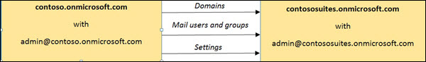

# <a name="move-domains-and-settings-from-one-eop-organization-to-another"></a>Flytta domäner och inställningar från en EOP-organisation till en annan

[!INCLUDE [Microsoft 365 Defender rebranding](../includes/microsoft-defender-for-office.md)]


Du kan ibland behöva dela en Microsoft Exchange Online Protection-organisation (EOP) i två separata organisationer, slå samman två organisationer till en eller flytta domän-och EOP-inställningar från en organisation till en annan organisation. Att förflytta dig från en EOP-organisation till en andra EOP-organisation kan vara utmanande, men med ett fåtal grundläggande Windows PowerShell-skript och en liten mängd förberedelse kan detta uppnås med ett relativt litet underhålls fönster.

> [!NOTE]
>
> - Inställningarna kan endast göras tillförlitliga från en EOP fristående (standard) organisation till en annan EOP-standard eller en Exchange Enterprise-CAL med Service (EOP Premium)-organisation eller från en EOP Premium-organisation till en annan EOP Premium-organisation. Eftersom det inte går att använda vissa Premium-funktioner i EOP standard organisationer, flyttas från en EOP Premium-organisation till en EOP-standard organisation.
>
> - De här instruktionerna gäller för EOP-specifika organisationer. Det finns andra saker du bör tänka på när du flyttar från en Exchange Online-organisation till en annan Exchange Online-organisation. Exchange Online-organisationer saknar omfattning för dessa instruktioner.

I följande exempel har contoso, Ltd. slagit samman med contoso-serier. Följande bild visar processen för att flytta domäner, e-postanvändare och grupper och inställningar från source EOP-organisationen (contoso.onmicrosoft.com) till mål EOP organisationen (contososuites.onmicrosoft.com):



Utmaningen med att flytta domäner från en organisation till en annan är att en verifierad domän inte kan finnas i två organisationer samtidigt. Följ de här anvisningarna för att arbeta mer.

## <a name="step-1-collect-data-from-the-source-organization"></a>Steg 1: samla in data från käll organisationen

För att kunna återskapa käll organisationen i mål organisationen ska du se till att du samlar in och lagrar följande information om käll organisationen:

- Domäner
- E-postanvändare
- Grupper
- Skydd mot skräp post
  - Principer för skräp post (kallas även för principer för innehålls filter)
  - Utgående filter principer för skräp post
  - Principer för anslutnings filter
- Principer mot skadlig program vara
- Koppling
- Regler för e-postflöde (kallas även transport regler)

  > [!NOTE]
  > Cmdlet-stöd för att kunna exportera och importera regel samlingen för e-postflöde stöds för närvarande endast för EOP Premium-abonnemang.

Det enklaste sättet att samla in alla dina inställningar är att använda PowerShell. Information om hur du ansluter till fristående EOP PowerShell finns i [Anslut till Exchange Online Protection PowerShell](https://docs.microsoft.com/powershell/exchange/connect-to-exchange-online-protection-powershell).

Sedan kan du samla in alla dina inställningar och exportera dem till en XML-fil som ska importeras till mål klient organisationen. I allmänhet kan du gå till utdata från cmdleten **Get** för varje inställning till cmdleten **export-CliXml** för att spara inställningarna i XML-filer, enligt följande kod exempel.

I fristående EOP PowerShell skapar du en katalog som heter exportera på en plats som är lätt att hitta och ändra till den katalogen. Till exempel:

```PowerShell
mkdir C:\EOP\Export
```

```PowerShell
cd C:\EOP\Export
```

Följande skript kan användas för att samla alla e-postanvändare, grupper, inställningar för skräp post, inställningar för skadlig program vara, kopplingar och regler för e-postflöden i käll organisationen. Kopiera och klistra in följande text i en text redigerare, till exempel anteckningar, och spara filen som Source_EOP_Settings.ps1 i export katalogen du just skapade och kör följande kommando:

```PowerShell
& "C:\EOP\Export\Source_EOP_Settings.ps1"
```

```PowerShell
#****************************************************************************
# Export Domains
#*****************************************************************************
Get-AcceptedDomain | Export-Clixml Domains.xml
#****************************************************************************
# Export mail users
#
#****************************************************************************
Get-Recipient -ResultSize unlimited -RecipientTypeDetails MailUser | Export-Clixml MailUsers.xml
#****************************************************************************
# Groups
#
# If you're using directory synchronization, you can skip this step and
# simply sync to the target
# tenant.
# First, you need to capture information about the distribution groups.
#****************************************************************************
Get-Recipient -ResultSize unlimited -RecipientTypeDetails MailUniversalDistributionGroup | Export-Clixml DistributionGroups.xml
Get-Recipient -ResultSize unlimited -RecipientTypeDetails MailUniversalSecurityGroup | Export-Clixml SecurityGroups.xml
#****************************************************************************
# And then we'll use that output to loop through each group and get the
# members.
#****************************************************************************
$DGs = Import-Clixml .\DistributionGroups.xml
ForEach ($dg in $DGs) {Get-DistributionGroupMember -Identity $dg.name | Export-Clixml $dg.ExternalDirectoryObjectId}
$SGs = Import-Clixml .\SecurityGroups.xml
ForEach ($sg in $SGs) {Get-DistributionGroupMember -Identity $sg.name | Export-Clixml $sg.ExternalDirectoryObjectId}
#*****************************************************************************
# Export dynamic distribution groups - EOP Premium Only
#
# If you're using directory synchronization, then you can skip this step and simply
# sync to the target tenant.
#*****************************************************************************
Get-DynamicDistributionGroup -ResultSize unlimited | Export-Clixml DynamicDistributionGroups.xml
#*****************************************************************************
# Export mail contacts - EOP Premium Only
#
# If you're using directory synchronization, then you can skip this step and simply
# sync to the target tenant.
#*****************************************************************************
Get-MailContact -ResultSize unlimited -RecipientTypeDetails MailContact | Export-Clixml MailContacts.xml
#****************************************************************************
# Anti-spam
#****************************************************************************
Get-HostedConnectionFilterPolicy | Export-Clixml HostedConnectionFilterPolicy.xml
Get-HostedContentFilterPolicy | Export-Clixml HostedContentFilterPolicy.xml
Get-HostedContentFilterRule | Export-Clixml HostedContentFilterRule.xml
Get-HostedOutboundSpamFilterPolicy | Export-Clixml HostedOutboundSpamFilterPolicy.xml
#****************************************************************************
# Anti-malware policies
#****************************************************************************
Get-MalwareFilterPolicy | Export-Clixml MalwareFilterPolicy.xml
Get-MalwareFilterRule | Export-Clixml MalwareFilterRule.xml
#****************************************************************************
# Connectors
#****************************************************************************
Get-InboundConnector | Export-Clixml InboundConnector.xml
Get-OutboundConnector | Export-Clixml OutboundConnector.xml
#****************************************************************************
# Exchange mail flow rules
#****************************************************************************
$file = Export-TransportRuleCollection
Set-Content -Path ".TransportRules.xml" -Value $file.FileData -Encoding Byte
```

Kör följande kommandon från export katalogen för att uppdatera XML-filerna med mål organisationen. Ersätt contoso.onmicrosoft.com och contososuites.onmicrosoft.com med företagets namn.

```PowerShell
$files = ls
ForEach ($file in $files) { (Get-Content $file.Name) | Foreach-Object {$_ -replace 'contoso.onmicrosoft.com', 'contososuites.onmicrosoft.com'} | Set-Content $file.Name}
```

## <a name="step-2-add-domains-to-the-target-organization"></a>Steg 2: lägga till domäner i mål organisationen

Lägg till domäner i mål organisationen med hjälp av följande skript. Kopiera och klistra in texten i en text redigerare som anteckningar, Spara skriptet som C:\EOP\Export\Add_Domains.ps1 och kör följande kommando:

```PowerShell
& "C:\EOP\Export\Add_Domains.ps1"
```

De här domänerna verifieras inte och kan inte användas för att dirigera e-post, men när domäner har lagts till kan du samla in information som behövs för att verifiera domänerna och slutligen uppdatera dina MX-poster för den nya innehavaren.

```PowerShell
#***********************************************************************
# Login to Azure Active Directory
#*****************************************************************************
$msolcred = Get-Credential
connect-msolservice -credential $msolcred
#****************************************************************************
# Add domains
#****************************************************************************
$Domains = Import-Clixml ".\Domains.xml"
Foreach ($domain in $Domains) {
    New-MsolDomain -Name $domain.Name
}
```

Nu kan du granska och samla in informationen från administrations centret för Microsoft 365 i din mål organisation så att du snabbt kan verifiera dina domäner när tiden blir:

1. Logga in på administrations centret för Microsoft 365 på <https://portal.office.com> .

2. Klicka på **domäner**.

   Om du inte ser domäner klickar du på **Anpassa navigering**, väljer **Konfigurera** och klickar sedan på **Spara**.

3. Klicka på länken **Start setup** och fortsätt sedan med installations guiden.

4. Välj **allmänna instruktioner** för att **Visa stegvisa instruktioner för hur du utför det här steget** på sidan **bekräfta ägande** .

5. Spela in MX-posten eller TXT-posten som du ska använda för att verifiera din domän och slutför installations guiden.

6. Lägg till verifierings-TXT-posterna i dina DNS-poster. Då får du mer information om hur du snabbt kontrollerar domänerna i käll organisationen när de har tagits bort från mål organisationen. Mer information om hur du konfigurerar DNS finns i [Skapa DNS-poster hos en DNS-värd för Microsoft 365](https://docs.microsoft.com/microsoft-365/admin/get-help-with-domains/create-dns-records-at-any-dns-hosting-provider).

## <a name="step-3-force-senders-to-queue-mail"></a>Steg 3: tvinga avsändare att köa e-post

När du flyttar domäner från en klient organisation till en annan måste du ta bort domänerna från käll organisationen och sedan verifiera dem i din mål organisation. Under tiden kan du inte dirigera e-post till EOP.

Ett alternativ till att tvinga avsändare att köa e-post är att uppdatera MX-posterna så att de pekar direkt till den lokala e-postservern.

Ett annat alternativ är att lägga till en ogiltig MX-post i varje domän där DNS-posterna för din domän bevaras (kallas även din DNS-värd). Detta kommer att orsaka att avsändaren köas din e-post och försöker igen (vanliga försök är för 48 timmar men detta kan variera från leverantör till leverantör). Du kan använda invalid.outlook.com som ett ogiltigt MX-mål. Om du sänker TTL-värdet (Time to Live) till fem minuter i MX-posten kan ändringen spridas till DNS-leverantörer snabbare.

Mer information om hur du konfigurerar DNS finns i [Skapa DNS-poster hos en DNS-värd för Microsoft 365](https://docs.microsoft.com/microsoft-365/admin/get-help-with-domains/create-dns-records-at-any-dns-hosting-provider).

> [!IMPORTANT]
> Olika providrar i kö för olika tids perioder. Du måste konfigurera din nya klient organisation snabbt och återställa dina DNS-inställningar för att undvika att rapporter om utebliven leverans (NDR) skickas till avsändaren om tiden för kön upphör.

## <a name="step-4-remove-users-groups-and-domains-from-the-source-organization"></a>Steg 4: ta bort användare, grupper och domäner från käll organisationen

Följande skript tar bort användare, grupper och domäner från käll klient organisationen med Azure Active Directory PowerShell. Kopiera och klistra in följande text i en text redigerare som anteckningar, spara filen som C:\EOP\Export\Remove_Users_and_Groups.ps1 och kör följande kommando:

```PowerShell
& "C:\EOP\Export\Remove_Users_and_Groups.ps1"
```

```PowerShell
#*****************************************************************************
# Login to Azure Active Directory
#*****************************************************************************
$msolcred= Get-Credential
connect-msolservice -credential $msolcred
#*****************************************************************************
# Remove users
#*****************************************************************************
$Users = Get-MSOLUser -All | sort UserPrincipalName
$user_count = $Users.count
write-host "Removing $user_count users."
Foreach ($User in $Users) {
write-host $User.UserPrincipalName
$User | Remove-MSOLUser -Force
}
#*****************************************************************************
# Remove groups
#*****************************************************************************
Get-MSOLGroup | Remove-MSOLGroup -Force
#*****************************************************************************
# Remove domains
# Note: Your onmicrosoft.com domain should be the default domain
#*****************************************************************************
$Domains = Get-MsolDomain
$Domain_count = $Domains.count
write-host "Removing $Domain_count domains."
Foreach ($Domain in $Domains) {
write-host $Domain.Name
Remove-MsolDomain -DomainName $Domain.Name -Force
}
```

## <a name="step-5-verify-domains-for-the-target-organization"></a>Steg 5: verifiera domänerna för mål organisationen

1. Logga in på administrations centret på <https://portal.office.com> .

2. Klicka på **domäner**.

3. Klicka på **Start installations** länken för mål domänen och fortsätt med installations guiden.

## <a name="step-6-add-mail-users-and-groups-to-the-target-organization"></a>Steg 6: lägga till e-postanvändare och grupper i mål organisationen

Metod tips för EOP är att använda Azure Active Directory för att synkronisera din lokala Active Directory med din mål klient organisation. Mer information om hur du gör detta finns i "använda katalog synkronisering för att hantera e-postanvändare" i [Hantera e-postanvändare i EOP](manage-mail-users-in-eop.md). Du kan också använda följande skript för att återskapa användarna och grupperna från din käll klient organisation. Obs! användar lösen ord kan inte flyttas. Nya lösen ord skapas och sparas i filen med namnet UsersAndGroups.ps1.

Om du vill använda skriptet kopierar och klistrar du in följande text i en text redigerare som anteckningar, sparar filen som C:\EOP\Export\Add_Users_and_Groups.ps1 och kör följande kommando:

```PowerShell
& "C:\EOP\Export\Add_Users_and_Groups.ps1"
```

```PowerShell
#***********************************************************************
# makeparam helper function
#****************************************************************************
function makeparam ([string]$ParamName, [string[]] $ParamValue) {
    $FormattedParam = ""
    If($ParamValue.Count -gt 0) {
        $FormattedParam = " -$ParamName "
        Foreach ($value in $ParamValue) {
        If($value -eq "True") {$FormattedParam = " -$ParamName" + ":`$True,"}
        else{
            If($value -eq "False") {$FormattedParam = " -$ParamName" + ":`$False,"}
                else{$FormattedParam += "`"$value`","}
            }
        }
        $FormattedParam = $FormattedParam.TrimEnd(",")
    }
    Return $FormattedParam
 }
#****************************************************************************
# Variables
#****************************************************************************
$outfile = ".\UsersAndGroups.ps1"
rm -erroraction 'silentlycontinue' $outfile
#****************************************************************************
# Add mail users
#****************************************************************************
$rand = New-Object System.Random -ArgumentList (get-date).millisecond
$MailUsers = Import-Clixml ".\MailUsers.xml"
$MailUsersCount = $MailUsers.Name.Count
if($MailUsersCount -gt 0){
    Write-Host "Importing $MailUsersCount Mail Users"
    ForEach ($MailUser in $MailUsers) {
        $MailUsersCmdlet = "New-MailUser"
        If((Get-PSSession).ComputerName.Contains("ps.protection")) {
            $DistributionGroupsCmdlet = "New-EOPMailUser"
        }
        $MailUsersCmdlet += makeparam "LastName" $MailUser.LastName
        $MailUsersCmdlet += makeparam "FirstName" $MailUser.FirstName
        $MailUsersCmdlet += makeparam "DisplayName" $MailUser.DisplayName
        $MailUsersCmdlet += makeparam "Name" $MailUser.Name
        $MailUsersCmdlet += makeparam "Alias" $MailUser.Alias
        $MailUsersCmdlet += makeparam "MicrosoftOnlineServicesID" $MailUser.MicrosoftOnlineServicesID
        $MailUsersCmdlet += makeparam "ExternalEmailAddress" $MailUser.ExternalEmailAddress

        # Generate a new 10 character password
        $NewPassword = ""
        1..10 | ForEach { $NewPassword = $NewPassword + [char]$rand.next(40,127) }

        $MailUsersCmdlet += " -Password (ConvertTo-SecureString -String '$NewPassword' -AsPlainText -Force)"
        Add-Content $outfile "`n$MailUsersCmdlet"
    }
}
#****************************************************************************
# Add distribution groups
#****************************************************************************
$DistributionGroups = Import-Clixml ".\DistributionGroups.xml"
$DistributionGroupsCount = $DistributionGroups.Name.Count
if($DistributionGroupsCount -gt 0){
    Write-Host "Importing $DistributionGroupsCount Distribution Groups"
    ForEach ($DistributionGroup in $DistributionGroups) {
        $DistributionGroupsCmdlet = "New-DistributionGroup"
        If((Get-PSSession).ComputerName.Contains("ps.protection")) {
            $DistributionGroupsCmdlet = "New-EOPDistributionGroup"
        }
        $DistributionGroupsCmdlet += makeparam "Name" $DistributionGroup.Name
        $DistributionGroupsCmdlet += makeparam "Alias" $DistributionGroup.Alias
        $DistributionGroupsCmdlet += makeparam "DisplayName" $DistributionGroup.DisplayName
        $DistributionGroupsCmdlet += makeparam "ManagedBy" $DistributionGroup.ManagedBy

        $DistributionGroupsCmdlet += makeparam "Notes" $DistributionGroup.Notes
        $DistributionGroupsCmdlet += makeparam "PrimarySmtpAddress" $DistributionGroup.PrimarySmtpAddress
        $DistributionGroupsCmdlet += makeparam "Type" $DistributionGroup.Type
        $MembersCmdlet = "@("
        $memberslist = Import-Clixml $DistributionGroup.ExternalDirectoryObjectId
        ForEach ($user in $memberslist) {
            $MembersCmdlet += "`"$user.Name`","
        }
        $MembersCmdlet = $MembersCmdlet.TrimEnd(",")
        $MembersCmdlet += ")"
    }
    Add-Content $outfile "`n$DistributionGroupsCmdlet"
}
#****************************************************************************
# Add security groups
#****************************************************************************
$SecurityGroups = Import-Clixml ".\SecurityGroups.xml"
$SecurityGroupsCount = $SecurityGroups.Name.Count
if($SecurityGroupsCount -gt 0){
    Write-Host "Importing $SecurityGroupsCount Security Groups"
    ForEach ($SecurityGroup in $SecurityGroups) {
        $SecurityGroupsCmdlet = "New-SecurityGroup"
        If((Get-PSSession).ComputerName.Contains("ps.protection")) {
            $DistributionGroupsCmdlet = "New-EOPSecurityGroup"
        }
        $SecurityGroupsCmdlet += makeparam "Name" $SecurityGroup.Name
        $SecurityGroupsCmdlet += makeparam "Alias" $SecurityGroup.Alias
        $SecurityGroupsCmdlet += makeparam "DisplayName" $SecurityGroup.DisplayName
        $SecurityGroupsCmdlet += makeparam "ManagedBy" $SecurityGroup.ManagedBy

        $SecurityGroupsCmdlet += makeparam "Notes" $SecurityGroup.Notes
        $SecurityGroupsCmdlet += makeparam "PrimarySmtpAddress" $SecurityGroup.PrimarySmtpAddress
        $SecurityGroupsCmdlet += makeparam "Type" $SecurityGroup.Type
        $MembersCmdlet = "@("
        $memberslist = Import-Clixml $SecurityGroup.ExternalDirectoryObjectId
        ForEach ($user in $memberslist) {
            $MembersCmdlet += "`"$user.Name`","
        }
        $MembersCmdlet = $MembersCmdlet.TrimEnd(",")
        $MembersCmdlet += ")"
    }
    Add-Content $outfile "`n$SecurityGroupsCmdlet"
}
#****************************************************************************
# Add Dynamic Distribution Groups
#****************************************************************************
If((Get-PSSession).ComputerName.Contains("ps.protection")) {
    write-Host "No Synamic Distribution Groups for EOP Standard organizations."
}else{
    $DynamicDistributionGroups = Import-Clixml ".\DynamicDistributionGroups.xml"
    $DynamicDistributionGroupsCount = $DynamicDistributionGroups.Name.Count
    if($DynamicDistributionGroupsCount -gt 0){
        Write-Host "Importing $DynamicDistributionGroupsCount Dynamic Distribution Groups"
        foreach ($DynamicDistributionGroup in $DynamicDistributionGroups) {
            $DynamicDistributionGroupsCmdlet = "New-DynamicDistributionGroup"
            $DynamicDistributionGroupsCmdlet += " -Confirm:`$False"
            $DynamicDistributionGroupsCmdlet += makeparam "DisplayName" $DynamicDistributionGroup.DisplayName
            $DynamicDistributionGroupsCmdlet += makeparam "ModeratedBy" $DynamicDistributionGroup.ModeratedBy
            $DynamicDistributionGroupsCmdlet += makeparam "ModerationEnabled" $DynamicDistributionGroup.ModerationEnabled
            $DynamicDistributionGroupsCmdlet += makeparam "Name" $DynamicDistributionGroup.Name
            $DynamicDistributionGroupsCmdlet += makeparam "PrimarySmtpAddress" $DynamicDistributionGroup.PrimarySmtpAddress
            $DynamicDistributionGroupsCmdlet += makeparam "RecipientContainer" $DynamicDistributionGroup.RecipientContainer
            $RecipientFilterParam =  makeparam "RecipientFilter" $DynamicDistributionGroup.RecipientFilter
            $RecipientFilterParam = " -RecipientFilter {" + $RecipientFilterParam.Substring(19)
            $RecipientFilterParam = $RecipientFilterParam.Substring(0,$RecipientFilterParam.Length-1)
            $RecipientFilterParam += "}"
            $DynamicDistributionGroupsCmdlet +=  $RecipientFilterParam
            $DynamicDistributionGroupsCmdlet += makeparam "SendModerationNotifications" $DynamicDistributionGroup.SendModerationNotifications
            Add-Content $outfile "`n$DynamicDistributionGroupsCmdlet"
        }

    }else{
        Write-Host "No Dynamic Distribution Groups to add."
    }
}
#****************************************************************************
# Add Mail Contacts
#****************************************************************************
If((Get-PSSession).ComputerName.Contains("ps.protection")) {
    write-Host "No Mail Contact for EOP Standard organizations."
}else{
    $MailContacts = Import-Clixml ".\MailContacts.xml"
    $MailContactsCount = $MailContacts.Name.Count
    if($MailContactsCount -gt 0){
        Write-Host "Importing $MailContactsCount Dynamic Distribution Groups"
        foreach ($MailContact in $MailContacts) {
            $MailContactsCmdlet = "New-MailContact"
            $MailContactsCmdlet += makeparam "UsePreferMessageFormat" $MailContact.UsePreferMessageFormat
            $MailContactsCmdlet += makeparam "DisplayName" $MailContact.DisplayName
            $MailContactsCmdlet += makeparam "ModeratedBy" $MailContact.ModeratedBy
            $MailContactsCmdlet += makeparam "Name" $MailContact.Name
            $MailContactsCmdlet += makeparam "MessageBodyFormat" $MailContact.MessageBodyFormat
            $MailContactsCmdlet += makeparam "OrganizationalUnit" $MailContact.OrganizationalUnit
            $MailContactsCmdlet += makeparam "Initials" $MailContact.Initials
            $MailContactsCmdlet += makeparam "MessageFormat" $MailContact.MessageFormat
            $MailContactsCmdlet += makeparam "ModerationEnabled" $MailContact.ModerationEnabled
            $MailContactsCmdlet += makeparam "MacAttachmentFormat" $MailContact.MacAttachmentFormat
            $MailContactsCmdlet += makeparam "SendModerationNotifications" $MailContact.SendModerationNotifications
            $MailContactsCmdlet += " -Confirm:`$False"
            $MailContactsCmdlet += makeparam "ExternalEmailAddress" $MailContact.ExternalEmailAddress
            $MailContactsCmdlet += makeparam "FirstName" $MailContact.FirstName
            $MailContactsCmdlet += makeparam "Alias" $MailContact.Alias
            Add-Content $outfile "`n$MailContactsCmdlet"
        }

    }else{
        Write-Host "No Mail Contacts to add."
    }
}
#***********************************************************************
# makeparam helper function
#************************************************************************
 function makeparam ([string]$ParamName, [string[]] $ParamValue) {
    $FormattedParam = ""
    If($ParamValue.Count -gt 0) {
        $FormattedParam = " -$ParamName "
        Foreach ($value in $ParamValue) {
        If($value -eq "True") {$FormattedParam = " -$ParamName" + ":`$True,"}
        else{
            If($value -eq "False") {$FormattedParam = " -$ParamName" + ":`$False,"}
                else{$FormattedParam += "`"$value`","}
            }
        }
        $FormattedParam = $FormattedParam.TrimEnd(",")
    }
    Return $FormattedParam
 }
#****************************************************************************
# Variables
#****************************************************************************
$outfile = ".\UsersAndGroups.ps1"
rm -erroraction 'silentlycontinue' $outfile
#****************************************************************************
# Add mail users
#****************************************************************************
$rand = New-Object System.Random -ArgumentList (get-date).millisecond
$MailUsers = Import-Clixml ".\MailUsers.xml"
$MailUsersCount = $MailUsers.Name.Count
if($MailUsersCount -gt 0){
    Write-Host "Importing $MailUsersCount Mail Users"
    ForEach ($MailUser in $MailUsers) {
        $MailUsersCmdlet = "New-EOPMailUser"
        $MailUsersCmdlet += makeparam "LastName" $MailUser.LastName
        $MailUsersCmdlet += makeparam "FirstName" $MailUser.FirstName
        $MailUsersCmdlet += makeparam "DisplayName" $MailUser.DisplayName
        $MailUsersCmdlet += makeparam "Name" $MailUser.Name
        $MailUsersCmdlet += makeparam "Alias" $MailUser.Alias
        $MailUsersCmdlet += makeparam "MicrosoftOnlineServicesID" $MailUser.MicrosoftOnlineServicesID
        $MailUsersCmdlet += makeparam "ExternalEmailAddress" $MailUser.ExternalEmailAddress

        # Generate a new 10 character password
        $NewPassword = ""
        1..10 | ForEach { $NewPassword = $NewPassword + [char]$rand.next(40,127) }

        $MailUsersCmdlet += " -Password (ConvertTo-SecureString -String '$NewPassword' -AsPlainText -Force)"
        Add-Content $outfile "`n$MailUsersCmdlet"
    }
}
#****************************************************************************
# Add distribution groups
#****************************************************************************
$DistributionGroups = Import-Clixml ".\DistributionGroups.xml"
$DistributionGroupsCount = $DistributionGroups.Name.Count
if($DistributionGroupsCount -gt 0){
    Write-Host "Importing $DistributionGroupsCount Distribution Groups"
    ForEach ($DistributionGroup in $DistributionGroups) {
        $DistributionGroupsCmdlet = "New-EOPDistributionGroup"
        $DistributionGroupsCmdlet += makeparam "Name" $DistributionGroup.Name
        $DistributionGroupsCmdlet += makeparam "Alias" $DistributionGroup.Alias
        $DistributionGroupsCmdlet += makeparam "DisplayName" $DistributionGroup.DisplayName
        $DistributionGroupsCmdlet += makeparam "ManagedBy" $DistributionGroup.ManagedBy

        $DistributionGroupsCmdlet += makeparam "Notes" $DistributionGroup.Notes
        $DistributionGroupsCmdlet += makeparam "PrimarySmtpAddress" $DistributionGroup.PrimarySmtpAddress
        $DistributionGroupsCmdlet += makeparam "Type" $DistributionGroup.Type
        $MembersCmdlet = "@("
        $memberslist = Import-Clixml $DistributionGroup.ExternalDirectoryObjectId
        ForEach ($user in $memberslist) {
            $MembersCmdlet += "`"$user.Name`","
        }
        $MembersCmdlet = $MembersCmdlet.TrimEnd(",")
        $MembersCmdlet += ")"
    }
    Add-Content $outfile "`n$DistributionGroupsCmdlet"
}
#****************************************************************************
# Add security groups
#****************************************************************************
$SecurityGroups = Import-Clixml ".\SecurityGroups.xml"
$SecurityGroupsCount = $SecurityGroups.Name.Count
if($SecurityGroupsCount -gt 0){
    Write-Host "Importing $SecurityGroupsCount Security Groups"
    ForEach ($SecurityGroup in $SecurityGroups) {
        $SecurityGroupsCmdlet = "New-EOPSecurityGroup"
        $SecurityGroupsCmdlet += makeparam "Name" $SecurityGroup.Name
        $SecurityGroupsCmdlet += makeparam "Alias" $SecurityGroup.Alias
        $SecurityGroupsCmdlet += makeparam "DisplayName" $SecurityGroup.DisplayName
        $SecurityGroupsCmdlet += makeparam "ManagedBy" $SecurityGroup.ManagedBy

        $SecurityGroupsCmdlet += makeparam "Notes" $SecurityGroup.Notes
        $SecurityGroupsCmdlet += makeparam "PrimarySmtpAddress" $SecurityGroup.PrimarySmtpAddress
        $SecurityGroupsCmdlet += makeparam "Type" $SecurityGroup.Type
        $MembersCmdlet = "@("
        $memberslist = Import-Clixml $SecurityGroup.ExternalDirectoryObjectId
        ForEach ($user in $memberslist) {
            $MembersCmdlet += "`"$user.Name`","
        }
        $MembersCmdlet = $MembersCmdlet.TrimEnd(",")
        $MembersCmdlet += ")"
    }
    Add-Content $outfile "`n$SecurityGroupsCmdlet"
}
#****************************************************************************
# Add Dynamic Distribution Groups
#****************************************************************************
$DynamicDistributionGroups = Import-Clixml ".\DynamicDistributionGroups.xml"
$DynamicDistributionGroupsCount = $DynamicDistributionGroups.Name.Count
if($DynamicDistributionGroupsCount -gt 0){
    Write-Host "Importing $DynamicDistributionGroupsCount Dynamic Distribution Groups"
    foreach ($DynamicDistributionGroup in $DynamicDistributionGroups) {
        $DynamicDistributionGroupsCmdlet = "New-DynamicDistributionGroup"
        $DynamicDistributionGroupsCmdlet += " -Confirm:`$False"
        $DynamicDistributionGroupsCmdlet += makeparam "DisplayName" $DynamicDistributionGroup.DisplayName
        $DynamicDistributionGroupsCmdlet += makeparam "ModeratedBy" $DynamicDistributionGroup.ModeratedBy
        $DynamicDistributionGroupsCmdlet += makeparam "ModerationEnabled" $DynamicDistributionGroup.ModerationEnabled
        $DynamicDistributionGroupsCmdlet += makeparam "Name" $DynamicDistributionGroup.Name
        $DynamicDistributionGroupsCmdlet += makeparam "PrimarySmtpAddress" $DynamicDistributionGroup.PrimarySmtpAddress
        $DynamicDistributionGroupsCmdlet += makeparam "RecipientContainer" $DynamicDistributionGroup.RecipientContainer
        $RecipientFilterParam =  makeparam "RecipientFilter" $DynamicDistributionGroup.RecipientFilter
        $RecipientFilterParam = " -RecipientFilter {" + $RecipientFilterParam.Substring(19)
        $RecipientFilterParam = $RecipientFilterParam.Substring(0,$RecipientFilterParam.Length-1)
        $RecipientFilterParam += "}"
        $DynamicDistributionGroupsCmdlet +=  $RecipientFilterParam
        $DynamicDistributionGroupsCmdlet += makeparam "SendModerationNotifications" $DynamicDistributionGroup.SendModerationNotifications
        Add-Content $outfile "`n$DynamicDistributionGroupsCmdlet"
    }

}else{
    Write-Host "No Dynamic Distribution Groups to add."
}
#****************************************************************************
# Add Mail Contacts
#****************************************************************************
$MailContacts = Import-Clixml ".\MailContacts.xml"
$MailContactsCount = $MailContacts.Name.Count
if($MailContactsCount -gt 0){
    Write-Host "Importing $MailContactsCount Dynamic Distribution Groups"
    foreach ($MailContact in $MailContacts) {
        $MailContactsCmdlet = "New-MailContact"
        $MailContactsCmdlet += makeparam "UsePreferMessageFormat" $MailContact.UsePreferMessageFormat
        $MailContactsCmdlet += makeparam "DisplayName" $MailContact.DisplayName
        $MailContactsCmdlet += makeparam "ModeratedBy" $MailContact.ModeratedBy
        $MailContactsCmdlet += makeparam "Name" $MailContact.Name
        $MailContactsCmdlet += makeparam "MessageBodyFormat" $MailContact.MessageBodyFormat
        $MailContactsCmdlet += makeparam "OrganizationalUnit" $MailContact.OrganizationalUnit
        $MailContactsCmdlet += makeparam "Initials" $MailContact.Initials
        $MailContactsCmdlet += makeparam "MessageFormat" $MailContact.MessageFormat
        $MailContactsCmdlet += makeparam "ModerationEnabled" $MailContact.ModerationEnabled
        $MailContactsCmdlet += makeparam "MacAttachmentFormat" $MailContact.MacAttachmentFormat
        $MailContactsCmdlet += makeparam "SendModerationNotifications" $MailContact.SendModerationNotifications
        $MailContactsCmdlet += " -Confirm:`$False"
        $MailContactsCmdlet += makeparam "ExternalEmailAddress" $MailContact.ExternalEmailAddress
        $MailContactsCmdlet += makeparam "FirstName" $MailContact.FirstName
        $MailContactsCmdlet += makeparam "Alias" $MailContact.Alias
        Add-Content $outfile "`n$MailContactsCmdlet"
    }

}else{
    Write-Host "No Mail Contacts to add."
}
```

## <a name="step-7-add-protection-settings-to-the-target-organization"></a>Steg 7: lägga till skydds inställningar i mål organisationen

Du kan köra följande skript från export katalogen när du är inloggad på din mål organisation för att återskapa de exporterade inställningarna till XML-filer tidigare från käll organisationen.

Kopiera och klistra in skript texten i en text redigerare som anteckningar, spara filen som C:\EOP\Export\Import_Settings.ps1 och kör följande kommando:

```PowerShell
& "C:\EOP\Export\Import_Settings.ps1"
```

Det här skriptet importerar XML-filerna och skapar en Windows PowerShell-skriptfil med namnet Settings.ps1 som du kan granska, redigera och sedan köra för att återskapa inställningarna för skydd och e-postflöde.

```PowerShell
#***********************************************************************
# makeparam helper function
#****************************************************************************
 function makeparam ([string]$ParamName, [string[]] $ParamValue) {
    $FormattedParam = ""
    If($ParamValue.Count -gt 0) {
        $FormattedParam = " -$ParamName "
        Foreach ($value in $ParamValue) {
        If($value -eq "True") {$FormattedParam = " -$ParamName" + ":`$True,"}
        else{
            If($value -eq "False") {$FormattedParam = " -$ParamName" + ":`$False,"}
                else{$FormattedParam += "`"$value`","}
            }
        }
        $FormattedParam = $FormattedParam.TrimEnd(",")
    }
    Return $FormattedParam
 }
#****************************************************************************
# Variables
#****************************************************************************
$outfile = ".\Settings.ps1"
rm -erroraction 'silentlycontinue' $outfile
#****************************************************************************
# HostedContentFilterPolicy
#****************************************************************************
$HostedContentFilterPolicies = Import-Clixml ".\HostedContentFilterPolicy.xml"
$HostedContentFilterPolicyCount = $HostedContentFilterPolicies.Name.Count
if($HostedContentFilterPolicyCount -gt 0){
    Write-Host "Importing $HostedContentFilterPolicyCount Inbound Connectors"
    ForEach ($HostedContentFilterPolicy in $HostedContentFilterPolicies) {
        $HostedContentFilterPolicyCmdlet = "New-HostedContentFilterPolicy"
        if($HostedContentFilterPolicy.Name -eq "Default") {$HostedContentFilterPolicyCmdlet = "Set-HostedContentFilterPolicy -Identity Default"}
        else {
        $HostedContentFilterPolicyCmdlet += makeparam "Name" $HostedContentFilterPolicy.Name
        }
        $HostedContentFilterPolicyCmdlet += makeparam "AddXHeaderValue" $HostedContentFilterPolicy.AddXHeaderValue
        $HostedContentFilterPolicyCmdlet += makeparam "AdminDisplayName" $HostedContentFilterPolicy.AdminDisplayName
        $HostedContentFilterPolicyCmdlet += " -Confirm:`$False"
        $HostedContentFilterPolicyCmdlet += makeparam "DownloadLink" $HostedContentFilterPolicy.DownloadLink
        $HostedContentFilterPolicyCmdlet += makeparam "EnableEndUserSpamNotifications" $HostedContentFilterPolicy.EnableEndUserSpamNotifications
        $HostedContentFilterPolicyCmdlet += makeparam "EnableLanguageBlockList" $HostedContentFilterPolicy.EnableLanguageBlockList
        $HostedContentFilterPolicyCmdlet += makeparam "EnableRegionBlockList" $HostedContentFilterPolicy.EnableRegionBlockList
        if($HostedContentFilterPolicy.EndUserSpamNotificationCustomFromAddress.Length -gt 0)
        {
            $HostedContentFilterPolicyCmdlet += makeparam "EndUserSpamNotificationCustomFromAddress" $HostedContentFilterPolicy.EndUserSpamNotificationCustomFromAddress
        }
        $HostedContentFilterPolicyCmdlet += makeparam "EndUserSpamNotificationCustomFromName" $HostedContentFilterPolicy.EndUserSpamNotificationCustomFromName
        $HostedContentFilterPolicyCmdlet += makeparam "EndUserSpamNotificationCustomSubject" $HostedContentFilterPolicy.EndUserSpamNotificationCustomSubject
        $HostedContentFilterPolicyCmdlet += makeparam "EndUserSpamNotificationFrequency" $HostedContentFilterPolicy.EndUserSpamNotificationFrequency
        $HostedContentFilterPolicyCmdlet += makeparam "EndUserSpamNotificationLanguage" $HostedContentFilterPolicy.EndUserSpamNotificationLanguage
        $HostedContentFilterPolicyCmdlet += makeparam "LanguageBlockList" $HostedContentFilterPolicy.LanguageBlockList
        $HostedContentFilterPolicyCmdlet += makeparam "MarkAsSpamBulkMail" $HostedContentFilterPolicy.MarkAsSpamBulkMail
        $HostedContentFilterPolicyCmdlet += makeparam "MarkAsSpamEmbedTagsInHtml" $HostedContentFilterPolicy.MarkAsSpamEmbedTagsInHtml
        $HostedContentFilterPolicyCmdlet += makeparam "MarkAsSpamEmptyMessages" $HostedContentFilterPolicy.MarkAsSpamEmptyMessages
        $HostedContentFilterPolicyCmdlet += makeparam "MarkAsSpamFormTagsInHtml" $HostedContentFilterPolicy.MarkAsSpamFormTagsInHtml
        $HostedContentFilterPolicyCmdlet += makeparam "MarkAsSpamFramesInHtml" $HostedContentFilterPolicy.MarkAsSpamFramesInHtml
        $HostedContentFilterPolicyCmdlet += makeparam "MarkAsSpamFromAddressAuthFail" $HostedContentFilterPolicy.MarkAsSpamFromAddressAuthFail
        $HostedContentFilterPolicyCmdlet += makeparam "MarkAsSpamJavaScriptInHtml" $HostedContentFilterPolicy.MarkAsSpamJavaScriptInHtml
        $HostedContentFilterPolicyCmdlet += makeparam "MarkAsSpamNdrBackscatter" $HostedContentFilterPolicy.MarkAsSpamNdrBackscatter
        $HostedContentFilterPolicyCmdlet += makeparam "MarkAsSpamObjectTagsInHtml" $HostedContentFilterPolicy.MarkAsSpamObjectTagsInHtml
        $HostedContentFilterPolicyCmdlet += makeparam "MarkAsSpamSensitiveWordList" $HostedContentFilterPolicy.MarkAsSpamSensitiveWordList
        $HostedContentFilterPolicyCmdlet += makeparam "MarkAsSpamSpfRecordHardFail" $HostedContentFilterPolicy.MarkAsSpamSpfRecordHardFail
        $HostedContentFilterPolicyCmdlet += makeparam "MarkAsSpamWebBugsInHtml" $HostedContentFilterPolicy.MarkAsSpamWebBugsInHtml
        $HostedContentFilterPolicyCmdlet += makeparam "ModifySubjectValue" $HostedContentFilterPolicy.ModifySubjectValue
        $HostedContentFilterPolicyCmdlet += makeparam "Organization" $HostedContentFilterPolicy.Organization
        $HostedContentFilterPolicyCmdlet += makeparam "QuarantineRetentionPeriod" $HostedContentFilterPolicy.QuarantineRetentionPeriod
        $HostedContentFilterPolicyCmdlet += makeparam "RedirectToRecipients" $HostedContentFilterPolicy.RedirectToRecipients
        $HostedContentFilterPolicyCmdlet += makeparam "RegionBlockList" $HostedContentFilterPolicy.RegionBlockList
        $HostedContentFilterPolicyCmdlet += makeparam "SpamAction" $HostedContentFilterPolicy.SpamAction
        $HostedContentFilterPolicyCmdlet += makeparam "TestModeBccToRecipients" $HostedContentFilterPolicy.TestModeBccToRecipients
        Add-Content $outfile "`n$HostedContentFilterPolicyCmdlet"
    }
 }else{
    Write-Host "No Hosted Content Policy Filters to add."
 }
#****************************************************************************
# HostedContentFilterRule
#****************************************************************************
$HostedContentFilterRules = Import-Clixml ".\HostedContentFilterRule.xml"
$HostedContentFilterRuleCount = $HostedContentFilterRules.Name.Count
if($HostedContentFilterPolicyCount -gt 0){
    Write-Host "Importing $HostedContentFilterRuleCount Hosted Content Filter Rules"
    ForEach ($HostedContentFilterRule in $HostedContentFilterRules) {
        $HostedContentFilterRuleCmdlet = "New-HostedContentFilterRule"
        if($HostedContentFilterRule.Name -eq "Default") {$HostedContentFilterRuleCmdlet = "Set-HostedContentFilterRule Default"}
        $HostedContentFilterRuleCmdlet += makeparam "Name" $HostedContentFilterRule.Name
        $HostedContentFilterRuleCmdlet  += makeparam "HostedContentFilterPolicy" $HostedContentFilterRule.HostedContentFilterPolicy
        $HostedContentFilterRuleCmdlet += makeparam "Comments" $HostedContentFilterRule.Comments
        $HostedContentFilterRuleCmdlet += " -Confirm:`$False"
        $HostedContentFilterRuleCmdlet += makeparam "Enabled" $HostedContentFilterRule.Enabled
        $HostedContentFilterRuleCmdlet += makeparam "ExceptIfRecipientDomainIs" $HostedContentFilterRule.ExceptIfRecipientDomainIs
        $HostedContentFilterRuleCmdlet += makeparam "ExceptIfSentTo" $HostedContentFilterRule.ExceptIfSentTo
        $HostedContentFilterRuleCmdlet += makeparam "ExceptIfSentToMemberOf" $HostedContentFilterRule.ExceptIfSentToMemberOf
        $HostedContentFilterRuleCmdlet += makeparam "Priority" $HostedContentFilterRule.Priority
        $HostedContentFilterRuleCmdlet += makeparam "RecipientDomainIs" $HostedContentFilterRule.RecipientDomainIs
        $HostedContentFilterRuleCmdlet += makeparam "SentTo" $HostedContentFilterRule.SentTo
        $HostedContentFilterRuleCmdlet += makeparam "SentToMemberOf" $HostedContentFilterRule.SentToMemberOf
        Add-Content $outfile "`n$HostedContentFilterRuleCmdlet"
    }
 }else{
    Write-Host "No Hosted Content Filter Rules to add."
 }
#****************************************************************************
# HostedOutboundSpamFilterPolicy
#****************************************************************************
$HostedOutboundSpamFilterPolicies = Import-Clixml ".\HostedOutboundSpamFilterPolicy.xml"
$HostedOutboundSpamFilterPolicyCount = $HostedOutboundSpamFilterPolicies.Name.Count
if($HostedContentFilterPolicyCount -gt 0){
    Write-Host "Importing $HostedOutboundSpamFilterPolicyCount Hosted Outbound Spam Filter Policies"
    ForEach ($HostedOutboundSpamFilterPolicy in $HostedOutboundSpamFilterPolicies) {
        $HostedOutboundSpamFilterPolicyCmdlet = "Set-HostedOutboundSpamFilterPolicy Default"
        $HostedOutboundSpamFilterPolicyCmdlet += makeparam "AdminDisplayName" $HostedOutboundSpamFilterPolicy.AdminDisplayName
        $HostedOutboundSpamFilterPolicyCmdlet += makeparam "BccSuspiciousOutboundAdditionalRecipients"
        $HostedOutboundSpamFilterPolicy.BccSuspiciousOutboundAdditionalRecipients
        $HostedOutboundSpamFilterPolicyCmdlet += makeparam "BccSuspiciousOutboundMail" $HostedOutboundSpamFilterPolicy.BccSuspiciousOutboundMail
        $HostedOutboundSpamFilterPolicyCmdlet += " -Confirm:`$False"
        $HostedOutboundSpamFilterPolicyCmdlet += makeparam "NotifyOutboundSpam" $HostedOutboundSpamFilterPolicy.NotifyOutboundSpam
        $NotifyOutboundSpamRecipients  += makeparam "NotifyOutboundSpamRecipients" $HostedOutboundSpamFilterPolicy.NotifyOutboundSpamRecipients
        Add-Content $outfile "`n$HostedOutboundSpamFilterPolicyCmdlet"
    }
 }else{
    Write-Host "No Hosted Outbound Spam Filter Policies to add."
 }
#****************************************************************************
# HostedConnectionFilterPolicy
#****************************************************************************
$HostedConnectionFilterPolicies = Import-Clixml ".\HostedConnectionFilterPolicy.xml"
$HostedConnectionFilterPolicyCount = $HostedConnectionFilterPolicies.Name.Count
if($HostedContentFilterPolicyCount -gt 0){
    Write-Host "Importing $HostedConnectionFilterPolicyCount Hosted Connection Filter Policies"
    ForEach ($HostedConnectionFilterPolicy in $HostedConnectionFilterPolicies) {
        $HostedConnectionFilterPolicyCmdlet = "Set-HostedConnectionFilterPolicy"
        $HostedConnectionFilterPolicyCmdlet += makeparam "Identity" $HostedConnectionFilterPolicy.Name
        $HostedConnectionFilterPolicyCmdlet += makeparam "AdminDisplayName" $HostedConnectionFilterPolicy.AdminDisplayName
        $HostedConnectionFilterPolicyCmdlet += " -Confirm:`$False"
        $HostedConnectionFilterPolicyCmdlet += makeparam "EnableSafeList" $HostedConnectionFilterPolicy.EnableSafeList
        $HostedConnectionFilterPolicyCmdlet += makeparam "IPAllowList" $HostedConnectionFilterPolicy.IPAllowList
        $HostedConnectionFilterPolicyCmdlet += makeparam "IPBlockList" $HostedConnectionFilterPolicy.IPBlockList

        Add-Content $outfile "`n$HostedConnectionFilterPolicyCmdlet"
    }
 }else{
    Write-Host "No Hosted Connection Filter Policies to add."
 }
#****************************************************************************
# MalwareFilterPolicy
#****************************************************************************
$MalwareFilterPolicies = Import-Clixml ".\MalwareFilterPolicy.xml"
$MalwareFilterPolicyCount = $MalwareFilterPolicies.Name.Count
if($HostedContentFilterPolicyCount -gt 0){
    Write-Host "Importing $MalwareFilterPolicyCount Malware Filter Policies"
    ForEach ($MalwareFilterPolicy in $MalwareFilterPolicies) {
        $MalwareFilterPolicyCmdlet = "New-MalwareFilterPolicy"
        if($MalwareFilterPolicy.Name -eq "Default") {$MalwareFilterPolicyCmdlet = "Set-MalwareFilterPolicy Default"}
        else {
        $MalwareFilterPolicyCmdlet += makeparam "Name" $MalwareFilterPolicy.Name
        }
        $MalwareFilterPolicyCmdlet += makeparam "Action" $MalwareFilterPolicy.Action
        $MalwareFilterPolicyCmdlet += makeparam "DeleteAttachmentAndUseDefaultAlertText" $MalwareFilterPolicy.DeleteAttachmentAndUseDefaultAlertText
        $MalwareFilterPolicyCmdlet += makeparam "DeleteAttachmentAndUseCustomAlertText" $MalwareFilterPolicy.DeleteAttachmentAndUseCustomAlertText
        $MalwareFilterPolicyCmdlet += makeparam "AdminDisplayName" $MalwareFilterPolicy.AdminDisplayName
        $MalwareFilterPolicyCmdlet += " -Confirm:`$False"
        $MalwareFilterPolicyCmdlet += makeparam "CustomAlertText" $MalwareFilterPolicy.CustomAlertText
        $MalwareFilterPolicyCmdlet += makeparam "CustomExternalBody" $MalwareFilterPolicy.CustomExternalBody
        $MalwareFilterPolicyCmdlet += makeparam "CustomExternalSubject" $MalwareFilterPolicy.CustomExternalSubject
        if($MalwareFilterPolicy.CustomFromAddress.Length -gt 0) {
            $MalwareFilterPolicyCmdlet += makeparam "CustomFromAddress" $MalwareFilterPolicy.CustomFromAddress
        }
        $MalwareFilterPolicyCmdlet += makeparam "CustomFromName" $MalwareFilterPolicy.CustomFromName
        $MalwareFilterPolicyCmdlet += makeparam "CustomInternalBody" $MalwareFilterPolicy.CustomInternalBody
        $MalwareFilterPolicyCmdlet += makeparam "CustomInternalSubject" $MalwareFilterPolicy.CustomInternalSubject
        $MalwareFilterPolicyCmdlet += makeparam "CustomNotifications" $MalwareFilterPolicy.CustomNotifications
        $MalwareFilterPolicyCmdlet += makeparam "EnableExternalSenderAdminNotifications" $MalwareFilterPolicy.EnableExternalSenderAdminNotifications
        $MalwareFilterPolicyCmdlet += makeparam "EnableExternalSenderNotifications" $MalwareFilterPolicy.EnableExternalSenderNotifications
        $MalwareFilterPolicyCmdlet += makeparam "EnableInternalSenderAdminNotifications" $MalwareFilterPolicy.EnableInternalSenderAdminNotifications
        $MalwareFilterPolicyCmdlet += makeparam "EnableInternalSenderNotifications" $MalwareFilterPolicy.EnableInternalSenderNotifications
        if($MalwareFilterPolicy.ExternalSenderAdminAddress.Length -gt 0) {
        $MalwareFilterPolicyCmdlet += makeparam "ExternalSenderAdminAddress" $MalwareFilterPolicy.ExternalSenderAdminAddress
        }
        if($MalwareFilterPolicy.InternalSenderAdminAddress.Length -gt 0) {
        $MalwareFilterPolicyCmdlet += makeparam "InternalSenderAdminAddress" $MalwareFilterPolicy.InternalSenderAdminAddress
        }
        Add-Content $outfile "`n$MalwareFilterPolicyCmdlet"
    }
 }else{
    Write-Host "No Malware Filter Policies to add."
 }
#****************************************************************************
# MalwareFilterRule
#****************************************************************************
$MalwareFilterRules = Import-Clixml ".\MalwareFilterRule.xml"
$MalwareFilterRuleCount = $MalwareFilterRules.Name.Count
if($HostedContentFilterPolicyCount -gt 0){
    Write-Host "Importing $MalwareFilterRuleCount Malware Filter Rules"
    ForEach ($MalwareFilterRule in $MalwareFilterRules) {
        $MalwareFilterRuleCmdlet = "New-MalwareFilterRule"
        if($MalwareFilterRule.Name -eq "Default") {$MalwareFilterRuleCmdlet = "Set-MalwareFilterPolicy Default"}
        $MalwareFilterRuleCmdlet += makeparam "Name" $MalwareFilterRule.Name
        $MalwareFilterRuleCmdlet += makeparam "MalwareFilterPolicy" $MalwareFilterRule.MalwareFilterPolicy
        $MalwareFilterRuleCmdlet += makeparam "Comments" $MalwareFilterRule.Comments
        $MalwareFilterRuleCmdlet += " -Confirm:`$False"
        $MalwareFilterRuleCmdlet += makeparam "Enabled" $MalwareFilterRule.Enabled
        $MalwareFilterRuleCmdlet += makeparam "ExceptIfRecipientDomainIs" $MalwareFilterRule.ExceptIfRecipientDomainIs
        $MalwareFilterRuleCmdlet += makeparam "ExceptIfSentTo" $MalwareFilterRule.ExceptIfSentTo
        $MalwareFilterRuleCmdlet += makeparam "ExceptIfSentToMemberOf" $MalwareFilterRule.ExceptIfSentToMemberOf
        $MalwareFilterRuleCmdlet += makeparam "RecipientDomainIs" $MalwareFilterRule.RecipientDomainIs
        $MalwareFilterRuleCmdlet += makeparam "SentTo" $MalwareFilterRule.SentTo
        $MalwareFilterRuleCmdlet += makeparam "SentToMemberOf" $MalwareFilterRule.SentToMemberOf
        Add-Content $outfile "`n$MalwareFilterRuleCmdlet"
    }
 }else{
    Write-Host "No Malware Filter Rules to add."
 }
#****************************************************************************
# InboundConnectors
#****************************************************************************
$InboundConnectors = Import-Clixml ".\InboundConnector.xml"
$InboundConnectorCount = $InboundConnectors.Name.Count
if($InboundConnectorCount -gt 0){
    Write-Host "Importing $InboundConnectorCount Inbound Connectors"
    ForEach ($InboundConnector in $InboundConnectors) {
        $InboundConnectorCmdlet = "New-InboundConnector"
        $InboundConnectorCmdlet += makeparam "Name" $InboundConnector.Name
        $InboundConnectorCmdlet += makeparam "SenderDomains" $InboundConnector.SenderDomains

        If($InboundConnector.AssociatedAcceptedDomains.Count -gt 0) {
            If($InboundConnector.AssociatedAcceptedDomains[0].Contains("/")) {
                # This connector was created in an EOP Standard tenant
                # Strip out just the domain name
                $InboundConnectorCmdlet += " -AssociatedAcceptedDomains "
                ForEach  ($accepteddomain in $InboundConnectors.AssociatedAcceptedDomains) {
                    $accepteddomain = $accepteddomain.SubString($accepteddomain.LastIndexOf("/")+1)
                    $InboundConnectorCmdlet += "`"$accepteddomain`","
                }
                $InboundConnectorCmdlet = $InboundConnectorCmdlet.TrimEnd(",")
            }else{
                $InboundConnectorCmdlet += makeparam "AssociatedAcceptedDomains" $InboundConnector.AssociatedAcceptedDomains
            }
        }

        $InboundConnectorCmdlet += makeparam "CloudServicesMailEnabled" $InboundConnector.CloudServicesMailEnabled
        $InboundConnectorCmdlet += makeparam "Comment" $InboundConnector.Comment
        $InboundConnectorCmdlet += " -Confirm:`$False"
        $InboundConnectorCmdlet += makeparam "ConnectorSource" $InboundConnector.ConnectorSource
        $InboundConnectorCmdlet += makeparam "ConnectorType" $InboundConnector.ConnectorType
        $InboundConnectorCmdlet += makeparam "Enabled" $InboundConnector.Enabled
        $InboundConnectorCmdlet += makeparam "RequireTls" $InboundConnector.RequireTls
        $InboundConnectorCmdlet += makeparam "RestrictDomainsToCertificate" $InboundConnector.RestrictDomainsToCertificate
        $InboundConnectorCmdlet += makeparam "RestrictDomainsToIPAddresses" $InboundConnector.RestrictDomainsToIPAddresses
        $InboundConnectorCmdlet += makeparam "SenderIPAddresses" $InboundConnector.SenderIPAddresses
        $InboundConnectorCmdlet += makeparam "TlsSenderCertificateName" $InboundConnector.TlsSenderCertificateName
        Add-Content $outfile "`n$InboundConnectorCmdlet"
     }
}else{
    Write-Host "No Inbound Connectors to add."
 }
#****************************************************************************
# OutboundConnector
#****************************************************************************
$OutboundConnectors = Import-Clixml ".\OutboundConnector.xml"
$OutboundConnectorCount = $OutboundConnectors.Name.Count
if($OutboundConnectorCount -gt 0){
    Write-Host "Importing $OutboundConnectorCount Outbound Connectors"
    ForEach ($OutboundConnector in $OutboundConnectors) {
        $OutboundConnectorCmdlet = "New-OutboundConnector"
        $OutboundConnectorCmdlet += makeparam "Name" $OutboundConnector.Name
        $OutboundConnectorCmdlet += makeparam "AllAcceptedDomains" $OutboundConnector.AllAcceptedDomains
        $OutboundConnectorCmdlet += makeparam "BypassValidation" $OutboundConnector.BypassValidation
        $OutboundConnectorCmdlet += makeparam "CloudServicesMailEnabled" $OutboundConnector.CloudServicesMailEnabled
        $OutboundConnectorCmdlet += makeparam "Comment" $OutboundConnector.Comment
        $OutboundConnectorCmdlet += " -Confirm:`$False"
        $OutboundConnectorCmdlet += makeparam "ConnectorSource" $OutboundConnector.ConnectorSource
        $OutboundConnectorCmdlet += makeparam "ConnectorType" $OutboundConnector.ConnectorType
        $OutboundConnectorCmdlet += makeparam "IsTransportRuleScoped" $OutboundConnector.IsTransportRuleScoped
        $OutboundConnectorCmdlet += makeparam "RecipientDomains" $OutboundConnector.RecipientDomains
        $OutboundConnectorCmdlet += makeparam "RouteAllMessagesViaOnPremises" $OutboundConnector.RouteAllMessagesViaOnPremises
        $OutboundConnectorCmdlet += makeparam "SmartHosts" $OutboundConnector.SmartHosts
        $OutboundConnectorCmdlet += makeparam "TlsDomain" $OutboundConnector.TlsDomain
        $OutboundConnectorCmdlet += makeparam "TlsSettings" $OutboundConnector.TlsSettings
        $OutboundConnectorCmdlet += makeparam "UseMXRecord" $OutboundConnector.UseMXRecord
        Add-Content $outfile "`n$OutboundConnectorCmdlet"
    }
 }else{
    Write-Host "No Outbound Connectors to add."
 }
#*****************************************************************************
# TransportRule
#*****************************************************************************
Add-Content $outfile "`n[Byte[]]$Data = Get-Content -Path `".TransportRules.xml`" -Encoding Byte -ReadCount 0"
Add-Content $outfile "`nImport-TransportRuleCollection -FileData $Data"
#****************************************************************************
# Domain Type
#****************************************************************************
$Domains = Import-Clixml ".\Domains.xml"
$DomainCount = $Domains.Name.Count
if($HostedContentFilterPolicyCount -gt 0){
    Write-Host "Importing $DomainCount Domains"
    ForEach ($Domain in $Domains) {
        $DomainCmdlet = "Set-AcceptedDomain"
        $DomainCmdlet += makeparam "Identity" $Domain.Name
        $DomainCmdlet += makeparam "DomainType" $Domain.DomainType
        Add-Content $outfile "`n$DomainCmdlet"
    }
 }else{
    Write-Host "No Domains to add."
 }
```

## <a name="step-8-revert-your-dns-settings-to-stop-mail-queuing"></a>Steg 8: återställa DNS-inställningarna för att stoppa e-postköer

Om du väljer att ange dina MX-poster till en ogiltig adress för att ge avsändaren behörighet att köa e-post under över gången måste du återställa dem till rätt värde som anges i [administrations centret](https://admin.microsoft.com). Mer information om hur du konfigurerar DNS finns i [Skapa DNS-poster hos en DNS-värd för Microsoft 365](https://docs.microsoft.com/microsoft-365/admin/get-help-with-domains/create-dns-records-at-any-dns-hosting-provider).
