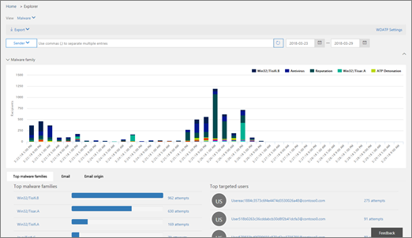

# Hot utredning och svar

[!INCLUDE [Microsoft 365 Defender rebranding](../includes/microsoft-defender-for-office.md)]

Hot-undersöknings-och svars funktioner i [Office 365 Avancerat skydds](office-365-atp.md) analyser och administratörer skyddar organisationens Microsoft 365 för företag-användare genom att:
- Gör det enkelt att identifiera, övervaka och förstå cyberattacks
- Att snabbt adressera hot i Exchange Online, SharePoint Online, OneDrive för företag och Microsoft Teams
- Tillhandahålla insikter och kunskaper för att hjälpa säkerhets hanteringen att förhindra cyberattacks mot deras organisation
- Använda [Automatisk undersökning och svar i Office 365](automated-investigation-response-office.md) för viktiga e-postbaserade hot
    
Hot-undersökningar och svars funktioner tillhandahåller insikter mot hot och relaterade svars åtgärder som är tillgängliga i säkerhetsövervakning &amp; . Dessa insikter kan hjälpa din organisations säkerhets team att skydda användare från e-post-eller filbaserade attacker. Funktionerna hjälper dig att övervaka signaler och samla in data från flera källor, till exempel användar aktivitet, inloggningsautentisering, e-post, kompromissade datorer och säkerhets händelser. Besluts fattare och säkerhets åtgärder kan använda den här informationen för att förstå och reagera på hot mot din organisation och skyddar din immateriella egendom.

## Bekanta dig med Threat-och svars verktyg

Arbets ytan för hot-undersökningar och svars funktioner i området säkerhets & efterlevnad, som en uppsättning verktyg och svars flöden, inklusive följande:

- [Hot instrument panel](#threat-dashboard)
- [Gick](#threat-explorer)
- [Incidenter](#incidents)
- [Attacksimulator](#attack-simulator)
- [Automatiska undersökningar och svar](automated-investigation-response-office.md)

### Hot instrument panel

Använd hot instrument panelen (Detta kallas även för [säkerhets instrument panelen](security-dashboard.md)) för att snabbt se vilka hot som har åtgärd ATS, och som ett visuellt sätt att rapportera till besluts fattare för företag hur Microsoft 365-tjänster säkrar verksamheten.
  

  
Om du vill visa och använda den här instrument panelen &amp; går du till instrument panelen för **hot Management** i Center för säkerhets kontroll \> **Dashboard**.
  
### Hotutforskaren

Använd [Threat Explorer (och identifieringar i real tid)](threat-explorer.md) för att analysera hot, se hur mycket du har attacker och analysera data från hot familjer, angripare och andra infrastrukturer. Threat Explorer (kallas även Utforskaren) är start platsen för eventuella säkerhetsanalytikers undersökningar.

  
Om du vill visa och använda den här rapporten &amp; går du till **Threat Management** \> **Explorer**.
  
### Incidenter

Använd listan incidenter (kallas även undersökningar) för att se en lista över flyg säkerhets tillbud. Incidenter används för att spåra hot som misstänkta e-postmeddelanden och för att genomföra ytterligare undersökningar och åtgärder.

Om du vill visa en lista över aktuella incidenter för organisationen går du till fliken säkerhet & regelefterlevnad och går till **Threat Management** \> **Review** \> **Incidents**.

### Attacksimulator

Använd angrepps Simulator för att ställa in och köra realistiska cyberattacks i din organisation och identifiera utsatta människor innan en verklig cyberattack påverkar ditt företag. Mer information finns i [angrepps Simulator i Office 365](attack-simulator.md).

### Automatiska undersökningar och svar

Använd automatiserade undersökningar och svar (AIR)-funktioner för att spara tid och ansträngning som korrelerar innehåll, enheter och personer mot hot från din organisation. LUFT processer kan börja när vissa notifieringar utlöses eller när de startas av din säkerhets åtgärd. Mer information finns i [automatiserad undersökning och svar i Office 365](automated-investigation-response-office.md).

## Hot Intelligence-widget

Som en del av det avancerade skydds abonnemanget för Office 365 kan säkerhets analytiker granska information om ett känt hot. Detta är användbart för att ta reda på om det finns ytterligare förebyggande åtgärder/steg som kan vidtas för att skydda användare.

## Hur får de här funktionerna?

Microsoft 365 hot-och svars funktioner ingår i Office 365 Avancerat skydds abonnemang 2, som ingår i Enterprise, E5 eller som ett tillägg till vissa abonnemang. Mer information finns i [Office 365 ATP-abonnemang 1 och plan 2](office-365-atp.md#office-365-atp-plan-1-and-plan-2).

## Nödvändiga roller och behörigheter

Office 365 Avancerat skydd använder rollbaserad åtkomst kontroll. Behörigheter tilldelas genom vissa roller i Azure Active Directory, administrations centret för Microsoft 365 eller säkerhets & Compliance Center.

> [!TIP]
> Även om vissa roller, till exempel säkerhets administratör, kan tilldelas i säkerhets & Compliance Center, bör du överväga att använda antingen Microsoft 365 Admin Center eller Azure Active Directory i stället. Information om roller, roll grupper och behörigheter finns i följande resurser:
>
> - [Behörigheter i säkerhetsrelaterade &amp; Center](permissions-in-the-security-and-compliance-center.md)
>
> - [Administratörens rollbehörigheter i Azure Active Directory](https://docs.microsoft.com/azure/active-directory/users-groups-roles/directory-assign-admin-roles)

****

|Aktivitet|Roller och behörigheter|
|---|---|
|Använda hot instrument panelen (eller den nya [säkerhets instrument panelen](security-dashboard.md))   Visa information om senaste eller aktuella hot|Något av följande:  - **Global administratör**    - **Säkerhets administratör**  - **Säkerhets läsare**    Dessa roller kan tilldelas i antingen Azure Active Directory ( [https://portal.azure.com](https://portal.azure.com) ) eller Microsoft 365 Admin Center ( [https://admin.microsoft.com](https://admin.microsoft.com) ).|
|Använd [Threat Explorer (och real tids identifieringar)](threat-explorer.md) för att analysera hot|Något av följande:  - **Global administratör**    - **Säkerhets administratör**  - **Säkerhets läsare**    Dessa roller kan tilldelas i antingen Azure Active Directory ( [https://portal.azure.com](https://portal.azure.com) ) eller Microsoft 365 Admin Center ( [https://admin.microsoft.com](https://admin.microsoft.com) ).|
|Visa incidenter (kallas även undersökningar)   Lägga till e-postmeddelanden i en olycka|Något av följande:  - **Global administratör**    - **Säkerhets administratör**  - **Säkerhets läsare**    Dessa roller kan tilldelas i antingen Azure Active Directory ( [https://portal.azure.com](https://portal.azure.com) ) eller Microsoft 365 Admin Center ( [https://admin.microsoft.com](https://admin.microsoft.com) ).|
|Utlösa e-poståtgärder i en olycka     Hitta och ta bort misstänkta e-postmeddelanden|Något av följande:  - **Global administratör**    - **Säkerhets administratören** plus rollen **Sök och rensa**  Rollen som **Global administratör** och **säkerhets administratör** kan tilldelas i antingen Azure Active Directory ( [https://portal.azure.com](https://portal.azure.com) ) eller Microsoft 365 Admin Center ( [https://admin.microsoft.com](https://admin.microsoft.com) ).   Rollen **sökning och rensning** måste tilldelas i säkerhets & Compliance Center ( [https://protection.office.com](https://protection.office.com) ).|
|Integrera Office 365 Avancerat skydds plan 2 med Microsoft Defender Avancerat skydd     Integrera Office 365 Avancerat skydds plan 2 med en SIEM-Server|Antingen den **globala administratören** eller rollen **säkerhets administratör** tilldelad i antingen Azure Active Directory ( [https://portal.azure.com](https://portal.azure.com) ) eller Microsoft 365 Admin Center ( [https://admin.microsoft.com](https://admin.microsoft.com) ). --- **bransch** --- En lämplig roll som är tilldelad i ytterligare program (till exempel [Microsoft Defender säkerhets Center](https://docs.microsoft.com/windows/security/threat-protection/microsoft-defender-atp/user-roles) eller din Siem-Server)|
|

## Nästa steg

- [Lär dig mer om hot-Spårare-nya och intressanta](threat-trackers.md)

- [Hitta och undersöka skadlig e-post som har levererats (Office 365 hot undersökning och svar)](investigate-malicious-email-that-was-delivered.md)

- [Integrera Office 365 hot-undersökningar och-svar med Microsoft Defender Avancerat skydd](integrate-office-365-ti-with-wdatp.md)

- [Lär dig mer om angrepps Simulator](attack-simulator.md)
