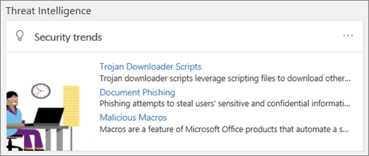

# Undersökning och svar på hotThreat investigation and response

[!INCLUDE [Microsoft 365 Defender rebranding](../includes/microsoft-defender-for-office.md)]

**Gäller för****Applies To**
- [Microsoft Defender för Office 365 abonnemang 2Microsoft Defender for Office 365 plan 2](defender-for-office-365.md)

Med funktionerna för undersökning av hot och svar i [Microsoft Defender för Office 365](defender-for-office-365.md) kan säkerhetsanalytiker och administratörer skydda organisationens Microsoft 365 för företagsanvändare genom att:Threat investigation and response capabilities in [Microsoft Defender for Office 365](defender-for-office-365.md) help security analysts and administrators protect their organization's Microsoft 365 for business users by:

- Göra det enkelt att identifiera, övervaka och förstå cyberattackerMaking it easy to identify, monitor, and understand cyberattacks
- Hjälper dig att snabbt hantera hot i Exchange Online, SharePoint Online, OneDrive för företag och Microsoft TeamsHelping to quickly address threats in Exchange Online, SharePoint Online, OneDrive for Business and Microsoft Teams
- Tillhandahålla insikter och kunskaper för att hjälpa säkerhetsåtgärder förhindra cyberattacker mot organisationenProviding insights and knowledge to help security operations prevent cyberattacks against their organization
- Använda automatisk [undersökning och svar i Office 365](automated-investigation-response-office.md) för kritiska e-postbaserade hotEmploying [automated investigation and response in Office 365](automated-investigation-response-office.md) for critical email-based threats

Funktioner för undersökning av hot och svar ger insikter i hot och relaterade svarsåtgärder som är tillgängliga i Microsoft 365 Defender portalen.Threat investigation and response capabilities provide insights into threats and related response actions that are available in the Microsoft 365 Defender portal. De här insikterna kan hjälpa organisationens säkerhetsteam att skydda användare från e-post- eller filbaserade attacker.These insights can help your organization's security team protect users from email- or file-based attacks. Funktionerna hjälper till att övervaka signaler och samla in data från flera källor, till exempel användaraktivitet, autentisering, e-post, komprometterade datorer och säkerhetstillbud.The capabilities help monitor signals and gather data from multiple sources, such as user activity, authentication, email, compromised PCs, and security incidents. Beslutsfattare och ditt säkerhetsteam kan använda den här informationen för att förstå och reagera på hot mot organisationen och skydda din immateriella egendom.Business decision makers and your security operations team can use this information to understand and respond to threats against your organization and protect your intellectual property.

## Bekanta dig med undersökning av hot och svarsverktygGet acquainted with threat investigation and response tools

Funktionerna för undersökning av hot och svar surface Microsoft 365 Defender-portalen, som en uppsättning verktyg och svarsarbetsflöden, inklusive följande:Threat investigation and response capabilities surface in the Microsoft 365 Defender portal, as a set of tools and response workflows, including the following:

- [ExplorerExplorer](#explorer)
- [IncidenterIncidents](#incidents)
- [Utbildning av attack simuleringAttack simulation training](attack-simulation-training.md)
- [Automatiska undersökningar och svarAutomated investigation and response](automated-investigation-response-office.md)

### ExplorerExplorer

Använd [Utforskaren (och](threat-explorer.md) identifieringar i realtid) för att analysera hot, se mängden attacker över tid och analysera data efter hotfamiljer, attackersinfrastruktur och mycket mer.Use [Explorer (and real-time detections)](threat-explorer.md) to analyze threats, see the volume of attacks over time, and analyze data by threat families, attacker infrastructure, and more. Utforskaren (kallas även Threat Explorer) är startpunkten för alla säkerhetsanalytikers arbetsflöde för undersökning.Explorer (also referred to as Threat Explorer) is the starting place for any security analyst's investigation workflow.

Om du vill visa och använda den här rapporten går Microsoft 365 Defender e-postportalen i **Utforskaren för & samarbete.**  >  To view and use this report, in the Microsoft 365 Defender portal, go to **Email & collaboration** > **Explorer**.

### IncidenterIncidents

Använd listan Incidenter (kallas även Undersökningar) om du vill se en lista över säkerhetsincidenter för flyg.Use the Incidents list (this is also called Investigations) to see a list of in flight security incidents. Incidenter används för att spåra hot som misstänkta e-postmeddelanden och för ytterligare undersökning och åtgärd.Incidents are used to track threats such as suspicious email messages, and to conduct further investigation and remediation.

Om du vill visa en lista över aktuella incidenter för organisationen går du Microsoft 365 Defender i &  >  **incidenter**.To view the list of current incidents for your organization, in the Microsoft 365 Defender portal, go to **Incidents & alerts** > **Incidents**.

### Utbildning av attack simuleringAttack simulation training

Använd utbildning för att skapa och köra realistiska cyberattacker i organisationen och identifiera sårbara personer innan en verklig cyberattacker påverkar ditt företag.Use Attack simulation training to set up and run realistic cyberattacks in your organization, and identify vulnerable people before a real cyberattack affects your business. Mer information finns i Simulera [nätfiskeangrepp](attack-simulation-training.md).To learn more, see [Simulate a phishing attack](attack-simulation-training.md).

Om du vill visa och använda den här funktionen i Microsoft 365 Defender-portalen går du till **E-& om samarbete** Attack  >  **simuleringsutbildning**.To view and use this feature in the Microsoft 365 Defender portal, go to **Email & collaboration** > **Attack simulation training**.

### Automatiska undersökningar och svarAutomated investigation and response

Använd funktioner för automatisk undersökning och svar (AIR) för att spara tid och arbete för att korrelera innehåll, enheter och personer som riskerar från hot i organisationen.Use automated investigation and response (AIR) capabilities to save time and effort correlating content, devices, and people at risk from threats in your organization. AIR-processer kan börja när vissa aviseringar utlöses eller när de startas av ditt team för säkerhetsåtgärder.AIR processes can begin whenever certain alerts are triggered, or when started by your security operations team. Mer information finns i [automatiserad undersökning och svar i Office 365](automated-investigation-response-office.md).To learn more, see [automated investigation and response in Office 365](automated-investigation-response-office.md).

## Widgetar för hotinformationThreat intelligence widgets

Som en del av Microsoft Defender för Office 365 plan 2-erbjudandet kan säkerhetsanalytiker granska information om ett känt hot.As part of the Microsoft Defender for Office 365 Plan 2 offering, security analysts can review details about a known threat. Det är användbart för att avgöra om det finns ytterligare preventativa åtgärder/steg som kan vidtas för att skydda användarna.This is useful to determine whether there are additional preventative measures/steps that can be taken to keep users safe.

## Hur får vi de här funktionerna?How do we get these capabilities?

Microsoft 365 funktioner för undersökning av hot och svar ingår i Microsoft Defender för Office 365 abonnemang 2, som ingår i Enterprise E5 eller som ett tillägg till vissa prenumerationer.Microsoft 365 threat investigation and response capabilities are included in Microsoft Defender for Office 365 Plan 2, which is included in Enterprise E5 or as an add-on to certain subscriptions. Mer information finns i [Defender för Office 365 abonnemang 1 och abonnemang 2.](defender-for-office-365.md#microsoft-defender-for-office-365-plan-1-and-plan-2)To learn more, see [Defender for Office 365 Plan 1 and Plan 2](defender-for-office-365.md#microsoft-defender-for-office-365-plan-1-and-plan-2).

## Roller och behörigheter som krävsRequired roles and permissions

Microsoft Defender för Office 365 använder rollbaserad åtkomstkontroll.Microsoft Defender for Office 365 uses role-based access control. Behörigheter tilldelas via vissa roller i Azure Active Directory, Administrationscenter för Microsoft 365 och Microsoft 365 Defender portal.Permissions are assigned through certain roles in Azure Active Directory, the Microsoft 365 admin center, or the Microsoft 365 Defender portal.

> [!TIP]
> Även om vissa roller, till exempel säkerhetsadministratör, kan tilldelas i Microsoft 365 Defender-portalen kan du använda antingen Administrationscenter för Microsoft 365 eller Azure Active Directory stället.Although some roles, such as Security Administrator, can be assigned in the Microsoft 365 Defender portal, consider using either the Microsoft 365 admin center or Azure Active Directory instead. Mer information om roller, rollgrupper och behörigheter finns i följande resurser:For information about roles, role groups, and permissions, see the following resources:
>
> - [Behörigheter på Microsoft 365 Defender-portalenPermissions in the Microsoft 365 Defender portal](permissions-microsoft-365-security-center.md)
> - [Administratörens rollbehörigheter i Azure Active DirectoryAdministrator role permissions in Azure Active Directory](/azure/active-directory/users-groups-roles/directory-assign-admin-roles)

 

****

|AktivitetActivity|Roller och behörigheterRoles and permissions|
|---|---|
|Använd instrumentpanelen för & Sårbarhetshantering (eller den nya [säkerhetspanelen)](security-dashboard.md)Use the Threat & Vulnerability Management dashboard (or the new [Security dashboard](security-dashboard.md)) 
 Visa information om de senaste eller aktuella hotenView information about recent or current threats|Något av följande:One of the following: <ul><li>**Global administratör****Global Administrator**</li><li>**Säkerhetsadministratör****Security Administrator**</li><li>**Säkerhetsläsare****Security Reader**</li></ul> 
 De här rollerna kan tilldelas i Azure Active Directory ( <https://portal.azure.com> ) eller i Administrationscenter för Microsoft 365 ( <https://admin.microsoft.com> ).These roles can be assigned in either Azure Active Directory (<https://portal.azure.com>) or the Microsoft 365 admin center (<https://admin.microsoft.com>).|
|Använd [Utforskaren (och identifieringar i realtid) för](threat-explorer.md) att analysera hotUse [Explorer (and real-time detections)](threat-explorer.md) to analyze threats|Något av följande:One of the following: <ul><li>**Global administratör****Global Administrator**</li><li>**Säkerhetsadministratör****Security Administrator**</li><li>**Säkerhetsläsare****Security Reader**</li></ul> 
 De här rollerna kan tilldelas i Azure Active Directory ( <https://portal.azure.com> ) eller i Administrationscenter för Microsoft 365 ( <https://admin.microsoft.com> ).These roles can be assigned in either Azure Active Directory (<https://portal.azure.com>) or the Microsoft 365 admin center (<https://admin.microsoft.com>).|
|Visa incidenter (kallas även undersökningar)View Incidents (also referred to as Investigations) 
 Lägga till e-postmeddelanden till ett problemAdd email messages to an incident|Något av följande:One of the following: <ul><li>**Global administratör****Global Administrator**</li><li>**Säkerhetsadministratör****Security Administrator**</li><li>**Säkerhetsläsare****Security Reader**</li></ul> 
 De här rollerna kan tilldelas i Azure Active Directory ( <https://portal.azure.com> ) eller i Administrationscenter för Microsoft 365 ( <https://admin.microsoft.com> ).These roles can be assigned in either Azure Active Directory (<https://portal.azure.com>) or the Microsoft 365 admin center (<https://admin.microsoft.com>).|
|Utlösa e-poståtgärder i ett incidentTrigger email actions in an incident 
 Hitta och ta bort misstänkta e-postmeddelandenFind and delete suspicious email messages|Något av följande:One of the following: <ul><li>**Global administratör****Global Administrator**</li><li>**Säkerhetsadministratör** plus **rollen Sök och** rensning**Security Administrator** plus the **Search and Purge** role</li></ul> 
 Rollerna **Global administratör** **och Säkerhetsadministratör** kan tilldelas i antingen Azure Active Directory ( <https://portal.azure.com> ) eller i Administrationscenter för Microsoft 365 ( <https://admin.microsoft.com> ).The **Global Administrator** and **Security Administrator** roles can be assigned in either Azure Active Directory (<https://portal.azure.com>) or the Microsoft 365 admin center (<https://admin.microsoft.com>). 
 Rollen **Sök och rensning måste** vara tilldelad i rollerna **e& och samarbete** i Microsoft 36 Defender-portalen ( <https://security.microsoft.com> ).The **Search and Purge** role must be assigned in the **Email & collaboration roles** in the Microsoft 36 Defender portal (<https://security.microsoft.com>).|
|Integrera Microsoft Defender för Office 365 abonnemang 2 med Microsoft Defender för SlutpunktIntegrate Microsoft Defender for Office 365 Plan 2 with Microsoft Defender for Endpoint 
 Integrera Microsoft Defender för Office 365 abonnemang 2 med en SIEM-serverIntegrate Microsoft Defender for Office 365 Plan 2 with a SIEM server|Antingen **global administratör** eller **säkerhetsadministratörsroll** som tilldelats i antingen Azure Active Directory ( <https://portal.azure.com> ) eller Administrationscenter för Microsoft 365 ( <https://admin.microsoft.com> ).Either the **Global Administrator** or the **Security Administrator** role assigned in either Azure Active Directory (<https://portal.azure.com>) or the Microsoft 365 admin center (<https://admin.microsoft.com>). 
 --- **plus** --- --- **plus** --- 
 En lämplig roll tilldelad i ytterligare program (till [exempel Microsoft Defender Säkerhetscenter](/windows/security/threat-protection/microsoft-defender-atp/user-roles) eller SIEM-servern).An appropriate role assigned in additional applications (such as [Microsoft Defender Security Center](/windows/security/threat-protection/microsoft-defender-atp/user-roles) or your SIEM server).|
|

## Nästa stegNext steps

- [Lär dig mer om hotspårningar – nytt och värt att uppmärksammaLearn about Threat Trackers - New and Noteworthy](threat-trackers.md)
- [Hitta och undersöka skadlig e-post som har Office 365 (undersökning av hot och svar)Find and investigate malicious email that was delivered (Office 365 Threat Investigation and Response)](investigate-malicious-email-that-was-delivered.md)
- [Integrera Office 365 undersökning av hot och svar med Microsoft Defender för SlutpunktIntegrate Office 365 Threat Investigation and Response with Microsoft Defender for Endpoint](integrate-office-365-ti-with-mde.md)
- [Simulera en nätfiskeattackSimulate a phishing attack](attack-simulation-training.md)
