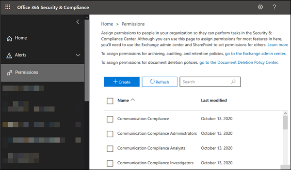

# Behörigheter i Säkerhets- och efterlevnadscentretPermissions in the Security & Compliance Center

[!INCLUDE [Microsoft 365 Defender rebranding](../includes/microsoft-defender-for-office.md)]

**Gäller för****Applies to**
- [Exchange Online ProtectionExchange Online Protection](exchange-online-protection-overview.md)
- [Microsoft Defender för Office 365 Abonnemang 1 och Abonnemang 2Microsoft Defender for Office 365 plan 1 and plan 2](defender-for-office-365.md)
- [Microsoft 365 DefenderMicrosoft 365 Defender](../defender/microsoft-365-defender.md)

Med säkerhets- & efterlevnadscenter kan du bevilja behörigheter till personer som utför efterlevnadsuppgifter, till exempel enhetshantering, skydd mot dataförlust, eDiscovery, bevarande och så vidare.The Security & Compliance Center lets you grant permissions to people who perform compliance tasks like device management, data loss prevention, eDiscovery, retention, and so on. De här personerna kan endast utföra de uppgifter som du uttryckligen beviljar dem åtkomst till.These people can perform only the tasks that you explicitly grant them access to. För att få tillgång & säkerhets- och efterlevnadscentret måste användarna vara globala administratörer eller medlemmar i en eller flera rollgrupper & Säkerhets- och efterlevnadscenter.To access the Security & Compliance Center, users need to be a global administrator or a member of one or more Security & Compliance Center role groups.

Behörigheter i Säkerhets- & Säkerhets- och efterlevnadscenter baseras på den rollbaserade behörighetsmodellen (RBAC).Permissions in the Security & Compliance Center are based on the role-based access control (RBAC) permissions model. RBAC är samma behörighetsmodell som används i Exchange, så om du är bekant med Exchange kommer det att kännas välbekant att bevilja behörigheter i säkerhets- & säkerhets- och efterlevnadscentret.RBAC is the same permissions model that's used by Exchange, so if you're familiar with Exchange, granting permissions in the Security & Compliance Center will be very similar. Det är dock viktigt att komma ihåg att rollgrupper i Exchange och säkerhetscenter & inte delar medlemskap eller behörigheter.It's important to remember, however, that Exchange role groups and Security & Compliance Center role groups don't share membership or permissions. Även om båda har rollgruppen Organisationshantering är de inte desamma.While both have an Organization Management role group, they aren't the same. Behörigheterna de till beviljar och medlemmarna i rollgrupperna skiljer sig åt.The permissions they grant, and the members of the role groups, are different. Det finns en lista över rollgrupper & Säkerhets- och efterlevnadscenter nedan.There's a list of Security & Compliance Center role groups below.

## Relation mellan medlemmar, roller och rollgrupperRelationship of members, roles, and role groups

En **roll** ger behörighet att utföra en uppsättning aktiviteter. Med rollen Ärendehantering kan personer till exempel arbeta med eDiscovery-ärenden.A **role** grants permissions to do a set of tasks; for example, the Case Management role lets people work with eDiscovery cases.

En **rollgrupp** är en uppsättning roller som gör att personer kan göra sitt jobb i säkerhets- & efterlevnadscenter.A **role group** is a set of roles that lets people do their jobs across the Security & Compliance Center. Rollgruppen efterlevnadsadministratören inkluderar till exempel (bland andra roller) rollerna för Ärendehantering, Innehållssökning och Organisationskonfiguration (plus andra) eftersom någon som är efterlevnadsadministratör behöver behörighet för de uppgifterna för att utföra sitt jobb.For example, the Compliance Administrator role group includes (among other roles) the roles for Case Management, Content Search, and Organization Configuration (plus others) because someone who's a compliance admin will need the permissions for those tasks to do their job.

Säkerhets- & efterlevnadscenter innehåller standardrollgrupper för de vanligaste uppgifter och funktioner som du behöver tilldela personer till.The Security & Compliance Center includes default role groups for the most common tasks and functions that you'll need to assign people to. Vi rekommenderar att du bara lägger till enskilda **användare som** medlemmar i standardrollgrupperna.We recommend simply adding individual users as **members** to the default role groups.

## Behörigheter som krävs för att använda funktioner i & Säkerhets- och efterlevnadscenterPermissions needed to use features in the Security & Compliance Center

I följande tabell visas de standardrollgrupper som är tillgängliga i Säkerhets- & efterlevnadscenter och de roller som är tilldelade till rollgrupperna som standard.The following table lists the default role groups that are available in the Security & Compliance Center, and the roles that are assigned to the role groups by default. Om du vill ge en användare behörighet att utföra en efterlevnadsuppgift lägger du till dem i rätt rollgrupp & Säkerhets- och efterlevnadscenter.To grant permissions to a user to perform a compliance task, add them to the appropriate Security & Compliance Center role group.

Hantering av behörigheter i Säkerhets- & efterlevnadscenter ger endast användare tillgång till de efterlevnadsfunktioner som är tillgängliga i själva & säkerhets- och efterlevnadscentret.Managing permissions in the Security & Compliance Center only gives users access to the compliance features that are available within the Security & Compliance Center itself. Om du vill ge behörighet till andra efterlevnadsfunktioner som inte finns i Säkerhets- och efterlevnadscenter för &, till exempel Exchange-e-postflödesregler (kallas även transportregler), måste du använda administrationscentret för Exchange.If you want to grant permissions to other compliance features that aren't in the Security & Compliance Center, such as Exchange mail flow rules (also known as transport rules), you need to use the Exchange admin center.

Information om hur du beviljar åtkomst till Säkerhets- och & finns i Artikeln om att ge användare åtkomst till administrationscentret för [Microsoft 365 efterlevnad.](grant-access-to-the-security-and-compliance-center.md)To see how to grant access to the Security & Compliance Center, check out [Give users access to Microsoft 365 Compliance admin center](grant-access-to-the-security-and-compliance-center.md).

> [!NOTE]
> Du måste **vara administratör** för att kunna visa fliken Behörigheter & Säkerhets- och efterlevnadscenter. Specifikt måste du tilldelas rollhanteringsrollen och den rollen  tilldelas endast till rollgruppen Organisationshantering i säkerhets- och efterlevnadscentret som standard & säkerhets- och efterlevnadscentret. To view the **Permissions** tab in the Security & Compliance Center, you need to be an admin. Specifically, you need to be assigned the **Role Management** role, and that role is assigned only to the **Organization Management** role group in the Security & Compliance Center by default. Med **rollhanteringsrollen** kan användarna dessutom visa, skapa och ändra rollgrupper.Furthermore, the **Role Management** role allows users to view, create, and modify role groups.

  

****

|RollgruppRole group|BeskrivningDescription|Tilldelade standardrollerDefault roles assigned|
|---|---|---|
|**Kommunikationsefterlevnad****Communication Compliance**|Ger behörighet till alla roller för kommunikationsefterlevnad: administratör, analytiker, administratörer och tittare.Provides permission to all the communication compliance roles: administrator, analyst, investigator, and viewer.|ÄrendehanteringCase Management 
 Admin för kommunikationsefterlevnadCommunication Compliance Admin 
 Analys av kommunikationsefterlevnadCommunication Compliance Analysis 
 Case Management för kommunikationsefterlevnadCommunication Compliance Case Management 
 Undersökning av kommunikationsefterlevnadCommunication Compliance Investigation 
 Visningsprogram för kommunikationsefterlevnadCommunication Compliance Viewer 
 DataklassificeringsfeedbackleverantörData Classification Feedback Provider 
 View-Only caseView-Only Case|
|**Administratörer för kommunikationsefterlevnad****Communication Compliance Administrators**|Administratörer för kommunikationsefterlevnad som kan skapa/redigera principer och definiera globala inställningar.Administrators of communication compliance that can create/edit policies and define global settings.|Admin för kommunikationsefterlevnadCommunication Compliance Admin 
 Case Management för kommunikationsefterlevnadCommunication Compliance Case Management|
|**Analytiker för kommunikationsefterlevnad****Communication Compliance Analysts**|Analytiker av kommunikationsefterlevnad som kan undersöka policymatchningar, visa metadata för meddelanden och vidta åtgärder.Analysts of communication compliance that can investigate policy matches, view message meta data, and take remediation actions.|Analys av kommunikationsefterlevnadCommunication Compliance Analysis 
 Case Management för kommunikationsefterlevnadCommunication Compliance Case Management|
|**Kommunikationsefterlevnadsefterlevnadar****Communication Compliance Investigators**|Analytiker av kommunikationsefterlevnad som kan undersöka principmatchningar, visa meddelandeinnehåll och vidta åtgärder.Analysts of communication compliance that can investigate policy matches, view message content, and take remediation actions.|ÄrendehanteringCase Management 
 Analys av kommunikationsefterlevnadCommunication Compliance Analysis 
 Case Management för kommunikationsefterlevnadCommunication Compliance Case Management 
 Undersökning av kommunikationsefterlevnadCommunication Compliance Investigation 
 DataklassificeringsfeedbackleverantörData Classification Feedback Provider 
 View-Only caseView-Only Case|
|**Läsare av kommunikationsefterlevnad****Communication Compliance Viewers**|Tittare för kommunikationsefterlevnad som kan komma åt tillgängliga rapporter och widgetar.Viewer of communication compliance that can access the available reports and widgets.|Case Management för kommunikationsefterlevnadCommunication Compliance Case Management 
 Visningsprogram för kommunikationsefterlevnadCommunication Compliance Viewer|
|**Efterlevnadsadministratör**1**Compliance Administrator**1|Medlemmarna kan hantera inställningar för enhetshantering, skydd mot dataförlust, rapporter och förvaring.Members can manage settings for device management, data loss prevention, reports, and preservation.|ÄrendehanteringCase Management 
 EfterlevnadsadministratörCompliance Administrator 
 EfterlevnadssökningCompliance Search 
 DataklassificeringsfeedbackleverantörData Classification Feedback Provider 
 Granskare för dataklassificeringsfeedbackData Classification Feedback Reviewer 
 EnhetshanteringDevice Management 
 DispositionshanteringDisposition Management 
 DLP-efterlevnadshanteringDLP Compliance Management 
 Håll nedHold 
 IB-efterlevnadshanteringIB Compliance Management 
 Hantera aviseringarManage Alerts 
 OrganisationskonfigurationOrganization Configuration 
 RecordManagementRecordManagement 
 BevarandehanteringRetention Management 
 View-Only granskningsloggarView-Only Audit Logs 
 View-Only caseView-Only Case 
 View-Only enhetshanteringView-Only Device Management 
 View-Only DLP-efterlevnadshanteringView-Only DLP Compliance Management 
 View-Only IB-efterlevnadshanteringView-Only IB Compliance Management 
 View-Only Hantera aviseringarView-Only Manage Alerts 
 View-Only mottagareView-Only Recipients 
 View-Only posthanteringView-Only Record Management 
 View-Only med bevarandehanteringView-Only Retention Management|
|**Dataadministratör för efterlevnad****Compliance Data Administrator**|Medlemmarna kan hantera inställningar för enhetshantering, dataskydd, skydd mot dataförlust, rapporter och förvaring.Members can manage settings for device management, data protection, data loss prevention, reports, and preservation.|EfterlevnadsadministratörCompliance Administrator 
 EfterlevnadssökningCompliance Search 
 EnhetshanteringDevice Management 
 DLP-efterlevnadshanteringDLP Compliance Management 
 DispositionshanteringDisposition Management 
 IB-efterlevnadshanteringIB Compliance Management 
 Hantera aviseringarManage Alerts 
 OrganisationskonfigurationOrganization Configuration 
 RecordManagementRecordManagement 
 BevarandehanteringRetention Management 
 Administratör för känslighetsetikettSensitivity Label Administrator 
 View-Only granskningsloggarView-Only Audit Logs 
 View-Only enhetshanteringView-Only Device Management 
 View-Only DLP-efterlevnadshanteringView-Only DLP Compliance Management 
 View-Only IB-efterlevnadshanteringView-Only IB Compliance Management 
 View-Only Hantera aviseringarView-Only Manage Alerts 
 View-Only mottagareView-Only Recipients 
 View-Only posthanteringView-Only Record Management 
 View-Only med bevarandehanteringView-Only Retention Management|
|**Efterlevnadshanterarens administratörer****Compliance Manager Administrators**|Hantera skapande och ändring av mallar.Manage template creation and modification.|Efterlevnadshanteraren – administrationCompliance Manager Administration 
 Utvärdering av EfterlevnadshanterarenCompliance Manager Assessment 
 Bidrag till EfterlevnadshanterarenCompliance Manager Contribution 
 Efterlevnadshanteraren LäsareCompliance Manager Reader|
|**Utvärderare i Efterlevnadshanteraren****Compliance Manager Assessors**|Skapa utvärderingar, implementera förbättringsåtgärder och uppdatera teststatus för förbättringsåtgärder.Create assessments, implement improvement actions, and update test status for improvement actions.|Utvärdering av EfterlevnadshanterarenCompliance Manager Assessment 
 Bidrag till EfterlevnadshanterarenCompliance Manager Contribution 
 Efterlevnadshanteraren LäsareCompliance Manager Reader|
|**Deltagare i Efterlevnadshanteraren****Compliance Manager Contributors**|Skapa utvärderingar och utför arbete för att implementera förbättringsåtgärder.Create assessments and perform work to implement improvement actions.|Bidrag till EfterlevnadshanterarenCompliance Manager Contribution 
 Efterlevnadshanteraren LäsareCompliance Manager Reader|
|**Läsare av Efterlevnadshanteraren****Compliance Manager Readers**|Visa allt innehåll i Efterlevnadshanteraren utom administratörsfunktioner.View all Compliance Manager content except for administrator functions.|Efterlevnadshanteraren LäsareCompliance Manager Reader|
|**Innehållsvisningsprogram för Innehållsutforskaren****Content Explorer Content Viewer**|Visa innehållsfilerna i Innehållsutforskaren.View the contents files in Content explorer.|Visningsprogram för dataklassificeringsinnehållData Classification Content Viewer|
|**Visningsprogram för listor i Innehållsutforskaren****Content Explorer List Viewer**|Visa alla objekt i Innehållsutforskaren endast i listformat.View all items in Content explorer in list format only.|Visningsprogram för dataklassificeringslistaData Classification List Viewer|
|**eDiscovery Manager****eDiscovery Manager**|Medlemmar kan utföra sökningar och platsplatser i postlådor, SharePoint Online-webbplatser och OneDrive för företag-platser.Members can perform searches and place holds on mailboxes, SharePoint Online sites, and OneDrive for Business locations. Medlemmar kan också skapa och hantera eDiscovery-ärenden, lägga till och ta bort medlemmar i ett ärende, skapa och redigera innehållssökningar kopplade till ett ärende samt komma åt ärendedata i Avancerad eDiscovery.Members can also create and manage eDiscovery cases, add and remove members to a case, create and edit Content Searches associated with a case, and access case data in Advanced eDiscovery. 
 En eDiscovery-administratör är medlem i rollgruppen för eDiscovery-hanteraren som har tilldelats ytterligare behörigheter.An eDiscovery Administrator is a member of the eDiscovery Manager role group who has been assigned additional permissions. Förutom de uppgifter som en eDiscovery-hanterare kan utföra kan en eDiscovery-administratör:In addition to the tasks that an eDiscovery Manager can perform, an eDiscovery Administrator can:<ul><li>Visa alla eDiscovery-ärenden i organisationen.View all eDiscovery cases in the organization.</li><li>Hantera alla eDiscovery-fall när de har lagt till sig själva som medlem i ärendet.Manage any eDiscovery case after they add themselves as a member of the case.</li></ul> 
 Den primära skillnaden mellan en eDiscovery-hanterare och en eDiscovery-administratör är att en eDiscovery-administratör kan komma åt alla fall som visas på sidan **eDiscovery-ärenden** i säkerhets- och &-efterlevnadscentret.The primary difference between an eDiscovery Manager and an eDiscovery Administrator is that an eDiscovery Administrator can access all cases that are listed on the **eDiscovery cases** page in the Security & Compliance Center. En eDiscovery-hanterare kan bara komma åt de ärenden de skapat eller de fall där de är medlemmar.An eDiscovery manager can only access the cases they created or cases they are a member of. Mer information om hur du gör en användare till eDiscovery-administratör finns i Tilldela [eDiscovery-behörigheter](../../compliance/assign-ediscovery-permissions.md)i säkerhets- & efterlevnadscenter.For more information about making a user an eDiscovery Administrator, see [Assign eDiscovery permissions in the Security & Compliance Center](../../compliance/assign-ediscovery-permissions.md).|ÄrendehanteringCase Management 
 KommunikationCommunication 
 EfterlevnadssökningCompliance Search 
 InsikareCustodian 
 ExporteraExport 
 Håll nedHold 
 FörhandsgranskaPreview 
 GranskaReview 
 RMS-dekrypteraRMS Decrypt|
|**Global Reader****Global Reader**|Medlemmar har skrivskyddade åtkomst till rapporter, aviseringar och kan se alla konfigurationer och inställningar.Members have read-only access to reports, alerts, and can see all the configuration and settings.
 Den största skillnaden mellan Global Reader och Säkerhetsläsare är att en global läsare kan komma åt **konfiguration och inställningar.**The primary difference between Global Reader and Security Reader is that a Global Reader can access **configuration and settings**.|SäkerhetsläsareSecurity Reader 
 KänslighetsetikettläsareSensitivity Label Reader 
 Vyn TjänstgranskningService Assurance View 
 View-Only granskningsloggarView-Only Audit Logs 
 View-Only enhetshanteringView-Only Device Management 
 View-Only DLP-efterlevnadshanteringView-Only DLP Compliance Management 
 View-Only IB-efterlevnadshanteringView-Only IB Compliance Management 
 View-Only Hantera aviseringarView-Only Manage Alerts 
 View-Only mottagareView-Only Recipients 
 View-Only posthanteringView-Only Record Management 
 View-Only med bevarandehanteringView-Only Retention Management|
|**Insider-riskhantering****Insider Risk Management**|Använd den här rollgruppen för att hantera insider-riskhantering för organisationen i en enda grupp.Use this role group to manage insider risk management for your organization in a single group. Genom att lägga till alla användarkonton för angivna administratörer, analytiker och administratörer kan du konfigurera behörigheter för Insider-riskhantering i en enda grupp.By adding all user accounts for designated administrators, analysts, and investigators, you can configure insider risk management permissions in a single group. Den här rollgruppen innehåller alla behörighetsroller för Insider-riskhantering.This role group contains all the insider risk management permission roles. Det här är det enklaste sättet att snabbt komma igång med insider-riskhantering. Det passar bra för organisationer som inte behöver separata behörigheter som definierats för olika användargrupper.This is the easiest way to quickly get started with insider risk management and is a good fit for organizations that do not need separate permissions defined for separate groups of users.|ÄrendehanteringCase Management 
 Insider-riskhanteringsadministratörInsider Risk Management Admin 
 Insider-riskhanteringsanalysInsider Risk Management Analysis 
 Insider-undersökning av riskhanteringInsider Risk Management Investigation 
 View-Only caseView-Only Case|
|**Insider-riskhanteringsadministratörer****Insider Risk Management Admins**|Använd den här rollgruppen när du först konfigurerar Insider-riskhantering och senare för att dela upp Insider-riskadministratörer i en definierad grupp.Use this role group to initially configure insider risk management and later to segregate insider risk administrators into a defined group. Användare i den här rollgruppen kan skapa, läsa, uppdatera och ta bort principer för insider-riskhantering, globala inställningar och rollgruppstilldelningar.Users in this role group can create, read, update, and delete insider risk management policies, global settings, and role group assignments.|ÄrendehanteringCase Management 
 Insider-riskhanteringsadministratörInsider Risk Management Admin 
 View-Only caseView-Only Case|
|**Analytiker för hantering av interna risker****Insider Risk Management Analysts**|Använd den här gruppen för att tilldela behörigheter till användare som fungerar som insider-riskfallsanalytiker.Use this group to assign permissions to users that will act as insider risk case analysts. Användare i den här rollgruppen har åtkomst till alla varningar och mallar för insider-riskhantering, ärenden och meddelanden.Users in this role group can access all insider risk management alerts, cases, and notices templates. De kan inte komma åt Innehållsutforskaren med insiderrisk.They cannot access the insider risk Content Explorer.|ÄrendehanteringCase Management 
 Insider-riskhanteringsanalysInsider Risk Management Analysis 
 View-Only caseView-Only Case|
|**Insider-riskhanteringsgranskningar****Insider Risk Management Auditors**|Använd den här gruppen för att tilldela behörigheter till användare som ska granska aktiviteter inom insider-riskhantering.Use this group to assign permissions to users that will audit insider risk management activities. Användare i den här rollgruppen kan komma åt granskningsloggen för Insider-risker.Users in this role group can access the insider risk audit log.|Granskning av Insider-riskhanteringInsider Risk Management Audit|
|**Utredare för hantering av interna risker****Insider Risk Management Investigators**|Använd den här gruppen för att tilldela behörigheter till användare som ska agera som insider-riskgruppsbehörigheter.Use this group to assign permissions to users that will act as insider risk data investigators. Användare i den här rollgruppen kan komma åt alla varningar för insider-riskhantering, ärenden, meddelandemallar och Innehållsutforskaren för alla fall.Users in this role group can access all insider risk management alerts, cases, notices templates, and the Content Explorer for all cases.|ÄrendehanteringCase Management 
 Insider-undersökning av riskhanteringInsider Risk Management Investigation 
 View-Only caseView-Only Case|
|**IRM-deltagare****IRM Contributors**|Den här rollgruppen är synlig, men används endast av bakgrundstjänster.This role group is visible, but is used by background services only.|Permanent bidrag till Insider-riskhanteringInsider Risk Management Permanent contribution 
 Temporärt bidrag till Insider-riskhanteringInsider Risk Management Temporary contribution|
|**MailFlow-administratör****MailFlow Administrator**|Medlemmarna kan övervaka och visa information om e-postflödet och rapporter i Säkerhets- & efterlevnadscenter.Members can monitor and view mail flow insights and reports in the Security & Compliance Center. Globala administratörer kan lägga till vanliga användare i den här gruppen, men om användaren inte är medlem i Exchange-administratörsgruppen har användaren inte åtkomst till Exchange-administratörsrelaterade uppgifter.Global admins can add ordinary users to this group, but, if the user isn't a member of the Exchange Admin group, the user will not have access to Exchange admin-related tasks.|View-Only mottagareView-Only Recipients|
|**Organisationshantering**1**Organization Management**1|Medlemmar kan kontrollera behörigheter för åtkomst till funktioner i Säkerhets- och efterlevnadscenter för & och även hantera inställningar för enhetshantering, skydd mot dataförlust, rapporter och bevarande.Members can control permissions for accessing features in the Security & Compliance Center, and also manage settings for device management, data loss prevention, reports, and preservation. 
 Användare som inte är globala administratörer måste vara Exchange-administratörer för att kunna se och vidta åtgärder på enheter som hanteras av Basic Mobility and Security för Microsoft 365 (tidigare kallat Hantering av mobila enheter eller MDM).Users who are not global administrators must be Exchange administrators to see and take action on devices that are managed by Basic Mobility and Security for Microsoft 365 (formerly known as Mobile Device Management or MDM). 
 Globala administratörer läggs automatiskt till som medlemmar i den här rollgruppen.Global admins are automatically added as members of this role group.|GranskningsloggarAudit Logs 
 ÄrendehanteringCase Management 
 EfterlevnadsadministratörCompliance Administrator 
 EfterlevnadssökningCompliance Search 
 EnhetshanteringDevice Management 
 DLP-efterlevnadshanteringDLP Compliance Management 
 Håll nedHold 
 IB-efterlevnadshanteringIB Compliance Management 
 Hantera aviseringarManage Alerts 
 OrganisationskonfigurationOrganization Configuration 
 KarantänQuarantine 
 RecordManagementRecordManagement 
 BevarandehanteringRetention Management 
 RollhanteringRole Management 
 Sök och rensaSearch And Purge 
 SäkerhetsadministratörSecurity Administrator 
 SäkerhetsläsareSecurity Reader 
 Administratör för känslighetsetikettSensitivity Label Administrator 
 KänslighetsetikettläsareSensitivity Label Reader 
 Vyn TjänstgranskningService Assurance View 
 Tagga deltagareTag Contributor 
 KodhanterarenTag Manager 
 TaggläsareTag Reader 
 View-Only granskningsloggarView-Only Audit Logs 
 View-Only enhetshanteringView-Only Device Management 
 View-Only DLP-efterlevnadshanteringView-Only DLP Compliance Management 
 View-Only IB-efterlevnadshanteringView-Only IB Compliance Management 
 View-Only caseView-Only Case 
 View-Only Hantera aviseringarView-Only Manage Alerts 
 View-Only mottagareView-Only Recipients 
 View-Only posthanteringView-Only Record Management 
 View-Only med bevarandehanteringView-Only Retention Management|
|**Karantänadministratör****Quarantine Administrator**|Medlemmar kan komma åt alla åtgärder i karantän.Members can access all Quarantine actions. Mer information finns i [Hantera meddelanden i karantän och filer som administratör i EOP](manage-quarantined-messages-and-files.md)For more information, see [Manage quarantined messages and files as an admin in EOP](manage-quarantined-messages-and-files.md)|KarantänQuarantine|
|**Hantering av arkivhandlingar****Records Management**|Medlemmar kan konfigurera alla aspekter av hantering av arkivhandlingar, inklusive bevarandeetiketter och dispositionsgranskningar.Members can configure all aspects of records management, including retention labels and disposition reviews.|DispositionshanteringDisposition Management 
 RecordManagementRecordManagement 
 BevarandehanteringRetention Management|
|**Granskare****Reviewer**|Medlemmar kan komma åt granskningsuppsättningar i [Advanced eDiscovery-ärenden.](../../compliance/overview-ediscovery-20.md)Members can access review sets in [Advanced eDiscovery](../../compliance/overview-ediscovery-20.md) cases. Medlemmar i den här rollgruppen kan visa och öppna listan över ärenden på sidan **eDiscovery > Advanced** i Microsoft 365 efterlevnadscenter som de är medlemmar i.Members of this role group can see and open the list of cases on the **eDiscovery > Advanced** page in the Microsoft 365 compliance center that they're members of. När användaren har åtkomst till ett Avancerat eDiscovery-ärende kan de välja Granska-uppsättningar **för** åtkomst till ärendedata.After the user accesses an Advanced eDiscovery case, they can select **Review sets** to access case data. Med den här rollen kan användaren inte förhandsgranska resultatet av en sökning i en samling som är kopplad till ärendet eller utföra andra åtgärder för sökning eller ärendehantering.This role doesn't allow the user to preview the results of a collection search that's associated with the case or do other search or case management tasks. Medlemmar i den här rollgruppen kan bara komma åt data i en granskningsuppsättning.Members of this role group can only access the data in a review set.|GranskaReview|
|**Säkerhetsadministratör****Security Administrator**|Medlemmar har åtkomst till ett antal säkerhetsfunktioner i Identity Protection Center, Privileged Identity Management, Övervaka Microsoft 365-tjänstens hälsa och säkerhets- och & efterlevnadscenter.Members have access to a number of security features of Identity Protection Center, Privileged Identity Management, Monitor Microsoft 365 Service Health, and Security & Compliance Center. 
 Som standard verkar den här rollgruppen inte ha några medlemmar.By default, this role group may not appear to have any members. Rollen Säkerhetsadministratör från Azure Active Directory tilldelas dock den här rollgruppen.However, the Security Administrator role from Azure Active Directory is assigned to this role group. Den här rollgruppen ärver därför funktionerna och medlemskapet för rollen Säkerhetsadministratör från Azure Active Directory.Therefore, this role group inherits the capabilities and membership of the Security Administrator role from Azure Active Directory. 
 Om du vill hantera behörigheter centralt lägger du till och tar bort gruppmedlemmar i administrationscentret för Azure Active Directory.To manage permissions centrally, add and remove group members in the Azure Active Directory admin center. Mer information finns i Behörigheter [för administratörsroller i Azure Active Directory.](/azure/active-directory/users-groups-roles/directory-assign-admin-roles)For more information, see [Administrator role permissions in Azure Active Directory](/azure/active-directory/users-groups-roles/directory-assign-admin-roles). Om du redigerar den här rollgruppen i Säkerhets- & efterlevnadscenter (medlemskap eller roller) gäller de ändringarna endast för Säkerhets- & efterlevnadscenter och inte för några andra tjänster.If you edit this role group in the Security & Compliance Center (membership or roles), those changes apply only to the Security & Compliance Center and not to any other services. 
 Den här rollgruppen innehåller alla skrivskyddade behörigheter för rollen Säkerhetsläsare, plus ett antal ytterligare administrativa behörigheter för samma tjänster: Azure Information Protection, Identity Protection Center, Privileged Identity Management, Övervaka Microsoft 365-tjänstens hälsa och säkerhets- och & efterlevnadscenter.This role group includes all of the read-only permissions of the Security reader role, plus a number of additional administrative permissions for the same services: Azure Information Protection, Identity Protection Center, Privileged Identity Management, Monitor Microsoft 365 Service Health, and Security & Compliance Center.|GranskningsloggarAudit Logs 
 EnhetshanteringDevice Management 
 DLP-efterlevnadshanteringDLP Compliance Management 
 IB-efterlevnadshanteringIB Compliance Management 
 Hantera aviseringarManage Alerts 
 KarantänQuarantine 
 SäkerhetsadministratörSecurity Administrator 
 Administratör för känslighetsetikettSensitivity Label Administrator 
 Tagga deltagareTag Contributor 
 KodhanterarenTag Manager 
 TaggläsareTag Reader 
 View-Only granskningsloggarView-Only Audit Logs 
 View-Only enhetshanteringView-Only Device Management 
 View-Only DLP-efterlevnadshanteringView-Only DLP Compliance Management 
 View-Only IB-efterlevnadshanteringView-Only IB Compliance Management 
 View-Only Hantera aviseringarView-Only Manage Alerts|
|**Säkerhetsoperatör****Security Operator**|Medlemmar kan hantera säkerhetsvarningar och även visa rapporter och inställningar för säkerhetsfunktioner.Members can manage security alerts, and also view reports and settings of security features.|EfterlevnadssökningCompliance Search 
 Hantera aviseringarManage Alerts 
 SäkerhetsläsareSecurity Reader 
 Tagga deltagareTag Contributor 
 TaggläsareTag Reader 
 View-Only granskningsloggarView-Only Audit Logs 
 View-Only enhetshanteringView-Only Device Management 
 View-Only DLP-efterlevnadshanteringView-Only DLP Compliance Management 
 View-Only IB-efterlevnadshanteringView-Only IB Compliance Management 
 View-Only Hantera aviseringarView-Only Manage Alerts|
|**Säkerhetsläsare****Security Reader**|Medlemmar har skrivskyddad åtkomst till ett antal säkerhetsfunktioner i Identity Protection Center, Privileged Identity Management, Övervaka Microsoft 365-tjänstens hälsa och säkerhets- & efterlevnadscenter.Members have read-only access to a number of security features of Identity Protection Center, Privileged Identity Management, Monitor Microsoft 365 Service Health, and Security & Compliance Center. 
 Som standard verkar den här rollgruppen inte ha några medlemmar.By default, this role group may not appear to have any members. Men rollen Säkerhetsläsare från Azure Active Directory tilldelas till den här rollgruppen.However, the Security Reader role from Azure Active Directory is assigned to this role group. Den här rollgruppen ärver därför funktionerna och medlemskapet för rollen Säkerhetsläsare från Azure Active Directory.Therefore, this role group inherits the capabilities and membership of the Security Reader role from Azure Active Directory. 
 Om du vill hantera behörigheter centralt lägger du till och tar bort gruppmedlemmar i administrationscentret för Azure Active Directory.To manage permissions centrally, add and remove group members in the Azure Active Directory admin center. Mer information finns i Behörigheter [för administratörsroller i Azure Active Directory.](/azure/active-directory/users-groups-roles/directory-assign-admin-roles)For more information, see [Administrator role permissions in Azure Active Directory](/azure/active-directory/users-groups-roles/directory-assign-admin-roles). Om du redigerar den här rollgruppen i Säkerhets- & efterlevnadscenter (medlemskap eller roller) gäller de ändringarna endast för Säkerhets- & efterlevnadscenter och inte för några andra tjänster.If you edit this role group in the Security & Compliance Center (membership or roles), those changes apply only to the Security & Compliance Center and not to any other services.|SäkerhetsläsareSecurity Reader 
 KänslighetsetikettläsareSensitivity Label Reader 
 TaggläsareTag Reader 
 View-Only enhetshanteringView-Only Device Management 
 View-Only DLP-efterlevnadshanteringView-Only DLP Compliance Management 
 View-Only IB-efterlevnadshanteringView-Only IB Compliance Management 
 View-Only Hantera aviseringarView-Only Manage Alerts|
|**Tjänstgranskningsanvändare****Service Assurance User**|Medlemmarna kan komma åt avsnittet Tjänstgranskning i Säkerhets- & Efterlevnadscenter.Members can access the Service assurance section in the Security & Compliance Center. Tjänstgranskning tillhandahåller rapporter och dokument som beskriver Microsofts säkerhetsrutiner för kunddata som lagras i Microsoft 365.Service assurance provides reports and documents that describe Microsoft's security practices for customer data that's stored in Microsoft 365. Den tillhandahåller även granskningsrapporter från oberoende tredje part om Microsoft 365.It also provides independent third-party audit reports on Microsoft 365. Mer information finns i [Tjänstgranskning i Säkerhets- & Efterlevnadscenter.](../../compliance/service-assurance.md)For more information, see [Service assurance in the Security & Compliance Center](../../compliance/service-assurance.md).|Vyn TjänstgranskningService Assurance View|
|**Övervakande granskning****Supervisory Review**|Medlemmarna kan skapa och hantera de principer som definierar vilken kommunikation som ska granskas i en organisation.Members can create and manage the policies that define which communications are subject to review in an organization. Mer information finns i Konfigurera [principer för kommunikationsefterlevnad för din organisation.](../../compliance/communication-compliance-configure.md)For more information, see [Configure communication compliance policies for your organization](../../compliance/communication-compliance-configure.md).|Övervakande granskningsadministratörSupervisory Review Administrator|
|

> [!NOTE]
> 1 Den här rollgruppen tilldelar inte medlemmar de behörigheter som krävs för att söka i granskningsloggen eller för att använda rapporter som kan innehålla Exchange-data, till exempel DLP- eller Defender för Office 365-rapporter.1 This role group doesn't assign members the permissions necessary to search the audit log or to use any reports that might include Exchange data, such as the DLP or Defender for Office 365 reports. En användare måste ha tilldelats behörigheter i Exchange Online för att kunna söka i granskningsloggen eller visa alla rapporter.To search the audit log or to view all reports, a user has to be assigned permissions in Exchange Online. Det beror på att den underliggande cmdleten som används för att söka i granskningsloggen är en Exchange Online-cmdlet.This is because the underlying cmdlet used to search the audit log is an Exchange Online cmdlet. Globala administratörer kan söka i granskningsloggen och visa alla rapporter eftersom de läggs till automatiskt som medlemmar i rollgruppen Organisationshantering i Exchange Online.Global admins can search the audit log and view all reports because they're automatically added as members of the Organization Management role group in Exchange Online. Mer information finns i [Söka i granskningsloggen i Säkerhets- & efterlevnadscenter.](../../compliance/search-the-audit-log-in-security-and-compliance.md)For more information, see [Search the audit log in the Security & Compliance Center](../../compliance/search-the-audit-log-in-security-and-compliance.md).

## Roller i Säkerhets- & EfterlevnadscenterRoles in the Security & Compliance Center

I följande tabell visas de tillgängliga rollerna och rollgrupperna som de är tilldelade till som standard.The following table lists the available roles and the role groups that they're assigned to by default.

Observera att följande roller inte är tilldelade till rollgruppen Organisationshantering som standard:Note that the following roles aren't assigned to the Organization Management role group by default:

- Attack Simulator AdminAttack Simulator Admin
- Attack Den här nyttolastförfattarenAttack Simulator Payload Author
- KommunikationCommunication
- Admin för kommunikationsefterlevnadCommunication Compliance Admin
- Analys av kommunikationsefterlevnadCommunication Compliance Analysis
- Case Management för kommunikationsefterlevnadCommunication Compliance Case Management
- Undersökning av kommunikationsefterlevnadCommunication Compliance Investigation
- Visningsprogram för kommunikationsefterlevnadCommunication Compliance Viewer
- Efterlevnadshanteraren – administrationCompliance Manager Administration
- Utvärdering av EfterlevnadshanterarenCompliance Manager Assessment
- Bidrag till EfterlevnadshanterarenCompliance Manager Contribution
- Efterlevnadshanteraren LäsareCompliance Manager Reader
- InsikareCustodian
- Visningsprogram för dataklassificeringsinnehållData Classification Content Viewer
- DataklassificeringsfeedbackleverantörData Classification Feedback Provider
- Granskare för dataklassificeringsfeedbackData Classification Feedback Reviewer
- Visningsprogram för dataklassificeringslistaData Classification List Viewer
- DispositionshanteringDisposition Management
- ExporteraExport
- Insider-riskhanteringsadministratörInsider Risk Management Admin
- Insider-riskhanteringsanalysInsider Risk Management Analysis
- Granskning av Insider-riskhanteringInsider Risk Management Audit
- Insider-undersökning av riskhanteringInsider Risk Management Investigation
- Permanent bidrag till Insider-riskhanteringInsider Risk Management Permanent contribution
- Temporärt bidrag till Insider-riskhanteringInsider Risk Management Temporary contribution
- FörhandsgranskaPreview
- GranskaReview
- RMS-dekrypteraRMS Decrypt
- Övervakande granskningsadministratörSupervisory Review Administrator

  

****

|RollRole|BeskrivningDescription|Tilldelningar av standardrollgrupperDefault role group assignments|
|---|---|---|
|**Attack Simulator Admin****Attack Simulator Admin**|Används för att skapa och hantera alla aspekter av attack simuleringskampanjer.Used to create and manage all aspects of attack simulation campaigns.||
|**Attack Den här nyttolastförfattaren****Attack Simulator Payload Author**|Används för att skapa och hantera nyttolaster för attack som kan distribueras av attackadministratören.Used to create and manage attack payloads that can be deployed by attack simulator administrator.||
|**Granskningsloggar****Audit Logs**|Aktivera och konfigurera granskning för organisationen, visa organisationens granskningsrapporter och exportera rapporterna till en fil.Turn on and configure auditing for the organization, view the organization's audit reports, and then export these reports to a file.|OrganisationshanteringOrganization Management 
 SäkerhetsadministratörSecurity Administrator|
|**Ärendehantering****Case Management**|Skapa, redigera, ta bort och kontrollera åtkomsten till eDiscovery-ärenden.Create, edit, delete, and control access to eDiscovery cases.|Efterlevnad av kommunikationCommunication Compliance 
 KommunikationsefterlevnadsefterlevnadarCommunication Compliance Investigators 
 EfterlevnadsadministratörCompliance Administrator 
eDiscovery ManagereDiscovery Manager 
 Hantering av insiderriskInsider Risk Management 
 Insider-riskhanteringsadministratörerInsider Risk Management Admins 
 Analytiker för hantering av interna riskerInsider Risk Management Analysts 
 Utredare för hantering av interna riskerInsider Risk Management Investigators 
 OrganisationshanteringOrganization Management|
|**Kommunikation****Communication**|Hantera all kommunikation med de skvarna som identifieras i ett Avancerat eDiscovery-ärende.Manage all communications with the custodians identified in an Advanced eDiscovery case.  Skapa meddelanden som håller i samtal, håller i påminnelser och eskalerar till hantering.Create hold notifications, hold reminders, and escalations to management. Spåra bekräftelse av aviseringar av samtal och hantera åtkomst till den måstee portal som används av varje vårdnadshavare i ett ärende för att spåra meddelanden för de fall där de identifierats som vårdnadshavare.Track custodian acknowledgment of hold notifications and manage access to the custodian portal that is used by each custodian in a case to track communications for the cases where they were identified as a custodian.|eDiscovery ManagereDiscovery Manager|
|**Admin för kommunikationsefterlevnad****Communication Compliance Admin**|Används för att hantera principer i funktionen kommunikationsefterlevnad.Used to manage policies in the Communication Compliance feature.|Efterlevnad av kommunikationCommunication Compliance 
 Administratörer för kommunikationsefterlevnadCommunication Compliance Administrators|
|**Analys av kommunikationsefterlevnad****Communication Compliance Analysis**|Används för att undersöka och åtgärda meddelandefel i funktionen för kommunikationsefterlevnad.Used to perform investigation, remediation of the message violations in the Communication Compliance feature. Det går bara att visa metadata för meddelanden.Can only view message meta data.|Efterlevnad av kommunikationCommunication Compliance 
 Analytiker för kommunikationsefterlevnadCommunication Compliance Analysts 
 KommunikationsefterlevnadsefterlevnadarCommunication Compliance Investigators|
|**Case Management för kommunikationsefterlevnad****Communication Compliance Case Management**|Används för åtkomst till fall där kommunikationsefterlevnad används.Used to access Communication Compliance cases.|Efterlevnad av kommunikationCommunication Compliance 
 Administratörer för kommunikationsefterlevnadCommunication Compliance Administrators 
 Analytiker för kommunikationsefterlevnadCommunication Compliance Analysts 
 KommunikationsefterlevnadsefterlevnadarCommunication Compliance Investigators 
 Läsare av kommunikationsefterlevnadCommunication Compliance Viewers|
|**Undersökning av kommunikationsefterlevnad****Communication Compliance Investigation**|Används för att utföra undersökning, åtgärder och granska meddelandebrott i funktionen för kommunikationsefterlevnad.Used to perform investigation, remediation, and review message violations in the Communication Compliance feature. Kan visa meddelandemetadata och meddelande.Can view message meta data and message.|Efterlevnad av kommunikationCommunication Compliance 
 KommunikationsefterlevnadsefterlevnadarCommunication Compliance Investigators|
|**Visningsprogram för kommunikationsefterlevnad****Communication Compliance Viewer**|Används för att komma åt rapporter och widgetar i funktionen för kommunikationsefterlevnad.Used to access reports and widgets in the Communication Compliance feature.|Efterlevnad av kommunikationCommunication Compliance 
 Läsare av kommunikationsefterlevnadCommunication Compliance Viewers|
|**Efterlevnadsadministratör****Compliance Administrator**|Visa och redigera inställningar och rapporter för efterlevnadsfunktioner.View and edit settings and reports for compliance features.|EfterlevnadsadministratörCompliance Administrator 
 Dataadministratör för efterlevnadCompliance Data Administrator 
 OrganisationshanteringOrganization Management|
|**Efterlevnadshanteraren – administration****Compliance Manager Administration**|Hantera skapande och ändring av mallar.Manage template creation and modification.|Efterlevnadshanterarens administratörerCompliance Manager Administrators|
|**Utvärdering av Efterlevnadshanteraren****Compliance Manager Assessment**|Skapa utvärderingar, implementera förbättringsåtgärder och uppdatera teststatus för förbättringsåtgärder.Create assessments, implement improvement actions, and update test status for improvement actions.|Efterlevnadshanterarens administratörerCompliance Manager Administrators 
 Utvärderare i EfterlevnadshanterarenCompliance Manager Assessors|
|**Bidrag till Efterlevnadshanteraren****Compliance Manager Contribution**|Skapa utvärderingar och utför arbete för att implementera förbättringsåtgärder.Create assessments and perform work to implement improvement actions.|Efterlevnadshanterarens administratörerCompliance Manager Administrators 
 Utvärderare i EfterlevnadshanterarenCompliance Manager Assessors 
 Deltagare i EfterlevnadshanterarenCompliance Manager Contributors|
|**Efterlevnadshanteraren Läsare****Compliance Manager Reader**|Visa allt innehåll i Efterlevnadshanteraren utom administratörsfunktioner.View all Compliance Manager content except for administrator functions.|Efterlevnadshanterarens administratörerCompliance Manager Administrators 
 Utvärderare i EfterlevnadshanterarenCompliance Manager Assessors 
 Deltagare i EfterlevnadshanterarenCompliance Manager Contributors 
 Läsare av EfterlevnadshanterarenCompliance Manager Readers|
|**Efterlevnadssökning****Compliance Search**|Utför sökningar i postlådor och få en uppskattning av resultaten.Perform searches across mailboxes and get an estimate of the results.|EfterlevnadsadministratörCompliance Administrator 
 Dataadministratör för efterlevnadCompliance Data Administrator 
eDiscovery ManagereDiscovery Manager 
 OrganisationshanteringOrganization Management 
 SäkerhetsoperatörSecurity Operator|
|**Insikare****Custodian**|Identifiera och hantera avancerad eDiscovery-ärenden och använd informationen från Azure Active Directory och andra källor för att hitta datakällor som är associerade med godtyckliga personer.Identify and manage custodians for Advanced eDiscovery cases and use the information from Azure Active Directory and other sources to find data sources associated with custodians. Associera andra datakällor, till exempel postlådor, SharePoint-webbplatser och Teams, med biblioteksassistenter i ett ärende.Associate other data sources such as mailboxes, SharePoint sites, and Teams with custodians in a case.  Skapa ett juridiskt bevarande för de datakällor som är associerade med de associerade biblioteken för att bevara innehåll i ett ärende.Place a legal hold on the data sources associated with custodians to preserve content in the context of a case.|eDiscovery ManagereDiscovery Manager|
|**Visningsprogram för dataklassificeringsinnehåll****Data Classification Content Viewer**|Visa på plats-rendering av filer i Innehållsutforskaren.View in-place rendering of files in Content explorer.|Innehållsvisningsprogram för InnehållsutforskarenContent Explorer Content Viewer|
|**Dataklassificeringsfeedbackleverantör****Data Classification Feedback Provider**|Gör att du kan ge feedback till klassificerare i Innehållsutforskaren.Allows providing feedback to classifiers in content explorer.|Efterlevnad av kommunikationCommunication Compliance 
 KommunikationsefterlevnadsefterlevnadarCommunication Compliance Investigators 
 EfterlevnadsadministratörCompliance Administrator|
|**Granskare för dataklassificeringsfeedback****Data Classification Feedback Reviewer**|Tillåter granskning av feedback från klassificerare i Feedbackutforskaren.Allows reviewing feedback from classifiers in feedback explorer.|EfterlevnadsadministratörCompliance Administrator|
|**Visningsprogram för dataklassificeringslista****Data Classification List Viewer**|Visa listan över filer i Innehållsutforskaren.View the list of files in content explorer.|Visningsprogram för listor i InnehållsutforskarenContent Explorer List Viewer|
|**Enhetshantering****Device Management**|Visa och redigera inställningar och rapporter för funktioner för enhetshantering.View and edit settings and reports for device management features.|EfterlevnadsadministratörCompliance Administrator 
 Dataadministratör för efterlevnadCompliance Data Administrator 
 OrganisationshanteringOrganization Management 
 SäkerhetsadministratörSecurity Administrator|
|**Dispositionshantering****Disposition Management**|Kontrollera behörigheter för åtkomst till manuell disposition i Säkerhets- & Efterlevnadscenter.Control permissions for accessing Manual Disposition in the Security & Compliance Center.|EfterlevnadsadministratörCompliance Administrator 
 Dataadministratör för efterlevnadCompliance Data Administrator 
 Hantering av arkivhandlingarRecords Management|
|**DLP-efterlevnadshantering****DLP Compliance Management**|Visa och redigera inställningar och rapporter för DLP-principer (Data Loss Prevention).View and edit settings and reports for data loss prevention (DLP) policies.|EfterlevnadsadministratörCompliance Administrator 
 Dataadministratör för efterlevnadCompliance Data Administrator 
 OrganisationshanteringOrganization Management 
 SäkerhetsadministratörSecurity Administrator|
|**Exportera****Export**|Exportera postlåde- och webbplatsinnehåll som returneras från sökningar.Export mailbox and site content that's returned from searches.|eDiscovery ManagereDiscovery Manager|
|**Håll ned****Hold**|Placera innehåll i postlådor, webbplatser och gemensamma mappar i en lokal mapp.Place content in mailboxes, sites, and public folders on hold. Vid förvaring lagras en kopia av innehållet på en säker plats.When on hold, a copy of the content is stored in a secure location. Innehållsägare kan fortfarande ändra eller ta bort det ursprungliga innehållet.Content owners will still be able to modify or delete the original content.|EfterlevnadsadministratörCompliance Administrator 
eDiscovery ManagereDiscovery Manager 
 OrganisationshanteringOrganization Management|
|**IB-efterlevnadshantering****IB Compliance Management**|Visa, skapa, ta bort, ändra och testa informationsbarriärpolicyer.View, create, remove, modify, and test Information Barrier policies.|EfterlevnadsadministratörCompliance Administrator 
 Dataadministratör för efterlevnadCompliance Data Administrator 
 OrganisationshanteringOrganization Management 
 SäkerhetsadministratörSecurity Administrator|
|**Insider-riskhanteringsadministratör****Insider Risk Management Admin**|Skapa, redigera, ta bort och kontrollera åtkomsten till Insider-riskhanteringsfunktionen.Create, edit, delete, and control access to Insider Risk Management feature.|Hantering av insiderriskInsider Risk Management 
 Insider-riskhanteringsadministratörerInsider Risk Management Admins|
|**Insider-riskhanteringsanalys****Insider Risk Management Analysis**|Få tillgång till alla varningar och mallar för insider-riskhantering, ärenden och meddelanden.Access all insider risk management alerts, cases, and notices templates.|Hantering av insiderriskInsider Risk Management 
 Analytiker för hantering av interna riskerInsider Risk Management Analysts|
|**Granskning av Insider-riskhantering****Insider Risk Management Audit**|Tillåt visning av Insider Risk-granskningshistorik.Allow viewing Insider Risk audit trails.|Insider-riskhanteringsgranskningarInsider Risk Management Auditors|
|**Insider-undersökning av riskhantering****Insider Risk Management Investigation**|Kom åt alla varningar för Insider-riskhantering, ärenden, meddelandemallar och Innehållsutforskaren för alla fall.Access all insider risk management alerts, cases, notices templates, and the Content Explorer for all cases.|Hantering av insiderriskInsider Risk Management 
 Utredare för hantering av interna riskerInsider Risk Management Investigators|
|**Permanent bidrag till Insider-riskhantering****Insider Risk Management Permanent contribution**|Den här rollgruppen är synlig, men används endast av bakgrundstjänster.This role group is visible, but is used by background services only.|IRM-deltagareIRM Contributors|
|**Temporärt bidrag till Insider-riskhantering****Insider Risk Management Temporary contribution**|Den här rollgruppen är synlig, men används endast av bakgrundstjänster.This role group is visible, but is used by background services only.|IRM-deltagareIRM Contributors|
|**Hantera aviseringar****Manage Alerts**|Visa och redigera inställningar och rapporter för aviseringar.View and edit settings and reports for alerts.|EfterlevnadsadministratörCompliance Administrator 
 Dataadministratör för efterlevnadCompliance Data Administrator 
 OrganisationshanteringOrganization Management 
 SäkerhetsadministratörSecurity Administrator 
 SäkerhetsoperatörSecurity Operator|
|**Organisationskonfiguration****Organization Configuration**|Köra, visa och exportera granskningsrapporter och hantera efterlevnadsprinciper för DLP, enheter och bevarande.Run, view, and export audit reports and manage compliance policies for DLP, devices, and preservation.|EfterlevnadsadministratörCompliance Administrator 
 Dataadministratör för efterlevnadCompliance Data Administrator 
 OrganisationshanteringOrganization Management|
|**Förhandsgranska****Preview**|Visa en lista över objekt som returneras från innehållssökningar och öppna varje objekt i listan för att visa dess innehåll.View a list of items that are returned from content searches, and open each item from the list to view its contents.|eDiscovery ManagereDiscovery Manager|
|**Karantän****Quarantine**|Tillåter visning och frisläppning av e-post i karantän.Allows viewing and releasing quarantined email.|KarantänadministratörQuarantine Administrator 
 SäkerhetsadministratörSecurity Administrator 
 OrganisationshanteringOrganization Management|
|**RecordManagement****RecordManagement**|Visa och redigera konfigurationen av funktionen för hantering av arkivhandlingar.View and edit the configuration of the records management feature.|EfterlevnadsadministratörCompliance Administrator 
 Dataadministratör för efterlevnadCompliance Data Administrator 
 OrganisationshanteringOrganization Management 
 Hantering av arkivhandlingarRecords Management|
|**Bevarandehantering****Retention Management**|Hantera bevarandeprinciper, bevarandeetiketter och bevarandeprinciper.Manage retention policies, retention labels, and retention label policies.|EfterlevnadsadministratörCompliance Administrator 
 Dataadministratör för efterlevnadCompliance Data Administrator 
 OrganisationshanteringOrganization Management 
 Hantering av arkivhandlingarRecords Management|
|**Granska****Review**|Med den här rollen kan användare få åtkomst till granskningsuppsättningar i avancerade eDiscovery-fall.This role lets users access review sets in Advanced eDiscovery cases. Användare som har tilldelats den här rollen kan se och öppna listan över ärenden på sidan **eDiscovery > Advanced** i Kompatibilitetscenter för Microsoft 365 som de är medlemmar i.Users who are assigned this role can see and open the list of cases on the **eDiscovery > Advanced** page in the Microsoft 365 compliance center that they're members of. När användaren har åtkomst till ett Avancerat eDiscovery-ärende kan de välja Granska-uppsättningar **för** åtkomst till ärendedata.After the user accesses an Advanced eDiscovery case, they can select **Review sets** to access case data. Med den här rollen kan användaren inte förhandsgranska resultatet av en sökning i en samling som är kopplad till ärendet eller utföra andra åtgärder för sökning eller ärendehantering.This role doesn't allow the user to preview the results of a collection search that's associated with the case or do other search or case management tasks. Användare med den här rollen kan bara komma åt data i en granskningsuppsättning.Users with this role can only access the data in a review set.|eDiscovery ManagereDiscovery Manager 
 GranskareReviewer|
|**RMS-dekryptera****RMS Decrypt**|Dekryptera RMS-skyddat innehåll när du exporterar sökresultat.Decrypt RMS-protected content when exporting search results.|eDiscovery ManagereDiscovery Manager|
|**Rollhantering****Role Management**|Hantera medlemskap i rollgrupper och skapa eller ta bort anpassade rollgrupper.Manage role group membership and create or delete custom role groups.|OrganisationshanteringOrganization Management|
|**Sök och rensa****Search And Purge**|Gör att personer kan massbortta data som matchar villkoren för en innehållssökning.Lets people bulk-remove data that matches the criteria of a content search.|OrganisationshanteringOrganization Management|
|**Säkerhetsadministratör****Security Administrator**|Visa och redigera konfiguration och rapporter för säkerhetsfunktioner.View and edit the configuration and reports for Security features.|OrganisationshanteringOrganization Management 
 SäkerhetsadministratörSecurity Administrator|
|**Säkerhetsläsare****Security Reader**|Visa konfiguration och rapporter för säkerhetsfunktioner.View the configuration and reports for Security features.|Global läsareGlobal Reader 
 OrganisationshanteringOrganization Management 
 SäkerhetsoperatörSecurity Operator 
 SäkerhetsläsareSecurity Reader|
|**Administratör för känslighetsetikett****Sensitivity Label Administrator**|Visa, skapa, ändra och ta bort känslighetsetiketter.View, create, modify, and remove sensitivity labels.|Dataadministratör för efterlevnadCompliance Data Administrator 
 OrganisationshanteringOrganization Management 
 SäkerhetsadministratörSecurity Administrator|
|**Känslighetsetikettläsare****Sensitivity Label Reader**|Visa konfiguration och användning av känslighetsetiketter.View the configuration and usage of sensitivity labels.|Global läsareGlobal Reader 
 OrganisationshanteringOrganization Management 
 SäkerhetsläsareSecurity Reader|
|**Vyn Tjänstgranskning****Service Assurance View**|Ladda ned tillgängliga dokument från avsnittet Tjänstgranskning.Download the available documents from the Service Assurance section. Innehållet omfattar oberoende granskning, efterlevnadsdokumentation och förtroenderelaterade riktlinjer för hur du använder Microsoft 365-funktioner för att hantera efterlevnads- och säkerhetsrisker.Content includes independent auditing, compliance documentation, and trust-related guidance for using Microsoft 365 features to manage regulatory compliance and security risks.|Global läsareGlobal Reader 
 OrganisationshanteringOrganization Management 
 TjänstgranskningsanvändareService Assurance User|
|**Övervakande granskningsadministratör****Supervisory Review Administrator**|Hantera principer för övervakande granskning, inklusive vilka meddelanden som ska granskas och vem som ska göra granskningen.Manage supervisory review policies, including which communications to review and who should do the review.|Övervakande granskningSupervisory Review|
|**Tagga deltagare****Tag Contributor**|Visa och uppdatera medlemskap för befintliga användartaggar.View and update membership of existing user tags.|OrganisationshanteringOrganization Management 
 SäkerhetsadministratörSecurity Administrator 
 SäkerhetsoperatörSecurity Operator|
|**Kodhanteraren****Tag Manager**|Visa, uppdatera, skapa och ta bort användartaggar.View, update, create, and delete user tags.|OrganisationshanteringOrganization Management 
 SäkerhetsadministratörSecurity Administrator|
|**Taggläsare****Tag Reader**|Skrivskyddade åtkomst till befintliga användartaggar.Read-only access to existing user tags.|SäkerhetsläsareSecurity Reader|
|**Visningsbaserade granskningsloggar****View-Only Audit Logs**|Visa och exportera granskningsrapporter.View and export audit reports. Eftersom dessa rapporter kan innehålla känslig information bör du endast tilldela den här rollen till personer med ett uttryckligt behov av att visa den här informationen.Because these reports might contain sensitive information, you should only assign this role to people with an explicit need to view this information.|EfterlevnadsadministratörCompliance Administrator 
 Dataadministratör för efterlevnadCompliance Data Administrator 
 Global läsareGlobal Reader 
 OrganisationshanteringOrganization Management 
 SäkerhetsadministratörSecurity Administrator 
 SäkerhetsoperatörSecurity Operator|
|**Visningsläge****View-Only Case**||Efterlevnad av kommunikationCommunication Compliance 
 KommunikationsefterlevnadsefterlevnadarCommunication Compliance Investigators 
 EfterlevnadsadministratörCompliance Administrator 
 Hantering av insiderriskInsider Risk Management 
 Insider-riskhanteringsadministratörerInsider Risk Management Admins 
 Analytiker för hantering av interna riskerInsider Risk Management Analysts 
 Insider RiskManagement-projektledareInsider RiskManagement Investigators 
 OrganisationshanteringOrganization Management|
|**Enhetshantering, endast visa****View-Only Device Management**|Visa konfiguration och rapporter för funktionen Enhetshantering.View the configuration and reports for the Device Management feature.|EfterlevnadsadministratörCompliance Administrator 
 Dataadministratör för efterlevnadCompliance Data Administrator 
 Global läsareGlobal Reader 
 OrganisationshanteringOrganization Management 
 SäkerhetsadministratörSecurity Administrator 
 SäkerhetsoperatörSecurity Operator 
 SäkerhetsläsareSecurity Reader|
|**Endast visaDLP-efterlevnadshantering****View-Only DLP Compliance Management**|Visa inställningar och rapporter för principer för dataförlustskydd (DLP).View the settings and reports for data loss prevention (DLP) policies.|EfterlevnadsadministratörCompliance Administrator 
 Dataadministratör för efterlevnadCompliance Data Administrator 
 Global läsareGlobal Reader 
 OrganisationshanteringOrganization Management 
 SäkerhetsadministratörSecurity Administrator 
 SäkerhetsoperatörSecurity Operator 
 SäkerhetsläsareSecurity Reader|
|**IB-efterlevnadshantering, endast visa****View-Only IB Compliance Management**|Visa konfiguration och rapporter för funktionen Informationsbarriärer.View the configuration and reports for the Information Barriers feature.|EfterlevnadsadministratörCompliance Administrator 
 Dataadministratör för efterlevnadCompliance Data Administrator 
 Global läsareGlobal Reader 
 OrganisationshanteringOrganization Management 
 SäkerhetsadministratörSecurity Administrator 
 SäkerhetsoperatörSecurity Operator 
 SäkerhetsläsareSecurity Reader|
|**Hantera aviseringar endast i visningsläge****View-Only Manage Alerts**|Visa konfiguration och rapporter för funktionen Hantera aviseringar.View the configuration and reports for the Manage Alerts feature.|EfterlevnadsadministratörCompliance Administrator 
 Dataadministratör för efterlevnadCompliance Data Administrator 
 Global läsareGlobal Reader 
 OrganisationshanteringOrganization Management 
 SäkerhetsadministratörSecurity Administrator 
 SäkerhetsoperatörSecurity Operator 
 SäkerhetsläsareSecurity Reader|
|**Endast visa-mottagare****View-Only Recipients**|Visa information om användare och grupper.View information about users and groups.|EfterlevnadsadministratörCompliance Administrator 
 Dataadministratör för efterlevnadCompliance Data Administrator 
 Global läsareGlobal Reader 
 MailFlow-administratörMailFlow Administrator 
 OrganisationshanteringOrganization Management|
|**Hantering av endast visa-poster****View-Only Record Management**|Visa konfigurationen av funktionen för hantering av arkivhandlingar.View the configuration of the records management feature.|EfterlevnadsadministratörCompliance Administrator 
 Dataadministratör för efterlevnadCompliance Data Administrator 
 
 Global läsareGlobal Reader 
 OrganisationshanteringOrganization Management|
|**Hantering av endast visa-bevarande****View-Only Retention Management**|Visa konfigurationen av bevarandeprinciper, bevarandeetiketter och bevarandeprinciper.View the configuration of retention policies, retention labels, and retention label policies.|EfterlevnadsadministratörCompliance Administrator 
 Dataadministratör för efterlevnadCompliance Data Administrator 
 Global administratörGlobal Administrator 
 OrganisationshanteringOrganization Management|
|
