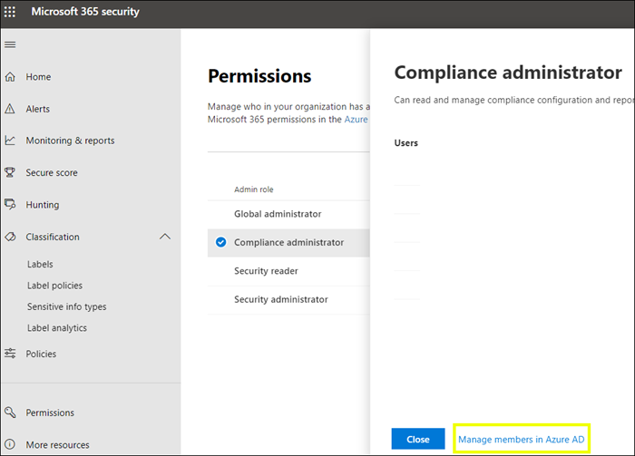
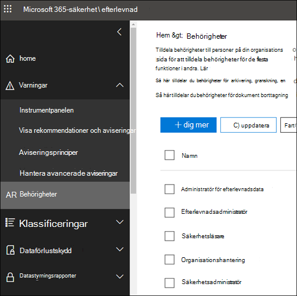

# Behörigheter i efterlevnadscentret i Microsoft 365 och säkerhetscentret i Microsoft 365Permissions in the Microsoft 365 compliance center and Microsoft 365 security center

[!INCLUDE [Microsoft 365 Defender rebranding](../includes/microsoft-defender-for-office.md)]

Din organisation behöver hantera säkerhets- och efterlevnadsscenarier som omfattar alla Microsoft 365-tjänster.Your organization needs to manage security and compliance scenarios that span all the Microsoft 365 services. Du behöver också flexibiliteten att ge rätt administratörsbehörigheter till rätt personer i din organisations IT-grupp.And you need the flexibility to give the right admin permissions to the right people in your organization's IT group. Med hjälp av Microsoft 365 Säkerhetscenter och Microsoft 365 Efterlevnadscenter kan du hantera behörigheter centralt för alla uppgifter som är relaterade till säkerhet och efterlevnad.By using the Microsoft 365 security center or Microsoft 365 compliance center, you can manage permissions centrally for all tasks related to security or compliance.

När den globala administratören har tilldelat dessa administratörsroller får administratörerna tillgång till funktioner och data som omfattar alla tjänster i Microsoft 365, t. ex. säkerhetscentret i Microsoft 365, efterlevnadscentret i Microsoft 365, Azure, Office 365 och Enterprise Mobility + Security.After the global administrator assigns these admin roles, the admins have access to features and data that span all services in Microsoft 365, such as the Microsoft 365 security center, Microsoft 365 compliance center, Azure, Office 365, and Enterprise Mobility + Security.

## Det här innebär Microsoft 365-rollernaWhat the Microsoft 365 roles are

De roller som visas i efterlevnadscentret i Microsoft 365 och säkerhetscentret i Microsoft 365 är Azure Active Directory-roller.The roles that appear in the Microsoft 365 compliance center and Microsoft 365 security center are Azure Active Directory roles. Rollerna är utformade för att passa ihop med jobbfunktioner i din organisations IT-grupp, vilket gör det enkelt att ge en person alla de behörigheter som krävs för att få jobbet gjort.These roles are designed to align with job functions in your organization's IT group, making it easy to give a person all the permissions necessary to get their job done.

****

|RollRole|BeskrivningDescription|
|---|---|
|**Global administratör****Global administrator**|Användare som har den här rollen har tillgång till alla administrativa funktioner i alla Microsoft 365-tjänster.Users with this role have access to all administrative features in all Microsoft 365 services. Det är bara globala administratörer som kan tilldela andra administratörsroller.Only global administrators can assign other administrator roles.|
|**Administratör för efterlevnadsdata****Compliance data administrator**|Användare som har den här rollen kan hålla reda på organisationens data i Microsoft 365, se till att de skyddas och få insikter om problem för att minska riskerna.Users with this role can keep track of your organization's data across Microsoft 365, make sure it's protected, and get insights into any issues to help mitigate risks.|
|**Efterlevnadsadministratör****Compliance administrator**|Användare som har den här rollen kan hjälpa din organisation att efterleva föreskrifter, hantera eDiscovery-ärenden och underhålla datastyrningsprinciper för Microsoft 365-platser, identiteter och appar.Users with this role can help your organization stay compliant with any regulatory requirements, manage eDiscovery cases, and maintain data governance policies across Microsoft 365 locations, identities, and apps.|
|**Säkerhetsoperatör****Security operator**|Användare som har den här rollen kan visa, undersöka och reagera på aktiva hot för dina Microsoft 365-användare, enheter och innehåll.Users with this role can view, investigate, and respond to active threats to your Microsoft 365 users, devices, and content.|
|**Säkerhetsläsare****Security reader**|Användare som har den här rollen kan visa och undersöka aktiva hot mot dina Microsoft 365-användare, enheter och innehåll, men (i motsats till säkerhetsoperatören) har de inte behörighet att svara genom att vidta åtgärder.Users with this role can view and investigate active threats to your Microsoft 365 users, devices, and content, but (unlike the Security operator) they do not have permissions to respond by taking action.|
|**Säkerhetsadministratör****Security administrator**|Användare som har den här rollen kan styra organisationens allmänna säkerhet genom att hantera säkerhetsprinciper, granska säkerhetsanalyser och -rapporter i Microsoft 365-produkter och hålla sig uppdaterade om hotet.Users with this role can control your organization's overall security by managing security policies, reviewing security analytics and reports across Microsoft 365 products, and staying up-to-speed on the threat landscape.|
|

## Det här har Microsoft 365-rollerna tillgång tillWhat the Microsoft 365 roles have access to

Här är de tillgängliga rollerna och vad personer som tilldelats rollerna kan göra.Here are the available roles and what people assigned to them can do.

### Global administratörGlobal administrator

Användare som har den här rollen har tillgång till alla administrativa funktioner i Azure Active Directory, liksom tjänster som använder Azure Active Directory-identiteter som säkerhetscentret i Microsoft 365, efterlevnadscentret i Microsoft 365, Exchange Online, SharePoint Online och Skype för företag – Online.Users with this role have access to all administrative features in Azure Active Directory, as well as services that use Azure Active Directory identities like Microsoft 365 security center, Microsoft 365 compliance center, Exchange Online, SharePoint Online, and Skype for Business Online. Personen som registrerar sig för Azure Active Directory-klienten blir global administratör.The person who signs up for the Azure Active Directory tenant becomes a global administrator. Det är bara globala administratörer som kan tilldela andra administratörsroller.Only global administrators can assign other administrator roles. Det kan finnas fler än en global administratör i företaget.There can be more than one global administrator at your company. Globala administratörer kan återställa lösenordet för valfri användare och alla andra administratörer.Global admins can reset the password for any user and all other administrators.

### EfterlevnadsadministratörCompliance administrator

Användare som har den här rollen har behörighet att hantera efterlevnadsrelaterade funktioner i Microsoft 365 Efterlevnadscenter, Administrationscenter för Microsoft 365, Azure och Säkerhets- och efterlevnadscenter.Users with this role have permissions to manage compliance-related features in the Microsoft 365 compliance center, Microsoft 365 admin center, Azure, and Security & Compliance Center. Användare kan även hantera alla funktioner i administrationscentret för Exchange och Administrationscenter för Teams och Skype för företag och skapa supportärenden för Azure och Microsoft 365.Users can also manage all features within the Exchange admin center and Teams & Skype for Business admin center and create support tickets for Azure and Microsoft 365.

****

|I den här tjänsten...In this service...|Kan efterlevnadsadministratören...The compliance administrator can...|
|---|---|
|[**Efterlevnadscentret i Microsoft 365****Microsoft 365 compliance center**](https://compliance.microsoft.com/)|Skydda och hantera organisationens data i Microsoft 365-tjänsterna.Protect and manage your organization's data across Microsoft 365 services.    Hantera aviseringar om efterlevnad.Manage compliance alerts.|
|[**Compliance Manager****Compliance Manager**](https://docs.microsoft.com/microsoft-365/compliance/compliance-manager)|Spåra, tilldela och verifiera organisationens aktiviteter för regelefterlevnad.Track, assign, and verify your organization's regulatory compliance activities.|
|[**Säkerhets- och efterlevnadscenter****Security & Compliance Center**](https://docs.microsoft.com/microsoft-365/admin/add-users/about-admin-roles)|Hantera datastyrning.Manage data governance.    Utföra rätts- och dataundersökningar.Perform legal and data investigation.    Hantera begäran från registrerad person.Manage Data Subject Request.|
|[**Intune****Intune**](https://docs.microsoft.com/intune/role-based-access-control)|Visa alla Intune-granskningsdata.View all Intune audit data.|
|[**Cloud App Security****Cloud App Security**](https://docs.microsoft.com/cloud-app-security/manage-admins)|Har skrivskyddad behörighet och kan hantera aviseringar.Has read-only permissions and can manage alerts.    Kan skapa och ändra filprinciper och tillåta åtgärder för filstyrning.Can create and modify file policies and allow file governance actions.    Kan visa alla inbyggda rapporter under datahantering.Can view all the built-in reports under Data Management.|
|

### Administratör för efterlevnadsdataCompliance data administrator

Användare som har den här rollen har behörighet att skydda och spåra data i efterlevnadscentret i Microsoft 365, Administrationscenter för Microsoft 365 och Azure.Users with this role have permissions to protect and track data in the Microsoft 365 compliance center, Microsoft 365 admin center, and Azure. Användare kan också hantera alla funktioner i Exchange administratörscenter, Compliance Manager och Teams och Skype for Business administratörscenter och skapa supportbiljetter för Azure och Microsoft 365.Users can also manage all features within the Exchange admin center, Compliance Manager, and Teams & Skype for Business admin center and create support tickets for Azure and Microsoft 365.

****

|I den här tjänsten...In this service...|Kan administratören för efterlevnadsdata...The compliance data administrator can...|
|---|---|
|[**Efterlevnadscentret i Microsoft 365****Microsoft 365 compliance center**](https://compliance.microsoft.com/)|Skydda och hantera organisationens data i Microsoft 365-tjänsterna.Protect and manage your organization's data across Microsoft 365 services.    Hantera aviseringar om efterlevnad.Manage compliance alerts.    Hantera känslighetsetiketterManage sensitivity labels|
|[**Compliance Manager****Compliance Manager**](https://docs.microsoft.com/microsoft-365/compliance/compliance-manager)|Spåra, tilldela och verifiera organisationens aktiviteter för regelefterlevnad.Track, assign, and verify your organization's regulatory compliance activities.|
|[**Säkerhets- och efterlevnadscenter****Security & Compliance Center**](https://docs.microsoft.com/microsoft-365/admin/add-users/about-admin-roles)|Hantera datastyrning.Manage data governance.    Utföra rätts- och dataundersökningar.Perform legal and data investigation.    Hantera begäran från registrerad person.Manage Data Subject Request.    Hantera känslighetsetiketterManage sensitivity labels|
|[**Intune**](https://docs.microsoft.com/intune/role-based-access-control) (kommer snart)[**Intune**](https://docs.microsoft.com/intune/role-based-access-control) (coming soon)|Visa alla Intune-granskningsdata.View all Intune audit data.|
|[**Cloud App Security****Cloud App Security**](https://docs.microsoft.com/cloud-app-security/manage-admins)|Använda läsbehörigheter för att visa information.Use read-only permissions to view information.  Hantera aviseringar.Manage alerts.    Skapa och ändra filprinciper och tillåta åtgärder för filstyrning.Create and modify file policies and allow file governance actions.    Visa alla inbyggda rapporter under datahantering.View all the built-in reports under Data Management.|
|

### SäkerhetsadministratörSecurity administrator

Användare som har den här rollen har behörighet att hantera säkerhetsrelaterade funktioner i Microsoft 365 Säkerhetscenter, Azure Active Directory Identity Protection, Azure Information Protection och Säkerhets- och efterlevnadscenter.Users with this role have permissions to manage security-related features in the Microsoft 365 security center, Azure Active Directory Identity Protection, Azure Information Protection, and Security & Compliance Center.

****

|I den här tjänsten...In this service...|Kan säkerhetsadministratören...The security administrator can...|
|---|---|
|[**Microsoft 365 Säkerhetscenter****Microsoft 365 security center**](https://security.microsoft.com/)|Övervaka säkerhetsrelaterade principer i Microsoft 365-tjänster.Monitor security-related policies across Microsoft 365 services.     Hantera säkerhetshot och aviseringar.Manage security threats and alerts.    Visa rapporter.View reports.    Hantera känslighetsetiketter.Manage sensitivity labels.|
|**Identity Protection Center****Identity Protection Center**|Utföra allt som säkerhetsläsarrollen kan samt utföra alla åtgärder i Identity Protection Center, utom att återställa lösenord.Do everything the Security Reader role can, plus  perform all Identity Protection Center operations, except for reset passwords.|
|[**Priviligierad identitetshantering****Privileged Identity Management**](https://docs.microsoft.com/azure/active-directory/privileged-identity-management/pim-configure)|Utföra allt som säkerhetsläsarrollen kan.Do everything the Security Reader role can.    **Kan inte** hantera rolltilldelningar och inställningar för Azure AD.**Cannot** manage Azure AD role assignments or settings.|
|[**Säkerhets- och efterlevnadscenter****Security & Compliance Center**](https://docs.microsoft.com/microsoft-365/admin/add-users/about-admin-roles)|Hantera säkerhetsprinciper.Manage security policies.    Visa, undersöka och reagera på säkerhetshotView, investigate, and respond to security threats    Visa rapporter.View reports.    Hantera känslighetsetiketter.Manage sensitivity labels.|
|**Azure Advanced Threat Protection****Azure Advanced Threat Protection**|Övervaka och svara på misstänkt säkerhetsaktivitet.Monitor and respond to suspicious security activity.|
|**Windows Defender ATP och EDR****Windows Defender ATP and EDR**|Tilldela roller.Assign roles.    Hantera datorgrupper.Manage machine groups.    Konfigurera identifiering av slutpunktshot och automatisk reparation.Configure endpoint threat detection and automated remediation.    Visa, undersöka och reagera på aviseringar.View, investigate, and respond to alerts.|
|[**Intune****Intune**](https://docs.microsoft.com/intune/role-based-access-control)|Visar information om användare, enheter, registrering, konfiguration och program.Views user, device, enrollment, configuration, and application information.    **Kan inte** göra ändringar i Intune.**Cannot** make changes to Intune.|
|[**Cloud App Security****Cloud App Security**](https://docs.microsoft.com/cloud-app-security/manage-admins)|Lägga till administratörer, lägga till principer och inställningar, ladda upp loggar och utföra styrningsåtgärder.Add admins, add policies and settings, upload logs and perform governance actions.|
|[**Azure Security Center**](https://docs.microsoft.com/azure/role-based-access-control/built-in-roles) (kommer snart)[**Azure Security Center**](https://docs.microsoft.com/azure/role-based-access-control/built-in-roles) (coming soon)|Visa säkerhetsprinciper, visa säkerhetstillstånd, redigera säkerhetsprinciper, visa aviseringar och rekommendationer, stänga av varningar och rekommendationer.View security policies, view security states, edit security policies, view alerts and recommendations, dismiss alerts and recommendations.|
|[**Office 365-tjänststatus****Office 365 service health**](https://docs.microsoft.com/microsoft-365/enterprise/view-service-health)|Visa status för Office 365-tjänster.View the health of Office 365 services.|
|

### SäkerhetsoperatörSecurity operator

Användare som har den här rollen kan hantera aviseringar och har global skrivskyddad åtkomst till säkerhetsrelaterade funktioner, inklusive all information i Microsoft 365 Säkerhetscenter, Azure Active Directory, Identity Protection, Privileged Identity Management och möjlighet att läsa Azure Active Directory-inloggningsrapporter och granskningsloggar samt i Säkerhets- och efterlevnadscenter.Users with this role can manage alerts and have global read-only access on security-related feature, including all information in the Microsoft 365 security center, Azure Active Directory, Identity Protection, Privileged Identity Management, as well as the ability to read Azure Active Directory sign-in reports and audit logs, and in Security & Compliance Center.

****

|I den här tjänsten...In this service...|Kan säkerhetsoperatören...The security operator can...|
|---|---|
|[**Microsoft 365 Säkerhetscenter****Microsoft 365 security center**](https://security.microsoft.com/)|Utföra allt som säkerhetsläsarrollen kan.Do everything the Security Reader role can.    Visa, undersöka och reagera på säkerhetshot.View, investigate, and respond to security alerts.|
|**Identity Protection Center** (kommer snart)**Identity Protection Center** (coming soon)|Utföra allt som säkerhetsläsarrollen kan.Do everything the Security Reader role can.|
|[**Priviligierad identitetshantering****Privileged Identity Management**](https://docs.microsoft.com/azure/active-directory/privileged-identity-management/pim-configure)|Utföra allt som säkerhetsläsarrollen kan.Do everything the Security Reader role can.|
|[**Säkerhets- och efterlevnadscenter****Security & Compliance Center**](https://docs.microsoft.com/microsoft-365/admin/add-users/about-admin-roles)|Utföra allt som säkerhetsläsarrollen kan.Do everything the Security Reader role can.    Visa, undersöka och reagera på säkerhetshotView, investigate, and respond to security threats|
|**Windows Defender ATP och EDR****Windows Defender ATP and EDR**|Utföra allt som säkerhetsläsarrollen kan.Do everything the Security Reader role can.    Visa, undersöka och reagera på aviseringar.View, investigate, and respond to alerts.|
|[**Intune****Intune**](https://docs.microsoft.com/intune/role-based-access-control)|Visar information om användare, enheter, registrering, konfiguration och program.Views user, device, enrollment, configuration, and application information.    **Kan inte** göra ändringar i Intune.**Cannot** make changes to Intune.|
|[**Cloud App Security****Cloud App Security**](https://docs.microsoft.com/cloud-app-security/manage-admins)|Utföra allt som säkerhetsläsarrollen kan, plus visa och stänga av varningar.Do everything the Security Reader role can, plus view and dismiss alerts.|
|[**Office 365-tjänststatus****Office 365 service health**](https://docs.microsoft.com/microsoft-365/enterprise/view-service-health)|Visa status för Office 365-tjänster.View the health of Office 365 services.|
|

### SäkerhetsläsareSecurity reader

Användare som har den här rollen har global skrivskyddad åtkomst till säkerhetsrelaterade funktioner, inklusive all information i Microsoft 365 Säkerhetscenter, Azure Active Directory, Identity Protection, Privileged Identity Management och möjlighet att läsa Azure Active Directory-inloggningsrapporter och granskningsloggar samt i Säkerhets- och efterlevnadscenter.Users with this role have global read-only access on security-related feature, including all information in the Microsoft 365 security center, Azure Active Directory, Identity Protection, Privileged Identity Management, as well as the ability to read Azure Active Directory sign-in reports and audit logs, and in Security & Compliance Center.

****

|I den här tjänsten...In this service...|Kan säkerhetsläsaren...The security reader can...|
|---|---|
|[**Microsoft 365 Säkerhetscenter****Microsoft 365 security center**](https://security.microsoft.com/)|Visa säkerhetsrelaterade principer i Microsoft 365-tjänster.View security-related policies across Microsoft 365 services.    Visa säkerhetshot och aviseringar.View security threats and alerts.    Visa rapporter.View reports.|
|**Identity Protection Center****Identity Protection Center**|Läsa alla säkerhetsrapporter och inställningsinformation för säkerhetsfunktioner: skydd mot skräppost, kryptering, skydd mot dataförlust (DLP), skydd mot skadlig programvara, avancerat hotskydd (ATP), skydd mot nätfiske och regler för e-postflöde (kallas även för transportregler).Read all security reports and settings information for security features: anti-spam, encryption, data loss prevention (DLP), anti-malware, Advanced Threat Protection (ATP), anti-phishing, and mail flow rules (also known as transport rules).|
|[**Priviligierad identitetshantering****Privileged Identity Management**](https://docs.microsoft.com/azure/active-directory/privileged-identity-management/pim-configure)|Använda skrivskyddad åtkomst för att visa all information som finns i Azure AD PIM: principer och rapporter för Azure AD-resurstilldelningar, säkerhetsgranskningar och (i framtiden) principdata och -rapporter för andra scenarier än rolltilldelning i Azure AD.Use read-only access to view all information surfaced in Azure AD PIM: Policies and reports for Azure AD role assignments, security reviews, and (in the future) policy data and reports for scenarios other than Azure AD role assignment.    **Kan inte** registrera sig för Azure AD PIM eller göra ändringar i tjänsten.**Cannot** sign up for Azure AD PIM or make any changes to it. I PIM-portalen eller via PowerShell kan någon med den här rollen aktivera ytterligare roller (till exempel global administratör eller administratör för privilegierad roll), om användaren är behörig.In the PIM portal or via PowerShell, someone in this role can activate additional roles (for example, Global Admin or Privileged Role Administrator), if the user is a eligible for them.|
|[**Säkerhets- och efterlevnadscenter****Security & Compliance Center**](https://docs.microsoft.com/microsoft-365/admin/add-users/about-admin-roles)|Visa säkerhetsprinciper.View security policies.    Visa och undersöka säkerhetshot.View and investigate security threats.    Visa rapporter.View reports.|
|**Windows Defender ATP och EDR****Windows Defender ATP and EDR**|Visa och undersöka varningar.View and investigate alerts.|
|[**Intune****Intune**](https://docs.microsoft.com/intune/role-based-access-control)|Visar information om användare, enheter, registrering, konfiguration och program.Views user, device, enrollment, configuration, and application information.    **Kan inte** göra ändringar i Intune.**Cannot** make changes to Intune.|
|[**Cloud App Security****Cloud App Security**](https://docs.microsoft.com/cloud-app-security/manage-admins)|Använda läsbehörigheter för att visa information.Use read-only permissions to view information.    Hantera aviseringar.Manage alerts.|
|[**Azure Security Center****Azure Security Center**](https://docs.microsoft.com/azure/role-based-access-control/built-in-roles)|Visa rekommendationer och aviseringar.View recommendations and alerts.    Visa säkerhetsprinciper.View security policies.    Visa säkerhets tillstånd, men kan inte göra ändringar.View security states, but cannot make changes.|
|[**Office 365-tjänststatus****Office 365 service health**](https://docs.microsoft.com/microsoft-365/enterprise/view-service-health)|Visa status för Office 365-tjänster.View the health of Office 365 services.|
|

## Globala administratörer kan hantera roller i Azure Active DirectoryGlobal administrators can manage roles in Azure Active Directory

I efterlevnadscentret i Microsoft 365 och Microsoft 365 Säkerhetscenter kan du se rollens uppgifter när du väljer en roll.In the Microsoft 365 compliance center and Microsoft 365 security center, when you select a role, you can view its assignments. För att kunna hantera de uppgifterna måste du dock gå till Azure Active Directory.But to manage those assignments, you need to go to the Azure Active Directory.

Mer information finns i [Visa och tilldela administratörsroller i Azure Active Directory](https://docs.microsoft.com/azure/active-directory/users-groups-roles/directory-manage-roles-portal).For more information, see [View and assign administrator roles in Azure Active Directory](https://docs.microsoft.com/azure/active-directory/users-groups-roles/directory-manage-roles-portal).

## Hantera roller i en tjänst istället för i Azure Active DirectoryManaging roles in a service instead of Azure Active Directory

De roller som visas i efterlevnadscentret i Microsoft 365 och säkerhetscentret i Microsoft 365 visas också i de tjänster där de har behörigheter.The roles that appear in the Microsoft 365 compliance center and Microsoft 365 security center also appear in the services where they have permissions. Du kan till exempel se de här rollerna i Säkerhets- och efterlevnadscenter.For example, you can see these roles in the Security & Compliance Center.

### Bryta arvBreaking inheritance

När du hanterar de här rollerna i Azure Active Directory är det viktigt att du förstår att du gör det centralt för **alla** Microsoft 365-tjänster.It's important to understand that you when you manage these roles in Azure Active Directory, you're doing so centrally for **all** Microsoft 365 services. När du hanterar en roll i en specifik tjänst, till exempel Säkerhets- och efterlevnadscenter, hanterar du **enbart** rollen för den angivna tjänsten.However, when you manage a role in a specific service, such as the Security & Compliance Center, you're managing the role for **only** that specific service. Uppgifter och behörigheter för en roll i en tjänst åsidosätter alla behörigheter som har tilldelats Azure Active Directory-rollen.The assignments and permissions for a role in a service override any permissions granted to the Azure Active Directory role.

Det här kan vara användbart t. ex. om en person har tilldelats rollen som säkerhetsadministratör men saknar behörighet att hantera händelser.This can be useful – for example, if a person is assigned to the Security administrator role, they don't have permissions to manage incidents. Du kan också använda behörigheterna i Windows Defender Avancerat skydd för att ge dem särskild behörighet för hantering av händelser i den aktuella tjänsten.But you can use the permissions in Windows Defender Advanced Threat Protection to give them the specific permission for incident management in that service.

## Här hittar du rollinformation för respektive Microsoft 365-tjänstWhere to find role information for each Microsoft 365 service

Genom att tilldela en användare någon av rollerna som efterlevnads- eller säkerhetsadministratör i Microsoft 365, ger du användaren behörighet till en uppsättning Microsoft 365-tjänster.By assigning a user to one of the Microsoft 365 compliance or security admin roles, you give that user permissions to a range of Microsoft 365 services. Använd länkarna nedan om du vill ha mer information om de olika behörigheterna för en roll i respektive tjänst.Use the links below to find more information about the specific permissions for a role in each service.

****

|Microsoft 365-tjänstenMicrosoft 365 service|RollinformationRole info|
|---|---|
|Administratörsroller i Office 365 och Microsoft 365 Business-abonnemangAdmin roles in Office 365 and Microsoft 365 for business plans|[Administratörsroller i Microsoft 365Microsoft 365 admin roles](https://docs.microsoft.com/microsoft-365/admin/add-users/about-admin-roles?view=o365-worldwide)|
|Azure Active Directory (Azure AD) och Azure AD-identitetsskyddAzure Active Directory (Azure AD) and Azure AD Identity Protection|[Administratörsroller för Azure ADAzure AD admin roles](https://docs.microsoft.com/azure/active-directory/users-groups-roles/directory-assign-admin-roles)|
|Azure Advanced Threat ProtectionAzure Advanced Threat Protection|[Azure ATP-rollgrupperAzure ATP role groups](https://docs.microsoft.com/azure-advanced-threat-protection/atp-role-groups)|
|Azure Information ProtectionAzure Information Protection|[Administratörsroller för Azure ADAzure AD admin roles](https://docs.microsoft.com/azure/active-directory/users-groups-roles/directory-assign-admin-roles)|
|EfterlevnadshanterarenCompliance Manager|[Compliance ManagerCompliance Manager](https://docs.microsoft.com/microsoft-365/compliance/compliance-manager-setup#set-user-permissions-and-assign-roles)|
|Exchange OnlineExchange Online|[Rollbaserad åtkomstkontroll i ExchangeExchange role-based access control](https://docs.microsoft.com/exchange/understanding-role-based-access-control-exchange-2013-help)|
|IntuneIntune|[Rollbaserad åtkomstkontroll i IntuneIntune role-based access control](https://docs.microsoft.com/intune/role-based-access-control)|
|Hanterat skrivbordManaged Desktop|[Administratörsroller för Azure ADAzure AD admin roles](https://docs.microsoft.com/azure/active-directory/users-groups-roles/directory-assign-admin-roles)|
|Microsoft Cloud App SecurityMicrosoft Cloud App Security|[Rollbaserad åtkomstkontrollRole-based access control](https://docs.microsoft.com/cloud-app-security/manage-admins)|
|Säkerhets- och efterlevnadscenterSecurity & Compliance Center|[Administratörsroller i Microsoft 365Microsoft 365 admin roles](permissions-in-the-security-and-compliance-center.md)|
|Priviligierad identitetshanteringPrivileged Identity Management|[Administratörsroller för Azure ADAzure AD admin roles](https://docs.microsoft.com/azure/active-directory/users-groups-roles/directory-assign-admin-roles)|
|SäkerhetspoängSecure Score|[Administratörsroller för Azure ADAzure AD admin roles](https://docs.microsoft.com/azure/active-directory/users-groups-roles/directory-assign-admin-roles)|
|SharePoint OnlineSharePoint Online|[Administratörsroller för Azure ADAzure AD admin roles](https://docs.microsoft.com/azure/active-directory/users-groups-roles/directory-assign-admin-roles)    [Om SharePoint-administratörsrollen i Office 365About the SharePoint admin role in Office 365](https://docs.microsoft.com/sharepoint/sharepoint-admin-role)|
|Teams/Skype för företagTeams/Skype for Business|[Administratörsroller för Azure ADAzure AD admin roles](https://docs.microsoft.com/azure/active-directory/users-groups-roles/directory-assign-admin-roles)|
|Windows Defender – avancerat skydd mot hotWindows Defender Advanced Threat Protection|[Rollbaserad åtkomstkontroll för Windows Defender ATPWindows Defender ATP role-based access control](https://docs.microsoft.com/windows/security/threat-protection/windows-defender-atp/rbac-windows-defender-advanced-threat-protection)|
|

## Det här kommer snartWhat is coming soon

Vi arbetar fortfarande med behörigheter i efterlevnadscentret i Microsoft 365 och säkerhetscentret i Microsoft 365.We're still working on permissions in the Microsoft 365 compliance center and Microsoft 365 security center. Till exempel arbetar vi just nu med support för att:For example, we're currently working on support for the ability to:

- Hantera roller i efterlevnadscentret i Microsoft 365 och säkerhetscentret i Microsoft 365, i stället för att gå till Azure Active Directory.Manage roles in the Microsoft 365 compliance center and Microsoft 365 security center, instead of going to Azure Active Directory.

- Anpassa roller genom att lägga till eller ta bort vissa behörigheter.Customize roles by adding or removing specific permissions.

- Skapa anpassade roller med behörigheter som du väljer.Create custom roles with permissions that you choose.
