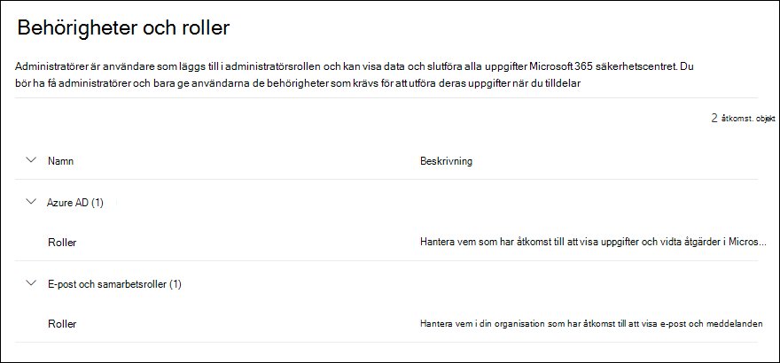

# Behörigheter på Microsoft 365 Defender-portalen

[!INCLUDE [Microsoft 365 Defender rebranding](../includes/microsoft-defender-for-office.md)]

**Gäller för**
- [Exchange Online Protection](exchange-online-protection-overview.md)
- [Microsoft Defender för Office 365 Abonnemang 1 och Abonnemang 2](defender-for-office-365.md)
- [Microsoft 365 Defender](../defender/microsoft-365-defender.md)

Du måste hantera säkerhetsscenarier som sträcker sig över alla Microsoft 365-tjänster. Du behöver också flexibiliteten att ge rätt administratörsbehörigheter till rätt personer i din organisation.

Microsoft 365 Defender-portalen i <https://security.microsoft.com> direkt stödjer hanteringsbehörigheter direkt för användare som utför säkerhetsuppgifter i Microsoft 365. Du kan hantera behörigheter centralt för alla uppgifter som är relaterade till säkerhet med hjälp av Microsoft 365 Defender-portalen för hantering av behörigheter.

Om du vill hantera behörigheter i Microsoft 365 Defender-portalen går du till **Behörigheter och roller** eller <https://security.microsoft.com/securitypermissions>. Du måste vara en **global administratör** eller medlem i rollgruppen **Organisationschef** i Microsoft 365 Defender-portalen. Närmare bestämt, med rollen **Chefsroll** kan användarna visa, skapa och ändra rollgrupper i Microsoft 365 Defender-portalen. Som standard är den rollen endast tilldelad rollgruppen **Organisationschef**.

> [!NOTE]
> Mer information om behörigheter i Microsoft 365 Efterlevnadscenter finns [Behörigheter i Microsoft 365 Efterlevnadscentret](../../compliance/microsoft-365-compliance-center-permissions.md).

## Relationen mellan medlemmar, roller och rollgrupper

Behörigheterna i Microsoft 365 Defender-portalen baseras på RBAC-behörighetsmodellen (Role-Based Access Control). RBAC är samma behörighetsmodell som används av de flesta Microsoft 365-tjänster. Om du är bekant med behörighetsstrukturen i dessa tjänster kommer beviljande av behörigheter i Microsoft 365 Defender-portalen att vara mycket bekant.

En **roll** ger behörigheter att utföra en uppsättning uppgifter.

En **rollgrupp** är en uppsättning roller som gör att personer kan göra sina jobb i Microsoft 365 Defender-portalen. Till exempel inkluderar rollgruppen Administratörer för Angreppssimulator administratörsrollen för att skapa och hantera alla aspekter av en angreppssimuleringsutbildning.

Microsoft 365 Defender-portalen inkluderar standardrollgrupper för de vanligaste uppgifter och funktioner som du måste tilldela. I allmänhet rekommenderar vi att du bara lägger till enskilda användare som **medlemmar** till standardrollgrupperna.

## Roller och rollgrupper i Microsoft 365 Defender-portalen

Följande typer av roller och rollgrupper är tillgängliga i **Behörigheter och roller** i Microsoft 365 Defender-portalen:

- **Azure AD-roller**: Du kan visa roller och tilldelade användare, men du kan inte hantera dem direkt i Microsoft 365 Defender-portalen. Azure AD-roller är centrala roller som tilldelar behörigheter till **alla** Microsoft 365-tjänster.

- **E-post och samarbetsroller**: Det här är samma rollgrupper som är tillgängliga i Säkerhets- och efterlevnadscenter, men du kan hantera dem direkt i Microsoft 365 Defender-portalen. De behörigheter som du tilldelar här är specifika för Microsoft 365 Defender-portalen, Microsoft 365 Efterlevnadscenter och Säkerhets- och efterlevnadscenter, och omfattar inte alla behörigheter som krävs i andra Microsoft 365-arbetsbelastningar.

### Azure AD-roller i administrationscentret för Microsoft 365 Defender-portalen

När du går till **E-post- och samarbetsroller** \> **Behörigheter och roller** \> **Azure AD-roller** \> **Roller** (eller direkt till <https://security.microsoft.com/aadpermissions>) visas Azure AD-rollerna som beskrivs i det här avsnittet.

När du väljer en roll visas en utfällbar meny med detaljer som innehåller rollens beskrivning och användartilldelningarna. Men om du vill hantera de tilldelningar måste du klicka på **Hantera medlemmar i Azure AD** i den utfällbar menyn med information.

Mer information finns i [Visa och tilldela administratörsroller i Azure Active Directory](/azure/active-directory/users-groups-roles/directory-manage-roles-portal).

 

****

|Roll|Beskrivning|
|---|---|
|**Global administratör**|Användare som har den här rollen har tillgång till alla administrativa funktioner i alla Microsoft 365-tjänster. Det är bara globala administratörer som kan tilldela andra administratörsroller. Mer information finns i [Global administratör / företagsadministratör](/azure/active-directory/roles/permissions-reference#global-administrator--company-administrator).|
|**Administratör för efterlevnadsdata**|Användare som har den här rollen kan hålla reda på organisationens data i Microsoft 365, se till att de skyddas och få insikter om problem för att minska riskerna. Mer information finns i [Administratör för efterlevnadsdata](/azure/active-directory/roles/permissions-reference#compliance-data-administrator).|
|**Efterlevnadsadministratör**|Användare som har den här rollen kan hjälpa din organisation att efterleva föreskrifter, hantera eDiscovery-ärenden och underhålla datastyrningsprinciper för Microsoft 365-platser, identiteter och appar. Mer information finns i[ Efterlevnadsadministratör](/azure/active-directory/roles/permissions-reference#compliance-administrator).|
|**Säkerhetsoperatör**|Användare som har den här rollen kan visa, undersöka och reagera på aktiva hot för dina Microsoft 365-användare, enheter och innehåll. Mer information finns i [säkerhetsoperatören](/azure/active-directory/roles/permissions-reference#security-operator).|
|**Säkerhetsläsare**|Användare som har den här rollen kan visa och undersöka aktiva hot mot dina Microsoft 365-användare, enheter och innehåll, men (i motsats till säkerhetsoperatören) har de inte behörighet att svara genom att vidta åtgärder. Mer information finns i [Säkerhetsläsare](/azure/active-directory/roles/permissions-reference#security-reader).|
|**Säkerhetsadministratör**|Användare som har den här rollen kan styra organisationens allmänna säkerhet genom att hantera säkerhetsprinciper, granska säkerhetsanalyser och -rapporter i Microsoft 365-produkter och hålla sig uppdaterade om hotet. Mer information finns i [Säkerhetsadministratör](/azure/active-directory/roles/permissions-reference#security-administrator).|
|**Global läsare**|Den skrivskyddade versionen av rollen **Global administratör**. Visa alla inställningar och administrativ information i Microsoft 365. Mer information finns i[ Global läsare](/azure/active-directory/roles/permissions-reference#global-reader).|
|**Administratör för angreppssimulering**|Skapa och hantera alla aspekter av [angreppssimulering](attack-simulation-training.md). Skapande, start/schemaläggning av en simulering och granskning av resultat. Mer information finns i [Administratör för angreppssimulering](/azure/active-directory/roles/permissions-reference#attack-simulation-administrator).|
|**Författare av angreppets nyttolast**|Skapa angreppsnyttolaster, men faktiskt inte starta eller schemalägg dem. Mer information finns i [Författare av angreppets nyttolast](/azure/active-directory/roles/permissions-reference#attack-payload-author).|
|

### E-post och samarbetsroller i Microsoft 365 Defender-portalen

När du går till **E-post- och samarbetsroller** \> **Behörigheter och roller** \> **E-post och samarbetsroller** \> **Roller** (eller direkt till <https://security.microsoft.com/emailandcollabpermissions>) visas samma rollgrupper som finns i Säkerhets- och efterlevnadscenter.

Fullständig information om dessa rollgrupper finns i [Behörigheter i Säkerhets- och efterlevnadscentret](permissions-in-the-security-and-compliance-center.md)

#### Modifiera e-post och medlemskap i samarbetsroller i Microsoft 365 Defender-portalen

1. I Microsoft 365 Defender-portalen, gå till **E-post- och samarbetsroller** \> **Behörigheter och roller** \> **E-post- och samarbetsroller** \> **Roller**.

2. I sidan **Behörigheter** som öppnas välj den rollgrupp som du vill ändra i listan. Du kan klicka på kolumnrubriken **Namn** för att sortera listan efter namn, eller så kan du klicka på **Sök**  för att hitta rollgruppen.

3. I den utfällbara menyn med rollgruppsinformationen som visas klickar du på **Redigera** i avsnittet **Medlemmar**.

4. I sidan **Redigera/välja medlemmar** som visas gör du något av följande:
   - Om det inte finns några rollgruppsmedlemmar klickar du på **Välj medlemmar**.
   - Om det finns befintliga rollgruppsmedlemmar klickar du på **Redigera**.

5. I den utfällbara menyn **Välj medlemmar** som visas gör du något av följande:

   - Klicka på **Lägg till**. Markera en eller flera användare i listan över användare som visas. Eller så kan du klicka på **Sök**  för att hitta och välja användare.

     När du väl har markerat de användare som du vill lägga till klickar du på **Lägg till**.

   - Klicka på **Ta bort**. Markera en eller flera av de befintliga medlemmarna. Eller så kan du klicka på **Sök**  för att hitta och välja medlemmar.

     När du väl har markerat de användare som du vill ta bort klickar du på **Ta bort**.

6. Tillbaka på den utfällbara menyn **Välj medlemmar** klickar du på **Klar**.

7. Tillbaka på sidan **Redigera/välja medlemmar** klickar du på **Spara**.

8. Tillbaka på den utfällbara menyn Rollgruppsinformation klickar du på **Klar**.
