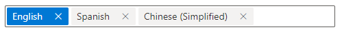
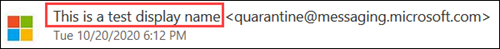
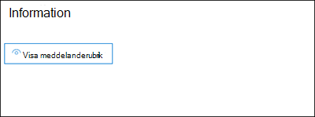
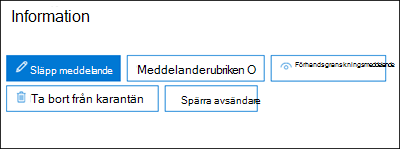
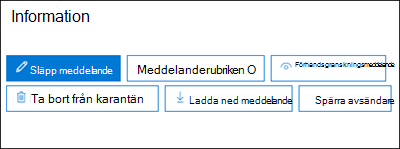

# <a name="quarantine-tags"></a><span data-ttu-id="b9962-103">Karantän koder</span><span class="sxs-lookup"><span data-stu-id="b9962-103">Quarantine tags</span></span>

> [!NOTE]
> <span data-ttu-id="b9962-104">De funktioner som beskrivs i den här artikeln är för närvarande i för hands versionen, är inte tillgängliga för alla och kan komma att ändras.</span><span class="sxs-lookup"><span data-stu-id="b9962-104">The features that are described in this article are currently in Preview, aren't available to everyone, and are subject to change.</span></span>

<span data-ttu-id="b9962-105">Med karantän-Taggar i Exchange Online Protection (EOP) kan administratörer kontrol lera vilka användare som kan göra till sina karantän meddelanden baserat på hur meddelandet kom i karantän.</span><span class="sxs-lookup"><span data-stu-id="b9962-105">Quarantine tags in Exchange Online Protection (EOP) allow admins to control what users are able to do to their quarantined messages based on how the message arrived in quarantine.</span></span>

<span data-ttu-id="b9962-106">EOP har traditionellt tillåtit eller förhindrat vissa interaktivitet för meddelanden i [karantän](find-and-release-quarantined-messages-as-a-user.md) och [aviseringar om slutanvändare](use-spam-notifications-to-release-and-report-quarantined-messages.md).</span><span class="sxs-lookup"><span data-stu-id="b9962-106">EOP has traditionally allowed or prevented certain levels of interactivity for messages in [quarantine](find-and-release-quarantined-messages-as-a-user.md) and in [end-user spam notifications](use-spam-notifications-to-release-and-report-quarantined-messages.md).</span></span> <span data-ttu-id="b9962-107">Slutanvändare kan till exempel se och släppa meddelanden som satts i karantän av filtrering som skräp post eller bulk, men de kan inte Visa eller släppa meddelanden som satts i karantän som nätfiske med hög exakthet.</span><span class="sxs-lookup"><span data-stu-id="b9962-107">For example, end-users can view and release messages that were quarantined by anti-spam filtering as spam or bulk, but they can't view or release messages that were quarantined as high confidence phishing.</span></span>

<span data-ttu-id="b9962-108">För [skydds funktioner som stöds](#step-2-assign-a-quarantine-tag-to-supported-features)kan du ange vilka användare som får göra-meddelanden och i sina karantän meddelanden i karantän (meddelanden där användaren är en mottagare).</span><span class="sxs-lookup"><span data-stu-id="b9962-108">For [supported protection features](#step-2-assign-a-quarantine-tag-to-supported-features), quarantine tags specify what users are allowed to do in end-user spam notification messages and in their quarantined messages in quarantine (messages where the user is a recipient).</span></span> <span data-ttu-id="b9962-109">Standard karantän koder tilldelas automatiskt för att påtvinga de historiska funktionerna för slutanvändare i karantän meddelanden.</span><span class="sxs-lookup"><span data-stu-id="b9962-109">Default quarantine tags are automatically assigned to enforce the historical capabilities for end-users on quarantined messages.</span></span> <span data-ttu-id="b9962-110">Eller så kan du skapa och tilldela egna karantän koder för att tillåta eller förhindra att slutanvändare utför vissa åtgärder i karantän meddelanden.</span><span class="sxs-lookup"><span data-stu-id="b9962-110">Or, you can create and assign custom quarantine tags to allow or prevent end-users from performing specific actions on quarantined messages.</span></span>

<span data-ttu-id="b9962-111">De enskilda behörigheterna kombineras till följande förvalda behörighets grupper:</span><span class="sxs-lookup"><span data-stu-id="b9962-111">The individual permissions are combined into the following preset permission groups:</span></span>

- <span data-ttu-id="b9962-112">Ingen åtkomst</span><span class="sxs-lookup"><span data-stu-id="b9962-112">No access</span></span>
- <span data-ttu-id="b9962-113">Begränsad åtkomst</span><span class="sxs-lookup"><span data-stu-id="b9962-113">Limited access</span></span>
- <span data-ttu-id="b9962-114">Full åtkomst</span><span class="sxs-lookup"><span data-stu-id="b9962-114">Full access</span></span>

<span data-ttu-id="b9962-115">De tillgängliga enskilda behörigheterna och vad som ingår eller inte ingår i de förinställda behörighets grupperna beskrivs i följande tabell:</span><span class="sxs-lookup"><span data-stu-id="b9962-115">The available individual permissions and what's included or not included in the preset permission groups are described in the following table:</span></span>

|<span data-ttu-id="b9962-116">Tillåtelse</span><span class="sxs-lookup"><span data-stu-id="b9962-116">Permission</span></span>|<span data-ttu-id="b9962-117">Ingen åtkomst</span><span class="sxs-lookup"><span data-stu-id="b9962-117">No access</span></span>|<span data-ttu-id="b9962-118">Begränsad åtkomst</span><span class="sxs-lookup"><span data-stu-id="b9962-118">Limited access</span></span>|<span data-ttu-id="b9962-119">Full åtkomst</span><span class="sxs-lookup"><span data-stu-id="b9962-119">Full access</span></span>|
|---|:---:|:---:|:---:|
|<span data-ttu-id="b9962-120">**Tillåt avsändare** ( _PermissionToAllowSender_ )</span><span class="sxs-lookup"><span data-stu-id="b9962-120">**Allow sender** ( _PermissionToAllowSender_ )</span></span>||||
|<span data-ttu-id="b9962-122">**Spärra avsändare** ( _PermissionToBlockSender_ )</span><span class="sxs-lookup"><span data-stu-id="b9962-122">**Block sender** ( _PermissionToBlockSender_ )</span></span>||||
|<span data-ttu-id="b9962-125">**Ta bort** ( _PermissionToDelete_ )</span><span class="sxs-lookup"><span data-stu-id="b9962-125">**Delete** ( _PermissionToDelete_ )</span></span>||||
|<span data-ttu-id="b9962-128">**Förhandsgranska** ( _PermissionToPreview_ )</span><span class="sxs-lookup"><span data-stu-id="b9962-128">**Preview** ( _PermissionToPreview_ )</span></span>||||
|<span data-ttu-id="b9962-131">**Tillåt att mottagare släpper ett meddelande från karantän** ( _PermissionToRelease_ )</span><span class="sxs-lookup"><span data-stu-id="b9962-131">**Allow recipients to release a message from quarantine** ( _PermissionToRelease_ )</span></span>||||
|<span data-ttu-id="b9962-133">**Tillåt mottagare att begära att ett meddelande släpps från karantän** ( _PermissionToRequestRelease_ )</span><span class="sxs-lookup"><span data-stu-id="b9962-133">**Allow recipients to request a message to be released from quarantine** ( _PermissionToRequestRelease_ )</span></span>||||
|

<span data-ttu-id="b9962-135">Om du inte gillar standard behörigheterna i gruppen för förvalda behörigheter kan du använda anpassade behörigheter när du skapar eller ändrar egna karantän koder.</span><span class="sxs-lookup"><span data-stu-id="b9962-135">If you don't like the default permissions in the preset permission groups, you can use custom permissions when you create or modify custom quarantine tags.</span></span> <span data-ttu-id="b9962-136">Mer information om vad de här behörigheterna gör finns i avsnittet [behörighets information om karantänen](#quarantine-tag-permission-details) längre fram i den här artikeln.</span><span class="sxs-lookup"><span data-stu-id="b9962-136">For more information about what each permission does, see the [Quarantine tag permission details](#quarantine-tag-permission-details) section later in this article.</span></span>

<span data-ttu-id="b9962-137">Du skapar och tilldelar karantän koder i säkerhets & efterföljandekrav eller i PowerShell (Exchange Online PowerShell för Microsoft 365-organisationer med Exchange Online-postlådor, fristående EOP PowerShell in EOP-organisationer utan Exchange Online-postlådor).</span><span class="sxs-lookup"><span data-stu-id="b9962-137">You create and assign quarantine tags in the Security & Compliance Center or in PowerShell (Exchange Online PowerShell for Microsoft 365 organizations with Exchange Online Mailboxes; standalone EOP PowerShell in EOP organizations without Exchange Online mailboxes).</span></span>

## <a name="what-do-you-need-to-know-before-you-begin"></a><span data-ttu-id="b9962-138">Vad behöver jag veta innan jag börjar?</span><span class="sxs-lookup"><span data-stu-id="b9962-138">What do you need to know before you begin?</span></span>

- <span data-ttu-id="b9962-139">Öppna Säkerhets- och efterlevnadscentret på <https://protection.office.com/>.</span><span class="sxs-lookup"><span data-stu-id="b9962-139">You open the Security & Compliance Center at <https://protection.office.com/>.</span></span> <span data-ttu-id="b9962-140">Öppna för att gå direkt till sidan **karantän etiketter** <https://protection.office.com/quarantineTags> .</span><span class="sxs-lookup"><span data-stu-id="b9962-140">To go directly to the **Quarantine tags** page, open <https://protection.office.com/quarantineTags>.</span></span>

- <span data-ttu-id="b9962-141">Information om hur du använder Windows PowerShell för att ansluta till Exchange Online finns i artikeln om att [ansluta till Exchange Online PowerShell](https://docs.microsoft.com/powershell/exchange/connect-to-exchange-online-powershell).</span><span class="sxs-lookup"><span data-stu-id="b9962-141">To connect to Exchange Online PowerShell, see [Connect to Exchange Online PowerShell](https://docs.microsoft.com/powershell/exchange/connect-to-exchange-online-powershell).</span></span> <span data-ttu-id="b9962-142">Information om hur du ansluter till fristående EOP PowerShell finns i artikeln om att [Ansluta till Exchange Online Protection PowerShell](https://docs.microsoft.com/powershell/exchange/connect-to-exchange-online-protection-powershell).</span><span class="sxs-lookup"><span data-stu-id="b9962-142">To connect to standalone EOP PowerShell, see [Connect to Exchange Online Protection PowerShell](https://docs.microsoft.com/powershell/exchange/connect-to-exchange-online-protection-powershell).</span></span>

- <span data-ttu-id="b9962-143">Om du vill visa, skapa, ändra eller ta bort karantän koder måste du vara medlem i någon av följande roll grupper:</span><span class="sxs-lookup"><span data-stu-id="b9962-143">To view, create, modify, or remove quarantine tags, you need to be a member of one of the following role groups:</span></span>
  - <span data-ttu-id="b9962-144">**Organisationshantering** eller **Säkerhetsadministratör** i [Säkerhets- och efterlevnadscenter](permissions-in-the-security-and-compliance-center.md).</span><span class="sxs-lookup"><span data-stu-id="b9962-144">**Organization Management** or **Security Administrator** in the [Security & Compliance Center](permissions-in-the-security-and-compliance-center.md).</span></span>
  - <span data-ttu-id="b9962-145">**Organisationshantering** eller **Hygienhantering** i [Exchange Online](https://docs.microsoft.com/Exchange/permissions-exo/permissions-exo#role-groups).</span><span class="sxs-lookup"><span data-stu-id="b9962-145">**Organization Management** or **Hygiene Management** in [Exchange Online](https://docs.microsoft.com/Exchange/permissions-exo/permissions-exo#role-groups).</span></span>

## <a name="step-1-create-quarantine-tags-in-the-security--compliance-center"></a><span data-ttu-id="b9962-146">Steg 1: skapa karantän koder i centret säkerhets & efterlevnad</span><span class="sxs-lookup"><span data-stu-id="b9962-146">Step 1: Create quarantine tags in the Security & Compliance Center</span></span>

1. <span data-ttu-id="b9962-147">I fönstret säkerhets & efterlevnad går du till **Threat Management** \> **policy** och väljer sedan **Quarantine-Taggar**.</span><span class="sxs-lookup"><span data-stu-id="b9962-147">In the Security & Compliance Center, go to **Threat management** \> **Policy** and then select **Quarantine tags**.</span></span>

2. <span data-ttu-id="b9962-148">På sidan **karantän etiketter** väljer du **Lägg till anpassad tagg**.</span><span class="sxs-lookup"><span data-stu-id="b9962-148">On the **Quarantine tags** page, select **Add custom tag**.</span></span>

3. <span data-ttu-id="b9962-149">Guiden **ny tagg** öppnas.</span><span class="sxs-lookup"><span data-stu-id="b9962-149">The **New tag** wizard opens.</span></span> <span data-ttu-id="b9962-150">Ange ett kort men unikt namn i fältet **taggnamn** på sidan **taggnamn** .</span><span class="sxs-lookup"><span data-stu-id="b9962-150">On the **Tag name** page, enter a brief but unique name in the **Tag name** field.</span></span> <span data-ttu-id="b9962-151">Du måste identifiera och markera taggen efter namn i kommande steg.</span><span class="sxs-lookup"><span data-stu-id="b9962-151">You'll need to identify and select the tag by name in upcoming steps.</span></span> <span data-ttu-id="b9962-152">När du är klar klickar du på **Nästa**.</span><span class="sxs-lookup"><span data-stu-id="b9962-152">When you're finished, click **Next**.</span></span>

4. <span data-ttu-id="b9962-153">Välj något av följande värden på sidan **mottagar meddelande åtkomst** :</span><span class="sxs-lookup"><span data-stu-id="b9962-153">On the **Recipient message access** page, select one of the following values:</span></span>
   - <span data-ttu-id="b9962-154">**Ingen åtkomst**</span><span class="sxs-lookup"><span data-stu-id="b9962-154">**No access**</span></span>
   - <span data-ttu-id="b9962-155">**Begränsad åtkomst**</span><span class="sxs-lookup"><span data-stu-id="b9962-155">**Limited access**</span></span>
   - <span data-ttu-id="b9962-156">**Full åtkomst**</span><span class="sxs-lookup"><span data-stu-id="b9962-156">**Full access**</span></span>

   <span data-ttu-id="b9962-157">De enskilda behörigheter som ingår i de här behörighets grupperna beskrivs tidigare i den här artikeln.</span><span class="sxs-lookup"><span data-stu-id="b9962-157">The individual permissions that are included in these permission groups are described earlier in this article.</span></span>

   <span data-ttu-id="b9962-158">Om du vill ange anpassade behörigheter väljer du **ange specifik åtkomst (avancerat)** och konfigurerar följande inställningar:</span><span class="sxs-lookup"><span data-stu-id="b9962-158">To specify custom permissions, select **Set specific access (Advanced)** and configure the following settings:</span></span>

     - <span data-ttu-id="b9962-159">**Välj inställningar för släpp** : Välj något av följande värden:</span><span class="sxs-lookup"><span data-stu-id="b9962-159">**Select release action preference** : Select one of the following values:</span></span>
       - <span data-ttu-id="b9962-160">**Ingen släpp-åtgärd** : det här är standardvärdet.</span><span class="sxs-lookup"><span data-stu-id="b9962-160">**No release action** : This is the default value.</span></span>
       - <span data-ttu-id="b9962-161">**Tillåt att mottagare släpper ett meddelande från karantän**</span><span class="sxs-lookup"><span data-stu-id="b9962-161">**Allow recipients to release a message from quarantine**</span></span>
       - <span data-ttu-id="b9962-162">**Tillåt mottagare att begära att ett meddelande släpps från karantän**</span><span class="sxs-lookup"><span data-stu-id="b9962-162">**Allow recipients to request a message to be released from quarantine**</span></span>

     - <span data-ttu-id="b9962-163">**Välj ytterligare åtgärder som mottagarna kan ta med i karantänen** : Välj några, alla eller inga av följande värden:</span><span class="sxs-lookup"><span data-stu-id="b9962-163">**Select additional actions recipients can take on quarantined messages** : Select some, all, or none of the following values:</span></span>
       - <span data-ttu-id="b9962-164">**Ta bort**</span><span class="sxs-lookup"><span data-stu-id="b9962-164">**Delete**</span></span>
       - <span data-ttu-id="b9962-165">**Automatisk**</span><span class="sxs-lookup"><span data-stu-id="b9962-165">**Preview**</span></span>
       - <span data-ttu-id="b9962-166">**Tillåt avsändare**</span><span class="sxs-lookup"><span data-stu-id="b9962-166">**Allow sender**</span></span>
       - <span data-ttu-id="b9962-167">**Spärra avsändare**</span><span class="sxs-lookup"><span data-stu-id="b9962-167">**Block sender**</span></span>

   <span data-ttu-id="b9962-168">De här behörigheterna och deras inverkan på meddelanden i karantän och meddelanden om skräp post beskrivs i avsnittet [behörigheter för karantän tag](#quarantine-tag-permission-details) längre fram i den här artikeln.</span><span class="sxs-lookup"><span data-stu-id="b9962-168">These permissions and their effect on quarantined messages and in end-user spam notifications are described in the [Quarantine tag permission details](#quarantine-tag-permission-details) section later in this article.</span></span>

   <span data-ttu-id="b9962-169">När du är klar klickar du på **Nästa**.</span><span class="sxs-lookup"><span data-stu-id="b9962-169">When you're finished, click **Next**.</span></span>

5. <span data-ttu-id="b9962-170">Granska inställningarna på **sammanfattnings** sidan som visas.</span><span class="sxs-lookup"><span data-stu-id="b9962-170">On the **Summary** page that appears, review your settings.</span></span> <span data-ttu-id="b9962-171">Du kan klicka på **Redigera** på varje inställning för att ändra den.</span><span class="sxs-lookup"><span data-stu-id="b9962-171">You can click **Edit** on each setting to modify it.</span></span>

   <span data-ttu-id="b9962-172">När du är klar klickar du på **Skicka**.</span><span class="sxs-lookup"><span data-stu-id="b9962-172">When you're finished, click **Submit**.</span></span>

6. <span data-ttu-id="b9962-173">Klicka på **klar** på bekräftelse sidan som visas.</span><span class="sxs-lookup"><span data-stu-id="b9962-173">Click **Done** on the confirmation page that appears.</span></span>

<span data-ttu-id="b9962-174">Nu är du redo att koppla karantän tag gen till en karantän funktion enligt beskrivningen i [steg 2](#step-2-assign-a-quarantine-tag-to-supported-features) .</span><span class="sxs-lookup"><span data-stu-id="b9962-174">Now you are ready to assign the quarantine tag to a quarantine feature as described in the [Step 2](#step-2-assign-a-quarantine-tag-to-supported-features) section.</span></span>

### <a name="create-quarantine-tags-in-powershell"></a><span data-ttu-id="b9962-175">Skapa karantän koder i PowerShell</span><span class="sxs-lookup"><span data-stu-id="b9962-175">Create quarantine tags in PowerShell</span></span>

<span data-ttu-id="b9962-176">Om du hellre vill använda PowerShell för att skapa karantän koder ansluter du till Exchange Online PowerShell eller Exchange Online Protection PowerShell och använder cmdleten **New-QuarantineTag** .</span><span class="sxs-lookup"><span data-stu-id="b9962-176">If you'd rather use PowerShell to create quarantine tags, connect to Exchange Online PowerShell or Exchange Online Protection PowerShell and use the **New-QuarantineTag** cmdlet.</span></span> <span data-ttu-id="b9962-177">Du kan välja mellan två olika metoder:</span><span class="sxs-lookup"><span data-stu-id="b9962-177">You have two different methods to choose from:</span></span>

- <span data-ttu-id="b9962-178">Använd parametern _EndUserQuarantinePermissionsValue_ .</span><span class="sxs-lookup"><span data-stu-id="b9962-178">Use the _EndUserQuarantinePermissionsValue_ parameter.</span></span>
- <span data-ttu-id="b9962-179">Använd parametern _EndUserQuarantinePermissions_ .</span><span class="sxs-lookup"><span data-stu-id="b9962-179">Use the _EndUserQuarantinePermissions_ parameter.</span></span>

<span data-ttu-id="b9962-180">De här metoderna beskrivs i följande avsnitt.</span><span class="sxs-lookup"><span data-stu-id="b9962-180">These methods are described in the following sections.</span></span>

#### <a name="use-the-enduserquarantinepermissionsvalue-parameter"></a><span data-ttu-id="b9962-181">Använda parametern EndUserQuarantinePermissionsValue</span><span class="sxs-lookup"><span data-stu-id="b9962-181">Use the EndUserQuarantinePermissionsValue parameter</span></span>

<span data-ttu-id="b9962-182">Om du vill skapa en karantän etikett med parametern _EndUserQuarantinePermissionsValue_ använder du följande syntax:</span><span class="sxs-lookup"><span data-stu-id="b9962-182">To create a quarantine tag using the _EndUserQuarantinePermissionsValue_ parameter, use the following syntax:</span></span>

```powershell
New-QuarantineTag -Name "<UniqueName>" -EndUserQuarantinePermissionsValue <0 to 236>
```

<span data-ttu-id="b9962-183">Parametern _EndUserQuarantinePermissionsValue_ använder ett Decimal värde som konverteras från ett binärt värde.</span><span class="sxs-lookup"><span data-stu-id="b9962-183">The _EndUserQuarantinePermissionsValue_ parameter uses a decimal value that's converted from a binary value.</span></span> <span data-ttu-id="b9962-184">Det binära värdet motsvarar de tillgängliga karantän behörigheterna för slutanvändare i en viss ordning.</span><span class="sxs-lookup"><span data-stu-id="b9962-184">The binary value corresponds to the available end-user quarantine permissions in a specific order.</span></span> <span data-ttu-id="b9962-185">För varje behörighet är värdet 1 lika med sant och värdet 0 är falskt.</span><span class="sxs-lookup"><span data-stu-id="b9962-185">For each permission, the value 1 equals True and the value 0 equals False.</span></span>

<span data-ttu-id="b9962-186">Den obligatoriska beställningen och värdena för varje enskild behörighet i de fördefinierade behörighets grupperna beskrivs i följande tabell:</span><span class="sxs-lookup"><span data-stu-id="b9962-186">The required order and values for each individual permission in preset permission groups are described in the following table:</span></span>

****

|<span data-ttu-id="b9962-187">Tillåtelse</span><span class="sxs-lookup"><span data-stu-id="b9962-187">Permission</span></span>|<span data-ttu-id="b9962-188">Ingen åtkomst</span><span class="sxs-lookup"><span data-stu-id="b9962-188">No access</span></span>|<span data-ttu-id="b9962-189">Begränsad åtkomst</span><span class="sxs-lookup"><span data-stu-id="b9962-189">Limited access</span></span>|<span data-ttu-id="b9962-190">Full åtkomst</span><span class="sxs-lookup"><span data-stu-id="b9962-190">Full access</span></span>|
|---|:---:|:---:|:---:|
|<span data-ttu-id="b9962-191">PermissionToAllowSender</span><span class="sxs-lookup"><span data-stu-id="b9962-191">PermissionToAllowSender</span></span>|<span data-ttu-id="b9962-192">siffrorna</span><span class="sxs-lookup"><span data-stu-id="b9962-192">0</span></span>|<span data-ttu-id="b9962-193">siffrorna</span><span class="sxs-lookup"><span data-stu-id="b9962-193">0</span></span>|<span data-ttu-id="b9962-194">9.1</span><span class="sxs-lookup"><span data-stu-id="b9962-194">1</span></span>|
|<span data-ttu-id="b9962-195">PermissionToBlockSender</span><span class="sxs-lookup"><span data-stu-id="b9962-195">PermissionToBlockSender</span></span>|<span data-ttu-id="b9962-196">siffrorna</span><span class="sxs-lookup"><span data-stu-id="b9962-196">0</span></span>|<span data-ttu-id="b9962-197">9.1</span><span class="sxs-lookup"><span data-stu-id="b9962-197">1</span></span>|<span data-ttu-id="b9962-198">9.1</span><span class="sxs-lookup"><span data-stu-id="b9962-198">1</span></span>|
|<span data-ttu-id="b9962-199">PermissionToDelete</span><span class="sxs-lookup"><span data-stu-id="b9962-199">PermissionToDelete</span></span>|<span data-ttu-id="b9962-200">siffrorna</span><span class="sxs-lookup"><span data-stu-id="b9962-200">0</span></span>|<span data-ttu-id="b9962-201">9.1</span><span class="sxs-lookup"><span data-stu-id="b9962-201">1</span></span>|<span data-ttu-id="b9962-202">9.1</span><span class="sxs-lookup"><span data-stu-id="b9962-202">1</span></span>|
|<span data-ttu-id="b9962-203">PermissionToDownload<sup>\*</sup></span><span class="sxs-lookup"><span data-stu-id="b9962-203">PermissionToDownload<sup>\*</sup></span></span>|<span data-ttu-id="b9962-204">siffrorna</span><span class="sxs-lookup"><span data-stu-id="b9962-204">0</span></span>|<span data-ttu-id="b9962-205">siffrorna</span><span class="sxs-lookup"><span data-stu-id="b9962-205">0</span></span>|<span data-ttu-id="b9962-206">siffrorna</span><span class="sxs-lookup"><span data-stu-id="b9962-206">0</span></span>|
|<span data-ttu-id="b9962-207">PermissionToPreview</span><span class="sxs-lookup"><span data-stu-id="b9962-207">PermissionToPreview</span></span>|<span data-ttu-id="b9962-208">siffrorna</span><span class="sxs-lookup"><span data-stu-id="b9962-208">0</span></span>|<span data-ttu-id="b9962-209">9.1</span><span class="sxs-lookup"><span data-stu-id="b9962-209">1</span></span>|<span data-ttu-id="b9962-210">9.1</span><span class="sxs-lookup"><span data-stu-id="b9962-210">1</span></span>|
|<span data-ttu-id="b9962-211">PermissionToRelease<sup>\*\*</sup></span><span class="sxs-lookup"><span data-stu-id="b9962-211">PermissionToRelease<sup>\*\*</sup></span></span>|<span data-ttu-id="b9962-212">siffrorna</span><span class="sxs-lookup"><span data-stu-id="b9962-212">0</span></span>|<span data-ttu-id="b9962-213">siffrorna</span><span class="sxs-lookup"><span data-stu-id="b9962-213">0</span></span>|<span data-ttu-id="b9962-214">9.1</span><span class="sxs-lookup"><span data-stu-id="b9962-214">1</span></span>|
|<span data-ttu-id="b9962-215">PermissionToRequestRelease<sup>\*\*</sup></span><span class="sxs-lookup"><span data-stu-id="b9962-215">PermissionToRequestRelease<sup>\*\*</sup></span></span>|<span data-ttu-id="b9962-216">siffrorna</span><span class="sxs-lookup"><span data-stu-id="b9962-216">0</span></span>|<span data-ttu-id="b9962-217">9.1</span><span class="sxs-lookup"><span data-stu-id="b9962-217">1</span></span>|<span data-ttu-id="b9962-218">siffrorna</span><span class="sxs-lookup"><span data-stu-id="b9962-218">0</span></span>|
|<span data-ttu-id="b9962-219">PermissionToViewHeader<sup>\*</sup></span><span class="sxs-lookup"><span data-stu-id="b9962-219">PermissionToViewHeader<sup>\*</sup></span></span>|<span data-ttu-id="b9962-220">siffrorna</span><span class="sxs-lookup"><span data-stu-id="b9962-220">0</span></span>|<span data-ttu-id="b9962-221">siffrorna</span><span class="sxs-lookup"><span data-stu-id="b9962-221">0</span></span>|<span data-ttu-id="b9962-222">siffrorna</span><span class="sxs-lookup"><span data-stu-id="b9962-222">0</span></span>|
|<span data-ttu-id="b9962-223">Binärt värde</span><span class="sxs-lookup"><span data-stu-id="b9962-223">Binary value</span></span>|<span data-ttu-id="b9962-224">00000000</span><span class="sxs-lookup"><span data-stu-id="b9962-224">00000000</span></span>|<span data-ttu-id="b9962-225">01101010</span><span class="sxs-lookup"><span data-stu-id="b9962-225">01101010</span></span>|<span data-ttu-id="b9962-226">11101100</span><span class="sxs-lookup"><span data-stu-id="b9962-226">11101100</span></span>|
|<span data-ttu-id="b9962-227">Decimal värde som ska användas</span><span class="sxs-lookup"><span data-stu-id="b9962-227">Decimal value to use</span></span>|<span data-ttu-id="b9962-228">siffrorna</span><span class="sxs-lookup"><span data-stu-id="b9962-228">0</span></span>|<span data-ttu-id="b9962-229">106</span><span class="sxs-lookup"><span data-stu-id="b9962-229">106</span></span>|<span data-ttu-id="b9962-230">236</span><span class="sxs-lookup"><span data-stu-id="b9962-230">236</span></span>|

<span data-ttu-id="b9962-231"><sup>\*</sup> För närvarande är det här värdet alltid 0.</span><span class="sxs-lookup"><span data-stu-id="b9962-231"><sup>\*</sup> Currently, this value is always 0.</span></span> <span data-ttu-id="b9962-232">För PermissionToViewHeader döljer värdet 0 inte knappen **Visa meddelande rubrik** i information om det mellanliggande meddelandet (knappen är alltid tillgänglig).</span><span class="sxs-lookup"><span data-stu-id="b9962-232">For PermissionToViewHeader, the value 0 doesn't hide the **View message header** button in the details of the quarantined message (the button is always available).</span></span>

<span data-ttu-id="b9962-233"><sup>\*\*</sup> Ange inte båda värdena till 1.</span><span class="sxs-lookup"><span data-stu-id="b9962-233"><sup>\*\*</sup> Don't set both of these values to 1.</span></span> <span data-ttu-id="b9962-234">Ange en till 1 och den andra till 0, eller Ställ in båda på 0.</span><span class="sxs-lookup"><span data-stu-id="b9962-234">Set one to 1 and the other to 0, or set both to 0.</span></span>

<span data-ttu-id="b9962-235">I det här exemplet skapas ett nytt namn på en karantäns etikett utan åtkomst behörighet enligt beskrivningen i föregående tabell.</span><span class="sxs-lookup"><span data-stu-id="b9962-235">This example creates a new quarantine tag name NoAccess that assigns the No access permissions as described in the previous table.</span></span>

```powershell
New-QuarantineTag -Name NoAccess -EndUserQuarantinePermissionsValue 0
```

<span data-ttu-id="b9962-236">Använd värdet 106 för begränsade åtkomst behörigheter.</span><span class="sxs-lookup"><span data-stu-id="b9962-236">For Limited access permissions, use the value 106.</span></span> <span data-ttu-id="b9962-237">Använd värdet 236 för full åtkomst behörighet.</span><span class="sxs-lookup"><span data-stu-id="b9962-237">For Full access permissions, use the value 236.</span></span>

<span data-ttu-id="b9962-238">Använd den föregående tabellen för att få det binära värdet som motsvarar de behörigheter som du vill använda.</span><span class="sxs-lookup"><span data-stu-id="b9962-238">For custom permissions, use the previous table to get the binary value that corresponds to the permissions you want.</span></span> <span data-ttu-id="b9962-239">Konvertera det binära värdet till ett Decimal värde och Använd det decimala värdet för parametern _EndUserQuarantinePermissionsValue_ .</span><span class="sxs-lookup"><span data-stu-id="b9962-239">Convert the binary value to a decimal value and use the decimal value for the _EndUserQuarantinePermissionsValue_ parameter.</span></span>

<span data-ttu-id="b9962-240">Detaljerad information om syntax och parametrar finns i [New-QuarantineTag](https://docs.microsoft.com/powershell/module/exchange/new-quarantinetag).</span><span class="sxs-lookup"><span data-stu-id="b9962-240">For detailed syntax and parameter information, see [New-QuarantineTag](https://docs.microsoft.com/powershell/module/exchange/new-quarantinetag).</span></span>

#### <a name="use-the-enduserquarantinepermissions-parameter"></a><span data-ttu-id="b9962-241">Använda parametern EndUserQuarantinePermissions</span><span class="sxs-lookup"><span data-stu-id="b9962-241">Use the EndUserQuarantinePermissions parameter</span></span>

<span data-ttu-id="b9962-242">Gör så här om du vill skapa en karantän etikett med hjälp av parametern _EndUserQuarantinePermissionsValue_ :</span><span class="sxs-lookup"><span data-stu-id="b9962-242">To create a quarantine tag using the _EndUserQuarantinePermissionsValue_ parameter, do the following steps:</span></span>

<span data-ttu-id="b9962-243">Kallas.</span><span class="sxs-lookup"><span data-stu-id="b9962-243">A.</span></span> <span data-ttu-id="b9962-244">Lagra ett karantän objekt i en variabel med cmdleten **New-QuarantinePermissions** .</span><span class="sxs-lookup"><span data-stu-id="b9962-244">Store a quarantine permissions object in a variable using the **New-QuarantinePermissions** cmdlet.</span></span>
<br/>
<span data-ttu-id="b9962-245">H.</span><span class="sxs-lookup"><span data-stu-id="b9962-245">B.</span></span> <span data-ttu-id="b9962-246">Använd variabeln som _EndUserQuarantinePermissions_ -värde i kommandot **ny-QuarantineTag** .</span><span class="sxs-lookup"><span data-stu-id="b9962-246">Use the variable as the _EndUserQuarantinePermissions_ value in the **New-QuarantineTag** command.</span></span>

##### <a name="step-a-store-a-quarantine-permissions-object-in-a-variable"></a><span data-ttu-id="b9962-247">Steg A: lagra ett karantän objekt i en variabel</span><span class="sxs-lookup"><span data-stu-id="b9962-247">Step A: Store a quarantine permissions object in a variable</span></span>

<span data-ttu-id="b9962-248">Använd följande syntax:</span><span class="sxs-lookup"><span data-stu-id="b9962-248">Use the following syntax:</span></span>

```powershell
$<VariableName> = New-QuarantinePermissions [-PermissionToAllowSender <$true | $False>] [-PermissionToBlockSender <$true | $False>] [-PermissionToDelete <$true | $False>] [-PermissionToPreview <$true | $False>] [-PermissionToRelease <$true | $False>] [-PermissionToRequestRelease <$true | $False>]
```

<span data-ttu-id="b9962-249">Standardvärdet för eventuella oanvända parametrar är `$false` så du behöver bara använda parametrarna där du vill ange värdet `$true` .</span><span class="sxs-lookup"><span data-stu-id="b9962-249">The default value for any unused parameters is `$false`, so you only need to use the parameters where you want to set value to `$true`.</span></span>

<span data-ttu-id="b9962-250">I följande exempel visas hur du skapar behörighets objekt som motsvarar de fördefinierade behörighets grupperna:</span><span class="sxs-lookup"><span data-stu-id="b9962-250">The following examples show how to create permission objects that correspond to the preset permissions groups:</span></span>

- <span data-ttu-id="b9962-251">**Ingen åtkomst** :</span><span class="sxs-lookup"><span data-stu-id="b9962-251">**No access** :</span></span>

  ```powershell
  $NoAccess = New-QuarantinePermissions
  ```

- <span data-ttu-id="b9962-252">**Begränsad åtkomst** :</span><span class="sxs-lookup"><span data-stu-id="b9962-252">**Limited access** :</span></span>

  ```powershell
  $LimitedAccess = New-QuarantinePermissions -PermissionToBlockSender $true -PermissionToDelete $true -PermissionToPreview $true -PermissionToRequestRelease $true
  ```

- <span data-ttu-id="b9962-253">**Fullständig åtkomst** :</span><span class="sxs-lookup"><span data-stu-id="b9962-253">**Full access** :</span></span>

  ```powershell
  $FullAccess = New-QuarantinePermissions -PermissionToAllowSender $true -PermissionToBlockSender $true -PermissionToDelete $true -PermissionToPreview $true -PermissionToRelease $true
  ```

<span data-ttu-id="b9962-254">Om du vill se de värden som du har angett kör du variabel namnet som ett kommando (till exempel kör kommandot `$NoAccess` ).</span><span class="sxs-lookup"><span data-stu-id="b9962-254">To see the values that you've set, run the variable name as a command (for example, run the command `$NoAccess`).</span></span>

<span data-ttu-id="b9962-255">För anpassade behörigheter ska du inte ange parametrarna _PermissionToRelease_ och _PermissionToRequestRelease_ till `$true` .</span><span class="sxs-lookup"><span data-stu-id="b9962-255">For custom permissions, don't set both the _PermissionToRelease_ and _PermissionToRequestRelease_ parameters to `$true`.</span></span> <span data-ttu-id="b9962-256">Ange en till `$true` och lämna den andra som `$false` , eller lämna båda som `$false` .</span><span class="sxs-lookup"><span data-stu-id="b9962-256">Set one to `$true` and leave the other as `$false`, or leave both as `$false`.</span></span>

<span data-ttu-id="b9962-257">Du kan också ändra en befintlig behörighets objekt variabel efter att du har skapat den med hjälp av cmdleten **set-QuarantinePermissions** .</span><span class="sxs-lookup"><span data-stu-id="b9962-257">You can also modify an existing permissions object variable after you create but before you use it by using the **Set-QuarantinePermissions** cmdlet.</span></span>

<span data-ttu-id="b9962-258">Detaljerad information om syntax och parametrar finns i [New-QuarantinePermissions](https://docs.microsoft.com/powershell/module/exchange/new-quarantinepermissions) och [set-QuarantinePermissions](https://docs.microsoft.com/powershell/module/exchange/set-quarantinepermissions).</span><span class="sxs-lookup"><span data-stu-id="b9962-258">For detailed syntax and parameter information, see [New-QuarantinePermissions](https://docs.microsoft.com/powershell/module/exchange/new-quarantinepermissions) and [Set-QuarantinePermissions](https://docs.microsoft.com/powershell/module/exchange/set-quarantinepermissions).</span></span>

##### <a name="step-b-use-the-variable-in-the-new-quarantinetag-command"></a><span data-ttu-id="b9962-259">Steg B: Använd variabeln i kommandot New-QuarantineTag</span><span class="sxs-lookup"><span data-stu-id="b9962-259">Step B: Use the variable in the New-QuarantineTag command</span></span>

<span data-ttu-id="b9962-260">När du har skapat och sparat behörighets objekt i en variabel, Använd variabeln _EndUserQuarantinePermission_ parameter värde i följande **nya-QuarantineTag-** kommando:</span><span class="sxs-lookup"><span data-stu-id="b9962-260">After you've created and stored the permissions object in a variable, use the variable for the _EndUserQuarantinePermission_ parameter value in the following **New-QuarantineTag** command:</span></span>

```powershell
New-QuarantineTag -Name "<UniqueName>" -EndUserQuarantinePermissions $<VariableName>
```

<span data-ttu-id="b9962-261">I det här exemplet skapas en ny Quarantine-tagg med namnet LimitedAccess med `$LimitedAccess` behörighets objekt som beskrivs och skapades i föregående steg.</span><span class="sxs-lookup"><span data-stu-id="b9962-261">This example creates a new quarantine tag named LimitedAccess using the `$LimitedAccess` permissions object that was described and created in the previous step.</span></span>

```powershell
New-QuarantineTag -Name LimitedAccess -EndUserQuarantinePermissions $LimitedAccess
```

<span data-ttu-id="b9962-262">Detaljerad information om syntax och parametrar finns i [New-QuarantineTag](https://docs.microsoft.com/powershell/module/exchange/new-quarantinetag).</span><span class="sxs-lookup"><span data-stu-id="b9962-262">For detailed syntax and parameter information, see [New-QuarantineTag](https://docs.microsoft.com/powershell/module/exchange/new-quarantinetag).</span></span>

## <a name="step-2-assign-a-quarantine-tag-to-supported-features"></a><span data-ttu-id="b9962-263">Steg 2: tilldela en karantän etikett till funktioner som stöds</span><span class="sxs-lookup"><span data-stu-id="b9962-263">Step 2: Assign a quarantine tag to supported features</span></span>

<span data-ttu-id="b9962-264">I skydds funktioner som _stöds_ i karantän meddelanden och filer (automatiskt eller som en konfigurerbar åtgärd) kan du tilldela en Quarantine-tagg till de tillgängliga karantän åtgärderna.</span><span class="sxs-lookup"><span data-stu-id="b9962-264">In _supported_ protection features that quarantine messages or files (automatically or as a configurable action), you can assign a quarantine tag to the available quarantine actions.</span></span> <span data-ttu-id="b9962-265">Funktioner som karantän meddelanden och tillgänglighet för karantän koder beskrivs i följande tabell:</span><span class="sxs-lookup"><span data-stu-id="b9962-265">Features that quarantine messages and the availability of quarantine tags are described in the following table:</span></span>

****

|<span data-ttu-id="b9962-266">Funktion</span><span class="sxs-lookup"><span data-stu-id="b9962-266">Feature</span></span>|<span data-ttu-id="b9962-267">Finns det stöd för karantän?</span><span class="sxs-lookup"><span data-stu-id="b9962-267">Quarantine tags supported?</span></span>|<span data-ttu-id="b9962-268">Standard karantän koder</span><span class="sxs-lookup"><span data-stu-id="b9962-268">Default quarantine tags used</span></span>|
|---|:---:|---|
|<span data-ttu-id="b9962-269">[Principer för skräp post](configure-your-spam-filter-policies.md):</span><span class="sxs-lookup"><span data-stu-id="b9962-269">[Anti-spam policies](configure-your-spam-filter-policies.md):</span></span> <ul><li><span data-ttu-id="b9962-270">**Spam** ( _SpamAction_ )</span><span class="sxs-lookup"><span data-stu-id="b9962-270">**Spam** ( _SpamAction_ )</span></span></li><li><span data-ttu-id="b9962-271">**Snabb meddelanden med hög exakthet** ( _HighConfidenceSpamAction_ )</span><span class="sxs-lookup"><span data-stu-id="b9962-271">**High confidence spam** ( _HighConfidenceSpamAction_ )</span></span></li><li><span data-ttu-id="b9962-272">**Phishing-e-post** ( _PhishSpamAction_ )</span><span class="sxs-lookup"><span data-stu-id="b9962-272">**Phishing email** ( _PhishSpamAction_ )</span></span></li><li><span data-ttu-id="b9962-273">**E-post med hög exakthet** ( _HighConfidencePhishAction_ )</span><span class="sxs-lookup"><span data-stu-id="b9962-273">**High confidence phishing email** ( _HighConfidencePhishAction_ )</span></span></li><li><span data-ttu-id="b9962-274">**Mass utskick via e-post** ( _BulkSpamAction_ )</span><span class="sxs-lookup"><span data-stu-id="b9962-274">**Bulk email** ( _BulkSpamAction_ )</span></span></li></ul>|<span data-ttu-id="b9962-275">Ja</span><span class="sxs-lookup"><span data-stu-id="b9962-275">Yes</span></span>|<ul><li><span data-ttu-id="b9962-276">DefaultSpamTag (fullständig åtkomst)</span><span class="sxs-lookup"><span data-stu-id="b9962-276">DefaultSpamTag (Full access)</span></span></li><li><span data-ttu-id="b9962-277">DefaultHighConfSpamTag (fullständig åtkomst)</span><span class="sxs-lookup"><span data-stu-id="b9962-277">DefaultHighConfSpamTag (Full access)</span></span></li><li><span data-ttu-id="b9962-278">DefaultPhishTag (fullständig åtkomst)</span><span class="sxs-lookup"><span data-stu-id="b9962-278">DefaultPhishTag (Full access)</span></span></li><li><span data-ttu-id="b9962-279">DefaultHighConfPhishTag (ingen åtkomst)</span><span class="sxs-lookup"><span data-stu-id="b9962-279">DefaultHighConfPhishTag (No access)</span></span></li><li><span data-ttu-id="b9962-280">DefaultBulkTag (fullständig åtkomst)</span><span class="sxs-lookup"><span data-stu-id="b9962-280">DefaultBulkTag (Full access)</span></span></li></ul>
|<span data-ttu-id="b9962-281">Skydd mot nätfiske:</span><span class="sxs-lookup"><span data-stu-id="b9962-281">Anti-phishing policies:</span></span> <ul><li><span data-ttu-id="b9962-282">[Skydd mot förfalsknings information](set-up-anti-phishing-policies.md#spoof-settings) ( _AuthenticationFailAction_ )</span><span class="sxs-lookup"><span data-stu-id="b9962-282">[Spoof intelligence protection](set-up-anti-phishing-policies.md#spoof-settings) ( _AuthenticationFailAction_ )</span></span></li><li><span data-ttu-id="b9962-283">[Personifieringsnivå](set-up-anti-phishing-policies.md#impersonation-settings-in-anti-phishing-policies-in-microsoft-defender-for-office-365):<sup>\*</sup></span><span class="sxs-lookup"><span data-stu-id="b9962-283">[Impersonation protection](set-up-anti-phishing-policies.md#impersonation-settings-in-anti-phishing-policies-in-microsoft-defender-for-office-365):<sup>\*</sup></span></span> <ul><li><span data-ttu-id="b9962-284">**Om e-post skickas av en personifierad användare** ( _TargetedUserProtectionAction_ )</span><span class="sxs-lookup"><span data-stu-id="b9962-284">**If email is sent by an impersonated user** ( _TargetedUserProtectionAction_ )</span></span></li><li><span data-ttu-id="b9962-285">**Om e-post skickas av en domänkontrollant** ( _TargetedDomainProtectionAction_ )</span><span class="sxs-lookup"><span data-stu-id="b9962-285">**If email is sent by an impersonated domain** ( _TargetedDomainProtectionAction_ )</span></span></li><li><span data-ttu-id="b9962-286">**Post lådans intelligens** \> **Om e-post skickas av en personifierad användare** ( _MailboxIntelligenceProtectionAction_ )</span><span class="sxs-lookup"><span data-stu-id="b9962-286">**Mailbox intelligence** \> **If email is sent by an impersonated user** ( _MailboxIntelligenceProtectionAction_ )</span></span></li></ul></li></ul></ul>|<span data-ttu-id="b9962-287">Nej</span><span class="sxs-lookup"><span data-stu-id="b9962-287">No</span></span>|<span data-ttu-id="b9962-288">ej tillämpligt</span><span class="sxs-lookup"><span data-stu-id="b9962-288">n/a</span></span>|
|<span data-ttu-id="b9962-289">[Principer mot skadlig program vara](configure-anti-malware-policies.md): alla upptäckta meddelanden alltid är i karantän.</span><span class="sxs-lookup"><span data-stu-id="b9962-289">[Anti-malware policies](configure-anti-malware-policies.md): All detected messages are always quarantined.</span></span>|<span data-ttu-id="b9962-290">Nej</span><span class="sxs-lookup"><span data-stu-id="b9962-290">No</span></span>|<span data-ttu-id="b9962-291">ej tillämpligt</span><span class="sxs-lookup"><span data-stu-id="b9962-291">n/a</span></span>|
|[<span data-ttu-id="b9962-292">ATP för SharePoint, OneDrive och Microsoft Teams</span><span class="sxs-lookup"><span data-stu-id="b9962-292">ATP for SharePoint, OneDrive, and Microsoft Teams</span></span>](atp-for-spo-odb-and-teams.md)|<span data-ttu-id="b9962-293">Nej</span><span class="sxs-lookup"><span data-stu-id="b9962-293">No</span></span>|<span data-ttu-id="b9962-294">ej tillämpligt</span><span class="sxs-lookup"><span data-stu-id="b9962-294">n/a</span></span>|
|<span data-ttu-id="b9962-295">[Regler för e-postflöden](https://docs.microsoft.com/exchange/security-and-compliance/mail-flow-rules/mail-flow-rules) (kallas även transport regler) med åtgärden: **leverera meddelandet till den värdbaserade karantänen** ( _karantän_ ).</span><span class="sxs-lookup"><span data-stu-id="b9962-295">[Mail flow rules](https://docs.microsoft.com/exchange/security-and-compliance/mail-flow-rules/mail-flow-rules) (also known as transport rules) with the action: **Deliver the message to the hosted quarantine** ( _Quarantine_ ).</span></span>|<span data-ttu-id="b9962-296">Nej</span><span class="sxs-lookup"><span data-stu-id="b9962-296">No</span></span>|<span data-ttu-id="b9962-297">ej tillämpligt</span><span class="sxs-lookup"><span data-stu-id="b9962-297">n/a</span></span>|
|

<span data-ttu-id="b9962-298"><sup>\*</sup> Inställningarna för skydd mot personifiering är endast tillgängliga i skydd mot nätfiske i Microsoft Defender för Office 365.</span><span class="sxs-lookup"><span data-stu-id="b9962-298"><sup>\*</sup> Impersonation protection settings are available only in anti-phishing policies in Microsoft Defender for Office 365.</span></span>

<span data-ttu-id="b9962-299">Om du är nöjd med de slut användar behörigheter som tillhandahålls av standard karantän taggarna behöver du inte göra något.</span><span class="sxs-lookup"><span data-stu-id="b9962-299">If you're happy with the end-user permissions that are provided by the default quarantine tags, you don't need to do anything.</span></span> <span data-ttu-id="b9962-300">Om du vill anpassa slutanvändarens funktioner (tillgängliga knappar) i aviseringar om slutanvändare eller i karantän meddelanden, kan du tilldela en egen karantän etikett.</span><span class="sxs-lookup"><span data-stu-id="b9962-300">If you want to customize the end-user capabilities (available buttons) in end-user spam notifications or in quarantined message details, you can assign a custom quarantine tag.</span></span>

### <a name="assign-quarantine-tags-in-anti-spam-policies-in-the-security--compliance-center"></a><span data-ttu-id="b9962-301">Tilldela karantän koder i principer för skydd mot skräp post i säkerhets & efterlevnad</span><span class="sxs-lookup"><span data-stu-id="b9962-301">Assign quarantine tags in anti-spam policies in the Security & Compliance Center</span></span>

<span data-ttu-id="b9962-302">Fullständiga anvisningar för hur du skapar och ändrar principer för skräp post beskrivs i [Konfigurera principer för skräp post i EOP](configure-your-spam-filter-policies.md).</span><span class="sxs-lookup"><span data-stu-id="b9962-302">Full instructions for creating and modifying anti-spam policies are described in [Configure anti-spam policies in EOP](configure-your-spam-filter-policies.md).</span></span>

1. <span data-ttu-id="b9962-303">I säkerhets & Compliance Center går du till **Threat Management** \> **policy** \> och väljer sedan **anti-spam**.</span><span class="sxs-lookup"><span data-stu-id="b9962-303">In the Security & Compliance Center, go to **Threat management** \> **Policy** \> and then select **Anti-spam**.</span></span> <span data-ttu-id="b9962-304">Eller öppna <https://protection.office.com/antispam> .</span><span class="sxs-lookup"><span data-stu-id="b9962-304">Or, open <https://protection.office.com/antispam>.</span></span>

2. <span data-ttu-id="b9962-305">Leta reda på och välj en befintlig policy mot skräp post som du vill redigera eller skapa en ny policy mot skräp post.</span><span class="sxs-lookup"><span data-stu-id="b9962-305">Find and select an existing anti-spam policy to edit, or create a new anti-spam policy.</span></span>

3. <span data-ttu-id="b9962-306">I den utfällbara princip informationen expanderar du avsnittet **skräp post och Mass åtgärder** .</span><span class="sxs-lookup"><span data-stu-id="b9962-306">In the policy details flyout, expand the **Spam and bulk actions** section.</span></span>
  
4. <span data-ttu-id="b9962-307">Om du har valt **karantän meddelande** för en tillgänglig spam-Verdict är rutan **Använd karantän princip** tillgänglig för dig att välja karantän tag gen för den Verdict.</span><span class="sxs-lookup"><span data-stu-id="b9962-307">If you've selected **Quarantine message** for the action of an available spam filtering verdict, the **Apply quarantine policy tag** box is available for you to select the quarantine tag for that verdict.</span></span>

   <span data-ttu-id="b9962-308">**Obs!** när du skapar en ny princip anger ett tomt karantän värde för en skräp post filtrering Verdict att standard karantänen för den Verdict används.</span><span class="sxs-lookup"><span data-stu-id="b9962-308">**Note** : When you create a new policy, a blank quarantine tag value for a spam filtering verdict indicates the default quarantine tag for that verdict is used.</span></span> <span data-ttu-id="b9962-309">När du senare redigerar principen ersätts de tomma värdena med de faktiska standard namnen på karantänen enligt beskrivningen i föregående tabell.</span><span class="sxs-lookup"><span data-stu-id="b9962-309">When you later edit the policy, the blank values are replaced by the actual default quarantine tag names as described in the previous table.</span></span>
  
   

5. <span data-ttu-id="b9962-311">Klicka på **Spara** när du är klar.</span><span class="sxs-lookup"><span data-stu-id="b9962-311">When you're finished, click **Save**.</span></span>

#### <a name="assign-quarantine-tags-in-anti-spam-policies-in-powershell"></a><span data-ttu-id="b9962-312">Tilldela karantän koder i en policy för skydd mot skräp post i PowerShell</span><span class="sxs-lookup"><span data-stu-id="b9962-312">Assign quarantine tags in anti-spam policies in PowerShell</span></span>

<span data-ttu-id="b9962-313">Om du hellre vill använda PowerShell för att tilldela karantän koder i principer för skräp post anslutning ansluter du till Exchange Online PowerShell eller Exchange Online Protection PowerShell och använder följande syntax:</span><span class="sxs-lookup"><span data-stu-id="b9962-313">If you'd rather use PowerShell to assign quarantine tags in anti-spam policies, connect to Exchange Online PowerShell or Exchange Online Protection PowerShell and use the following syntax:</span></span>

```powershell
<New-HostedContentFilterPolicy -Name "<Unique name>" | Set-HostedContentFilterPolicy -Identity "<Policy name>">  [-SpamAction Quarantine] [-SpamQuarantineTag <QuarantineTagName>] [-HighConfidenceSpamAction Quarantine] [-HighConfidenceSpamQuarantineTag <QuarantineTagName>] [-PhishSpamAction Quarantine] [-PhishQuarantineTag <QuarantineTagName>] [-HighConfidencePhishQuarantineTag <QuarantineTagName>] [-BulkSpamAction Quarantine] [-BulkQuarantineTag <QuarantineTagName>] ...
```

<span data-ttu-id="b9962-314">**Anmärkningar** :</span><span class="sxs-lookup"><span data-stu-id="b9962-314">**Notes** :</span></span>

- <span data-ttu-id="b9962-315">Standardvärdet för parametern _HighConfidencePhishAction_ är karantän, så du behöver inte ange karantäns åtgärden för att få en hög exakthet för nät fiske igenkänning i nya principer för skräp post skydd.</span><span class="sxs-lookup"><span data-stu-id="b9962-315">The default value for the _HighConfidencePhishAction_ parameter is Quarantine, so you don't need to set the Quarantine action for high confidence phishing detections in new anti-spam policies.</span></span> <span data-ttu-id="b9962-316">För all annan filtrering av skräp post verdicts i nya eller befintliga principer för skräp post hantering är karantän tag gen bara effektiv om åtgärd svärdet är Quarantine.</span><span class="sxs-lookup"><span data-stu-id="b9962-316">For all other spam filtering verdicts in new or existing anti-spam policies, the quarantine tag is only effective if the action value is Quarantine.</span></span> <span data-ttu-id="b9962-317">Om du vill visa åtgärds värden i befintliga principer för skräp post meddelanden kör du följande kommando:</span><span class="sxs-lookup"><span data-stu-id="b9962-317">To see the action values in existing anti-spam policies, run the following command:</span></span>

  ```powershell
  Get-HostedContentFilterPolicy | Format-Table Name,*SpamAction,HighConfidencePhishAction
  ```

  <span data-ttu-id="b9962-318">Information om standard åtgärds värden och rekommenderade åtgärds värden för standard och Strict finns i [EOP princip inställningar](recommended-settings-for-eop-and-office365-atp.md#eop-anti-spam-policy-settings)för borttagning av skräp post.</span><span class="sxs-lookup"><span data-stu-id="b9962-318">For information about the default action values and the recommended action values for Standard and Strict, see [EOP anti-spam policy settings](recommended-settings-for-eop-and-office365-atp.md#eop-anti-spam-policy-settings).</span></span>

- <span data-ttu-id="b9962-319">Filtrering av skräp post Verdict utan motsvarande kod för en karantän innebär att [standard karantänen](#step-2-assign-a-quarantine-tag-to-supported-features) för den Verdict används.</span><span class="sxs-lookup"><span data-stu-id="b9962-319">A spam filtering verdict without a corresponding quarantine tag parameter means the [default quarantine tag](#step-2-assign-a-quarantine-tag-to-supported-features) for that verdict is used.</span></span>

  <span data-ttu-id="b9962-320">Du behöver bara ersätta en standard karantän etikett med ett anpassat karantän märke om du vill ändra standard funktioner för slutanvändare i karantän meddelanden.</span><span class="sxs-lookup"><span data-stu-id="b9962-320">You only need to replace a default quarantine tag with a custom quarantine tag if you want to change the default end-user capabilities on quarantined messages.</span></span>

- <span data-ttu-id="b9962-321">En ny skydd mot skräp post i PowerShell kräver en filter princip (inställningar) för skräp post med hjälp av cmdleten **New-HostedContentFilterPolicy** och en ny regel för skräp post filter (mottagar filter) med cmdleten **New-HostedContentFilterRule** .</span><span class="sxs-lookup"><span data-stu-id="b9962-321">A new anti-spam policy in PowerShell requires a spam filter policy (settings) using the **New-HostedContentFilterPolicy** cmdlet and a new spam filter rule (recipient filters) using the **New-HostedContentFilterRule** cmdlet.</span></span> <span data-ttu-id="b9962-322">Anvisningar finns i [använda PowerShell för att skapa principer för skräp post skydd](configure-your-spam-filter-policies.md#use-powershell-to-create-anti-spam-policies).</span><span class="sxs-lookup"><span data-stu-id="b9962-322">For instructions, see [Use PowerShell to create anti-spam policies](configure-your-spam-filter-policies.md#use-powershell-to-create-anti-spam-policies).</span></span>

<span data-ttu-id="b9962-323">I det här exemplet skapas en ny skräp post filter princip med följande inställningar:</span><span class="sxs-lookup"><span data-stu-id="b9962-323">This example creates a new spam filter policy named Research Department with the following settings:</span></span>

- <span data-ttu-id="b9962-324">Åtgärden för all skräp post filtrering verdicts är inställd på Quarantine.</span><span class="sxs-lookup"><span data-stu-id="b9962-324">The action for all spam filtering verdicts is set to Quarantine.</span></span>
- <span data-ttu-id="b9962-325">Den anpassade Quarantine-taggen med namnet noaccess som tilldelar **inga Access** -behörigheter ersätter eventuella standard karantäns flaggor som inte redan tilldelar **åtkomst** behörigheter som standard.</span><span class="sxs-lookup"><span data-stu-id="b9962-325">The custom quarantine tag named NoAccess that assigns **No access** permissions replaces any default quarantine tags that don't already assign **No access** permissions by default.</span></span>

```powershell
New-HostedContentFilterPolicy -Name Research Department -SpamAction Quarantine -SpamQuarantineTag NoAccess -HighConfidenceSpamAction Quarantine -HighConfidenceSpamQuarantineTag NoAction -PhishSpamAction Quarantine -PhishQuarantineTag NoAction -BulkSpamAction Quarantine -BulkQuarantineTag NoAccess
```

<span data-ttu-id="b9962-326">Detaljerad information om syntax och parametrar finns i [New-HostedContentFilterPolicy](https://docs.microsoft.com/powershell/module/exchange/new-hostedcontentfilterpolicy).</span><span class="sxs-lookup"><span data-stu-id="b9962-326">For detailed syntax and parameter information, see [New-HostedContentFilterPolicy](https://docs.microsoft.com/powershell/module/exchange/new-hostedcontentfilterpolicy).</span></span>

<span data-ttu-id="b9962-327">I det här exemplet ändras den befintliga filtret för skräp post filter som heter Human Resources.</span><span class="sxs-lookup"><span data-stu-id="b9962-327">This example modifies the existing spam filter policy named Human Resources.</span></span> <span data-ttu-id="b9962-328">Åtgärden för skräp post karantänen Verdict är inställd på Quarantine och den anpassade karantäns tag gen är tilldelad.</span><span class="sxs-lookup"><span data-stu-id="b9962-328">The action for the spam quarantine verdict is set to Quarantine, and the custom quarantine tag named NoAccess is assigned.</span></span>

```powershell
Set-HostedContentFilterPolicy -Identity "Human Resources" -SpamAction Quarantine -SpamQuarantineTag NoAccess
```

<span data-ttu-id="b9962-329">Detaljerad information om syntax och parametrar finns i [Set-HostedContentFilterPolicy](https://docs.microsoft.com/powershell/module/exchange/set-hostedcontentfilterpolicy).</span><span class="sxs-lookup"><span data-stu-id="b9962-329">For detailed syntax and parameter information, see [Set-HostedContentFilterPolicy](https://docs.microsoft.com/powershell/module/exchange/set-hostedcontentfilterpolicy).</span></span>

## <a name="configure-global-quarantine-notification-settings-in-the-security--compliance-center"></a><span data-ttu-id="b9962-330">Konfigurera inställningar för globala karantän meddelanden i centret för säkerhets &</span><span class="sxs-lookup"><span data-stu-id="b9962-330">Configure global quarantine notification settings in the Security & Compliance Center</span></span>

<span data-ttu-id="b9962-331">Med globala inställningar för karantän koder kan du anpassa avsändare av slutanvändare som skickas till mottagare av meddelanden som satts i karantän.</span><span class="sxs-lookup"><span data-stu-id="b9962-331">The global settings for quarantine tags allow you to customize the end-user spam notifications that are sent to recipients of messages that were quarantined.</span></span> <span data-ttu-id="b9962-332">Mer information om dessa meddelanden finns i aviseringar om avanmälan till [slutanvändare](use-spam-notifications-to-release-and-report-quarantined-messages.md).</span><span class="sxs-lookup"><span data-stu-id="b9962-332">For more information about these notifications, see [End-user spam notifications](use-spam-notifications-to-release-and-report-quarantined-messages.md).</span></span>

1. <span data-ttu-id="b9962-333">I fönstret säkerhets & efterlevnad går du till **Threat Management** \> **policy** och väljer sedan **Quarantine-Taggar**.</span><span class="sxs-lookup"><span data-stu-id="b9962-333">In the Security & Compliance Center, go to **Threat management** \> **Policy** and then select **Quarantine tags**.</span></span>

2. <span data-ttu-id="b9962-334">På sidan **karantän etiketter** väljer du **globala inställningar**.</span><span class="sxs-lookup"><span data-stu-id="b9962-334">On the **Quarantine tags** page, select **Global settings**.</span></span>

3. <span data-ttu-id="b9962-335">I fönstret **Inställningar för karantän meddelanden** som öppnas konfigurerar du vissa eller alla av följande inställningar:</span><span class="sxs-lookup"><span data-stu-id="b9962-335">In the **Quarantine notification settings** flyout that opens, configure some or all of the following settings:</span></span>

   - <span data-ttu-id="b9962-336">**Använd min företags logo typ** : Välj det här alternativet om du vill ersätta Microsofts standard logo typ som används överst i meddelanden om avanmälan till slutanvändare.</span><span class="sxs-lookup"><span data-stu-id="b9962-336">**Use my company logo** : Select this option to replace the default Microsoft logo that's use at the top of end-user spam notifications.</span></span> <span data-ttu-id="b9962-337">Innan du gör det måste du följa instruktionerna i [Anpassa Microsoft 365-temat för din organisation](https://docs.microsoft.com/microsoft-365/admin/setup/customize-your-organization-theme) för att överföra din anpassade logo typ.</span><span class="sxs-lookup"><span data-stu-id="b9962-337">Before you do this, you need to follow the instructions in [Customize the Microsoft 365 theme for your organization](https://docs.microsoft.com/microsoft-365/admin/setup/customize-your-organization-theme) to upload your custom logo.</span></span>

     <span data-ttu-id="b9962-338">Följande skärm bild visar en egen logo typ i en avisering om avanmälan till slutanvändare:</span><span class="sxs-lookup"><span data-stu-id="b9962-338">The following screenshot shows a custom logo in an end-user spam notification:</span></span>

     

   - <span data-ttu-id="b9962-340">**Välj språk** : skräp post meddelanden är redan lokaliserade baserat på mottagarens språk inställningar.</span><span class="sxs-lookup"><span data-stu-id="b9962-340">**Choose language** : End-user spam notifications are already localized based on the recipient's language settings.</span></span> <span data-ttu-id="b9962-341">Du kan ange anpassad text på olika språk för **visnings namn** och **fri skrivnings** värden.</span><span class="sxs-lookup"><span data-stu-id="b9962-341">You can specify customized text in different languages for the **Display name** and **Disclaimer** values.</span></span>

     <span data-ttu-id="b9962-342">Välj minst ett språk i rutan första språk och klicka sedan på **Lägg till**.</span><span class="sxs-lookup"><span data-stu-id="b9962-342">Select at least one language from the first language box and then click **Add**.</span></span> <span data-ttu-id="b9962-343">Du kan välja flera språk genom att klicka på **Lägg till** efter varje.</span><span class="sxs-lookup"><span data-stu-id="b9962-343">You can select multiple languages by clicking **Add** after each one.</span></span> <span data-ttu-id="b9962-344">I rutan avsnitts språk visas alla språk som du har valt:</span><span class="sxs-lookup"><span data-stu-id="b9962-344">A section language box shows all of the languages that you've selected:</span></span>

     

   - <span data-ttu-id="b9962-346">**Visnings namn** : anpassa avsändarens visnings namn som används i meddelanden med slutanvändare.</span><span class="sxs-lookup"><span data-stu-id="b9962-346">**Display name** : Customize the sender's display name that's used in end-user spam notifications.</span></span>

     <span data-ttu-id="b9962-347">För varje språk som du har lagt till väljer du det språk som du vill använda i rutan andra språk (Klicka inte på X) och anger önskat text värde i rutan **visnings namn** .</span><span class="sxs-lookup"><span data-stu-id="b9962-347">For each language that you've added, select the language in the second language box (don't click on the X) and enter the text value you want in the **Display name** box.</span></span>

     <span data-ttu-id="b9962-348">Följande skärm bild visar det anpassade visnings namnet i en avisering om avanmälan till slutanvändare:</span><span class="sxs-lookup"><span data-stu-id="b9962-348">The following screenshot shows the customized display name in an end-user spam notification:</span></span>

     

   - <span data-ttu-id="b9962-350">**Fri** skrivning: lägga till en egen ansvars friskrivning längst ned i meddelanden om avanmälan till slutanvändare.</span><span class="sxs-lookup"><span data-stu-id="b9962-350">**Disclaimer** : Add a custom disclaimer to the bottom of end-user spam notifications.</span></span> <span data-ttu-id="b9962-351">Den lokaliserade texten, **en fri skrivning från din organisation:** tas alltid med först, följt av den text som du anger.</span><span class="sxs-lookup"><span data-stu-id="b9962-351">The localized text, **A disclaimer from your organization:** is always included first, followed by the text you specify.</span></span>

     <span data-ttu-id="b9962-352">För varje språk som du har lagt till väljer du det språk som du vill använda i rutan andra språk (Klicka inte på X) och anger det text värde du vill ha i rutan **fri skrivning** .</span><span class="sxs-lookup"><span data-stu-id="b9962-352">For each language that you've added, select the language in the second language box  (don't click the X) and enter the text value you want in the **Disclaimer** box.</span></span>

     <span data-ttu-id="b9962-353">Följande skärm bild visar den anpassade fri skrivnings funktionen i en avisering om avanmälan till slutanvändare:</span><span class="sxs-lookup"><span data-stu-id="b9962-353">The following screenshot shows the customized disclaimer in an end-user spam notification:</span></span>

     

## <a name="view-quarantine-tags-in-the-security--compliance-center"></a><span data-ttu-id="b9962-355">Visa karantän koder i centret för säkerhets &</span><span class="sxs-lookup"><span data-stu-id="b9962-355">View quarantine tags in the Security & Compliance Center</span></span>

1. <span data-ttu-id="b9962-356">I fönstret säkerhets & efterlevnad går du till **Threat Management** \> **policy** och väljer sedan **Quarantine-Taggar**.</span><span class="sxs-lookup"><span data-stu-id="b9962-356">In the Security & Compliance Center, go to **Threat management** \> **Policy** and then select **Quarantine tags**.</span></span>

- <span data-ttu-id="b9962-357">Om du vill visa inställningarna för inbyggda eller anpassade Quarantine-Taggar markerar du karantän tag gen i listan (Markera inte kryss rutan).</span><span class="sxs-lookup"><span data-stu-id="b9962-357">To view the settings of built-in or custom quarantine tags, select the quarantine tag from the list (don't select the check box).</span></span>

- <span data-ttu-id="b9962-358">Om du vill visa de globala inställningarna väljer du **globala inställningar**</span><span class="sxs-lookup"><span data-stu-id="b9962-358">To view the global settings, select **Global settings**</span></span>

### <a name="view-quarantine-tags-in-powershell"></a><span data-ttu-id="b9962-359">Visa karantän koder i PowerShell</span><span class="sxs-lookup"><span data-stu-id="b9962-359">View quarantine tags in PowerShell</span></span>

<span data-ttu-id="b9962-360">Om du hellre vill använda PowerShell för att Visa karantän koder gör du något av följande:</span><span class="sxs-lookup"><span data-stu-id="b9962-360">If you'd rather use PowerShell to view quarantine tags, do any of the following steps:</span></span>

- <span data-ttu-id="b9962-361">Om du vill visa en sammanfattnings lista över alla inbyggda och anpassade taggar kör du följande kommando:</span><span class="sxs-lookup"><span data-stu-id="b9962-361">To view a summary list of all built-in or custom tags, run the following command:</span></span>

  ```powershell
  Get-QuarantineTag | Format-Table Name
  ```

- <span data-ttu-id="b9962-362">Om du vill visa inställningarna för inbyggda eller anpassade karantän koder ersätter du \<TagName\> namnet på karantän tag gen och kör följande kommando:</span><span class="sxs-lookup"><span data-stu-id="b9962-362">To view the settings of built-in or custom quarantine tags, replace \<TagName\> with the name of the quarantine tag, and run the following command:</span></span>

  ```powershell
  Get-QuarantineTag -Identity "<TagName>"
  ```

- <span data-ttu-id="b9962-363">Om du vill visa de globala inställningarna kör du följande kommando:</span><span class="sxs-lookup"><span data-stu-id="b9962-363">To view the global settings, run the following command:</span></span>

  ```powershell
  Get-QuarantineTag -QuarantineTagType GlobalQuarantineTag
  ```

<span data-ttu-id="b9962-364">Detaljerad information om syntax och parametrar finns i [Get-HostedContentFilterPolicy](https://docs.microsoft.com/powershell/module/exchange/get-hostedcontentfilterpolicy).</span><span class="sxs-lookup"><span data-stu-id="b9962-364">For detailed syntax and parameter information, see [Get-HostedContentFilterPolicy](https://docs.microsoft.com/powershell/module/exchange/get-hostedcontentfilterpolicy).</span></span>

## <a name="remove-quarantine-tags-in-the-security--compliance-center"></a><span data-ttu-id="b9962-365">Ta bort karantän koder i säkerhets & efterlevnad</span><span class="sxs-lookup"><span data-stu-id="b9962-365">Remove quarantine tags in the Security & Compliance Center</span></span>

<span data-ttu-id="b9962-366">**Anmärkningar** :</span><span class="sxs-lookup"><span data-stu-id="b9962-366">**Notes** :</span></span>

- <span data-ttu-id="b9962-367">Du kan inte ta bort inbyggda karantän koder.</span><span class="sxs-lookup"><span data-stu-id="b9962-367">You can't remove built-in quarantine tags.</span></span>

- <span data-ttu-id="b9962-368">Innan du tar bort en egen karantän etikett kontrollerar du att den inte används.</span><span class="sxs-lookup"><span data-stu-id="b9962-368">Before you remove a custom quarantine tag, verify that it's not being used.</span></span> <span data-ttu-id="b9962-369">Kör till exempel följande kommando i PowerShell:</span><span class="sxs-lookup"><span data-stu-id="b9962-369">For example, run the following command in PowerShell:</span></span>

  ```powershell
  Get-HostedContentFilterPolicy | Format-List Name,*QuarantineTag
  ```

  <span data-ttu-id="b9962-370">Om du använder Quarantine-taggen ersätter du [den tilldelade karantän tag gen](#step-2-assign-a-quarantine-tag-to-supported-features) innan du tar bort den.</span><span class="sxs-lookup"><span data-stu-id="b9962-370">If the quarantine tag is being used, [replace the assigned quarantine tag](#step-2-assign-a-quarantine-tag-to-supported-features) before you remove it.</span></span>

1. <span data-ttu-id="b9962-371">I fönstret säkerhets & efterlevnad går du till **Threat Management** \> **policy** och väljer sedan **Quarantine-Taggar**.</span><span class="sxs-lookup"><span data-stu-id="b9962-371">In the Security & Compliance Center, go to **Threat management** \> **Policy** and then select **Quarantine tags**.</span></span>

2. <span data-ttu-id="b9962-372">På sidan **karantäns etiketter** väljer du den anpassade Quarantine-tagg som du vill ta bort och klickar på **ta bort-taggen**.</span><span class="sxs-lookup"><span data-stu-id="b9962-372">On the **Quarantine tags** page, select the custom quarantine tag that you want to remove, and the click **Delete tag**.</span></span>

3. <span data-ttu-id="b9962-373">Klicka på **ta bort tagg** i bekräftelse dialog rutan som visas.</span><span class="sxs-lookup"><span data-stu-id="b9962-373">Click **Remove tag** in the confirmation dialog that appears.</span></span>

### <a name="remove-quarantine-tags-in-powershell"></a><span data-ttu-id="b9962-374">Ta bort karantän koder i PowerShell</span><span class="sxs-lookup"><span data-stu-id="b9962-374">Remove quarantine tags in PowerShell</span></span>

<span data-ttu-id="b9962-375">Om du hellre vill använda PowerShell för att ta bort en egen karantän etikett ersätter du \<TagName\> namnet på karantän etiketten och kör följande kommando:</span><span class="sxs-lookup"><span data-stu-id="b9962-375">If you'd rather use PowerShell to remove a custom quarantine tag, replace \<TagName\> with the name of the quarantine tag, and run the following command:</span></span>

```powershell
Remove-QuarantineTag -Identity "<TagName>"
```

<span data-ttu-id="b9962-376">Detaljerad information om syntax och parametrar finns i [Remove-QuarantineTag](https://docs.microsoft.com/powershell/module/exchange/remove-quarantinetag).</span><span class="sxs-lookup"><span data-stu-id="b9962-376">For detailed syntax and parameter information, see [Remove-QuarantineTag](https://docs.microsoft.com/powershell/module/exchange/remove-quarantinetag).</span></span>

## <a name="quarantine-tag-permission-details"></a><span data-ttu-id="b9962-377">Information om behörighet för karantän tag</span><span class="sxs-lookup"><span data-stu-id="b9962-377">Quarantine tag permission details</span></span>

<span data-ttu-id="b9962-378">I följande avsnitt beskrivs effekterna av de förvalda behörighets grupperna och enskilda behörigheter i detalj meddelanden i karantän och aviseringar om slutanvändare.</span><span class="sxs-lookup"><span data-stu-id="b9962-378">The following sections describe the effects of preset permission groups and individual permissions in the details of quarantined messages and in end-user spam notifications.</span></span>

### <a name="preset-permissions-groups"></a><span data-ttu-id="b9962-379">Gruppen förinställda behörigheter</span><span class="sxs-lookup"><span data-stu-id="b9962-379">Preset permissions groups</span></span>

<span data-ttu-id="b9962-380">De enskilda behörigheter som ingår i de förinställda behörighets grupperna visas i tabellen i början av den här artikeln.</span><span class="sxs-lookup"><span data-stu-id="b9962-380">The individual permissions that are included in preset permission groups are listed in the table at the beginning of this article.</span></span>

#### <a name="no-access"></a><span data-ttu-id="b9962-381">Ingen åtkomst</span><span class="sxs-lookup"><span data-stu-id="b9962-381">No access</span></span>

<span data-ttu-id="b9962-382">Om **Ingen åtkomst** behörighet tilldelas (inga behörigheter) för fältet karantän får användarna ändå vissa bas linje funktioner:</span><span class="sxs-lookup"><span data-stu-id="b9962-382">If the quarantine tag assigns the **No access** permissions (no permissions), users still get some baseline capabilities:</span></span>

- <span data-ttu-id="b9962-383">**Detaljer i karantän** : knappen **Visa meddelande rubrik** är alltid tillgänglig.</span><span class="sxs-lookup"><span data-stu-id="b9962-383">**Quarantined message details** : The **View message header** button is always available.</span></span>

  

- <span data-ttu-id="b9962-385">**Aviseringar om slutanvändare** : knappen **Granska** som tar användaren till meddelandet i karantän är alltid tillgänglig.</span><span class="sxs-lookup"><span data-stu-id="b9962-385">**End-user spam notifications** : The **Review** button that takes the user to the message in quarantine is always available.</span></span>

  

#### <a name="limited-access"></a><span data-ttu-id="b9962-387">Begränsad åtkomst</span><span class="sxs-lookup"><span data-stu-id="b9962-387">Limited access</span></span>

<span data-ttu-id="b9962-388">Om funktionen för karantän tilldelar de **begränsade åtkomst** behörigheterna får användarna följande funktioner:</span><span class="sxs-lookup"><span data-stu-id="b9962-388">If the quarantine tag assigns the **Limited access** permissions, users get the following capabilities:</span></span>

- <span data-ttu-id="b9962-389">**Detaljer i karantän** : följande knappar är tillgängliga:</span><span class="sxs-lookup"><span data-stu-id="b9962-389">**Quarantined message details** : The following buttons are available:</span></span>
  - <span data-ttu-id="b9962-390">**Begäran släpp**</span><span class="sxs-lookup"><span data-stu-id="b9962-390">**Request release**</span></span>
  - <span data-ttu-id="b9962-391">**Visa meddelande rubrik**</span><span class="sxs-lookup"><span data-stu-id="b9962-391">**View message header**</span></span>
  - <span data-ttu-id="b9962-392">**Förhandsgranska meddelande**</span><span class="sxs-lookup"><span data-stu-id="b9962-392">**Preview message**</span></span>
  - <span data-ttu-id="b9962-393">**Spärra avsändare**</span><span class="sxs-lookup"><span data-stu-id="b9962-393">**Block sender**</span></span>
  - <span data-ttu-id="b9962-394">**Ta bort från karantän**</span><span class="sxs-lookup"><span data-stu-id="b9962-394">**Remove from quarantine**</span></span>

  

- <span data-ttu-id="b9962-396">**Meddelanden om avanmälan till slutanvändare** : följande knappar är tillgängliga:</span><span class="sxs-lookup"><span data-stu-id="b9962-396">**End-user spam notifications** : The following buttons are available:</span></span>
  - <span data-ttu-id="b9962-397">**Spärra avsändare**</span><span class="sxs-lookup"><span data-stu-id="b9962-397">**Block sender**</span></span>
  - <span data-ttu-id="b9962-398">**Översikt**</span><span class="sxs-lookup"><span data-stu-id="b9962-398">**Review**</span></span>

  

#### <a name="full-access"></a><span data-ttu-id="b9962-400">Full åtkomst</span><span class="sxs-lookup"><span data-stu-id="b9962-400">Full access</span></span>

<span data-ttu-id="b9962-401">Om den här flaggan tilldelar **full åtkomst** behörighet (alla tillgängliga behörigheter) får användarna följande funktioner:</span><span class="sxs-lookup"><span data-stu-id="b9962-401">If the quarantine tag assigns the **Full access** permissions (all available permissions), users get the following capabilities:</span></span>

- <span data-ttu-id="b9962-402">**Detaljer i karantän** : följande knappar är tillgängliga:</span><span class="sxs-lookup"><span data-stu-id="b9962-402">**Quarantined message details** : The following buttons are available:</span></span>
  - <span data-ttu-id="b9962-403">**Släpp meddelande**</span><span class="sxs-lookup"><span data-stu-id="b9962-403">**Release message**</span></span>
  - <span data-ttu-id="b9962-404">**Visa meddelande rubrik**</span><span class="sxs-lookup"><span data-stu-id="b9962-404">**View message header**</span></span>
  - <span data-ttu-id="b9962-405">**Förhandsgranska meddelande**</span><span class="sxs-lookup"><span data-stu-id="b9962-405">**Preview message**</span></span>
  - <span data-ttu-id="b9962-406">**Spärra avsändare**</span><span class="sxs-lookup"><span data-stu-id="b9962-406">**Block sender**</span></span>
  - <span data-ttu-id="b9962-407">**Tillåt avsändare**</span><span class="sxs-lookup"><span data-stu-id="b9962-407">**Allow sender**</span></span>
  - <span data-ttu-id="b9962-408">**Ta bort från karantän**</span><span class="sxs-lookup"><span data-stu-id="b9962-408">**Remove from quarantine**</span></span>

  

- <span data-ttu-id="b9962-410">**Meddelanden om avanmälan till slutanvändare** : följande knappar är tillgängliga:</span><span class="sxs-lookup"><span data-stu-id="b9962-410">**End-user spam notifications** : The following buttons are available:</span></span>
  - <span data-ttu-id="b9962-411">**Spärra avsändare**</span><span class="sxs-lookup"><span data-stu-id="b9962-411">**Block sender**</span></span>
  - <span data-ttu-id="b9962-412">**Version**</span><span class="sxs-lookup"><span data-stu-id="b9962-412">**Release**</span></span>
  - <span data-ttu-id="b9962-413">**Översikt**</span><span class="sxs-lookup"><span data-stu-id="b9962-413">**Review**</span></span>

  

### <a name="individual-permissions"></a><span data-ttu-id="b9962-415">Enskilda behörigheter</span><span class="sxs-lookup"><span data-stu-id="b9962-415">Individual permissions</span></span>

> [!NOTE]
> <span data-ttu-id="b9962-416">Kom ihåg att användarna alltid får de knappar som beskrivs i avsnittet [Ingen åtkomst](#no-access) .</span><span class="sxs-lookup"><span data-stu-id="b9962-416">Remember, users always get the buttons described in the [No access](#no-access) section.</span></span> <span data-ttu-id="b9962-417">De här knapparna är inte inkluderade i de enskilda behörighets beskrivningarna.</span><span class="sxs-lookup"><span data-stu-id="b9962-417">These buttons are not included in the individual permission descriptions.</span></span>

#### <a name="allow-sender-permission"></a><span data-ttu-id="b9962-418">Tillåt avsändarens tillstånd</span><span class="sxs-lookup"><span data-stu-id="b9962-418">Allow sender permission</span></span>

<span data-ttu-id="b9962-419">Alternativet **Tillåt avsändare** kontrollerar åtkomsten till knappen som gör att användare enkelt kan lägga till avsändaren av meddelandet i listan Betrodda avsändare. _PermissionToAllowSender_</span><span class="sxs-lookup"><span data-stu-id="b9962-419">The **Allow sender** permission ( _PermissionToAllowSender_ ) controls access to the button that allows users to conveniently add the quarantined message sender to their Safe Senders list.</span></span>

- <span data-ttu-id="b9962-420">**Detaljer i karantänen** :</span><span class="sxs-lookup"><span data-stu-id="b9962-420">**Quarantined message details** :</span></span>
  - <span data-ttu-id="b9962-421">**Tillåt avsändarens** behörighet aktiverat: knappen **Tillåt avsändare** är tillgänglig.</span><span class="sxs-lookup"><span data-stu-id="b9962-421">**Allow sender** permission enabled: The **Allow sender** button is available.</span></span>
  - <span data-ttu-id="b9962-422">**Tillåt avsändarens** behörighet inaktive rad: knappen **Tillåt avsändare** är inte tillgänglig.</span><span class="sxs-lookup"><span data-stu-id="b9962-422">**Allow sender** permission disabled: The **Allow sender** button is not available.</span></span>

- <span data-ttu-id="b9962-423">**Meddelanden om avanmälan till slutanvändare** : ingen effekt.</span><span class="sxs-lookup"><span data-stu-id="b9962-423">**End-user spam notifications** : No effect.</span></span>

<span data-ttu-id="b9962-424">Om du vill ha mer information om listan Betrodda avsändare kan du läsa förhindra att betrodda avsändare [blockeras](https://support.microsoft.com/office/274ae301-5db2-4aad-be21-25413cede077#__toc304379666) och [använda Exchange Online PowerShell för att konfigurera säker lista-samlingen på en post låda](https://docs.microsoft.com/microsoft-365/security/office-365-security/configure-junk-email-settings-on-exo-mailboxes#use-exchange-online-powershell-to-configure-the-safelist-collection-on-a-mailbox).</span><span class="sxs-lookup"><span data-stu-id="b9962-424">For more information about the Safe Senders list, see [Prevent trusted senders from being blocked](https://support.microsoft.com/office/274ae301-5db2-4aad-be21-25413cede077#__toc304379666) and [Use Exchange Online PowerShell to configure the safelist collection on a mailbox](https://docs.microsoft.com/microsoft-365/security/office-365-security/configure-junk-email-settings-on-exo-mailboxes#use-exchange-online-powershell-to-configure-the-safelist-collection-on-a-mailbox).</span></span>

#### <a name="block-sender-permission"></a><span data-ttu-id="b9962-425">Förhindra avsändare</span><span class="sxs-lookup"><span data-stu-id="b9962-425">Block sender permission</span></span>

<span data-ttu-id="b9962-426">Behörigheten **Blockera avsändare** ( _PermissionToBlockSender_ ) styr åtkomsten till knappen som gör att användare enkelt kan lägga till avsändaren för meddelande i listan över spärrade avsändare.</span><span class="sxs-lookup"><span data-stu-id="b9962-426">The **Block sender** permission ( _PermissionToBlockSender_ ) controls access to the button that allows users to conveniently add the quarantined message sender to their Blocked Senders list.</span></span>

- <span data-ttu-id="b9962-427">**Detaljer i karantänen** :</span><span class="sxs-lookup"><span data-stu-id="b9962-427">**Quarantined message details** :</span></span>
  - <span data-ttu-id="b9962-428">**Blockering av avsändare** är aktiverat: knappen **block avsändare** är tillgänglig.</span><span class="sxs-lookup"><span data-stu-id="b9962-428">**Block sender** permission enabled: The **Block sender** button is available.</span></span>
  - <span data-ttu-id="b9962-429">**Förhindra att avsändaren** har inaktiverats: knappen **Spärra avsändare** är inte tillgänglig.</span><span class="sxs-lookup"><span data-stu-id="b9962-429">**Block sender** permission disabled: The **Block sender** button is not available.</span></span>

- <span data-ttu-id="b9962-430">**Meddelanden om avanmälan till slutanvändare** :</span><span class="sxs-lookup"><span data-stu-id="b9962-430">**End-user spam notifications** :</span></span>
  - <span data-ttu-id="b9962-431">**Förhindra att avsändaren** har inaktiverats: knappen **Spärra avsändare** är inte tillgänglig.</span><span class="sxs-lookup"><span data-stu-id="b9962-431">**Block sender** permission disabled: The **Block sender** button is not available.</span></span>
  - <span data-ttu-id="b9962-432">**Blockering av avsändare** är aktiverat: knappen **block avsändare** är tillgänglig.</span><span class="sxs-lookup"><span data-stu-id="b9962-432">**Block sender** permission enabled: The **Block sender** button is available.</span></span>

<span data-ttu-id="b9962-433">Mer information om listan Spärrade avsändare finns i [blockera meddelanden från någon](https://support.microsoft.com/office/274ae301-5db2-4aad-be21-25413cede077#__toc304379667) och [använda Exchange Online PowerShell för att konfigurera säker lista-samlingen i en post låda](https://docs.microsoft.com/microsoft-365/security/office-365-security/configure-junk-email-settings-on-exo-mailboxes#use-exchange-online-powershell-to-configure-the-safelist-collection-on-a-mailbox).</span><span class="sxs-lookup"><span data-stu-id="b9962-433">For more information about the Blocked Senders list, see [Block messages from someone](https://support.microsoft.com/office/274ae301-5db2-4aad-be21-25413cede077#__toc304379667) and [Use Exchange Online PowerShell to configure the safelist collection on a mailbox](https://docs.microsoft.com/microsoft-365/security/office-365-security/configure-junk-email-settings-on-exo-mailboxes#use-exchange-online-powershell-to-configure-the-safelist-collection-on-a-mailbox).</span></span>

#### <a name="delete-permission"></a><span data-ttu-id="b9962-434">Ta bort behörighet</span><span class="sxs-lookup"><span data-stu-id="b9962-434">Delete permission</span></span>

<span data-ttu-id="b9962-435">Behörigheten **ta bort** ( _PermissionToDelete_ ) styr möjligheten för användare att ta bort sina meddelanden (meddelanden där användaren är en mottagare) från karantän.</span><span class="sxs-lookup"><span data-stu-id="b9962-435">The **Delete** permission ( _PermissionToDelete_ ) controls the ability to of users to delete their messages (messages where the user is a recipient) from quarantine.</span></span>

- <span data-ttu-id="b9962-436">**Detaljer i karantänen** :</span><span class="sxs-lookup"><span data-stu-id="b9962-436">**Quarantined message details** :</span></span>
  - <span data-ttu-id="b9962-437">**Borttagnings** behörighet aktive rad: knappen **ta bort från karantän** är tillgänglig.</span><span class="sxs-lookup"><span data-stu-id="b9962-437">**Delete** permission enabled: The **Remove from quarantine** button is available.</span></span>
  - <span data-ttu-id="b9962-438">**Borttagnings** behörighet avaktiverad: knappen **ta bort från karantän** är inte tillgänglig.</span><span class="sxs-lookup"><span data-stu-id="b9962-438">**Delete** permission disabled: The **Remove from quarantine** button is not available.</span></span>

- <span data-ttu-id="b9962-439">**Meddelanden om avanmälan till slutanvändare** : ingen effekt.</span><span class="sxs-lookup"><span data-stu-id="b9962-439">**End-user spam notifications** : No effect.</span></span>

#### <a name="preview-permission"></a><span data-ttu-id="b9962-440">För hands version</span><span class="sxs-lookup"><span data-stu-id="b9962-440">Preview permission</span></span>

<span data-ttu-id="b9962-441">Med funktionen för **förhands granskning** ( _PermissionToPreview_ ) kan användarna förhandsgranska sina meddelanden i karantänen.</span><span class="sxs-lookup"><span data-stu-id="b9962-441">The **Preview** permission ( _PermissionToPreview_ ) controls the ability to of users to preview their messages in quarantine.</span></span>

- <span data-ttu-id="b9962-442">**Detaljer i karantänen** :</span><span class="sxs-lookup"><span data-stu-id="b9962-442">**Quarantined message details** :</span></span>
  - <span data-ttu-id="b9962-443">**Förhands gransknings** behörighet aktive rad: knappen **Förhandsgranska meddelande** är tillgänglig.</span><span class="sxs-lookup"><span data-stu-id="b9962-443">**Preview** permission enabled: The **Preview message** button is available.</span></span>
  - <span data-ttu-id="b9962-444">För **hands versionen** är inaktive rad: knappen för **förhands granskning** är inte tillgänglig.</span><span class="sxs-lookup"><span data-stu-id="b9962-444">**Preview** permission disabled: The **Preview message** button is not available.</span></span>

- <span data-ttu-id="b9962-445">**Meddelanden om avanmälan till slutanvändare** : ingen effekt.</span><span class="sxs-lookup"><span data-stu-id="b9962-445">**End-user spam notifications** : No effect.</span></span>

#### <a name="allow-recipients-to-release-a-message-from-quarantine-permission"></a><span data-ttu-id="b9962-446">Tillåt att mottagare släpper ett meddelande från karantän behörighet</span><span class="sxs-lookup"><span data-stu-id="b9962-446">Allow recipients to release a message from quarantine permission</span></span>

<span data-ttu-id="b9962-447">**Tillåt att mottagarna kan släppa ett meddelande från karantän** tillstånd ( _PermissionToRelease_ ) styr möjligheten för användarna att släppa sina karantän meddelanden direkt och utan godkännande från en administratör.</span><span class="sxs-lookup"><span data-stu-id="b9962-447">The **Allow recipients to release a message from quarantine** permission ( _PermissionToRelease_ ) controls the ability of users to release their quarantined messages directly and without the approval of an admin.</span></span>

- <span data-ttu-id="b9962-448">**Detaljer i karantänen** :</span><span class="sxs-lookup"><span data-stu-id="b9962-448">**Quarantined message details** :</span></span>
  - <span data-ttu-id="b9962-449">Behörighet aktive rad: knappen för att **frigöra meddelande** är tillgänglig.</span><span class="sxs-lookup"><span data-stu-id="b9962-449">Permission enabled: The **Release message** button is available.</span></span>
  - <span data-ttu-id="b9962-450">Inaktive rad behörighet: knappen för att **frigöra meddelande** är inte tillgänglig.</span><span class="sxs-lookup"><span data-stu-id="b9962-450">Permission disabled: The **Release message** button is not available.</span></span>
  
- <span data-ttu-id="b9962-451">**Meddelanden om avanmälan till slutanvändare** :</span><span class="sxs-lookup"><span data-stu-id="b9962-451">**End-user spam notifications** :</span></span>
  - <span data-ttu-id="b9962-452">Behörighet aktive rad: knappen **släpp** är tillgänglig.</span><span class="sxs-lookup"><span data-stu-id="b9962-452">Permission enabled: The **Release** button is available.</span></span>
  - <span data-ttu-id="b9962-453">Inaktive rad behörighet: knappen **släpp** är inte tillgänglig.</span><span class="sxs-lookup"><span data-stu-id="b9962-453">Permission disabled: The **Release** button is not available.</span></span>

#### <a name="allow-recipients-to-request-a-message-to-be-released-from-quarantine-permission"></a><span data-ttu-id="b9962-454">Tillåt att mottagare kan begära att ett meddelande släpps från karantän behörighet</span><span class="sxs-lookup"><span data-stu-id="b9962-454">Allow recipients to request a message to be released from quarantine permission</span></span>

<span data-ttu-id="b9962-455">**Tillåt att mottagarna kan begära att ett meddelande släpps från karantän** tillstånd ( _PermissionToRequestRelease_ ) styr möjligheten för användarna att _begära_ utgivningen av sina karantän meddelanden.</span><span class="sxs-lookup"><span data-stu-id="b9962-455">The **Allow recipients to request a message to be released from quarantine** permission ( _PermissionToRequestRelease_ ) controls the ability of users to _request_ the release of their quarantined messages.</span></span> <span data-ttu-id="b9962-456">Meddelandet släpps bara efter att en administratör godkänt begäran.</span><span class="sxs-lookup"><span data-stu-id="b9962-456">The message is only released after an admin approves the request.</span></span>

- <span data-ttu-id="b9962-457">**Detaljer i karantänen** :</span><span class="sxs-lookup"><span data-stu-id="b9962-457">**Quarantined message details** :</span></span>
  - <span data-ttu-id="b9962-458">Behörighet aktive rad: knappen för att **släppa begäran** är tillgänglig.</span><span class="sxs-lookup"><span data-stu-id="b9962-458">Permission enabled: The **Request release** button is available.</span></span>
  - <span data-ttu-id="b9962-459">Inaktive rad behörighet: knappen för att **släppa begäran** är inte tillgänglig.</span><span class="sxs-lookup"><span data-stu-id="b9962-459">Permission disabled: The **Request release** button is not available.</span></span>

- <span data-ttu-id="b9962-460">**Avisering om avanmälan till slutanvändare** : knappen **släpp** är inte tillgänglig.</span><span class="sxs-lookup"><span data-stu-id="b9962-460">**End-user spam notifications** : The **Release** button is not available.</span></span>
