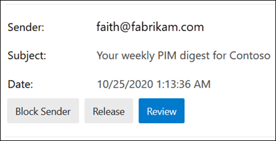

# <a name="quarantine-tags"></a><span data-ttu-id="25162-103">Karantäntaggar</span><span class="sxs-lookup"><span data-stu-id="25162-103">Quarantine tags</span></span>

> [!NOTE]
> <span data-ttu-id="25162-104">Funktionerna som beskrivs i den här artikeln är för närvarande i förhandsversion, är inte tillgängliga för alla och kan komma att ändras.</span><span class="sxs-lookup"><span data-stu-id="25162-104">The features that are described in this article are currently in Preview, aren't available to everyone, and are subject to change.</span></span>

<span data-ttu-id="25162-105">Med karantäntaggar i Exchange Online Protection (EOP) kan administratörer kontrollera vad användare kan göra med meddelanden i karantän baserat på hur meddelandet kom i karantän.</span><span class="sxs-lookup"><span data-stu-id="25162-105">Quarantine tags in Exchange Online Protection (EOP) allow admins to control what users are able to do to their quarantined messages based on how the message arrived in quarantine.</span></span>

<span data-ttu-id="25162-106">EOP har traditionellt tillåtit eller förhindrat [](find-and-release-quarantined-messages-as-a-user.md) vissa nivåer av interaktivitet för meddelanden i karantän och [i skräppost-aviseringar för slutanvändare.](use-spam-notifications-to-release-and-report-quarantined-messages.md)</span><span class="sxs-lookup"><span data-stu-id="25162-106">EOP has traditionally allowed or prevented certain levels of interactivity for messages in [quarantine](find-and-release-quarantined-messages-as-a-user.md) and in [end-user spam notifications](use-spam-notifications-to-release-and-report-quarantined-messages.md).</span></span> <span data-ttu-id="25162-107">Till exempel kan slutanvändarna visa och släppa meddelanden som satts i karantän genom skräppostfiltrering som skräppost eller massutskick, men som inte kan visa eller släppa meddelanden som har satts i karantän som nätfiske med hög säkerhet.</span><span class="sxs-lookup"><span data-stu-id="25162-107">For example, end-users can view and release messages that were quarantined by anti-spam filtering as spam or bulk, but they can't view or release messages that were quarantined as high confidence phishing.</span></span>

<span data-ttu-id="25162-108">För [funktioner som stöds](#step-2-assign-a-quarantine-tag-to-supported-features)anger karantäntaggar vad användare tillåts göra i skräppost-aviseringar för slutanvändare och i deras karantänmeddelanden (meddelanden där användaren är mottagare).</span><span class="sxs-lookup"><span data-stu-id="25162-108">For [supported protection features](#step-2-assign-a-quarantine-tag-to-supported-features), quarantine tags specify what users are allowed to do in end-user spam notification messages and in their quarantined messages in quarantine (messages where the user is a recipient).</span></span> <span data-ttu-id="25162-109">Standardk karantäntaggar tilldelas automatiskt de historiska funktionerna för slutanvändare i karantänmeddelanden.</span><span class="sxs-lookup"><span data-stu-id="25162-109">Default quarantine tags are automatically assigned to enforce the historical capabilities for end-users on quarantined messages.</span></span> <span data-ttu-id="25162-110">Du kan också skapa och tilldela anpassade karantäntaggar för att tillåta eller förhindra att slutanvändare utför specifika åtgärder på meddelanden i karantän.</span><span class="sxs-lookup"><span data-stu-id="25162-110">Or, you can create and assign custom quarantine tags to allow or prevent end-users from performing specific actions on quarantined messages.</span></span>

<span data-ttu-id="25162-111">De enskilda behörigheterna kombineras i följande förinställda behörighetsgrupper:</span><span class="sxs-lookup"><span data-stu-id="25162-111">The individual permissions are combined into the following preset permission groups:</span></span>

- <span data-ttu-id="25162-112">Ingen åtkomst</span><span class="sxs-lookup"><span data-stu-id="25162-112">No access</span></span>
- <span data-ttu-id="25162-113">Begränsad åtkomst</span><span class="sxs-lookup"><span data-stu-id="25162-113">Limited access</span></span>
- <span data-ttu-id="25162-114">Fullständig åtkomst</span><span class="sxs-lookup"><span data-stu-id="25162-114">Full access</span></span>

<span data-ttu-id="25162-115">De tillgängliga enskilda behörigheterna och vad som ingår eller inte ingår i de förinställda behörighetsgrupperna beskrivs i följande tabell:</span><span class="sxs-lookup"><span data-stu-id="25162-115">The available individual permissions and what's included or not included in the preset permission groups are described in the following table:</span></span>

|<span data-ttu-id="25162-116">Behörighet</span><span class="sxs-lookup"><span data-stu-id="25162-116">Permission</span></span>|<span data-ttu-id="25162-117">Ingen åtkomst</span><span class="sxs-lookup"><span data-stu-id="25162-117">No access</span></span>|<span data-ttu-id="25162-118">Begränsad åtkomst</span><span class="sxs-lookup"><span data-stu-id="25162-118">Limited access</span></span>|<span data-ttu-id="25162-119">Fullständig åtkomst</span><span class="sxs-lookup"><span data-stu-id="25162-119">Full access</span></span>|
|---|:---:|:---:|:---:|
|<span data-ttu-id="25162-120">**Tillåt avsändare** (_PermissionToAllowSender_)</span><span class="sxs-lookup"><span data-stu-id="25162-120">**Allow sender** (_PermissionToAllowSender_)</span></span>||||
|<span data-ttu-id="25162-122">**Spärra avsändare** (_PermissionToBlockSender_)</span><span class="sxs-lookup"><span data-stu-id="25162-122">**Block sender** (_PermissionToBlockSender_)</span></span>||||
|<span data-ttu-id="25162-125">**Delete** (_PermissionToDelete_)</span><span class="sxs-lookup"><span data-stu-id="25162-125">**Delete** (_PermissionToDelete_)</span></span>||||
|<span data-ttu-id="25162-128">**Preview** _(PermissionToPreview_)</span><span class="sxs-lookup"><span data-stu-id="25162-128">**Preview** (_PermissionToPreview_)</span></span>||||
|<span data-ttu-id="25162-131">**Tillåt mottagare att släppa ett meddelande från karantän** _(PermissionToRelease)_</span><span class="sxs-lookup"><span data-stu-id="25162-131">**Allow recipients to release a message from quarantine** (_PermissionToRelease_)</span></span>||||
|<span data-ttu-id="25162-133">**Tillåt mottagare att begära att ett meddelande ska släppas från karantän** _(PermissionToRequestRelease_)</span><span class="sxs-lookup"><span data-stu-id="25162-133">**Allow recipients to request a message to be released from quarantine** (_PermissionToRequestRelease_)</span></span>||||
|

<span data-ttu-id="25162-135">Om du inte gillar standardbehörigheterna i de förinställda behörighetsgrupperna kan du använda anpassade behörigheter när du skapar eller ändrar anpassade karantäntaggar.</span><span class="sxs-lookup"><span data-stu-id="25162-135">If you don't like the default permissions in the preset permission groups, you can use custom permissions when you create or modify custom quarantine tags.</span></span> <span data-ttu-id="25162-136">Mer information om vad varje behörighet gör finns i avsnittet om [taggbehörigheter för](#quarantine-tag-permission-details) karantän längre fram i den här artikeln.</span><span class="sxs-lookup"><span data-stu-id="25162-136">For more information about what each permission does, see the [Quarantine tag permission details](#quarantine-tag-permission-details) section later in this article.</span></span>

<span data-ttu-id="25162-137">Du skapar och tilldelar karantäntaggar i Säkerhets- och efterlevnadscenter eller i PowerShell (Exchange Online PowerShell för Microsoft 365-organisationer med Exchange Online-postlådor; fristående EOP PowerShell i EOP-organisationer utan Exchange Online-postlådor). &</span><span class="sxs-lookup"><span data-stu-id="25162-137">You create and assign quarantine tags in the Security & Compliance Center or in PowerShell (Exchange Online PowerShell for Microsoft 365 organizations with Exchange Online Mailboxes; standalone EOP PowerShell in EOP organizations without Exchange Online mailboxes).</span></span>

## <a name="what-do-you-need-to-know-before-you-begin"></a><span data-ttu-id="25162-138">Vad behöver jag veta innan jag börjar?</span><span class="sxs-lookup"><span data-stu-id="25162-138">What do you need to know before you begin?</span></span>

- <span data-ttu-id="25162-139">Öppna Säkerhets- och efterlevnadscentret på <https://protection.office.com/>.</span><span class="sxs-lookup"><span data-stu-id="25162-139">You open the Security & Compliance Center at <https://protection.office.com/>.</span></span> <span data-ttu-id="25162-140">Gå direkt till sidan **Karantäntaggar** genom att öppna <https://protection.office.com/quarantineTags> .</span><span class="sxs-lookup"><span data-stu-id="25162-140">To go directly to the **Quarantine tags** page, open <https://protection.office.com/quarantineTags>.</span></span>

- <span data-ttu-id="25162-141">Information om hur du använder Windows PowerShell för att ansluta till Exchange Online finns i artikeln om att [ansluta till Exchange Online PowerShell](/powershell/exchange/connect-to-exchange-online-powershell).</span><span class="sxs-lookup"><span data-stu-id="25162-141">To connect to Exchange Online PowerShell, see [Connect to Exchange Online PowerShell](/powershell/exchange/connect-to-exchange-online-powershell).</span></span> <span data-ttu-id="25162-142">Information om hur du ansluter till fristående EOP PowerShell finns i [Anslut till Exchange Online Protection PowerShell](/powershell/exchange/connect-to-exchange-online-protection-powershell).</span><span class="sxs-lookup"><span data-stu-id="25162-142">To connect to standalone EOP PowerShell, see [Connect to Exchange Online Protection PowerShell](/powershell/exchange/connect-to-exchange-online-protection-powershell).</span></span>

- <span data-ttu-id="25162-143">Om du vill visa, skapa, ändra eller ta bort  karantäntaggar måste du vara medlem i rollerna Organisationshantering eller **Säkerhetsadministratör** i Säkerhets- & [Efterlevnadscenter.](permissions-in-the-security-and-compliance-center.md)</span><span class="sxs-lookup"><span data-stu-id="25162-143">To view, create, modify, or remove quarantine tags, you need to be a member of the **Organization Management** or **Security Administrator** roles in the [Security & Compliance Center](permissions-in-the-security-and-compliance-center.md).</span></span>

## <a name="step-1-create-quarantine-tags-in-the-security--compliance-center"></a><span data-ttu-id="25162-144">Steg 1: Skapa karantäntaggar i säkerhets- & Kompatibilitetscenter</span><span class="sxs-lookup"><span data-stu-id="25162-144">Step 1: Create quarantine tags in the Security & Compliance Center</span></span>

1. <span data-ttu-id="25162-145">I säkerhets- & säkerhets- och efterlevnadscenter går du till **Hothanteringspolicy** \>  och väljer sedan **Karantäntaggar.**</span><span class="sxs-lookup"><span data-stu-id="25162-145">In the Security & Compliance Center, go to **Threat management** \> **Policy** and then select **Quarantine tags**.</span></span>

2. <span data-ttu-id="25162-146">På sidan **Karantän-taggar** väljer du Lägg **till anpassad tagg**.</span><span class="sxs-lookup"><span data-stu-id="25162-146">On the **Quarantine tags** page, select **Add custom tag**.</span></span>

3. <span data-ttu-id="25162-147">Guiden **Ny tagg** öppnas.</span><span class="sxs-lookup"><span data-stu-id="25162-147">The **New tag** wizard opens.</span></span> <span data-ttu-id="25162-148">På sidan **Taggnamn** anger du ett kort men unikt namn i **fältet Taggnamn.**</span><span class="sxs-lookup"><span data-stu-id="25162-148">On the **Tag name** page, enter a brief but unique name in the **Tag name** field.</span></span> <span data-ttu-id="25162-149">Du måste identifiera och välja taggen efter namn i kommande steg.</span><span class="sxs-lookup"><span data-stu-id="25162-149">You'll need to identify and select the tag by name in upcoming steps.</span></span> <span data-ttu-id="25162-150">Klicka på Nästa när du är **klar.**</span><span class="sxs-lookup"><span data-stu-id="25162-150">When you're finished, click **Next**.</span></span>

4. <span data-ttu-id="25162-151">Välj **något av följande** värden på sidan Åtkomst till mottagarmeddelande:</span><span class="sxs-lookup"><span data-stu-id="25162-151">On the **Recipient message access** page, select one of the following values:</span></span>
   - <span data-ttu-id="25162-152">**Ingen åtkomst**</span><span class="sxs-lookup"><span data-stu-id="25162-152">**No access**</span></span>
   - <span data-ttu-id="25162-153">**Begränsad åtkomst**</span><span class="sxs-lookup"><span data-stu-id="25162-153">**Limited access**</span></span>
   - <span data-ttu-id="25162-154">**Fullständig åtkomst**</span><span class="sxs-lookup"><span data-stu-id="25162-154">**Full access**</span></span>

   <span data-ttu-id="25162-155">De enskilda behörigheterna som ingår i behörighetsgrupperna beskrivs tidigare i den här artikeln.</span><span class="sxs-lookup"><span data-stu-id="25162-155">The individual permissions that are included in these permission groups are described earlier in this article.</span></span>

   <span data-ttu-id="25162-156">Om du vill ange anpassade behörigheter **väljer du Ange specifik åtkomst (avancerat)** och konfigurerar följande inställningar:</span><span class="sxs-lookup"><span data-stu-id="25162-156">To specify custom permissions, select **Set specific access (Advanced)** and configure the following settings:</span></span>

     - <span data-ttu-id="25162-157">**Välj inställning för släppåtgärd:** Välj något av följande värden:</span><span class="sxs-lookup"><span data-stu-id="25162-157">**Select release action preference**: Select one of the following values:</span></span>
       - <span data-ttu-id="25162-158">**Ingen utgivningsåtgärd:** Det här är standardvärdet.</span><span class="sxs-lookup"><span data-stu-id="25162-158">**No release action**: This is the default value.</span></span>
       - <span data-ttu-id="25162-159">**Tillåt mottagare att släppa ett meddelande från karantän**</span><span class="sxs-lookup"><span data-stu-id="25162-159">**Allow recipients to release a message from quarantine**</span></span>
       - <span data-ttu-id="25162-160">**Tillåt mottagare att begära att ett meddelande ska släppas från karantän**</span><span class="sxs-lookup"><span data-stu-id="25162-160">**Allow recipients to request a message to be released from quarantine**</span></span>

     - <span data-ttu-id="25162-161">**Välj ytterligare åtgärder som mottagare kan utföra för meddelanden** i karantän: Välj några, alla eller inga av följande värden:</span><span class="sxs-lookup"><span data-stu-id="25162-161">**Select additional actions recipients can take on quarantined messages**: Select some, all, or none of the following values:</span></span>
       - <span data-ttu-id="25162-162">**Ta bort**</span><span class="sxs-lookup"><span data-stu-id="25162-162">**Delete**</span></span>
       - <span data-ttu-id="25162-163">**Förhandsgranska**</span><span class="sxs-lookup"><span data-stu-id="25162-163">**Preview**</span></span>
       - <span data-ttu-id="25162-164">**Tillåt avsändare**</span><span class="sxs-lookup"><span data-stu-id="25162-164">**Allow sender**</span></span>
       - <span data-ttu-id="25162-165">**Spärra avsändare**</span><span class="sxs-lookup"><span data-stu-id="25162-165">**Block sender**</span></span>

   <span data-ttu-id="25162-166">De här behörigheterna och deras påverkan på meddelanden i karantän och i skräppost-aviseringar för slutanvändare beskrivs i avsnittet Om karantäntaggar [längre](#quarantine-tag-permission-details) fram i den här artikeln.</span><span class="sxs-lookup"><span data-stu-id="25162-166">These permissions and their effect on quarantined messages and in end-user spam notifications are described in the [Quarantine tag permission details](#quarantine-tag-permission-details) section later in this article.</span></span>

   <span data-ttu-id="25162-167">Klicka på Nästa när du är **klar.**</span><span class="sxs-lookup"><span data-stu-id="25162-167">When you're finished, click **Next**.</span></span>

5. <span data-ttu-id="25162-168">Granska **inställningarna** på sidan Sammanfattning som visas.</span><span class="sxs-lookup"><span data-stu-id="25162-168">On the **Summary** page that appears, review your settings.</span></span> <span data-ttu-id="25162-169">Du kan klicka **på Redigera** för varje inställning för att ändra den.</span><span class="sxs-lookup"><span data-stu-id="25162-169">You can click **Edit** on each setting to modify it.</span></span>

   <span data-ttu-id="25162-170">När du är klar klickar du på **Skicka.**</span><span class="sxs-lookup"><span data-stu-id="25162-170">When you're finished, click **Submit**.</span></span>

6. <span data-ttu-id="25162-171">Klicka **på** Klar på bekräftelsesidan som visas.</span><span class="sxs-lookup"><span data-stu-id="25162-171">Click **Done** on the confirmation page that appears.</span></span>

<span data-ttu-id="25162-172">Nu är du redo att tilldela karantäntaggen till en karantänfunktion enligt beskrivningen i [avsnittet Steg 2.](#step-2-assign-a-quarantine-tag-to-supported-features)</span><span class="sxs-lookup"><span data-stu-id="25162-172">Now you are ready to assign the quarantine tag to a quarantine feature as described in the [Step 2](#step-2-assign-a-quarantine-tag-to-supported-features) section.</span></span>

### <a name="create-quarantine-tags-in-powershell"></a><span data-ttu-id="25162-173">Skapa karantäntaggar i PowerShell</span><span class="sxs-lookup"><span data-stu-id="25162-173">Create quarantine tags in PowerShell</span></span>

<span data-ttu-id="25162-174">Om du hellre vill använda PowerShell för att skapa karantäntaggar ansluter du till Exchange Online PowerShell eller Exchange Online Protection PowerShell och använder cmdleten **New-QuarantineTag.**</span><span class="sxs-lookup"><span data-stu-id="25162-174">If you'd rather use PowerShell to create quarantine tags, connect to Exchange Online PowerShell or Exchange Online Protection PowerShell and use the **New-QuarantineTag** cmdlet.</span></span> <span data-ttu-id="25162-175">Du har två olika metoder att välja bland:</span><span class="sxs-lookup"><span data-stu-id="25162-175">You have two different methods to choose from:</span></span>

- <span data-ttu-id="25162-176">Använd _parametern EndUserQuarantinePermissionsValue._</span><span class="sxs-lookup"><span data-stu-id="25162-176">Use the _EndUserQuarantinePermissionsValue_ parameter.</span></span>
- <span data-ttu-id="25162-177">Använd _parametern EndUserQuarantinePermissions._</span><span class="sxs-lookup"><span data-stu-id="25162-177">Use the _EndUserQuarantinePermissions_ parameter.</span></span>

<span data-ttu-id="25162-178">De här metoderna beskrivs i följande avsnitt.</span><span class="sxs-lookup"><span data-stu-id="25162-178">These methods are described in the following sections.</span></span>

#### <a name="use-the-enduserquarantinepermissionsvalue-parameter"></a><span data-ttu-id="25162-179">Använda parametern EndUserQuarantinePermissionsValue</span><span class="sxs-lookup"><span data-stu-id="25162-179">Use the EndUserQuarantinePermissionsValue parameter</span></span>

<span data-ttu-id="25162-180">Om du vill skapa en karantäntagg _med hjälp av parametern EndUserQuarantinePermissionsValue_ ska du använda följande syntax:</span><span class="sxs-lookup"><span data-stu-id="25162-180">To create a quarantine tag using the _EndUserQuarantinePermissionsValue_ parameter, use the following syntax:</span></span>

```powershell
New-QuarantineTag -Name "<UniqueName>" -EndUserQuarantinePermissionsValue <0 to 236>
```

<span data-ttu-id="25162-181">Parametern _EndUserQuarantinePermissionsValue_ använder ett decimalvärde som konverteras från ett binärt värde.</span><span class="sxs-lookup"><span data-stu-id="25162-181">The _EndUserQuarantinePermissionsValue_ parameter uses a decimal value that's converted from a binary value.</span></span> <span data-ttu-id="25162-182">Det binära värdet motsvarar de tillgängliga karantänbehörigheterna för slutanvändare i en viss ordning.</span><span class="sxs-lookup"><span data-stu-id="25162-182">The binary value corresponds to the available end-user quarantine permissions in a specific order.</span></span> <span data-ttu-id="25162-183">För varje behörighet är värdet 1 lika med Sant och värdet 0 är falskt.</span><span class="sxs-lookup"><span data-stu-id="25162-183">For each permission, the value 1 equals True and the value 0 equals False.</span></span>

<span data-ttu-id="25162-184">Den ordning och de värden som krävs för varje enskild behörighet i förinställda behörighetsgrupper beskrivs i följande tabell:</span><span class="sxs-lookup"><span data-stu-id="25162-184">The required order and values for each individual permission in preset permission groups are described in the following table:</span></span>

****

|<span data-ttu-id="25162-185">Behörighet</span><span class="sxs-lookup"><span data-stu-id="25162-185">Permission</span></span>|<span data-ttu-id="25162-186">Ingen åtkomst</span><span class="sxs-lookup"><span data-stu-id="25162-186">No access</span></span>|<span data-ttu-id="25162-187">Begränsad åtkomst</span><span class="sxs-lookup"><span data-stu-id="25162-187">Limited access</span></span>|<span data-ttu-id="25162-188">Fullständig åtkomst</span><span class="sxs-lookup"><span data-stu-id="25162-188">Full access</span></span>|
|---|:---:|:---:|:---:|
|<span data-ttu-id="25162-189">PermissionToAllowSender</span><span class="sxs-lookup"><span data-stu-id="25162-189">PermissionToAllowSender</span></span>|<span data-ttu-id="25162-190">0</span><span class="sxs-lookup"><span data-stu-id="25162-190">0</span></span>|<span data-ttu-id="25162-191">0</span><span class="sxs-lookup"><span data-stu-id="25162-191">0</span></span>|<span data-ttu-id="25162-192">1</span><span class="sxs-lookup"><span data-stu-id="25162-192">1</span></span>|
|<span data-ttu-id="25162-193">PermissionToBlockSender</span><span class="sxs-lookup"><span data-stu-id="25162-193">PermissionToBlockSender</span></span>|<span data-ttu-id="25162-194">0</span><span class="sxs-lookup"><span data-stu-id="25162-194">0</span></span>|<span data-ttu-id="25162-195">1</span><span class="sxs-lookup"><span data-stu-id="25162-195">1</span></span>|<span data-ttu-id="25162-196">1</span><span class="sxs-lookup"><span data-stu-id="25162-196">1</span></span>|
|<span data-ttu-id="25162-197">PermissionToDelete</span><span class="sxs-lookup"><span data-stu-id="25162-197">PermissionToDelete</span></span>|<span data-ttu-id="25162-198">0</span><span class="sxs-lookup"><span data-stu-id="25162-198">0</span></span>|<span data-ttu-id="25162-199">1</span><span class="sxs-lookup"><span data-stu-id="25162-199">1</span></span>|<span data-ttu-id="25162-200">1</span><span class="sxs-lookup"><span data-stu-id="25162-200">1</span></span>|
|<span data-ttu-id="25162-201">PermissionToDownload<sup>\*</sup></span><span class="sxs-lookup"><span data-stu-id="25162-201">PermissionToDownload<sup>\*</sup></span></span>|<span data-ttu-id="25162-202">0</span><span class="sxs-lookup"><span data-stu-id="25162-202">0</span></span>|<span data-ttu-id="25162-203">0</span><span class="sxs-lookup"><span data-stu-id="25162-203">0</span></span>|<span data-ttu-id="25162-204">0</span><span class="sxs-lookup"><span data-stu-id="25162-204">0</span></span>|
|<span data-ttu-id="25162-205">PermissionToPreview</span><span class="sxs-lookup"><span data-stu-id="25162-205">PermissionToPreview</span></span>|<span data-ttu-id="25162-206">0</span><span class="sxs-lookup"><span data-stu-id="25162-206">0</span></span>|<span data-ttu-id="25162-207">1</span><span class="sxs-lookup"><span data-stu-id="25162-207">1</span></span>|<span data-ttu-id="25162-208">1</span><span class="sxs-lookup"><span data-stu-id="25162-208">1</span></span>|
|<span data-ttu-id="25162-209">PermissionToRelease<sup>\*\*</sup></span><span class="sxs-lookup"><span data-stu-id="25162-209">PermissionToRelease<sup>\*\*</sup></span></span>|<span data-ttu-id="25162-210">0</span><span class="sxs-lookup"><span data-stu-id="25162-210">0</span></span>|<span data-ttu-id="25162-211">0</span><span class="sxs-lookup"><span data-stu-id="25162-211">0</span></span>|<span data-ttu-id="25162-212">1</span><span class="sxs-lookup"><span data-stu-id="25162-212">1</span></span>|
|<span data-ttu-id="25162-213">PermissionToRequestRelease<sup>\*\*</sup></span><span class="sxs-lookup"><span data-stu-id="25162-213">PermissionToRequestRelease<sup>\*\*</sup></span></span>|<span data-ttu-id="25162-214">0</span><span class="sxs-lookup"><span data-stu-id="25162-214">0</span></span>|<span data-ttu-id="25162-215">1</span><span class="sxs-lookup"><span data-stu-id="25162-215">1</span></span>|<span data-ttu-id="25162-216">0</span><span class="sxs-lookup"><span data-stu-id="25162-216">0</span></span>|
|<span data-ttu-id="25162-217">PermissionToViewHeader<sup>\*</sup></span><span class="sxs-lookup"><span data-stu-id="25162-217">PermissionToViewHeader<sup>\*</sup></span></span>|<span data-ttu-id="25162-218">0</span><span class="sxs-lookup"><span data-stu-id="25162-218">0</span></span>|<span data-ttu-id="25162-219">0</span><span class="sxs-lookup"><span data-stu-id="25162-219">0</span></span>|<span data-ttu-id="25162-220">0</span><span class="sxs-lookup"><span data-stu-id="25162-220">0</span></span>|
|<span data-ttu-id="25162-221">Binärt värde</span><span class="sxs-lookup"><span data-stu-id="25162-221">Binary value</span></span>|<span data-ttu-id="25162-222">00000000</span><span class="sxs-lookup"><span data-stu-id="25162-222">00000000</span></span>|<span data-ttu-id="25162-223">01101010</span><span class="sxs-lookup"><span data-stu-id="25162-223">01101010</span></span>|<span data-ttu-id="25162-224">11101100</span><span class="sxs-lookup"><span data-stu-id="25162-224">11101100</span></span>|
|<span data-ttu-id="25162-225">Decimalvärde som ska användas</span><span class="sxs-lookup"><span data-stu-id="25162-225">Decimal value to use</span></span>|<span data-ttu-id="25162-226">0</span><span class="sxs-lookup"><span data-stu-id="25162-226">0</span></span>|<span data-ttu-id="25162-227">106</span><span class="sxs-lookup"><span data-stu-id="25162-227">106</span></span>|<span data-ttu-id="25162-228">236</span><span class="sxs-lookup"><span data-stu-id="25162-228">236</span></span>|

<span data-ttu-id="25162-229"><sup>\*</sup> Det här värdet är för närvarande alltid 0.</span><span class="sxs-lookup"><span data-stu-id="25162-229"><sup>\*</sup> Currently, this value is always 0.</span></span> <span data-ttu-id="25162-230">För PermissionToViewHeader döljer inte värdet 0  knappen Visa meddelanderubrik i informationen om det karantänfördelade meddelandet (knappen är alltid tillgänglig).</span><span class="sxs-lookup"><span data-stu-id="25162-230">For PermissionToViewHeader, the value 0 doesn't hide the **View message header** button in the details of the quarantined message (the button is always available).</span></span>

<span data-ttu-id="25162-231"><sup>\*\*</sup> Ange inte båda dessa värden till 1.</span><span class="sxs-lookup"><span data-stu-id="25162-231"><sup>\*\*</sup> Don't set both of these values to 1.</span></span> <span data-ttu-id="25162-232">Ställ in 1 och en annan på 0 eller ange 0 för båda.</span><span class="sxs-lookup"><span data-stu-id="25162-232">Set one to 1 and the other to 0, or set both to 0.</span></span>

<span data-ttu-id="25162-233">I det här exemplet skapas ett nytt taggnamn för karantän, NoAccess, som tilldelar behörigheterna Ingen åtkomst enligt beskrivningen i föregående tabell.</span><span class="sxs-lookup"><span data-stu-id="25162-233">This example creates a new quarantine tag name NoAccess that assigns the No access permissions as described in the previous table.</span></span>

```powershell
New-QuarantineTag -Name NoAccess -EndUserQuarantinePermissionsValue 0
```

<span data-ttu-id="25162-234">För begränsad åtkomstbehörighet använder du värdet 106.</span><span class="sxs-lookup"><span data-stu-id="25162-234">For Limited access permissions, use the value 106.</span></span> <span data-ttu-id="25162-235">För fullständig åtkomst använder du värdet 236.</span><span class="sxs-lookup"><span data-stu-id="25162-235">For Full access permissions, use the value 236.</span></span>

<span data-ttu-id="25162-236">För anpassade behörigheter använder du föregående tabell för att få det binära värde som motsvarar de behörigheter du vill ha.</span><span class="sxs-lookup"><span data-stu-id="25162-236">For custom permissions, use the previous table to get the binary value that corresponds to the permissions you want.</span></span> <span data-ttu-id="25162-237">Konvertera det binära värdet till ett decimalvärde och använd decimalvärdet för parametern _EndUserQuarantinePermissionsValue._</span><span class="sxs-lookup"><span data-stu-id="25162-237">Convert the binary value to a decimal value and use the decimal value for the _EndUserQuarantinePermissionsValue_ parameter.</span></span>

<span data-ttu-id="25162-238">Detaljerad information om syntax och parametrar finns i [Ny karantäntagg.](/powershell/module/exchange/new-quarantinetag)</span><span class="sxs-lookup"><span data-stu-id="25162-238">For detailed syntax and parameter information, see [New-QuarantineTag](/powershell/module/exchange/new-quarantinetag).</span></span>

#### <a name="use-the-enduserquarantinepermissions-parameter"></a><span data-ttu-id="25162-239">Använda parametern EndUserQuarantinePermissions</span><span class="sxs-lookup"><span data-stu-id="25162-239">Use the EndUserQuarantinePermissions parameter</span></span>

<span data-ttu-id="25162-240">Så här skapar du en karantäntagg med hjälp av _parametern EndUserQuarantinePermissionsValue:_</span><span class="sxs-lookup"><span data-stu-id="25162-240">To create a quarantine tag using the _EndUserQuarantinePermissionsValue_ parameter, do the following steps:</span></span>

<span data-ttu-id="25162-241">A.</span><span class="sxs-lookup"><span data-stu-id="25162-241">A.</span></span> <span data-ttu-id="25162-242">Lagra ett objekt med karantänbehörigheter i en variabel med cmdleten **New-QuarantinePermissions.**</span><span class="sxs-lookup"><span data-stu-id="25162-242">Store a quarantine permissions object in a variable using the **New-QuarantinePermissions** cmdlet.</span></span>

<p>

<span data-ttu-id="25162-243">B.</span><span class="sxs-lookup"><span data-stu-id="25162-243">B.</span></span> <span data-ttu-id="25162-244">Använd variabeln som _värdet EndUserQuarantinePermissions_ i **kommandot Ny karantäntag.**</span><span class="sxs-lookup"><span data-stu-id="25162-244">Use the variable as the _EndUserQuarantinePermissions_ value in the **New-QuarantineTag** command.</span></span>

##### <a name="step-a-store-a-quarantine-permissions-object-in-a-variable"></a><span data-ttu-id="25162-245">Steg A: Lagra ett behörighetsobjekt i karantän för en variabel</span><span class="sxs-lookup"><span data-stu-id="25162-245">Step A: Store a quarantine permissions object in a variable</span></span>

<span data-ttu-id="25162-246">Använd följande syntax:</span><span class="sxs-lookup"><span data-stu-id="25162-246">Use the following syntax:</span></span>

```powershell
$<VariableName> = New-QuarantinePermissions [-PermissionToAllowSender <$true | $False>] [-PermissionToBlockSender <$true | $False>] [-PermissionToDelete <$true | $False>] [-PermissionToPreview <$true | $False>] [-PermissionToRelease <$true | $False>] [-PermissionToRequestRelease <$true | $False>]
```

<span data-ttu-id="25162-247">Standardvärdet för oanvända parametrar `$false` är , så du behöver bara använda parametrarna där du vill ange värdet till `$true` .</span><span class="sxs-lookup"><span data-stu-id="25162-247">The default value for any unused parameters is `$false`, so you only need to use the parameters where you want to set value to `$true`.</span></span>

<span data-ttu-id="25162-248">Följande exempel visar hur du skapar behörighetsobjekt som motsvarar de förinställda behörighetsgrupperna:</span><span class="sxs-lookup"><span data-stu-id="25162-248">The following examples show how to create permission objects that correspond to the preset permissions groups:</span></span>

- <span data-ttu-id="25162-249">**Ingen åtkomst:**</span><span class="sxs-lookup"><span data-stu-id="25162-249">**No access**:</span></span>

  ```powershell
  $NoAccess = New-QuarantinePermissions
  ```

- <span data-ttu-id="25162-250">**Begränsad åtkomst:**</span><span class="sxs-lookup"><span data-stu-id="25162-250">**Limited access**:</span></span>

  ```powershell
  $LimitedAccess = New-QuarantinePermissions -PermissionToBlockSender $true -PermissionToDelete $true -PermissionToPreview $true -PermissionToRequestRelease $true
  ```

- <span data-ttu-id="25162-251">**Fullständig åtkomst:**</span><span class="sxs-lookup"><span data-stu-id="25162-251">**Full access**:</span></span>

  ```powershell
  $FullAccess = New-QuarantinePermissions -PermissionToAllowSender $true -PermissionToBlockSender $true -PermissionToDelete $true -PermissionToPreview $true -PermissionToRelease $true
  ```

<span data-ttu-id="25162-252">Om du vill se de värden du har angett kör du variabelnamnet som ett kommando (kör till exempel kommandot `$NoAccess` ).</span><span class="sxs-lookup"><span data-stu-id="25162-252">To see the values that you've set, run the variable name as a command (for example, run the command `$NoAccess`).</span></span>

<span data-ttu-id="25162-253">För anpassade behörigheter ska du inte ange både parametrarna _PermissionToRelease och_ _PermissionToRequestRelease_ till `$true` .</span><span class="sxs-lookup"><span data-stu-id="25162-253">For custom permissions, don't set both the _PermissionToRelease_ and _PermissionToRequestRelease_ parameters to `$true`.</span></span> <span data-ttu-id="25162-254">Ange en till `$true` och lämna den andra som , eller lämna båda som `$false` `$false` .</span><span class="sxs-lookup"><span data-stu-id="25162-254">Set one to `$true` and leave the other as `$false`, or leave both as `$false`.</span></span>

<span data-ttu-id="25162-255">Du kan också ändra en befintlig objektvariabel för behörigheter när du har skapat men innan du använder den med hjälp av cmdleten **Set-QuarantinePermissions.**</span><span class="sxs-lookup"><span data-stu-id="25162-255">You can also modify an existing permissions object variable after you create but before you use it by using the **Set-QuarantinePermissions** cmdlet.</span></span>

<span data-ttu-id="25162-256">Detaljerad information om syntax och parametrar finns [i New-QuarantinePermissions](/powershell/module/exchange/new-quarantinepermissions) och [Set-QuarantinePermissions.](/powershell/module/exchange/set-quarantinepermissions)</span><span class="sxs-lookup"><span data-stu-id="25162-256">For detailed syntax and parameter information, see [New-QuarantinePermissions](/powershell/module/exchange/new-quarantinepermissions) and [Set-QuarantinePermissions](/powershell/module/exchange/set-quarantinepermissions).</span></span>

##### <a name="step-b-use-the-variable-in-the-new-quarantinetag-command"></a><span data-ttu-id="25162-257">Steg B: Använda variabeln i New-QuarantineTag kommando</span><span class="sxs-lookup"><span data-stu-id="25162-257">Step B: Use the variable in the New-QuarantineTag command</span></span>

<span data-ttu-id="25162-258">När du har skapat och lagrat behörighetsobjektet i en variabel använder du variabeln för parametervärdet _EndUserQuarantinePermission_ i följande **New-QuarantineTag-kommando:**</span><span class="sxs-lookup"><span data-stu-id="25162-258">After you've created and stored the permissions object in a variable, use the variable for the _EndUserQuarantinePermission_ parameter value in the following **New-QuarantineTag** command:</span></span>

```powershell
New-QuarantineTag -Name "<UniqueName>" -EndUserQuarantinePermissions $<VariableName>
```

<span data-ttu-id="25162-259">I det här exemplet skapas en ny karantäntagg med namnet LimitedAccess med `$LimitedAccess` behörighetsobjektet som beskrevs och skapades i föregående steg.</span><span class="sxs-lookup"><span data-stu-id="25162-259">This example creates a new quarantine tag named LimitedAccess using the `$LimitedAccess` permissions object that was described and created in the previous step.</span></span>

```powershell
New-QuarantineTag -Name LimitedAccess -EndUserQuarantinePermissions $LimitedAccess
```

<span data-ttu-id="25162-260">Detaljerad information om syntax och parametrar finns i [Ny karantäntagg.](/powershell/module/exchange/new-quarantinetag)</span><span class="sxs-lookup"><span data-stu-id="25162-260">For detailed syntax and parameter information, see [New-QuarantineTag](/powershell/module/exchange/new-quarantinetag).</span></span>

## <a name="step-2-assign-a-quarantine-tag-to-supported-features"></a><span data-ttu-id="25162-261">Steg 2: Tilldela en karantäntagg till funktioner som stöds</span><span class="sxs-lookup"><span data-stu-id="25162-261">Step 2: Assign a quarantine tag to supported features</span></span>

<span data-ttu-id="25162-262">I _skyddsfunktioner_ som stöds och som sätt meddelanden eller filer i karantän (automatiskt eller som en konfigurerbar åtgärd) kan du tilldela en karantäntagg till de tillgängliga karantänåtgärderna.</span><span class="sxs-lookup"><span data-stu-id="25162-262">In _supported_ protection features that quarantine messages or files (automatically or as a configurable action), you can assign a quarantine tag to the available quarantine actions.</span></span> <span data-ttu-id="25162-263">Funktioner som sätt meddelanden i karantän och tillgängligheten för karantäntaggar beskrivs i följande tabell:</span><span class="sxs-lookup"><span data-stu-id="25162-263">Features that quarantine messages and the availability of quarantine tags are described in the following table:</span></span>

****

|<span data-ttu-id="25162-264">Funktion</span><span class="sxs-lookup"><span data-stu-id="25162-264">Feature</span></span>|<span data-ttu-id="25162-265">Stöds karantäntaggar?</span><span class="sxs-lookup"><span data-stu-id="25162-265">Quarantine tags supported?</span></span>|<span data-ttu-id="25162-266">Standardtaggar för karantän som används</span><span class="sxs-lookup"><span data-stu-id="25162-266">Default quarantine tags used</span></span>|
|---|:---:|---|
|<span data-ttu-id="25162-267">[Principer för skydd mot skräppost:](configure-your-spam-filter-policies.md)</span><span class="sxs-lookup"><span data-stu-id="25162-267">[Anti-spam policies](configure-your-spam-filter-policies.md):</span></span> <ul><li><span data-ttu-id="25162-268">**Spam** (_SpamAction_)</span><span class="sxs-lookup"><span data-stu-id="25162-268">**Spam** (_SpamAction_)</span></span></li><li><span data-ttu-id="25162-269">**Skräppost med hög konfidens** _(HighConfidenceSpamAction_)</span><span class="sxs-lookup"><span data-stu-id="25162-269">**High confidence spam** (_HighConfidenceSpamAction_)</span></span></li><li><span data-ttu-id="25162-270">**Nätfiskemeddelande** _(PhishSpamAction)_</span><span class="sxs-lookup"><span data-stu-id="25162-270">**Phishing email** (_PhishSpamAction_)</span></span></li><li><span data-ttu-id="25162-271">**Nätfiske med hög konfidens** _(HighConfidencePhishAction)_</span><span class="sxs-lookup"><span data-stu-id="25162-271">**High confidence phishing email** (_HighConfidencePhishAction_)</span></span></li><li><span data-ttu-id="25162-272">**Massutskick** _(BulkSpamAction)_</span><span class="sxs-lookup"><span data-stu-id="25162-272">**Bulk email** (_BulkSpamAction_)</span></span></li></ul>|<span data-ttu-id="25162-273">Ja</span><span class="sxs-lookup"><span data-stu-id="25162-273">Yes</span></span>|<ul><li><span data-ttu-id="25162-274">DefaultSpamTag (fullständig åtkomst)</span><span class="sxs-lookup"><span data-stu-id="25162-274">DefaultSpamTag (Full access)</span></span></li><li><span data-ttu-id="25162-275">DefaultHighConfSpamTag (fullständig åtkomst)</span><span class="sxs-lookup"><span data-stu-id="25162-275">DefaultHighConfSpamTag (Full access)</span></span></li><li><span data-ttu-id="25162-276">DefaultPhishTag (fullständig åtkomst)</span><span class="sxs-lookup"><span data-stu-id="25162-276">DefaultPhishTag (Full access)</span></span></li><li><span data-ttu-id="25162-277">DefaultHighConfPhishTag (ingen åtkomst)</span><span class="sxs-lookup"><span data-stu-id="25162-277">DefaultHighConfPhishTag (No access)</span></span></li><li><span data-ttu-id="25162-278">DefaultBulkTag (fullständig åtkomst)</span><span class="sxs-lookup"><span data-stu-id="25162-278">DefaultBulkTag (Full access)</span></span></li></ul>
|<span data-ttu-id="25162-279">Principer mot nätfiske:</span><span class="sxs-lookup"><span data-stu-id="25162-279">Anti-phishing policies:</span></span> <ul><li><span data-ttu-id="25162-280">[Spoof intelligence protection](set-up-anti-phishing-policies.md#spoof-settings) _(AuthenticationFailAction_)</span><span class="sxs-lookup"><span data-stu-id="25162-280">[Spoof intelligence protection](set-up-anti-phishing-policies.md#spoof-settings) (_AuthenticationFailAction_)</span></span></li><li><span data-ttu-id="25162-281">[Personifieringsskydd:](set-up-anti-phishing-policies.md#impersonation-settings-in-anti-phishing-policies-in-microsoft-defender-for-office-365)<sup>\*</sup></span><span class="sxs-lookup"><span data-stu-id="25162-281">[Impersonation protection](set-up-anti-phishing-policies.md#impersonation-settings-in-anti-phishing-policies-in-microsoft-defender-for-office-365):<sup>\*</sup></span></span> <ul><li><span data-ttu-id="25162-282">**Om e-post skickas av en imiterad användare** (_TargetedUserProtectionAction_)</span><span class="sxs-lookup"><span data-stu-id="25162-282">**If email is sent by an impersonated user** (_TargetedUserProtectionAction_)</span></span></li><li><span data-ttu-id="25162-283">**Om e-post skickas med en imiterad domän** (_TargetedDomainProtectionAction_)</span><span class="sxs-lookup"><span data-stu-id="25162-283">**If email is sent by an impersonated domain** (_TargetedDomainProtectionAction_)</span></span></li><li><span data-ttu-id="25162-284">**Postlådeintelligens** \> **Om e-post skickas av en imiterad användare** (_MailboxIntelligenceProtectionAction_)</span><span class="sxs-lookup"><span data-stu-id="25162-284">**Mailbox intelligence** \> **If email is sent by an impersonated user** (_MailboxIntelligenceProtectionAction_)</span></span></li></ul></li></ul></ul>|<span data-ttu-id="25162-285">Nej</span><span class="sxs-lookup"><span data-stu-id="25162-285">No</span></span>|<span data-ttu-id="25162-286">Ej a</span><span class="sxs-lookup"><span data-stu-id="25162-286">n/a</span></span>|
|<span data-ttu-id="25162-287">[Principer för skadlig programvara:](configure-anti-malware-policies.md)Alla identifierade meddelanden har alltid satts i karantän.</span><span class="sxs-lookup"><span data-stu-id="25162-287">[Anti-malware policies](configure-anti-malware-policies.md): All detected messages are always quarantined.</span></span>|<span data-ttu-id="25162-288">Nej</span><span class="sxs-lookup"><span data-stu-id="25162-288">No</span></span>|<span data-ttu-id="25162-289">Ej a</span><span class="sxs-lookup"><span data-stu-id="25162-289">n/a</span></span>|
|[<span data-ttu-id="25162-290">Säkra bilagor för SharePoint, OneDrive och Microsoft Teams</span><span class="sxs-lookup"><span data-stu-id="25162-290">Safe Attachments for SharePoint, OneDrive, and Microsoft Teams</span></span>](atp-for-spo-odb-and-teams.md)|<span data-ttu-id="25162-291">Nej</span><span class="sxs-lookup"><span data-stu-id="25162-291">No</span></span>|<span data-ttu-id="25162-292">Ej a</span><span class="sxs-lookup"><span data-stu-id="25162-292">n/a</span></span>|
|<span data-ttu-id="25162-293">[E-postflödesregler](/exchange/security-and-compliance/mail-flow-rules/mail-flow-rules) (kallas även transportregler) med åtgärden: Leverera meddelandet till **den värdinde karantänen** _(karantän)._</span><span class="sxs-lookup"><span data-stu-id="25162-293">[Mail flow rules](/exchange/security-and-compliance/mail-flow-rules/mail-flow-rules) (also known as transport rules) with the action: **Deliver the message to the hosted quarantine** (_Quarantine_).</span></span>|<span data-ttu-id="25162-294">Nej</span><span class="sxs-lookup"><span data-stu-id="25162-294">No</span></span>|<span data-ttu-id="25162-295">Ej a</span><span class="sxs-lookup"><span data-stu-id="25162-295">n/a</span></span>|
|

<span data-ttu-id="25162-296"><sup>\*</sup> Inställningarna för personifieringsskydd är endast tillgängliga i principer mot nätfiske i Microsoft Defender för Office 365.</span><span class="sxs-lookup"><span data-stu-id="25162-296"><sup>\*</sup> Impersonation protection settings are available only in anti-phishing policies in Microsoft Defender for Office 365.</span></span>

<span data-ttu-id="25162-297">Om du är nöjd med slutanvändarbehörigheterna som tillhandahålls av standardtaggarna för karantän behöver du inte göra något.</span><span class="sxs-lookup"><span data-stu-id="25162-297">If you're happy with the end-user permissions that are provided by the default quarantine tags, you don't need to do anything.</span></span> <span data-ttu-id="25162-298">Om du vill anpassa slutanvändarfunktionerna (tillgängliga knappar) i skräppost-aviseringar för slutanvändare eller i meddelandeinformation i karantän kan du tilldela en anpassad karantäntagg.</span><span class="sxs-lookup"><span data-stu-id="25162-298">If you want to customize the end-user capabilities (available buttons) in end-user spam notifications or in quarantined message details, you can assign a custom quarantine tag.</span></span>

### <a name="assign-quarantine-tags-in-anti-spam-policies-in-the-security--compliance-center"></a><span data-ttu-id="25162-299">Tilldela karantäntaggar i principer för skydd mot skräppost i Säkerhets- & Säkerhets- och efterlevnadscenter</span><span class="sxs-lookup"><span data-stu-id="25162-299">Assign quarantine tags in anti-spam policies in the Security & Compliance Center</span></span>

<span data-ttu-id="25162-300">Fullständiga instruktioner för hur du skapar och ändrar principer för skydd mot skräppost beskrivs i Konfigurera principer för skydd [mot skräppost i EOP.](configure-your-spam-filter-policies.md)</span><span class="sxs-lookup"><span data-stu-id="25162-300">Full instructions for creating and modifying anti-spam policies are described in [Configure anti-spam policies in EOP](configure-your-spam-filter-policies.md).</span></span>

1. <span data-ttu-id="25162-301">I säkerhets- & säkerhets- och efterlevnadscenter **går** du till Policy för \>  \> hothantering och väljer **sedan Skräppostskydd.**</span><span class="sxs-lookup"><span data-stu-id="25162-301">In the Security & Compliance Center, go to **Threat management** \> **Policy** \> and then select **Anti-spam**.</span></span> <span data-ttu-id="25162-302">Eller öppna <https://protection.office.com/antispam> .</span><span class="sxs-lookup"><span data-stu-id="25162-302">Or, open <https://protection.office.com/antispam>.</span></span>

2. <span data-ttu-id="25162-303">Hitta och välj en befintlig policy för skydd mot skräppost om du vill redigera den, eller skapa en ny princip mot skräppost.</span><span class="sxs-lookup"><span data-stu-id="25162-303">Find and select an existing anti-spam policy to edit, or create a new anti-spam policy.</span></span>

3. <span data-ttu-id="25162-304">I den utfällande policyinformationen **expanderar du avsnittet Skräppost- och massåtgärder.**</span><span class="sxs-lookup"><span data-stu-id="25162-304">In the policy details flyout, expand the **Spam and bulk actions** section.</span></span>

4. <span data-ttu-id="25162-305">Om du har  valt karantänmeddelande för åtgärden för en  tillgänglig skräppostfiltrering av bedömning, är rutan Använd karantänprinciptagg tillgänglig så att du kan välja karantäntaggen för det aktuella bedömningsskedet.</span><span class="sxs-lookup"><span data-stu-id="25162-305">If you've selected **Quarantine message** for the action of an available spam filtering verdict, the **Apply quarantine policy tag** box is available for you to select the quarantine tag for that verdict.</span></span>

   <span data-ttu-id="25162-306">**Obs!** När du skapar en ny princip visar ett värde för en tom karantäntagg för en filtrering av skräppost att standardtaggen för karantän används för den bedömningen.</span><span class="sxs-lookup"><span data-stu-id="25162-306">**Note**: When you create a new policy, a blank quarantine tag value for a spam filtering verdict indicates the default quarantine tag for that verdict is used.</span></span> <span data-ttu-id="25162-307">När du senare redigerar principen ersätts de tomma värdena med de faktiska standardnamnen för karantäntaggar enligt beskrivningen i föregående tabell.</span><span class="sxs-lookup"><span data-stu-id="25162-307">When you later edit the policy, the blank values are replaced by the actual default quarantine tag names as described in the previous table.</span></span>

   

5. <span data-ttu-id="25162-309">Klicka på **Spara** när du är klar.</span><span class="sxs-lookup"><span data-stu-id="25162-309">When you're finished, click **Save**.</span></span>

#### <a name="assign-quarantine-tags-in-anti-spam-policies-in-powershell"></a><span data-ttu-id="25162-310">Tilldela karantäntaggar i principer för skydd mot skräppost i PowerShell</span><span class="sxs-lookup"><span data-stu-id="25162-310">Assign quarantine tags in anti-spam policies in PowerShell</span></span>

<span data-ttu-id="25162-311">Om du hellre vill använda PowerShell för att tilldela karantäntaggar i principer mot skräppost ska du ansluta till Exchange Online PowerShell eller Exchange Online Protection PowerShell och använda följande syntax:</span><span class="sxs-lookup"><span data-stu-id="25162-311">If you'd rather use PowerShell to assign quarantine tags in anti-spam policies, connect to Exchange Online PowerShell or Exchange Online Protection PowerShell and use the following syntax:</span></span>

```powershell
<New-HostedContentFilterPolicy -Name "<Unique name>" | Set-HostedContentFilterPolicy -Identity "<Policy name>">  [-SpamAction Quarantine] [-SpamQuarantineTag <QuarantineTagName>] [-HighConfidenceSpamAction Quarantine] [-HighConfidenceSpamQuarantineTag <QuarantineTagName>] [-PhishSpamAction Quarantine] [-PhishQuarantineTag <QuarantineTagName>] [-HighConfidencePhishQuarantineTag <QuarantineTagName>] [-BulkSpamAction Quarantine] [-BulkQuarantineTag <QuarantineTagName>] ...
```

<span data-ttu-id="25162-312">**Anmärkningar**:</span><span class="sxs-lookup"><span data-stu-id="25162-312">**Notes**:</span></span>

- <span data-ttu-id="25162-313">Standardvärdet för parametern _HighConfidencePhishAction_ är Karantän, så du behöver inte ange åtgärder för karantän för identifiering av nätfiske med hög säkerhet i nya principer för skräppostskydd.</span><span class="sxs-lookup"><span data-stu-id="25162-313">The default value for the _HighConfidencePhishAction_ parameter is Quarantine, so you don't need to set the Quarantine action for high confidence phishing detections in new anti-spam policies.</span></span> <span data-ttu-id="25162-314">För alla andra skräppostfiltreringsutser i nya eller befintliga principer mot skräppost är karantäntaggen bara effektiv om åtgärdsvärdet är karantän.</span><span class="sxs-lookup"><span data-stu-id="25162-314">For all other spam filtering verdicts in new or existing anti-spam policies, the quarantine tag is only effective if the action value is Quarantine.</span></span> <span data-ttu-id="25162-315">Om du vill se åtgärdsvärdena i befintliga principer för skräppostskydd kör du följande kommando:</span><span class="sxs-lookup"><span data-stu-id="25162-315">To see the action values in existing anti-spam policies, run the following command:</span></span>

  ```powershell
  Get-HostedContentFilterPolicy | Format-Table Name,*SpamAction,HighConfidencePhishAction
  ```

  <span data-ttu-id="25162-316">Mer information om standardåtgärdsvärdena och de rekommenderade åtgärdsvärdena för Standard och Strikt finns i Inställningarna för [EOP-principen för](recommended-settings-for-eop-and-office365-atp.md#eop-anti-spam-policy-settings)skydd mot skräppost.</span><span class="sxs-lookup"><span data-stu-id="25162-316">For information about the default action values and the recommended action values for Standard and Strict, see [EOP anti-spam policy settings](recommended-settings-for-eop-and-office365-atp.md#eop-anti-spam-policy-settings).</span></span>

- <span data-ttu-id="25162-317">En skräppostfiltrering som skulle vara utan en motsvarande karantäntaggsparameter innebär att [standardtaggen för](#step-2-assign-a-quarantine-tag-to-supported-features) karantän används för den aktuella bedömningsposten.</span><span class="sxs-lookup"><span data-stu-id="25162-317">A spam filtering verdict without a corresponding quarantine tag parameter means the [default quarantine tag](#step-2-assign-a-quarantine-tag-to-supported-features) for that verdict is used.</span></span>

  <span data-ttu-id="25162-318">Du behöver bara ersätta en standardtagg för karantän med en anpassad karantäntagg om du vill ändra slutanvändarfunktionerna för meddelanden i karantän.</span><span class="sxs-lookup"><span data-stu-id="25162-318">You only need to replace a default quarantine tag with a custom quarantine tag if you want to change the default end-user capabilities on quarantined messages.</span></span>

- <span data-ttu-id="25162-319">En ny policy mot skräppost i PowerShell kräver en princip för skräppostfilter (inställningar) med cmdleten **New-HostedContentFilterPolicy** och en ny skräppostfilterregel (mottagarfilter) med cmdleten **New-HostedContentFilterRule.**</span><span class="sxs-lookup"><span data-stu-id="25162-319">A new anti-spam policy in PowerShell requires a spam filter policy (settings) using the **New-HostedContentFilterPolicy** cmdlet and a new spam filter rule (recipient filters) using the **New-HostedContentFilterRule** cmdlet.</span></span> <span data-ttu-id="25162-320">Instruktioner finns i Använda [PowerShell för att skapa principer mot skräppost.](configure-your-spam-filter-policies.md#use-powershell-to-create-anti-spam-policies)</span><span class="sxs-lookup"><span data-stu-id="25162-320">For instructions, see [Use PowerShell to create anti-spam policies](configure-your-spam-filter-policies.md#use-powershell-to-create-anti-spam-policies).</span></span>

<span data-ttu-id="25162-321">I det här exemplet skapas en ny policy för skräppostfilter med namnet Research Department med följande inställningar:</span><span class="sxs-lookup"><span data-stu-id="25162-321">This example creates a new spam filter policy named Research Department with the following settings:</span></span>

- <span data-ttu-id="25162-322">Åtgärden för all skräppostfiltrering är inställd på karantän.</span><span class="sxs-lookup"><span data-stu-id="25162-322">The action for all spam filtering verdicts is set to Quarantine.</span></span>
- <span data-ttu-id="25162-323">Den anpassade karantäntaggen NoAccess som tilldelar **Inga** åtkomstbehörigheter ersätter alla standardtaggar för karantän som inte redan tilldelar Inga **åtkomstbehörigheter** som standard.</span><span class="sxs-lookup"><span data-stu-id="25162-323">The custom quarantine tag named NoAccess that assigns **No access** permissions replaces any default quarantine tags that don't already assign **No access** permissions by default.</span></span>

```powershell
New-HostedContentFilterPolicy -Name Research Department -SpamAction Quarantine -SpamQuarantineTag NoAccess -HighConfidenceSpamAction Quarantine -HighConfidenceSpamQuarantineTag NoAction -PhishSpamAction Quarantine -PhishQuarantineTag NoAction -BulkSpamAction Quarantine -BulkQuarantineTag NoAccess
```

<span data-ttu-id="25162-324">Detaljerad information om syntax och parametrar finns i [New-HostedContentFilterPolicy](/powershell/module/exchange/new-hostedcontentfilterpolicy).</span><span class="sxs-lookup"><span data-stu-id="25162-324">For detailed syntax and parameter information, see [New-HostedContentFilterPolicy](/powershell/module/exchange/new-hostedcontentfilterpolicy).</span></span>

<span data-ttu-id="25162-325">Det här exemplet ändrar den befintliga policyn för skräppostfilter med namnet Human Resources.</span><span class="sxs-lookup"><span data-stu-id="25162-325">This example modifies the existing spam filter policy named Human Resources.</span></span> <span data-ttu-id="25162-326">Åtgärden för karantänen för skräppost är inställd på karantän och den anpassade karantäntaggen NoAccess tilldelas.</span><span class="sxs-lookup"><span data-stu-id="25162-326">The action for the spam quarantine verdict is set to Quarantine, and the custom quarantine tag named NoAccess is assigned.</span></span>

```powershell
Set-HostedContentFilterPolicy -Identity "Human Resources" -SpamAction Quarantine -SpamQuarantineTag NoAccess
```

<span data-ttu-id="25162-327">Detaljerad information om syntax och parametrar finns i [Set-HostedContentFilterPolicy](/powershell/module/exchange/set-hostedcontentfilterpolicy).</span><span class="sxs-lookup"><span data-stu-id="25162-327">For detailed syntax and parameter information, see [Set-HostedContentFilterPolicy](/powershell/module/exchange/set-hostedcontentfilterpolicy).</span></span>

## <a name="configure-global-quarantine-notification-settings-in-the-security--compliance-center"></a><span data-ttu-id="25162-328">Konfigurera inställningar för globala karantänmeddelanden i Säkerhets- & Säkerhets- och efterlevnadscenter</span><span class="sxs-lookup"><span data-stu-id="25162-328">Configure global quarantine notification settings in the Security & Compliance Center</span></span>

<span data-ttu-id="25162-329">Med de globala inställningarna för karantäntaggar kan du anpassa skräppost-aviseringarna för slutanvändaren som skickas till mottagare av meddelanden som har satts i karantän.</span><span class="sxs-lookup"><span data-stu-id="25162-329">The global settings for quarantine tags allow you to customize the end-user spam notifications that are sent to recipients of messages that were quarantined.</span></span> <span data-ttu-id="25162-330">Mer information om dessa meddelanden finns i [Skräppost-aviseringar för slutanvändare.](use-spam-notifications-to-release-and-report-quarantined-messages.md)</span><span class="sxs-lookup"><span data-stu-id="25162-330">For more information about these notifications, see [End-user spam notifications](use-spam-notifications-to-release-and-report-quarantined-messages.md).</span></span>

1. <span data-ttu-id="25162-331">I säkerhets- & säkerhets- och efterlevnadscenter går du till **Hothanteringspolicy** \>  och väljer sedan **Karantäntaggar.**</span><span class="sxs-lookup"><span data-stu-id="25162-331">In the Security & Compliance Center, go to **Threat management** \> **Policy** and then select **Quarantine tags**.</span></span>

2. <span data-ttu-id="25162-332">På sidan **Karantäntaggar** väljer du **Globala inställningar**.</span><span class="sxs-lookup"><span data-stu-id="25162-332">On the **Quarantine tags** page, select **Global settings**.</span></span>

3. <span data-ttu-id="25162-333">I den **utfällfältet** för meddelandeinställningar för karantän som öppnas konfigurerar du några eller alla av följande inställningar:</span><span class="sxs-lookup"><span data-stu-id="25162-333">In the **Quarantine notification settings** flyout that opens, configure some or all of the following settings:</span></span>

   - <span data-ttu-id="25162-334">**Använd min företagslogotyp:** Välj det här alternativet om du vill ersätta standardlogotypen som visas längst upp bland skräppost-aviseringarna för slutanvändaren.</span><span class="sxs-lookup"><span data-stu-id="25162-334">**Use my company logo**: Select this option to replace the default Microsoft logo that's use at the top of end-user spam notifications.</span></span> <span data-ttu-id="25162-335">Innan du gör det måste du följa instruktionerna i [Anpassa Microsoft 365-temat](../../admin/setup/customize-your-organization-theme.md) för din organisation för att ladda upp din anpassade logotyp.</span><span class="sxs-lookup"><span data-stu-id="25162-335">Before you do this, you need to follow the instructions in [Customize the Microsoft 365 theme for your organization](../../admin/setup/customize-your-organization-theme.md) to upload your custom logo.</span></span>

     <span data-ttu-id="25162-336">Följande skärmbild visar en anpassad logotyp i en skräppost-avisering för slutanvändare:</span><span class="sxs-lookup"><span data-stu-id="25162-336">The following screenshot shows a custom logo in an end-user spam notification:</span></span>

     

   - <span data-ttu-id="25162-338">**Välj språk:** Skräppost-aviseringar för slutanvändare har redan lokaliserats baserat på mottagarens språkinställningar.</span><span class="sxs-lookup"><span data-stu-id="25162-338">**Choose language**: End-user spam notifications are already localized based on the recipient's language settings.</span></span> <span data-ttu-id="25162-339">Du kan ange anpassad text på olika språk för värdena **Visningsnamn och** **Ansvarsfriskrivning.**</span><span class="sxs-lookup"><span data-stu-id="25162-339">You can specify customized text in different languages for the **Display name** and **Disclaimer** values.</span></span>

     <span data-ttu-id="25162-340">Välj minst ett språk i rutan för det första språket och klicka sedan på Lägg **till**.</span><span class="sxs-lookup"><span data-stu-id="25162-340">Select at least one language from the first language box and then click **Add**.</span></span> <span data-ttu-id="25162-341">Du kan välja flera språk genom att klicka **på Lägg** till efter varje.</span><span class="sxs-lookup"><span data-stu-id="25162-341">You can select multiple languages by clicking **Add** after each one.</span></span> <span data-ttu-id="25162-342">En ruta för avsnittsspråk visar alla språk som du har valt:</span><span class="sxs-lookup"><span data-stu-id="25162-342">A section language box shows all of the languages that you've selected:</span></span>

     

   - <span data-ttu-id="25162-344">**Visningsnamn:** Anpassa avsändarens visningsnamn som används i skräppost-aviseringarna för slutanvändaren.</span><span class="sxs-lookup"><span data-stu-id="25162-344">**Display name**: Customize the sender's display name that's used in end-user spam notifications.</span></span>

     <span data-ttu-id="25162-345">För varje språk som du har lagt till väljer du språket i rutan för det andra språket (klicka inte på X) och ange det textvärde du vill ha i rutan **Visningsnamn.**</span><span class="sxs-lookup"><span data-stu-id="25162-345">For each language that you've added, select the language in the second language box (don't click on the X) and enter the text value you want in the **Display name** box.</span></span>

     <span data-ttu-id="25162-346">Följande skärmbild visar det anpassade visningsnamnet i en skräppost-avisering för slutanvändare:</span><span class="sxs-lookup"><span data-stu-id="25162-346">The following screenshot shows the customized display name in an end-user spam notification:</span></span>

     

   - <span data-ttu-id="25162-348">**Ansvarsfriskrivning:** Lägg till en anpassad ansvarsfriskrivning längst ned i skräppost-aviseringar för slutanvändaren.</span><span class="sxs-lookup"><span data-stu-id="25162-348">**Disclaimer**: Add a custom disclaimer to the bottom of end-user spam notifications.</span></span> <span data-ttu-id="25162-349">Lokaliserad text, **en ansvarsfriskrivning från organisationen:** inkluderas alltid först, följt av den text som du anger.</span><span class="sxs-lookup"><span data-stu-id="25162-349">The localized text, **A disclaimer from your organization:** is always included first, followed by the text you specify.</span></span>

     <span data-ttu-id="25162-350">För varje språk som du har lagt till väljer du språk i rutan för det andra språket (klicka inte på X) och ange det textvärde du vill ha i rutan **Ansvarsfriskrivning.**</span><span class="sxs-lookup"><span data-stu-id="25162-350">For each language that you've added, select the language in the second language box  (don't click the X) and enter the text value you want in the **Disclaimer** box.</span></span>

     <span data-ttu-id="25162-351">Följande skärmbild visar den anpassade ansvarsfriskrivningen i en skräppost-avisering för slutanvändare:</span><span class="sxs-lookup"><span data-stu-id="25162-351">The following screenshot shows the customized disclaimer in an end-user spam notification:</span></span>

     

## <a name="view-quarantine-tags-in-the-security--compliance-center"></a><span data-ttu-id="25162-353">Visa karantäntaggar i säkerhets- & säkerhets- och efterlevnadscentret</span><span class="sxs-lookup"><span data-stu-id="25162-353">View quarantine tags in the Security & Compliance Center</span></span>

1. <span data-ttu-id="25162-354">I säkerhets- & säkerhets- och efterlevnadscenter går du till **Hothanteringspolicy** \>  och väljer sedan **Karantäntaggar.**</span><span class="sxs-lookup"><span data-stu-id="25162-354">In the Security & Compliance Center, go to **Threat management** \> **Policy** and then select **Quarantine tags**.</span></span>

- <span data-ttu-id="25162-355">Om du vill visa inställningarna för inbyggda eller anpassade karantäntaggar väljer du karantäntaggen i listan (markera inte kryssrutan).</span><span class="sxs-lookup"><span data-stu-id="25162-355">To view the settings of built-in or custom quarantine tags, select the quarantine tag from the list (don't select the check box).</span></span>

- <span data-ttu-id="25162-356">Om du vill visa de globala inställningarna väljer **du Globala inställningar**</span><span class="sxs-lookup"><span data-stu-id="25162-356">To view the global settings, select **Global settings**</span></span>

### <a name="view-quarantine-tags-in-powershell"></a><span data-ttu-id="25162-357">Visa karantäntaggar i PowerShell</span><span class="sxs-lookup"><span data-stu-id="25162-357">View quarantine tags in PowerShell</span></span>

<span data-ttu-id="25162-358">Om du hellre vill använda PowerShell för att visa karantäntaggar gör du något av följande:</span><span class="sxs-lookup"><span data-stu-id="25162-358">If you'd rather use PowerShell to view quarantine tags, do any of the following steps:</span></span>

- <span data-ttu-id="25162-359">Om du vill visa en sammanfattningslista över alla inbyggda eller anpassade taggar kör du följande kommando:</span><span class="sxs-lookup"><span data-stu-id="25162-359">To view a summary list of all built-in or custom tags, run the following command:</span></span>

  ```powershell
  Get-QuarantineTag | Format-Table Name
  ```

- <span data-ttu-id="25162-360">Om du vill visa inställningarna för inbyggda eller anpassade karantäntaggar ersätter du med namnet på \<TagName\> karantäntaggen och kör följande kommando:</span><span class="sxs-lookup"><span data-stu-id="25162-360">To view the settings of built-in or custom quarantine tags, replace \<TagName\> with the name of the quarantine tag, and run the following command:</span></span>

  ```powershell
  Get-QuarantineTag -Identity "<TagName>"
  ```

- <span data-ttu-id="25162-361">Kör följande kommando för att visa de globala inställningarna:</span><span class="sxs-lookup"><span data-stu-id="25162-361">To view the global settings, run the following command:</span></span>

  ```powershell
  Get-QuarantineTag -QuarantineTagType GlobalQuarantineTag
  ```

<span data-ttu-id="25162-362">Detaljerad information om syntax och parametrar finns i [Get-HostedContentFilterPolicy](/powershell/module/exchange/get-hostedcontentfilterpolicy).</span><span class="sxs-lookup"><span data-stu-id="25162-362">For detailed syntax and parameter information, see [Get-HostedContentFilterPolicy](/powershell/module/exchange/get-hostedcontentfilterpolicy).</span></span>

## <a name="remove-quarantine-tags-in-the-security--compliance-center"></a><span data-ttu-id="25162-363">Ta bort karantäntaggar i säkerhets- & säkerhets- och efterlevnadscentret</span><span class="sxs-lookup"><span data-stu-id="25162-363">Remove quarantine tags in the Security & Compliance Center</span></span>

<span data-ttu-id="25162-364">**Anmärkningar**:</span><span class="sxs-lookup"><span data-stu-id="25162-364">**Notes**:</span></span>

- <span data-ttu-id="25162-365">Du kan inte ta bort inbyggda karantäntaggar.</span><span class="sxs-lookup"><span data-stu-id="25162-365">You can't remove built-in quarantine tags.</span></span>

- <span data-ttu-id="25162-366">Innan du tar bort en anpassad karantäntagg bör du kontrollera att den inte används.</span><span class="sxs-lookup"><span data-stu-id="25162-366">Before you remove a custom quarantine tag, verify that it's not being used.</span></span> <span data-ttu-id="25162-367">Kör till exempel följande kommando i PowerShell:</span><span class="sxs-lookup"><span data-stu-id="25162-367">For example, run the following command in PowerShell:</span></span>

  ```powershell
  Get-HostedContentFilterPolicy | Format-List Name,*QuarantineTag
  ```

  <span data-ttu-id="25162-368">Om karantäntaggen används ersätter [du den tilldelade karantäntaggen](#step-2-assign-a-quarantine-tag-to-supported-features) innan du tar bort den.</span><span class="sxs-lookup"><span data-stu-id="25162-368">If the quarantine tag is being used, [replace the assigned quarantine tag](#step-2-assign-a-quarantine-tag-to-supported-features) before you remove it.</span></span>

1. <span data-ttu-id="25162-369">I säkerhets- & säkerhets- och efterlevnadscenter går du till **Hothanteringspolicy** \>  och väljer sedan **Karantäntaggar.**</span><span class="sxs-lookup"><span data-stu-id="25162-369">In the Security & Compliance Center, go to **Threat management** \> **Policy** and then select **Quarantine tags**.</span></span>

2. <span data-ttu-id="25162-370">På sidan **Karantäntaggar** väljer du den anpassade karantäntagg du vill ta bort och klickar på Ta **bort taggen.**</span><span class="sxs-lookup"><span data-stu-id="25162-370">On the **Quarantine tags** page, select the custom quarantine tag that you want to remove, and the click **Delete tag**.</span></span>

3. <span data-ttu-id="25162-371">Klicka **på Ta bort** tagg i bekräftelsedialogrutan som visas.</span><span class="sxs-lookup"><span data-stu-id="25162-371">Click **Remove tag** in the confirmation dialog that appears.</span></span>

### <a name="remove-quarantine-tags-in-powershell"></a><span data-ttu-id="25162-372">Ta bort karantäntaggar i PowerShell</span><span class="sxs-lookup"><span data-stu-id="25162-372">Remove quarantine tags in PowerShell</span></span>

<span data-ttu-id="25162-373">Om du hellre vill använda PowerShell för att ta bort en anpassad karantäntagg ersätter du med namnet på karantäntaggen \<TagName\> och kör följande kommando:</span><span class="sxs-lookup"><span data-stu-id="25162-373">If you'd rather use PowerShell to remove a custom quarantine tag, replace \<TagName\> with the name of the quarantine tag, and run the following command:</span></span>

```powershell
Remove-QuarantineTag -Identity "<TagName>"
```

<span data-ttu-id="25162-374">Detaljerad information om syntax och parametrar finns i [Ta bort karantäntagg.](/powershell/module/exchange/remove-quarantinetag)</span><span class="sxs-lookup"><span data-stu-id="25162-374">For detailed syntax and parameter information, see [Remove-QuarantineTag](/powershell/module/exchange/remove-quarantinetag).</span></span>

## <a name="quarantine-tag-permission-details"></a><span data-ttu-id="25162-375">Information om karantäntaggsbehörighet</span><span class="sxs-lookup"><span data-stu-id="25162-375">Quarantine tag permission details</span></span>

<span data-ttu-id="25162-376">I följande avsnitt beskrivs effekterna av förinställda behörighetsgrupper och enskilda behörigheter i information om meddelanden i karantän och i skräppost-aviseringar för slutanvändare.</span><span class="sxs-lookup"><span data-stu-id="25162-376">The following sections describe the effects of preset permission groups and individual permissions in the details of quarantined messages and in end-user spam notifications.</span></span>

### <a name="preset-permissions-groups"></a><span data-ttu-id="25162-377">Förinställda behörighetsgrupper</span><span class="sxs-lookup"><span data-stu-id="25162-377">Preset permissions groups</span></span>

<span data-ttu-id="25162-378">De enskilda behörigheterna som ingår i förinställda behörighetsgrupper visas i tabellen i början av den här artikeln.</span><span class="sxs-lookup"><span data-stu-id="25162-378">The individual permissions that are included in preset permission groups are listed in the table at the beginning of this article.</span></span>

#### <a name="no-access"></a><span data-ttu-id="25162-379">Ingen åtkomst</span><span class="sxs-lookup"><span data-stu-id="25162-379">No access</span></span>

<span data-ttu-id="25162-380">Om karantäntaggen tilldelar **behörigheterna Ingen** åtkomst (ingen behörighet) får användarna fortfarande vissa grundläggande funktioner:</span><span class="sxs-lookup"><span data-stu-id="25162-380">If the quarantine tag assigns the **No access** permissions (no permissions), users still get some baseline capabilities:</span></span>

- <span data-ttu-id="25162-381">**Information om meddelanden i karantän:** **Knappen Visa meddelanderubrik** är alltid tillgänglig.</span><span class="sxs-lookup"><span data-stu-id="25162-381">**Quarantined message details**: The **View message header** button is always available.</span></span>

  

- <span data-ttu-id="25162-383">**Skräppost-aviseringar för slutanvändare:** **Knappen** Granska som för användaren till meddelandet i karantän är alltid tillgänglig.</span><span class="sxs-lookup"><span data-stu-id="25162-383">**End-user spam notifications**: The **Review** button that takes the user to the message in quarantine is always available.</span></span>

  

#### <a name="limited-access"></a><span data-ttu-id="25162-385">Begränsad åtkomst</span><span class="sxs-lookup"><span data-stu-id="25162-385">Limited access</span></span>

<span data-ttu-id="25162-386">Om karantäntaggen tilldelar **behörigheterna Begränsad** åtkomst får användarna följande funktioner:</span><span class="sxs-lookup"><span data-stu-id="25162-386">If the quarantine tag assigns the **Limited access** permissions, users get the following capabilities:</span></span>

- <span data-ttu-id="25162-387">**Information om meddelanden i karantän:** Följande knappar är tillgängliga:</span><span class="sxs-lookup"><span data-stu-id="25162-387">**Quarantined message details**: The following buttons are available:</span></span>
  - <span data-ttu-id="25162-388">**Begär utgivning**</span><span class="sxs-lookup"><span data-stu-id="25162-388">**Request release**</span></span>
  - <span data-ttu-id="25162-389">**Visa meddelanderubrik**</span><span class="sxs-lookup"><span data-stu-id="25162-389">**View message header**</span></span>
  - <span data-ttu-id="25162-390">**Förhandsgranskningsmeddelande**</span><span class="sxs-lookup"><span data-stu-id="25162-390">**Preview message**</span></span>
  - <span data-ttu-id="25162-391">**Spärra avsändare**</span><span class="sxs-lookup"><span data-stu-id="25162-391">**Block sender**</span></span>
  - <span data-ttu-id="25162-392">**Ta bort från karantän**</span><span class="sxs-lookup"><span data-stu-id="25162-392">**Remove from quarantine**</span></span>

  

- <span data-ttu-id="25162-394">**Skräppost-aviseringar för slutanvändare:** Följande knappar är tillgängliga:</span><span class="sxs-lookup"><span data-stu-id="25162-394">**End-user spam notifications**: The following buttons are available:</span></span>
  - <span data-ttu-id="25162-395">**Spärra avsändare**</span><span class="sxs-lookup"><span data-stu-id="25162-395">**Block sender**</span></span>
  - <span data-ttu-id="25162-396">**Granska**</span><span class="sxs-lookup"><span data-stu-id="25162-396">**Review**</span></span>

  

#### <a name="full-access"></a><span data-ttu-id="25162-398">Fullständig åtkomst</span><span class="sxs-lookup"><span data-stu-id="25162-398">Full access</span></span>

<span data-ttu-id="25162-399">Om karantäntaggen tilldelar **fullständig åtkomst** (alla tillgängliga behörigheter) får användarna följande funktioner:</span><span class="sxs-lookup"><span data-stu-id="25162-399">If the quarantine tag assigns the **Full access** permissions (all available permissions), users get the following capabilities:</span></span>

- <span data-ttu-id="25162-400">**Information om meddelanden i karantän:** Följande knappar är tillgängliga:</span><span class="sxs-lookup"><span data-stu-id="25162-400">**Quarantined message details**: The following buttons are available:</span></span>
  - <span data-ttu-id="25162-401">**Släpp meddelande**</span><span class="sxs-lookup"><span data-stu-id="25162-401">**Release message**</span></span>
  - <span data-ttu-id="25162-402">**Visa meddelanderubrik**</span><span class="sxs-lookup"><span data-stu-id="25162-402">**View message header**</span></span>
  - <span data-ttu-id="25162-403">**Förhandsgranskningsmeddelande**</span><span class="sxs-lookup"><span data-stu-id="25162-403">**Preview message**</span></span>
  - <span data-ttu-id="25162-404">**Spärra avsändare**</span><span class="sxs-lookup"><span data-stu-id="25162-404">**Block sender**</span></span>
  - <span data-ttu-id="25162-405">**Tillåt avsändare**</span><span class="sxs-lookup"><span data-stu-id="25162-405">**Allow sender**</span></span>
  - <span data-ttu-id="25162-406">**Ta bort från karantän**</span><span class="sxs-lookup"><span data-stu-id="25162-406">**Remove from quarantine**</span></span>

  

- <span data-ttu-id="25162-408">**Skräppost-aviseringar för slutanvändare:** Följande knappar är tillgängliga:</span><span class="sxs-lookup"><span data-stu-id="25162-408">**End-user spam notifications**: The following buttons are available:</span></span>
  - <span data-ttu-id="25162-409">**Spärra avsändare**</span><span class="sxs-lookup"><span data-stu-id="25162-409">**Block sender**</span></span>
  - <span data-ttu-id="25162-410">**Version**</span><span class="sxs-lookup"><span data-stu-id="25162-410">**Release**</span></span>
  - <span data-ttu-id="25162-411">**Granska**</span><span class="sxs-lookup"><span data-stu-id="25162-411">**Review**</span></span>

  

### <a name="individual-permissions"></a><span data-ttu-id="25162-413">Enskilda behörigheter</span><span class="sxs-lookup"><span data-stu-id="25162-413">Individual permissions</span></span>

> [!NOTE]
> <span data-ttu-id="25162-414">Kom ihåg att användarna alltid får de knappar som beskrivs i [avsnittet Ingen](#no-access) åtkomst.</span><span class="sxs-lookup"><span data-stu-id="25162-414">Remember, users always get the buttons described in the [No access](#no-access) section.</span></span> <span data-ttu-id="25162-415">Dessa knappar ingår inte i de enskilda behörighetsbeskrivningarna.</span><span class="sxs-lookup"><span data-stu-id="25162-415">These buttons are not included in the individual permission descriptions.</span></span>

#### <a name="allow-sender-permission"></a><span data-ttu-id="25162-416">Tillåt avsändarbehörighet</span><span class="sxs-lookup"><span data-stu-id="25162-416">Allow sender permission</span></span>

<span data-ttu-id="25162-417">Tillåt **avsändarbehörighet** _(PermissionToAllowSender)_ styr åtkomsten till knappen som gör att användare enkelt kan lägga till avsändaren i karantän i sin lista med betrodda avsändare.</span><span class="sxs-lookup"><span data-stu-id="25162-417">The **Allow sender** permission (_PermissionToAllowSender_) controls access to the button that allows users to conveniently add the quarantined message sender to their Safe Senders list.</span></span>

- <span data-ttu-id="25162-418">**Information om meddelanden i karantän:**</span><span class="sxs-lookup"><span data-stu-id="25162-418">**Quarantined message details**:</span></span>
  - <span data-ttu-id="25162-419">**Tillåt avsändarbehörighet** aktiverad: **Knappen Tillåt avsändare** är tillgänglig.</span><span class="sxs-lookup"><span data-stu-id="25162-419">**Allow sender** permission enabled: The **Allow sender** button is available.</span></span>
  - <span data-ttu-id="25162-420">**Tillåt avsändarbehörighet** inaktiverad: **Knappen Tillåt** avsändare är inte tillgänglig.</span><span class="sxs-lookup"><span data-stu-id="25162-420">**Allow sender** permission disabled: The **Allow sender** button is not available.</span></span>

- <span data-ttu-id="25162-421">**Skräppost-aviseringar för slutanvändare**: Ingen effekt.</span><span class="sxs-lookup"><span data-stu-id="25162-421">**End-user spam notifications**: No effect.</span></span>

<span data-ttu-id="25162-422">Mer information om listan Betrodda avsändare finns i Förhindra att betrodda avsändare [blockeras](https://support.microsoft.com/office/274ae301-5db2-4aad-be21-25413cede077#__toc304379666) och Använda Exchange Online PowerShell för att konfigurera samlingen [safelist i en postlåda.](configure-junk-email-settings-on-exo-mailboxes.md#use-exchange-online-powershell-to-configure-the-safelist-collection-on-a-mailbox)</span><span class="sxs-lookup"><span data-stu-id="25162-422">For more information about the Safe Senders list, see [Prevent trusted senders from being blocked](https://support.microsoft.com/office/274ae301-5db2-4aad-be21-25413cede077#__toc304379666) and [Use Exchange Online PowerShell to configure the safelist collection on a mailbox](configure-junk-email-settings-on-exo-mailboxes.md#use-exchange-online-powershell-to-configure-the-safelist-collection-on-a-mailbox).</span></span>

#### <a name="block-sender-permission"></a><span data-ttu-id="25162-423">Blockera avsändarbehörighet</span><span class="sxs-lookup"><span data-stu-id="25162-423">Block sender permission</span></span>

<span data-ttu-id="25162-424">Behörigheten **Blockera avsändare** _(PermissionToBlockSender)_ styr åtkomsten till knappen som gör att användare enkelt kan lägga till avsändaren i karantän i sin lista med spärrade avsändare.</span><span class="sxs-lookup"><span data-stu-id="25162-424">The **Block sender** permission (_PermissionToBlockSender_) controls access to the button that allows users to conveniently add the quarantined message sender to their Blocked Senders list.</span></span>

- <span data-ttu-id="25162-425">**Information om meddelanden i karantän:**</span><span class="sxs-lookup"><span data-stu-id="25162-425">**Quarantined message details**:</span></span>
  - <span data-ttu-id="25162-426">**Behörigheten Blockera** avsändare aktiverad: **Knappen Spärra** avsändare är tillgänglig.</span><span class="sxs-lookup"><span data-stu-id="25162-426">**Block sender** permission enabled: The **Block sender** button is available.</span></span>
  - <span data-ttu-id="25162-427">**Spärra avsändarbehörighet** inaktiverad: **Knappen Spärra** avsändare är inte tillgänglig.</span><span class="sxs-lookup"><span data-stu-id="25162-427">**Block sender** permission disabled: The **Block sender** button is not available.</span></span>

- <span data-ttu-id="25162-428">**Skräppost-aviseringar för slutanvändare:**</span><span class="sxs-lookup"><span data-stu-id="25162-428">**End-user spam notifications**:</span></span>
  - <span data-ttu-id="25162-429">**Spärra avsändarbehörighet** inaktiverad: **Knappen Spärra** avsändare är inte tillgänglig.</span><span class="sxs-lookup"><span data-stu-id="25162-429">**Block sender** permission disabled: The **Block sender** button is not available.</span></span>
  - <span data-ttu-id="25162-430">**Behörigheten Blockera** avsändare aktiverad: **Knappen Spärra** avsändare är tillgänglig.</span><span class="sxs-lookup"><span data-stu-id="25162-430">**Block sender** permission enabled: The **Block sender** button is available.</span></span>

<span data-ttu-id="25162-431">Mer information om listan Spärrade avsändare [](https://support.microsoft.com/office/274ae301-5db2-4aad-be21-25413cede077#__toc304379667) finns i Spärra meddelanden från någon och Använda Exchange Online PowerShell för att konfigurera samlingen lista över betrodda avsändare [i en postlåda.](configure-junk-email-settings-on-exo-mailboxes.md#use-exchange-online-powershell-to-configure-the-safelist-collection-on-a-mailbox)</span><span class="sxs-lookup"><span data-stu-id="25162-431">For more information about the Blocked Senders list, see [Block messages from someone](https://support.microsoft.com/office/274ae301-5db2-4aad-be21-25413cede077#__toc304379667) and [Use Exchange Online PowerShell to configure the safelist collection on a mailbox](configure-junk-email-settings-on-exo-mailboxes.md#use-exchange-online-powershell-to-configure-the-safelist-collection-on-a-mailbox).</span></span>

#### <a name="delete-permission"></a><span data-ttu-id="25162-432">Ta bort behörighet</span><span class="sxs-lookup"><span data-stu-id="25162-432">Delete permission</span></span>

<span data-ttu-id="25162-433">Behörigheten **Delete** _(PermissionToDelete)_ styr möjligheten för användare att ta bort sina meddelanden (meddelanden där användaren är mottagare) från karantän.</span><span class="sxs-lookup"><span data-stu-id="25162-433">The **Delete** permission (_PermissionToDelete_) controls the ability to of users to delete their messages (messages where the user is a recipient) from quarantine.</span></span>

- <span data-ttu-id="25162-434">**Information om meddelanden i karantän:**</span><span class="sxs-lookup"><span data-stu-id="25162-434">**Quarantined message details**:</span></span>
  - <span data-ttu-id="25162-435">**Ta** bort behörighet aktiverad: **Knappen Ta bort från** karantän är tillgänglig.</span><span class="sxs-lookup"><span data-stu-id="25162-435">**Delete** permission enabled: The **Remove from quarantine** button is available.</span></span>
  - <span data-ttu-id="25162-436">**Ta** bort behörighet inaktiverad: **Knappen Ta bort från** karantän är inte tillgänglig.</span><span class="sxs-lookup"><span data-stu-id="25162-436">**Delete** permission disabled: The **Remove from quarantine** button is not available.</span></span>

- <span data-ttu-id="25162-437">**Skräppost-aviseringar för slutanvändare**: Ingen effekt.</span><span class="sxs-lookup"><span data-stu-id="25162-437">**End-user spam notifications**: No effect.</span></span>

#### <a name="preview-permission"></a><span data-ttu-id="25162-438">Förhandsgranskningsbehörighet</span><span class="sxs-lookup"><span data-stu-id="25162-438">Preview permission</span></span>

<span data-ttu-id="25162-439">**Förhandsversionsbehörigheten** _(PermissionToPreview)_ styr möjligheten för användare att förhandsgranska sina meddelanden i karantän.</span><span class="sxs-lookup"><span data-stu-id="25162-439">The **Preview** permission (_PermissionToPreview_) controls the ability to of users to preview their messages in quarantine.</span></span>

- <span data-ttu-id="25162-440">**Information om meddelanden i karantän:**</span><span class="sxs-lookup"><span data-stu-id="25162-440">**Quarantined message details**:</span></span>
  - <span data-ttu-id="25162-441">**Förhandsgranskningsbehörighet** aktiverad: **Knappen Förhandsgranska** meddelande är tillgänglig.</span><span class="sxs-lookup"><span data-stu-id="25162-441">**Preview** permission enabled: The **Preview message** button is available.</span></span>
  - <span data-ttu-id="25162-442">**Förhandsgranskningsbehörighet** **inaktiverad: Knappen Förhandsgranska** meddelande är inte tillgänglig.</span><span class="sxs-lookup"><span data-stu-id="25162-442">**Preview** permission disabled: The **Preview message** button is not available.</span></span>

- <span data-ttu-id="25162-443">**Skräppost-aviseringar för slutanvändare**: Ingen effekt.</span><span class="sxs-lookup"><span data-stu-id="25162-443">**End-user spam notifications**: No effect.</span></span>

#### <a name="allow-recipients-to-release-a-message-from-quarantine-permission"></a><span data-ttu-id="25162-444">Tillåt mottagare att släppa ett meddelande från karantänbehörighet</span><span class="sxs-lookup"><span data-stu-id="25162-444">Allow recipients to release a message from quarantine permission</span></span>

<span data-ttu-id="25162-445">Allow **recipients to release a message from quarantine** permission _(PermissionToRelease)_ controls the ability of users to release their quarantined messages directly and without the approval of an admin.</span><span class="sxs-lookup"><span data-stu-id="25162-445">The **Allow recipients to release a message from quarantine** permission (_PermissionToRelease_) controls the ability of users to release their quarantined messages directly and without the approval of an admin.</span></span>

- <span data-ttu-id="25162-446">**Information om meddelanden i karantän:**</span><span class="sxs-lookup"><span data-stu-id="25162-446">**Quarantined message details**:</span></span>
  - <span data-ttu-id="25162-447">Behörighet aktiverad: Knappen **Släpp meddelande** är tillgänglig.</span><span class="sxs-lookup"><span data-stu-id="25162-447">Permission enabled: The **Release message** button is available.</span></span>
  - <span data-ttu-id="25162-448">Behörigheten är **inaktiverad: Knappen Släpp** meddelande är inte tillgänglig.</span><span class="sxs-lookup"><span data-stu-id="25162-448">Permission disabled: The **Release message** button is not available.</span></span>

- <span data-ttu-id="25162-449">**Skräppost-aviseringar för slutanvändare:**</span><span class="sxs-lookup"><span data-stu-id="25162-449">**End-user spam notifications**:</span></span>
  - <span data-ttu-id="25162-450">Behörighet aktiverad: **Knappen Släpp** är tillgänglig.</span><span class="sxs-lookup"><span data-stu-id="25162-450">Permission enabled: The **Release** button is available.</span></span>
  - <span data-ttu-id="25162-451">Behörigheten är **inaktiverad: Knappen** Släpp är inte tillgänglig.</span><span class="sxs-lookup"><span data-stu-id="25162-451">Permission disabled: The **Release** button is not available.</span></span>

#### <a name="allow-recipients-to-request-a-message-to-be-released-from-quarantine-permission"></a><span data-ttu-id="25162-452">Tillåt mottagare att begära att ett meddelande ska släppas från karantänbehörighet</span><span class="sxs-lookup"><span data-stu-id="25162-452">Allow recipients to request a message to be released from quarantine permission</span></span>

<span data-ttu-id="25162-453">Tillåta **mottagare att** begära att ett meddelande ska släppas från karantänbehörighet  _(PermissionToRequestRelease)_ kontrollerar möjligheten för användare att begära att meddelanden i karantän ska släppas.</span><span class="sxs-lookup"><span data-stu-id="25162-453">The **Allow recipients to request a message to be released from quarantine** permission (_PermissionToRequestRelease_) controls the ability of users to _request_ the release of their quarantined messages.</span></span> <span data-ttu-id="25162-454">Meddelandet släpps bara när en administratör godkänt begäran.</span><span class="sxs-lookup"><span data-stu-id="25162-454">The message is only released after an admin approves the request.</span></span>

- <span data-ttu-id="25162-455">**Information om meddelanden i karantän:**</span><span class="sxs-lookup"><span data-stu-id="25162-455">**Quarantined message details**:</span></span>
  - <span data-ttu-id="25162-456">Behörighet aktiverad: **Knappen Begär version** är tillgänglig.</span><span class="sxs-lookup"><span data-stu-id="25162-456">Permission enabled: The **Request release** button is available.</span></span>
  - <span data-ttu-id="25162-457">Behörigheten är **inaktiverad: Knappen Begär** version är inte tillgänglig.</span><span class="sxs-lookup"><span data-stu-id="25162-457">Permission disabled: The **Request release** button is not available.</span></span>

- <span data-ttu-id="25162-458">**Skräppost-aviseringar för slutanvändare:** **Knappen Släpp** är inte tillgänglig.</span><span class="sxs-lookup"><span data-stu-id="25162-458">**End-user spam notifications**: The **Release** button is not available.</span></span>