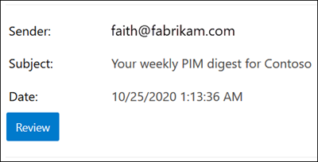

# <a name="quarantine-policies"></a>Karantänprinciper

> [!NOTE]
> Funktionerna som beskrivs i den här artikeln är för närvarande i förhandsversion, är inte tillgängliga för alla och kan komma att ändras.

Karantänprinciper (tidigare kallade karantäntaggar) i Exchange Online Protection (EOP) gör det möjligt för administratörer att styra vad användare kan göra med meddelanden i karantän baserat på hur meddelandet kom in i karantän.

EOP har traditionellt tillåtit eller förhindrat [](find-and-release-quarantined-messages-as-a-user.md) vissa nivåer av interaktivitet för meddelanden i karantän och [i skräppost-aviseringar för slutanvändare.](use-spam-notifications-to-release-and-report-quarantined-messages.md) Användare kan till exempel visa och släppa meddelanden som satts i karantän genom skräppostfiltrering som skräppost eller massutskick, men de kan inte visa eller släppa meddelanden som har satts i karantän som nätfiske (endast administratörer kan göra det).

För [funktioner som stöds](#step-2-assign-a-quarantine-policy-to-supported-features)anger karantänprinciper vad användare tillåts göra i skräppost-aviseringar för slutanvändare och i deras meddelanden i karantän (meddelanden där användaren är mottagare). Standardprinciper för karantän tilldelas automatiskt för att tillämpa de historiska funktionerna för användare i karantänmeddelanden. Du kan också skapa och tilldela anpassade karantänprinciper för att tillåta eller förhindra att slutanvändare utför specifika åtgärder på meddelanden i karantän.

De enskilda behörigheterna kombineras i följande förinställda behörighetsgrupper:

- Ingen åtkomst
- Begränsad åtkomst
- Fullständig åtkomst

De tillgängliga enskilda behörigheterna och vad som ingår eller inte ingår i de förinställda behörighetsgrupperna beskrivs i följande tabell:

<br>

****

|Behörighet|Ingen åtkomst|Begränsad åtkomst|Fullständig åtkomst|
|---|:---:|:---:|:---:|
|**Tillåt avsändare** (_PermissionToAllowSender_)||||
|**Spärra avsändare** (_PermissionToBlockSender_)||||
|**Delete** (_PermissionToDelete_)||||
|**Preview** _(PermissionToPreview_)||||
|**Tillåt mottagare att släppa ett meddelande från karantän** _(PermissionToRelease)_||||
|**Tillåt mottagare att begära att ett meddelande ska släppas från karantän** _(PermissionToRequestRelease_)||||
|

Om du inte gillar standardbehörigheterna i de förinställda behörighetsgrupperna kan du använda anpassade behörigheter när du skapar eller ändrar anpassade karantänprinciper. Mer information om vad varje behörighet gör finns i avsnittet Behörighetsinformation [för karantänprinciper](#quarantine-policy-permission-details) längre fram i den här artikeln.

Du skapar och tilldelar karantänprinciper i Microsoft 365 Defender-portalen eller i PowerShell (Exchange Online PowerShell för Microsoft 365-organisationer med Exchange Online-postlådor; fristående EOP PowerShell i EOP-organisationer utan Exchange Online postlådor).

## <a name="what-do-you-need-to-know-before-you-begin"></a>Vad behöver jag veta innan jag börjar?

- Du kan öppna Microsoft 365 Defender-portalen genom att gå till <https://security.microsoft.com>. Om du vill gå direkt till **sidan Karantänprinciper** öppnar du <https://security.microsoft.com/quarantineTags> .

- Information om hur du använder Windows PowerShell för att ansluta till Exchange Online finns i artikeln om att [ansluta till Exchange Online PowerShell](/powershell/exchange/connect-to-exchange-online-powershell). Information om hur du ansluter till fristående EOP PowerShell finns i [Anslut till Exchange Online Protection PowerShell](/powershell/exchange/connect-to-exchange-online-protection-powershell).

- Om du vill visa, skapa, ändra eller ta bort  karantänprinciper måste du vara medlem i rollerna Organisationshantering eller **Säkerhetsadministratör** i Microsoft 365 Defender portalen. Mer information finns under [Behörigheter på Microsoft 365 Defender-portalen](permissions-microsoft-365-security-center.md).

## <a name="step-1-create-quarantine-policies-in-the-microsoft-365-defender-portal"></a>Steg 1: Skapa karantänprinciper i Microsoft 365 Defender portalen

1. I Microsoft 365 Defender-portalen går du till **E-& för samarbete** – hotregler. Sätt principer för karantän \>  \>  och välj \>  sedan **karantänprinciper.**

2. På sidan **Karantänprincip klickar** du på Lägg  **Lägg till anpassad princip.**

3. Guiden **Ny princip** öppnas. På sidan **Principnamn** anger du ett kort men unikt namn i **rutan Principnamn.** Du måste identifiera och välja karantänprincipen efter namn i kommande steg. Klicka på **Nästa** när du är klar.

4. Välj **något av följande** värden på sidan Åtkomst till mottagarmeddelande:
   - **Ingen åtkomst**
   - **Begränsad åtkomst**
   - **Fullständig åtkomst**

   De enskilda behörigheterna som ingår i behörighetsgrupperna beskrivs tidigare i den här artikeln.

   Om du vill ange anpassade behörigheter **väljer du Ange specifik åtkomst (Avancerat)** och konfigurerar följande inställningar som visas:

     - **Välj inställning för släppåtgärd:** Välj något av följande värden:
       - **Ingen utgivningsåtgärd:** Det här är standardvärdet.
       - **Tillåt mottagare att släppa ett meddelande från karantän**
       - **Tillåt mottagare att begära att ett meddelande ska släppas från karantän**
     - **Välj ytterligare åtgärder som mottagare kan utföra för meddelanden** i karantän: Välj några, alla eller inga av följande värden:
       - **Radera**
       - **Förhandsgranska**
       - **Spärra avsändare**

   De här behörigheterna och deras påverkan på meddelanden i karantän [](#quarantine-policy-permission-details) och i skräppost-aviseringar för slutanvändare beskrivs i avsnittet Om karantänprinciper senare i den här artikeln.

   Klicka på **Nästa** när du är klar.

5. Granska **inställningarna på** sidan Granska princip som visas. Du kan välja **Redigera** i varje avsnitt om du vill ändra inställningarna i avsnittet. Eller så kan du klicka på **Föregående** eller välj den specifika sidan i guiden.

   När du är klar klickar du på **Skicka.**

6. På bekräftelsesidan som visas klickar du på **Klar**.

Nu är du redo att tilldela karantänprincipen till en karantänfunktion enligt beskrivningen i [avsnittet Steg 2.](#step-2-assign-a-quarantine-policy-to-supported-features)

### <a name="create-quarantine-policies-in-powershell"></a>Skapa karantänprinciper i PowerShell

Om du hellre vill använda PowerShell för att skapa karantänprinciper ska du ansluta till Exchange Online PowerShell eller Exchange Online Protection PowerShell och använda cmdleten **New-QuarantineTag.** Du har två olika metoder att välja bland:

- Använd _parametern EndUserQuarantinePermissionsValue._
- Använd _parametern EndUserQuarantinePermissions._

De här metoderna beskrivs i följande avsnitt.

#### <a name="use-the-enduserquarantinepermissionsvalue-parameter"></a>Använda parametern EndUserQuarantinePermissionsValue

Om du vill skapa en karantänprincip _med hjälp av parametern EndUserQuarantinePermissionsValue_ ska du använda följande syntax:

```powershell
New-QuarantineTag -Name "<UniqueName>" -EndUserQuarantinePermissionsValue <0 to 236>
```

Parametern _EndUserQuarantinePermissionsValue_ använder ett decimalvärde som konverteras från ett binärt värde. Det binära värdet motsvarar de tillgängliga karantänbehörigheterna för slutanvändare i en viss ordning. För varje behörighet är värdet 1 lika med Sant och värdet 0 är falskt.

Den ordning och de värden som krävs för varje enskild behörighet i förinställda behörighetsgrupper beskrivs i följande tabell:

<br>

****

|Behörighet|Ingen åtkomst|Begränsad åtkomst|Fullständig åtkomst|
|---|:---:|:---:|:---:|
|PermissionToAllowSender|0|0|1|
|PermissionToBlockSender|0|1|1|
|PermissionToDelete|0|1|1|
|PermissionToDownload<sup>\*</sup>|0|0|0|
|PermissionToPreview|0|1|1|
|PermissionToRelease<sup>\*\*</sup>|0|0|1|
|PermissionToRequestRelease<sup>\*\*</sup>|0|1|0|
|PermissionToViewHeader<sup>\*</sup>|0|0|0|
|Binärt värde|00000000|01101010|11101100|
|Decimalvärde som ska användas|0|106|236|
|

<sup>\*</sup> Det här värdet är för närvarande alltid 0. För PermissionToViewHeader döljer inte värdet 0  knappen Visa meddelanderubrik i informationen om det karantänfördelade meddelandet (knappen är alltid tillgänglig).

<sup>\*\*</sup> Ange inte båda dessa värden till 1. Ställ in 1 och en annan på 0 eller ange 0 för båda.

I det här exemplet skapas ett nytt namn på karantänprincipen NoAccess som tilldelar behörigheterna Ingen åtkomst enligt beskrivningen i föregående tabell.

```powershell
New-QuarantineTag -Name NoAccess -EndUserQuarantinePermissionsValue 0
```

För begränsad åtkomstbehörighet använder du värdet 106. För fullständig åtkomst använder du värdet 236.

För anpassade behörigheter använder du föregående tabell för att få det binära värde som motsvarar de behörigheter du vill ha. Konvertera det binära värdet till ett decimalvärde och använd decimalvärdet för parametern _EndUserQuarantinePermissionsValue._

Detaljerad information om syntax och parametrar finns i [Ny karantäntagg.](/powershell/module/exchange/new-quarantinetag)

#### <a name="use-the-enduserquarantinepermissions-parameter"></a>Använda parametern EndUserQuarantinePermissions

Så här skapar du en karantänprincip med hjälp av parametern _EndUserQuarantinePermissionsValue:_

A. Lagra ett objekt med karantänbehörigheter i en variabel med cmdleten **New-QuarantinePermissions.**

<p>

B. Använd variabeln som _värdet EndUserQuarantinePermissions_ i **kommandot Ny karantäntag.**

##### <a name="step-a-store-a-quarantine-permissions-object-in-a-variable"></a>Steg A: Lagra ett behörighetsobjekt i karantän för en variabel

Använd följande syntax:

```powershell
$<VariableName> = New-QuarantinePermissions [-PermissionToAllowSender <$true | $False>] [-PermissionToBlockSender <$true | $False>] [-PermissionToDelete <$true | $False>] [-PermissionToPreview <$true | $False>] [-PermissionToRelease <$true | $False>] [-PermissionToRequestRelease <$true | $False>]
```

Standardvärdet för oanvända parametrar `$false` är , så du behöver bara använda parametrarna där du vill ange värdet till `$true` .

Följande exempel visar hur du skapar behörighetsobjekt som motsvarar de förinställda behörighetsgrupperna:

- **Ingen åtkomst:**

  ```powershell
  $NoAccess = New-QuarantinePermissions
  ```

- **Begränsad åtkomst:**

  ```powershell
  $LimitedAccess = New-QuarantinePermissions -PermissionToBlockSender $true -PermissionToDelete $true -PermissionToPreview $true -PermissionToRequestRelease $true
  ```

- **Fullständig åtkomst:**

  ```powershell
  $FullAccess = New-QuarantinePermissions -PermissionToAllowSender $true -PermissionToBlockSender $true -PermissionToDelete $true -PermissionToPreview $true -PermissionToRelease $true
  ```

Om du vill se de värden du har angett kör du variabelnamnet som ett kommando (kör till exempel kommandot `$NoAccess` ).

För anpassade behörigheter ska du inte ange både parametrarna _PermissionToRelease och_ _PermissionToRequestRelease_ till `$true` . Ange en till `$true` och lämna den andra som , eller lämna båda som `$false` `$false` .

Du kan också ändra en befintlig objektvariabel för behörigheter när du har skapat men innan du använder den med hjälp av cmdleten **Set-QuarantinePermissions.**

Detaljerad information om syntax och parametrar finns [i New-QuarantinePermissions](/powershell/module/exchange/new-quarantinepermissions) och [Set-QuarantinePermissions.](/powershell/module/exchange/set-quarantinepermissions)

##### <a name="step-b-use-the-variable-in-the-new-quarantinetag-command"></a>Steg B: Använda variabeln i New-QuarantineTag kommando

När du har skapat och lagrat behörighetsobjektet i en variabel använder du variabeln för parametervärdet _EndUserQuarantinePermission_ i följande **New-QuarantineTag-kommando:**

```powershell
New-QuarantineTag -Name "<UniqueName>" -EndUserQuarantinePermissions $<VariableName>
```

I det här exemplet skapas en ny karantänprincip med namnet LimitedAccess med `$LimitedAccess` behörighetsobjektet som beskrevs och skapades i föregående steg.

```powershell
New-QuarantineTag -Name LimitedAccess -EndUserQuarantinePermissions $LimitedAccess
```

Detaljerad information om syntax och parametrar finns i [Ny karantäntagg.](/powershell/module/exchange/new-quarantinetag)

## <a name="step-2-assign-a-quarantine-policy-to-supported-features"></a>Steg 2: Tilldela en karantänprincip till funktioner som stöds

I _skyddsfunktioner_ som stöds och som sätt meddelanden eller filer i karantän (automatiskt eller som en konfigurerbar åtgärd) kan du tilldela en karantänprincip till de tillgängliga karantänåtgärderna. Funktioner som sätt meddelanden i karantän och tillgängligheten till karantänprinciper beskrivs i följande tabell:

<br>

****

|Funktion|Karantänprinciper som stöds?|Standardprinciper för karantän som används|
|---|:---:|---|
|[Principer för skydd mot skräppost:](configure-your-spam-filter-policies.md) <ul><li>**Spam** (_SpamAction_)</li><li>**Skräppost med hög konfidens** _(HighConfidenceSpamAction_)</li><li>**Nätfiske** (_PhishSpamAction_)</li><li>**Nätfiske med** hög konfidens (_HighConfidencePhishAction_)</li><li>**Bulk** (_BulkSpamAction_)</li></ul>|Ja|<ul><li>DefaultSpamTag (fullständig åtkomst)</li><li>DefaultHighConfSpamTag (fullständig åtkomst)</li><li>DefaultPhishTag (fullständig åtkomst)</li><li>DefaultHighConfPhishTag (ingen åtkomst)</li><li>DefaultBulkTag (fullständig åtkomst)</li></ul>
|Principer mot nätfiske: <ul><li>[Spoof intelligence protection](set-up-anti-phishing-policies.md#spoof-settings) _(AuthenticationFailAction_)</li><li>[Personifieringsskydd:](set-up-anti-phishing-policies.md#impersonation-settings-in-anti-phishing-policies-in-microsoft-defender-for-office-365)<sup>\*</sup> <ul><li>**Om meddelandet identifieras som en imiterad användare** (_TargetedUserProtectionAction_)</li><li>**Om meddelandet identifieras som en imiterad domän** _(TargetedDomainProtectionAction)_</li><li>**Om postlådeinformation identifierar och utger sig för att vara användare** (_MailboxIntelligenceProtectionAction_)</li></ul></li></ul></ul>|Nej|Ej a|
|[Principer för skadlig programvara:](configure-anti-malware-policies.md)Alla identifierade meddelanden har alltid satts i karantän.|Nej|Ej a|
|[Säkra bilagor för SharePoint, OneDrive och Microsoft Teams](mdo-for-spo-odb-and-teams.md)|Nej|Ej a|
|[E-postflödesregler](/exchange/security-and-compliance/mail-flow-rules/mail-flow-rules) (kallas även transportregler) med åtgärden: Leverera meddelandet till **den värdinde karantänen** _(karantän)._|Nej|Ej a|
|

<sup>\*</sup>Inställningarna för personifieringsskydd är endast tillgängliga i principer mot nätfiske i Microsoft Defender för Office 365.

Om du är nöjd med de behörigheter för slutanvändare som anges i standardprinciperna för karantän behöver du inte göra något. Om du vill anpassa slutanvändarfunktionerna (tillgängliga knappar) i skräppost-aviseringar för slutanvändare eller i meddelandeinformation i karantän kan du tilldela en anpassad karantänprincip.

### <a name="assign-quarantine-policies-in-anti-spam-policies-in-the-microsoft-365-defender-portal"></a>Tilldela karantänprinciper i principer för skydd mot skräppost i Microsoft 365 Defender portalen

Fullständiga instruktioner för hur du skapar och ändrar principer för skydd mot skräppost beskrivs i Konfigurera principer för skydd [mot skräppost i EOP.](configure-your-spam-filter-policies.md)

1. I Microsoft 365 Defender går du till Principer för **&** \>  \>  \> **e-& e-postsamarbete** i avsnittet Principer för skräppost. Eller öppna <https://security.microsoft.com/antispam> .

2. Gör **något av följande på** sidan Principer för skydd mot skräppost:
   - Hitta och välj en befintlig **princip för inkommande** skräppostskydd.
   - Skapa en ny **princip för inkommande** skräppostskydd.

3. Gör något av följande:
   - **Redigera befintlig policy för skräppostskydd:** Gå till avsnittet  Åtgärder i den utfällade principinformationen och klicka på **Redigera åtgärder.**
   - **Skapa en ny princip mot skräppost:** I den nya principguiden går du till **sidan** Åtgärder.

4. På **sidan** Åtgärder. Varje bedömning som har **åtgärden Karantänmeddelande** kommer också att ha rutan Välj **karantänprincip** där du kan välja en motsvarande karantänprincip.

   **Obs!** När du skapar en ny princip anger ett tomt värde för **Välj** karantänprincip att standardprincipen för karantänen för den här bedömningsplatsen används. När du senare redigerar principen ersätts de tomma värdena med de faktiska standardnamnen för karantänprinciper enligt beskrivningen i föregående tabell.

   

5. Klicka på **Spara** när du är klar.

#### <a name="assign-quarantine-policies-in-anti-spam-policies-in-powershell"></a>Tilldela karantänprinciper i principer för skydd mot skräppost i PowerShell

Om du hellre vill använda PowerShell för att tilldela karantänprinciper i principer mot skräppost ska du ansluta till Exchange Online PowerShell eller Exchange Online Protection PowerShell och använda följande syntax:

```powershell
<New-HostedContentFilterPolicy -Name "<Unique name>" | Set-HostedContentFilterPolicy -Identity "<Policy name>">  [-SpamAction Quarantine] [-SpamQuarantineTag <QuarantineTagName>] [-HighConfidenceSpamAction Quarantine] [-HighConfidenceSpamQuarantineTag <QuarantineTagName>] [-PhishSpamAction Quarantine] [-PhishQuarantineTag <QuarantineTagName>] [-HighConfidencePhishQuarantineTag <QuarantineTagName>] [-BulkSpamAction Quarantine] [-BulkQuarantineTag <QuarantineTagName>] ...
```

**Anmärkningar**:

- Standardvärdet för parametern _HighConfidencePhishAction_ är Karantän, så du behöver inte ange åtgärder för karantän för identifiering av nätfiske med hög säkerhet i nya principer för skräppostskydd. För alla andra skräppostfiltreringsprinciper i nya eller befintliga principer mot skräppost är karantänsprincipen bara effektiv om åtgärdsvärdet är karantän. Om du vill se åtgärdsvärdena i befintliga principer för skräppostskydd kör du följande kommando:

  ```powershell
  Get-HostedContentFilterPolicy | Format-Table Name,*SpamAction,HighConfidencePhishAction
  ```

  Mer information om standardåtgärdsvärdena och de rekommenderade åtgärdsvärdena för Standard och Strikt finns i Inställningarna för [EOP-principen för](recommended-settings-for-eop-and-office365.md#eop-anti-spam-policy-settings)skydd mot skräppost.

- En skräppostfiltrering som skulle vara utan en motsvarande karantänprincipparameter innebär att [standardprincipen för](#step-2-assign-a-quarantine-policy-to-supported-features) karantänen används för den aktuella bedömningsposten.

  Du behöver bara ersätta en standardprincip för karantän med en anpassad karantänprincip om du vill ändra slutanvändarfunktionerna för meddelanden i karantän.

- En ny policy mot skräppost i PowerShell kräver en princip för skräppostfilter (inställningar) med cmdleten **New-HostedContentFilterPolicy** och en ny skräppostfilterregel (mottagarfilter) med cmdleten **New-HostedContentFilterRule.** Instruktioner finns i Använda [PowerShell för att skapa principer mot skräppost.](configure-your-spam-filter-policies.md#use-powershell-to-create-anti-spam-policies)

I det här exemplet skapas en ny policy för skräppostfilter med namnet Research Department med följande inställningar:

- Åtgärden för all skräppostfiltrering är inställd på karantän.
- Den anpassade karantänprincipen med namnet NoAccess som tilldelar **inga** åtkomstbehörigheter ersätter alla standardprinciper för karantän som inte redan tilldelar Inga **åtkomstbehörigheter** som standard.

```powershell
New-HostedContentFilterPolicy -Name Research Department -SpamAction Quarantine -SpamQuarantineTag NoAccess -HighConfidenceSpamAction Quarantine -HighConfidenceSpamQuarantineTag NoAction -PhishSpamAction Quarantine -PhishQuarantineTag NoAction -BulkSpamAction Quarantine -BulkQuarantineTag NoAccess
```

Detaljerad information om syntax och parametrar finns i [New-HostedContentFilterPolicy](/powershell/module/exchange/new-hostedcontentfilterpolicy).

Det här exemplet ändrar den befintliga policyn för skräppostfilter med namnet Human Resources. Åtgärden för karantänen för skräppost är inställd på karantän och den anpassade karantänprincipen NoAccess tilldelas.

```powershell
Set-HostedContentFilterPolicy -Identity "Human Resources" -SpamAction Quarantine -SpamQuarantineTag NoAccess
```

Detaljerad information om syntax och parametrar finns i [Set-HostedContentFilterPolicy](/powershell/module/exchange/set-hostedcontentfilterpolicy).

## <a name="configure-global-quarantine-notification-settings-in-the-microsoft-365-defender-portal"></a>Konfigurera inställningar för globala karantänmeddelanden i Microsoft 365 Defender portalen

Med de globala inställningarna för karantänprinciper kan du anpassa skräppost-aviseringarna för slutanvändaren som skickas till mottagare av meddelanden som har satts i karantän. Mer information om dessa meddelanden finns i [Skräppost-aviseringar för slutanvändare.](use-spam-notifications-to-release-and-report-quarantined-messages.md)

1. I Microsoft 365 Defender-portalen går du till **E-& för samarbete** – hotregler. Sätt principer för karantän \>  \>  och välj \>  sedan **karantänprinciper.**

2. Välj **Globala inställningar** på sidan **Karantänprincip.**

3. I den **utfällfältet** för meddelandeinställningar för karantän som öppnas konfigurerar du några eller alla av följande inställningar:

   - **Visningsnamn:** Anpassa avsändarens visningsnamn som används i skräppost-aviseringarna för slutanvändaren.

     För varje språk som du har lagt till väljer du språket i rutan för det andra språket (klicka inte på X) och ange det textvärde du vill ha i rutan **Visningsnamn.**

     Följande skärmbild visar det anpassade visningsnamnet i en skräppost-avisering för slutanvändare:

     

   - **Ansvarsfriskrivning:** Lägg till en anpassad ansvarsfriskrivning längst ned i skräppost-aviseringar för slutanvändaren. Lokaliserad text, **en ansvarsfriskrivning från organisationen:** inkluderas alltid först, följt av den text som du anger.

     För varje språk som du har lagt till väljer du språk i rutan för det andra språket (klicka inte på X) och ange det textvärde du vill ha i rutan **Ansvarsfriskrivning.**

     Följande skärmbild visar den anpassade ansvarsfriskrivningen i en skräppost-avisering för slutanvändare:

     

   - **Välj språk:** Skräppost-aviseringar för slutanvändare har redan lokaliserats baserat på mottagarens språkinställningar. Du kan ange anpassad text på olika språk för värdena **Visningsnamn och** **Ansvarsfriskrivning.**

     Välj minst ett språk i rutan för det första språket och klicka sedan på Lägg **till**. Du kan välja flera språk genom att klicka **på Lägg** till efter varje. En ruta för avsnittsspråk visar alla språk som du har valt:

     

   - **Använd min företagslogotyp:** Välj det här alternativet om du vill ersätta standardlogotypen som visas längst upp bland skräppost-aviseringarna för slutanvändaren. Innan du gör det måste du följa anvisningarna i Anpassa företagets [Microsoft 365 för att](../../admin/setup/customize-your-organization-theme.md) ladda upp din anpassade logotyp.

     Följande skärmbild visar en anpassad logotyp i en skräppost-avisering för slutanvändare:

     

## <a name="view-quarantine-policies-in-the-microsoft-365-defender-portal"></a>Visa karantänprinciper i Microsoft 365 Defender portalen

1. I Microsoft 365 Defender-portalen går du till **E-& för samarbete** – hotregler. Sätt principer för karantän \>  \>  och välj \>  sedan **karantänprinciper.**

2. På **sidan Karantänprincip** visas listan med principer efter **namn** och datum **för senaste** uppdatering.

3. Om du vill visa inställningarna för inbyggda eller anpassade karantänprinciper väljer du karantänprincipen i listan genom att klicka på namnet.

4. Om du vill visa de globala inställningarna klickar du **på Globala inställningar**

### <a name="view-quarantine-policies-in-powershell"></a>Visa karantänprinciper i PowerShell

Om du hellre vill använda PowerShell för att visa karantänprinciper gör du något av följande:

- Om du vill visa en sammanfattningslista över alla inbyggda eller anpassade principer kör du följande kommando:

  ```powershell
  Get-QuarantineTag | Format-Table Name
  ```

- Om du vill visa inställningarna för inbyggda eller anpassade karantänprinciper ersätter du med namnet på \<QuarantinePolicyName\> karantänprincipen och kör följande kommando:

  ```powershell
  Get-QuarantineTag -Identity "<QuarantinePolicyName>"
  ```

- Kör följande kommando för att visa de globala inställningarna:

  ```powershell
  Get-QuarantineTag -QuarantineTagType GlobalQuarantineTag
  ```

Detaljerad information om syntax och parametrar finns i [Get-HostedContentFilterPolicy](/powershell/module/exchange/get-hostedcontentfilterpolicy).

## <a name="modify-quarantine-policies-in-the-microsoft-365-defender-portal"></a>Ändra karantänprinciper i Microsoft 365 Defender portalen

1. I Microsoft 365 Defender-portalen går du till **E-& för samarbete** – hotregler. Sätt principer för karantän \>  \>  och välj \>  sedan **karantänprinciper.**

2. Markera principen **på sidan** Karantänprinciper genom att klicka på namnet.

3. När du har valt principen klickar du på  **princip, Redigera** princip som visas.

4. Guiden **Redigera princip** som öppnas är  i princip identisk med guiden Ny princip enligt beskrivningen i avsnittet Skapa principer [för Microsoft 365 Defender-portalen](#step-1-create-quarantine-policies-in-the-microsoft-365-defender-portal) tidigare i den här artikeln.

   Den största skillnaden är att du inte kan byta namn på en befintlig princip.

5. När du är klar med att ändra principen går du till sidan **Sammanfattning och** klickar på **Skicka**.

### <a name="modify-quarantine-policies-in-powershell"></a>Ändra karantänprinciper i PowerShell

Om du hellre vill använda PowerShell för att ändra en anpassad karantänprincip ersätter du med namnet på karantänprincipen \<QuarantinePolicyName\> och använder följande syntax:

```powershell
Set-QuarantineTag -Identity "<QuarantinePolicyName>" [Settings]
```

De tillgängliga inställningarna är desamma som beskrivs för att skapa karantänprinciper tidigare i den här artikeln.

Detaljerad information om syntax och parametrar finns i [Set-QuarantineTag](/powershell/module/exchange/set-quarantinetag).

## <a name="remove-quarantine-policies-in-the-microsoft-365-defender-portal"></a>Ta bort karantänprinciper i Microsoft 365 Defender portalen

**Anmärkningar**:

- Du kan inte ta bort inbyggda karantänprinciper.
- Innan du tar bort en anpassad karantänprincip ska du kontrollera att den inte används. Kör till exempel följande kommando i PowerShell:

  ```powershell
  Get-HostedContentFilterPolicy | Format-List Name,*QuarantineTag
  ```

  Om karantänprincipen används ersätter [du den tilldelade karantänprincipen innan](#step-2-assign-a-quarantine-policy-to-supported-features) du tar bort den.

1. I Microsoft 365 Defender-portalen går du till **E-& för samarbete** – hotregler. Sätt principer för karantän \>  \>  och välj \>  sedan **karantänprinciper.**

2. På sidan **Karantänprincip** väljer du den anpassade karantänprincip som du vill ta bort genom att klicka på namnet.

3. När du har valt principen klickar du på ikonen  **bort** princip som visas.

4. Klicka **på Ta** bort princip i bekräftelsedialogrutan som visas.

### <a name="remove-quarantine-policies-in-powershell"></a>Ta bort karantänprinciper i PowerShell

Om du hellre vill använda PowerShell för att ta bort en anpassad karantänprincip ersätter du med namnet på \<QuarantinePolicyName\> karantänprincipen och kör följande kommando:

```powershell
Remove-QuarantineTag -Identity "<QuarantinePolicyName>"
```

Detaljerad information om syntax och parametrar finns i [Ta bort karantäntagg.](/powershell/module/exchange/remove-quarantinetag)

## <a name="quarantine-policy-permission-details"></a>Information om karantänprinciper

I följande avsnitt beskrivs effekterna av förinställda behörighetsgrupper och enskilda behörigheter i information om meddelanden i karantän och i skräppost-aviseringar för slutanvändare.

### <a name="preset-permissions-groups"></a>Förinställda behörighetsgrupper

De enskilda behörigheterna som ingår i förinställda behörighetsgrupper visas i tabellen i början av den här artikeln.

#### <a name="no-access"></a>Ingen åtkomst

Om karantänprincipen tilldelar **behörigheterna Ingen åtkomst** (ingen behörighet) får användarna fortfarande vissa grundläggande funktioner:

- **Information om meddelanden i karantän:** **Knappen Visa meddelanderubrik** är alltid tillgänglig.

  

- **Skräppost-aviseringar för slutanvändare:** **Knappen** Granska som för användaren till meddelandet i karantän är alltid tillgänglig.

  

#### <a name="limited-access"></a>Begränsad åtkomst

Om karantänprincipen tilldelar **behörigheterna Begränsad** åtkomst får användarna följande funktioner:

- **Information om meddelanden i karantän:** Följande knappar är tillgängliga:
  - **Begär utgivning**
  - **Visa meddelanderubrik**
  - **Förhandsgranskningsmeddelande**
  - **Spärra avsändare**
  - **Ta bort från karantän**

  

- **Skräppost-aviseringar för slutanvändare:** Följande knappar är tillgängliga:
  - **Spärra avsändare**
  - **Granska**

  

#### <a name="full-access"></a>Fullständig åtkomst

Om karantänprincipen tilldelar **fullständig åtkomst** (alla tillgängliga behörigheter) får användarna följande funktioner:

- **Information om meddelanden i karantän:** Följande knappar är tillgängliga:
  - **Släpp meddelande**
  - **Visa meddelanderubrik**
  - **Förhandsgranskningsmeddelande**
  - **Spärra avsändare**
  - **Tillåt avsändare**
  - **Ta bort från karantän**

  

- **Skräppost-aviseringar för slutanvändare:** Följande knappar är tillgängliga:
  - **Spärra avsändare**
  - **Version**
  - **Granska**

  

### <a name="individual-permissions"></a>Enskilda behörigheter

> [!NOTE]
> Kom ihåg att användarna alltid får de knappar som beskrivs i [avsnittet Ingen](#no-access) åtkomst. Dessa knappar ingår inte i de enskilda behörighetsbeskrivningarna.

#### <a name="allow-sender-permission"></a>Tillåt avsändarbehörighet

Med **tillåt avsändarbehörighet** _(PermissionToAllowSender)_ styr du åtkomsten till knappen som gör att användare enkelt kan lägga till avsändaren i karantän Valv sina avsändare i Valv avsändare.

- **Information om meddelanden i karantän:**
  - **Tillåt avsändarbehörighet** aktiverad: **Knappen Tillåt avsändare** är tillgänglig.
  - **Tillåt avsändarbehörighet** inaktiverad: **Knappen Tillåt** avsändare är inte tillgänglig.

- **Skräppost-aviseringar för slutanvändare**: Ingen effekt.

Mer information om listan Valv-avsändare finns i Förhindra att betrodda avsändare [blockeras](https://support.microsoft.com/office/274ae301-5db2-4aad-be21-25413cede077#__toc304379666) och Använda Exchange Online PowerShell för att konfigurera samlingen [safelist för en postlåda.](configure-junk-email-settings-on-exo-mailboxes.md#use-exchange-online-powershell-to-configure-the-safelist-collection-on-a-mailbox)

#### <a name="block-sender-permission"></a>Blockera avsändarbehörighet

Behörigheten **Blockera avsändare** _(PermissionToBlockSender)_ styr åtkomsten till knappen som gör att användare enkelt kan lägga till avsändaren i karantän i sin lista med spärrade avsändare.

- **Information om meddelanden i karantän:**
  - **Behörigheten Blockera** avsändare aktiverad: **Knappen Spärra** avsändare är tillgänglig.
  - **Spärra avsändarbehörighet** inaktiverad: **Knappen Spärra** avsändare är inte tillgänglig.

- **Skräppost-aviseringar för slutanvändare:**
  - **Spärra avsändarbehörighet** inaktiverad: **Knappen Spärra** avsändare är inte tillgänglig.
  - **Behörigheten Blockera** avsändare aktiverad: **Knappen Spärra** avsändare är tillgänglig.

Mer information om listan Spärrade avsändare [](https://support.microsoft.com/office/274ae301-5db2-4aad-be21-25413cede077#__toc304379667) finns i Spärra meddelanden från någon och Använda Exchange Online PowerShell för att konfigurera samlingslistan över betrodda avsändare [i en postlåda.](configure-junk-email-settings-on-exo-mailboxes.md#use-exchange-online-powershell-to-configure-the-safelist-collection-on-a-mailbox)

#### <a name="delete-permission"></a>Ta bort behörighet

Behörigheten **Delete** _(PermissionToDelete)_ styr möjligheten för användare att ta bort sina meddelanden (meddelanden där användaren är mottagare) från karantän.

- **Information om meddelanden i karantän:**
  - **Ta** bort behörighet aktiverad: **Knappen Ta bort från** karantän är tillgänglig.
  - **Ta** bort behörighet inaktiverad: **Knappen Ta bort från** karantän är inte tillgänglig.

- **Skräppost-aviseringar för slutanvändare**: Ingen effekt.

#### <a name="preview-permission"></a>Förhandsgranskningsbehörighet

**Förhandsversionsbehörigheten** _(PermissionToPreview)_ styr möjligheten för användare att förhandsgranska sina meddelanden i karantän.

- **Information om meddelanden i karantän:**
  - **Förhandsgranskningsbehörighet** aktiverad: **Knappen Förhandsgranska** meddelande är tillgänglig.
  - **Förhandsgranskningsbehörighet** **inaktiverad: Knappen Förhandsgranska** meddelande är inte tillgänglig.

- **Skräppost-aviseringar för slutanvändare**: Ingen effekt.

#### <a name="allow-recipients-to-release-a-message-from-quarantine-permission"></a>Tillåt mottagare att släppa ett meddelande från karantänbehörighet

Allow **recipients to release a message from quarantine** permission _(PermissionToRelease)_ controls the ability of users to release their quarantined messages directly and without the approval of an admin.

- **Information om meddelanden i karantän:**
  - Behörighet aktiverad: Knappen **Släpp meddelande** är tillgänglig.
  - Behörigheten är **inaktiverad: Knappen Släpp** meddelande är inte tillgänglig.

- **Skräppost-aviseringar för slutanvändare:**
  - Behörighet aktiverad: **Knappen Släpp** är tillgänglig.
  - Behörigheten är **inaktiverad: Knappen** Släpp är inte tillgänglig.

#### <a name="allow-recipients-to-request-a-message-to-be-released-from-quarantine-permission"></a>Tillåt mottagare att begära att ett meddelande ska släppas från karantänbehörighet

Tillåta **mottagare att** begära att ett meddelande ska släppas från karantänbehörighet  _(PermissionToRequestRelease)_ kontrollerar möjligheten för användare att begära att meddelanden i karantän ska släppas. Meddelandet släpps bara när en administratör godkänt begäran.

- **Information om meddelanden i karantän:**
  - Behörighet aktiverad: **Knappen Begär version** är tillgänglig.
  - Behörigheten är **inaktiverad: Knappen Begär** version är inte tillgänglig.

- **Skräppost-aviseringar för slutanvändare:** **Knappen Släpp** är inte tillgänglig.
