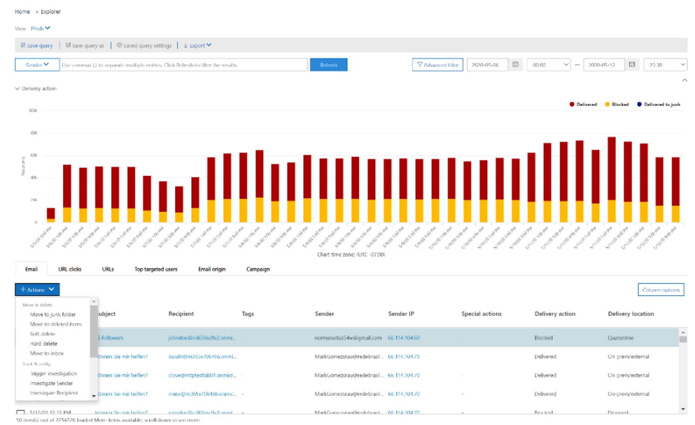
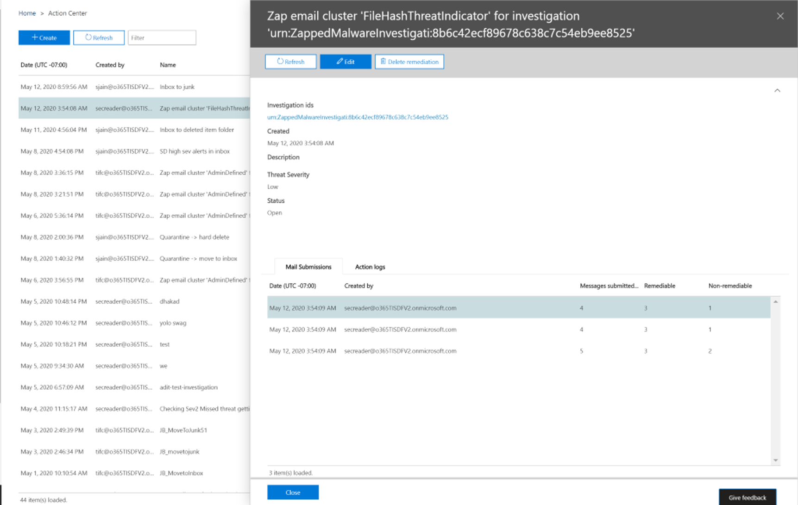

# Åtgärda skadlig e-post som levereras i Office 365Remediate malicious email delivered in Office 365

[!INCLUDE [Microsoft 365 Defender rebranding](../includes/microsoft-defender-for-office.md)]

**Gäller för****Applies to**
- [Microsoft Defender för Office 365 abonnemang 2Microsoft Defender for Office 365 plan 2](defender-for-office-365.md)

Åtgärd innebär att vidta en bestämt åtgärd mot ett hot.Remediation means taking a prescribed action against a threat. Skadlig e-post som skickas till din organisation kan tas bort antingen av systemet, via nolltimmars automatisk rensning (ZAP) eller av säkerhetsgrupper genom åtgärder som att flytta till Inkorgen *,* gå till *skräppost,* gå till borttagna *objekt,* mjuk borttagning eller ta bort permanent *.* Malicious email sent to your organization can be cleaned up either by the system, through zero-hour auto purge (ZAP), or by security teams through remediation actions like *move to inbox*, *move to junk*, *move to deleted items*, *soft delete*, or *hard delete*. Med Microsoft Defender för Office 365 P2/E5 kan säkerhetsteam åtgärda hot via e-post och samarbete via manuell och automatiserad undersökning.Microsoft Defender for Office 365 P2/E5 enables security teams to remediate threats in email and collaboration functionality through manual and automated investigation.

> [!NOTE]
> För att åtgärda skadlig e-post behöver säkerhetsteamen *tilldelad sök-* och rensningsrollen.To remediate malicious email, security teams need the *search and purge* role assigned to them. Rolltilldelningen utförs genom [behörigheter i Säkerhets- & Efterlevnadscenter.](permissions-in-the-security-and-compliance-center.md)Role assignment is done through [permissions in the Security & Compliance Center](permissions-in-the-security-and-compliance-center.md).

## Vad du behöver veta innan du börjarWhat you need to know before you begin

Administratörer kan vidta nödvändiga åtgärder i e-postmeddelanden, men för  att få åtgärderna godkända måste de ha tilldelats sök- och rensningsrollen via behörigheter **för säkerhets-** & \> **efterlevnadscenter.**Admins can take required action on emails, but to get those actions approved, they must have the *search and purge* role assigned to them via **Security & Compliance Center** \> **Permissions**. Utan rollen "sök och rensa" som har lagts till i en av rollgrupperna kan de inte utföra åtgärden.Without the "search and purge" role added to one of the role-groups, they won't be able to execute the action.

## Manuell och automatiserad åtgärdManual and automated remediation

*Manuell sökning* sker när säkerhetsgrupper identifierar hot manuellt med hjälp av sök- och filtreringsfunktionerna i Threat Explorer.*Manual hunting* occurs when security teams identify threats manually by using the search and filtering capabilities in Threat Explorer. Åtgärder för manuell e-post kan utlösas via valfri e-postvy *(skadlig* kod, *phish* eller *all* e-post) när du har identifierat en uppsättning e-postmeddelanden som behöver åtgärdas.Manual email remediation can be triggered through any email view (*Malware*, *Phish*, or *All email*) after you identify a set of emails that need to be remediated.

> [!div class="mx-imgBorder"]
> 

Säkerhetsteam kan använda Hotutforskaren för att välja e-postmeddelanden på flera olika sätt:Security teams can use Threat Explorer to select emails in several ways:

- Välja e-postmeddelanden för hand: Använd filter i olika vyer.Choose emails by hand: Use filters in various views. Välj upp till 100 e-postmeddelanden att åtgärda.Select up to 100 emails to remediate.

- Frågeval: Markera en hel fråga genom att klicka på **knappen Markera allt** högst upp.Query selection: Select an entire query by using the top **select all** button. Samma fråga visas också i information om inskickade e-postmeddelanden i åtgärdscenter.The same query is also shown in action center mail submission details.

- Frågeval med undantag: Ibland vill säkerhetsåtgärder grupper åtgärda e-postmeddelanden genom att välja en hel fråga och exkludera vissa e-postmeddelanden från frågan manuellt.Query selection with exclusion: Sometimes security operations teams may want to remediate emails by selecting an entire query and excluding certain emails from the query manually. För att göra det kan en administratör använda kryssrutan Markera **alla och rulla** nedåt för att utesluta e-postmeddelanden manuellt.To do so, an admin can use the **Select all** check box and scroll down to exclude emails manually. Frågan kan innehålla högst 1 000 e-postmeddelanden.The query can hold a maximum of 1,000 emails. Det maximala antalet undantag är 100.The maximum number of exclusions is 100.

När du har valt e-postmeddelanden i Hotutforskaren kan du starta åtgärden genom att vidta direktåtgärder eller köa e-postmeddelanden för en åtgärd:Once emails are selected through Threat Explorer, you can start remediation by taking direct action or by queuing up emails for an action:

- Direktgodkännande: När åtgärder som att flytta till Inkorgen , gå till  skräppost *,* flytta till borttagna *objekt,* mjuk borttagning eller permanent borttagning markeras av säkerhetspersonalen som har rätt behörighet och nästa steg i åtgärden följs, påbörjas den valda åtgärden. Direct approval: When actions like *move to inbox*, *move to junk*, *move to deleted items*, *soft delete*, or *hard delete* are selected by security personnel who have appropriate permissions, and the next steps in remediation are followed, the remediation process begins to execute the selected action. En tillfällig utfällning visar den pågående åtgärd.A temporary flyout shows remediation in progress.

- Tvåstegsgodkännande: Åtgärden "Lägg till i åtgärd" kan vidtas av administratörer som inte har rätt behörighet eller som behöver vänta på att åtgärden ska utföras.Two-step approval: An "add to remediation" action can be taken by admins who don't have appropriate permissions or who need to wait to execute the action. I det här fallet läggs riktade e-postmeddelanden till i en åtgärdsbehållare.In this case, the targeted emails are added to a remediation container. Godkännande krävs innan reparationen utförs.Approval is needed before the remediation is executed.

**Automatiserade undersöknings- och** svarsåtgärder utlöses av varningar eller av säkerhetsåtgärder grupper från Threat Explorer.**Automated investigation and response** actions are triggered by alerts or by security operations teams from Threat Explorer. Dessa kan omfatta rekommenderade åtgärdsåtgärder som måste godkännas av ett team för säkerhetsåtgärder.These may include recommended remediation actions that must be approved by a security operations team. De här åtgärderna finns på fliken **Åtgärd** i den automatiska undersökningen.These actions are included on the **Action** tab in the automated investigation.

> [!div class="mx-imgBorder"]
> 

Alla åtgärder (antingen direkt godkännande eller tvåstegsgodkännande) som skapats i Hotutforskaren samt godkända åtgärder från automatiserade undersökningar visas i Åtgärdscenter.All remediations (either direct approval or two-step approval) that were created in Threat Explorer as well as approved actions coming from automated investigations are displayed in the Action Center. Du kommer åt dem  via den vänstra navigeringspanelen under \> **Granska Åtgärdscenter**.Access these via the left navigation panel under **Review** \> **Action Center**.

> [!div class="mx-imgBorder"]
> 

Åtgärdscenter visar alla åtgärder för de senaste 30 dagarna.Action Center shows all remediation actions for the past 30 days. Åtgärder som utförs i Hotutforskaren listas efter namnet som teamet för säkerhetsåtgärder gav när reparationen skapades.Actions taken through Threat Explorer are listed by the name that the security operations team provided when the remediation was created. Åtgärder som vidtas genom automatiska undersökningar har rubriker som börjar med den relaterade aviseringen som utlöste undersökningen, till exempel "Zap email cluster... ".Actions taken through automated investigations have titles that begin with the related alert that triggered the investigation, such as "Zap email cluster... ."

Öppna ett åtgärdsobjekt för att visa information om det, inklusive dess namn, skapandedatum, beskrivning, allvarlighetsgrad och status för hot.Open any remediation item to view details about it, including its name, creation date, description, threat severity, and status. Dessutom visas följande två flikar.It also shows the following two tabs.

- **Fliken för inskick** av e-post: Visar antalet e-postmeddelanden som skickats via Hotutforskaren eller automatiserade undersökningar som ska åtgärdas.**Mail submission** tab: Displays the number of emails submitted through Threat Explorer or automated investigations to be remediated. Dessa e-postmeddelanden kan vara åtgärdsbara eller inte åtgärdsbara.These emails can be actionable or not actionable.

  > [!div class="mx-imgBorder"]
  > 

  - **Åtgärd kan** åtgärdas: E-postmeddelanden på följande molnbaserade postlådeplatser kan åtgärdas och flyttas:**Actionable**: Emails in the following cloud mailbox locations can be acted on and moved:
    - InkorgenInbox
    - SkräppostJunk
    - Borttagen mappDeleted folder
    - Mjuk borttaget mappSoft-deleted folder

      > [!NOTE]
      > För närvarande kan endast en användare med åtkomst till postlådan återställa objekt från en mjuk borttagna mapp.Currently, only a user with access to the mailbox can recover items from a soft-deleted folder.

  - **Inte åtgärdsbar:** E-postmeddelanden på följande platser kan inte åtgärdas eller flyttas i åtgärder:**Not actionable**: Emails in the following locations can't be acted on or moved in remediation actions:
    - KarantänQuarantine
    - Mappen BorttagetHard-deleted folder
    - Lokalt/externtOn-premises/external
    - Misslyckades/ignoreradesFailed/dropped

  Misstänkta meddelanden kategoriseras som antingen åtgärdsbara eller icke-åtgärdsbara.Suspicious messages are categorized as either remediable or nonremediable. I de flesta fall är de åtgärderbara och icke-remedierbara meddelandena samma som det totala antalet skickade meddelanden.In most cases, remediable and nonremediable messages combine equals total messages submitted. Men i sällsynta fall kanske det inte är sant.But in rare cases this may not be true. Det här kan inträffa på grund av systemfördröjningar, tidsgränser eller utgångna meddelanden.This can happen because of system delays, timeouts, or expired messages. Meddelanden upphör att gälla baserat på lagringstiden för hotutforskaren för din organisation.Messages expire based on the Threat Explorer retention period for your organization.

  Om du inte åtgärdar gamla meddelanden efter att organisationen har kvarhållningstiden för Hotutforskaren är det lämpligt att försöka åtgärda objekt om du ser flera inkonsekvenser.Unless you're remediating old messages after your organization's Threat Explorer retention period, it's advisable to retry remediating items if you see number inconsistencies. För systemfördröjningar uppdateras vanligtvis åtgärdsuppdateringar inom några timmar.For system delays, remediation updates are typically refreshed within a few hours.

  Om organisationens bevarandeperiod för e-post i Threat Explorer är 30 dagar och du åtgärdar e-postmeddelanden 29–30 dagar, kanske antalet e-postinskickade inskickade meddelanden inte alltid adderar.If your organization's retention period for email in Threat Explorer is 30 days and you're remediating emails going back 29-30 days, mail submission counts may not always add up. E-postmeddelandena kan redan ha börjat flyttas från lagringstiden.The emails might have started moving out of the retention period already.

  Om åtgärder har fastnat i läget "Pågår" ett tag beror det sannolikt på systemfördröjningar.If remediations are stuck in the "In progress" state for a while, it's likely due to system delays. Det kan ta upp till några timmar att åtgärda.It could take up to a few hours to remediate. Du kan se variationer i antalet e-postinskickade meddelanden eftersom vissa av e-postmeddelandena kanske inte hade inkluderats i frågan i början av åtgärder på grund av systemfördröjningar.You might see variations in mail submission counts, as some of the emails may not have been included the query at the start of remediation due to system delays. Det är en bra idé att försöka åtgärda det i sådana fall.It is a good idea to retry remediating in such cases.

  > [!NOTE]
  > För bästa resultat bör åtgärder utföras i grupper om 50 000 eller färre.For best results, remediation should be done in batches of 50,000 or fewer.

  Endast åtgärdsbara e-postmeddelanden åtgärdas under åtgärder.Only remediable emails are acted on during remediation. Icke-remedierbara e-postmeddelanden kan inte åtgärdas av Office 365 e-postsystem, eftersom de inte lagras i molnbaserade postlådor.Nonremediable emails can't be remediated by the Office 365 email system, as they aren't stored in cloud mailboxes.

  Administratörer kan vidta åtgärder för e-postmeddelanden i karantän om det behövs, men de e-postmeddelandena löper ut från karantänen om de inte rensas manuellt.Admins can take actions on emails in quarantine if necessary, but those emails will expire out of quarantine if they're not manually purged. E-postmeddelanden som sätts i karantän på grund av skadligt innehåll är inte tillgängliga för användarna, så säkerhetspersonalen behöver inte vidta någon åtgärd för att ta bort hot i karantän.Emails quarantined because of malicious content aren't accessible by users, so security personnel don't have to take any action to get rid of threats in quarantine. Om e-postmeddelandena finns lokalt eller externt kan användaren kontaktas för att åtgärda det misstänkta e-postmeddelandet.If the emails are on-premises or external, the user can be contacted to address the suspicious email. Eller också kan administratörerna använda separata e-postservrar/säkerhetsverktyg för borttagning.Or the admins can use separate email server/security tools for removal. Dessa e-postmeddelanden kan identifieras genom att använda *leveransplatsen = on-prem* externt filter i Threat Explorer.These emails can be identified by applying the *delivery location = on-prem* external filter in Threat Explorer. För misslyckade eller nedslyckade e-postmeddelanden, eller e-post som inte kan nås av användarna, finns det inte någon e-post att minimera, eftersom dessa e-postmeddelanden inte når postlådan.For failed or dropped email, or email not accessible by users, there won't be any email to mitigate, since these mails don't reach the mailbox.

  Följande bild visar hur en inskickning ser ut i Åtgärdscenter.The following image shows how a submission looks in Action Center. En åtgärd kan innehålla flera inlämningar.A remediation can contain multiple submissions. Om flera åtgärder godkänns genom en automatiserad undersökning visas varje åtgärd för e-post- eller e-postkluster i samma åtgärd som en annan inskicking.If multiple actions get approved through one automated investigation, each email or email cluster action appears in the same remediation as a different submission.

  > [!div class="mx-imgBorder"]
  > 

  Markera ett objekt för e-postinskickning om du vill visa information om den här reparationen, till exempel frågan (när åtgärder utlöses genom automatiska undersökningar eller Hotutforskaren genom att välja en fråga) och start- och sluttid för åtgärder.Select a mail submission item to show the details of that remediation, such as the query (when remediation is triggered through automated investigations or Threat Explorer through selecting a query) and the start and end times of remediation. Dessutom visas en lista över meddelanden som har skickats för åtgärd.It also displays a list of messages that were submitted for remediation. När meddelanden flyttas från lagringsperioden i Threat Explorer försvinner meddelandena från den här listan.As messages move out of the Threat Explorer retention period, the messages disappear from this list. Listan visar även enskilda meddelanden som kan åtgärdas.The list also shows individual messages that are remediable.

- **Åtgärdsloggar:** På den här fliken visas de meddelanden som har åtgärdats, inklusive godkänt datum, administratör som godkänt åtgärden, åtgärden, status och antal.**Action logs**: This tab shows the messages remediated, including approved date, admin who approved the action, action, status, and counts.

  Status kan vara:Status can be:

  - **Startad**: Åtgärd utlöses.**Started**: Remediation is triggered.
  - **I kö:** Åtgärd är i kö för åtgärder av e-postmeddelanden.**Queued**: Remediation is queued up for mitigation of emails.
  - **Pågående :** Minskningar pågår.**In progress**: Mitigation is in progress.
  - **Slutförd**: Minskning av alla reparerbara e-postmeddelanden har slutförts eller med vissa fel.**Completed**: Mitigation on all remediable emails either completed successfully or with some failures.
  - **Misslyckades**: Inga åtgärder lyckades.**Failed**: No remediations were successful.

  Eftersom endast åtgärdsbara e-postmeddelanden kan åtgärdas, visas rensningen för varje e-postmeddelande som lyckades eller misslyckades.As only remediable emails can be acted on, each email's cleanup is shown as successful or failed. Från de totala åtgärdsbara e-postmeddelandena rapporteras lyckade och misslyckade åtgärder.From the total remediable emails, successful and failed mitigations are reported.

  - **Framgång:** Önskad åtgärd för åtgärdsbara e-postmeddelanden har utförts.**Success**: The desired action on remediable emails was accomplished. Till exempel: En administratör vill ta bort e-postmeddelanden från postlådor, så administratören använder mjuk borttagning av e-postmeddelanden.For example: An admin wants to remove emails from mailboxes, so the admin takes the action of soft-deleting emails. Om ett åtgärdat e-postmeddelande inte hittas i den ursprungliga mappen efter att åtgärden har vidtagits, visas statusen som lyckades.If a remediable email isn't found in the original folder after the action is taken, the status will show as successful.

  - **Fel:** Den åtgärd du ville vidta för att åtgärda e-postmeddelanden misslyckades.**Failure**: The desired action on remediable emails failed. Till exempel: En administratör vill ta bort e-postmeddelanden från postlådor, så administratören använder mjuk borttagning av e-postmeddelanden.For example: An admin wants to remove emails from mailboxes, so the admin takes the action of soft-deleting emails. Om ett åtgärdat e-postmeddelande finns kvar i postlådan efter att åtgärden har vidtagits, visas status som misslyckad.If a remediable email is still found in the mailbox after the action is taken, status will show as failed.
  
  - **Redan i mål:** Önskad åtgärd har redan vidtagits för e-postmeddelandet ELLER så fanns e-postmeddelandet redan på målplatsen.**Already in destination**: The desired action was already taken on the email OR the email already existed in the destination location. Till exempel: Ett e-postmeddelande togs bort mjukt av administratören via Utforskaren på dag ett.For example: An email was soft deleted by the admin through Explorer on day one. Sedan visas liknande e-postmeddelanden dag 2, som återigen tas bort mjukt av administratören. Medan de här e-postmeddelandena markeras väljer administratören vissa e-postmeddelanden från dag ett som redan är mjuka borttagna.Then similar emails show up on day 2, which are again soft deleted by the admin. While selecting these emails, admin ends up picking some emails from day one which are already soft deleted. Nu kommer dessa e-postmeddelanden inte att ageras igen, de visas bara som "redan på destinationen", eftersom ingen åtgärd har vidtagits för dem eftersom de fanns på målplatsen.Now these emails will not be acted upon again, they will just show as "already in destination", since no action was taken on them as they existed in the destination location.

  Markera ett objekt i åtgärdsloggen om du vill visa åtgärdsinformation.Select any item in the action log to display remediation details. Om informationen säger "lyckades" eller "hittades inte i postlådan" har objektet redan tagits bort från postlådan.If the details say "successful" or "not found in mailbox," that item was already removed from the mailbox. Ibland kan det finnas ett fel under en åtgärd.Sometimes there's a systemic error during remediation. I sådana fall är det en bra idé att försöka åtgärda det.In those cases, it's a good idea to retry remediation.

  Om du åtgärdar stora batchar kan du också exportera meddelandena för åtgärd via e-postinskick och meddelanden som har åtgärdats via åtgärdsloggar.In case of remediating large batches, you can also export the messages send for remediation via Mail Submission and messages which got remediated via Action Logs. Exportgränsen ökas till 100 000 poster.The export limit is increased to 100k records.

Säkerhetsteamet kan ta upp till 50 samtidiga manuella åtgärder. Det finns dock ingen gräns för automatisk undersökning och svarsåtgärder.Security team can take up to 50 concurrent manual remediations; however, there is no limit set for automated investigation and response actions.

  Åtgärd är ett kraftfullt verktyg för att minska hot och åtgärda misstänkta e-postmeddelanden.Remediation is a powerful tool to mitigate threats and address suspicious emails. Det hjälper till att skydda organisationen.It helps keep an organization secure.
