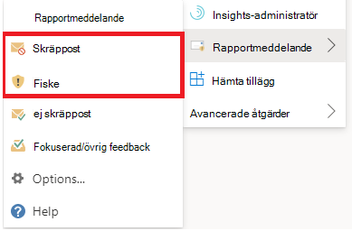

# Rapportera falska positiva och falska negativa i OutlookReport false positives and false negatives in Outlook

[!INCLUDE [Microsoft 365 Defender rebranding](../includes/microsoft-defender-for-office.md)]

**Gäller för****Applies to**
- [Exchange Online ProtectionExchange Online Protection](exchange-online-protection-overview.md)
- [Microsoft Defender för Office 365 Abonnemang 1 och Abonnemang 2Microsoft Defender for Office 365 plan 1 and plan 2](defender-for-office-365.md)
- [Microsoft 365 DefenderMicrosoft 365 Defender](../defender/microsoft-365-defender.md)

> [!NOTE]
> Om du är administratör i en Microsoft 365 organisation med Exchange Online postlådor rekommenderar vi att du använder portalen för inskickade inskickade material i Säkerhets- & efterlevnadscenter.If you're an admin in a Microsoft 365 organization with Exchange Online mailboxes, we recommend that you use the Submissions portal in the Security & Compliance Center. Mer information finns i Använda [administratörsinskick för att skicka misstänkt skräppost, nättr ut, URL:er och filer till Microsoft.](admin-submission.md)For more information, see [Use Admin Submission to submit suspected spam, phish, URLs, and files to Microsoft](admin-submission.md).

I Microsoft 365-organisationer med postlådor i Exchange Online eller lokala postlådor med modern hybridautentisering kan du skicka falska positiva identifieringar (bra e-postmeddelanden som har blockerats eller skickats till skräppostmappen) och falska negativa identifieringar (oönskad e-post eller nätfingr som skickats till inkorgen) till Exchange Online Protection (EOP).In Microsoft 365 organizations with mailboxes in Exchange Online or on-premises mailboxes using hybrid modern authentication, you can submit false positives (good email that was blocked or sent to junk folder) and false negatives (unwanted email or phish that was delivered to the inbox) to Exchange Online Protection (EOP).

## Vad behöver jag veta innan jag börjar?What do you need to know before you begin?

- För bästa möjliga användarinskickning använder du tilläggen Rapportmeddelande eller Rapport nätfiske.For the best user submission experience, use the Report Message add-in or the Report Phishing add-in.

  > [!IMPORTANT]
  > Den inbyggda upplevelsen för att rapportera skräppost och nätfiske i Outlook kan inte använda principen [för användarinskicking.](./user-submission.md)The built-in experience for reporting junk or phishing in Outlook can't use the [user submission policy](./user-submission.md). Vi rekommenderar att du använder tilläggen Rapportmeddelande eller Nätfiskerapport i stället.We recommend using the Report Message add-in or the Report Phishing add-in instead.

- Tillägget Rapportmeddelande och tillägget Rapport nätfiske fungerar för alla Outlook plattformar (Outlook på webben, iOS, Android och skrivbordet).The the Report Message add-in and the Report Phishing add-in work for Outlook in all platforms (Outlook on the web, iOS, Android, and Desktop).

- Om du är administratör i en organisation med Exchange Online postlådor använder du portalen för inskickade inskickade uppgifter i säkerhets- & efterlevnadscenter.If you're an admin in an organization with Exchange Online mailboxes, use the Submissions portal in the Security & Compliance Center. Mer information finns i Använda [administratörsinskick för att skicka misstänkt skräppost, nättr ut, URL:er och filer till Microsoft.](admin-submission.md)For more information, see [Use Admin Submission to submit suspected spam, phish, URLs, and files to Microsoft](admin-submission.md).

- Du kan konfigurera så att meddelanden skickas direkt till Microsoft, en postlåda som du anger eller båda.You can configure to send messages directly to Microsoft, a mailbox you specify, or both. Mer information finns i Principer [för användarinskick.](user-submission.md)For more information, see [User submissions policies](user-submission.md).

- Mer information om hur du hämtar och aktiverar rapportmeddelandet eller tilläggen för rapportfiske finns i Aktivera rapportmeddelandet eller tilläggen för [rapportfiske.](enable-the-report-message-add-in.md)For more information on how to get and enable the Report Message or the Report Phishing add-ins, see [Enable the Report Message or the Report Phishing add-ins](enable-the-report-message-add-in.md).

- Mer information om hur du rapporterar meddelanden till Microsoft finns [i Rapportera meddelanden och filer till Microsoft.](report-junk-email-messages-to-microsoft.md)For more information about reporting messages to Microsoft, see [Report messages and files to Microsoft](report-junk-email-messages-to-microsoft.md).

## Använda funktionen RapportmeddelandeUse the Report Message feature

### Rapportera skräppost och nätfiskemeddelandenReport junk and phishing messages

För meddelanden i Inkorgen eller någon annan e-postmapp utom Skräppost använder du följande metod för att rapportera skräppost och nätfiske:For messages in the Inbox or any other email folder except Junk Email, use the following method to report spam and phishing messages:

1. Välj **ellipsen** Fler åtgärder längst upp till höger i det markerade meddelandet, välj **Rapportera** meddelande i listrutan och välj sedan **Skräppost** eller **Nätfiske.**Select the **More actions** ellipses on the top-right corner of the selected message, select **Report message** from the dropdown menu, and then select **Junk** or **Phishing**.

   
   
   

2. De valda meddelandena skickas till Microsoft för analys och:The selected messages will be sent to Microsoft for analysis and:
   - Flyttades till mappen Skräppost om de rapporterades som skräppost.Moved to the Junk Email folder if they were reported as spam.
   - Borttagna om de rapporterats som nätfiske.Deleted if they were reported as phishing.

### Rapportera meddelanden som inte är skräppostReport messages that are not junk

1. Välj **ellipsen** Fler åtgärder i det övre högra hörnet av det markerade meddelandet, välj **Rapportera** meddelande i listrutan och välj sedan **Inte skräppost.**Select the **More actions** ellipses on the top-right corner of the selected message, select **Report message** from the dropdown menu, and then select **Not Junk**.

   
   
   

2. Det markerade meddelandet skickas till Microsoft för analys och flyttas till Inkorgen eller någon annan angiven mapp.The selected message will be sent to Microsoft for analysis and moved to Inbox or any other specified folder.

## Visa och granska rapporterade meddelandenView and review reported messages

Om du vill granska meddelanden som användare rapporterar till Microsoft har du följande alternativ:To review messages that users report to Microsoft, you have these options:

- Använd portalen för administrationsinskick.Use the Admin Submissions portal. Mer information finns i [Visa användarinskick till Microsoft.](admin-submission.md#view-user-submissions-to-microsoft)For more information, see [View user submissions to Microsoft](admin-submission.md#view-user-submissions-to-microsoft).
- Skapa en e-postflödesregel (kallas även transportregel) för att skicka kopior av rapporterade meddelanden.Create a mail flow rule (also known as a transport rule) to send copies of reported messages. Instruktioner finns i Använda [e-postflödesregler för att se vad användarna rapporterar till Microsoft.](/exchange/security-and-compliance/mail-flow-rules/use-rules-to-see-what-users-are-reporting-to-microsoft)For instructions, see [Use mail flow rules to see what users are reporting to Microsoft](/exchange/security-and-compliance/mail-flow-rules/use-rules-to-see-what-users-are-reporting-to-microsoft).
