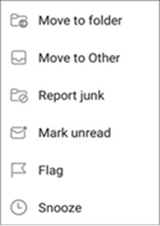
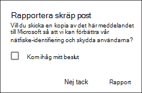

# Rapportera skräp post och nätfiske i Outlook för iOS och Android i Exchange Online

I Microsoft 365-organisationer med post lådor i Exchange Online eller lokala post lådor med [hybrid modern inloggningsautentisering](https://docs.microsoft.com/microsoft-365/enterprise/hybrid-modern-auth-overview?view=o365-worldwide)kan du använda de inbyggda rapporterings alternativen i Outlook för iOS och Android för att skicka falska positiva (e-postmeddelanden markerade som skräp post), falskt negativ (dålig e-post) och nätfiske-meddelanden till Exchange Online Protection (EOP).

## Vad behöver du veta innan du börjar

- Om du är administratör i en organisation med Exchange Online-postlådor rekommenderar vi att du använder portalen för säkerhets & efterlevnad. Mer information finns i [använda administratörs överföring för att skicka misstänkt skräp post, Phish, URL: er och filer till Microsoft](admin-submission.md).

- Du kan konfigurera vilka meddelanden som ska kopieras eller dirigeras om till en post låda som du anger. Mer information finns i [Ange en post låda för användar överföringar av skräp post och nät fiske meddelanden i Exchange Online](user-submission.md).

- Mer information om hur du rapporterar meddelanden till Microsoft finns i [rapportera meddelanden och filer till Microsoft](report-junk-email-messages-to-microsoft.md).

  > [!NOTE]
  > Om skräp post rapportering är inaktiverat för Outlook i princip för användar överföring flyttas skräp post eller nätfiske-meddelanden till skräppostmappen och inte rapporteras till din administratör eller Microsoft.

## Rapportera skräp post och nät fiske meddelanden i Outlook för iOS och Android

Använd följande steg för att rapportera skräp post och nät fiske meddelanden för iOS och Android för meddelanden i Inkorgen, eller annan e-postmapp, utom skräp posten:

1. Markera ett eller flera meddelanden.
2. I det övre högra hörnet trycker du på de tre lodräta punkterna. Åtgärd-menyn öppnas.

   

3. Tryck på **Rapportera skräp post** och välj sedan **skräp** post eller **nätfiske**.

   

4. I dialog rutan som visas kan du välja **rapport** eller **Nej**. Om du väljer **Nej**, om du tryckte på **skräp** post flyttas meddelandet till mappen skräp post om du tryckte på **nätfiske** flyttas meddelandet till mappen Borttaget. Välj **rapport** om du även vill skicka en kopia av meddelandet till Microsoft.

   

Om du ändrar dig väljer du **Ångra** i popup-meddelandet som visas. Meddelandet finns kvar i mappen Inkorgen.

## Rapportera icke-skräppost meddelanden från mappen skräp post i Outlook för iOS och Android

I mappen skräp post följer du stegen nedan för att rapportera skräp post som falsk.

1. Markera ett eller flera meddelanden.
2. I det övre högra hörnet trycker du på de tre lodräta punkterna. Åtgärd-menyn öppnas.

   

3. Tryck på **inte skräp post**.

En popup-avisering visas där e-postmeddelandet har flyttats till Inkorgen. Om du ändrar dig väljer du **Ångra** på popup-meddelandet. E-postmeddelandet finns kvar i skräppostmappen.
