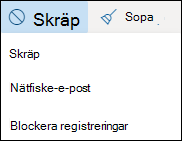
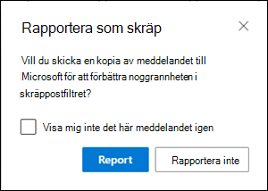
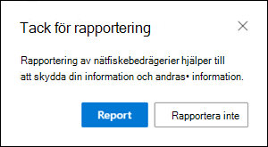
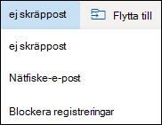
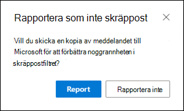

# <a name="report-junk-and-phishing-email-in-outlook-on-the-web-in-exchange-online"></a>Rapportera skräp post och nätfiske i Outlook på webben i Exchange Online

I Microsoft 365-organisationer med post lådor i Exchange Online kan du använda de inbyggda rapporterings alternativen i Outlook på webben (tidigare Outlook Web App) för att skicka falska positiva (e-postmeddelanden markerade som skräp post), falskt negativ (dålig e-post) och nätfiske-meddelanden till Exchange Online Protection (EOP).

## <a name="what-do-you-need-to-know-before-you-begin"></a>Vad behöver jag veta innan jag börjar?

- Om du är administratör i en organisation med Exchange Online-postlådor rekommenderar vi att du använder portalen för säkerhets & efterlevnad. Mer information finns i [använda administratörs överföring för att skicka misstänkt skräp post, Phish, URL: er och filer till Microsoft](admin-submission.md).

- Administratörer kan inaktivera eller aktivera möjligheten för användare att rapportera meddelanden till Microsoft i Outlook på webben. Mer information finns i [Aktivera eller inaktivera rapportering av skräp post i Outlook på webben](#disable-or-enable-junk-email-reporting-in-outlook-on-the-web) längre ned i det här avsnittet.

- Du kan konfigurera vilka meddelanden som ska kopieras eller dirigeras om till en post låda som du anger. Mer information finns i [Ange en post låda för användar överföringar av skräp post och nät fiske meddelanden i Exchange Online](user-submission.md).

- Mer information om hur du rapporterar meddelanden till Microsoft finns i [rapportera meddelanden och filer till Microsoft](report-junk-email-messages-to-microsoft.md).

## <a name="report-spam-and-phishing-messages-in-outlook-on-the-web"></a>Rapportera skräp post och nät fiske meddelanden i Outlook på webben

1. Använd någon av följande metoder för att rapportera skräp post och nät fiske meddelanden, för meddelanden i Inkorgen eller annan mapp för e-post utom skräp posten:

   - Markera meddelandet, klicka på **skräp post** i verktygsfältet och välj sedan **skräp post** eller **nätfiske**.

     

   - Markera ett eller flera meddelanden, högerklicka och välj sedan **Markera som skräp post**.

2. Klicka på **rapport**i dialog rutan som visas. Om du ändrar dig klickar du på **rapportera inte**.

   |Mappen|Fiske|
   |:---:|:---:|
   |||

3. De valda meddelandena skickas till Microsoft för analys. Bekräfta att meddelanden har skickats genom att öppna mappen **skickat** för att visa de meddelanden som skickats.

## <a name="report-non-spam-and-phishing-messages-from-the-junk-email-folder-in-outlook-on-the-web"></a>Rapportera icke-spam-och nät fiske meddelanden från mappen skräp post i Outlook på webben

1. I mappen skräp post kan du använda någon av följande metoder för att rapportera skräp post i falsk positiv eller nätfiske:

   - Markera meddelandet, klicka på **inte skräp post** i verktygsfältet och välj **inte skräp post** eller **nätfiske**.

     

   - Markera ett eller flera meddelanden, högerklicka och välj sedan **Markera som inte skräp post**.

2. Läs informationen i dialog rutan som visas och klicka på **rapportera**. Om du ändrar dig klickar du på **rapportera inte**.

   |Inte skräp post|Fiske|
   |:---:|:---:|
   |||

3. De valda meddelandena skickas till Microsoft för analys. Bekräfta att meddelanden har skickats genom att öppna mappen **skickat** för att visa de meddelanden som skickats.

## <a name="disable-or-enable-junk-email-reporting-in-outlook-on-the-web"></a>Inaktivera eller aktivera rapportering av skräp post i Outlook på webben

Som standard kan användare rapportera skräp post i falsk positiv, falsk negativ och nätfiske till Microsoft för analys i Outlook på webben. Administratörer kan konfigurera Outlook på webbens post lådans principer i Exchange Online PowerShell för att förhindra att användare rapporterar skräp post falsk positiv och skräp post till Microsoft. Du kan inte inaktivera möjligheten för användare att rapportera nät fiske meddelanden till Microsoft.

### <a name="what-do-you-need-to-know-before-you-begin"></a>Vad behöver jag veta innan jag börjar?

- Information om hur du använder Windows PowerShell för att ansluta till Exchange Online finns i [Anslut till Exchange Online PowerShell](https://docs.microsoft.com/powershell/exchange/connect-to-exchange-online-powershell).

- Du måste ha tilldelats behörigheter för att kunna utföra de här procedurerna. Specifikt du behöver **mottagar principer** eller **e-postmottagare** roller i Exchange Online, som är tilldelade till roll grupperna **organisations hantering** och **mottagare** . Mer information om roll grupper i Exchange Online finns i [ändra roll grupper i Exchange Online](https://docs.microsoft.com/Exchange/permissions-exo/role-groups#modify-role-groups).

- Varje organisation har en standard princip som heter OwaMailboxPolicy-Default, men du kan skapa anpassade principer. Anpassade principer tillämpas på användare med begränsad räckvidd före standard principen. Mer information om Outlook på principer för webb post lådor finns i [Outlook på principer för Internet post lådor i Exchange Online](https://docs.microsoft.com/Exchange/clients-and-mobile-in-exchange-online/outlook-on-the-web/outlook-web-app-mailbox-policies).

- Om du inaktiverar skräp post rapportering tas inte möjligheten att markera ett meddelande som skräp post eller inte skräp post i Outlook på webben. Om du markerar ett meddelande i mappen skräp post och klickar på **inte skräp** \> **post** flyttas meddelandet tillbaka till Inkorgen. Om du markerar ett meddelande i en annan e-postmapp och sedan klickar på **skräp** \> **post** flyttas meddelandet till mappen skräp post. Det går inte längre att rapportera meddelandet till Microsoft.

### <a name="use-exchange-online-powershell-to-disable-or-enable-junk-email-reporting-in-outlook-on-the-web"></a>Använda Exchange Online PowerShell för att inaktivera eller aktivera rapportering av skräp post i Outlook på webben

1. Om du vill hitta dina befintliga Outlook-principer och status för skräp post rapportering kör du följande kommando:

   ```powershell
   Get-OwaMailboxPolicy | Format-Table Name,ReportJunkEmailEnabled
   ```

2. Om du vill inaktivera eller aktivera skräp post rapportering i Outlook på webben kan du använda följande syntax:

   ```powershell
   Set-OwaMailboxPolicy -Identity "<OWAMailboxPolicyName>" -ReportJunkEmailEnabled <$true | $false>
   ```

   I det här exemplet inaktive ras skräp post rapportering i standard policyn.

   ```powershell
   Set-OwaMailboxPolicy -Identity "OwaMailboxPolicy-Default" -ReportJunkEmailEnabled $false
   ```

   I det här exemplet aktive ras skräp post rapportering i den anpassade principen med contoso Managers.

   ```powershell
   Set-OwaMailboxPolicy -Identity "Contoso Managers" -ReportJunkEmailEnabled $true
   ```

Detaljerad information om syntax och parametrar finns i [Get-OwaMailboxPolicy](https://docs.microsoft.com/powershell/module/exchange/get-owamailboxpolicy) och [Set-OwaMailboxPolicy](https://docs.microsoft.com/powershell/module/exchange/set-owamailboxpolicy).

### <a name="how-do-you-know-this-worked"></a>Hur vet du att det fungerade?

Gör så här för att kontrol lera att du har aktiverat eller inaktiverat skräp post rapportering i Outlook på webben:

- Kör följande kommando i Exchange Online PowerShell och kontrol lera värdet för egenskapen **ReportJunkEmailEnabled** :

  ```powershell
  Get-OwaMailboxPolicy | Format-Table Name,ReportJunkEmailEnabled
  ```

- Öppna en användares post låda i Outlook på webben, Välj ett meddelande i Inkorgen, klicka på **skräp** \> **post** och bekräfta uppmaningen att rapportera meddelandet till Microsoft är eller visas inte.<sup>\*</sup>

- Öppna en användares post låda i Outlook på webben, Välj ett meddelande i mappen skräp post, klicka på **skräp** \> **post** och bekräfta uppmaningen att rapportera meddelandet till Microsoft, eller så visas det inte.<sup>\*</sup>

<sup>\*</sup> Användare kan dölja uppmaningen att rapportera meddelandet medan det rapporteras. Så här kontrollerar du inställningen i Outlook på webben:

1. Klicka på **Inställningar**  \> **Visa alla** \> **skräp post**i Outlook-inställningar.
2. Kontrol lera värdet i avsnittet **rapportering** **innan du skickar en rapport**.

   
