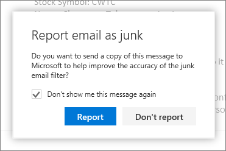
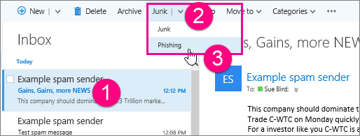

# Rapportera skräppost och nätfiskebedrägerier i Outlook på webben

Det kan vara frustrerande när användare i organisationen får skräppost eller missar ett viktigt e-postmeddelande eftersom det var felidentifierat som skräppost. Vi finjusterar ständigt skräppostfiltren (Exchange Online Protection) för att vara mer exakta, och du och dina slutanvändare kan hjälpa till med den här processen. Microsoft Outlook på webben användare kan rapportera skräp (spam) och phishing bedrägerier med hjälp av inbyggda e-postrapportering alternativ. Du kan också meddela Microsoft om ett e-postmeddelande har identifierats felaktigt som skräppost (skräppost).

## Skicka skräpmeddelanden i Outlook på webben

Så här skickar du ett skräppostmeddelande till Microsoft:

1. Klicka på skräpmeddelandet och klicka sedan på **Skräppost** i verktygsfältet. Då flyttas meddelandet till skräppostmappen och avsändaren läggs till i listan över blockerade avsändare.

   

   > [!NOTE]
   > Du kan också högerklicka på ett meddelande om du vill visa en meny och klicka på **Markera som skräppost**.

   Du kan rapportera ett skräpmeddelande från mappen **Inkorgen** eller **Borttaget.**

2. En dialogruta öppnas och frågar om du vill skicka en kopia av skräppostmeddelandet till Microsoft för analys. Klicka **på rapporten** om du vill skicka meddelandet till Microsoft Spam Analysis Team. Du kan också markera kryssrutan **Visa inte det här meddelandet igen** om du vill skicka framtida skräpmeddelanden automatiskt till Microsoft utan att bli tillfrågad.

   

   > [!TIP]
   > Även om du markerar kryssrutan **Visa inte det här meddelandet igen** kan du senare ändra dina inställningar för att rapportera skräppost genom att komma åt visningsinställningarna i Outlook på webben. (Du kan komma åt dessa inställningar via snabbmenyn bredvid inloggningsnamnet.)

## Skicka meddelanden om nätfiskebedrägerier i Outlook på webben

Så här skickar du ett meddelande om nätfiskebedrägeri till Microsoft:

1. Klicka på meddelandet om nätfiskebedrägeri, klicka på nedpilen **bredvid Skräppost**och klicka sedan på **Nätfiske** i verktygsfältet. Office 365 blockerar inte avsändaren eftersom avsändare av nätfiskebluffmeddelanden vanligtvis utger sig för att vara legitima avsändare. Om du vill lägger du till avsändaren i listan med blockerade avsändare genom att följa instruktionerna i avsnittet [Filtrera skräppost och skräppost i Outlook på webben](https://support.office.com/article/db786e79-54e2-40cc-904f-d89d57b7f41d).

   

   Du kan också högerklicka på ett meddelande om du vill visa en meny och klicka på **Markera som nätfiske**.

   Du kan anmäla ett meddelande om nätfiskebedrägeri från mappen **Inkorgen** eller **Borttaget.**

2. För vissa organisationer öppnas en dialogruta där du frågar om du vill skicka en kopia av e-postmeddelandet med nätfiskebedrägerier till Microsoft för analys. Klicka **på rapporten** om du vill skicka meddelandet till Microsoft Spam Analysis Team. Det här rapporteringsalternativet är för närvarande tillgängligt för ett begränsat antal organisationer. Du kanske inte blir ombedd att rapportera ett nätfiskebedrägeri till Microsoft.

## Skicka "inte skräppost" meddelanden i Outlook på webben

När ett meddelande identifieras felaktigt som skräppost av Office 365 skickar du ett meddelande som "inte skräppost" till Microsoft:

1. Klicka på meddelandet i mappen Skräppost och klicka sedan på **Inte skräppost** i verktygsfältet. Då flyttas meddelandet till **inkorgen** och avsändaren läggs till i listan över säkra avsändare.

   Du kan också högerklicka på ett meddelande i skräppostmappen för att visa en meny och klicka på **Markera som inte skräppost**.

2. En dialogruta öppnas och frågar om du vill skicka en kopia av inte skräppostmeddelandet till Microsoft för analys. Klicka **på rapporten** om du vill skicka meddelandet till Microsoft Spam Analysis Team..

## Mer information

[Läs mer om skräppost och nätfiske](https://support.microsoft.com/article/86c1d76f-4d5a-4967-9647-35665dc17c31)

[Tillägg för skräppostrapportering för Microsoft Outlook](https://docs.microsoft.com/office365/securitycompliance/junk-email-reporting-add-in-for-microsoft-outlook)
