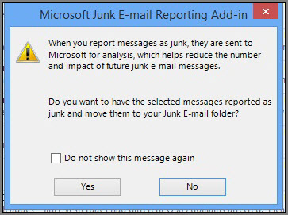

# Rapportera skräppostmeddelanden till MicrosoftReport junk email messages to Microsoft

Microsofts tillägg för skräppostrapportering för Microsoft Office Outlook innehåller flera sätt att rapportera skräppostmeddelanden:The Microsoft Junk Email Reporting Add-in for Microsoft Office Outlook offers several ways for you to report junk email messages:

- Från menyfliksområdet i OutlookFrom the Outlook ribbon

- Från inkorgenFrom your Inbox

- Inifrån ett öppnat e-postmeddelandeFrom within an opened email message

Tillägget Rapportering av skräppost hjälper dig att skicka rapporter till Tjänsten Microsoft Exchange Online Protection (EOP).The Junk Email Reporting Add-in helps you submit reports to the Microsoft Exchange Online Protection (EOP) service. Om postlådan inte skyddas av tjänsten påverkar inte överföringen av skräppostrapporten dina skräppostfilter skräppostfiltren.If your mailbox is not protected by the service, your junk email report submission will not affect your spam filters. Administratörer kan läsa mer om fler skräppostinställningar som gäller för en hel organisation på [Skapa listor över säkra avsändare i Office 365](create-safe-sender-lists-in-office-365.md) och Skapa blockerade [avsändarelistor i Office 365](create-block-sender-lists-in-office-365.md).Administrators can learn about more spam settings that apply to a whole organization at [Create safe sender lists in Office 365](create-safe-sender-lists-in-office-365.md) and [Create blocked sender lists in Office 365](create-block-sender-lists-in-office-365.md). Dessa är användbara om du har kontroll på administratörsnivå och du vill förhindra falska positiva eller falska negativ.These are helpful if you have administrator-level control and you want to prevent false positives or false negatives.

> [!TIP]
> Du kan också skicka skräppostmeddelanden direkt till Microsoft med hjälp av [junk@office365.microsoft.com](mailto:junk@office365.microsoft.com) e-postadress och falska positiva meddelanden (icke-skräppost) med hjälp av [not_junk@office365.microsoft.com](mailto:not_junk@office365.microsoft.com) e-postadress.You can also submit spam messages directly to Microsoft by using the [junk@office365.microsoft.com](mailto:junk@office365.microsoft.com) email address, and false positive (non-spam) messages by using the [not_junk@office365.microsoft.com](mailto:not_junk@office365.microsoft.com) email address. Mer information finns i [Skicka meddelanden om skräppost, skräppost och nätfiske till Microsoft för analys](submit-spam-non-spam-and-phishing-scam-messages-to-microsoft-for-analysis.md).For more information, see [Submit spam, non-spam, and phishing scam messages to Microsoft for analysis](submit-spam-non-spam-and-phishing-scam-messages-to-microsoft-for-analysis.md).

### Så här anmäler du skräppost från OutlookTo report junk email messages from Outlook

[Använda tillägget RapportmeddelandeUse the Report Message add-in](https://support.office.com/article/b5caa9f1-cdf3-4443-af8c-ff724ea719d2)

### Så här anmäler du skräppost från inkorgenTo report junk email messages from your Inbox

1. Högerklicka på meddelandet eller meddelanden som du vill rapportera som skräppost.Right-click the message or messages that you want to report as junk.

2. Välj **Skräppost** och klicka sedan på **Rapportera skräppost**.Select **Junk** and then click **Report Junk**.
    

3. Dialogrutan **Microsoft-skräppostrapportering** öppnas.The **Microsoft Junk E-mail Reporting Add-in** dialog box opens. Om du är säker på att du vill skicka de meddelanden som du har markerat som skräppost klickar du på **Ja**.If you're sure that you want to submit the messages you selected as junk, click **Yes**.
    

    > [!NOTE]
    > Om du inte vill få det här bekräftelsemeddelandet när du skickar skräppost markerar du **Visa inte det här meddelandet igen**.If you don't want to receive this confirmation message when submitting junk messages, check **Do not show this message again**.

De valda meddelandena skickas till Microsoft för analys och flyttas till mappen Skräppost.The selected messages will be sent to Microsoft for analysis and moved to the Junk Email folder. Om du vill bekräfta att meddelandena har skickats öppnar du mappen **Skickat för** att visa de skickade meddelandena.To confirm that the messages have been submitted, open your **Sent Items** folder to view the submitted messages.

### Så här anmäler du ett skräppostmeddelande inifrån ett öppnat meddelandeTo report a junk email message from within an opened message

1. Klicka på knappen Rapportera **skräppost** i meddelandefliksområdet i ett öppnat meddelande.From within an opened message, click the **Report Junk** button on the message ribbon. Klicka till exempel på \> **Skräppostrapport** For example, click **Junk** \> **Report Junk** 

2. Dialogrutan **Microsoft-skräppostrapportering** öppnas.The **Microsoft Junk E-mail Reporting Add-in** dialog box opens. Om du är säker på att du vill skicka meddelandet du valde som skräppost klickar du på **Ja**.If you're sure that you want to submit the message you selected as junk, click **Yes**.
    

    > [!NOTE]
    > Om du inte vill få det här bekräftelsemeddelandet när du skickar skräppost markerar du **Visa inte det här meddelandet igen**.If you don't want to receive this confirmation message when submitting junk messages, check **Do not show this message again**.

Det valda meddelandet skickas till Microsoft för analys och flyttas till mappen Skräppost.The selected message will be sent to Microsoft for analysis and moved to the Junk Email folder. Om du vill bekräfta att meddelandet har skickats öppnar du mappen **Skickat för** att visa det skickade meddelandet.To confirm that the message has been submitted, open your **Sent Items** folder to view the submitted message.
