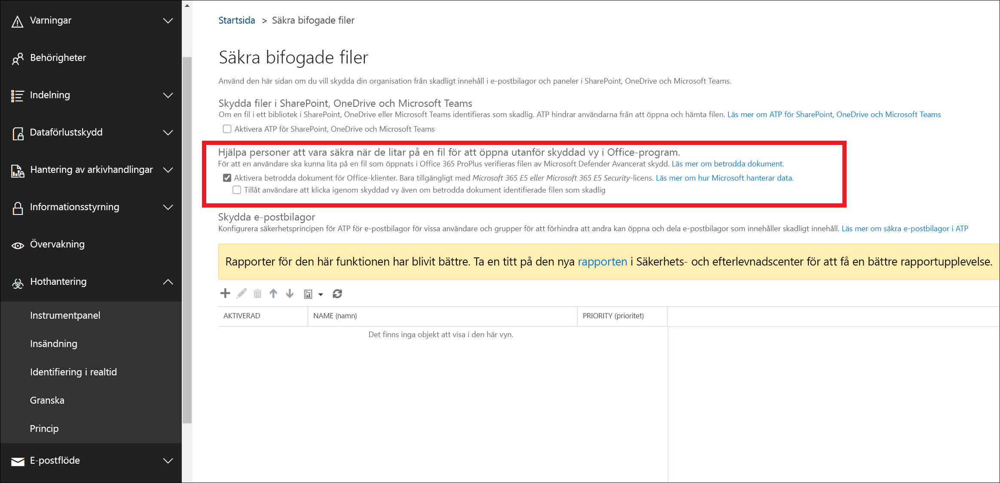

# <a name="safe-documents-in-microsoft-365-e5"></a><span data-ttu-id="fbd18-103">Säkra dokument i Microsoft 365 E5</span><span class="sxs-lookup"><span data-stu-id="fbd18-103">Safe Documents in Microsoft 365 E5</span></span>

<span data-ttu-id="fbd18-104">Säkra dokument är en funktion i Microsoft 365 E5-eller Microsoft 365 E5-säkerhet som använder [Microsoft Defender Avancerat skydd](https://docs.microsoft.com/windows/security/threat-protection/microsoft-defender-atp/microsoft-defender-advanced-threat-protection) för att söka igenom dokument och filer som öppnas i [skyddad vy](https://support.microsoft.com/office/d6f09ac7-e6b9-4495-8e43-2bbcdbcb6653).</span><span class="sxs-lookup"><span data-stu-id="fbd18-104">Safe Documents is a feature in Microsoft 365 E5 or Microsoft 365 E5 Security that uses [Microsoft Defender Advanced Threat Protection](https://docs.microsoft.com/windows/security/threat-protection/microsoft-defender-atp/microsoft-defender-advanced-threat-protection) to scan documents and files that are opened in [Protected View](https://support.microsoft.com/office/d6f09ac7-e6b9-4495-8e43-2bbcdbcb6653).</span></span>

## <a name="what-do-you-need-to-know-before-you-begin"></a><span data-ttu-id="fbd18-105">Vad behöver jag veta innan jag börjar?</span><span class="sxs-lookup"><span data-stu-id="fbd18-105">What do you need to know before you begin?</span></span>

- <span data-ttu-id="fbd18-106">Säkra dokument är endast tillgängligt för användare med *microsoft 365 E5* -eller *Microsoft 365 E5-säkerhets* licenser.</span><span class="sxs-lookup"><span data-stu-id="fbd18-106">Safe Documents is available only to users with *Microsoft 365 E5* or *Microsoft 365 E5 Security* licenses.</span></span> <span data-ttu-id="fbd18-107">Dessa licenser ingår inte i Office 365-abonnemang för avancerat skydd (ATP).</span><span class="sxs-lookup"><span data-stu-id="fbd18-107">These licenses are not included in Office 365 Advanced Threat Protection (ATP) plans.</span></span>

- <span data-ttu-id="fbd18-108">Öppna Säkerhets- och efterlevnadscentret på <https://protection.office.com>.</span><span class="sxs-lookup"><span data-stu-id="fbd18-108">You open the Security & Compliance Center at <https://protection.office.com>.</span></span> <span data-ttu-id="fbd18-109">Om du vill gå direkt till sidan **betrodda säkerhets** meddelanden via ATP öppnar du <https://protection.office.com/safeattachmentv2> .</span><span class="sxs-lookup"><span data-stu-id="fbd18-109">To go directly to the **ATP Safe Attachments** page, open <https://protection.office.com/safeattachmentv2>.</span></span>

- <span data-ttu-id="fbd18-110">Information om hur du använder Windows PowerShell för att ansluta till Exchange Online finns i artikeln om att [ansluta till Exchange Online PowerShell](https://docs.microsoft.com/powershell/exchange/connect-to-exchange-online-powershell).</span><span class="sxs-lookup"><span data-stu-id="fbd18-110">To connect to Exchange Online PowerShell, see [Connect to Exchange Online PowerShell](https://docs.microsoft.com/powershell/exchange/connect-to-exchange-online-powershell).</span></span>

- <span data-ttu-id="fbd18-111">Du måste tilldelas behörigheter innan du kan utföra procedurerna i det här avsnittet.</span><span class="sxs-lookup"><span data-stu-id="fbd18-111">You need to be assigned permissions before you can perform the procedures in this topic.</span></span> <span data-ttu-id="fbd18-112">För att aktivera och konfigurera säkra dokument måste du vara medlem i roll grupperna **organisations hantering** eller **säkerhets administratör** .</span><span class="sxs-lookup"><span data-stu-id="fbd18-112">To enable and configure Safe Documents, you need to be a member of the **Organization Management** or **Security Administrator** role groups.</span></span> <span data-ttu-id="fbd18-113">Mer information om rollgrupper i Säkerhets- och efterlevnadscenter finns i [Behörigheter i Säkerhets- och efterlevnadscenter](permissions-in-the-security-and-compliance-center.md).</span><span class="sxs-lookup"><span data-stu-id="fbd18-113">For more information about role groups in the Security & Compliance Center, see [Permissions in the Security & Compliance Center](permissions-in-the-security-and-compliance-center.md).</span></span>

- <span data-ttu-id="fbd18-114">För att skydda dig skickar säkra dokument filer till [Microsoft Defender Avancerat skydd för hotet](https://docs.microsoft.com/windows/security/threat-protection/microsoft-defender-atp/microsoft-defender-advanced-threat-protection) för analys.</span><span class="sxs-lookup"><span data-stu-id="fbd18-114">To keep you protected, Safe Documents sends files to the [Microsoft Defender Advanced Threat Protection](https://docs.microsoft.com/windows/security/threat-protection/microsoft-defender-atp/microsoft-defender-advanced-threat-protection) cloud for analysis.</span></span> <span data-ttu-id="fbd18-115">Information om hur Microsoft Defender ATP hanterar dina data finns här: [Microsoft Defender ATP-data lagring och integritet](https://docs.microsoft.com/windows/security/threat-protection/microsoft-defender-atp/data-storage-privacy).</span><span class="sxs-lookup"><span data-stu-id="fbd18-115">Details on how Microsoft Defender ATP handles your data can be found here: [Microsoft Defender ATP data storage and privacy](https://docs.microsoft.com/windows/security/threat-protection/microsoft-defender-atp/data-storage-privacy).</span></span>

- <span data-ttu-id="fbd18-116">Filer som skickas av säkra dokument behålls inte i Defender utöver den tid som krävs för analys (vanligt vis mindre än 24 timmar).</span><span class="sxs-lookup"><span data-stu-id="fbd18-116">Files sent by Safe Documents are not retained in Defender beyond the time needed for analysis (typically, less than 24 hours).</span></span>

## <a name="use-the-security--compliance-center-to-configure-safe-documents"></a><span data-ttu-id="fbd18-117">Använda säkerhets & Compliance Center för att konfigurera betrodda dokument</span><span class="sxs-lookup"><span data-stu-id="fbd18-117">Use the Security & Compliance Center to configure Safe Documents</span></span>

1. <span data-ttu-id="fbd18-118">I säkerhets & Compliance Center kan du gå till **Threat Management** \> **policy** , \> **mottagna**och sedan klicka på **globala inställningar**.</span><span class="sxs-lookup"><span data-stu-id="fbd18-118">In the Security & Compliance Center, go to **Threat management** \> **Policy** \> **ATP Safe Attachments**, and then click **Global settings**.</span></span>

2. <span data-ttu-id="fbd18-119">I de **globala inställningarna** som visas konfigurerar du följande inställningar:</span><span class="sxs-lookup"><span data-stu-id="fbd18-119">In the **Global settings** fly out that appears, configure the following settings:</span></span>

   - <span data-ttu-id="fbd18-120">**Aktivera säkra dokument för Office-klienter**: flytta växlings knappen till höger för att aktivera funktionen:  .</span><span class="sxs-lookup"><span data-stu-id="fbd18-120">**Turn on Safe Documents for Office clients**: Move the toggle to the right to turn on the feature: .</span></span>

   - <span data-ttu-id="fbd18-121">**Tillåt att personer klickar via skyddad vy även om säkra dokument identifierar filen som skadlig**: Vi rekommenderar att du låter det här alternativet vara avstängt (Stäng av växlings knappen till vänster:  ).</span><span class="sxs-lookup"><span data-stu-id="fbd18-121">**Allow people to click through Protected View even if Safe Documents identifies the file as malicious**: We recommend that you leave this option turned off (leave the toggle to the left: ).</span></span>

   <span data-ttu-id="fbd18-122">Klicka på **Spara** när du är klar.</span><span class="sxs-lookup"><span data-stu-id="fbd18-122">When you're finished, click **Save**.</span></span>

   

### <a name="use-exchange-online-powershell-to-configure-safe-documents"></a><span data-ttu-id="fbd18-124">Använda Exchange Online PowerShell för att konfigurera betrodda dokument</span><span class="sxs-lookup"><span data-stu-id="fbd18-124">Use Exchange Online PowerShell to configure Safe Documents</span></span>

<span data-ttu-id="fbd18-125">Använd följande syntax:</span><span class="sxs-lookup"><span data-stu-id="fbd18-125">Use the following syntax:</span></span>

```powershell
Set-AtpPolicyForO365 -EnableSafeDocs <$true | $false> -AllowSafeDocsOpen <$true | $false>
```

- <span data-ttu-id="fbd18-126">Med parametern _EnableSafeDocs_ aktive ras eller inaktive ras säkra dokument för hela organisationen.</span><span class="sxs-lookup"><span data-stu-id="fbd18-126">The _EnableSafeDocs_ parameter enables or disables Safe Documents for the entire organization.</span></span>
- <span data-ttu-id="fbd18-127">Med _AllowSafeDocsOpen_ -parametern kan du hindra användare från att lämna skyddad vy (det innebär att dokumentet öppnas) om dokumentet har identifierats som skadligt.</span><span class="sxs-lookup"><span data-stu-id="fbd18-127">The _AllowSafeDocsOpen_ parameter allows or prevents users from leaving Protected View (that is, opening the document) if the document has been identified as malicious.</span></span>

<span data-ttu-id="fbd18-128">Det här exemplet aktiverar säkra dokument för hela organisationen och hindrar användarna från att öppna dokument som har identifierats som skadliga från skyddad vy.</span><span class="sxs-lookup"><span data-stu-id="fbd18-128">This example enables Safe Documents for the entire organization, and prevents users from opening documents that have been identified as malicious from Protected View.</span></span>

```powershell
Set-AtpPolicyForO365 -EnableSafeDocs $true -AllowSafeDocsOpen $false
```

<span data-ttu-id="fbd18-129">Detaljerad information om syntax och parametrar finns i [set-AtpPolicyForO365](https://docs.microsoft.com/powershell/module/exchange/set-atppolicyforo365).</span><span class="sxs-lookup"><span data-stu-id="fbd18-129">For detailed syntax and parameter information, see [Set-AtpPolicyForO365](https://docs.microsoft.com/powershell/module/exchange/set-atppolicyforo365).</span></span>

### <a name="how-do-i-know-this-worked"></a><span data-ttu-id="fbd18-130">Hur vet jag att det här fungerade?</span><span class="sxs-lookup"><span data-stu-id="fbd18-130">How do I know this worked?</span></span>

<span data-ttu-id="fbd18-131">Gör något av följande om du vill kontrol lera att du har aktiverat och konfigurerat säkra dokument:</span><span class="sxs-lookup"><span data-stu-id="fbd18-131">To verify that you've enabled and configured Safe Documents, do any of the following steps:</span></span>

- <span data-ttu-id="fbd18-132">I säkerhets & Compliance Center går du till **Threat Management** \> **policy** för inkommande \> **bifogade filer**, klickar på **globala inställningar**och verifierar alternativet **Aktivera säkra dokument för Office-klienter** och **tillåter att personer klickar via skyddad vy även om säkra dokument identifierar filen som skadlig** inställningar.</span><span class="sxs-lookup"><span data-stu-id="fbd18-132">In the Security & Compliance Center, go to **Threat management** \> **Policy** \> **ATP Safe Attachments**, click **Global settings**, and verify the **Turn on Safe Documents for Office clients** and **Allow people to click through Protected View even if Safe Documents identifies the file as malicious** settings.</span></span>

- <span data-ttu-id="fbd18-133">Kör följande kommando i Exchange Online PowerShell och kontrol lera egenskapsvärdena:</span><span class="sxs-lookup"><span data-stu-id="fbd18-133">Run the following command in Exchange Online PowerShell and verify the property values:</span></span>

  ```powershell
  Get-AtpPolicyForO365 | Format-List *SafeDocs*
  ```

- <span data-ttu-id="fbd18-134">Följande filer är tillgängliga för att testa skyddet för skyddat dokument.</span><span class="sxs-lookup"><span data-stu-id="fbd18-134">The following files are available to test Safe Documents protection.</span></span> <span data-ttu-id="fbd18-135">Dessa dokument liknar EICAR.TXT fil för testning av skadlig program vara och antivirus lösning.</span><span class="sxs-lookup"><span data-stu-id="fbd18-135">These documents are similar to the EICAR.TXT file for testing anti-malware and anti-virus solutions.</span></span> <span data-ttu-id="fbd18-136">Filerna är inte säkra, men de kommer att utlösa skydd mot säkra dokument.</span><span class="sxs-lookup"><span data-stu-id="fbd18-136">The files are not harmful, but they will trigger Safe Documents protection.</span></span>

  - [<span data-ttu-id="fbd18-137">SafeDocsDemo.docx</span><span class="sxs-lookup"><span data-stu-id="fbd18-137">SafeDocsDemo.docx</span></span>](https://github.com/MicrosoftDocs/microsoft-365-docs/raw/public/microsoft-365/downloads/SafeDocsDemo.docx)
  - [<span data-ttu-id="fbd18-138">SafeDocsDemo.pptx</span><span class="sxs-lookup"><span data-stu-id="fbd18-138">SafeDocsDemo.pptx</span></span>](https://github.com/MicrosoftDocs/microsoft-365-docs/raw/public/microsoft-365/downloads/SafeDocsDemo.pptx)
  - [<span data-ttu-id="fbd18-139">SafeDocsDemo.xlsx</span><span class="sxs-lookup"><span data-stu-id="fbd18-139">SafeDocsDemo.xlsx</span></span>](https://github.com/MicrosoftDocs/microsoft-365-docs/raw/public/microsoft-365/downloads/SafeDocsDemo.xlsx)
