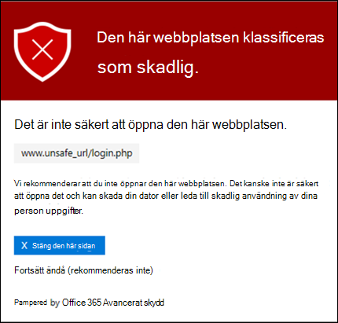

# Valv Länkar i Microsoft Defender för Office 365

[!INCLUDE [Microsoft 365 Defender rebranding](../includes/microsoft-defender-for-office.md)]

**Gäller för**
- [Microsoft Defender för Office 365 Abonnemang 1 och Abonnemang 2](defender-for-office-365.md)
- [Microsoft 365 Defender](../defender/microsoft-365-defender.md)

> [!IMPORTANT]
> Den här artikeln är avsedd för företagskunder som har [Microsoft Defender för Office 365](defender-for-office-365.md). Om du använder Outlook.com, Microsoft 365 Family eller Microsoft 365 Personal och letar efter information om Säkra länkar i Outlook, se Avancerad [Outlook.com-säkerhet.](https://support.microsoft.com/office/882d2243-eab9-4545-a58a-b36fee4a46e2)

Valv Länkar är en funktion i Defender för [Office 365](defender-for-office-365.md) som ger URL-genomsökning av webbadresser och omskrivning av inkommande e-postmeddelanden i e-postflödet samt bekräftelsetid på klickning av URL:er och länkar i e-postmeddelanden och andra platser. Valv Genomsökning av länkar sker utöver det vanliga skyddet mot skräppost och skadlig programvara för inkommande [e-postmeddelanden](anti-spam-and-anti-malware-protection.md) i Exchange Online Protection (EOP). Valv Genomsökning av länkar kan skydda organisationen från skadliga länkar som används vid nätfiske och andra angrepp.

Valv Länkskydd är tillgängligt på följande platser:

- **E-postmeddelanden:** Valv skydd för länkar i e-postmeddelanden styrs av Valv principer för länkar. Det finns ingen Valv för länkar, så om du vill skydda **Valv-länkar** i e-postmeddelanden måste du skapa en eller flera Valv principer för länkar. Instruktioner finns i Konfigurera [principer Valv länkar i Microsoft Defender för Office 365.](set-up-safe-links-policies.md)

  Mer information om hur Valv skydd mot länkar för e-postmeddelanden finns i [avsnittet Valv Länkar](#safe-links-settings-for-email-messages) för e-postmeddelanden längre fram i den här artikeln.
  
  > [!NOTE]
  > Valv Länkar fungerar inte på e-postaktiverade gemensamma mappar.

- **Microsoft Teams** (för närvarande i förhandsversionen av TAP): Valv Länkskydd för länkar i Teams-konversationer, gruppchattar eller från kanaler styrs också Valv av principer för länkar. Det finns ingen Valv-standardprincip för länkar, så om du vill skydda **Valv-länkar i Teams** måste du skapa en eller flera Valv principer för länkar.

  Mer information om Valv i Teams finns i avsnittet [Valv länkar](#safe-links-settings-for-microsoft-teams) för Microsoft Teams längre fram i den här artikeln.

- **Office 365:** Valv skydd mot länkar Office 365-appar som stöds i skrivbords-, mobil- och webbappar som stöds. Du **konfigurerar** Valv skydd mot Office 365 länkar i den  globala inställningen som ligger Valv principer för länkar. Instruktioner finns i Konfigurera [globala inställningar för Valv i Microsoft Defender för Office 365.](configure-global-settings-for-safe-links.md)

  Valv Länkskydd för Office 365-appar tillämpas på alla användare i organisationen som är licensierade för Defender för Office 365, oavsett om användarna ingår i aktiva Valv principer för länkar eller inte.

  Mer information om Valv i Office 365 finns i avsnittet [Valv Länkar](#safe-links-settings-for-office-365-apps) för Office 365 längre fram i den här artikeln.

Den här artikeln innehåller detaljerade beskrivningar av följande typer av inställningar Valv Länkar:

- **Inställningar finns Valv** principer för länkar: De här inställningarna gäller endast för användare som finns med i de specifika principerna och inställningarna kan skilja sig åt mellan principer. Inställningarna omfattar:

  - [Valv Inställningar för länkar till e-postmeddelanden](#safe-links-settings-for-email-messages)
  - [Valv Inställningar för länkar för Microsoft Teams](#safe-links-settings-for-microsoft-teams)
  - ["Skriva inte om följande URL-listor i principer Valv Länkar](#do-not-rewrite-the-following-urls-lists-in-safe-links-policies)

- **Global Valv för länkar:** De här inställningarna är konfigurerade globalt, inte i Valv principer för länkar. Inställningarna omfattar:

  - [Valv Inställningar för länkar Office 365 appar](#safe-links-settings-for-office-365-apps)
  - [Listan "Blockera följande URL:er" för Valv Länkar](#block-the-following-urls-list-for-safe-links)

I följande tabell beskrivs scenarier för Valv Länkar i Microsoft 365 och Office 365-organisationer som inkluderar Defender för Office 365 (med andra ord är brist på licensiering aldrig ett problem i exemplen).

 

****

|Scenario|Resultat|
|---|---|
|Han är medlem i marknadsföringsavdelningen. Valv Länkskydd för Office 365-program aktiveras i de globala inställningarna för Valv-länkar och det finns en Valv-länkprincip som gäller för medlemmar i marknadsföringsavdelningen. Så här öppnar PowerPoint presentation i ett e-postmeddelande och klickar sedan på en URL i presentationen.|Gäller även Valv Länkar. 
 Jens ingår i Valv princip för länkar och Valv skydd för Office 365 är aktiverat. 
 Mer information om kraven för Valv skydd mot länkar i Office 365-appar finns i avsnittet [inställningar Valv länkar](#safe-links-settings-for-office-365-apps) för Office 365 längre fram i den här artikeln.|
|Chris organisation har Microsoft 365 E5 inga principer Valv har konfigurerats. Chris får ett e-postmeddelande från en extern avsändare som innehåller en URL till en skadlig webbplats som han slutligen klickar på.|Chris skyddas inte av Valv Länkar. 
 En administratör måste skapa minst en Valv princip för länkar för att alla ska Valv att skydda inkommande e-postmeddelanden med länkar. Chris måste omfattas av villkoren i policyn för att få Valv skydd för Länkar.|
|I Pats organisation har inga administratörer skapat några Valv länkar, men Valv skydd för Office 365 är aktiverat. Pat öppnar ett Word-dokument och klickar på en URL i filen.|Pat skyddas inte av Valv Länkar. 
 Även Valv skydd mot länkar för Office 365-appar är aktiverat globalt ingår Pat inte i några aktiva Valv Links-principer, så skyddet kan inte tillämpas.|
|I Lees organisation är den konfigurerad i listan Blockera följande URL:er i de `https://tailspintoys.com` globala inställningarna för Valv Länkar.  En Valv innehåller Lee redan finns. Lee får ett e-postmeddelande som innehåller URL:en `https://tailspintoys.com/aboutus/trythispage` . Lee klickar på URL:en.|URL-adressen kan blockeras automatiskt för Lee. Det beror på URL-posten i listan och e-postklienten Lee använde. Mer information finns i listan ["Blockera följande URL:er" för länkar Valv längre](#block-the-following-urls-list-for-safe-links) fram i den här artikeln.|
|Både Johan och Julia arbetar för contoso.com. För länge sedan konfigurerade administratörer principer Valv länkar som gäller för både Johan och Julia. Janne skickar ett e-postmeddelande till Julia, utan att veta att e-postmeddelandet innehåller en skadlig URL.|Julia skyddas av Valv länkar **om** principen Valv som gäller för henne är konfigurerad att gälla för meddelanden mellan interna mottagare. Mer information finns i avsnittet inställningar [Valv e-postmeddelanden längre fram](#safe-links-settings-for-email-messages) i den här artikeln.|
|

## Valv Inställningar för länkar till e-postmeddelanden

Valv Länkar söker igenom inkommande e-post efter kända skadliga hyperlänkar. Skannade WEBBADRESSer skrivs om med Microsofts standard-URL-prefix: `https://nam01.safelinks.protection.outlook.com` . När länken har skrivits om analyseras den för potentiellt skadligt innehåll.

När Valv länkar skriver om en URL förblir URL:en omskriven  även om meddelandet vidarebefordras eller besvaras manuellt (både till interna och externa mottagare). Ytterligare länkar som läggs till i det vidarebefordrade eller besvarade meddelandet skrivs inte om. När det gäller  automatisk vidarebefordran via inkorgsregler eller SMTP-vidarebefordran skrivs inte URL-adressen om i  det meddelande som är avsett för den slutliga mottagaren såvida inte mottagaren också skyddas av Valv-länkar eller om URL:en redan har skrivits om i en tidigare kommunikation. 

Inställningarna i Valv länkar som gäller för e-postmeddelanden beskrivs i följande lista:

- **Välj åtgärden för okända potentiellt skadliga URL-adresser i meddelanden:** Aktiverar eller inaktiverar sökning Valv i e-postmeddelanden. Det rekommenderade värdet är **På**. Om du slår på den här inställningen resulterar det i följande åtgärder.

  - Valv Skanning av länkar aktiveras i Outlook (C2R) på Windows.
  - URL:er skrivs om och användare dirigeras genom Valv skydd när de klickar på URL:er i meddelanden.
  - När du klickar på länken kontrolleras URL:er mot en lista med kända skadliga URL:er och [listan "Blockera följande URL:er".](#block-the-following-urls-list-for-safe-links)
  - URL:er som inte har ett giltigt rykte löses asynkront i bakgrunden.

- **Använd URL-skanning** i realtid för misstänkta länkar och länkar som pekar på filer : Möjliggör genomsökning i realtid av länkar, inklusive länkar i e-postmeddelanden som pekar på hämtningsbart innehåll. Det rekommenderade värdet aktiveras.
  - **Vänta tills URL-skanningen är klar innan du levererar meddelandet:**
    - Aktiverad: Meddelanden som innehåller URL:er hålls kvar tills genomsökning är klar. Meddelanden levereras endast efter att URL:erna har bekräftats vara säkra. Det här är det rekommenderade värdet.
    - Inaktiverad: Om URL-genomsökning inte kan slutföras ska du leverera meddelandet ändå.

- **Använd Valv länkar** till e-postmeddelanden som skickas inom organisationen : Aktiverar eller inaktiverar Valv Links skanning av meddelanden som skickas mellan interna avsändare och interna mottagare inom samma Exchange Online organisation. Det rekommenderade värdet aktiveras.

- **Spåra inte användarklick: Aktiverar** eller inaktiverar lagring av Valv länkar klickar på data för URL:er som klickas i e-postmeddelanden. Rekommendationen är att låta den här inställningen vara avmarkerad (för att spåra användarklick).

  URL-klickspårning för länkar i e-postmeddelanden som skickas mellan interna avsändare och interna mottagare stöds för närvarande inte.

- **Tillåt inte användare att klicka till den** ursprungliga URL:en: Tillåter eller blockerar användare från att klicka på [varningssidan](#warning-pages-from-safe-links) till den ursprungliga URL:en. Värdet som rekommenderas är aktiverat.

- **Visa organisationens varumärke på aviserings- och varningssidor:** Det här alternativet visar organisationens varumärke på varningssidor. Profilering hjälper användarna att identifiera legitima varningar, eftersom standard varningssidor från Microsoft ofta används av attackerare. Mer information om anpassad profilering finns i [Anpassa Microsoft 365 för din organisation.](../../admin/setup/customize-your-organization-theme.md)

- **Omskrivningar inte följande URL:er:** Lämnar URL:er som de är. Innehåller en anpassad lista över säkra URL:er som inte behöver skannas. Listan är unik för varje princip Valv länkar. Mer information om  listan Ange inte om följande URL-adresser finns i [listorna "Ange](#do-not-rewrite-the-following-urls-lists-in-safe-links-policies) inte följande URL-adresser" i avsnittet principer för Valv-länkar längre fram i den här artikeln.

  Mer information om rekommenderade värden för principinställningarna Standard och Strikt för Valv finns i Valv principinställningar för [länkar.](recommended-settings-for-eop-and-office365.md#safe-links-policy-settings)

- **Mottagarfilter:** Du måste ange mottagarens villkor och undantag som avgör vem principen gäller för. Du kan använda de här egenskaperna för villkor och undantag:
  - **Mottagaren**
  - **Mottagarens domän är**
  - **Mottagaren är medlem i**

  Du kan bara använda ett villkor eller undantag en gång, men villkoret eller undantaget kan innehålla flera värden. Flera värden för samma villkor eller undantag använder ELLER-logik (till exempel _\<recipient1\>_ eller _\<recipient2\>_). Olika villkor och undantag använder OCH-logik (till exempel _\<recipient1\>_ och _\<member of group 1\>_).

- **Prioritet:** Om du skapar flera principer kan du ange i vilken ordning de ska användas. Inga två policyer kan ha samma prioritet, och policyhantering stannar efter att den första policyn har tillämpats.

  För mer information om ordningsföljden och hur flera policyer utvärderas och tillämpas, se [Order och prioritet för e-postskydd](how-policies-and-protections-are-combined.md).
  
### Så här Valv länkar i e-postmeddelanden

Så här fungerar länkskyddet på en hög nivå för Valv-adresser i e-postmeddelanden:

1. All e-post går via EOP, där IP (Internet Protocol) och kuvertfilter, signaturbaserat skydd mot skadlig programvara, skräppostskydd och skydd mot skadlig programvara filtreras innan meddelandet levereras till mottagarens postlåda.

2. Användaren öppnar meddelandet i sin postlåda och klickar på en URL i meddelandet.

3. Valv Länkar kontrollerar omedelbart WEBBADRESSen innan webbplatsen öppnas:

   - Om URL:en finns med i **listan Blockera följande URL:er,** öppnas en varning om [blockerad](#blocked-url-warning) URL.

   - Om URL:en pekar på en webbplats som  har fastställt att den är skadlig öppnas en varningssida för skadlig webbplats (eller en annan varningssida).

   - Om **URL:en** pekar på en nedladdningsbar fil och använd URL-genomsökning i realtid för misstänkta länkar och länkar som pekar på filer är aktiverad i principen som gäller för användaren, är den hämtningsbara filen markerad.

   - Om URL:en är säker öppnas webbplatsen.

## Valv Inställningar för länkar för Microsoft Teams

> [!IMPORTANT]
> Från och med mars 2020 är den här funktionen en förhandsversion och är endast tillgänglig för medlemmar i Microsoft Teams Technology Adoption Program (TAP). Mer information om lanseringsschemat finns i översikten [över Microsoft 365 .](https://www.microsoft.com/microsoft-365/roadmap?rtc=1&filters=&searchterms=Safe%2CLinks%2CProtection%2Cfor%2CMicrosoft%2CTeams)

Du aktiverar eller inaktiverar Valv skydd för länkar Microsoft Teams i Valv länkar. Mer specifikt använder du **inställningen Välj åtgärden för okända eller potentiellt skadliga URL-adresser Microsoft Teams** webbadresser. Det rekommenderade värdet är **På**.

Följande inställningar i principer Valv länkar som gäller för länkar i e-postmeddelanden gäller även för länkar i Teams:

- **Använd URL-skanning i realtid för misstänkta länkar och länkar som pekar på filer**
- **Spåra inte användarklick**
- **Tillåt inte användare att klicka till den ursprungliga URL:en**

De här inställningarna förklaras tidigare i [Valv för länkar för e-postmeddelanden.](#safe-links-settings-for-email-messages)

När du aktiverar Valv-länkskydd för Microsoft Teams kontrolleras URL:er i Teams mot en lista med kända skadliga länkar när den skyddade användaren klickar på länken (skydd vid klickning). URL:er skrivs inte om. Om en länk skulle vara skadlig har användarna följande funktioner:

- Om du klickade på länken i Teams-konversation, gruppchatt eller från kanaler visas varningssidan, som visas på skärmbilden nedan, i standardwebbläsaren.
- Om du klickade på länken från en fäst flik visas varningssidan i Teams gränssnittet på den fliken. Alternativet för att öppna länken i en webbläsare är inaktiverat av säkerhetsskäl.
- Beroende på hur inställningen Tillåt inte att användare klickar sig fram till den ursprungliga **URL-inställningen** i principen har konfigurerats, tillåts användaren att klicka till den ursprungliga URL:en (Fortsätt **ändå (rekommenderas inte)** på skärmbilden). Vi rekommenderar att du aktiverar **inställningen Tillåt inte** att användare klickar sig fram till den ursprungliga URL-inställningen så att användarna inte kan klicka sig fram till den ursprungliga URL:en.

Om användaren som skickade länken inte ingår i en Valv Links-princip där Teams-skydd är aktiverat kan användaren klicka sig fram till den ursprungliga URL:en på sin dator eller enhet.

Om du **klickar på knappen** Gå tillbaka på varningssidan återgår användaren till sin ursprungliga kontext eller URL-plats. Om du klickar på den ursprungliga länken igen Valv länkar så att varningssidan visas igen.

### Så Valv länkar i Teams

Så här fungerar länkskydd på en hög nivå Valv fungerar för URL:er i Microsoft Teams:

1. En användare startar Teams appen.

2. Microsoft 365 verifierar att användarens organisation inkluderar Microsoft Defender för Office 365 och att användaren ingår i en aktiv Valv Links-princip där skydd för Microsoft Teams är aktiverat.

3. URL:er valideras när användaren klickar på dem i chattar, gruppchattar, kanaler och flikar.

## Valv Inställningar för länkar Office 365 appar

Valv Länkskydd för Office 365-appar kontrollerar länkar i Office-dokument, inte länkar i e-postmeddelanden (men länkar kan kontrolleras i bifogade Office-dokument i e-postmeddelanden när dokumentet har öppnats).

Valv Länkskydd för Office 365-appar har följande klientkrav:

- Microsoft 365 Appar eller Microsoft 365 Business Premium.
  - Aktuella versioner av Word, Excel och PowerPoint på Windows, Mac eller i en webbläsare.
  - Office appar på iOS- eller Android-enheter.
  - Visio på Windows.
  - OneNote i en webbläsare.

- Office 365-appar har konfigurerats för modern autentisering. Mer information finns i Hur modern autentisering fungerar för [Office 2013, Office 2016 och Office 2019-klientprogram.](../../enterprise/modern-auth-for-office-2013-and-2016.md)

- Användarna loggas in med sina arbets- eller skolkonton. Mer information finns i [Logga in på Office](https://support.microsoft.com/office/b9582171-fd1f-4284-9846-bdd72bb28426).

Du konfigurerar Valv skydd mot Office 365 länkar i de globala inställningarna för Valv, inte i Valv principer för länkar. Skyddet tillämpas på alla användare i organisationen som är licensierade för Defender för Office 365, oavsett om användarna ingår i aktiva länkar Valv principer eller inte.

Följande inställningar Valv länkar är tillgängliga för Office 365 appar:

- **Office 365- eller** brandväggsprogram: Aktiverar eller inaktiverar Valv i sökning efter länkar i Office 365-appar. Standardvärdet och det rekommenderade värdet är **På**.

- **Spåra inte när** användare klickar på Valv-länkar: Aktiverar eller inaktiverar lagring av Valv Länkar klickar på data för URL-adresser som klickas på i skrivbordsversionerna av Word, Excel, PowerPoint och Visio. Det rekommenderade värdet är **Av**, vilket innebär att användarklick spåras.

- **Låt inte användare** klicka sig fram på säkra länkar till  den ursprungliga WEBBADRESSen: Tillåter eller blockerar användare från att klicka på varningssidan till den ursprungliga URL-adressen i skrivbordsversionerna av Word, Excel, PowerPoint och Visio. Standardvärdet och det rekommenderade värdet är **På**.

Information om hur Valv länkar för Office 365 finns i [Konfigurera Valv skydd mot länkar för Office 365 appar.](configure-global-settings-for-safe-links.md#configure-safe-links-protection-for-office-365-apps-in-the-security-center)

Mer information om rekommenderade värden för principinställningarna Standard och Strikt finns i [Globala inställningar för Valv Länkar.](recommended-settings-for-eop-and-office365.md#global-settings-for-safe-links)

### Så Valv länkar i Office 365 appar

Så här fungerar länkskyddet på en hög nivå för Valv url:er i Office 365 appar. Vilka Office 365 program som stöds beskrivs i föregående avsnitt.

1. En användare loggar in med sitt arbets- eller skolkonto i en organisation som innehåller e Microsoft 365 appar eller Microsoft 365 Business Premium.

2. Användaren öppnas och klickar på en länk till Office dokument i ett Office-appen.

3. Valv Länkar kontrollerar omedelbart WEBBADRESSen innan målwebbplatsen öppnas:

   - Om URL:en finns med i listan som hoppar  Valv genomsökning av länkar (listan Blockera följande URL:er) öppnas en [varningssida](#blocked-url-warning) med blockerade URL:er.

   - Om URL:en pekar på en webbplats som  har fastställt att den är skadlig öppnas en varningssida för skadlig webbplats (eller en annan varningssida).

   - Om **URL-adressen** pekar på en nedladdningsbar fil och principen Valv-länkar som gäller för användaren är konfigurerad att söka igenom länkar till nedladdningsbart innehåll (Använd URL-genomsökning i realtid för misstänkta länkar och länkar som pekar på filer ) är den hämtningsbara filen markerad.

   - Om URL:en anses vara säker tas användaren till webbplatsen.

   - Om Valv linkskanning inte kan slutföras Valv att skyddet för länkar inte utlöses. I Office-skrivbordsklienter får användaren en varning innan de går vidare till målwebbplatsen.

> [!NOTE]
> Det kan ta flera sekunder i början av varje session att verifiera att användaren har aktiverat Valv länkar Office aktiverat.

## Listan "Blockera följande URL:er" för Valv Länkar

Listan **Blockera följande URL:er** definierar de länkar som alltid blockeras av Valv genomsökning av länkar på följande platser:

- E-postmeddelanden.
- Dokument i Office 365 i Windows och Mac.
- Dokument i Office för iOS och Android.

När en användare i en aktiv Valv-länkprincip klickar på en blockerad länk i en app som stöds kommer de till varningssidan [Blockerad](#blocked-url-warning) URL.

Du konfigurerar listan med URL-adresser i de globala inställningarna för Valv Länkar. Anvisningar finns i [Konfigurera listan "Blockera följande URL:er".](configure-global-settings-for-safe-links.md#configure-the-block-the-following-urls-list-in-the-security-center)

**Anmärkningar**:

- En verkligt universell lista över URL:er som är blockerade överallt finns i Hantera listan över [tillåtna/blockerade klientorganisationen.](tenant-allow-block-list.md)
- Begränsningar för listan **Blockera följande URL:er:**
  - Det maximala antalet poster är 500.
  - Den maximala längden på en post är 128 tecken.
  - Alla poster får högst vara 10 000 tecken.
- Inkludera inte ett snedstreck `/` () i slutet av URL:en. Använd till exempel `https://www.contoso.com` , inte `https://www.contoso.com/` .
- En url som endast är en domän `contoso.com` (till `tailspintoys.com` exempel) blockerar alla URL-adresser som innehåller domänen.
- Du kan blockera en underdomän utan att blockera hela domänen. Spärra till `toys.contoso.com*` exempel alla URL-adresser som innehåller underdomänen, men blockerar inte URL-adresser som innehåller den fullständiga `contoso.com` domänen.
- Du kan ta med upp till tre jokertecken ( `*` ) per URL-post.

### Postsyntax för listan "Blockera följande URL:er"

Exempel på värden som du kan ange och deras resultat beskrivs i följande tabell:

 

****

|Värde|Resultat|
|---|---|
|`contoso.com` 
 eller 
 `*contoso.com*`|Spärrar domänen, underdomäner och sökvägar. Till exempel `https://www.contoso.com` , `https://sub.contoso.com` och `https://contoso.com/abc` blockeras.|
|`https://contoso.com/a`|Spärrar `https://contoso.com/a` men inte ytterligare undervägar som `https://contoso.com/a/b` .|
|`https://contoso.com/a*`|Spärrar `https://contoso.com/a` och ytterligare undervägar som `https://contoso.com/a/b` .|
|`https://toys.contoso.com*`|Spärrar en underdomän `toys` (i det här exemplet) men tillåt klick på andra domänadresser (t.ex. `https://contoso.com` eller `https://home.contoso.com` ).|
|

## "Skriva inte om följande URL-listor i principer Valv Länkar

> [!NOTE]
> Om organisationen använder principer Valv länkar  är följande URL-listor den enda metod som stöds för nätfisketester från tredje part.

Varje Valv-länkprincip innehåller  följande URL-lista som du kan använda för att ange URL-adresser som inte skrivs om av Valv Links skanning. Med andra ord gör listan att användare som ingår i principen får åtkomst till angivna URL-adresser som annars skulle blockeras av Valv Länkar. Du kan konfigurera olika listor i Valv principer för länkar. Principbearbetningen avbryts efter att den första principen (förmodligen högsta prioritet) tillämpas på användaren. Därför ska bara en **Av följande URL-lista** inte skrivas om för en användare som är inkluderad i flera aktiva Valv-länkar.

Om du vill lägga till poster i listan i nya eller befintliga Valv finns information i Skapa [länkar Valv](set-up-safe-links-policies.md#use-the-security--compliance-center-to-create-safe-links-policies) principer eller Ändra Valv principer för [länkar.](set-up-safe-links-policies.md#use-the-security--compliance-center-to-modify-safe-links-policies)

**Anmärkningar**:

- Följande klienter känner inte igen följande **URL-listor** i principer Valv Länkar. Användare som ingår i det här kan blockeras från att komma åt URL-adresser baserat på resultatet av genomsökning av Valv länkar i dessa klienter:
  - Microsoft Teams
  - Office-webbappar

  En verkligt universell lista över URL:er som är tillåtna överallt finns i Hantera listan över [tillåtna/blockerade klientorganisationen.](tenant-allow-block-list.md)

- Överväg att lägga till ofta använda interna URL:er i listan för att förbättra användarupplevelsen. Om du till exempel har lokala tjänster, till exempel Skype för företag eller SharePoint, kan du lägga till de url-adresser som ska undantas från skanning.
- Om du redan har Skriver du inte om följande **URL-adresser** i principer för Valv-länkar bör du granska listorna och lägga till jokertecken efter behov. Din lista har till exempel en post som och `https://contoso.com/a` du senare bestämmer dig för att ta med undervägar som `https://contoso.com/a/b` . I stället för att lägga till en ny post kan du lägga till ett jokertecken till den befintliga posten så att den blir `https://contoso.com/a/*` .
- Du kan ta med upp till tre jokertecken ( `*` ) per URL-post. Jokertecken innehåller explicit prefix eller underdomäner. Posten är till exempel inte samma som , eftersom det gör att personer kan besöka `contoso.com` `*.contoso.com/*` `*.contoso.com/*` underdomäner och sökvägar i den angivna domänen.
- Om en URL använder automatisk omdirigering för HTTP till HTTPS (till exempel 302-omdirigering till ) och du försöker ange både HTTP- och HTTPS-poster för samma URL i listan, kanske du märker att den andra URL-posten ersätter den första `http://www.contoso.com` `https://www.contoso.com` URL-posten. Det här beteendet inträffar inte om HTTP- och HTTPS-versionerna av URL-adressen är helt separata.

### Postsyntax för listan "Ange inte följande URL:er"

Exempel på värden som du kan ange och deras resultat beskrivs i följande tabell:

 

****

|Värde|Resultat|
|---|---|
|`contoso.com`|Tillåter åtkomst till `https://contoso.com` men inte underdomäner eller sökvägar.|
|`*.contoso.com/*`|Tillåter åtkomst till en domän, underdomäner och sökvägar (till exempel `https://www.contoso.com` `https://www.contoso.com` , , eller `https://maps.contoso.com` `https://www.contoso.com/a` ). 
 Den här posten är bättre än `*contoso.com*` , eftersom den inte tillåter potentiellt falska webbplatser, som `https://www.falsecontoso.com` eller `https://www.false.contoso.completelyfalse.com`|
|`https://contoso.com/a`|Tillåter åtkomst till `https://contoso.com/a` , men inte undervägar som `https://contoso.com/a/b`|
|`https://contoso.com/a/*`|Tillåter åtkomst till `https://contoso.com/a` och undervägar som `https://contoso.com/a/b`|
|

## Varningssidor Valv länkar

Det här avsnittet innehåller exempel på de olika varningssidor som utlöses av Valv när du klickar på en URL.

Observera att flera varningssidor har uppdaterats. Om du inte redan ser de uppdaterade sidorna kommer du snart att göra det. De uppdaterade sidorna innehåller ett nytt färgschema, mer detaljerad information och möjligheten att gå vidare till en webbplats trots den angivna varningen och rekommendationerna.

### Avisering om inskanning pågår

Den url du klickar på genomsöks av Valv Länkar. Det kan ta en liten stund innan du provar länken igen.

Den ursprungliga aviseringssidan såg ut så här:

### Varning om misstänkt meddelande

Den klickade URL-adressen fanns i ett e-postmeddelande som liknar andra misstänkta meddelanden. Vi rekommenderar att du dubbelkollar e-postmeddelandet innan du fortsätter till webbplatsen.

### Varning om försök till nätfiske

Den klickna URL-adressen fanns i ett e-postmeddelande som har identifierats som en nätfiskeattack. Därför blockeras alla URL:er i e-postmeddelandet. Vi rekommenderar att du inte fortsätter till webbplatsen.

### Varning om skadlig webbplats

Den klickade URL-adressen pekar på en webbplats som har identifierats som skadlig. Vi rekommenderar att du inte fortsätter till webbplatsen.

Den ursprungliga varningssidan såg ut så här:

### Varning om blockerad URL

Den url-adress som du har klickat på  har blockerats manuellt av en administratör i organisationen (listan Blockera följande URL:er i de globala inställningarna för Valv länkar). Länken genomsökdes inte av Valv länkar eftersom den blockerades manuellt.

Det finns flera orsaker till varför en administratör skulle blockera specifika URL-adresser manuellt. Om du tror att webbplatsen inte ska blockeras kontaktar du administratören.

Den ursprungliga varningssidan såg ut så här:

### Felvarning

Ett fel uppstod och URL-adressen kan inte öppnas.

Den ursprungliga varningssidan såg ut så här:

