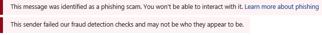

# Säkerhetstips i e-postmeddelanden i Office 365

Exchange Online Protection (EOP) och Office 365 skyddar dig med skräppost, nätfiske och förebyggande av skadlig kod. Idag är några av dessa attacker så välutformade att de ser legitima ut. Det räcker inte alltid att skicka meddelanden till mappen Skräppost. Nu, när du kontrollerar din e-post i Outlook eller Outlook på webben, kontrollerar EOP automatiskt avsändaren och lägger till ett säkerhetstips högst upp i e-postmeddelandet.

Säkerhetstipset – ett färgkodat meddelande – varnar dig för potentiellt skadliga meddelanden. De flesta meddelanden i inkorgen har inget säkerhetstips. Du ser dem bara när EOP och Office 365 har information som du behöver för att förhindra skräppost, nätfiske och malware-attacker. Om säkerhetstips visas i inkorgen kan du använda följande exempel för att lära dig mer om varje typ av säkerhetstips.

- Misstänkt post (röd säkerhetstips).

    

    Ett rött säkerhetstips i ett e-postmeddelande innebär att meddelandet du fick innehåller något misstänkt, till exempel ett nätfiskebedrägeri. Vi rekommenderar att du tar bort den här typen av e-postmeddelande från inkorgen utan att öppna det.

- Spam (gul säkerhetsspets).

    

    Ett gult säkerhetstips i ett e-postmeddelande innebär att meddelandet har markerats som skräppost. Om du inte känner igen och litar på meddelandets avsändare ska du inte hämta några bilagor eller bilder och klicka inte på några länkar i meddelandet. I Outlook på webben kan du klicka på **Det är inte skräppost** i det gula fältet i ett skräppostobjekt för att flytta meddelandet till inkorgen. Om det gula säkerhetstipset visas på ett meddelande som levererades till inkorgen finns det förmodligen där eftersom du har inaktiverat att flytta skräppost till mappen Skräppost.

- Säker post (grön säkerhetstips).

    

    Förutom osäkra meddelanden berättar vi även om giltiga meddelanden från avsändare som vi litar på med ett grönt säkerhetstips. Ett grönt säkerhetstips i ett e-postmeddelande innebär att vi har kontrollerat meddelandets avsändare och verifierat att det är säkert. Microsoft underhåller den här listan över betrodda avsändare som innehåller ekonomiska organisationer och andra som ofta förfalskas eller personifieras.

- Ofiltrerad e-post (grå säkerhetstips).

    

    Vi berättar också när vi hoppade över att kontrollera ett e-postmeddelande eftersom det kommer från en avsändare som du litar på i listan Betrodda avsändare eller om det finns en e-postflödesregel för att kringgå filtreringen.

    Den grå säkerhetstipset visas också när externa bilder blockeras, det vill säga meddelandet finns i inkorgen och verkar inte vara skräppost, men innehåller externa bilder som du inte har valt att hämta.

## Arbeta med säkerhetstips

Säkerhetstips är alltid aktiverade för Outlook på webben, även om inte alla meddelanden kommer att få ett. Office 365-administratörer kan inaktivera säkerhetstips för andra e-postklienter, till exempel Outlook. Mer information finns i [Aktivera eller inaktivera säkerhetstips i Office 365](enable-or-disable-safety-tips.md).

Om du inte håller med om hur Office 365 och EOP kategoriserade ett meddelande (det vill säga det är inte skräppost eller inte legitimt) kan du skicka meddelanden för analys för att göra din upplevelse bättre. Mer information finns i [Rapportera skräppost och nätfiskebedrägerier i Outlook på webben](report-junk-email-and-phishing-scams-in-outlook-on-the-web-eop.md). Du kan också klicka på länken Feedback i säkerhetstipset för att skicka kommentarer direkt till Microsoft för att hjälpa oss att förbättra.

## Se även

[Aktivera eller inaktivera säkerhetstips i Office 365](enable-or-disable-safety-tips.md)

