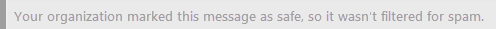

# Säkerhetstips i e-postmeddelandenSafety tips in email messages

Exchange Online Protection (EOP) och Microsoft 365 skyddar dig mot skräp post, nätfiske och skadlig program vara.Exchange Online Protection (EOP) and Microsoft 365 protect you with spam, phishing, and malware prevention. I dag är vissa av dessa attacker så väl utformade att de ser äkta ut.Today, some of these attacks are so well crafted that they look legitimate. Det räcker inte med att skicka meddelanden till mappen skräp post.Sending messages to the Junk Email folder isn't always enough. När du sedan checkar in din e-post i Outlook eller Outlook på webben eller en e-postklient kontrollerar EOP automatiskt avsändaren och lägger till ett säkerhets tips längst upp i e-postmeddelandet.Now, when you check your email in Outlook or Outlook on the web or any email client, EOP automatically checks the sender and adds a safety tip to the top of the email.

Säkerhets tips i Outlook är inte beroende av vilken version av Outlook du använder eftersom säkerhets tipset är knäckt och infogat direkt i meddelande texten.Safety tips in Outlook do not depend on what version of Outlook you're using because the safety tip is cracked open and inserted directly into the message body. Det innebär att säkerhets tipset visas i den e-postklient som du använder.This means that the safety tip will show up in whatever email client you're using. Den är klar på e-postfilter nivån och återges inte på e-postklientnivå, så den visas också i alla e-postklienter.It's done at the email filter level and not rendered at the mail client level, so not only does it show up in any version of Outlook, it also shows up in any email client.

Säkerhets tipset – ett färgkodat meddelande – varnar dig om potentiellt skadliga meddelanden.The safety tip—a color-coded message—will warn you about potentially harmful messages. De flesta meddelanden i Inkorgen har ingen säkerhets tips.Most messages in your inbox won't have a safety tip. Du kan bara se dem när EOP och Microsoft 365 har information som du behöver för att förhindra skräp post, nätfiske och skadlig program vara.You'll only see them when EOP and Microsoft 365 have information you need to help prevent spam, phishing, and malware attacks. Om säkerhets tips visas i Inkorgen kan du använda följande exempel för att lära dig mer om olika typer av säkerhets tips.If safety tips do show up on in your inbox, you can use the following examples to learn more about each type of safety tip.

- Misstänkt e-post (rött säkerhets tips).Suspicious mail (red safety tip).

    

    Ett rött säkerhets tips i ett e-postmeddelande betyder att meddelandet du fick innehåller något misstänkt, till exempel ett phishing-bedrägeri.A red safety tip in an email means that the message you received contains something suspicious, such as a phishing scam. Vi rekommenderar att du tar bort e-postmeddelandet från inkorgen utan att öppna det.We recommend that you delete this kind of email message from your inbox without opening it.

- Skräp post (gult säkerhets tips).Spam (yellow safety tip).

    

    Ett gult säkerhets tips i e-post betyder att meddelandet har marker ATS som skräp post.A yellow safety tip in an email means that the message has been marked as spam. Om du inte känner igen och litar på meddelandets avsändare kan du inte ladda ned bifogade filer eller bilder och inte klicka på några länkar i meddelandet.If you don't recognize and trust the sender of the message, don't download any attachments or pictures and don't click any links in the message. I Outlook på webben kan du klicka på **det är inte skräp** post i det gula fältet i en skräppost för att flytta meddelandet till Inkorgen.In Outlook on the web, you can click **It's not spam** in the yellow bar of a junk mail item to move the message to your inbox. Om det gula säkerhets tipset visas i ett meddelande som har levererats till din inkorg beror det förmodligen på att du har inaktiverat flyttning av skräp post till mappen skräp post.If the yellow safety tip appears on a message that was delivered to your inbox, it's probably there because you've disabled moving spam to your Junk Email folder.

- Säker e-post (grönt säkerhets tips).Safe mail (green safety tip).

    

    Förutom osäkra meddelanden berättar vi också om giltiga meddelanden från avsändare som vi litar på med ett grönt säkerhets tips.In addition to unsafe messages, we'll also tell you about valid messages from senders we trust with a green safety tip. Ett grönt säkerhets tips i ett e-postmeddelande innebär att vi kontrollerade avsändaren av meddelandet och kontrollerat att det är säkert.A green safety tip in an email means that we checked the sender of the message and verified that it's safe. Microsoft bevarar den här listan över betrodda avsändare som innehåller ekonomiska organisationer och andra som ofta är falska eller personifierade.Microsoft maintains this list of trusted senders which includes financial organizations and others that are frequently spoofed or impersonated.

- Ofiltrerad e-post (grå säkerhets tips).Unfiltered mail (gray safety tip).

    

    Vi meddelar dig när vi hoppade över kontrollen av ett e-postmeddelande eftersom det kommer från en avsändare som du litar på listan Betrodda avsändare eller om det finns en regel för att kringgå filtrering.We'll also tell you when we skipped checking a mail because it's from a sender you trust on your Safe Senders list or if a mail flow rule exists to bypass filtering.

    Det grå säkerhets tipset visas också när externa bilder blockeras, det vill säga att meddelandet finns i Inkorgen och inte verkar vara skräp post, men som innehåller externa bilder som du inte har valt att ladda ner.The gray safety tip also shows up when external images are blocked, that is, the message is in your inbox and doesn't appear to be spam, but contains external images that you haven't opted to download.

## Arbeta med säkerhets tipsWorking with safety tips

Säkerhets tips är alltid aktiverade för Outlook på webben, även om inte alla meddelanden kommer att ta emot något.Safety tips are always enabled for Outlook on the web, even though not every message will receive one. Administratörer kan stänga av säkerhets tips för andra e-postklienter, till exempel Outlook.Admins can turn safety tips off for other email clients such as Outlook. Mer information finns i [Konfigurera principer för skräppostskydd i Office 365](configure-your-spam-filter-policies.md).For more information, see [Configure anti-spam policies in Office 365](configure-your-spam-filter-policies.md).

Om du inte samtycker till hur EOP kategoriserade ett meddelande (det vill säga att meddelandet inte är skräp post eller om det har marker ATS som skräp post) kan du skicka meddelanden till Microsoft för analys för att förbättra upplevelsen.If you disagree with how EOP categorized a message (that is, the message is not spam or it should have been marked as spam), you can submit the messages to Microsoft for analysis to help make your experience better. Anvisningar finns i [rapportera meddelanden och filer till Microsoft](report-junk-email-messages-to-microsoft.md).For instructions, see [Report messages and files to Microsoft](report-junk-email-messages-to-microsoft.md). Du kan också klicka på länken feedback i säkerhets tipset och skicka kommentarer direkt till Microsoft för att hjälpa oss att förbättra.You can also click on the Feedback link in the safety tip to submit comments directly to Microsoft to help us improve.
