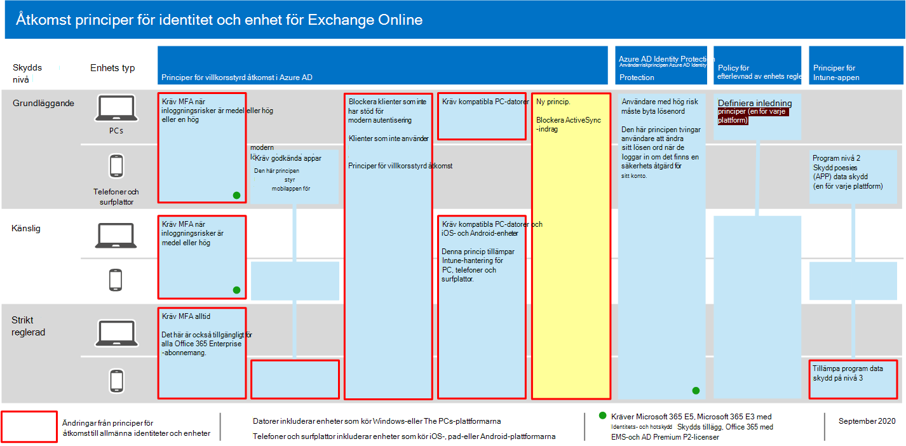

# <a name="policy-recommendations-for-securing-email"></a><span data-ttu-id="f2fa1-103">Policy rekommendationer för att skydda e-post</span><span class="sxs-lookup"><span data-stu-id="f2fa1-103">Policy recommendations for securing email</span></span>

<span data-ttu-id="f2fa1-104">I den här artikeln beskrivs hur du implementerar de rekommenderade principer för identitet och enheter för att skydda organisatoriska e-post-och e-postklienter som stöder modern och villkorlig åtkomst.</span><span class="sxs-lookup"><span data-stu-id="f2fa1-104">This article describes how to implement the recommended identity and device access policies to protect organizational email and email clients that support modern authentication and conditional access.</span></span> <span data-ttu-id="f2fa1-105">Den här vägledningen bygger på den [vanliga policyn för identitets-och enhets åtkomst](identity-access-policies.md) och innehåller dessutom ytterligare några rekommendationer.</span><span class="sxs-lookup"><span data-stu-id="f2fa1-105">This guidance builds on the [Common identity and device access policies](identity-access-policies.md) and also includes a few additional recommendations.</span></span>

<span data-ttu-id="f2fa1-106">Dessa rekommendationer är baserade på tre olika nivåer av säkerhet och skydd som kan användas baserat på hur olika behov fungerar: **bas linje**, **känslig**och **högreglerad**.</span><span class="sxs-lookup"><span data-stu-id="f2fa1-106">These recommendations are based on three different tiers of security and protection that can be applied based on the granularity of your needs: **baseline**, **sensitive**, and **highly regulated**.</span></span> <span data-ttu-id="f2fa1-107">Du kan läsa mer om de här säkerhets nivåerna och de rekommenderade klient operativ systemen som hänvisas till av de här rekommendationerna i de [rekommenderade säkerhets reglerna och konfigurationerna](microsoft-365-policies-configurations.md).</span><span class="sxs-lookup"><span data-stu-id="f2fa1-107">You can learn more about these security tiers, and the recommended client operating systems, referenced by these recommendations in the [recommended security policies and configurations introduction](microsoft-365-policies-configurations.md).</span></span>

<span data-ttu-id="f2fa1-108">Dessa rekommendationer kräver att användarna använder moderna e-postklienter, inklusive Outlook för iOS och Android på mobila enheter.</span><span class="sxs-lookup"><span data-stu-id="f2fa1-108">These recommendations require your users to use modern email clients, including Outlook for iOS and Android on mobile devices.</span></span> <span data-ttu-id="f2fa1-109">Outlook för iOS och Android tillhandahåller stöd för de bästa funktionerna i Office 365.</span><span class="sxs-lookup"><span data-stu-id="f2fa1-109">Outlook for iOS and Android provide support for the best features of Office 365.</span></span> <span data-ttu-id="f2fa1-110">Dessa mobila Outlook-appar är också utformad med säkerhets funktioner som har stöd för mobil användning och arbetar tillsammans med andra säkerhets funktioner för Microsoft Cloud.</span><span class="sxs-lookup"><span data-stu-id="f2fa1-110">These mobile Outlook apps are also architected with security capabilities that support mobile use and work together with other Microsoft cloud security capabilities.</span></span> <span data-ttu-id="f2fa1-111">Mer information finns i [vanliga frågor om Outlook för iOS och Android](https://docs.microsoft.com/exchange/clients-and-mobile-in-exchange-online/outlook-for-ios-and-android/outlook-for-ios-and-android-faq).</span><span class="sxs-lookup"><span data-stu-id="f2fa1-111">For more information, see [Outlook for iOS and Android FAQ](https://docs.microsoft.com/exchange/clients-and-mobile-in-exchange-online/outlook-for-ios-and-android/outlook-for-ios-and-android-faq).</span></span>

## <a name="update-common-policies-to-include-email"></a><span data-ttu-id="f2fa1-112">Uppdatera gemensamma principer för att inkludera e-post</span><span class="sxs-lookup"><span data-stu-id="f2fa1-112">Update common policies to include email</span></span>

<span data-ttu-id="f2fa1-113">För att skydda e-post visar följande diagram vilka principer som ska uppdateras från den vanliga policyn för identitets-och enhets åtkomst.</span><span class="sxs-lookup"><span data-stu-id="f2fa1-113">To protect email, the following diagram illustrates which policies to update from the the common identity and device access policies.</span></span>

<span data-ttu-id="f2fa1-114">[](https://github.com/MicrosoftDocs/microsoft-365-docs/raw/public/microsoft-365/media/microsoft-365-policies-configurations/identity-access-ruleset-mail.png)</span><span class="sxs-lookup"><span data-stu-id="f2fa1-114">[](https://github.com/MicrosoftDocs/microsoft-365-docs/raw/public/microsoft-365/media/microsoft-365-policies-configurations/identity-access-ruleset-mail.png)</span></span>

[<span data-ttu-id="f2fa1-115">Visa en större version av bilden</span><span class="sxs-lookup"><span data-stu-id="f2fa1-115">See a larger version of this image</span></span>](https://github.com/MicrosoftDocs/microsoft-365-docs/raw/public/microsoft-365/media/microsoft-365-policies-configurations/identity-access-ruleset-mail.png)

<span data-ttu-id="f2fa1-116">Observera att en ny princip för Exchange Online läggs till för att blockera ActiveSync-klienter.</span><span class="sxs-lookup"><span data-stu-id="f2fa1-116">Note the addition of a new policy for Exchange Online to block ActiveSync clients.</span></span> <span data-ttu-id="f2fa1-117">Detta framtvingar användning av Outlook Mobile.</span><span class="sxs-lookup"><span data-stu-id="f2fa1-117">This forces the use of Outlook mobile.</span></span>

<span data-ttu-id="f2fa1-118">Om du har inkluderat Exchange Online och Outlook enligt principernas omfattning när du ställer in dem behöver du bara skapa den nya principen för att blockera ActiveSync-klienter.</span><span class="sxs-lookup"><span data-stu-id="f2fa1-118">If you included Exchange Online and Outlook in the scope of the policies when you set them up, you only need to create the new policy to block ActiveSync clients.</span></span> <span data-ttu-id="f2fa1-119">Granska de principer som visas i tabellen nedan och gör de rekommenderade tilläggen, eller bekräfta att dessa redan är med.</span><span class="sxs-lookup"><span data-stu-id="f2fa1-119">Review the policies listed in the following table and either make the recommended additions, or confirm that these are already included.</span></span> <span data-ttu-id="f2fa1-120">Varje princip länkar till de associerade konfigurations anvisningarna i [vanliga principer för identitets-och enhets åtkomst](identity-access-policies.md).</span><span class="sxs-lookup"><span data-stu-id="f2fa1-120">Each policy links to the associated configuration instructions in [Common identity and device access policies](identity-access-policies.md).</span></span>

|<span data-ttu-id="f2fa1-121">Skydds nivå</span><span class="sxs-lookup"><span data-stu-id="f2fa1-121">Protection level</span></span>|<span data-ttu-id="f2fa1-122">Principerna</span><span class="sxs-lookup"><span data-stu-id="f2fa1-122">Policies</span></span>|<span data-ttu-id="f2fa1-123">Mer information</span><span class="sxs-lookup"><span data-stu-id="f2fa1-123">More information</span></span>|
|:---------------|:-------|:----------------|
|<span data-ttu-id="f2fa1-124">**Grundläggande**</span><span class="sxs-lookup"><span data-stu-id="f2fa1-124">**Baseline**</span></span>|[<span data-ttu-id="f2fa1-125">Kräv MFA när en inloggnings risk är *mellan* eller *hög*</span><span class="sxs-lookup"><span data-stu-id="f2fa1-125">Require MFA when sign-in risk is *medium* or *high*</span></span>](identity-access-policies.md#require-mfa-based-on-sign-in-risk)|<span data-ttu-id="f2fa1-126">Inkludera Exchange Online i tilldelning av moln program</span><span class="sxs-lookup"><span data-stu-id="f2fa1-126">Include Exchange Online in the assignment of cloud apps</span></span>|
|        |[<span data-ttu-id="f2fa1-127">Blockera klienter som inte har stöd för modern autentisering</span><span class="sxs-lookup"><span data-stu-id="f2fa1-127">Block clients that don't support modern authentication</span></span>](identity-access-policies.md#block-clients-that-dont-support-modern-authentication)|<span data-ttu-id="f2fa1-128">Inkludera Exchange Online i tilldelning av moln program</span><span class="sxs-lookup"><span data-stu-id="f2fa1-128">Include Exchange Online in the assignment of cloud apps</span></span>|
|        |[<span data-ttu-id="f2fa1-129">Tillämpa program data skydds policy</span><span class="sxs-lookup"><span data-stu-id="f2fa1-129">Apply APP data protection policies</span></span>](identity-access-policies.md#apply-app-data-protection-policies)|<span data-ttu-id="f2fa1-130">Kontrol lera att Outlook ingår i listan med program.</span><span class="sxs-lookup"><span data-stu-id="f2fa1-130">Be sure Outlook is included in the list of apps.</span></span> <span data-ttu-id="f2fa1-131">Se till att uppdatera policyn för varje plattform (iOS, Android, Windows)</span><span class="sxs-lookup"><span data-stu-id="f2fa1-131">Be sure to update the policy for each platform (iOS, Android, Windows)</span></span>|
|        |[<span data-ttu-id="f2fa1-132">Kräv godkända appar och program skydd</span><span class="sxs-lookup"><span data-stu-id="f2fa1-132">Require approved apps and APP protection</span></span>](identity-access-policies.md#require-approved-apps-and-app-protection)|<span data-ttu-id="f2fa1-133">Ta med Exchange Online i listan med moln program</span><span class="sxs-lookup"><span data-stu-id="f2fa1-133">Include Exchange Online in the list of cloud apps</span></span>|
|        |[<span data-ttu-id="f2fa1-134">Kräv kompatibla PC-datorer</span><span class="sxs-lookup"><span data-stu-id="f2fa1-134">Require compliant PCs</span></span>](identity-access-policies.md#require-compliant-pcs-but-not-compliant-phones-and-tablets)|<span data-ttu-id="f2fa1-135">Ta med Exchange Online i listan över moln program</span><span class="sxs-lookup"><span data-stu-id="f2fa1-135">Include Exchange Online in list of cloud apps</span></span>|
|        |[<span data-ttu-id="f2fa1-136">Blockera ActiveSync-klienter</span><span class="sxs-lookup"><span data-stu-id="f2fa1-136">Block ActiveSync clients</span></span>](#block-activesync-clients)|<span data-ttu-id="f2fa1-137">Lägg till den här nya principen</span><span class="sxs-lookup"><span data-stu-id="f2fa1-137">Add this new policy</span></span>| 
|<span data-ttu-id="f2fa1-138">**Känslig**</span><span class="sxs-lookup"><span data-stu-id="f2fa1-138">**Sensitive**</span></span>|[<span data-ttu-id="f2fa1-139">Kräv MFA när en inloggnings risk är *låg*, *medium* eller *hög*</span><span class="sxs-lookup"><span data-stu-id="f2fa1-139">Require MFA when sign-in risk is *low*, *medium* or *high*</span></span>](identity-access-policies.md#require-mfa-based-on-sign-in-risk)| <span data-ttu-id="f2fa1-140">Inkludera Exchange Online i tilldelning av moln program</span><span class="sxs-lookup"><span data-stu-id="f2fa1-140">Include Exchange Online in the assignment of cloud apps</span></span>|
|         |[<span data-ttu-id="f2fa1-141">Kräv kompatibla datorer *och* mobila enheter</span><span class="sxs-lookup"><span data-stu-id="f2fa1-141">Require compliant PCs *and* mobile devices</span></span>](identity-access-policies.md#require-compliant-pcs-and-mobile-devices)|<span data-ttu-id="f2fa1-142">Ta med Exchange Online i listan med moln program</span><span class="sxs-lookup"><span data-stu-id="f2fa1-142">Include Exchange Online in the list of cloud apps</span></span>|
|<span data-ttu-id="f2fa1-143">**Strikt reglerad**</span><span class="sxs-lookup"><span data-stu-id="f2fa1-143">**Highly regulated**</span></span>|[<span data-ttu-id="f2fa1-144">Kräv *alltid* MFA</span><span class="sxs-lookup"><span data-stu-id="f2fa1-144">*Always* require MFA</span></span>](identity-access-policies.md#require-mfa-based-on-sign-in-risk)|<span data-ttu-id="f2fa1-145">Inkludera Exchange Online i tilldelning av moln program</span><span class="sxs-lookup"><span data-stu-id="f2fa1-145">Include Exchange Online in the assignment of cloud apps</span></span>|

## <a name="block-activesync-clients"></a><span data-ttu-id="f2fa1-146">Blockera ActiveSync-klienter</span><span class="sxs-lookup"><span data-stu-id="f2fa1-146">Block ActiveSync clients</span></span>

<span data-ttu-id="f2fa1-147">Den här principen hindrar ActiveSync-klienter från att kringgå andra principer för villkorsstyrd åtkomst.</span><span class="sxs-lookup"><span data-stu-id="f2fa1-147">This policy prevents ActiveSync clients from bypassing other Conditional Access policies.</span></span> <span data-ttu-id="f2fa1-148">Princip konfigurationen gäller endast för ActiveSync-klienter.</span><span class="sxs-lookup"><span data-stu-id="f2fa1-148">The policy configuration applies only to ActiveSync clients.</span></span> <span data-ttu-id="f2fa1-149">Om du väljer **[Kräv program skydds princip](https://docs.microsoft.com/azure/active-directory/conditional-access/concept-conditional-access-grant#require-app-protection-policy)** spärrar den här principen ActiveSync-klienter.</span><span class="sxs-lookup"><span data-stu-id="f2fa1-149">By selecting **[Require app protection policy](https://docs.microsoft.com/azure/active-directory/conditional-access/concept-conditional-access-grant#require-app-protection-policy)**, this policy blocks ActiveSync clients.</span></span> <span data-ttu-id="f2fa1-150">Information om hur du skapar den här principen finns i [Kräv program skydds princip för Cloud App Access med villkorlig åtkomst](https://docs.microsoft.com/azure/active-directory/conditional-access/app-protection-based-conditional-access).</span><span class="sxs-lookup"><span data-stu-id="f2fa1-150">Details on creating this policy can be found in [Require app protection policy for cloud app access with Conditional Access](https://docs.microsoft.com/azure/active-directory/conditional-access/app-protection-based-conditional-access).</span></span>

- <span data-ttu-id="f2fa1-151">Följ anvisningarna i "steg 2: Konfigurera en princip för villkorsstyrd åtkomst för Azure AD för Exchange Online med ActiveSync (EAS)" i [Scenario 1: Office 365-appar kräver godkända appar med program skydds principer](https://docs.microsoft.com/azure/active-directory/conditional-access/app-protection-based-conditional-access#scenario-1-office-365-apps-require-approved-apps-with-app-protection-policies), som hindrar Exchange ActiveSync-klienterna från att ansluta till Exchange Online.</span><span class="sxs-lookup"><span data-stu-id="f2fa1-151">Follow "Step 2: Configure an Azure AD Conditional Access policy for Exchange Online with ActiveSync (EAS)" in [Scenario 1: Office 365 apps require approved apps with app protection policies](https://docs.microsoft.com/azure/active-directory/conditional-access/app-protection-based-conditional-access#scenario-1-office-365-apps-require-approved-apps-with-app-protection-policies), which prevents Exchange ActiveSync clients leveraging basic authentication from connecting to Exchange Online.</span></span>

<span data-ttu-id="f2fa1-152">Du kan också använda autentiseringsprinciper för att [Inaktivera grundläggande](https://docs.microsoft.com/exchange/clients-and-mobile-in-exchange-online/disable-basic-authentication-in-exchange-online)åtkomst, vilket tvingar alla klient åtkomst förfrågningar att använda modern verifikation.</span><span class="sxs-lookup"><span data-stu-id="f2fa1-152">You can also use authentication policies to [disable Basic authentication](https://docs.microsoft.com/exchange/clients-and-mobile-in-exchange-online/disable-basic-authentication-in-exchange-online), which forces all client access requests to use modern authentication.</span></span>

## <a name="limit-access-to-exchange-online-from-outlook-on-the-web"></a><span data-ttu-id="f2fa1-153">Begränsa åtkomsten till Exchange Online från Outlook på webben</span><span class="sxs-lookup"><span data-stu-id="f2fa1-153">Limit access to Exchange Online from Outlook on the web</span></span>

<span data-ttu-id="f2fa1-154">Du kan begränsa möjligheten för användare att ladda ned bifogade filer från Outlook på webben på umnanaged-enheter.</span><span class="sxs-lookup"><span data-stu-id="f2fa1-154">You can restrict the ability for users to download attachments from Outlook on the web on umnanaged devices.</span></span> <span data-ttu-id="f2fa1-155">Användare på dessa enheter kan visa och redigera de här filerna med Office Online utan att läcka och lagra filerna på enheten.</span><span class="sxs-lookup"><span data-stu-id="f2fa1-155">Users on these devices can view and edit these files using Office Online without leaking and storing the files on the device.</span></span> <span data-ttu-id="f2fa1-156">Du kan också hindra användare från att se bilagor på en enhet som inte hanteras.</span><span class="sxs-lookup"><span data-stu-id="f2fa1-156">You can also block users from seeing attachments on an unmanaged device.</span></span>

<span data-ttu-id="f2fa1-157">Här är stegen:</span><span class="sxs-lookup"><span data-stu-id="f2fa1-157">Here are the steps:</span></span>

1. <span data-ttu-id="f2fa1-158">[Ansluta till en Exchange Online-Fjärrpowershell-session](https://docs.microsoft.com/powershell/exchange/exchange-online/connect-to-exchange-online-powershell/connect-to-exchange-online-powershell).</span><span class="sxs-lookup"><span data-stu-id="f2fa1-158">[Connect to an Exchange Online Remote PowerShell session](https://docs.microsoft.com/powershell/exchange/exchange-online/connect-to-exchange-online-powershell/connect-to-exchange-online-powershell).</span></span>
2. <span data-ttu-id="f2fa1-159">Om du inte redan har en princip för OWA-postlådan skapar du en med cmdleten [New-OwaMailboxPolicy](https://docs.microsoft.com/powershell/module/exchange/new-owamailboxpolicy) .</span><span class="sxs-lookup"><span data-stu-id="f2fa1-159">If you don't already have an OWA mailbox policy, create one with the [New-OwaMailboxPolicy](https://docs.microsoft.com/powershell/module/exchange/new-owamailboxpolicy) cmdlet.</span></span>
3. <span data-ttu-id="f2fa1-160">Om du vill tillåta visning av bifogade filer men inte nedladdning använder du det här kommandot:</span><span class="sxs-lookup"><span data-stu-id="f2fa1-160">If you want to allow viewing of attachments but no downloading, use this command:</span></span>

   ```powershell
   Set-OwaMailboxPolicy -Identity Default -ConditionalAccessPolicy ReadOnly
   ```

4. <span data-ttu-id="f2fa1-161">Om du vill blockera bifogade filer använder du det här kommandot:</span><span class="sxs-lookup"><span data-stu-id="f2fa1-161">If you want to block attachments, use this command:</span></span>

   ```powershell
   Set-OwaMailboxPolicy -Identity Default -ConditionalAccessPolicy ReadOnlyPlusAttachmentsBlocked
   ```

4. <span data-ttu-id="f2fa1-162">I Azure-portalen skapar du en ny princip för villkorsstyrd åtkomst med följande inställningar:</span><span class="sxs-lookup"><span data-stu-id="f2fa1-162">In the Azure portal, create a new Conditional Access policy with these settings:</span></span>

   <span data-ttu-id="f2fa1-163">**Uppgifter > användare och grupper**: Välj lämpliga användare och grupper att inkludera och exkludera.</span><span class="sxs-lookup"><span data-stu-id="f2fa1-163">**Assignments > Users and groups**: Select appropriate users and groups to include and exclude.</span></span>

   <span data-ttu-id="f2fa1-164">**Uppgifter > molnappar eller åtgärder > moln program > > Välj appar**: välj **Office 365 Exchange Online**</span><span class="sxs-lookup"><span data-stu-id="f2fa1-164">**Assignments > Cloud apps or actions > Cloud apps > Include > Select apps**: Select **Office 365 Exchange Online**</span></span>

   <span data-ttu-id="f2fa1-165">**Åtkomst kontroller > session**: Välj **Använd program begränsningar**</span><span class="sxs-lookup"><span data-stu-id="f2fa1-165">**Access controls > Session**: Select **Use app enforced restrictions**</span></span>

## <a name="require-that-ios-and-android-devices-must-use-outlook"></a><span data-ttu-id="f2fa1-166">Kräv att iOS-och Android-enheter måste använda Outlook</span><span class="sxs-lookup"><span data-stu-id="f2fa1-166">Require that iOS and Android devices must use Outlook</span></span>

<span data-ttu-id="f2fa1-167">För att säkerställa att användare av iOS-och Android-enheter endast kan komma åt arbets-eller skol innehåll med Outlook för iOS och Android behöver du en princip för villkorsstyrd åtkomst som är avsedd för de potentiella användarna.</span><span class="sxs-lookup"><span data-stu-id="f2fa1-167">To ensure that users of iOS and Android devices can only access work or school content using Outlook for iOS and Android, you need a Conditional Access policy that targets those potential users.</span></span>

<span data-ttu-id="f2fa1-168">Se anvisningarna för att konfigurera den här principen i [Hantera åtkomst till samarbeten med hjälp av Outlook för iOS och Android]( https://docs.microsoft.com/mem/intune/apps/app-configuration-policies-outlook#apply-conditional-access).</span><span class="sxs-lookup"><span data-stu-id="f2fa1-168">See the steps to configure this policy in [Manage messaging collaboration access by using Outlook for iOS and Android]( https://docs.microsoft.com/mem/intune/apps/app-configuration-policies-outlook#apply-conditional-access).</span></span>


## <a name="set-up-message-encryption"></a><span data-ttu-id="f2fa1-169">Konfigurera meddelande kryptering</span><span class="sxs-lookup"><span data-stu-id="f2fa1-169">Set up message encryption</span></span>

<span data-ttu-id="f2fa1-170">Med de nya funktionerna för Office 365 Message Encryption (OME), som utnyttjar skydds funktionerna i Azure information Protection, kan din organisation enkelt dela skyddat e-postmeddelande med alla på valfri enhet.</span><span class="sxs-lookup"><span data-stu-id="f2fa1-170">With the new Office 365 Message Encryption (OME) capabilities, which leverage the protection features in Azure Information Protection, your organization can easily share protected email with anyone on any device.</span></span> <span data-ttu-id="f2fa1-171">Användare kan skicka och ta emot skyddade meddelanden med andra Microsoft 365-organisationer samt icke-kunder som använder Outlook.com, Gmail och andra e-posttjänster.</span><span class="sxs-lookup"><span data-stu-id="f2fa1-171">Users can send and receive protected messages with other Microsoft 365 organizations as well as non-customers using Outlook.com, Gmail, and other email services.</span></span>

<span data-ttu-id="f2fa1-172">Mer information finns i [Konfigurera nya funktioner för kryptering av Office 365-meddelanden](https://docs.microsoft.com/microsoft-365/compliance/set-up-new-message-encryption-capabilities).</span><span class="sxs-lookup"><span data-stu-id="f2fa1-172">For more information, see [Set up new Office 365 Message Encryption capabilities](https://docs.microsoft.com/microsoft-365/compliance/set-up-new-message-encryption-capabilities).</span></span>

## <a name="next-steps"></a><span data-ttu-id="f2fa1-173">Nästa steg</span><span class="sxs-lookup"><span data-stu-id="f2fa1-173">Next steps</span></span>


<span data-ttu-id="f2fa1-175">Konfigurera principer för villkorsstyrd åtkomst för:</span><span class="sxs-lookup"><span data-stu-id="f2fa1-175">Configure Conditional Access policies for:</span></span>

- [<span data-ttu-id="f2fa1-176">Microsoft Teams</span><span class="sxs-lookup"><span data-stu-id="f2fa1-176">Microsoft Teams</span></span>](teams-access-policies.md)
- [<span data-ttu-id="f2fa1-177">SharePoint</span><span class="sxs-lookup"><span data-stu-id="f2fa1-177">SharePoint</span></span>](sharepoint-file-access-policies.md)
